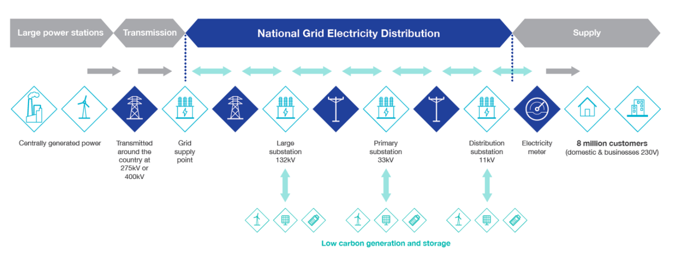

# Philosophy

The code in this git repository is the research component of **NGED Flexpectation**, an NIA-funded innovation project with National Grid Electricity Distribution (NGED), a distribution network operator (DNO) in Great Britain. The project is run by [Open Climate Fix](https://openclimatefix.org/).

## NGED's Network

NGED's network (as of May 2026) consists of:

- 1,161 primary substations (33/11 kV and 66/11 kV)
- 271 bulk supply points / BSPs (132/33 kV and 132/66 kV)
- 52 grid supply points / GSPs (400/132 kV and 275/132 kV)
- ~1,500 industrial customer generators (not domestic); roughly 558 at 33 kV or 132 kV connected to GSP/BSP busbars, and ~1,000 on the 11 kV network downstream of primaries

## Phased Rollout

**Version 1** (current focus): 32 time series in NGED's trial area — 16 primary substations, 6 solar PV farms (5 EHV, 1 HV), 3 wind farms, 2 GSPs, 2 BSPs, 1 biofuel generator, 1 BESS, and 1 reciprocating gas generator. All implemented with a single XGBoost model family.

**Version 2** (future): Scale to approximately 2,500 time series (all of NGED's primary substations, BSPs, GSPs, and most customer meters). See [Roadmap](../roadmap/index.md).

## Core Objectives

* Probabilistic, half-hourly, 14-day horizon forecasts updated every 6 hours.
* Cover substations (primary, BSP, GSP), metered generators (solar PV, wind, BESS, etc.), and customer meters.
* Automatically detect and compensate for **switching events** — where power is diverted from one substation to another due to maintenance, changing the local demand signature.
* Track the **effective capacity** of metered generators over time (turbine failures, inverter faults, PV panel degradation), ignoring NGED-imposed ANM curtailment.
* Automatically detect and flag **faulty metering** (stuck values, physically impossible values, missing data).

## Stretch Goals

* Model and forecast *unmetered* solar PV and wind power on each primary substation by disaggregating net power flow.
* Disaggregate and forecast other distributed energy resources (DERs): EV chargers, heat pumps, price-sensitive batteries.

## Design Philosophy

The architecture prioritises developer velocity, idempotent re-runs, and strict **Training-Serving Symmetry**.

The primary aim is to develop novel, ambitious, state-of-the-art ML approaches to forecasting. We are simultaneously building a "test-harness" production service so that ML research runs in a production-like environment from day one.

The aim is to manage the *entire* data pipeline in Dagster: download data, validate data, train ML models, run inference, perform backtests. MLflow tracks every experiment. Re-running a backtest should be as easy as clicking a button in Dagster. Swapping a new model into production should require minimal friction.

## Data Quality Challenges

NGED's distribution-level data is considerably messier than transmission-level data. Key issues observed in the trial area:

- **Early ramp-up period**: The first couple of months after a meter is installed tend to have poor data quality. We drop the first two months of each time series.
- **False zeros**: Substation time series occasionally report zero when the true value is non-zero. These are identifiable because they are isolated amongst non-zero values.
- **Stuck values**: Some time series go "stuck" for hours or days (standard deviation near zero over a 24-hour window).
- **Missing data**: Gaps range from a few half-hours to months. Solar farms frequently have no data overnight (expected), but also have unexplained daytime gaps.
- **Apparent power (MVA) metering**: Some substations only have MVA meters, which report the *absolute value* of power flow — they cannot detect direction. When generation exceeds demand and power flows "backwards", the MVA reading increases rather than going negative. This "bouncing off zero" behaviour looks like a demand increase but is actually reverse power flow.
- **Switching events**: Power is periodically diverted from one substation to another during maintenance or in response to faults ("abnormal running arrangement"). Each substation spends roughly 10% of its operating time in an abnormal arrangement. This severely biases lagged-power features (the single most informative feature for demand forecasting) if not detected and handled. Recovering the demand that *would* have been metered under the normal running arrangement is the subject of [switching events & latent demand](../roadmap/switching-events.md) (v0.6 detector → v2 mixture models).

## Forecast Delivery

OCF delivers forecasts as **Delta Lake tables on AWS S3**, updated every 6 hours. Delta Lake provides ACID transactions, meaning NGED never reads an incomplete forecast. The tables are designed as "building blocks" that NGED can combine to construct:

- A **Normal Operation Forecast** (MW or MVA): the [−1, +1] forecast multiplied by the site's nominal capacity. Assumes the grid is in a normal running arrangement with all generators at full unconstrained capacity.
- A **Prevailing Conditions Forecast** (MW or MVA): the [−1, +1] forecast multiplied by the most recently observed effective capacity, reflecting current switching state and any reduced generator capacity.
