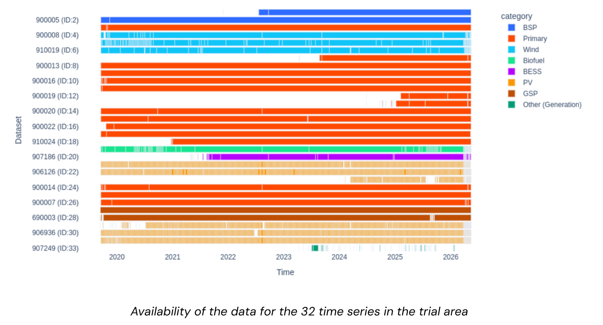
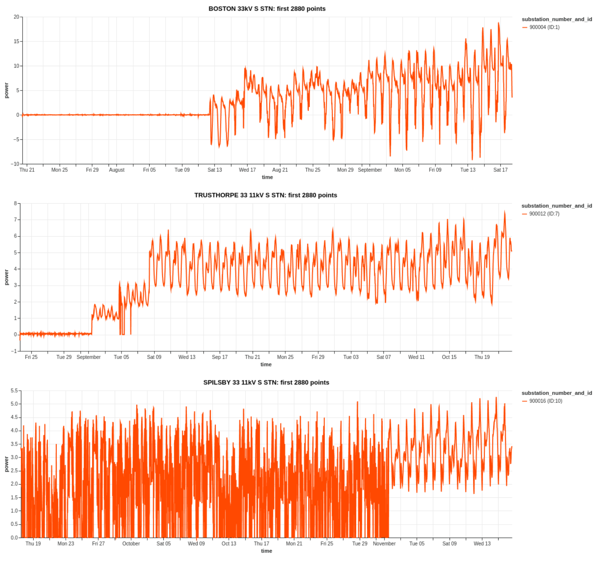
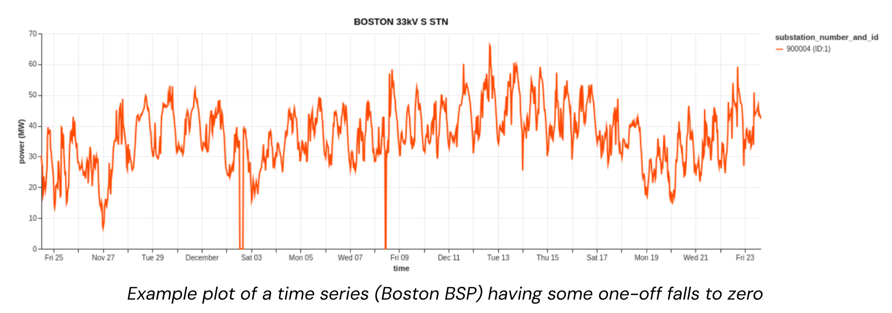
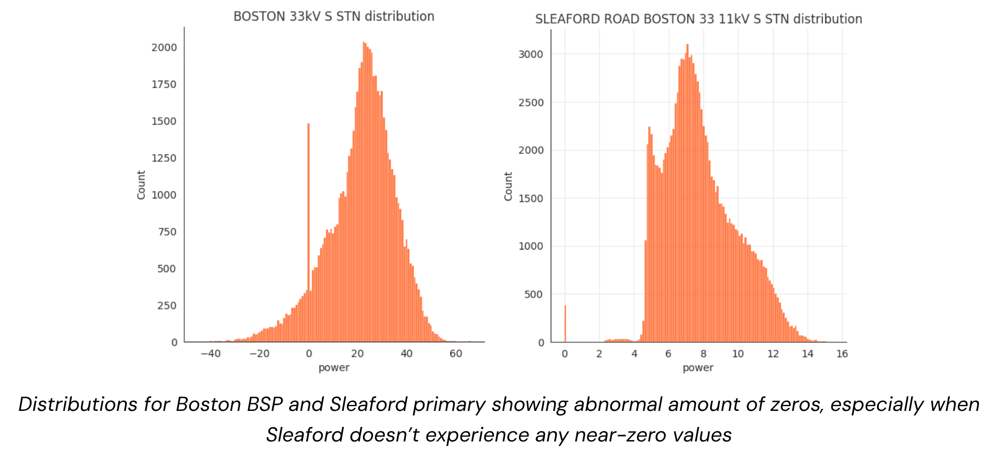
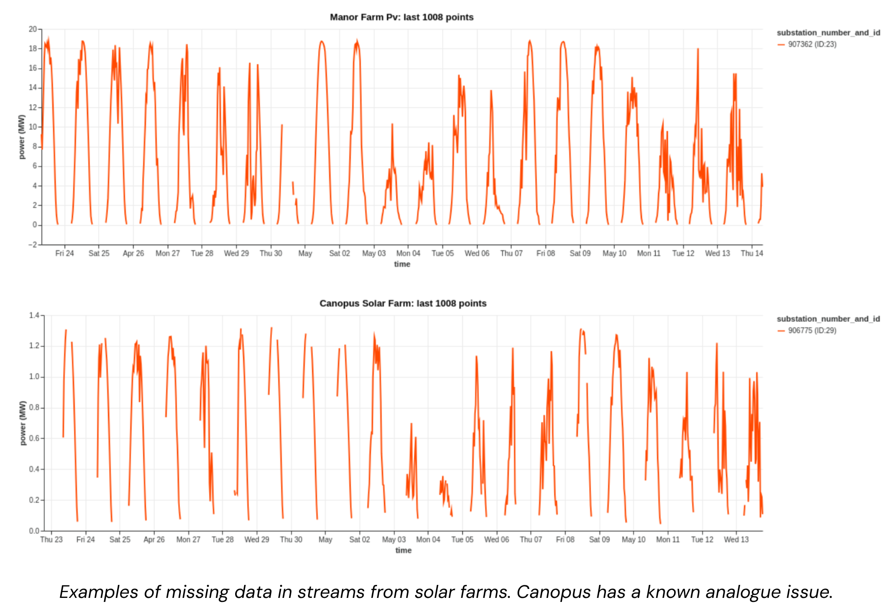
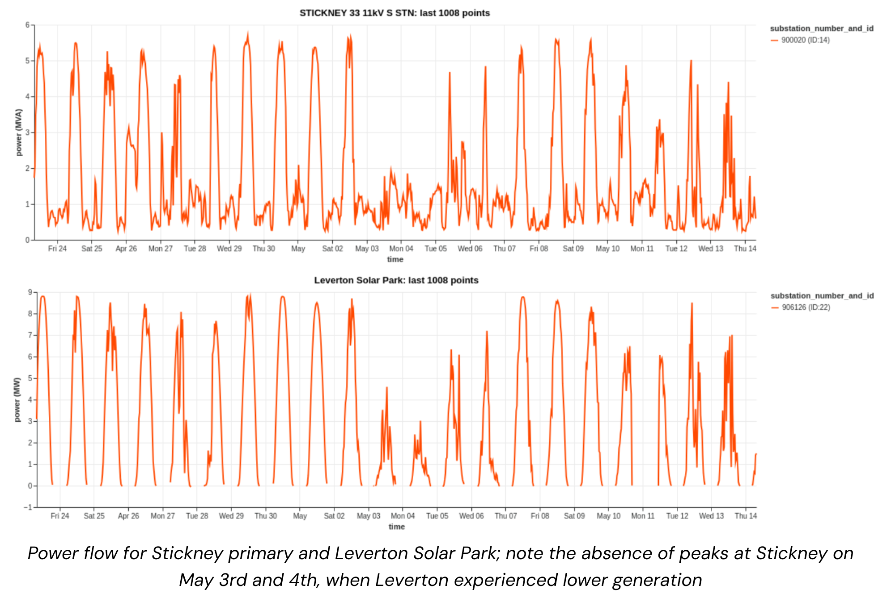

# Data Quality Challenges

NGED's distribution-level data is considerably messier than transmission-level data. Key issues observed in the trial area:

## NGED Data Availability
Availability of the data for the 32 time series in the trial area:

## Early ramp-up period
The first couple of months after a meter is installed tend to have poor data quality. This is handled by simply dropping the first two months of each time series. 

## False zeros
Substation time series occasionally report zero when the true value is non-zero. These are identifiable because they are isolated amongst non-zero values. . 

## Stuck values
Some time series go "stuck" for hours or days (standard deviation near zero over a 24-hour window).

## Missing data
Gaps range from a few half-hours to months. Solar farms frequently have no data overnight (expected), but also have unexplained daytime gaps. 

## Apparent power (MVA) metering
Some substations only have MVA meters, which report the *absolute value* of power flow — they cannot detect direction. When generation exceeds demand and power flows "backwards", the MVA reading increases rather than going negative. This "bouncing off zero" behaviour looks like a demand increase but is actually reverse power flow. The following figure shows power flow for Stickney primary and Leverton Solar Park; note the absence of peaks at Stickney primary on May 3rd and 4th when Leverton experienced lower generation: 

## Switching events
Power is periodically diverted from one substation to another during maintenance or in response to faults ("abnormal running arrangement"). Each substation spends roughly 10% of its operating time in an abnormal arrangement. This severely biases lagged-power features (the single most informative feature for demand forecasting) if not detected and handled. Recovering the demand that *would* have been metered under the normal running arrangement is described in [Switching Events](switching-events.md); the staged solution plan is in the [roadmap](../roadmap/switching-events.md) (v0.6 detector → v2 mixture models).

See the ["Data sources" section of our Milestone 1 report](https://docs.google.com/document/d/1UF-mjfSdQfQxefAunDqEOr_GyYTjSlGk4EeuiNoXAxk/edit?tab=t.0#heading=h.etqoj9ahy92h) for a more detailed discussion, and plenty of graphs!
