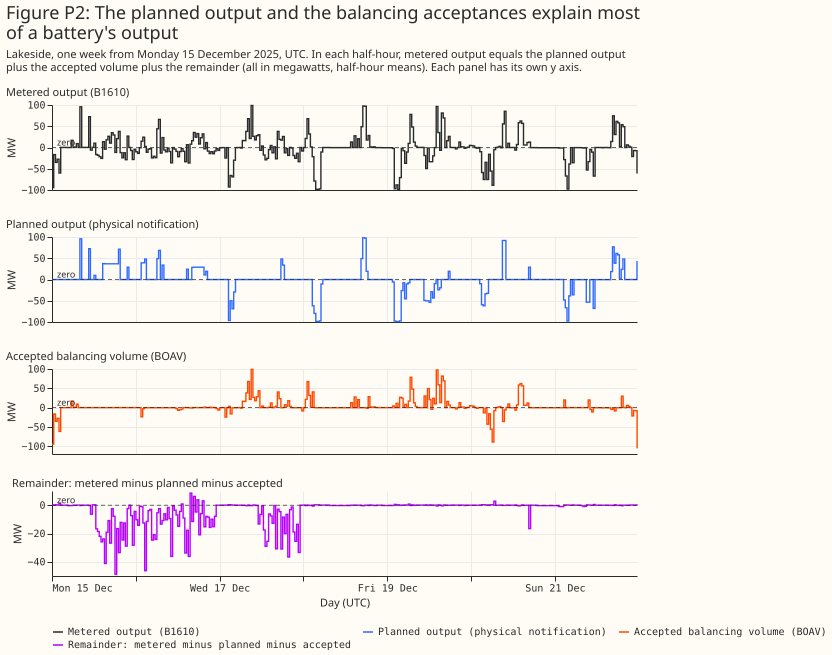
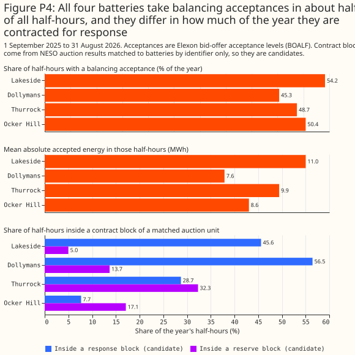
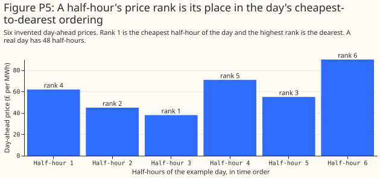

# How GB batteries schedule themselves

**This page explains how the operator of a battery in Great Britain (GB) decides when to charge and
discharge, which of those decisions are visible in public data, and which must be inferred.** The
data come from a year of four public batteries, from 1 September 2025 to 31 August 2026. The page is
background for the [battery and solar separation study](../studies/battery-pv-separation.md). The
prices a battery reacts to are described on [GB electricity prices: which are free and when each is
known](gb-price-data-and-ancillary-markets.md).

**Besides wholesale trading, a battery deals in three markets: frequency response, the Balancing
Mechanism (BM), and imbalance settlement.** Frequency response is a contract in which a battery
changes its output within seconds to hold the grid frequency near 50 Hz. The Balancing Mechanism
(BM) is the market in which the National Energy System Operator (NESO) buys changes in output close
to delivery, by accepting a generator's offer to produce more or a battery's bid to take energy in.
Imbalance is the difference between what a party traded and what its meter recorded, settled at the
system price.

**A GB battery earns most of its revenue from wholesale arbitrage and from frequency response.**
Wholesale arbitrage means buying energy when it is cheap and selling it when it is dear. In the Modo
Energy index for 2-hour batteries, [August
2026](https://modoenergy.com/research/gb-bess-revenues-august-2026-balancing-mechanism-offer-dispatch-rate-skips)
paid £56,000 per MW per year in total: wholesale £44,000, frequency response £16,000, BM −£17,000,
imbalance £4,000, reserve £3,000, and Capacity Market £6,000. [September
2026](https://modoenergy.com/research/en/gb-bess-revenues-september-2026-wholesale-record-gas-wind-spreads)
paid £99,000: wholesale £68,000, frequency response £28,000, BM −£8,000, imbalance £2,000, reserve
£3,000, and Capacity Market £6,000. The BM line is negative because accepted bids cost the battery
money. The July 2026 Modo Energy article says that batteries "spent more than ever before buying
energy through the Balancing Mechanism" ([Modo Energy, July
2026](https://modoenergy.com/research/en/gb-bess-revenues-july-2026-wholesale-record-balancing-mechanism-bid-volumes)).
The July breakdown is behind a subscription. That the battery recovers the cost by selling the
energy later in the wholesale market is our reading, not a statement in the article. [Cornwall
Insight](https://cornwall-insight.com/thought-leadership/blog/riding-the-battery-storage-revenue-rollercoaster)
describes the shift from response to wholesale.

**On a typical day the four batteries charge in the cheap half-hours and export in the dear
half-hours.** The four are Lakeside (T_LKSDB-1), Dollymans (E_DOLLB-1), Thurrock (T_THURB-1), and
Ocker Hill (T_OCHLB-1), all public Balancing Mechanism Units (BMUs), shown for 1 September 2025 to
31 August 2026 in Coordinated Universal Time (UTC). Summer prices peak later and higher than winter
prices, and the export peak moves with them.

**The planned output and the accepted balancing volumes explain most of a battery's output.**
Metered output equals the planned output (the physical notification), plus the volume of balancing
acceptances, plus a remainder. Figure P2 shows one week of the decomposition for one battery. Over
the year, the planned output alone explains 29.2% to 36.3% of the variance of output across the four
batteries, and the planned output plus the accepted volumes explains 81.4% to 97.2% ([battery and
solar separation study](../studies/battery-pv-separation.md#rung-1-one-real-battery)). Wholesale
trading shows in the planned output, and frequency response shows in the remainder.

**The remainder is large inside frequency-response contract blocks, and mostly when frequency is
high.** A contract block is a delivery period in which a battery holds a frequency-response
contract. Lakeside's remainder has a standard deviation of 11.4 MW inside blocks and 4.8 MW outside.
In half-hours with frequency at least 0.08 Hz above 50, inside a block, Lakeside's mean remainder is
−26.9 MW. Negative output is import (charging). The contract blocks come from matching NESO auction
units to batteries by identifier only, so every block here is a candidate.

**All four batteries take balancing acceptances in about half of all half-hours.** The share is
45.3% to 54.2%. The batteries differ in how much of the year they sit inside a candidate response
block (7.7% to 56.5%) and a candidate reserve block (5.0% to 32.3%).

## Four scheduling algorithms

**Four algorithms summarise what the operator and analyst sources we read say battery optimisers
do.** No published study of GB batteries that we found fits a dispatch model to metered battery
output. Of the papers we found, [Bian et al.](https://arxiv.org/abs/2306.11872) give the closest
method, inverse optimisation (inferring an optimiser's objective from what it did). The four
algorithms below are our plain-language summary of operator and analyst descriptions, and the
[battery and solar separation study](../studies/battery-pv-separation.md) uses only the first.

1. **Day-ahead arbitrage.** Take tomorrow's 48 day-ahead prices. Start from the expected state of
   charge at midnight. Choose a charge or discharge power for each half-hour to maximise revenue
   from discharging, minus the cost of charging and a wear charge per MWh. Keep the state of charge
   between about 5% and 95% (source not checked), keep the power inside the import and export
   limits, apply a round-trip efficiency of about 0.85 to 0.90 (source not checked), and cap the
   cycles per day (a cycle is one full charge and discharge). Submit the result as the day-ahead
   position, which appears in the physical notification. A one-cycle shortcut charges in the
   cheapest block as long as the battery's duration and discharges in the dearest block after it,
   and idles if the price spread is smaller than the losses plus the wear.
2. **Frequency-response holdback.** One day before, offer megawatts into the Dynamic Containment,
   Moderation, or Regulation auctions when the expected response price beats the value of
   arbitrage, then run algorithm 1 on the power that remains. Inputs: response auction prices and
   the contracted megawatts.
3. **Within-day re-optimiser.** After each intraday auction, or every half-hour, solve algorithm 1
   again over the remaining half-hours from the current state of charge. Inputs: the committed
   positions and the latest intraday prices.
4. **BM acceptance rule.** Set offer and bid prices around the expected later sale price, adjusted
   for efficiency and a margin, and let the system operator accept or skip each offer and bid ([ESS
   News](https://www.ess-news.com/2026/07/14/lower-skip-rates-for-uk-battery-storage-but-neso-plans-further-reform/)
   reports a skip-rate measure that fell from 49% in the first half of 2025 to 38% in the first half
   of 2026). Inputs: expected prices and the state of charge.

**GB batteries cycle less than a perfect-foresight optimiser would, which is about 0.6 to 1.0 cycles
a day against 2.4.** Modo's analysis of 2026 operations finds 1-hour batteries at about 0.6 cycles a
day and 2-hour batteries at 0.9 to 1.0 ([Modo
Energy](https://modoenergy.com/research/en/frequency-response-cycling-trading-gb-battery-revenues-2026)).
A perfect-foresight optimiser on 2023 to 2024 prices cycles about 2.4 times a day
([rudy-smith/gb-bess-dispatch](https://github.com/rudy-smith/gb-bess-dispatch)). A perfect-foresight
optimiser knows every future price. The one study we found showing that optimisers sharing a method
behave alike is Australian ([arXiv 2607.13002](https://arxiv.org/abs/2607.13002)), and we found no
GB evidence of it.

## Price rank

**A half-hour's price rank is its place in that day's ordering of the 48 half-hourly day-ahead
prices from cheapest to dearest, from 1 for the cheapest to 48 for the dearest.** Take the six
half-hours of a short example day, with invented day-ahead prices of £62, £45, £38, £71, £55, and
£90 per MWh. Sorted from cheapest to dearest the prices are £38, £45, £55, £62, £71, and £90, so the
half-hour priced at £38 has rank 1, the half-hour at £45 has rank 2, and the half-hour at £90 has
the
highest rank, 6. A real day has 48 half-hours, and the ranks run from 1 to 48.

**The rank is used instead of the price level because a battery charges in the cheapest half-hours
and discharges in the dearest whatever the absolute price.** The day-ahead price level changes from
day to day with gas prices and wind, so the same battery behaviour appears at £30 per MWh on one
day and £120 per MWh on another. The rank removes that day-to-day level and keeps the shape of the
day, which is what a battery's schedule follows.

## How many batteries are connected in NGED's area?

**About 200 batteries of 50 kW or more are connected to the distribution network in NGED's four
licence areas, and about 12 of them have a Balancing Mechanism Unit (BMU) with planned output.**
This is a first estimate, not a census. It comes from hand-matching public registers to NGED's own
Embedded Capacity Register (ECR), and the matching has no authoritative answer to check against. No
committed script reproduces the hand-matching: only the 176 batteries listed as storage in the ECR
can be recounted from the ECR file alone. The
registers are dated: the ECR is the August 2026 release, the Renewable Energy Planning Database
(REPD) is the July 2026 release, and the National Energy System Operator's (NESO's) transmission
entry capacity (TEC) register is the October 2026 release. A battery connected after those dates is
missing.

**The ECR alone cannot say which batteries have a BMU.** The ECR lists every generator and store
connected to NGED's distribution network, but it carries no BMU identifier. By name alone it
recovered none of the 7 batteries whose BMU we could confirm. The REPD supplied operational
batteries, which we placed in a licence area by the nearest ECR site within 5 km. The TEC register
supplied transmission-connected batteries: built, directly connected storage at the grid supply
points (the points where the transmission network meets the distribution network) that the ECR
lists. We then joined each entry to the ECR and to the Elexon BMU register by hand, on name tokens,
on capacity within about 10%, on lead party, and on grid supply point.

**The estimate is 202 embedded batteries, most of them small.** The range is 190 to 215. Of the 202,
176 are listed as storage in the ECR. Several sites converted from backup generation are still
listed there as gas or oil. Domestic batteries are not counted, because the ECR starts at 50 kW.

| Licence area | Embedded batteries of 50 kW or more | Of which listed as storage in the ECR |
|---|---|---|
| East Midlands | 66 | 58 |
| West Midlands | 54 | 45 |
| South Wales | 35 | 31 |
| South West | 47 | 42 |
| Total | 202 | 176 |

| Export size | Batteries |
|---|---|
| Under 1 MW | 141 |
| 1 to 5 MW | 12 |
| 5 to 50 MW | 46 |
| Over 50 MW | 3 |

**About 7 more batteries (5 to 7) are connected to the transmission network, and 5 of those have
BMUs.** They sit outside the 202, because NGED's distribution network does not carry their output.

**Only about 6% of the embedded batteries by count, but about 31% by megawatts, have a BMU of their
own with planned output.** Planned output here means the Final Physical Notification (FPN), the
planned output that a BMU submits to the system operator. Of the 202 batteries, 7 are confirmed
own-BMU batteries, with their FPN data on disk. A further 5 are probable: the Elexon register flags
FPNs for them, but we hold no FPN data. That makes about 12 (range 7 to 18), roughly 420 of the
1,330 MW in total.

| BMU status | Batteries |
|---|---|
| Own BMU, FPN data on disk | 7 |
| Own BMU, FPN flagged by Elexon, no FPN data on disk | 5 |
| Own BMU, no FPN flag | 1 to 3 |
| Inside a secondary BMU run by a virtual lead party | 2 to 3 |
| No BMU found | about 185 (92%) |

**Of the 185 batteries with no BMU found, 141 are under 1 MW and almost certainly have no BMU of
their own.** The census cannot say whether the roughly 45 batteries of 1 MW or more sit inside a
supplier's BMU or have no BMU at all.

**The band is wide for three reasons.** There are 11 sites of unclear status or size. The ECR
carries stale technology labels. A site's licence area is assigned by the nearest ECR site, so a
site near a boundary can land in the wrong area.

**For forecasting, most embedded batteries have no planned output, so a forecast for them cannot use
it.** Any forecast that takes the FPN as an input applies to roughly 6% of the embedded batteries. The
[battery and solar separation study](../studies/battery-pv-separation.md) does not need the FPN
for its separation, and uses it only in the primer's decomposition of the output. The public BMU batteries
are therefore a small testbed, and a forecast for the other batteries has to work from metered flows
and prices alone.

## What the public data show and what must be inferred

| Quantity | Observed in public data | Must be inferred |
|---|---|---|
| Day-ahead and system prices | Yes (NESO, Elexon) | No |
| Planned output (physical notification) | Yes, the final version only (Elexon) | The versions before the final one |
| Output limits | Yes (Elexon) | No |
| Accepted balancing volumes and submitted prices | Yes (Elexon) | Which offers or bids the system operator skipped |
| Auction results for response and reserve | Yes, by auction unit (NESO) | Which BMU holds the contract, when the unit-to-BMU mapping is not exact |
| Grid frequency | Yes (Elexon) | No |
| Metered output | Yes (Elexon's B1610 report of settled output, half-hourly) | No |
| Energy capacity | No | Yes |
| Round-trip efficiency | No | Yes |
| Wear charge and cycle cap | No | Yes |
| State of charge | No | Yes, by integrating metered output |
| Expected system price used for imbalance decisions | No | Yes |

**Historical analysis and forecasting need different inputs.** Which of these quantities is known
after the event, the day before, and an hour before is tabulated in the study's section [Historical
separation versus forecasting a
battery](../studies/battery-pv-separation.md#historical-separation-versus-forecasting-a-battery).

## Physical notifications: submission times and public sources

**A physical notification (PN) is a BMU's planned output, and each resubmission is a new version
that replaces the last.** A PN is a series of MW levels over time that the BMU submits to NESO. For
one half-hour that starts at time T, the versions follow this timeline:

- **11:00 on the day before:** NESO requires a PN for every half-hour of the next day (BC1.4.2). A
  BMU that submits none gets a defaulted PN (BC1.4.5).
- **Between 11:00 and gate closure:** the BMU revises the PN whenever its expected output changes
  (BC1.4.2 and BC1.4.3).
- **T minus 1 hour, at gate closure:** the PN in force at that moment becomes the Final Physical
  Notification (FPN), which does not change afterwards (BC1.4.4).
- **T to T plus 30 minutes:** NESO may change the BMU's output by accepting its bids or offers, and
  these are measured against the FPN.

**Clause BC1.4.2 covers three groups of BMU.** The groups are BMUs with 50 MW or more of demand
capacity in England and Wales (10 MW and 30 MW in the two Scottish areas), BMUs at large or medium
power stations (and transmission-connected small ones), and BMUs whose participant chooses to submit
bid-offer data. The clause also covers each Generating Unit that clause BC1.2 brings in. This
wording is from [Grid Code BC1, Issue 6 Revision 22](https://neso.energy/document/33851/download),
dated 2 April 2024, and later revisions were not checked.

**Elexon publishes only the final version, from about a minute after gate closure.** In tests on
2026-10-08 and 2026-10-09, the [Elexon Insights
API](https://data.elexon.co.uk/bmrs/api/v1/datasets/PN) returned PN rows for a half-hour from about
1 minute after its gate closure, and returned no rows for the next day. A row holds the settlement
date and period, the start and end of the interval, the MW level at each end, and the BMU's NESO
identifier and its Elexon identifier. A row has no publish time and no revision number, and the PN
endpoint accepts only the settlement date and period, an optional BMU, and an output format. One
half-hour (settlement period 20 on 2026-09-01) returned 2,679 rows, which is 580 KB of JSON.
Elexon's [glossary](https://www.elexon.co.uk/glossary/final-physical-notification/) says that
initial PNs, which BMUs submit at the day-ahead stage, "are not displayed on the Insights Solution
or used in Settlement calculations".

**The Insights Real-time Information Service (IRIS) is documented as carrying the same data as the
API.** The [`iris-clients` README](https://github.com/elexon-data/iris-clients) says that IRIS and
the APIs "make available the same data, in the same output format". Whether an IRIS message carries
a publish time or a revision has not been checked, and IRIS sign-up needs an account in Elexon's
identity tenant.

**Apart from the Generating Units that clause BC1.2 brings in, a unit that is not a BMU submits no
PN under BC1.4.2.** The one NESO dataset we found that holds non-BM PNs is the [Non-BM Physical
Notifications
dataset](https://www.neso.energy/data-portal/obp-non-bm-physical-notifications/non-bm_physical_notifications).
It covers only units whose providers declare to NESO's Open Balancing Platform. On 2026-10-09 the
dataset held about 498,000 rows. Each row has a unit ID, a start time and level, and an end time and
level. The dataset has no owner or location column, so no column links a unit to an NGED substation.
A non-BM embedded generator whose provider does not declare to that platform has no PN in either
source we found.

**A free sum of the day-ahead PNs exists, but it is unlikely to help a substation forecast.**
Elexon's [INDGEN dataset](https://data.elexon.co.uk/bmrs/api/v1/datasets/INDGEN) gives, for each
half-hour, the sum of the PNs of every BMU that plans to export energy. The INDDEM dataset gives the
same sum for BMUs that plan to import. Each row is an average MW for one settlement period, with a
publish time. On 2026-10-08, NESO reissued INDGEN every 30 minutes (47 issues that day), and each
issue covered about 82 half-hours, which reaches the end of the next day. Every issue holds a
national total (boundary `N`) and 17 further series labelled B1 to B17. At 12:00 UTC on 2026-10-08,
the 17 boundary values summed to far more than the national value, so the boundaries overlap and do
not divide Great Britain into parts. The datasets hold no value for a single BMU, so they say little
about the net load at one primary substation.

**Each boundary is a sum of non-overlapping study zones, and no source we found maps the zones to
NGED's licence areas.** [Elexon CVA Change Circular 235 (2012), Appendix
1](https://assets.elexon.co.uk/wp-content/uploads/2012/04/28170121/CVA_CC235.pdf) defines the
boundaries. Each of B1 to B17 is a transmission constraint boundary from the National Electricity
Transmission System Seven Year Statement, and each is a sum of one or more of 17 non-overlapping
study zones, Z1 to Z17. The circular gives one formula for each zone, for example Z12 = N - B9 - B12
- B14 - B15. A check on 2026-10-08 of all 2,768 pairs of issue and half-hour found no zone negative
in INDGEN and none positive in INDDEM, so the circular's formulas still give physically sensible
zone values in current data. The circular refers to a map of the study zones and boundaries (its
Attachment 11, which is not in the PDF). A map also appears as Fig. 1 of [a 2009 IEEE PowerTech
paper](https://ewh.ieee.org/conf/powertech/2009/papers/710.pdf), reproduced from the 2008 Seven Year
Statement. We found no machine-readable version of the zone boundaries. The zones follow
transmission constraint boundaries, and no source we found maps the boundaries or zones to NGED's
licence areas or supply points.

**The sums include embedded BMUs, but INDGEN is mostly large transmission-connected plants and
INDDEM is mostly supplier demand.** Embedded BMUs here are the BMUs with IDs starting `E_`. For
settlement period 25 of 2026-10-08, which starts at 11:00 UTC, the final PNs of all BMUs, averaged
over the half-hour for each BMU, summed to 26,653 MW for export and -18,712 MW for import, of which
embedded BMUs contributed 692 MW and -448 MW. The INDGEN value from the 10:48 UTC issue was 26,575
MW, within 0.3% of the PN sum, whereas the sum without embedded BMUs would be 25,961 MW. The INDDEM
value was -18,713 MW, 1 MW from the PN sum. In the same half-hour, supplier base BMUs (IDs starting
`2__`) made up 14,948 MW of the -18,712 MW of imports, which is 80%. A supplier base BMU aggregates
the demand of a supplier's customers in one grid supply point group, so INDDEM says little about the
net load at one primary substation.

**Both sources may be re-used with attribution.** The [Elexon "Licence to use BMRS open
data"](https://www.elexon.co.uk/data/balancing-mechanism-reporting-agent/copyright-licence-bmrs-data/)
allows copying, publishing, adapting, and commercial use, on condition that the copy carries
"Contains BMRS data © Elexon Limited copyright and database right [year]". That licence applies to
users who are not BSC Parties, and it has not been confirmed to cover Insights and IRIS data. NESO's
data carries the [NESO Open Data Licence](https://www.neso.energy/data-portal/neso-open-licence),
which is based on the Open Government Licence v3.
