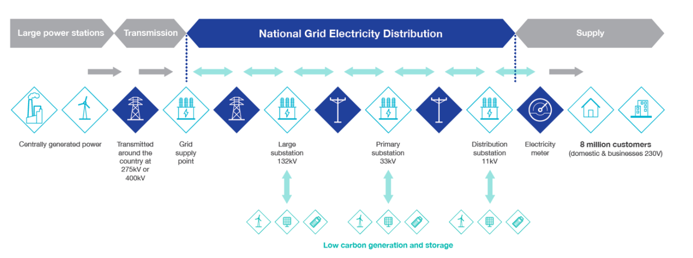

# NGED's Network

The code in this git repository is the research component of **NGED Flexpectation**, an NIA-funded innovation project with National Grid Electricity Distribution (NGED), a distribution network operator (DNO) in Great Britain. The project is run by [Open Climate Fix](https://openclimatefix.org/).

NGED's network (as of May 2026) consists of:

- 1,161 primary substations (33/11 kV and 66/11 kV)
- 271 bulk supply points / BSPs (132/33 kV and 132/66 kV)
- 52 grid supply points / GSPs (400/132 kV and 275/132 kV)
- ~1,500 industrial customer generators (not domestic); roughly 558 at 33 kV or 132 kV connected to GSP/BSP busbars, and ~1,000 on the 11 kV network downstream of primaries

## Embedded generation on the network

**NGED's Embedded Capacity Register records what generation is connected.** The
[register](https://connecteddata.nationalgrid.co.uk/dataset/embedded-capacity-register) (August
2026) lists **5,958 MW of connected solar** and **1,456 MW of connected wind**. Hydro is a much
smaller presence: **41 connected hydro sites totalling 25.7 MW** across all four licence areas —
South Wales 13.7 MW over 10 sites, South West 6.2 MW over 18 sites, East Midlands 5.3 MW over 8
sites, West Midlands 0.5 MW over 5 sites — under half a percent of the connected solar capacity.

**The hydro fleet is overwhelmingly small run-of-river with no storage.** 39 of the 44 hydro
entries are `Hydro - Run of river`, and 29 of the 41 connected sites join at 0.4 kV, so output
tracks catchment flow almost directly. The largest connected schemes are Llyn Brianne (5.45 MW,
Dyfed), Elan Valley (4.0 MW, Powys), Chatsworth (3.7 MW, Derbyshire), Mary Tavy (2.6 MW, Devon)
and Ystradffin (1.99 MW, Dyfed). One entry is much larger — a 58.5 MW Cwm Rheidol scheme accepted
to connect in the South Wales area — but its target energisation date is 2037. The 41 connected
sites are spread across **32 distinct primary substations**, so no primary is hydro-dominated.
