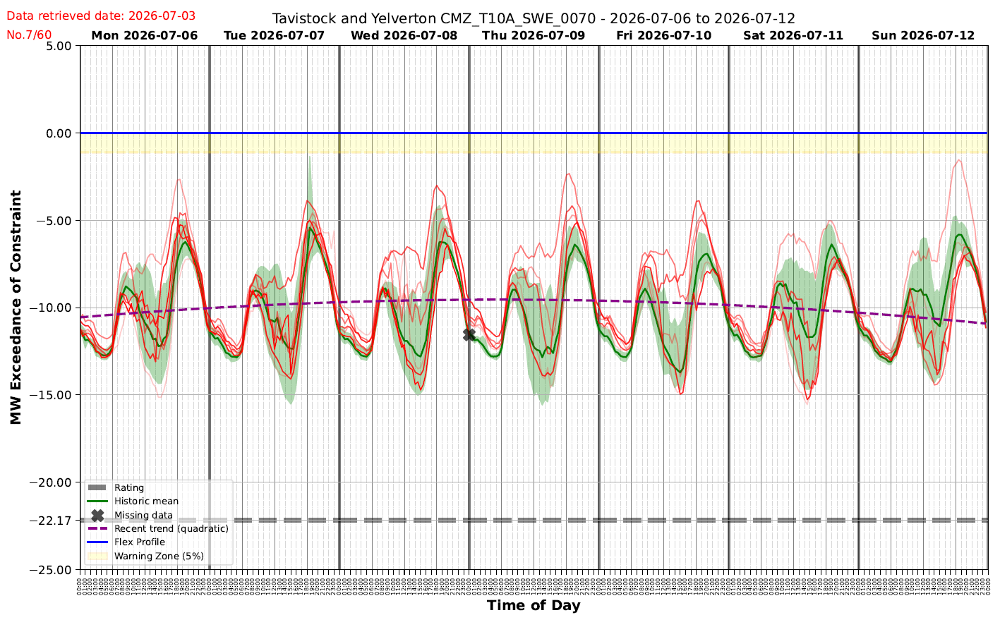

# NGED's Incumbent Forecast

How NGED forecasts primary-substation demand **today**, before this project. It uses no weather
model and no machine learning: for each substation it assembles a small ensemble of **historical
analogues** from that substation's own past, plots them, and lets a human operator read a forecast
off the spread. This is the **incumbent** — the method our models have to beat to justify the
project — so we reproduce it faithfully as the `nged_incumbent`
[baseline forecaster](../roadmap/metrics-and-leaderboard.md#the-headline-baseline-nged_incumbent).

## The recipe (confirmed by NGED, July 2026)

For a given substation and target half-hour, the analogue ensemble is the observed power at the
**same time-of-day on the same weekday** from:

- the **last 6 weeks** (6 analogues), and
- the seven weeks spanning **49–55 weeks back** — roughly a year ago, bracketing the same calendar
  point (7 analogues).

That is **13 analogues** in total. In NGED's words: *"We simply graph the analogues from the past
six weeks, plus the analogues from 55–49 weeks ago. No further processing at all."* There is no
weighting, no holiday alignment, no anomaly rejection, and no load-growth scaling.

The output is **the plot itself** — an operator looks at the 13 traces and their spread and forms a
judgement. If a single deterministic number is needed, NGED *"probably pick the 95th percentile
value of all the values… it's more of a 'vibe' than anything rigorous."* The 95th percentile is a
deliberately **conservative** operating point: the tool's job is to warn when demand might approach
the network's flex/firm capacity limit, so erring high is the safe direction.

## The operator's view

The screenshot above is NGED's operator tool for one feeder (Tavistock & Yelverton,
`CMZ_T10A_SWE_0070`) over a week. Demand is plotted as **headroom against the constraint** — the
y-axis is "MW Exceedance of Constraint", where the blue **Flex Profile** line at `0` is the limit
and more-negative values are further below it. Reading the overlays:

- **Red/pink traces** — the individual historical analogues (the 13 above).
- **Green line ("Historic mean")** and the **green band** — the mean of the analogues and the
  spread around it.
- **Purple dashed ("Recent trend (quadratic)")** — a smooth recent-trend line the tool overlays as
  a sense-check.
- **Yellow "Warning Zone (5%)"** just below the Flex Profile, and the grey **Rating** line (firm
  capacity, here ≈ −22 MW) — operational thresholds, not part of the forecast.

The strong twice-daily peaks and the weekday/weekend difference are exactly the structure the
same-weekday analogue selection is built to capture.

## Why it matters for us

Because the incumbent uses no weather and no ML, beating it is the project's core deliverable — and
because it does *"no further processing at all"*, several cheap upgrades (e.g. aligning bank
holidays and moveable feasts) are genuinely un-done work rather than reimplementations. Both the
faithful replica and the "cheap upgrades" variant are specified in
[Metrics & leaderboard → Baseline forecasters](../roadmap/metrics-and-leaderboard.md#baseline-forecasters).
