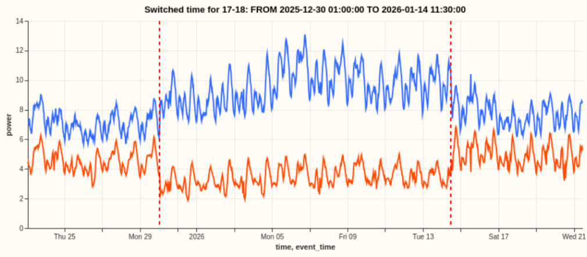

# Switching Events

NGED's primary substations are fed by a meshed HV network that is **operated radially** — at any instant a set of switches is held open to break parallel paths so power flows in a tree. When operators reconfigure that tree (a "switching event"), load that was metered at one substation is, afterwards, metered at one or more neighbouring substations. Roughly 10% of the time a given substation is in an **abnormal running arrangement (ARA)**, and its meter reading does not reflect its *latent demand under the normal running arrangement (NRA)*. See [Switching Events & Latent Demand](../roadmap/switching-events.md) for the modelling plan to detect and reconstruct NRA demand (from the v0.6 forecaster and detector to the later v2-scale mixture models).

The figure below shows an example of a real switching event, where power is temporarily diverted
from on substation (in red) to a neighbouring substation (in blue). Note that this is an unusually
_clear_ example of a switching events - most events are buried in much more noise!



## The HV network is meshed but run radially

NGED's 11 kV / 6.6 kV high-voltage (HV) distribution network is **physically meshed**: there are many parallel electrical paths between substations. However, it is **operated radially** — at any given moment, a set of switches is held *open* to break the parallel paths, so that power flows in a tree (each load fed from exactly one source, no loops). The radial tree you observe at any instant is just *one configuration* of an underlying mesh.

This matters enormously, and it is the crux of everything below:

- **Almost any switch can be opened or closed.** The network can be reconfigured into an enormous number of valid radial trees by choosing which switches are open. The configuration is not fixed.
- **There is no stable, re-identifiable "feeder."** Intuitively one might imagine a substation's load is divided into a handful of fixed "feeders," each a chunk that moves as a unit. NGED have been explicit that this is *not* how it works: because a switch can be opened essentially anywhere along a meshed path, the cut points themselves move. There is no persistent sub-unit with a stable identity or a stable composition.
- **Load is a near-continuous distribution along the network.** Demand is spread along the HV circuits and can be split at (almost) any point. When operators reconfigure, the amount of load that moves is "whatever happened to sit between the old cut point and the new one" — an unknown, continuously variable quantity.

The picture below contrasts the *physical* mesh (all paths exist) with the *operated* radial state (some switches held open, marked `/`, so power flows in a tree). `[A]`–`[D]` are primary substations; `===` is an energised circuit; `/` is a normally-open switch; `·` marks the load tapped along each circuit.

```text
   PHYSICAL MESH (all paths exist)          OPERATED RADIALLY (open switches break loops)

        [A]=====·=====[B]                        [A]=====·=====[B]
         ||           ||                          ||           /        <- open: B's tail
         ·            ·                           ·                         now fed from D
         ||           ||                          ||
        [C]=====·=====[D]                        [C]=====·=====[D]
         (a loop exists A-B-D-C-A)                (no loop: radial tree rooted at A)
```

Both pictures are the *same wires*. Operators choose which switches are open, so the radial tree on the right is just one of many valid configurations of the mesh on the left. A switching event moves the `/` marks — and because the tapped load `·` is spread continuously along every circuit, moving a switch transfers *whatever load sat between the old and new cut points*.

Switching events can last from minutes to months. Each substation is in a switching event for
roughly 10% of the time. One "saving grace" is that, the smaller a switching event, the less we care
about it (because a small switching event won't harm our forecast much).

## What actually happens during a switching event

A **switching event** is a reconfiguration: one or more open switches are closed and/or one or more closed switches are opened, changing which source feeds which load. It can be:

- **Planned** (maintenance, load balancing), or
- **Unplanned** (automatic protection response to a fault).

The **observable effect at the substation meters** is a sustained, roughly step-change in net power: load that used to be metered at substation A is, after the event, metered at substations B, C, … instead. The total power across the affected neighbourhood is conserved — power is neither created nor destroyed by reconfiguring — but *where it is metered* changes.

## Worked example

NGED supplied a real fault example. At 12:01:38 on 25/05/2026 the **DINDER** primary tripped on a fault (an 11 kV breaker tripped). Over the following ~90 seconds, the control system restored supply by closing switches that picked DINDER's load up from **multiple primaries**:

- **Cathedral Park** (= **Wells** primary)
- **16TD11**, **Cowl Street**, **16MW2** (all = **Shepton Mallet** primary)

So a single source substation's load fanned out to **at least two distinct primaries** (Wells and Shepton Mallet), via several separate switching operations. This is a *whole-primary* transfer triggered by a fault.

## The two facts that make this hard

Issue: [#181](https://github.com/openclimatefix/nged-substation-forecast/issues/181)

NGED have confirmed two things that shape the entire problem:

1. **Multi-recipient is the norm.** When load is diverted, it typically fans out to **2–3 neighbouring substations**, not one. Conservation must be reasoned about as a **node-level flow balance**: one source's lost power is absorbed by a *subset* of neighbours whose individual pickups sum to the source's loss.

2. **Partial transfer is the common case, and it is harder.** The clean whole-primary transfer in the worked example (a big, obvious step) is the *easy, rarer* case. The common case is that **only some of a substation's load is diverted** — an arbitrary continuous slice, cut at a movable point. The transferred magnitude is a free continuous variable with no minimum size, so small partial transfers shade continuously down into the measurement noise. **Detection difficulty scales inversely with how much load moved.**

The diagram shows why "how much moved?" has no clean answer. The load `·` is spread along the circuit between `[A]` and `[B]`; the cut point (open switch `/`) can sit anywhere, and wherever it sits determines how much load each end keeps.

```text
   Circuit between two substations, load tapped continuously along it:

   [A]==·==·==·==·==·==·==·== / ==·==·==[B]
        \__________________/     \____/
             fed from A         fed from B    <- cut point here: A keeps most


   [A]==·==·==·==·==·== / ==·==·==·==·==[B]
        \____________/    \____________/
          fed from A        fed from B        <- cut point moved left: B keeps more

   The amount transferred = whatever load lies between the OLD and NEW cut points.
   It is continuous, unknown, and usually only a SLICE (not the whole substation).
```

## The labels asymmetry

We have **switching labels (control-room logs) only for the 32-series trial area** (16 primaries plus associated generation/GSP/BSP series). When the system expands to the full ~1,161 primary substations, **we will have no switching labels.**

This is the single most important architectural constraint. It means:

- **The production model must run fully unsupervised, on power time series alone.** Switching logs cannot be a runtime input, because at scale they do not exist.
- **The 32-series logs are a one-time gold-standard *test set*, not a crutch.** We use them to *validate* the unsupervised method (measure detection precision/recall, recipient-set accuracy, magnitude error), then throw the method — not the labels — at the full network.
- **Nothing may be learned only where labels exist and relied upon at scale.** Any per-substation or per-boundary parameter fitted only on the labelled 16 primaries is a parameter we cannot set for the other ~1,145. The 16 labelled primaries are a *yardstick*, not a representative seed. The thing that must generalise is the *method*, not a lookup table fitted to the pilot.

## The target variable

NGED's stated requirement is to forecast each substation **as if it were always in its normal running arrangement (NRA)** — its design topology. So the quantity we want is not the raw meter reading (which is contaminated by whatever switching state happened to hold), but the **latent demand under NRA**: what the substation would have metered had no reconfiguration occurred. Network planners reason about headroom and capacity under the design topology, so this is the operationally useful signal.

(Separately, the meter also nets demand against **distributed energy resources** — behind-the-meter solar PV, small wind, batteries. Recovering true demand also means accounting for these. The [staged roadmap](../roadmap/switching-events.md) covers explicit DER modelling; the earlier stages fold DERs implicitly into the latent signal.)

## Why power alone — there is no voltage to lean on

Classical topology- and switch-state identification leans almost entirely on **voltage** measurements. We cannot. NGED does not meter voltage at primary-substation level, and even where it might, two facts defeat the approach: transformer **tap-changes** move voltage independently of load, and our **half-hourly** sampling blurs the sub-second transients that voltage-based methods rely on. So switching must be inferred from **real-power balance alone** — the conservation fingerprint at the heart of the [staged approaches](../roadmap/switching-events.md). Far from a regrettable data gap, this is a deliberate design stance: a method that works from power alone is the only method that can run at scale, where neither voltage nor switching labels exist.
