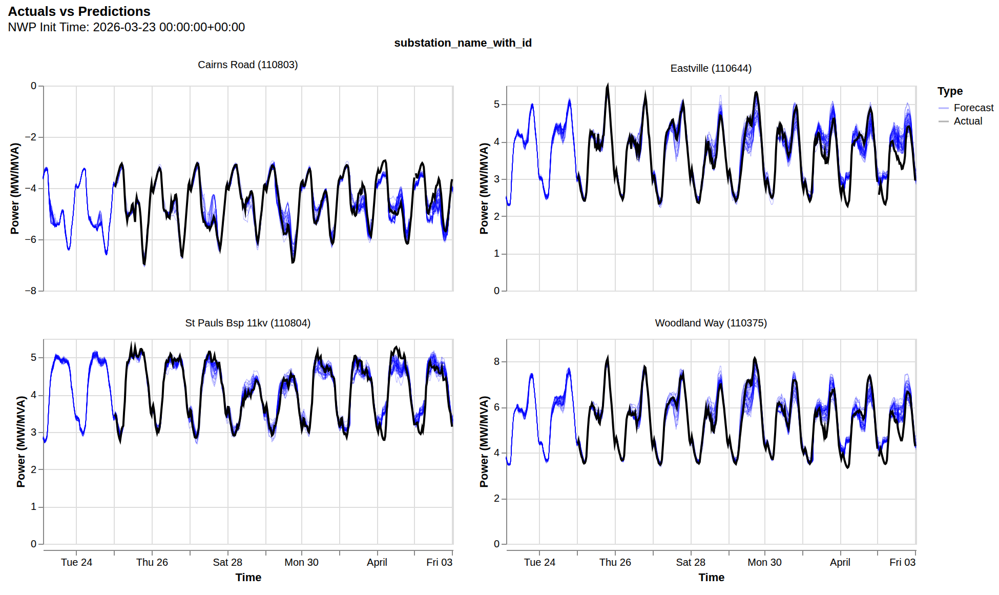

# Welcome to NGED Substation Forecast

This repository contains the research and production code for forecasting net demand at National Grid Electricity Distribution (NGED) substations, disaggregating it into gross demand, solar, and wind components.

## Documentation

Please refer to the [Architecture](architecture/philosophy.md) and [Guides](guides/create-forecast.md) sections for more information.
