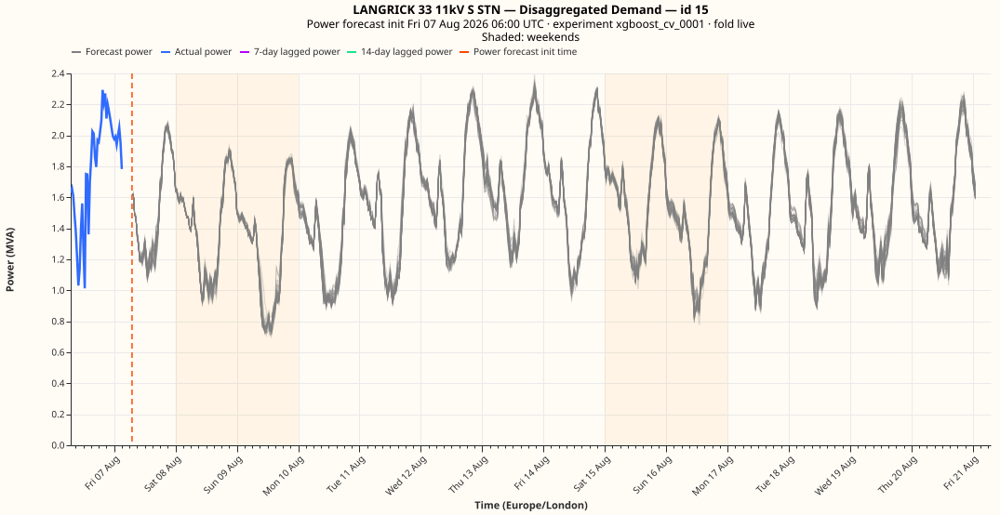

# NGED Flexpectation

**NGED Flexpectation** is an NIA-funded project by [Open Climate Fix](https://openclimatefix.org/) to deliver state-of-the-art, probabilistic power forecasts for National Grid Electricity Distribution (NGED). The forecasts help NGED optimise flexibility procurement and manage network congestion.

## What the forecasts look like

Each forecast is:

- **Probabilistic** — expressed as an ensemble of 51 members, one per ECMWF ENS member
- **14-day horizon**, half-hourly temporal resolution
- Refreshed **every 6 hours**
- **In MW (active power) or MVA (apparent power)** — the unit is given per `time_series_id` in `TimeSeriesMetadata`
- **Sign convention** depends on `substation_type` — see [Sign convention](roadmap/forecast-building-blocks.md#sign-convention)

## Scope

**Version 1** (current focus): 32 time series in NGED's trial area — 16 primary substations, 6 solar PV farms, 3 wind farms, 2 GSPs, 2 BSPs, 1 biofuel generator, 1 BESS, and 1 reciprocating gas generator.

**Version 2** (future): Scale to approximately 2,500 time series covering all of NGED's primary substations and most customer meters.

**After the NIA project**: NGED's stated preference (pending sign-off from their internal
teams) is to run the service themselves, on NGED's own AWS infrastructure — so the service is
being built to be operable day to day by a non-expert. See
[Requirements → Operating model & handover](background/requirements.md#operating-model-handover)
and the [Handover to NGED](roadmap/handover.md) design page.

## More than a forecast

A large part of this project is building a production forecasting system and researching novel
forecasting methods. But NGED's interest goes beyond the forecasts themselves: they also want
**information** — to learn which forecasting approaches actually work well on their data (a major
reason we invest in a rigorous [leaderboard](ml_experimentation/index.md)), and to understand the
underlying issues involved in forecasting their network.

That means a negative result can be just as valuable as a positive one. For example, if we try
hard to detect [switching events](background/switching-events.md) unsupervised and conclude it
isn't reliably possible from power readings alone, that's a useful finding in its own right — NGED
can use it as evidence to justify investing in extracting switching-event labels from their own
operational systems, rather than us silently working around the gap.

The same logic applies to the engineering, which is why our claims about it are written down as
falsifiable [engineering hypotheses](design-philosophy/engineering-hypotheses.md) with thresholds attached: a
pre-registered number we then miss is a transferable finding, whereas an aspiration we quietly fall
short of is not.

Flexpectation is a greenfield project, which is a rare chance to **research industry best practice,
test-drive it against real data and a real production service, and report what we find**. The ideas
worth borrowing are not all from energy forecasting: the
[inherent stability](design-philosophy/inherent-stability.md) that shapes how the service behaves
when its inputs degrade comes from vehicle dynamics, *fail-operational* from avionics autoland, and
*blast radius* from site reliability engineering. The
[design principles](design-philosophy/design-principles.md) page records what each principle
actually decided, which practices we considered and declined, and which we have not yet absorbed.

## Documentation

> **Want to run this on your laptop?** Start with [Getting started](getting-started.md) — a single
> walkthrough from a fresh clone to a running Dagster instance that downloads data and trains a
> model.

- [Design Philosophy](design-philosophy/index.md) — the portable *why*: the design principles, the falsifiable engineering hypotheses that score them, and the inherent-stability argument in full
- [Background & Challenges](background/network.md) — NGED's network, project requirements, and data quality challenges
- [Techniques](techniques/index.md) — durable explainers of the solution methods: differentiable physics, convex optimisation, encoders, probabilistic forecasting, and evaluation metrics
- [Architecture Overview](architecture/overview.md) — what is actually built: technical components and data flow
- [Performance and Scale](architecture/performance.md) — the measured performance engineering: storage formats, lazy evaluation, memory bounds, and Polars' row-index ceiling
- [Code Style](architecture/code-style.md) — code conventions
- [Testing](architecture/testing.md) — how the test suite is wired, the house style, and the notable test suites
- [ML Experimentation](ml_experimentation/index.md) — methodology for our implemented ML experimentation: cross-validation folds, the leaderboard, and how we evaluate models
- [Live Service](live_service/index.md) — operating the live, 6-hourly production service: promoting a champion model and backfilling missed runs
- [Roadmap](roadmap/index.md) — planned future work, plus detailed design docs for the delivery tables, forecast building blocks, metrics & leaderboard, data sources, differentiable physics, switching events, disaggregation evaluation, and encoders

## How these docs were written

The ideas, the decisions and the judgement calls in this documentation are human — they come from
the team's own engineering and from reading what other industries do. Much of the *prose*, though,
was drafted and refined with an LLM coding agent (Claude Code) over many hours of back-and-forth,
and our experience is that this genuinely improved the writing: an argument that survives being
questioned repeatedly tends to end up better evidenced than one written in a single pass.

The division of labour matters most for the evidential claims. The performance, size and cost
figures were measured on real data through the real code path rather than estimated — the
[measure; do not assume](design-philosophy/design-principles.md#12-measure-do-not-assume) principle applies to the
documentation as much as to the pipeline. Claims about what the code does are checked against the
code, but we will not pretend that every sentence across this many pages has had a human's eye on
it next to the source. Where the docs and the code disagree, the code is right, and we would rather
hear about it than have it stand.

> New to this repo? See the [Documentation Guide](documentation-guide.md) for how these sections
> relate to each other and to GitHub issues — including the rule that `roadmap/` holds **only
> not-yet-implemented** design, moving out to a permanent home (`architecture/` for design
> rationale, `ml_experimentation/`/`live_service/` for step-by-step how-to) once a feature ships.
