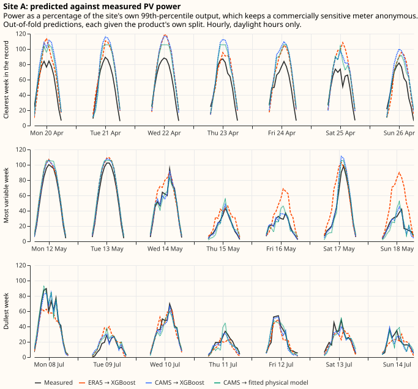
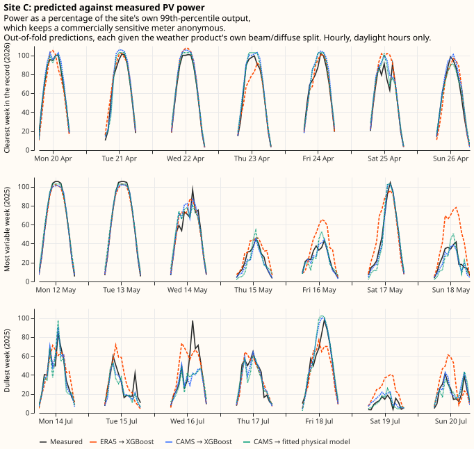
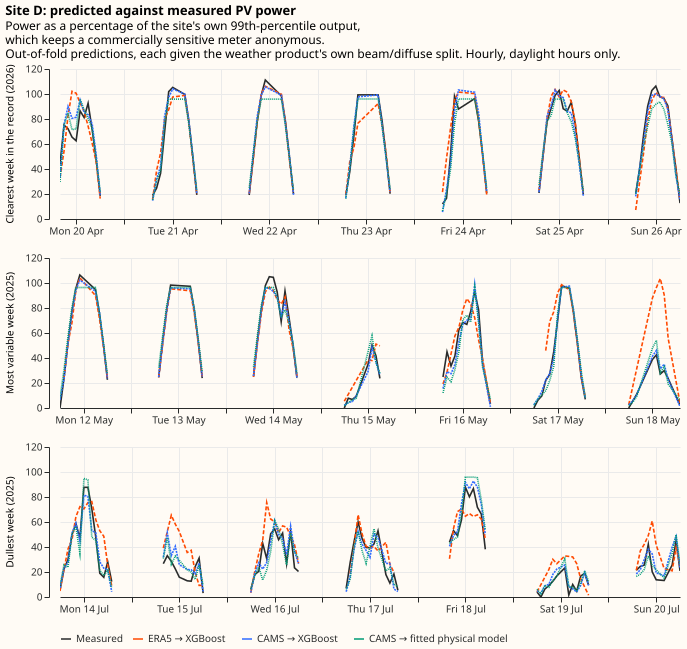
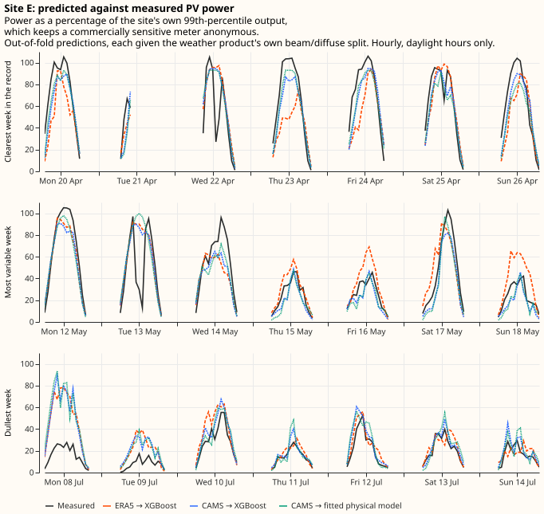
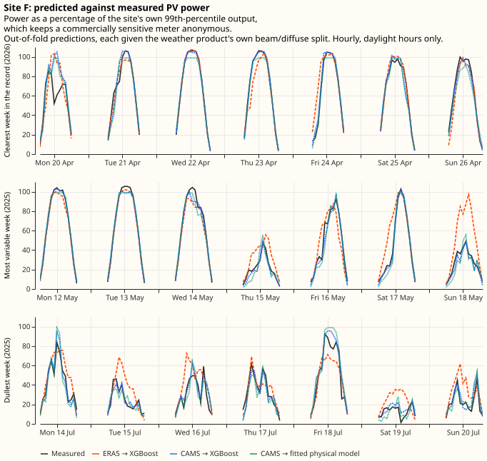
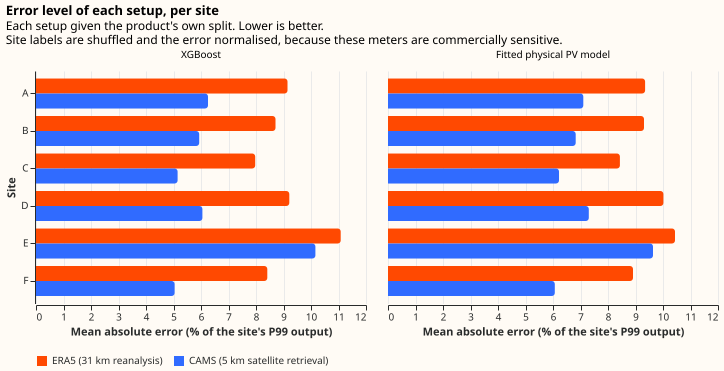
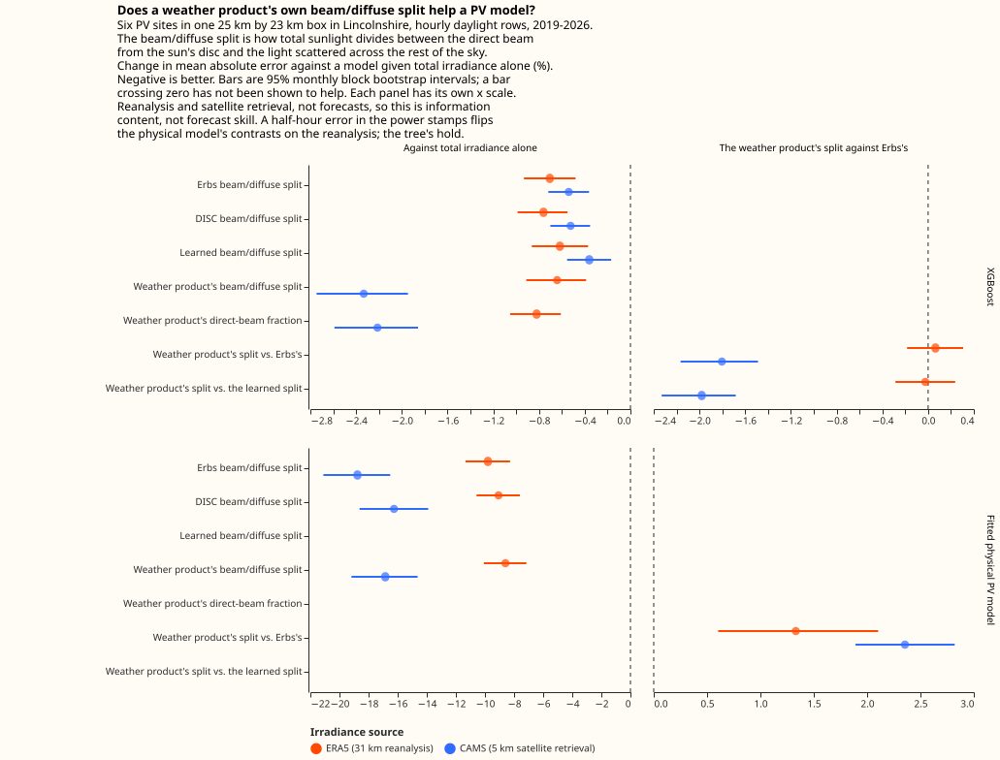
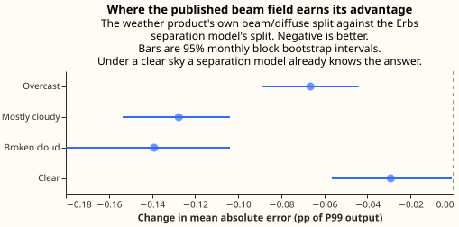

# Does a weather product's beam/diffuse split help a PV forecast?

Sunlight reaches a solar panel two ways: straight from the sun's disc, and scattered across the sky
by air and cloud. A tilted panel responds differently to the two, so a model that knows how a given
hour's sunshine divided between them can predict that hour's power more accurately than a model that
knows only the total. A few weather products publish that division. Most publish only the total,
including the forecast feed this project runs on. Getting hold of a product that publishes the
division costs either money or engineering time. This page measures what the division is worth
before anyone pays for it.

**A published direct-beam share is worth having where the product publishing it resolves cloud
finely and delivers that share at the generator's own coordinates. The same published beam is not
worth having on a reanalysis whose grid cells are 31 km across.** A reanalysis is a physical weather
model re-run over the past and pulled towards the observations of the time. On the Copernicus
Atmosphere Monitoring Service's satellite retrieval — CAMS, which resolves cloud to about 5 km — the
published beam field cuts photovoltaic (PV) power error by 1.8% beyond what a published separation
formula recovers from the total alone. On ERA5, the European Centre for Medium-Range Weather
Forecasts' (ECMWF's) reanalysis, no effect is detected at the setting named before the run — and
that null does not survive the second setting. The evidence is 6 metered solar farms inside one 25
km by 23 km box in Lincolnshire, 7 years of hourly daylight readings, 2 irradiance products, and 2
model families.

**Where the beam field helps, it helps by carrying information, not by encoding the same facts
better.** A formula fitted on this data reproduces the published beam more than twice as faithfully
as the 1982 Erbs correlation does. The forecast is no more accurate for that extra fidelity: it
lands 0.010 percentage points worse. The published field itself cuts error by 0.096 percentage
points, of the 5.33 that a model given the Erbs split still gets wrong. Both are percentages of each
site's own 99th percentile of output, which is the unit every error on this page is expressed in.
That advantage is at its smallest under a clear sky and concentrates where cloud makes the split
genuinely uncertain, which is the shape an information account predicts.

**Choosing the better irradiance product matters about 34 times as much as having the split at
all.** On the hours both products cover, moving from the reanalysis to the satellite retrieval cuts
the same error by 4.29 points, against 0.126 for the widest contrast between two setups differing
only in their beam and diffuse columns — a factor of 34. The split is a question to settle inside
the choice of irradiance product.

## The feed this project runs on carries no direct beam

**The ECMWF ensemble feed this project ingests carries the total short-wave irradiance and no
direct-beam component, so a physically-grounded photovoltaic model has to derive the split rather
than read it.** The feed is ECMWF's ensemble forecast, ENS, which runs the model 51 times from
slightly different starting states.

**Asking our supplier to add the beam is not a request worth making.** Dynamical.org build the feed
from ECMWF's free and open data, which does not carry `fdir` — the archive's name for the direct
beam on a horizontal surface. Serving a direct beam would therefore mean taking on a licence to
redistribute ECMWF's data rather than widening a variable list. The remaining route to a beam on
this feed runs through ECMWF widening the open catalogue, which [they have published no plan to
do](../roadmap/data-sources.md#ecmwf-has-published-no-plan-to-open-a-direct-beam-or-hourly-ensemble-steps).

**Three routes to a split remain, and each costs money or engineering effort.** The split can come
from a different weather model whose free feed already carries a direct beam, from a separate
irradiance source bought or ingested alongside the forecast, or from a separation model this project
runs locally on the total the feed already carries. None is worth paying for before knowing what the
split is worth.

### Beam, diffuse and global irradiance, and the two ways to get the split

Sunlight reaches a horizontal surface two ways. The **direct beam** arrives in a straight line from
the sun's disc; the **diffuse** arrives scattered by air, cloud, and aerosol from across the whole
sky. Their sum is the **global horizontal irradiance**, which is the one irradiance field every
product this page uses publishes, and the only one some of them publish. "The split" throughout this
page means how that total divides between beam and diffuse.

**The split matters to a tilted panel because the panel responds to the two components
differently.** A panel tilted towards the south receives the beam reduced by the cosine of the angle
between the beam and the panel's normal, and receives the diffuse almost unchanged, because diffuse
light arrives from all directions at once. **Transposition** is the name for converting horizontal
fluxes into the flux on the panel's own plane, and transposition needs the split. Two hours carrying
the same global irradiance can put substantially different power into the same panel, depending on
how much of that total was beam.

**A model gets the split one of two ways: the weather product publishes it, or the model estimates
it with a separation model.** A separation model is an empirical formula that takes the global
horizontal irradiance and the sun's position and returns the beam and diffuse components. The [Erbs
et al. (1982)](https://doi.org/10.1016/0038-092X(82)90302-4) correlation and the Direct Insolation
Simulation Code ([DISC](https://doi.org/10.1016/0038-092X(87)90059-5)) are two published examples,
and both run on nothing but those two inputs. The question this page settles is whether a
*published* beam field tells a PV model anything a separation model could not have worked out for
itself.

## What the experiment measures, and what it does not

**Both irradiance products here are analyses of what the weather did, not forecasts of what it will
do, so this page measures the information content of the beam field rather than forecast skill.** A
forecast of the beam would carry its own error on top, and nothing measured here bounds that error.
A result saying the published beam helps is therefore an upper bound on what a forecast beam could
deliver. A result saying the published beam does not help rules the forecast case out as well, so
long as forecasting a beam cannot make it more informative than the analysis it is forecasting —
which is an assumption rather than something measured here.

**The finding is about one micro-region over 2019 to 2026, and about models that predict power from
irradiance at a single site.** It is not a statement about the physics of photovoltaic generation,
where the value of the split is not in doubt — the transposition described above is standard.

An **arm** is one setup under test: the same model, the same rows and the same settings, differing
from every other arm only in which irradiance columns it is shown. A **contrast** is the difference
in error between two arms, taken row by row on rows they both score. The six arms are set out
[below](#the-arms-differ-only-in-which-irradiance-columns-the-model-sees).

## Data

### 6 metered solar farms, 7 years, hourly

The power readings are half-hourly metered output from six solar farms in National Grid Electricity
Distribution's (NGED's) Lincolnshire licence area, running from September 2019 to September 2026.
They are averaged to the hourly grid the irradiance products use. The daylight filter keeps only
hours whose midpoint sun is above the horizon: 128,033 site-hours on the satellite source and
149,984 on the reanalysis. Keeping every hour down to zero elevation is a definition of daylight
that cannot have been chosen to flatter a result. That definition also dilutes every percentage
below with twilight rows no arm can get wrong.

**Every figure and table on this page is normalised, and the sites carry shuffled letters rather
than names, because a single solar farm's output is commercially sensitive.** NGED has asked that
generator data leave the project only anonymised. Error and power are therefore expressed as a
percentage of each site's own 99th percentile of absolute metered output — written **P99 output**
below — rather than in megawatts. The site labels A to F come from a fixed permutation that no table
on this page can be used to invert. The unit is not registered capacity, which this experiment never
reads.

### Three irradiance sources: one reanalysis from two suppliers, and a satellite retrieval

| Source | What it is | Resolution |
|---|---|---|
| ERA5 via the Copernicus Climate Data Store | ECMWF's global reanalysis — a physical model re-run over the past and pulled towards observations. Its archive names the total short-wave field `ssrd` and the direct component `fdir` | ~31 km grid, hourly |
| ERA5 via Open-Meteo's mirror | The same reanalysis, the same two fields, served in about a minute rather than most of a night | identical grid and hours |
| CAMS radiation service | The Copernicus Atmosphere Monitoring Service's satellite retrieval: cloud inferred from the Meteosat geostationary satellites, published at each meter's own coordinates | ~5 km cloud field, point delivery |

**The reanalysis and the satellite retrieval are different measurement systems rather than two
routes to one answer**, which is why the beam question is asked separately on each. ERA5 averages
its cloud field over roughly 31 km and lands each meter in a grid cell whose centre can be 13 km
away. The CAMS service retrieves cloud at around 5 km and interpolates to the meter's own position.
Running the same comparison on both is what separates "the split carries no information" from "this
grid has already smoothed the beam away".

**The "5 km against 31 km" comparison is between the two cloud fields, not between like-for-like
grid spacings.** The CAMS point service interpolates to the coordinates asked of it rather than
publishing a grid, so it has no grid spacing to compare. Every resolution figure on this page
describes how finely a cloud field was resolved before delivery.

**The clearness index is the standard way of saying how cloudy an hour was, and this page sorts
hours by it.** The index is the global horizontal irradiance divided by the **extraterrestrial
horizontal irradiance** — what the same horizontal surface would receive with no atmosphere above
it, which follows from the sun's position and the date alone. The ratio is the share of what the top
of the atmosphere offered that actually arrived, so it runs near zero under thick overcast and
approaches one under a clear sky.

### Open-Meteo's mirror serves ERA5's own direct-beam field

**Before any result could be read as an ERA5 result, the mirror had to be shown to serve ERA5's own
`fdir` rather than a separation model's estimate of it** — otherwise the arm given the "published"
split would be a copy of the arm given a derived one, and a null result would be guaranteed by
construction rather than measured. The two downloads were compared hour by hour over every hour and
every cell both cover: 20 grid cells across the whole requested box, night included, for 1,232,160
cell-hours. The box is deliberately much wider than the meters' own footprint, because a box drawn
tightly round six meters would say where they are, and this repository is public. The mean absolute
difference is 0.15 W m⁻² on the total and 0.13 W m⁻² on the beam, against Open-Meteo's own rounding
of 1 W m⁻². Fewer than 0.12% of hours differ by more than that rounding. The mirror carries the same
fields.

### Cleaning

Three filters run before any model sees a row. Each filter is blind to the beam/diffuse split, so no
filter can favour one setup over another.

- **Multi-day zero runs and impossible spikes.** The filter drops any run of exactly-zero hourly
  power lasting at least 24 hours, together with readings above 1.5 times the site's own P99 output.
  A 24-hour run of exact zeros is not a weather response whatever caused it — an outage, a
  curtailment instruction, or a tripped inverter all qualify — so the row says nothing about how
  irradiance becomes power. Together the zero-run and spike rules remove 1.5% of hourly power
  readings.
- **False zeros inside a bright hour.** An hour whose global irradiance exceeds 100 W m⁻² but which
  contains an exactly-zero half-hour is treated as a meter dropout rather than a dim hour. That
  filter removes a further 3.7% of the daylight rows reaching that stage.
- **Hours the satellite service flags as unreliable.** On the CAMS source only, the build drops
  hours the service itself flags as less than 90% reliable. Every flagged hour is a daylight hour.
  Re-running the whole build with the flag off takes the daylight record from 128,033 site-hours to
  150,332, so the filter drops about 15% of the rows. Those hours are much darker than the ones
  kept, averaging 33 W m⁻² of global irradiance against 285, and 3.5% of P99 output against 36.1%.

Because that third filter is a choice rather than a repair, the whole experiment was also re-run
keeping every hour the service delivers. That moves the relative effect from 1.80% to 1.74%, and the
rest of the check is [below](#what-the-result-survives).

### Three faults in NGED's own feeds had to be settled before the rows were usable

**The power timestamps ran half an hour late until March 2026, one site is curtailed under active
network management, and one site spent its first 8 months being commissioned.** Each of the three
decides which rows are scorable and what those rows mean, and each was settled from NGED's own
records rather than assumed. The evidence sits in an
[appendix](#appendix-what-the-nged-feeds-needed-before-their-rows-were-usable), because it is
forensics on one network operator's feeds rather than part of the measurement this page reports.

## Methods

### Two model families: a gradient-boosted tree and a fitted PV model

**The first instrument is XGBoost**, one model per site, shown the irradiance columns as features
and left to discover what to do with them. That model predicts a single number. A second XGBoost
model is fitted beside it with a multi-quantile objective. Each arm therefore also produces a
predicted distribution and can be scored on the continuous ranked probability score as well as on
mean absolute error.

**The second instrument exists because a null result from a tree is ambiguous between "the split
carries nothing" and "the tree could not use it".** It is a five-parameter physical PV model — panel
tilt, panel azimuth, capacity, an inverter clipping limit, and a temperature coefficient — fitted
per site on each training fold by a Powell optimiser from eight starting points, one fixed and seven
random. Unlike the tree, the physical model is *given* the transposition: it projects the beam onto
the fitted plane and adds the diffuse under an isotropic-sky assumption — an evenly bright sky, with
no extra brightness near the sun's disc — then scales by capacity, applies the temperature
coefficient, and clips. The split therefore enters it at the one place physics says it belongs, so a
null from the physical model cannot be blamed on the model failing to find the transposition.

### Folds, seeds, and why the intervals are wider than the row count suggests

**Training on both sides of the test block is the right choice for this experiment, because the
question is about information content rather than about forecasting forward in time.** Each site's
span is cut into five contiguous blocks of whole months, and each block is scored by a model fitted
on the other four. Every fit is repeated at three random seeds, because XGBoost's own sampling makes
a single fit a noisy estimate of what a setup can do.

**Six meters inside a 25 km by 23 km box share their weather, so the effective sample size is the
number of independent weather episodes rather than the number of site-hours.** On the reanalysis it
is worse than that: the six sites fall inside only two ERA5 grid cells, and within each group the
global irradiance is bit-identical. The per-site rows are two irradiance series against six power
targets. Every interval quoted below therefore comes from a block bootstrap over whole calendar
months, with all six sites' rows inside each block, and both arms are resampled on the same months
so the comparison stays paired. Each resample also draws one of the three seeds.

### The arms differ only in which irradiance columns the model sees

Every arm sees identical rows, identical folds, identical seeds, identical settings, and identical
non-irradiance features — solar zenith angle and azimuth, extraterrestrial horizontal irradiance,
air temperature, hour of day, and day of year. Nothing in that list says which year or which month
of the record an hour falls in: hour of day and day of year are both cyclic, and no model is ever
handed the `%Y-%m` label the folds and the bootstrap are cut on. No arm can therefore track a plant
that degrades, which is what keeps the comparison with the physical model fair, because the physical
model's parameters carry no time trend either. Only the irradiance columns change. Every beam and
diffuse column among them is a flux onto a horizontal plane rather than a direct normal flux, which
is a beam measured on a plane held perpendicular to the sun's rays. No contrast here therefore
confounds a change of units with a change of content.

| Arm | What the model is shown |
|---|---|
| A — global only | Global horizontal irradiance |
| B — Erbs | Global irradiance, plus the beam and diffuse fluxes the Erbs correlation derives from it |
| C — the weather product's own split | Global irradiance, the published beam, and the diffuse left over |
| D — direct fraction | Global irradiance and the published beam's share of it |
| B-DISC | Arm B with the DISC correlation in place of Erbs |
| B-LEARNED | Arm B with a separation model fitted on this data in place of Erbs |

**Arm C against arm B is the comparison the experiment exists for, and that contrast was named
before the run.** Giving the geometry to every arm is deliberate: a fixed-tilt array's sensitivity
to the split is partly a function of sun position, which a gradient-boosted tree can absorb from the
geometry columns. Arm A is therefore made as strong as it can be, and any advantage arm C shows is a
lower bound.

**Arm B-LEARNED exists because arm C could beat arm B for two reasons that carry opposite
decisions.** The published beam may hold information no function of global irradiance and solar
geometry can recover, in which case the field is worth asking a supplier for. Or the weather product
may simply publish a better separation model than a correlation fitted in 1982, in which case the
same gain is available from a separation model run locally. Erbs alone cannot tell those two
explanations apart. Arm B-LEARNED can: its beam is a prediction of the weather product's own direct
fraction from exactly arm A's feature set. Every value that column carries is therefore a function
of what arm A already holds. If arm C still beats arm B-LEARNED, the advantage is information rather
than representation.

**Arm B-LEARNED withholds by calendar month rather than by fold, because the obvious construction
leaks across sites.** Folds are cut inside each site's own span, so one fold number is a different
calendar period at each site. A separation model that merely dropped the rows carrying that fold
number would still train on other sites' rows at the scored fold's own hours. On the reanalysis
those other sites are the same grid cell. The withholding is therefore by calendar month, and it
covers the training rows as well as the scored fold, through an inner cross-validation that
withholds each training fold's own months in turn. Without that, arm B-LEARNED's beam column would
be sharper on the rows it trains on than on the rows it is scored on, the power model would learn to
trust the column more than the scored rows deserve, and the arm would lose for a reason that has
nothing to do with the split.

### Two controls

**Arm B is a negative control the experiment already contains.** Erbs reads global irradiance and
solar geometry and nothing else, all of which arm A already holds. Arm B therefore cannot carry
information arm A lacks. Whatever B − A comes out as is this pipeline's reading on a feature set
known to be uninformative — and, as the results show, it is not zero.

**A positive control shows the instruments can detect an effect of this kind when there is one to
detect.** The same arms are run against a synthetic target built by transposing the true split onto
a tilted plane, where the split must help by construction, and arm C beats arm B-LEARNED on it by
0.17 points [0.14, 0.20] — about 1.6 times the size of the effect found on real power. The synthetic
target is built outside the physical model's own family of shapes on purpose: each site gets its own
tilt and azimuth, none of them the values the optimiser starts from, and the sky diffuse is
transposed by the [Hay-Davies](https://doi.org/10.1016/0038-092X(90)90055-H) model, which treats the
sky as brighter near the sun, while the physical instrument assumes an evenly bright sky.

## Results

### The models work

Before any contrast of a tenth of a percentage point is worth reading, the pipeline has to be shown
producing a sane forecast. These are out-of-fold predictions, one figure per site, across 3 weeks:
the clearest week in the record, the most variable, and the dullest. The 3 weeks were chosen by
clearness index rather than by eye.

The error levels those predictions sit at, per site and per setup:

| Site | ERA5 → XGBoost | CAMS → XGBoost | ERA5 → physical | CAMS → physical |
|---|---|---|---|---|
| A | 8.94 | **5.91** | 9.16 | 6.84 |
| B | 8.48 | **5.53** | 8.99 | 6.34 |
| C | 7.73 | **4.78** | 8.14 | 5.91 |
| D | 8.93 | **5.55** | 9.81 | 6.89 |
| E | 7.34 | **4.80** | 7.52 | 5.76 |
| F | 8.18 | **4.62** | 8.73 | 5.73 |
| Pooled | 8.37 | **5.24** | 8.85 | 6.28 |

Each cell is the mean absolute error as a percentage of that site's P99 output, with every setup
given the weather product's own beam/diffuse split, over all the hours that source covers. The best
setup at each site is in bold, and it is the same setup at all six. Site E is much the shortest
series, at 5,496 satellite site-hours against 19,334 to 25,774 for the other five sites, and it is
not the worst-scored of the six. On the satellite source it sits third for XGBoost and second for
the physical model, because holding every prediction to the export cap — which is what [scoring a
curtailed hour fairly](#one-site-is-curtailed-and-the-export-cap-is-what-makes-its-hours-scorable)
requires — takes the network operator's instructions out of its error.

**The clearest week is where a per-site bias is largest, which is why two of its charts look worse
than the error levels above suggest.** A bias in a fitted capacity scales with output, so it is at
its widest on the brightest hours of the record. In the week beginning 20 April 2026 the
satellite-fed tree runs +16.0% of P99 output at site A and −4.5% at site B, against +0.08% and
+0.11% over their whole records. Site B's own peak that week reaches 113% of the value its error is
normalised by, so that chart is the model meeting the highest output site B ever produced.

**Under-prediction at the top of a site's range is what a mean-absolute-error objective produces,
and it is not a sign the capacity denominator is wrong.** Minimising absolute error targets the
conditional median rather than the mean, and the top decile of measured output is where the residual
distribution is most one-sided. Pooled across the six sites the mean signed error runs from +2.3% of
P99 in the lowest decile of output to −4.1% in the highest. The denominator cannot cause it, because
no model on this page is told the capacity: the tree predicts megawatts, and the physical model's
capacity is a free parameter. Normalising by the 99.9th percentile or by the highest reading instead
moves the headline contrast from −0.096 to −0.088 and −0.086 points, and leaves the relative effect
at 1.80% in every case. Choosing a different denominator changes the units and nothing else.

**One site drifts across the record, and the paired design absorbs it.** At site A the mean signed
error moves from −2.3% of P99 output in 2023 to +4.1% in 2026, so a model fitted mostly on earlier
years increasingly overpredicts the later years. That overprediction is visible as the gap in the
clearest-week panel above, which falls in April 2026. Panel degradation would look like that drift,
and so would a generator turning itself down against negative prices, which site A is free to do
because no network operator's instruction binds it. The data here cannot separate the two. The drift
does not touch any contrast below, because every arm is scored on the same rows and the bootstrap
differences them row by row before resampling. What the drift does bear on is estimating a
generator's effective capacity, taken up
[below](#what-the-per-site-error-drift-says-about-estimating-effective-capacity).

### Does the published beam field add information?

**On the satellite retrieval, yes: the weather product's own split beats the Erbs split by 0.096
points of P99 output, or 1.8% relative, with an interval excluding zero. On the reanalysis, no: the
same contrast is +0.005 points with an interval straddling zero.**

| Contrast | CAMS (5 km) | ERA5 (31 km) |
|---|---|---|
| C − B — the weather product's split against Erbs | **−0.0962** [−0.1155, −0.0793] | +0.0054 [−0.0153, +0.0257] |
| D − B — the same beam as a fraction of the total, against Erbs | −0.0897 [−0.1075, −0.0735] | −0.0097 [−0.0301, +0.0101] |
| C − B-LEARNED — against the fitted separation model | **−0.1058** [−0.1245, −0.0899] | −0.0020 [−0.0239, +0.0198] |
| B-LEARNED − B — a better separation model, on its own | +0.0096 [+0.0032, +0.0162] | +0.0074 [−0.0086, +0.0241] |
| B − A — the negative control | −0.0289 [−0.0386, −0.0194] | −0.0595 [−0.0785, −0.0405] |
| B-DISC − A — a second correlation, same two columns | −0.0281 [−0.0376, −0.0189] | −0.0641 [−0.0832, −0.0464] |
| C − A — the weather product's split against global alone | −0.1251 [−0.1472, −0.1043] | −0.0541 [−0.0768, −0.0327] |

Each cell is the change in mean absolute error, in percentage points of P99 output, for XGBoost.
Negative favours the first arm. Bold marks the two contrasts the page's conclusion rests on.

#### Re-encoding alone improves this pipeline, and the headline is measured on top of it

**Arm B beats arm A by 0.029 points with an interval excluding zero, even though arm B's extra
columns are a deterministic function of what arm A already holds.** A feature set that carries no
new information should score no better, so the pipeline is reading a gain of about a third of the
headline effect from pure re-encoding. The explanation is not information but representation: the
tree's number of boosting rounds is fixed, and two columns of a physically meaningful shape let it
find splits it would otherwise have to approximate. Nothing in the design prevents that re-encoding
gain, and any result of this size has to be read against it.

**Three facts show the headline is measured on top of that floor rather than being another instance
of it.** First, arm B-DISC — a different published correlation in the same two columns — lands at
−0.028 against arm A, within 0.001 of Erbs, so the re-encoding gain barely depends on which
correlation fills the columns. Second, arm B-LEARNED lands at −0.019 against arm A and at +0.010
against arm B, so the gain does not merely stop growing as the split gets more accurate, it reverses
slightly. Third, and decisively, the headline contrast is C − B, measured against an arm that
already carries the re-encoding. The 0.096 points sit on top of a representation effect that has
already stopped growing.

#### The gain is information the published beam carries, not a better separation formula

**A separation model fitted on this data reproduces the published beam more than twice as faithfully
as Erbs does, and the forecast gets no better for it.** Arm B-LEARNED leaves 4.6% of the published
direct fraction's variance unexplained against Erbs's 9.5%, and that extra fidelity leaves the
forecast 0.010 points *worse*, an interval excluding zero, while the same contrast on the continuous
ranked probability score spans zero. The published field itself cuts error by 0.096 points. So what
the published beam is worth is not a better estimate of the same quantity.

**A diagnostic run before the arms agrees, and puts the advantage in the 4.6% of the direct
fraction's variance that arm A's features cannot reach.** Out of fold, a model given arm A's own
features predicts 95.4% of the variance of the satellite product's direct fraction. The diagnostic
withholds by calendar month across every site, as arm B-LEARNED does and for the same reason, and
the two agree to a tenth of a percentage point.

**A better-tuned separation model might shrink the contrast, but probably not by much.** Arm
B-LEARNED is only one gradient-boosted model at the power model's own settings, so a harder-tuned
one could close more of the remaining 4.6%. Power accuracy is close to flat in split fidelity over
the whole range from Erbs to B-LEARNED, though, which is what makes a further gain unlikely rather
than impossible.

#### What the result survives

**The satellite finding holds under each of the checks below.** It reproduces at both hyperparameter
settings (−0.096 and −0.072), on the continuous ranked probability score as well as mean absolute
error, in 5 of 5 folds, and at every solar-elevation band. Seed-to-seed spread is 0.003 points
against a 0.096-point effect. All six sites show the effect individually, with intervals excluding
zero at each, from −0.066 [−0.113, −0.021] at site E on much the shortest record to −0.120 [−0.151,
−0.092] at site A.

**The finding also survives changing how the beam is handed to the model.** Arm D shows the tree the
published beam as a share of the total rather than as a flux beside the diffuse, which is the same
information in a different shape. It reaches −0.090 [−0.108, −0.074] against arm B on the satellite
source and −0.010 [−0.030, +0.010] on the reanalysis: the same effect on one source and the same
null on the other. The negative control's gain is a property of one column layout, so an effect that
reappears under a second layout is unlikely to be the same kind.

**The satellite finding also survives keeping the hours the service flags as unreliable**, which is
the check that matters most, because those hours are about 15% of the daylight record and dropping
them was a choice. Re-run over all 147,913 site-hours rather than the 125,936 that pass the flag,
the experiment gives a headline contrast of −0.083 [−0.098, −0.069], against −0.096 [−0.116, −0.079]
on the filtered set. The absolute figure shrinks because adding 22,000 much darker hours lowers
every arm's error — arm B falls from 5.33 to 4.74% of P99 output — while the *relative* effect
barely moves, at 1.74% against 1.80%. Arm B-LEARNED against arm B behaves the same way on the wider
set, at +0.000 [−0.005, +0.005], spanning zero.

**The reanalysis null is not an artefact of the mirror or of the row set, but it does not survive
its own sensitivity check.** The Copernicus download reproduces the Open-Meteo result to the third
decimal (+0.005 against +0.005), and the null survives restriction to the hours the satellite source
also covers. At the second hyperparameter setting, though, the reanalysis contrast stops spanning
zero and lands in Erbs's favour, which is why the reanalysis result is "no effect detected at the
pre-registered setting" rather than a demonstrated absence. The [limitations](#limitations) set out
what that leaves.

#### The physical model disagrees, and is not a second opinion

**On the same rows the physical model reports the opposite sign: the weather product's own split is
*worse* than the Erbs split, by 0.128 points [+0.101, +0.154] on the satellite source.** Each
physical arm also fits its own panel geometry, and the arm given the weather product's split settles
on a tilt 2.5 to 11.5 degrees shallower than the arm given Erbs, so the obvious suspicion is that
the two arms differ in more than the beam field — which the XGBoost arms never do.

**That suspicion is wrong: holding the geometry fixed makes the disagreement larger, not smaller.**
Every arm was refitted with the tilt and azimuth held at the values the Erbs arm settled on for that
site and fold. The arms then differ only in their beam and diffuse columns, exactly as the XGBoost
arms do. The contrast moves from +0.128 to +0.147 [+0.094, +0.202], and the DISC arm's from +0.148
to +0.236. So the physical model really does score lower with the Erbs beam than with the published
one, and the geometry it fits is not what produces that ordering.

**What does separate the two instruments is the transposition, and it shows up where the sun is
low.** The physical model divides the horizontal beam by the cosine of the zenith angle to get the
direct normal irradiance, which magnifies a beam error without limit as the sun approaches the
horizon, and the daylight filter keeps rows down to zero elevation. The tree never performs that
division. Below 10 degrees of elevation the physical model's arm ordering reaches +0.56 points,
against +0.00 to +0.17 in the three bands above it, while the tree's contrast keeps the same sign in
all four bands. The division therefore explains most of the disagreement rather than all of it: the
physical model still leans towards Erbs in the bands where the sun is high.

**So the physical instrument answers "which beam field survives being divided by the cosine of the
zenith angle and fed to a five-parameter model with an evenly-bright sky", which is a different
question from the one the tree answers.** Erbs returns a smooth function of the clearness index, and
the published beam varies more sharply hour to hour; a division that grows without bound near the
horizon punishes the sharper field. The physical model is a misspecification probe rather than a
second reading of the same quantity, so the right response is to report what each instrument
measured rather than to reconcile the signs.

### The published beam helps most under broken cloud

**The satellite advantage is at its smallest under a clear sky and concentrates where cloud makes
the split uncertain.** That is the shape an information account predicts. Under a clear sky almost
all the irradiance is beam and the direct fraction follows from the sun's position, so a separation
model already reproduces the direct fraction. Under broken cloud two hours with the same total can
carry very different beam, depending on whether the sun's disc happens to be covered.

| Sky condition | Clearness index | C − B | Relative | Hours |
|---|---|---|---|---|
| Overcast | below 0.2 | −0.0665 [−0.0888, −0.0440] | −2.05% | 19,020 |
| Mostly cloudy | 0.2 to 0.4 | −0.1275 [−0.1536, −0.1038] | −2.61% | 33,845 |
| Broken cloud | 0.4 to 0.6 | −0.1390 [−0.1799, −0.1038] | −2.21% | 39,359 |
| Clear | above 0.6 | −0.0292 [−0.0565, −0.0008] | −0.49% | 32,590 |

All four bins are measured on the CAMS satellite source, with XGBoost. The bins exclude rows whose
sun sits below 5 degrees of elevation, because the clearness index divides by a quantity that goes
to zero at sunrise and is numerically unstable there. That exclusion is why these bins total 124,814
site-hours rather than the full 125,936.

**The gain concentrates in the two middle bins, and the reanalysis shows nothing in any of the
four.** Under thick overcast the effect shrinks again, as it must when there is almost no beam left
to know about, leaving about 0.13 points in each of the two middle bins. On the reanalysis the
contrast excludes zero in none of the four, so its pooled null is not an average over one sky
condition helping and another hurting. The reanalysis contrast is largest in the clear-sky bin, at
+0.046 [−0.021, +0.111], which points towards Erbs rather than towards the published field.

**The clear sky is where the published beam helps least, not where it fails to help.** The clear-sky
effect is a fifth the size of either middle bin's, and its interval only just excludes zero, running
from −0.057 to −0.001. So the finding is an ordering across the four bins rather than a presence in
three of them and an absence in the fourth.

#### The beam field does not help in the hours the inverter is clipping

**All six sites run more panel than inverter, and a better beam estimate does not lower the error in
the hours that ceiling binds.** The fitted physical model carries an explicit inverter limit beside
its direct-current (DC) rating. The ratio between the two — the DC-to-alternating-current (AC) ratio
— lands between 1.13 and 1.28 across the six sites, which is not an unusual range for a solar farm
in Great Britain. Both the inverter limit and the rating come out of a fit whose [capacity parameter
absorbs more than capacity](#limitations), so the ratio corroborates the inverter ceiling rather
than measuring it. A saturated inverter stops responding to irradiance altogether, so a better
estimate of the beam has nothing left to move.

| Rows | Share of daylight hours | Share of output | C − B, satellite | C − B, reanalysis |
|---|---|---|---|---|
| Off the ceiling | 94.8% | 85.8% | **−0.0998** [−0.1183, −0.0828] | +0.0041 [−0.0152, +0.0225] |
| On the ceiling | 5.2% | 14.2% | −0.0308 [−0.1186, +0.0581] | +0.0330 [−0.1119, +0.1717] |

An hour counts as on the ceiling when measured output reaches 0.90 of that site's P99. Shares of
hours and of output are the satellite row set; the reanalysis splits 95.5% to 4.5% of hours and
86.0% to 14.0% of output. Defining the stratum on measured output selects hours whose residual is
bounded on one side, so the error *levels* inside each stratum are not comparable with the levels
elsewhere on this page. The contrast is differenced row by row between two arms scored on the same
rows, so the selection falls on both arms alike and cancels.

**Clipping dilutes the headline rather than creating it.** The whole satellite effect lives off the
ceiling, at −0.100, and the pooled −0.096 is that number diluted by the clipped hours where the
split cannot help. So the 1.8% quoted throughout this page slightly understates what the published
beam is worth over the hours a PV plant is free to follow the sun. The reanalysis null survives the
same cut at +0.004 off the ceiling. Raising the threshold to 0.95 of P99 leaves the off-ceiling
figure at −0.099, so neither reading turns on where the line is drawn. Both on-ceiling intervals
span zero on a few thousand rows, which is too little to say whether the effect there is small or
absent.

### The irradiance source matters far more than the split does

**On the 124,849 hours both sources cover, the satellite retrieval cuts XGBoost's error from 9.66 to
5.37% of P99 output — 4.29 points, or 44% relative.** On those same hours two XGBoost arms differing
only in their beam and diffuse columns are never more than 0.126 points apart. Of everything this
experiment varied — the irradiance product, the model family, and the irradiance columns the model
sees — which product feeds the model is much the largest difference measured.

| Instrument | ERA5 | CAMS | Difference |
|---|---|---|---|
| XGBoost, global only | 9.66 | 5.37 | −4.29 |
| XGBoost, weather product's own split | **9.60** | **5.25** | −4.36 |
| Physical model, Erbs split | 10.03 | 6.20 | −3.83 |

Each cell is the mean absolute error as a percentage of P99 output, restricted to the hours both
sources cover. The lowest error in each source column is in bold. The Difference column is not a
contest between the rows, so nothing is marked in it.

**These ERA5 figures are higher than the per-site table's because the row set is smaller, not
because the models changed.** Restricting to the hours both sources cover drops about 23,000 ERA5
hours that the satellite service flagged as unreliable. ERA5 reads those hours at 36 W m⁻² of global
irradiance against 284 W m⁻² for the hours kept, and they carry 3.5% of P99 output against 36.4%.
Removing near-dark hours, where every model is nearly right, raises a P99-normalised mean error:
ERA5 → XGBoost moves from 8.37% over all its hours to 9.60% over the shared hours. Every contrast in
this section is computed within one row set, so the shift cancels.

### XGBoost beats the fitted physical model, but not by much

**On the satellite source the tree reaches 5.24% of P99 output against the physical model's 6.28%,
so the tree is 1.05 points better**, and the tree wins at every site on both sources. The physical
model is doing this with five parameters per site against a gradient-boosted ensemble, and it is
given the transposition.

Three facts make that comparison less lopsided than the numbers suggest, and one makes it more so.
The tree has between 5,500 and 25,800 hourly daylight rows per site to fit on, which a newly-built
site would not. The physical model needs no more data than it takes to pin five parameters. And the
physical model produces interpretable quantities — the fitted tilts land between 14 and 27 degrees
and the azimuths within 5 degrees of due south, which is what these arrays plausibly are. One of its
five parameters is not doing physics, which is taken up in [Limitations](#limitations). Neither
model is the production design.

#### Calibrating the physical model with a tree

**Feeding the physical model's output into a tree recovers most of its deficit against XGBoost, but
only when the calibration is allowed to see the weather as well.** Three calibrations separate the
possible causes of the gap.

| Setup | CAMS | ERA5 |
|---|---|---|
| Physical model alone | 6.28 | 8.85 |
| Tree given only the physical model's output | 6.26 | 8.84 |
| Tree given the physical model's output, plus time, solar geometry, and temperature | 5.37 | 8.40 |
| Tree given the physical model's output, plus the full weather feature set | 5.25 | **8.34** |
| XGBoost alone, the weather product's own split | **5.24** | 8.37 |
| XGBoost given global irradiance alone, no split | 5.36 | 8.43 |

Each cell is the mean absolute error as a percentage of P99 output, on the same rows and folds as
every other number here. The lowest error in each source column is in bold, and the two sources
disagree about which setup wins. Every physical-model prediction fed to a tree was produced by a fit
that never saw that row's calendar month, through the same withheld-month inner cross-validation arm
B-LEARNED uses.

**A tree given nothing but the physical model's output lowers the error on neither source** — −0.025
points [−0.061, +0.011] on the satellite product and −0.017 [−0.038, +0.004] on the reanalysis, both
spanning zero. Whatever the physical model gets wrong, it is not a mis-calibration that a rescaling
of its own output could repair.

**Most of the gap closes on both sources once the calibration may vary by season, solar geometry,
temperature, and hour**: 0.92 points [0.81, 1.03] of the 1.05-point deficit on the satellite
product, and 0.45 [0.37, 0.54] of the 0.48-point deficit on the reanalysis. Most of the physical
model's deficit is therefore a slowly-varying offset rather than a wrong response to irradiance.
That offset is consistent with the [per-site
drift](#what-the-per-site-error-drift-says-about-estimating-effective-capacity) this page measures,
since a fixed-capacity physical model has no way to track a plant that changes.

**On one source the physical model's output adds nothing to a tree that already has the weather; on
the other it adds a little.** On the satellite product the full hybrid lands at 5.25% against
XGBoost's 5.24%, a difference of +0.010 points [−0.006, +0.026] that spans zero. The physical
model's structure carries nothing a tree with the same inputs has not already found. On the
reanalysis the hybrid does beat XGBoost, by 0.037 points [0.024, 0.049]. A plausible reading is that
a coarser irradiance field leaves more for an explicit physical prior to supply. On the reanalysis
the six sites share two irradiance series, so a per-site fitted tilt, azimuth, and capacity is most
of what distinguishes them. That gain is smaller than this pipeline's own re-encoding floor on the
same source: on the reanalysis arm B beats arm A by 0.060 points, though arm B's extra columns are a
deterministic function of arm A's. The reanalysis gain should not be read as more than a hint.

### What the per-site error drift says about estimating effective capacity

**The six sites' biases drift in different directions at the same time, which is the pattern an
effective-capacity estimator needs in order to separate a plant that is changing from an irradiance
product that is biased.** The [effective-capacity estimation](../roadmap/capacity-estimation.md)
work plans to fit a shared regional irradiance-bias term across the metered fleet, on the reasoning
that every site in a region sees the same weather bias while genuine capacity changes are
site-specific. This experiment did not set out to test that premise, but its residuals do.

| Site | 2020 | 2021 | 2022 | 2023 | 2024 | 2025 | 2026 |
|---|---|---|---|---|---|---|---|
| A | −1.3 | −2.2 | −2.2 | −2.3 | +1.5 | +3.4 | +4.1 |
| B | −1.8 | +3.3 | +3.5 | +0.2 | −0.7 | −1.7 | −2.1 |
| C | 0.0 | −0.7 | −0.3 | −0.7 | +0.5 | 0.0 | +2.1 |
| D | — | −0.8 | −0.6 | −0.1 | +0.5 | +1.7 | −0.4 |
| E | — | — | — | — | — | +0.5 | +0.7 |
| F | +0.6 | −0.5 | +0.2 | −0.2 | +0.5 | +0.3 | +0.4 |

Each cell is the mean signed error as a percentage of that site's P99 output, for CAMS into XGBoost
with the weather product's own beam/diffuse split. Positive means the model overpredicts. A year
needs more than 2,000 scored hours to appear, which drops 2019 for every site, because the record
starts in mid-September that year. It also drops site E before 2025, because most of site E's
earlier rows are cut as commissioning, and it drops site D's 2020.

**In 2026 site A runs 4.1% high while site B runs 2.1% low, a 6.2-point spread inside a 25 km by 23
km box, and the two have been moving apart since 2023.** A weather bias shared across the region
cannot produce a spread of that shape, so the site-specific component is both real and large
compared with anything common. Site F, by contrast, stays inside 0.7 points either way for seven
years, which is what a stable plant looks like in this measurement.

**The same per-site, per-year pattern appears on both irradiance products, agreeing to within about
half a point at every site.** Site A reads +4.1% on the satellite product and +3.9% on the
reanalysis in 2026; site B reads −2.1% and −2.0%. The two products are produced independently, one a
satellite retrieval and one a reanalysis, so an artefact common to both is hard to construct. The
likeliest reading is that the drift is in the power rather than in the weather data.

**A single full-history P99 is the denominator throughout this page. At site A it averages over a
plant whose output moved by about 6 points across the record.** That is the same quantity the
[normalised mean absolute error](../roadmap/metrics-and-leaderboard.md) uses to compare series of
different sizes, and the same static estimate the
[`effective_capacity`](../roadmap/delivery-tables.md) table currently carries. Where a plant moves,
a fixed denominator flatters or penalises a site depending on which part of the record a score is
computed over.

**Tracking the drift would lower every arm's error and move no contrast, which is why this
experiment does not try.** An oracle correction subtracts each arm's own mean signed error inside
every site-year. That is the best a dynamic capacity estimate could do at annual resolution, and
better, because it reads the mean off the rows being scored. It takes arm B from 5.333 to 5.266% of
P99 output and leaves the headline contrast at −0.0960 [−0.1141, −0.0794] against the published
−0.0962. Doing the same inside every site-month takes arm B to 5.124 and still leaves the headline
at −0.0960. The negative control behaves the same way, at −0.0287 and −0.0254 against −0.0289. So a
capacity estimate that tracked every plant perfectly would take about 4% off the error level and
change nothing at all about the comparison this page is for.

**What this is not is a measurement of capacity.** A fixed-capacity model's signed error absorbs
everything the model does not represent — degradation, curtailment, soiling, snow, and any bias in
the irradiance at that particular site — so the drift is an upper bound on how much capacity moved,
not an estimate of it. Separating those causes is exactly the job of the estimator contest, and the
drift measured here separates none of them. Of those causes, curtailment is the one NGED's own
records settle rather than leaving to an estimator, and for one of these six sites NGED publishes
that record [below](#one-site-is-curtailed-and-the-export-cap-is-what-makes-its-hours-scorable).

## What this says about asking a supplier for the beam

**Ask a supplier for the direct beam only where the source resolves cloud finely enough to carry
beam information its own global field lacks.** On the 31 km reanalysis measured here the beam field
adds nothing detectable beyond a separation model run locally on the feed's own columns. On the 5 km
retrieval measured here it cuts error by 1.8%. Whether that is worth paying for depends on what it
costs, which this page does not know. Both claims are about the two products tested, and neither has
been shown to hold for every product at those resolutions.

**The reanalysis beam carries *more* content a separation model cannot reach, not less — and that
content does not correspond to what the panel saw.** The tempting story is the opposite one: that at
31 km the direct fraction is already implied by the global field and the sun's position. A model
given arm A's features predicts 95.4% of the satellite product's direct-fraction variance and only
89.1% of the reanalysis's. The beam departure that leaves is unpredictable and irrelevant at the
same time, being averaged over a 31 km cell whose centre can be 13 km from the meter. Predictability
alone cannot distinguish signal from noise. Only the power result does, and here the power result
finds nothing the panel responded to — at the pre-registered setting, which is as far as the
[limitations](#limitations) support that reading.

**The free alternative is free only where it is a published correlation.** Erbs and DISC need
nothing but the global irradiance and the sun's position, so they run on any feed. A separation
model *fitted* on the data, which is what arm B-LEARNED is, needs an archive of a published beam to
fit against — and a feed carrying no beam carries no such archive either.

## What follows elsewhere in the project

What the project does about any of the implications below belongs to the roadmap and the issue
tracker.

**Nothing here argues for pursuing a direct beam on the ECMWF ENS feed.** The open ENS feed
publishes at 25 km, within a few kilometres of the 31 km reanalysis where the published beam added
nothing detectable. Even if ECMWF did open the field, the direct beam would be the lowest-value of
the routes to a split this page can speak to — which is just as well, because [asking our supplier
for one is not a request worth
making](../roadmap/data-sources.md#which-feed-carries-a-direct-beam-and-what-asking-for-one-would-cost).

**The same result points the other way for ICON-EU.** At about 6.5 km it sits beside the 5 km
retrieval where the beam field did help, and it already carries the split, so the planned [ICON-EU
ablation](../roadmap/data-sources.md) is where the beam question is worth asking again rather than
assumed settled by this page.

**The satellite retrieval's advantage is an argument for CAMS on power forecasting, not only on
capacity estimation.** It is already planned as an input to [capacity
estimation](../roadmap/capacity-estimation.md); the 4.29-point gap over ERA5 makes which irradiance
product feeds the model much the largest lever measured here, about 34 times the widest pooled split
contrast. CAMS publishes a day behind real time and offers no same-day access, so this is a result
about an input to offline work rather than about the serving path — see [CAMS's latency and the
access route it forces](../roadmap/data-sources.md#cams-use-the-point-api-not-the-gridded-product).

**The fitted physical model's case in the capacity contest rests on interpretability and graceful
degradation, not on accuracy.** It trails XGBoost by 1.05 points on PV power, and calibrating its
output with a tree recovers most of that gap without overtaking the tree. That is consistent with
what the [capacity-estimation page](../roadmap/capacity-estimation.md) already claims for the
differentiable-physics candidate, and it is evidence against expecting an accuracy win too.

**The per-site residuals show the site-specific component of the error is real and large, which is
what an effective-capacity estimator needs in order to be identifiable.** They do not show that what
the six sites share is an irradiance bias, because a fixed-capacity model's signed error absorbs
everything the model does not represent. They also caution against the static full-history P99
denominator where a plant moves. Both readings are set out
[above](#what-the-per-site-error-drift-says-about-estimating-effective-capacity).

**The half-hour power-timestamp offset is settled, and it reaches further than this experiment.**
NGED report that the fault stops at 08:30 UTC on 26 March 2026. Three independent measurements are
consistent with that account: readings before that instant are half an hour late, and readings from
that instant onwards are not. Every model trained before the ingest began repairing the timestamps
has learnt the offset, not only the models here, and the same step appears in series on this feed
that are not PV meters.

**NGED holds a usable record of active network management, and of the two records it holds, the
setpoint history is the one to read.** The [capacity-estimation
page](../roadmap/capacity-estimation.md) treats active network management as a confounder to be
masked out. The setpoint history is the export cap itself rather than a quantity derived from it,
and it reaches 31 months against the separate curtailment feed's five. Over the 25 months it has
been live it flags 46 of the 50 bright hours whose yield falls below half; inside its own shorter
window the curtailment feed flags 17 of the 33, which is a different window and a different
threshold from the counts
[below](#one-site-is-curtailed-and-the-export-cap-is-what-makes-its-hours-scorable). Coverage is
what limits it: one generator, and not the whole of that generator's record.

**Feature-ablation experiments in this repository need a negative control.** A feature set that is a
deterministic function of an existing feature set still improved this pipeline by 0.029 points, a
third of the headline effect. An ablation run without a negative control could report that
re-encoding gain as a finding.

## Limitations

**The finding is about six metered sites inside one 25 km by 23 km box in Lincolnshire.** The record
runs from 2019 to 2026. The effective sample is the number of independent weather episodes rather
than the 125,936 site-hours. On the reanalysis the six sites resolve to two grid cells, so the
per-site breakdown there is two irradiance series rather than six replications, and the reanalysis
null rests on an effective sample of two.

**Site E supplies a twentieth of the satellite rows and is the one site known to be curtailed.**
Removing it entirely strengthens the satellite result rather than weakening it, from −0.0962
[−0.1155, −0.0793] to −0.0975 [−0.1168, −0.0805], and leaves the reanalysis null where it was, at
+0.0049 [−0.0160, +0.0253]. All six sites are kept so that the reported effect is the smaller of the
two, but a reader should know the choice was available and which way it cuts.

**The reanalysis null fails its own sensitivity check.** The second hyperparameter setting exists to
check that an arm ordering is a property of the features rather than of the settings. On the
satellite source it passes. On the reanalysis the headline is null at the primary setting and lands
at +0.027 [+0.007, +0.047] at the sensitivity setting — in Erbs's favour, not the published field's
— so the check did not pass there, and the reanalysis result should be read as "no effect detected
at the pre-registered setting" rather than as a demonstrated absence.

**The satellite error *levels* quoted here are conditional on the reliability filter; the satellite
*conclusion* is not.** The filter discards about 15% of daylight hours, which are much darker than
the hours kept. Re-running over every hour moves the relative effect from 1.80% to 1.74%.

**One of the physical model's five parameters lands outside physics, so it is a four-parameter model
with a spare.** The fitted temperature coefficient runs from −0.0018 to +0.0020 per degree Celsius
across the six sites, and a photovoltaic module's maximum-power coefficient is negative;
crystalline-silicon datasheets cluster between −0.0045 and −0.0025 per degree Celsius. A positive
value means the fit is using that parameter for something other than the temperature response, and
the fitted capacity absorbs whatever derating the temperature coefficient leaves unapplied. The
fitted tilts and azimuths are unaffected and remain physically sensible, but the fitted capacity and
the DC-to-AC ratio derived from it should be read as descriptions of this fit rather than as
measurements of the plant.

**The physical model's fit does not find one basin, so the seed agreement the physics results report
is weaker evidence than it looks.** Each of the 30 site-and-arm fits was run from 64 independent
random starting points, and a median of only 3 of those starts reach the lowest loss found. The
worst start lands at up to 3.5 times that loss. The fit's own first start is a fixed vector of zeros
that every seed shares, and that start reaches the lowest loss in 19 of the 30 fits and is the only
start to reach it in 6. The seeds therefore agree largely because they share a good start. What that
costs the published result is small: refitting from the 64 random starts alone moves every
arm-to-arm difference by at most 0.0001 MW and reverses no arm ordering at any site.

**The predictability diagnostic withholds by calendar month, because withholding by fold label leaks
across sites.** Folds are cut inside each site's own span, so a fold label leaves the model training
on other sites' rows at the scored fold's own hours — on the reanalysis often the same grid cell.
Withholding by calendar month puts the share of the direct fraction arm A's features can predict at
95.4% on the satellite product and 89.1% on the reanalysis; withholding by fold label reads 95.6%
and 89.6%. The leak therefore flatters the separation model rather than the published beam, which is
the direction that would have weakened this page's argument rather than strengthening it.

**The false-zero filter was added after the first results existed, so the pre-registration claim
covers the contrast and not the row set it is computed on.** Matched within irradiance bins, the
rows the filter removes differ from the rows it keeps by about 0.010 of diffuse fraction, against a
0.24-to-0.75 range across those bins. That figure bounds how differently the filter treats the two
arms' inputs, not how much it could move the answer, and it is larger on the satellite source than
on the reanalysis. The one run made before the filter existed was on the reanalysis, and it reaches
the same null verdict there (+0.012 [−0.011, +0.036]). Neither check makes the filter
pre-registered, and neither covers the satellite headline.

**The negative control's 0.029-point re-encoding floor is a third of the headline effect.** This
pipeline is therefore sensitive to column layout at a scale comparable with what is being measured.
The three facts above argue the headline sits on top of that floor rather than inside it, but a
design that eliminated the floor rather than arguing past it would be stronger.

## Appendix: what the NGED feeds needed before their rows were usable

### The power timestamps before 26 March 2026 are half an hour late

**Every reading NGED stamped before 08:30 UTC on 26 March 2026 describes the half-hour before the
half-hour its label names, and NGED report that the fault stops at that instant.** The
contract says a reading stamped `T` is the mean over `(T − 30 min, T]`. Before that instant a
reading stamped `T` is instead the mean over `(T − 60 min, T − 30 min]`. Every number on
this page is computed on the corrected reading: a reading before that instant is moved half an hour
earlier, and a reading from that instant onwards is taken as it stands.

**A correctly stamped feed reads 15 minutes rather than zero on the two geometric measurements
below, because the label names the end of the period it covers.** A reading stamped `T` averages the
half-hour ending at `T`, whose midpoint is `T − 15 min`, so measuring the centre of a day's output
against the label alone puts that centre 15 minutes after solar noon even when nothing is wrong.
That 15 minutes is the mark the corrected readings have to hit.

**Three measurements agree with NGED's account, and a different fault would be needed to fool each
one.** The first two compare the shape of a clear day's output against the sun's own position, which
is known exactly. The third compares the power against a separate measurement system altogether, so
a clock fault shared by the two would be the only thing aligning them at a non-zero shift.

| Measurement | Before 26 March 2026 | From 26 March 2026 | A correct feed reads |
|---|---|---|---|
| Centroid of a clear day's output, weighted by power, minutes after solar noon | +43.6 | +14.1 | +15 |
| Generating-window midpoint, minutes after solar noon | +45 to +47 | +13 to +14 | +15 |
| Timestamp shift maximising the correlation with satellite irradiance | −30 min at all six meters | 0 min at all six meters | 0 min |

The centroid row rests on 795 clear site-days before the correction and 125 after, and its per-site
medians span +40.9 to +45.2 before and +10.8 to +15.9 after. The generating-window row holds as the
threshold defining "generating" moves from 0.1% to 10% of the day's peak, so the window's edge is
not what sets the answer. `stamp_alignment.py` prints all three.

**The offset is neither a daylight-saving fault nor an artefact of how this project reads the
feed.** A daylight-saving fault would step at the March and October boundaries and would be an hour;
this offset does neither. NGED's own JSON labels every reading with an explicit `startTime` and
`endTime`, both carrying a UTC offset and each abutting the next record. The offset above is
measured against those labels as NGED published them. So the feed states which half-hour it means,
and until 08:30 UTC on 26 March 2026 the sun disagreed with it by one half-hour.

**Reading the timestamps correctly matters most to the arm under test.** A half-hour error blunts the
sharp beam signal more than the smooth diffuse signal, so it penalises the arm given the published
beam more than the arm given a separation model's estimate of it. Any result computed on the
uncorrected timestamps would therefore understate what the beam field is worth.

### One site is curtailed, and the export cap is what makes its hours scorable

**Site E is connected under active network management, so the network operator caps what it may
export and lowers that cap when the local wires are carrying as much as they safely can.** A
generator on such a connection accepts a movable ceiling on its exports in return for connecting
sooner and more cheaply than reinforcing the wires would allow. An hour spent under a lowered cap is
a real measurement of a real export, but no irradiance product predicts a curtailment instruction.
Scoring a model on a curtailed hour therefore measures the instruction rather than the weather data
under test.

**Site E is curtailed often enough for that to matter, and NGED's record says when.** A *bright
hour* is an hour whose global horizontal irradiance reaches 400 W m⁻². A site's *yield* is its
output per unit of irradiance, scaled so that a site producing at its own P99 output under 1,000 W
m⁻² reads one. Across its whole record site E has 2,132 bright hours, of which 161 produce less than
half the yield the rest of the fleet manages in the same hour. Inside the 5 months covered by the
curtailment feed NGED publishes on the same cloud storage as the telemetry, site E has 595 bright
hours, 64 of them carrying a curtailment record; their median yield is 0.702 as metered and 1.246
once the curtailed megawatts are added back, against 1.266 for the other five sites. Of the 34 hours
in that window where site E fell below half the fleet's yield, that feed accounts for 20.

**The output follows the cap rather than the sky, hour by hour.** Site E's connection limit is 18.80
MW — the highest export the cap ever permits, and where the cap rests whenever the scheme is not
trimming. On 13 May 2025 site E exports 91% of that limit at 10:00 with the cap still at it. The cap
then falls, and the metered output falls with it: 34% of the limit at 11:00 against a cap of 8.37
MW, and 12% at 13:00 against a cap of 2.46 MW. Both recover together through 14:00 and 15:00. Global
irradiance climbs across the whole of that collapse.

**NGED has confirmed site E is the only generator in the trial area connected under active network
management**, so the five sites with no setpoint record ran free rather than being capped without a
record. Without that confirmation an absent cap would mean either no curtailment or no data, and
every diagnostic here would rest on the more generous reading.

**Before the error is taken, every arm's prediction is held to the cap in force for that hour.**
NGED holds the history of the cap as a step function, one row each time the cap changed, which is
what makes a curtailed hour identifiable rather than merely suspicious. The prediction scored for
such an hour is therefore the smaller of what the model said and what the operator allowed. The
clamp cannot favour the arm under test, because each arm meets the same ceiling on the same rows. Of
site E's 5,496 scored hours, 375 fall under a lowered cap.

**Holding the predictions to the cap is legitimate here because this experiment reads hours that
have already happened, and it would not be legitimate in a forecast.** Both irradiance products are
analyses rather than forecasts, so the cap for a past hour is as much a matter of record as the
irradiance for that hour. A service forecasting tomorrow has no such record, because the operator
sets tomorrow's cap nearer the time. A service that clamped a forecast to a cap nobody had yet set
would be scored on megawatts it could never have published, which is the lookahead bias this
experiment escapes. The roadmap carries that distinction where the production work will meet it,
under [dropping curtailed hours from the training
target](../roadmap/xgboost-improvements.md#drop-curtailed-hours-from-the-training-target).

**The clamp is what stops one site's curtailment instructions swamping its weather signal.** Inside
a curtailed hour every arm's mean absolute error lands between 9.39% and 9.52% of P99 output once
the prediction is clamped, and between 25.44% and 25.81% if it is not. The six arms differ from one
another by 0.13 points clamped and 0.37 unclamped, against 16 points between the two readings. A
curtailed hour is an hour every arm gets equally wrong, so leaving it unclamped adds a large shared
penalty and no information about the split.

**Dropping those hours outright would move no contrast either, which is why keeping them and
clamping them is safe.** Every contrast on this page is differenced row by row, so an error every
arm shares cancels whether the row stays or goes. Removing the curtailed hours moves the satellite
headline from −0.0962 to −0.0963. Site E is kept on that basis, and what removing the site
altogether would do is in [Limitations](#limitations).

**The cap is not enforced for the first 6 months of its own record, which is a trap in this feed.**
The setpoint history NGED supplied reaches back to 8 February 2024, the day after site E's telemetry
begins, but across all 431 bright hours before 6 August 2024 the cap forbids export outright — while
site E exported above 5% of its capacity in 423 of them, at a median of 44%. Any consumer of this
feed that honoured those readings would label a plant running normally as a plant held at zero. The
cap is therefore honoured only from the first half-hour at which it reaches the connection limit,
15:16:20 UTC on 6 August 2024, a marker taken from the cap alone with no reference to metered
output. That window falls wholly inside the rows the next section removes as commissioning, so the
marker changes nothing here; it is stated because any production cleaning step reading the same feed
would have to make the same call.

**An independent sign agrees, and reading it needs both clocks kept straight.** The operator's event
log was never mis-stamped, while [the power feed ran half an hour
late](#the-power-timestamps-before-26-march-2026-are-half-an-hour-late) until March 2026, so the
two have to be compared on the corrected clock. Corrected, site E reads zero from 08:00 until the
half-hour ending 14:30 on 6 August 2024 while the other five farms climb to 29% of capacity, and the
operator raises the cap from zero to 0.25 MW at 13:35 UTC and to the connection limit at 15:16. That
is the shape of a commissioning test rather than of a curtailment.

**A separate half-hourly feed covers 5 months against the setpoint history's 31, and reports a
derived quantity rather than the cap, so the results here use the cap.** NGED publishes that feed on
the same cloud storage as the telemetry. It runs from 29 April to 20 September 2026 and reports a
volume of megawatts lost rather than the ceiling that was in force, and the two disagree on the
hours they share.

### Site E was still being built for its first 8 months

**Site E's early record measures a smaller plant than its settled output implies, so the rows before
6 October 2024 are removed from the experiment entirely.** Site E's daily output divided by the
median output of the other five farms cancels cloud, season and time of day. That ratio gives flat
multi-day plateaus at 12%, 29%, 56%, 76%, and 88% of its settled level through April 2024, a shorter
climb through 12%, 33%, and 71% in July after a 24-day outage, a plateau at 81% from 11 July, and
the settled level only from 6 October 2024. The evidence and the figure are under [how a new solar
farm reaches full output in
stages](../background/network.md#a-new-solar-farm-reaches-full-output-in-stages-over-months). The
cut removes 2,097 of 128,033 rows, all of them site E's.

**The shortfall is a fixed fraction of what the weather allowed, which is what rules out the other
explanations.** Binned by how hard the rest of the fleet was generating, site E's relative output is
79% to 85% at every decile. An undersized inverter would bite only at the top of that range, and an
export cap would hold the site at a fixed number of megawatts rather than a fixed fraction. The cap
record cannot settle it either way, because the scheme was not yet enforcing through any of those
months and the cap reads a flat zero across all of them.

**Unlike a curtailed hour, a commissioning hour cannot be kept and scored.** The cap says what a
curtailed generator was allowed to produce, so a prediction can be held down to it. Nothing in the
record says what fraction of the array was energised on a given day, so there is no ceiling to clamp
to. With no ceiling to clamp to, removal is the treatment the record leaves, which is why these rows
are cut rather than masked out of training alone.

## Reproducing these results

The code that produced every number and figure on this page lives in a pull request that will not be
merged:
[openclimatefix/nged-substation-forecast#785](https://github.com/openclimatefix/nged-substation-forecast/pull/785),
answering [issue #784](https://github.com/openclimatefix/nged-substation-forecast/issues/784). The
code is throwaway by design, outside the Dagster asset graph and imported by nothing. The scripts
are there so the measurement can be audited and re-run.

Every contrast, interval, and error level quoted here is printed by a script rather than transcribed
by hand, and every figure is drawn from the results files rather than redrawn from a table. The
scripts named below print the cap, the curtailment feed, the inverter ceiling, the restart
comparison, the shared-geometry refit, the capacity denominators, and the timestamp offsets. What is
left — the row counts, the fitted tilts and azimuths, and the per-site spans — was computed ad hoc
against the same outputs.

Eight of those scripts print a single section's numbers rather than the headline results, and sit in
the same directory as the rest:

- `anm_setpoints.py` builds the export cap from the setpoint extract NGED supplied, which is filed
  under `data/NGED/anm/` in the private data store.
- `anm_curtailment.py` reads the separate curtailment feed, and needs the cloud-storage credentials
  the other scripts do not.
- `inverter_clipping.py` prints the inverter ceiling and how much of each site's output sits on it.
- `stamp_alignment.py` prints the three timestamp offsets in [the power timestamps before
  26 March 2026](#the-power-timestamps-before-26-march-2026-are-half-an-hour-late).
- `restart_basins.py` compares the optimiser's fixed starting point against 64 independent random
  ones, which is what the restart limitation rests on.
- `shared_geometry.py` refits the physical model's arms with their tilt and azimuth held equal.
- `capacity_denominator.py` recomputes the headline under four capacity denominators.
- `oracle_capacity.py` recomputes it again after an oracle removes each site-year's and each
  site-month's own bias.
