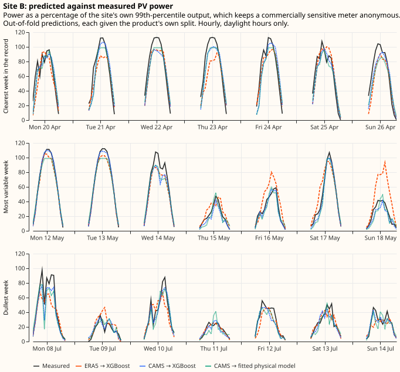
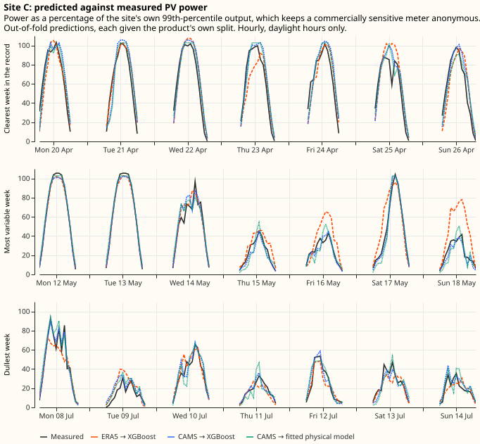
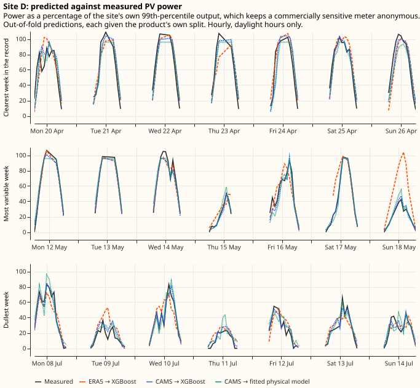
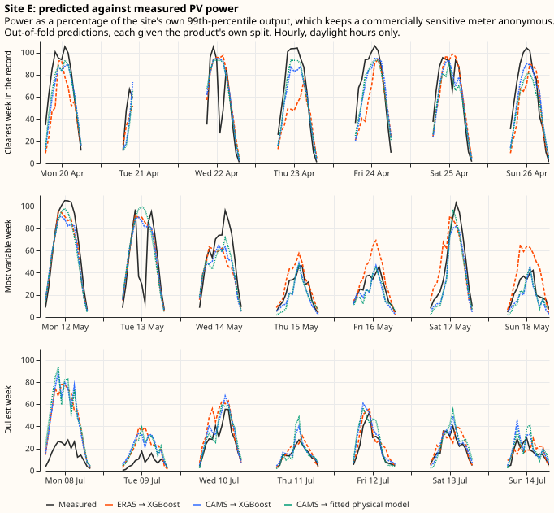
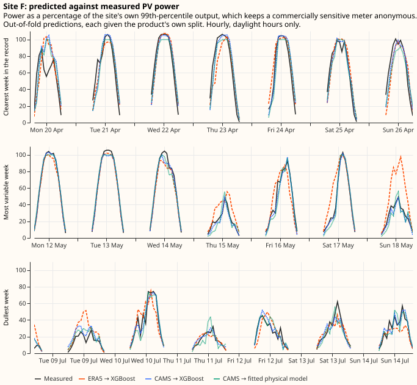
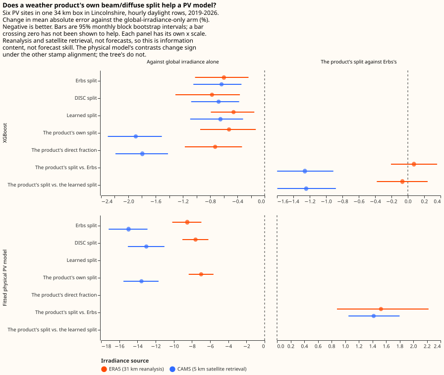
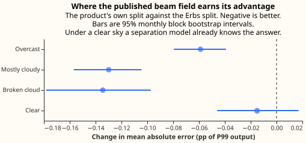

# Does a weather product's beam/diffuse split help a PV forecast?

**A weather product that publishes the direct-beam share of sunlight separately, rather than only
the total, is worth having where the product resolves cloud at about 5 km, and is not worth having
at 31 km.** On a 5 km satellite retrieval the published beam field cuts PV power error by 1.5%
beyond what a fitted formula recovers from the total alone. On a 31 km reanalysis no effect is
detectable, though one robustness check there points the other way. Choosing the better irradiance
product matters about thirty times more than having the split at all. The evidence is six metered
solar farms inside one 34 km box in Lincolnshire, seven years of hourly daylight readings, two
irradiance products, and two model families.

**Where the beam field helps, it helps by carrying information, not by encoding the same facts
better.** A formula fitted on this data, reproducing the published beam more than twice as
faithfully as the 1982 Erbs correlation does, buys nothing measurable — while the published field
itself buys 0.09 percentage points of error. That advantage falls to nothing under a clear sky and
concentrates where cloud makes the split genuinely uncertain, which is the shape an information
account predicts.

## The decision this feeds

**The ECMWF ensemble feed this project ingests carries the total short-wave irradiance and no
direct-beam component, so a physically-grounded PV model has to derive the split rather than read
it.** The alternatives are to ask Dynamical.org to add the direct beam to the feed they build for
us, to take the split from a different source, or to derive the split locally from the total we
already have. Each costs something, and none is worth paying before knowing what the split is
worth. This page measures that.

### The three quantities, and the two ways to get the split

Sunlight reaches a horizontal surface two ways. The **direct beam** arrives in a straight line from
the sun's disc; the **diffuse** arrives scattered by air, cloud, and aerosol from across the whole
sky. Their sum is the **global horizontal irradiance**, the single number most weather products
publish. "The split" throughout this page means how that total divides between beam and diffuse.

**The split matters to a tilted panel because the panel responds to the two components
differently.** A panel tilted towards the south receives the beam reduced by the cosine of the
angle between the beam and the panel's normal, and receives the diffuse almost unchanged, because
diffuse light arrives from all directions at once. Converting horizontal fluxes into the flux on
the panel's own plane is called **transposition**, and transposition needs the split. Two hours
carrying the same global irradiance can put substantially different power into the same panel,
depending on how much of that total was beam.

**A model that is not given the split can estimate it, using a separation model.** A separation
model is an empirical formula that takes the global horizontal irradiance and the sun's position
and returns the beam and diffuse components. The [Erbs et al.
(1982)](https://doi.org/10.1016/0038-092X(82)90302-4) correlation and
[DISC](https://doi.org/10.1016/0038-092X(87)90059-5) are two published examples, both long
established and both cheap to run. The question this page settles is whether a *published* beam
field tells a PV model anything a separation model could not have worked out for itself.

## What this measures, and what it does not

**Both irradiance products here are analyses of what the weather did, not forecasts of what it will
do, so what follows is the information content of the beam field rather than forecast skill.** A
forecast of the beam would carry its own error on top, and nothing measured here bounds that error.
A result saying the published beam helps is therefore an upper bound on what a forecast beam could
deliver, and a result saying it does not help rules the forecast case out as well.

**The finding is about one micro-region over 2019 to 2026, and about models that predict power from
irradiance at a single site.** It is not a statement about the physics of PV generation, where the
value of the split is not in doubt — the transposition described above is standard, and every
serious PV model performs it.

## Data

### Six metered solar farms, seven years, hourly

The power readings are half-hourly metered output from six solar farms in NGED's Lincolnshire
licence area, running from September 2019 to September 2026. They are averaged to the hourly grid
the irradiance products use, and only hours whose midpoint sun is above the horizon are kept:
127,882 site-hours on the satellite source and 149,746 on the reanalysis. Keeping every hour down
to zero elevation is the one definition of daylight nobody can argue was chosen to flatter a
result, and it dilutes every percentage below with twilight rows no arm can get wrong.

**Every figure and table on this page is normalised, and the sites carry shuffled letters rather
than names, because a single solar farm's output is commercially sensitive.** NGED has asked that
generator data leave the project only anonymised. Error and power are therefore expressed as a
percentage of each site's own 99th percentile of absolute metered output — written **P99 output**
below — rather than in megawatts, and the site labels A to F come from a fixed permutation that no
published table can be used to invert. The unit is not registered capacity, which this experiment
never reads.

### Three irradiance sources, two of them the same reanalysis

| Source | What it is | Resolution |
|---|---|---|
| ERA5 via the Copernicus Climate Data Store | ECMWF's global reanalysis — a physical model re-run over the past and pulled towards observations. Its archive names the total short-wave field `ssrd` and the direct component `fdir` | ~31 km grid, hourly |
| ERA5 via Open-Meteo's mirror | The same reanalysis, the same two fields, served in about a minute rather than most of a night | identical grid and hours |
| CAMS radiation service | The Copernicus Atmosphere Monitoring Service's satellite retrieval: cloud inferred from the Meteosat geostationary satellites, published at each meter's own coordinates | ~5 km cloud field, point delivery |

**The reanalysis and the satellite retrieval are different measurement systems rather than two
routes to one answer**, which is why the beam question is asked separately on each. ERA5 averages
its cloud field over roughly 31 km and lands each meter in a grid cell whose centre can be 17 km
away; the CAMS service retrieves cloud at around 5 km and interpolates to the meter's own position.
Running the same comparison on both is what separates "the split carries no information" from "this
grid has already smoothed the beam away".

One derived quantity is used throughout. The **clearness index** is the global horizontal
irradiance divided by the **extraterrestrial horizontal irradiance** — what the same horizontal
surface would receive with no atmosphere above it, which follows from the sun's position and the
date alone. The ratio is the share of what the top of the atmosphere offered that actually arrived,
so it runs near zero under thick overcast and towards one under a clear sky, and it is the standard
way of saying how cloudy an hour was.

### The mirror really is ERA5

**Before any result could be read as an ERA5 result, the mirror had to be shown to serve ERA5's own
`fdir` rather than a separation model's estimate of it** — otherwise the arm given the "published"
split would be a copy of the arm given a derived one, and a null result would be guaranteed by
construction rather than measured. The two downloads were compared hour by hour over every hour and
every cell both cover: 20 grid cells across the whole requested box, night included, for 1,232,160
cell-hours. The box is deliberately much wider than the meters' own footprint, because this
repository is public. The mean absolute difference is 0.15 W m⁻² on the total and 0.13 W m⁻² on the
beam, against Open-Meteo's own rounding of 1 W m⁻², and fewer than 0.12% of hours differ by more
than that rounding. The mirror carries the same fields.

### Cleaning

Three filters run before any model sees a row, and each is blind to the beam/diffuse split, so no
filter can favour one setup over another.

- **Multi-day zero runs and impossible spikes.** A run of exactly-zero hourly power lasting at
  least 24 hours is dropped, together with readings above a multiple of the site's own P99 output.
  A 24-hour run of exact zeros is not a weather response whatever caused it — an outage, a
  curtailment instruction, or a tripped inverter all qualify — so the row says nothing about how
  irradiance becomes power. Together these remove 1.5% of hourly readings.
- **False zeros inside a bright hour.** An hour containing an exactly-zero half-hour under more
  than 100 W m⁻² of global irradiance is treated as a meter dropout rather than a dim hour, which
  removes a further 3.7% of the daylight rows reaching that stage.
- **Hours the satellite service flags as unreliable.** On the CAMS source only, hours the service
  itself flags as less than 90% reliable are dropped. Every flagged hour is a daylight hour, and
  they are 17.9% of the daylight hours the service delivers. Those hours are much darker than the
  ones kept, averaging 36 W m⁻² against 284, so every satellite number here is conditional on
  discarding them.

## Methods

### Two instruments

**The first instrument is XGBoost**, one model per site, shown the irradiance columns as features
and left to discover what to do with them. Alongside the point model, a second XGBoost model is
fitted with a multi-quantile objective, so each arm also produces a predicted distribution and can
be scored on the continuous ranked probability score as well as on mean absolute error.

**The second instrument is a five-parameter physical PV model** — panel tilt, panel azimuth,
capacity, an inverter clipping limit, and a temperature coefficient — fitted per site on each
training fold by a Powell optimiser from eight random starts. Unlike the tree, the physical model
is *given* the transposition: it projects the beam onto the fitted plane and adds the diffuse under
an isotropic-sky assumption, then scales by capacity, applies the temperature coefficient, and
clips. The second instrument exists because a null result from a tree is ambiguous between "the
split carries nothing" and "the tree could not use it".

### Folds, seeds, and why the intervals are wider than the row count suggests

Each site's span is cut into five contiguous blocks of whole months, and each block is scored by a
model fitted on the other four. Training on both sides of the test block is right here, because the
question is about information content rather than about forecasting forward in time. Every fit is
repeated at three random seeds, because XGBoost's own sampling makes a single fit a noisy estimate
of what a setup can do.

**Six meters inside a 34 km box share their weather, so the effective sample size is the number of
independent weather episodes rather than the number of site-hours.** On the reanalysis it is worse
than that: the six sites fall inside only two ERA5 grid cells, and within each group the global
irradiance is bit-identical, so the per-site rows are two irradiance series against six power
targets. Every interval quoted below is therefore a monthly block bootstrap: whole calendar months
are resampled, the same months for both arms so the comparison stays paired, with all six sites'
rows inside each block, and each resample also draws one of the three seeds.

### The arms differ only in which irradiance columns the model sees

Every arm sees identical rows, identical folds, identical seeds, identical settings, and identical
non-irradiance features — solar zenith and azimuth, extraterrestrial horizontal irradiance, air
temperature, hour of day, and day of year. Only the irradiance columns change, and every one of
them is a flux onto a horizontal plane, so no two arms differ in how a quantity is encoded as well
as in what it knows.

| Arm | What the model is shown |
|---|---|
| A — global only | Global horizontal irradiance |
| B — Erbs | Global irradiance, plus the beam and diffuse fluxes the Erbs correlation derives from it |
| C — the product's own split | Global irradiance, the published beam, and the diffuse left over |
| D — direct fraction | Global irradiance and the published beam's share of it |
| B-DISC | Arm B with the DISC correlation in place of Erbs |
| B-LEARNED | Arm B with a separation model fitted on this data in place of Erbs |

**Arm C against arm B is the comparison the experiment exists for, and that contrast was named
before the run.** Giving the geometry to every arm is deliberate: a fixed-tilt array's sensitivity
to the split is partly a function of sun position, which a gradient-boosted tree can absorb from
the geometry columns, so arm A is made as strong as it can be and any advantage arm C shows is a
lower bound.

**Arm B-LEARNED exists because arm C could beat arm B for two reasons that carry opposite
decisions.** The published beam may hold information no function of global irradiance and solar
geometry can recover, in which case the field is worth asking a supplier for. Or the product may
simply publish a better separation model than a correlation fitted in 1982, in which case the same
gain is available locally for nothing. Erbs alone cannot tell those apart. Arm B-LEARNED can: its
beam is a prediction of the product's own direct fraction from exactly arm A's feature set, so
every value it carries is a function of what arm A already holds. Out of fold, arm B-LEARNED leaves
4.5% of the satellite product's direct-fraction variance unexplained, against Erbs's 9.5% — 2.1
times less residual variance. If arm C still beats arm B-LEARNED, the advantage is information
rather than representation.

That arm has to be built carefully, because the obvious construction leaks. Folds are cut inside
each site's own span, so one fold number is a different calendar period at each site; a separation
model that merely dropped the rows carrying that fold number would still train on other sites' rows
at the scored fold's own hours, and on the reanalysis those other sites are the same grid cell. The
withholding is therefore by calendar month, and it covers the training rows as well as the scored
fold, through an inner cross-validation that withholds each training fold's own months in turn. A
column sharper where the arm trains than where it is scored would be over-trusted by the power
model and would penalise the arm for a reason unrelated to the split.

### A half-hour question the data cannot settle, so every result is computed twice

**Three independent tests say the power stamps arrive half an hour later than the contract implies,
so every result below is computed twice, once under each reading.** Against the sun's own horizon
crossings the first and last generating half-hour of a clear day both fall 30 minutes late; the
power-weighted centroid of a clear day runs 0.45 hours late; and the correlation with global
irradiance peaks at a 30-minute shift for all six meters in every year. The offset is not a
daylight-saving error, because it does not step at the March and October boundaries. Whether the
contract or the feed is at fault is a question for NGED. Running both readings costs one extra
column of results and removes the worry, because a half-hour misalignment blunts the sharp beam
signal more than the smooth diffuse one and so would penalise exactly the arm under test.

### Two controls

**Arm B is a negative control the experiment gets for free.** Erbs reads global irradiance and
solar geometry and nothing else, all of which arm A already holds, so arm B cannot carry
information arm A lacks. Whatever B − A comes out as is this pipeline's reading on a feature set
known to be uninformative, and that reading turns out to matter — it is taken up below.

**A positive control runs the same arms against a synthetic target built by transposing the true
split onto a tilted plane**, where the split must help by construction. The synthetic target is
built outside the physical model's own family of shapes on purpose: each site gets its own tilt and
azimuth, none of them the values the optimiser starts from, and the sky diffuse is transposed by
the [Hay-Davies](https://doi.org/10.1016/0038-092X(90)90055-H) model, which treats the sky as
brighter near the sun, where the physical instrument assumes an evenly bright sky. What the
positive control establishes is that the instruments detect an effect of this kind when one exists:
on that target, arm C beats arm B-LEARNED by 0.17 points [0.14, 0.20], about twice the size of the
effect found on real power.

## The models work

Before any contrast of a tenth of a percentage point is worth reading, the pipeline has to be shown
producing a sane forecast. These are out-of-fold predictions for one site across three weeks: the
clearest week in the record, the most variable, and the dullest, chosen by clearness index rather
than by eye.

The other five sites are below.

The error levels those predictions sit at, per site and per setup:

| Site | ERA5 → XGBoost | CAMS → XGBoost | ERA5 → physical | CAMS → physical |
|---|---|---|---|---|
| A | 9.14 | 6.25 | 9.35 | 7.10 |
| B | 8.71 | 5.93 | 9.31 | 6.82 |
| C | 7.97 | 5.15 | 8.43 | 6.22 |
| D | 9.21 | 6.05 | 10.01 | 7.30 |
| E | 11.08 | 10.16 | 10.44 | 9.64 |
| F | 8.41 | 5.04 | 8.91 | 6.06 |
| **Pooled** | **8.80** | **5.93** | **9.23** | **6.84** |

Mean absolute error as a percentage of each site's P99 output, each setup given the product's own
split, over all the hours that source covers. Site E is the worst everywhere and also much the
shortest series, at 7,588 satellite hours against 19,310 to 25,750 for the others.

**One site drifts across the record, and the paired design absorbs it.** At site A the mean signed
error moves from −2.3% of P99 output in 2023 to +4.3% in 2026, so a model fitted mostly on earlier
years increasingly overpredicts the later ones — visible as the gap in the clearest-week panel
above, which falls in April 2026. Panel degradation and rising curtailment would both look like
this, and the data here cannot separate them. The drift does not touch any contrast below, because
every arm is scored on the same rows and the bootstrap differences them row by row before
resampling. What the drift does bear on is estimating a generator's effective capacity, taken up
[below](#what-the-drift-says-about-estimating-effective-capacity).

## The irradiance source matters far more than the split does

**On the 126,784 hours both sources cover, the satellite retrieval cuts XGBoost's error from 10.12
to 6.07% of P99 output — 4.1 points, or 40% relative.** The largest split contrast anywhere in this
page is 0.12 points. Of everything this experiment varied — the irradiance product, the model
family, and the irradiance columns the model sees — which product feeds the model is much the
biggest lever, and it is not close.

| Instrument | ERA5 | CAMS | Difference |
|---|---|---|---|
| XGBoost, global only | 10.12 | 6.07 | −4.05 |
| XGBoost, product's own split | 10.07 | 5.94 | −4.13 |
| Physical model, Erbs split | 10.37 | 6.73 | −3.64 |

Mean absolute error as a percentage of P99 output, restricted to the hours both sources cover.

**These ERA5 figures are higher than the per-site table's because the row set is smaller, not
because the models changed.** Restricting to the hours both sources cover drops about 23,000 ERA5
hours that the satellite service flagged as unreliable, and those hours average 36 W m⁻² of global
irradiance and 0.23 MW of output against 284 W m⁻² and 2.38 MW for the hours kept. Removing
near-dark hours, where every model is nearly right, raises a P99-normalised mean error: ERA5 →
XGBoost moves from 8.80% over all its hours to 10.07% over the shared ones. Every contrast in this
section is computed within one row set, so the shift cancels.

That gap is what a 5 km cloud field at the meter's own coordinates buys over a 31 km field averaged
across a cell the meter may sit 17 km from. It also explains why the beam question has different
answers on the two sources, which a later section takes up.

## XGBoost beats the fitted physical model, but not by much

**On the satellite source the tree reaches 5.93% of P99 output against the physical model's 6.84%,
so the tree is about 0.9 points better** — and the tree wins at every site on both sources except
site E, where the physical model is slightly ahead on much the shortest record. The physical model
is doing this with five parameters per site against a gradient-boosted ensemble, and it is given
the transposition rather than having to learn it.

Two facts make that comparison less lopsided than the numbers suggest. The tree has roughly 24,000
hourly daylight rows per site to fit on, which a newly-built site would not; the physical model
needs enough data to pin five parameters and no more. And the physical model produces interpretable
quantities — the fitted tilts land between 17 and 25 degrees and the azimuths within a few degrees
of due south, which is what these arrays plausibly are. Neither model is the production design, and
the comparison exists to check that a null from one instrument is not an artefact of that
instrument.

### Calibrating the physical model with a tree

**Feeding the physical model's output into a tree recovers most of its deficit against XGBoost, but
only when the calibration is allowed to see the weather as well.** Three calibrations separate the
possible causes of the gap.

| Setup | CAMS | ERA5 |
|---|---|---|
| Physical model alone | 6.84 | 9.23 |
| Tree given only the physical model's output | 6.79 | 9.20 |
| Tree given the physical model's output, plus time and temperature | 6.12 | 8.90 |
| Tree given the physical model's output, plus the full weather feature set | 5.95 | 8.77 |
| XGBoost alone, the product's own split | 5.93 | 8.80 |
| XGBoost given global irradiance alone, no split | 6.05 | 8.85 |

Mean absolute error as a percentage of P99 output, shifted stamps, on the same rows and folds as
every other number here. Every physical-model prediction fed to a tree was produced by a fit that
never saw that row's calendar month, through the same withheld-month inner cross-validation arm
B-LEARNED uses.

**A tree given nothing but the physical model's output buys nothing on either source** — −0.050
points [−0.103, +0.009] on the satellite product and −0.037 [−0.073, +0.000] on the reanalysis,
both spanning zero. Whatever the physical model gets wrong, it is not a mis-calibration that a
rescaling of its own output could repair.

**Letting the calibration vary by season, temperature, and hour recovers most of the gap on both
sources**: 0.73 points [0.57, 0.89] of the 0.91-point deficit on the satellite product, and 0.33
[0.20, 0.46] of the 0.43-point deficit on the reanalysis. Most of the physical model's deficit is
therefore a slowly-varying offset rather than a wrong response to irradiance — which is consistent
with the per-site drift reported above, since a fixed-capacity physical model has no way to track a
plant that changes.

**Whether the physical model's output then adds anything to a tree that already has the weather
depends on the source, and where it does the gain is small.** On the satellite product the full
hybrid lands at 5.95% against XGBoost's 5.93%, a difference of +0.017 points [−0.017, +0.058] that
spans zero: the physical model's structure carries nothing a tree with the same inputs has not
already found. On the reanalysis the hybrid does beat XGBoost, by 0.033 points [0.017, 0.047]. A
plausible reading is that a coarser irradiance field leaves more for an explicit physical prior to
supply — on the reanalysis the six sites share two irradiance series, so a per-site fitted tilt,
azimuth, and capacity is most of what distinguishes them. That gain is the same size as this
pipeline's re-encoding floor, discussed below, so it should not be read as more than a hint.

## Does the published beam field add information?

**On the satellite retrieval, yes: the product's own split beats the Erbs split by 0.091 points of
P99 output, or 1.5% relative, with an interval excluding zero. On the reanalysis, no: the same
contrast is +0.007 points with an interval straddling zero.**

| Contrast | CAMS (5 km) | ERA5 (31 km) |
|---|---|---|
| C − B — the product's split against Erbs | **−0.0905** [−0.1099, −0.0725] | +0.0073 [−0.0137, +0.0263] |
| C − B-LEARNED — against the fitted separation model | **−0.0925** [−0.1108, −0.0754] | −0.0009 [−0.0240, +0.0218] |
| B-LEARNED − B — a better separation model, on its own | +0.0020 [−0.0039, +0.0079] | +0.0082 [−0.0097, +0.0252] |
| B − A — the negative control | −0.0334 [−0.0474, −0.0221] | −0.0523 [−0.0750, −0.0305] |
| B-DISC − A — a second correlation, same two columns | −0.0360 [−0.0504, −0.0240] | — |
| C − A — the product's split against global alone | −0.1240 [−0.1461, −0.1023] | −0.0450 [−0.0711, −0.0199] |

Change in mean absolute error in percentage points of P99 output, XGBoost, shifted stamps. Negative
favours the first arm. Bold marks the two contrasts the page's conclusion rests on.

### The negative control fires, and the headline is measured on top of it

**Arm B beats arm A by 0.033 points with an interval excluding zero, even though arm B's extra
columns are a deterministic function of what arm A already holds.** A feature set that carries no
new information should score no better, so the pipeline is reading a gain of about a third of the
headline effect from pure re-encoding. The explanation is not information but representation:
handing a fixed boosting budget two columns of a physically meaningful shape lets the tree find
splits it would otherwise have to approximate. Nothing in the design prevents that, and any result
of this size has to be read against it.

**Three facts show the headline is measured on top of that floor rather than being another instance
of it.** First, arm B-DISC — a different published correlation in the same two columns — lands at
−0.036 against arm A, within 0.003 of Erbs, so the re-encoding gain barely depends on which
correlation fills the columns. Second, arm B-LEARNED, which fills the same two columns more than
twice as faithfully, lands at −0.032 against arm A and at +0.002 against arm B: the gain saturates
as soon as the columns exist and does not improve as the split gets more accurate. Third, and
decisively, the headline contrast is C − B, measured against an arm that already carries the
re-encoding. The 0.09 points sit on top of a representation effect that has already been paid for
and has already stopped growing.

### The gain is information, not a better correlation

**The B-LEARNED rows are the ones that settle what the advantage is.** Arm B-LEARNED reproduces the
published direct fraction more than twice as faithfully as Erbs — 4.5% of that fraction's variance
left unexplained against Erbs's 9.5% — and all that extra fidelity buys +0.002 points, an interval
spanning zero, with the same verdict on the continuous ranked probability score. Meanwhile the
published field itself buys 0.09 points. Arm C's advantage is therefore not a better deterministic
function of global irradiance and solar geometry.

That reading is corroborated by a diagnostic run before the arms: out of fold, a model given arm
A's own features predicts 95.6% of the variance of the satellite product's direct fraction. The
remaining 4.4% is where the advantage lives. A better-tuned separation model would shrink the
contrast, and arm B-LEARNED is only one gradient-boosted model at the power model's own settings —
but power accuracy is close to flat in split fidelity over the range from Erbs to B-LEARNED, which
is what makes a further gain from tuning unlikely rather than impossible.

### What the result survives

The satellite finding holds under every check the design carries. It reproduces at both stamp
alignments (−0.091 and −0.077), at both hyperparameter settings (−0.091 and −0.072), on the
continuous ranked probability score as well as mean absolute error, in 5 of 5 folds, and at every
solar-elevation band. Seed-to-seed spread is 0.003 points against a 0.091-point effect. Five of the
six sites show the effect individually; the exception is site E, whose own contrast is +0.002
[−0.078, +0.093] on much the shortest record, an interval wide enough to contain the pooled effect
comfortably.

The reanalysis null is not an artefact of the mirror, the stamps, or the row set: the Copernicus
download reproduces the Open-Meteo result to the third decimal (+0.003 against +0.007 at shifted
stamps), both alignments agree, and the null survives restriction to the hours the satellite source
also covers. It does not, however, survive the hyperparameter check — see the limitations below.

### The physical model disagrees, and is not a second opinion

On the same rows the physical model reports the opposite sign: the product's own split is *worse*
than the Erbs split, by 0.13 points on the satellite source. That looks like a contradiction and is
not one, because the physical model's two arms do not differ only in the beam field they are
handed. In every run and at every site, the arm given the product's split settles on a tilt 3 to 11
degrees shallower than the arm given Erbs, so the arms differ in fitted geometry as well. A
30-minute stamp shift is absorbed into the fitted azimuth — the shifted runs settle around 162 to
179 degrees and the as-labelled runs around 200 to 212 — and the ordering of the arms changes sign
with it, in sample as well as out. The physical model also divides the horizontal beam by the
cosine of the zenith angle to transpose it, which magnifies a beam error without limit as the sun
approaches the horizon, and the daylight filter keeps rows down to zero elevation; the tree
performs no such division.

**So the physical instrument answers "which beam field lets a five-parameter model with an
evenly-bright sky and a fitted azimuth fit best", and its answer moves with a timestamp
convention.** The physical model is a misspecification probe rather than a second reading of the
same quantity, and the right response is to report what each instrument measured rather than to
reconcile the signs.

## Where the advantage lives

**The satellite advantage falls to nothing under a clear sky and concentrates where cloud makes the
split uncertain.** That is the shape an information account predicts: under a clear sky almost all
the irradiance is beam and the direct fraction follows from the sun's position, so a separation
model already knows it; under broken cloud two hours with the same total can carry very different
beam, depending on whether the sun's disc happens to be covered.

| Sky condition | Clearness index | C − B | Relative | Hours |
|---|---|---|---|---|
| Overcast | below 0.2 | −0.0588 [−0.0795, −0.0392] | −1.75% | 19,331 |
| Mostly cloudy | 0.2 to 0.4 | −0.1299 [−0.1569, −0.1045] | −2.47% | 34,411 |
| Broken cloud | 0.4 to 0.6 | −0.1344 [−0.1783, −0.0973] | −1.91% | 39,936 |
| Clear | above 0.6 | −0.0151 [−0.0459, +0.0171] | −0.21% | 33,076 |

CAMS, XGBoost, shifted stamps. Rows whose sun sits below 5 degrees of elevation are excluded,
because the clearness index divides by a quantity that goes to zero at sunrise and is numerically
unstable there; that exclusion is why these bins total 126,754 hours rather than the full 127,882.

Under thick overcast the effect shrinks again, as it must when there is almost no beam left to know
about, leaving the gain concentrated in the two middle bins at about 0.13 points. On the reanalysis
the contrast excludes zero in none of the four bins, consistent with its pooled null; the closest
to an effect there is the clear-sky bin at +0.065 [−0.001, +0.127], which points towards Erbs
rather than towards the published field.

**The clear-sky bin is a weak null rather than a demonstrated zero.** Its interval runs from −0.046
to +0.017, and the lower end is half the pooled effect, so the honest statement is that no effect is
detectable there rather than that none exists. The contrast between that bin and the two middle
bins, whose intervals sit well away from zero, is what carries the argument.

## What follows for the forecast feed

**Ask a supplier for the direct beam only where the source resolves cloud finely enough to carry
beam information its own global field lacks.** On the 31 km reanalysis measured here the beam field
is worth nothing detectable beyond a separation model run locally for free. On the 5 km retrieval
measured here it is worth about 1.5% of error. Whether that is worth paying for depends on what it
costs, which this page does not know. Both claims are about the two products tested, and neither
has been shown to hold for every product at those resolutions.

**The obvious mechanism for the reanalysis null is the wrong one, and the right one is worth
stating.** The tempting story is that at 31 km the direct fraction is already implied by the global
field and the sun's position — but the measurement says the opposite. A model given arm A's
features predicts 95.6% of the satellite product's direct-fraction variance and only 89.6% of the
reanalysis's, so the reanalysis beam has *more* content a separation model cannot reach, not less.
That content simply does not correspond to what the panel saw: a beam departure averaged over a
31 km cell whose centre can be 17 km from the meter is unpredictable and irrelevant at the same
time. Predictability alone cannot distinguish signal from noise; only the power result does, and
here it says the reanalysis residual is noise.

**Spend the first effort on the irradiance source rather than on the split.** The gap between the
two products is 4.1 points of P99 output. The gap between having no split at all and having the
published one — arm C against arm A, the widest split contrast measured — is 0.124 points, a ratio
of about thirty to one. Any decision that trades source quality for the split has the priorities
backwards.

Two caveats attach to carrying this into a forecasting decision. Both products here are analyses,
so a forecast beam would arrive with its own error and the 1.5% is an upper bound. And "run the
separation locally for free" presumes an archive of the published beam to fit a separation model
on, which the forecast feed at issue does not carry.

## What the drift says about estimating effective capacity

**The six sites' biases drift in different directions at the same time, which is the pattern an
effective-capacity estimator needs in order to separate a plant that is changing from an irradiance
product that is biased.** The [effective-capacity estimation](../roadmap/capacity-estimation.md)
work plans to fit a shared regional irradiance-bias term across the metered fleet, on the reasoning
that every site in a region sees the same weather bias while genuine capacity changes are
site-specific. This experiment did not set out to test that premise, but its residuals do.

| Site | 2020 | 2021 | 2022 | 2023 | 2024 | 2025 | 2026 |
|---|---|---|---|---|---|---|---|
| A | −1.3 | −2.2 | −2.3 | −2.3 | +1.5 | +3.5 | +4.3 |
| B | −2.0 | +3.2 | +3.4 | +0.1 | −0.8 | −1.8 | −2.0 |
| C | −0.1 | −0.7 | −0.4 | −0.7 | +0.5 | 0.0 | +2.3 |
| D | −0.2 | −0.9 | −0.6 | −0.2 | +0.5 | +1.6 | −0.4 |
| E | — | — | — | — | +8.5 | −5.7 | −2.0 |
| F | +0.5 | −0.5 | +0.2 | −0.2 | +0.4 | +0.2 | +0.5 |

Mean signed error as a percentage of each site's P99 output, CAMS into XGBoost, the product's own
split. Positive means the model overpredicts. Site E's series begins in 2024.

**In 2026 site A runs 4.3% high while site B runs 2.0% low, a 6.3-point spread inside a 34 km box,
and the two have been moving apart since 2023.** A weather bias shared across the region cannot
produce a spread of that shape, so the site-specific component is both real and large compared with
anything common. Site F, by contrast, holds within half a point for seven years, which is what a
stable plant looks like in this measurement.

**The same per-site, per-year pattern appears on both irradiance products, agreeing to about half a
point.** Site A reads +4.3% on the satellite product and +3.9% on the reanalysis in 2026; site B
reads −2.0% and −2.0%. Two independently-produced irradiance products — one a satellite retrieval,
one a reanalysis — would not share an artefact of this shape, so what the drift tracks is in the
power, not in the weather data.

**A single full-history P99 is the denominator this experiment used, and at site A that denominator
is a blend of a plant that changed by about 6 points across the record.** That is the same quantity
the [normalised mean absolute error](../roadmap/metrics-and-leaderboard.md) uses to compare series
of different sizes, and the same static estimate the
[`effective_capacity`](../roadmap/delivery-tables.md) table currently carries. Where a plant moves,
a fixed denominator flatters or penalises a site depending on which part of the record a score is
computed over.

**What this is not is a measurement of capacity.** A fixed-capacity model's signed error absorbs
everything the model does not represent — degradation, curtailment, soiling, snow, and any bias in
the irradiance at that particular site — so the drift is an upper bound on how much capacity moved,
not an estimate of it. Separating those causes is exactly the job of the estimator contest, and
nothing here chooses between the candidates. What the residuals do supply is evidence that the
signal the contest is chasing is present in this fleet, is several percent in size, and is
site-specific enough to be identifiable.

## Implications for Flexpectation

What the measurements above bear on, in the order the project meets them. Each is an implication
rather than a plan; what the project does about any of them belongs to the roadmap and the issue
tracker.

- **Asking a supplier to add the direct beam to the ECMWF ENS feed is the weakest of the three
  options.** The open ENS feed publishes [at 25 km](../roadmap/data-sources.md), within a few
  kilometres of the 31 km reanalysis where the published beam bought nothing detectable, and a
  separation model run locally is free and available now.
- **The same result points the other way for ICON-EU.** At about 6.5 km it sits beside the 5 km
  retrieval where the beam field did help, and it already carries the split, so the planned
  [ICON-EU ablation](../roadmap/data-sources.md) is where the beam question is worth asking again
  rather than assumed settled by this page.
- **CAMS earns its ingest slot on power forecasting as well as capacity estimation.** It is already
  planned as an input to [capacity estimation](../roadmap/capacity-estimation.md); the 4.1-point
  gap over ERA5 makes which irradiance product feeds the model much the largest lever measured
  here, about thirty times the widest split contrast. Effort spent choosing the source beats effort
  spent deriving the split.
- **The fitted physical model's case in the capacity contest rests on interpretability and graceful
  degradation, not on accuracy.** It trails XGBoost by 0.9 points on PV power, and calibrating its
  output with a tree recovers most of that gap without overtaking the tree. That is consistent with
  what the [capacity-estimation page](../roadmap/capacity-estimation.md) already claims for the
  differentiable-physics candidate, and it is evidence against expecting an accuracy win too.
- **The per-site residuals support the shared-regional-bias premise the capacity estimators are
  designed around**, and caution against the static full-history P99 denominator where a plant
  moves. Both are set out [above](#what-the-drift-says-about-estimating-effective-capacity).
- **The half-hour power-stamp offset is a question for NGED that outlives this experiment.** Three
  independent tests agree the stamps arrive 30 minutes later than the contract implies, and the
  offset affects any model trained on this telemetry, not only this one.
- **Feature-ablation experiments in this repository need a negative control.** A feature set that
  is a deterministic function of an existing one still improved this pipeline by 0.033 points, a
  third of the headline effect. An ablation run without such a control could report that
  re-encoding gain as a finding.

## Limitations

The finding is about six meters inside one 34 km box in Lincolnshire between 2019 and 2026, and the
effective sample is the number of independent weather episodes rather than the 128,000 site-hours.
On the reanalysis the six sites resolve to two grid cells, so the per-site breakdown there is two
irradiance series rather than six replications, and the reanalysis null rests on an effective
sample of two.

**The reanalysis null fails its own sensitivity check.** The second hyperparameter setting exists
to check that an arm ordering is a property of the features rather than of the settings. On the
satellite source it passes. On the reanalysis the headline is null at the primary setting and
excludes zero at the sensitivity setting, so the check did not pass there, and the reanalysis
result should be read as "no effect detected at the pre-registered setting" rather than as a
demonstrated absence.

The satellite numbers are conditional on discarding the 17.9% of daylight hours the service flags
as unreliable, which are much darker than the hours kept.

**The false-zero filter was added after the first results existed, so the pre-registration claim
covers the contrast and not the row set it is computed on.** Matched within irradiance bins, that
filter favours neither arm by more than 0.004 of diffuse fraction — a bound on how differently the
filter treats the two arms' inputs, not on how much it could move the answer — and the run made
before the filter existed reaches the same verdict. Neither check makes the filter pre-registered.

The negative control's 0.033-point re-encoding floor is a third of the headline effect, so this
pipeline is sensitive to column layout at a scale not negligible against what is being measured.
The three facts above argue the headline sits on top of that floor rather than inside it, but a
design that eliminated the floor rather than arguing past it would be stronger.

## Reproducing this

The code that produced every number and figure on this page lives in a pull request that was
deliberately closed without merging:
[openclimatefix/nged-substation-forecast#785](https://github.com/openclimatefix/nged-substation-forecast/pull/785),
answering [issue #784](https://github.com/openclimatefix/nged-substation-forecast/issues/784). The
code is throwaway by design — outside the Dagster asset graph, importing nothing and imported by
nothing, adding no package and changing no data contract. The conclusions are what the project
keeps; the scripts are there so the measurement can be audited and re-run.

Every number quoted here is printed by a script rather than transcribed by hand, and every figure
is drawn from the results files rather than redrawn from a table.
