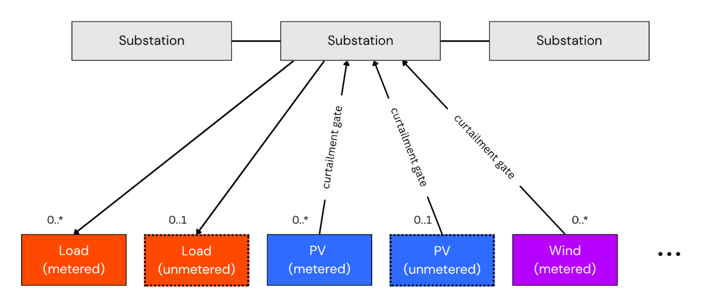

# Net-Demand Disaggregation — Approach & v2 Research Roadmap

> **Status: 🔬 v2 research.** This page is the canonical home for the v2 disaggregation arc:
> recovering latent demand and unmetered DER generation from net substation power, across the
> whole NGED network. It covers the plan and architecture; the *methods* it builds on are
> explained in the techniques pages —
> [Differentiable Physics](../techniques/differentiable-physics.md) for the forward models and
> [Convex Optimisation](../techniques/convex-optimisation.md) for the convex machinery. The
> sibling v2 arc — abnormal running arrangements and latent-demand recovery under switching — has
> its own canonical doc, [Switching events & latent demand](switching-events.md). How progress is
> measured lives in
> [Evaluating disaggregation](../techniques/disaggregation-evaluation.md). This work is
> [roadmap v2.0](index.md#v20-scale-up-future-research); it builds on the metered-generator
> capacity estimates from [v0.7](capacity-estimation.md). The Python in this document is
> illustrative sketch code, not the implementation. See the [roadmap index](index.md) for status
> conventions.

This page is the deep-dive behind two of the "innovative and unique" capabilities the Milestone
1 report highlights: natively handling **unmetered generation** and **apparent-power (MVA)
metering**. (The third — dynamically-changing **effective capacity** of metered generators — is
the v0.7 deliverable, planned in [Capacity estimation](capacity-estimation.md); v2 builds on its
output.)

## The problem: net power is not demand

What a substation meter records is not demand. The meter reading is **net power** — the sum of
true underlying demand minus behind-the-meter generation (rooftop PV, small wind, battery
discharge) plus any unregistered or poorly-metered embedded generation. The "latent, unobserved
demand" is the load that would be seen at the meter if all distributed energy resources (DERs)
were removed. Recovering that latent signal is the disaggregation problem.

Compounding this, each primary substation spends roughly **10% of its operating time in an
abnormal running arrangement** (ARA) — a state in which switching events reroute a block of load
from its normal parent substation to a neighbour. The metered signal is therefore structurally
different from what it would be under normal topology. NGED requires forecasts expressed **as if
the network is always in its normal running arrangement** — the latent demand under nominal
topology, which is precisely the quantity network planners need. The full problem statement lives
in the background docs ([switching events](../background/switching-events.md), [NGED's
network](../background/network.md)); [forecast building blocks](forecast-building-blocks.md)
covers how the "normal running arrangement" target is delivered.

The engine below attacks this by
[inversion through a differentiable forward model](../techniques/differentiable-physics.md#the-core-idea-inversion-through-a-differentiable-forward-model):
model each substation's meter reading as the physical sum of its latent parts, then run the model
backwards. The key product is not just the DER estimates but the latent demand signal itself —
which can then be used directly as the target for a standard probabilistic forecasting model,
free from the confounding effect of DERs.

## DER tractability ranking

Disaggregation works best where there is a **common observable exogenous driver** and
**homogeneous behaviour** across sites — conditions that let errors average out rather than
compound. The tractability ranking across DER types is:

| DER type | Tractability | Key reason |
|---|---|---|
| PV | Excellent | Irradiance-driven; panel behaviour is near-identical across sites; errors average out at fleet level |
| Wind | Good | Wind-speed-driven via a learnable power curve; more spatial heterogeneity than PV but still exogenous |
| Heat pumps | Intermediate | Temperature-driven with coefficient-of-performance (COP) rolloff; heterogeneity partly averages out at substation aggregate level |
| EVs | Poor | No clean exogenous driver; behaviour is synchronised (school-run, cheap-rate charging), so errors compound rather than cancel; synchronised peaks are exactly what matters to the grid |
| Batteries | Very poor | Pure latent control — tariff/market-driven with no physical exogenous signal; two identical batteries sitting next to each other can dispatch in opposite directions simultaneously |

**Practical conclusion for v2 scope**: disaggregation targets PV (primary), wind (secondary), and
heat pumps (worth attempting at substation-aggregate level). For batteries, the right approach is
price-driven behavioural-clustering methods — the kind targeted by OCF's NESO "EDGE" project
proposal (currently blocked waiting for data, as of June 2026) — rather than physics-based
disaggregation. For EVs, honest publication requires wide uncertainty intervals and a clear
caveat that the synchronised-peak regime (precisely the regime NGED cares about most) is the
hardest case.

**The literature backs both calls and adds a caveat for heat pumps**, as the [energy-forecasting
review](../background/energy-forecasting-review.md#9-disaggregating-other-distributed-energy-resources-heat-pumps-electric-vehicle-chargers-and-batteries)
sets out: a Northern Powergrid code of practice puts batteries at a diversity factor of exactly
one; NGED's own Electric Nation trial found a time-of-use tariff re-synchronising EV charging
into the 22:00 hour, the failure mode the caveat above covers; and the one heat-pump diversity
measurement the review found holds only in an average winter, untested in the cold snaps when a
substation is under most strain.

## The forward model

The substation meter reading is treated as the output of a **forward model** over the latent
parts:

```text
observed_power(t) = latent_demand(t) − pv_generation(t) − wind_generation(t) − battery_net(t) + losses(t)
```

Each right-hand-side term is modelled explicitly:

- **`latent_demand(t)`** — what we want: a smooth, weather-driven, time-of-week-structured signal
  representing the true underlying load.
- **`pv_generation(t)`** — estimated from irradiance (from NWP and/or satellite) via a
  differentiable physics model of panel conversion efficiency (temperature and spectral
  correction, clipping at inverter limits). Panel capacity is a latent parameter estimated
  jointly.
- **`wind_generation(t)`** — estimated from wind speed via a differentiable power curve.
- **`battery_net(t)`** — handled via a state-space component with charge/discharge dynamics.
  *(A later / stretch component — battery disaggregation is a v2 stretch goal in the
  [roadmap](index.md#v20-scale-up-future-research).)*
- **`losses(t)`** — approximated as a smooth function of load level. *(Also a later refinement.)*

### Metered vs. unmetered DERs

A crucial distinction runs through the whole project: each generation term above is really the
sum of a **metered** and an **unmetered** part. NGED meters some large DERs directly —
utility-scale solar PV farms, large wind farms, grid-scale batteries — while a long tail of small
DERs is **unmetered** behind the substation: domestic rooftop PV, small distributed wind, home
batteries (and, strictly, EV chargers and heat pumps on the demand side). Written out in full,
the forward model is closer to:

```text
observed = latent_demand
           − (pv_metered + pv_unmetered)
           − (wind_metered + wind_unmetered)
           − (battery_metered + battery_unmetered)
           + losses
```

We keep the compact equation above for readability, but the model treats the two classes
differently:

- **Metered DERs** are modelled **per asset**. Because we know the site exists and have its own
  generation meter, we can fit explicit, physically-interpretable parameters for it — for a
  metered PV farm, that single site's panel **tilt**, **azimuth** and **effective capacity** (see
  [`DifferentiableSolarPlant`](../techniques/differentiable-physics.md#the-core-building-block-differentiablesolarplant)).
  This is the **v0.7** deliverable — see [Capacity estimation](capacity-estimation.md) — and v2
  consumes its output: verified, accurately-tracked metered assets are what anchor the harder
  unmetered inference.
- **Unmetered DER fleets** cannot be modelled as a single asset — a primary substation may sit
  above hundreds or thousands of rooftops with a mishmash of orientations. These are modelled as
  an **aggregate fleet node** via the physics-informed basis expansion in
  [`UniversalSolarFleetNode`](../techniques/differentiable-physics.md#scaling-to-aggregate-fleets-universalsolarfleetnode).
  Estimating and disaggregating the *unmetered* DERs is the harder, **v2** goal.

This is also where the project graduates from *estimating capacity* to directly *forecasting
power* with the physics models (including for MVA-metered sites,
[below](#apparent-power-mva-metering)), and where the **latent-demand inversion** of the forward
model is realised in full.

## The graph-structured engine

The distribution network is fundamentally a topological graph, and we model it as one. The graph
is a **data structure**: a fixed map of which substations can exchange load with which
neighbours, and which sites see which weather. Each substation is reconstructed as the sum of its
own differentiable-physics modules (gross demand, metered/unmetered PV, metered/unmetered wind),
whose latent parameters — most importantly each module's capacity — are inferred directly from
that substation's metered power and the local weather. The components are separable because each
has a distinct exogenous driver and temporal signature (PV tracks irradiance, wind tracks wind
speed, demand tracks time-of-week and temperature), so each substation's fit can pull them apart
locally. The graph carries the structural prior — who can exchange load with whom — and a hard
Kirchhoff balance closes the books. This mirrors the schematic in the
[Milestone 1 report (Fig. 10)](https://docs.google.com/document/d/1UF-mjfSdQfQxefAunDqEOr_GyYTjSlGk4EeuiNoXAxk/edit?tab=t.0#heading=h.ot06ofd0lqes):



**The generation and demand halves of this differentiable-physics engine stand on different
evidence.** The [energy-forecasting
review](../background/energy-forecasting-review.md#model-families-for-flexpectation-version-2)
found differentiable physics established for a generator's own output — [Gijón et al.
(2025)](https://arxiv.org/abs/2502.07344) fit a turbine model to a wind farm's metered production —
which is the precedent the photovoltaic and wind nodes below build on. For the gross-demand node
the review found no comparable precedent: a search for differentiable physics applied to
substation demand forecasting produced no strong result. The review also found nobody aggregating
building thermal physics up to a substation and putting it inside a probabilistic forecast,
though the ingredients exist separately.

### Node definitions

Following the report's schematic, the graph uses the following node types:

1. **Substation nodes** — the measured, net blended power flow at a primary substation (the main target constraint).
2. **Metered load nodes** — demand that NGED meters directly, where such metering exists.
3. **Gross demand nodes** — the underlying, unmetered consumer load, inferred by the model. Implemented as a `BasisLoadNode`: a shared MLP learns a small set of universal demand-profile shapes (e.g. residential, commercial, light-industrial) as functions of time-of-day, day-of-week, and temperature; each substation carries a local "style vector" of mixing weights that describes its particular customer mix. The universal basis curves are shared across all substations; only the style vector is site-specific, so the model can distinguish a residential suburb from an industrial estate without re-learning basic human demand patterns from scratch at each site. (Learning the shared shapes is non-convex PyTorch work — but once the dictionary is *frozen*, fitting a new substation's style vector against it is a small convex problem: cheap onboarding of new substations without retraining, and warm starts for the joint fit. See [the fixed-shapes pattern](../techniques/convex-optimisation.md#the-recurring-pattern-fixed-shapes-unknown-coefficients).)
4. **Metered PV / Wind nodes** — generators with dedicated, live generation metering.
5. **Unmetered PV / Wind fleet nodes** — aggregated behind-the-meter (BTM) solar and distributed wind, grouped by location, with no direct metering. PV fleets are each implemented as a [`UniversalSolarFleetNode`](../techniques/differentiable-physics.md#scaling-to-aggregate-fleets-universalsolarfleetnode); wind fleets get their own analogous node type, with a shared learnable aggregate power curve in place of the orientation-mix bases (a turbine fleet has no tilt/azimuth to mix).
6. **Heat pump nodes** (v2 stretch) — heat pump demand exhibits a distinctive J-curve: as temperatures fall, heating demand rises, but aggregate COP also falls, so electricity draw grows super-linearly with cold. This non-linearity cannot be captured by treating temperature as a plain regression feature — it requires an explicit COP-rolloff function. A `HeatPumpNode` models this: it takes ambient temperature, applies a learned COP curve, and outputs the net electricity demand attributable to heat pumps. Contributes to gross demand at substations with significant residential or commercial heat pump penetration.

Each generation node feeds the substation through a **curtailment gate**: a separate
multiplicative factor, driven by NGED's ANM/curtailment data feed, that represents
network-enforced reductions. Keeping curtailment in its own gate (rather than inside the capacity
parameter) is what lets the effective-capacity estimate stay a clean measure of physical
availability — see [Capacity estimation](capacity-estimation.md#what-effective-capacity-must-exclude)
(including the caveat there that the ANM feed is itself imperfect) and Fig. 10.

### The fusion mechanism

Spatial weather correlations (e.g. if it is raining at Substation A, the adjacent Unmetered PV
Fleet B is probably cloudy too) are already supplied by the **gridded NWP** each node consumes.
Where cross-site information genuinely helps the under-determined per-site fit, it enters as
**hierarchical parameter sharing**: the unmetered-fleet and demand nodes share a small set of
universal basis shapes
([`UniversalSolarFleetNode`](../techniques/differentiable-physics.md#scaling-to-aggregate-fleets-universalsolarfleetnode);
`BasisLoadNode` above), with only a per-site *style vector* learned locally. Each node's physics
modules compute explicit physical generation. A hard Kirchhoff balance node then aggregates the
elements:

$$\text{Net substation flow} = \text{Gross demand} - \gamma_{\text{PV}}\,(\text{PV}_{\text{metered}} + \text{PV}_{\text{unmetered}}) - \gamma_{\text{wind}}\,(\text{Wind}_{\text{metered}} + \text{Wind}_{\text{unmetered}})$$

where the $\gamma$ terms are the per-asset curtailment gates. The error between predicted and
measured substation flow produces a gradient that flows back through the shared and per-site
parameters, optimising them and the physical parameter posteriors simultaneously.

To be explicit about a design boundary: we do **not** currently plan to use message-passing graph
neural networks (GNNs) anywhere in this project. The graph does its work as a data structure, and
cross-site statistical strength arrives through the shared parameters and the hard flow balance
above. We would not *completely* rule a GNN out towards the very end of the project — if measured
residuals ever showed spatial structure that the gridded NWP and hierarchical sharing demonstrably
miss — but nothing in the design depends on one. The same graph also underpins switching-event
handling, where it is likewise used only as a data structure — see
[Switching events & latent demand](switching-events.md), Part 2.

### Unmetered installed capacity grows monotonically

The *installed* capacity of an unmetered fleet essentially only ever grows, as more households
and businesses fit panels — unlike the effective capacity of a metered generator, which
[moves in both directions](capacity-estimation.md#metered-effective-capacity-can-go-up-or-down)
with faults and repairs. A monotonic representation is therefore the right prior here. We model
capacity as a cumulative sum of per-week increments, each constrained to be **non-negative**,
with an L1 (sparsity) penalty pushing most weekly increments to exactly zero — because installs
happen in occasional bursts, not every week. The running total is then non-decreasing by
construction. (This is the representation
[`UniversalSolarFleetNode`](../techniques/differentiable-physics.md#scaling-to-aggregate-fleets-universalsolarfleetnode)
implements; in a convex host the same prior is a hard constraint plus an $\ell_1$ penalty with
[exact zeros](../techniques/convex-optimisation.md#the-corners-are-a-feature-exact-zeros).)

## Combining the physics with the weather encoder

```text
+-------------------+
| Learnt parameters |
|     per site:     |
|                   |
|  • PV tilt        |                   +---------------+
|  • PV azimuth     |     <=======>     | pvlib-pytorch |----------+
|  • AC capacity    |                   +-------+-------+          |
|  • DC capacity    |                           ^                  |
|  • etc.           |                           |                  v
+-------------------+                           |           +-------------+
                                         +------+------+    |  multi-seq  |
                                         | Irradiance  |    |  alignment  |
                                         | Temperature |    |  with axial |---> [ p̂ ]
                                         +------+------+    |  attention  |
                                                ^           +-------------+
+--------------+     +-------------------+      |                  ^
| Weather data |---->|  weather encoder  |------+                  |
+--------------+     +-------------------+                  +------+------+
                                                            |   History   |
                                                            +-------------+
```

- **NWP bias** is handled by the **weather encoder**: "the weather model says it's cloudy, but historically this specific pressure pattern at this location means it's actually clear" (feature-level correction).
- **Physical constraints** are handled by the **differentiable physics**: "based on the corrected weather, the geometry of the sun and panel dictates $X$ power" (first-principles baseline).
- **Systematic / local anomalies** (the "unknown unknowns") are handled by the **retrieval / alignment** module: "on days that looked exactly like this in the past, the physics model consistently over-predicted the evening ramp-down by 5% because of that one tree on the horizon" (residual correction).

See [Learned encoders](../techniques/encoders.md) for the encoder modules themselves, and
[`pvlib-pytorch`](../techniques/differentiable-physics.md#pvlib-pytorch) for the planned
differentiable PV library in the diagram.

## The convex dictionary baseline

Before (and alongside) the full engine, there is a much simpler disaggregator worth building —
one that uses no neural networks and no gradient descent at all. The trick: **replace learning
continuous physics parameters with convex selection from a discrete menu.**

Precompute per-unit output curves for a *menu* of candidate systems, all driven by the actual
local weather: a few dozen PV orientations (tilt × azimuth combinations), a few wind-turbine
classes, a couple of heat-pump temperature responses. Each menu item is then a **known signal** —
a fixed shape. Model the substation's net demand as an unknown residual demand shape minus an
unknown, non-negative, slowly-growing amount of each menu item:

$$
\text{net}(t) \;=\; \text{demand}(t) \;-\; \sum_{k \in \text{menu}} c_k(t) \, u_k(t)
$$

where $u_k(t)$ is menu item $k$'s known per-unit output and $c_k(t)$ its unknown installed
amount. This is linear in the unknowns, hence convex — the
[fixed-shapes pattern](../techniques/convex-optimisation.md#the-recurring-pattern-fixed-shapes-unknown-coefficients)
end to end, with every prior available in its exact convex form: a sparsity penalty selects the
few menu items genuinely present behind each substation
([exact zeros](../techniques/convex-optimisation.md#the-corners-are-a-feature-exact-zeros), so
the selection is literal); the
[monotone-growth constraint](#unmetered-installed-capacity-grows-monotonically) encodes that
fleets don't shrink; and fitting many substations jointly against shared weather sharpens the
identification. There is respectable precedent: [Wytock and Kolter
(2014)](https://arxiv.org/abs/1312.5023)'s *contextually supervised source
separation* did convex energy disaggregation in exactly this spirit.

**Hard limits of the convex-only route** — stated up front, because they define its role:

- **It cannot refine the menu.** If reality sits between two menu items, the fit returns a blend;
  systematic error in the physics curves becomes *bias*, not a shape the model can learn to
  correct. (The full engine, which learns shapes, can correct this.)
- **It cannot do behaviour.** EV plugging and battery arbitrage are not weather-shaped dictionary
  atoms — see the [tractability ranking](#der-tractability-ranking); batteries are already ceded
  to price-driven methods regardless of estimator.
- **No posteriors** — the
  [standard limitation](../techniques/convex-optimisation.md#priors-as-convex-penalties-and-the-uncertainty-you-dont-get)
  of the convex route.
- **It cannot beat collinearity.** Heat-pump load versus ordinary cold-weather heating: where the
  data cannot distinguish two stories, a convex model honestly refuses to — which is a feature
  for trustworthiness, but a ceiling on what it can resolve.

**Its role**: a transparent early disaggregator, and *permanently* the baseline on the
[disaggregation leaderboard](../techniques/disaggregation-evaluation.md) — simple, reproducible,
and embarrassing to any fancier model that cannot outperform it. The full engine is worth its
added complexity only if it beats this baseline.

## Apparent-power (MVA) metering

Some substations are metered only in apparent power (MVA), which reports the *absolute value* of flow and so cannot distinguish import from export. When embedded generation pushes power back into the grid, an MVA trace "bounces" off zero instead of going negative. Because the forward model reconstructs signed demand and generation explicitly, it handles this natively: we compare the measured MVA reading against the *magnitude* of the reconstructed net flow,

$$\text{MVA}_{\text{measured}} \approx \bigl|\,\text{Net substation flow}\,\bigr|$$

(assuming near-unity power factor). The physics grounds the model so that a sunny-day "bounce" is correctly attributed to reverse power flow from generation, not to a spike in demand. This MVA-magnitude reconstruction is one of the two capabilities the Milestone 1 report highlights for this engine — the other being unmetered disaggregation. (Note this reconstruction is intrinsically non-convex — the sign ambiguity means two valleys by construction — so it belongs to the PyTorch side of the [tooling rule](../techniques/convex-optimisation.md#where-pytorch-is-the-right-tool).)

Two implementation cautions:

- **The magnitude loss needs smoothing.** $|x|$ is non-differentiable at zero and its gradient flips sign there — exactly where the bounce lives. Compare against a smoothed magnitude, e.g. $\sqrt{x^2 + \epsilon}$, and add a temporal-continuity prior on the *sign* of the reconstructed flow: flow direction persists for hours, it does not flicker half-hour to half-hour.
- **The near-unity power-factor assumption is weakest precisely at the bounce.** As real power passes through zero, reactive power dominates the measured magnitude, so the MVA trace has a soft *floor* above zero rather than a clean reflection. Expect the reconstruction to under-fit the bottom of the bounce, and do not let the optimiser explain the floor with phantom demand. The [energy-forecasting review](../background/energy-forecasting-review.md#7-recovering-signed-power-from-apparent-power-meters) confirms both cautions: a magnitude-only reading leaves more than one state of the network consistent with it, a result power-system state estimation has worked with since the 1990s. And apparent power is the magnitude of real power only near unity power factor, so the approximation is weakest exactly at the bounce. [SSEN's TRANSITION](https://ssen-innovation.co.uk/transition/), the closest published attempt to NGED's position we found, resolves the ambiguity using the meter's own history together with a model of the generation behind the meter, rather than a second independent measurement.

## Handling abnormal running arrangements

Abnormal running arrangements (ARAs) — where switching events reroute load between substations,
so the metered signal no longer reflects the normal running arrangement — are covered in their
own canonical doc: **[Switching events & latent demand](switching-events.md)**.

In brief, the v0.6 stage detects switching events with unsupervised statistics on the power
series. The v2 stages reconstruct the latent demand each substation would have metered under the
normal running arrangement, using a time-varying **mixture over the neighbourhood graph**
(optionally type-resolved into demand / PV / wind, each a physics module as in [the engine
above](#the-graph-structured-engine)). Two points matter for consistency with the rest of this
document:

- The graph is a **data structure** — who can exchange load with whom.
- Conservation is a **node-level flow balance** across the 2–3-way fan-out observed in the trial area (a source's loss
  absorbed by a subset of neighbours whose pickups sum to it), *not* a pairwise
  equal-and-opposite transfer.

The alternative formulation — a discrete "switching state-space model" over per-feeder *load
blocks* — is **rejected**: NGED's network is meshed and run radially with movable
cut points, so there is no stable, re-identifiable feeder unit to discover and route (see
[switching-events.md, Part 4](switching-events.md)). The output — topology-normalised latent
demand — remains the [NGED-required target variable](#the-problem-net-power-is-not-demand).

## What already exists (prior art)

The component ideas each have precedent, which is important for calibrating the novelty claim.

**Behind-the-meter PV and load disaggregation** is a mature subfield. There is substantial published
work on separating net load into behind-the-meter PV and native demand, including spatiotemporal GNN
approaches where nodes are net-load measurements at neighbouring units and message passing encodes
spatial correlation. Unsupervised methods that leverage the irradiance–PV correlation without any
physical model also exist. "GNN over neighbouring nodes for net-load → PV + load disaggregation" is,
by itself, a known approach. **Convex disaggregation** also has precedent: [Wytock and Kolter
(2014)](https://arxiv.org/abs/1312.5023)'s
contextually supervised source separation is the direct ancestor of
[the dictionary baseline above](#the-convex-dictionary-baseline).

**The nearest GB precedent we found is a sibling Open Climate Fix project on the same problem** —
see the [energy-forecasting
review](../background/energy-forecasting-review.md#8-disaggregating-unmetered-solar-and-wind-from-a-substations-net-flow)'s
assessment of UK Power Networks' Power Flow to Solar Capacity. The review found no published
benchmark of inferring capacity from the net flow at primary-substation aggregation. The nearest
published method at a comparable scale, [Teng et al.
(2023)](https://doi.org/10.1016/j.rser.2023.113662)'s DAZLS, splits unmetered wind and solar out of
Dutch substation measurements but needs each site's installed capacity as an input — in contrast
Flexpectation infers the capacity from the substation powerflow. The one result the review found
that separated solar from demand at a real distribution substation without being told the installed
capacity, [Kara et al. (2018)](https://doi.org/10.1016/j.segan.2017.11.001), needed the substation's
own reactive power and a nearby solar plant's output standing in for irradiance, neither of which
NGED's primary substations routinely supply.

**Switching state-space machinery** exists off the shelf. Recurrent switching linear dynamical
systems (rSLDS; [Linderman et al. (2017)](https://proceedings.mlr.press/v54/linderman17a.html)) and
explicit-duration variants (RED-SDS) are standard tools for unsupervised segmentation of
multivariate time series into discrete latent modes. We considered this machinery for ARA handling
but do **not** plan to adopt it: it presumes a discrete, re-identifiable switching unit (a
per-feeder "block") that NGED's meshed, radially-run network with movable cut points does not
possess (see [switching-events.md, Part 4](switching-events.md)). Our chosen formulation is the
continuous neighbourhood mixture described there.

**Topology and switch-state identification** has been studied, but overwhelmingly using voltage
measurements. Voltage at primary substations is not part of this project's data feed. At
half-hourly resolution, tap-changer movements would blur any topology signal in voltage anyway.
Tap-changer movements _could_ themselves reveal topology, but only in data sampled at around 1 Hz.

## Where this work is novel

The novelty lies in the **combination and problem framing**, not in any single component:

**1. Switching events as the primary disaggregation target, not an afterthought.** Existing
disaggregation literature treats the electricity network's topology as fixed and known. The ARA
problem — where the topology itself is a latent variable that flips over timescales of minutes to
months — has not been addressed in the disaggregation literature we reviewed. This is not a minor
extension; it changes the structure of the inference problem fundamentally. The
[energy-forecasting
review](../background/energy-forecasting-review.md#why-we-think-this-ambitious-plan-can-be-done)
reports the nearest precedent it found as [Liu et al.
(2019)](https://doi.org/10.1109/ACCESS.2019.2951422), who condition a forecast on an
operating-state label. But that precedent is for switching between transformers inside one
substation, where the substation total stays metered throughout.

**2. Power conservation as the cross-node inference signal.** Prior spatial-disaggregation work uses
spatial correlation as a soft prior. Here the graph edges carry a hard physical constraint: rerouted
power is conserved across the affected neighbourhood as a **node-level flow balance** (a source's
loss is absorbed by a subset of neighbours whose pickups sum to it). This is a stronger and more
principled basis for cross-node inference than learned message passing.

**3. Joint estimation of latent demand, DER parameters, and routing state.** Existing approaches
treat the topology as known, or the DER parameters as known, or the load as known, and estimate one
unknown from the others. The joint inference problem — all three unknowns simultaneously, end-to-end
differentiable — has not been cleanly tackled at this level of the distribution network.

**4. The target variable is operationally defined by the DNO's requirement.** Framing the output as
"demand under normal running arrangement" is not just a modelling convenience — it is the variable
that network operators actually need for planning and forecasting. This operational grounding,
combined with the open evaluation protocol (rigorous, reproducible, multi-DNO leaderboards), is the
publishable contribution that distinguishes OCF's approach from prior academic work.

**5. Application at primary substation resolution with half-hourly data.** The bulk of prior work
operates at GSP/DNO-region scale (e.g. Sheffield Solar's PV Live) or at individual household level
(NILM). The primary substation level — aggregating hundreds of customers, but below the GSP — is the
level at which DER invisibility is operationally critical, and it is the level at which NGED's data
exists. Systematic, open benchmarking at this resolution does not yet exist, as far as the published
work we reviewed shows.

**6. Real-power-only inference — the "no-voltage" constraint as a novelty claim, not just a
limitation.** As [the prior art review](#what-already-exists-prior-art) notes, existing topology and switch-state identification work relies
overwhelmingly on voltage measurements. Voltage at primary substations is not part of this
project's data feed. At half-hourly resolution, tap-changer movements would blur any topology
signal in voltage anyway. This work therefore demonstrates that the switching inference problem is
solvable from real-power balance alone. Framing real-power-only inference as a deliberate design
choice inverts the standard assumption and is itself a publishable contribution.

## Technical architecture summary

| Layer | Component | Role |
|---|---|---|
| **Graph** | Primary substations as nodes; reconfigurable boundaries as edges (a plain data structure) | Structural prior on which substations can exchange load |
| **Forward model** | Differentiable physics (irradiance → PV, wind speed → wind power, state-space battery) | Converts latent demand + DER params → predicted meter reading |
| **Reconstruction loss** | Squared residual, summed over nodes and time | Drives joint inversion of latent demand and DER parameters |
| **Cross-site coupling** | Hierarchical parameter sharing (shared basis + per-site style vector) + hard Kirchhoff balance | Borrows statistical strength across sites |
| **Transparent baseline** | [Convex dictionary disaggregator](#the-convex-dictionary-baseline) | The reproducible floor the engine must beat on the leaderboard |
| **ARA handling** | Time-varying neighbourhood mixture with node-level flow balance — see [switching-events.md](switching-events.md) | Reconstructs latent demand under the normal running arrangement |
| **Output** | Latent demand under nominal topology, per substation, per half-hour | Target variable for downstream probabilistic forecasting |
| **Forecast layer** | XGBoost or neural sequence model on cleaned latent demand | Produces 14-day probabilistic forecasts in NGED-required format |

## Correcting satellite irradiance over Great Britain

PV is [the DER we have the best chance of disaggregating well](#der-tractability-ranking). Error we leave in the PV estimate does not stay in the PV estimate — the framework absorbs that error into gross demand or into another DER. So the irradiance input is worth improving.

**Per-timestep uncertainty would help the disaggregation more than a corrected mean would.** A variance that widens under broken cloud and narrows under clear skies feeds a heteroscedastic likelihood in the [reconstruction loss](#the-forward-model). That is the [probabilistic treatment](../techniques/probabilistic-forecasting.md) the rest of the system already assumes. A corrected mean carrying no uncertainty tells the optimiser nothing about which timestamps to trust.

**Check whether the Copernicus Atmosphere Monitoring Service (CAMS) has published per-timestep uncertainty for its Radiation Service before building anything.** [Lezaca Galeano et al. (2025)](https://doi.org/10.1002/solr.202500568) describe a concept study rather than an operational product: a look-up table conditioning the distribution of Radiation Service deviations on cloud probability, clear-sky index, and solar zenith angle. They report an average continuous ranked probability score of 50 W/m² for global horizontal irradiance, with per-location values between 40 and 60 W/m², and little change when the set of characterisation stations changes. Both British research-grade stations sit in their 66-station reference database — Camborne among the 40 stations that built the look-up table, Lerwick among the 26 held back to test it — so Great Britain is represented at both ends of its own latitude range. A [conference talk](https://doi.org/10.5194/ems2026-533) reports work on delivering the model to users, but the request form still exposes no uncertainty variable.

**If the uncertainty model is still unpublished when v2 starts, ask the paper's corresponding author whether they can share the look-up table, even as a one-off file transfer.** A look-up table is small.

**Do not start by correcting aerosols.** Lezaca Galeano et al. did not condition their look-up table on aerosol optical depth or surface albedo, because the SHAP contribution of both ranked below cloud properties and irradiance level — testing them is named as future work. The Radiation Service already draws on [3-hourly aerosol analyses](data-sources.md#weather-data), so the aerosol term is both smaller than the cloud term and largely handled.

**Do not interpolate raw residuals between weather stations.** [Perez et al. (1997)](https://doi.org/10.1016/S0038-092X(96)00162-4) put the distance at which satellite irradiance overtakes irradiance interpolated from a ground station at roughly 34 km for hourly data. [Zelenka et al. (1999)](https://doi.org/10.1007/s007040050084) cite 20 to 30 km and go further, recommending satellite estimates even close to a measuring site, because irradiances 5 km apart already differ by about 15%. The Met Office's [MIDAS](https://catalogue.ceda.ac.uk/uuid/76e54f87291c4cd98c793e37524dc98e/) network of weather stations has of the order of 50 to 80 British stations reporting hourly radiation across 229,000 km², putting the average point 27 to 34 km from its nearest station — at or inside the distance where interpolating stops helping. Cloud residuals decorrelate over tens of kilometres, so interpolating them mostly spreads one station's local cloud-timing error across a location 40 km away.

**Some of the satellite-minus-station residual should deliberately not be corrected out.** Lezaca Galeano et al. are explicit that their modelled deviation is not a difference from ground truth, but the expected spread between a spatial average over several km² and a point measurement. Which of the two we want flips between milestones: a single metered solar farm in [v0.7](capacity-estimation.md#irradiance-inputs) behaves like a point, whereas an unmetered domestic fleet spread across a substation's catchment is closer to the area average the satellite already reports. Correcting the satellite towards a pyranometer would improve the estimate for the solar farm and degrade the estimate for the domestic fleet.

**If we publish any of this irradiance-correction work, publish a dataset with an evaluation report, not a method.** Merging a network of ground weather stations into a satellite irradiance field at national scale was done for Belgium by [Journée and Bertrand (2010)](https://doi.org/10.1016/j.rse.2010.06.010), and site adaptation is routine in the solar-resource literature we read, so a novelty claim would not survive review. Validation would have to be leave-one-region-out rather than leave-one-station-out, hold Camborne and Lerwick out entirely, and beat a per-station monthly scale factor. The end-to-end test is held-out metered PV, because the disaggregation's own residual fits by construction.

## Ideas for after Flexpectation

**Two ideas outlive Flexpectation, and the capacity map is the more valuable.** Recovering irradiance from the calibrated fleet is mostly a check on the capacity estimates rather than a second product — with one exception, [an irradiance nowcast](#an-irradiance-nowcast-would-be-a-more-useful-product), which would stand on its own.

**Combining the two ideas gives a third: an estimate of live PV generation.** Sheffield Solar already publishes that estimate for Great Britain, so the estimate [would be better offered to PV Live than published separately](#an-estimate-of-live-pv-generation-would-be-better-offered-to-pv-live-than-published-separately).

### Publish a map of installed DER capacity across GB

**A substation-level map of installed DER capacity is the more valuable of the two, and PV is the right place to start.** No public source records where unmetered distributed PV sits at substation granularity: the Embedded Capacity Register covers registered connections, MCS covers certified installations at postcode-district resolution, and Sheffield Solar's PV Live estimates *output* at grid-supply-point level rather than *capacity* at substation level. NESO, the network operators, Ofgem, DESNZ, and local authorities planning heat and EV rollout each substitute a proxy for a number that drives connection decisions, flexibility procurement, and reverse-power-flow risk.

Three constraints would shape what could actually be published:

- **Data access binds harder than method.** A map covering all of Great Britain needs telemetry from more than one network operator. An NGED-only map covers roughly a quarter of the country and is still worth publishing — but it should be described that way from the start, rather than implying national coverage.
- **Validation deserves at least as much effort as the disaggregation itself.** [Evaluating disaggregation](../techniques/disaggregation-evaluation.md) owns the protocol. The spokes that bear on a published map are the two that read no register: [synthetic aggregation](../techniques/disaggregation-evaluation.md#spoke-1-synthetic-aggregation-the-neural-nilm-move) and a [manual capacity survey from aerial imagery](../techniques/disaggregation-evaluation.md#spoke-7-manual-capacity-survey-from-aerial-imagery-direct-small-sample). Corroborating against the Embedded Capacity Register and the Microgeneration Certification Scheme is weaker than it looks, because the capacity work plans to use those registers as priors. Publishing adds one difficulty the protocol page does not carry — the catchment boundaries are themselves uncertain, because which property sits on which low-voltage feeder is not public.
- **A monthly time series beats a snapshot.** The fleet grows fast enough that one release dates quickly, and a monthly series answers the question network planning actually asks — *where* capacity is being added, not just where it now sits. Publishing monthly is a standing commitment and should be costed as one.

### GB-wide inverse irradiance mapping

Once the architecture has calibrated, parameter-verified "virtual sensors" across the metered fleet, we can run the inversion trick at scale. Freezing the calibrated asset parameters and running gradient descent *backward* through the physics modules — from measured generation to the weather inputs — recovers a surface-irradiance estimate (and, for wind, a wind-speed estimate) **at each metered site**. These point estimates are sparse virtual observations; a spatial interpolation step (e.g. graph-based or geostatistical) then fills in a denser field across Great Britain. The result would be a half-hourly, physics-validated weather product, independent of the NWP, useful as a cross-check for real-time grid balancing. This is a research aspiration well beyond v2, and the density of the recovered field is fundamentally limited by the spatial coverage of the metered fleet.

#### Is a published irradiance dataset worth it?

**Publish the recovered irradiance field as an artefact of the work that produced it, rather than making the field a goal in itself.** Three arguments against targeting it:

- **The market is not underserved.** CAMS, SARAH-3, PVGIS, and several commercial services already publish irradiance covering Great Britain, most maintained by funded teams. A new entrant has to prove it is better, and the users who care most — yield assessors — need a long, stable, documented record that a research product cannot offer for years.
- **The provenance is circular for the largest use case.** A field inverted from PV generation is not independent of PV. Anyone wanting irradiance in order to model PV has been handed PV data in another coordinate system, and the obvious reviewer question has no clean answer.
- **Maintenance is a standing commitment.** Versioning, reprocessing, a digital object identifier, and user support do not stop. A dataset that stops updating stops being used, and an abandoned dataset costs more credibility than never publishing.

**The inversion earns its place as a diagnostic instead.** A calibrated fleet implying an irradiance field that disagrees with CAMS systematically — in one region, or one season — is evidence of a fault either in the capacity estimates or in CAMS. That is the cheapest independent check available, and a strong figure in a paper.

#### An irradiance nowcast would be a more useful product

**Latency is the one route by which a published irradiance field would stand on its own.** Both archive products are far too slow to nowcast: the CAMS point service runs to yesterday, and the SARAH-3 Interim Climate Data Record lands 2 to 5 days behind. Going direct to EUMETSAT does not close the gap either, because [Meteosat Third Generation](https://www.eumetsat.int/meteosat-third-generation-imaging-services)'s Flexible Combined Imager scans the full disc every 10 minutes, with a 2.5-minute rapid scan over Europe, against Meteosat Second Generation's 15 minutes — and a retrieval still has to run on top. Live PV telemetry arrives in minutes and is denser over Great Britain than any satellite retrieval, so an irradiance nowcast inverted from the fleet would occupy a niche the archives do not compete for. That is a different product from the historical field described above, and worth testing cheaply before committing to either.

### An estimate of live PV generation would be better offered to PV Live than published separately

**An estimate of live PV generation turns on installed capacity and irradiance, so the capacity map and the recovered irradiance field combine.** Capacity per substation, multiplied by an irradiance-driven model of yield per kilowatt of installed capacity, gives PV output now, wherever the capacity map reaches. [An irradiance nowcast](#an-irradiance-nowcast-would-be-a-more-useful-product) carries the same estimate up to the present, which the archive products cannot. The construction repeats for wind, where the same inversion recovers wind speed at each metered site. The construction does not carry over to heat pumps: we have no metered heat-pump fleet to invert, and temperature is already densely observed.

**Sheffield Solar's PV Live already publishes that estimate for Great Britain's embedded PV.** Sheffield Solar built PV Live with National Grid ESO, now NESO, which has procured PV Live as a commercial service since 2021. PV Live models yield from a live sample of reporting PV systems, then scales that sample up to each grid supply point and to the nation using an estimate of installed capacity. A second national estimate that disagreed with PV Live would leave every user to arbitrate between the two estimates, and would duplicate a service the system operator already depends on.

**Capacity, not yield, is where PV Live's error sits.** [Huxley et al. (2022)](https://doi.org/10.1016/j.rser.2021.112000) decompose the error in the national estimate for Great Britain and put the capacity error at ±5%, against a yield-model error below ±1%, for ±5.1% overall. All three figures are three-standard-deviation bounds on the national estimate, computed against the 12.86 GW installed in January 2020. Huxley et al. also found that the domestic sample behind PV Live's yield model is unbiased for the national estimate but biased region by region, where the sample under-represents commercial and utility PV.

**Huxley et al. name three ways past the capacity registers, and the disaggregation engine's design draws on two of them.** Huxley et al. call for a move from static registers towards an estimate of operational grid-connected capacity, which they suggest could come from power flows on the electricity network, from satellite imagery, or — the route they judge more likely to succeed — from a combination of complementary datasets. [The graph-structured engine](#the-graph-structured-engine) estimates capacity from power flows on the electricity network, the same route [the nearest GB precedent we found](#what-already-exists-prior-art), UK Power Networks' Power Flow to Solar Capacity, takes. [The capacity work](../techniques/disaggregation-evaluation.md#spoke-4-cross-source-corroboration-label-free-indirect) also folds registered capacity in as a prior on that fit, so the design draws on Huxley et al.'s combination route too.

**Hold the irradiance back until the physics is shown to beat PV Live's yield model.** PV Live's modelled yield already carries an error below ±1%, so a physics model has under a percentage point to win. Recovering irradiance from the metered fleet and then using that irradiance to estimate unmetered generation also closes the loop [the circularity argument above](#is-a-published-irradiance-dataset-worth-it) warns about.

**Offer the capacity map first: a substation-level estimate rests on power flows, not on the registers PV Live relies on.** PV Live derives its capacity figure from the Feed-in Tariff database, the Microgeneration Certification Scheme, the Renewable Energy Planning Database, and Solar Media's market data, and publishes that figure quarterly at national and regional level. A substation-level estimate inferred from substation power flows would be independent of three of the four sources; the fourth, the Microgeneration Certification Scheme, enters only as [a prior on the power-flow fit](../techniques/disaggregation-evaluation.md#spoke-4-cross-source-corroboration-label-free-indirect), not as the estimate itself. [The public sources we checked record no unmetered PV capacity at substation granularity](#publish-a-map-of-installed-der-capacity-across-gb) regardless. An NGED-only map reaches only the grid supply points inside NGED's licence areas, so any such offer would start regional rather than national.

## Evaluating disaggregation

There is no single clean ground truth for disaggregation, so progress is measured with a
multi-pronged protocol — see
[Evaluating disaggregation](../techniques/disaggregation-evaluation.md).
