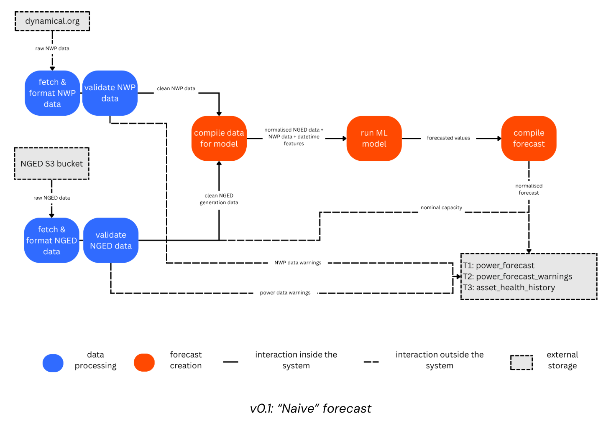
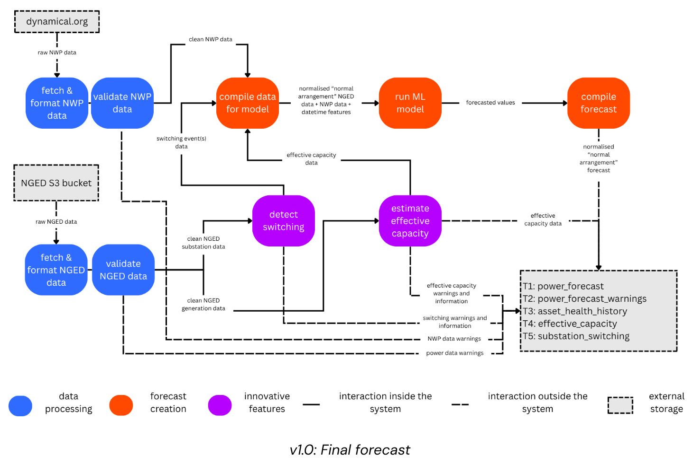

# Roadmap

This roadmap outlines the planned order of development toward the v1.0 live forecast release
(January 2027) and beyond. This page was last substantially revised **July 2026**, following a full codebase
review and a reprioritisation (decided 2026-07-01): **the top priority is getting *any* v0.1
forecast running on AWS** — scientific-improvement work waits until the live service is running.
Technical plans change as we learn more — treat this as a best-estimate, not a guarantee.

> **Status legend** (used throughout these design docs):
> ✅ **Implemented** — exists in code today ·
> 🚧 **Planned** — designed, not yet built ·
> 🔬 **Research** — exploratory / v2.

## How planning works

Planning content lives in four places with deliberately non-overlapping jobs:

| Place | Job |
|---|---|
| **GitHub** ([issues](https://github.com/openclimatefix/nged-substation-forecast/issues) + the OCF Project board) | The **complete, ordered task list** — including quick tweaks and non-code tasks — plus all discussion. **Fine-grained prioritisation lives only in GitHub.** Epics map 1:1 to the milestones below; dependencies are recorded as `blocked by` issue relationships. |
| **`docs/roadmap/` (this folder)** | Design depth: What we plan to build and *why*. The milestone arc and inter-plan dependencies are recorded here; fine-grained task-level ordering is not. |
| **`docs/`[techniques](../techniques/index.md), [background](../background/network.md), [architecture](../architecture/overview.md), [ml_experimentation](../ml_experimentation/index.md), [live_service](../live_service/index.md)** | What is already built — design (`architecture/`) and operational how-to (`ml_experimentation/`, `live_service/`) alike. This is where content moves to from `docs/roadmap/` after implementation. |
| **`plans/`** (repo root, not published) | At most **one** file: the mechanical checklist for the PR currently in flight, deleted when it merges. Usually empty. |

**Relationship between `docs/roadmap/` and GitHub**: Every substantial 🚧 plan in the
`docs/roadmap/` folder has a GitHub issue, and every dependency stated in `docs/roadmap/` exists as
a `blocked by` link on GitHub — but GitHub freely contains small issues with no counterpart here in
the docs. (🔬 research ideas are exempt from GitHub until they are promoted to a milestone.) The
litmus test for needing a design doc in `docs/roadmap/`: *does it take more than a few sentences to explain?*

When a piece of work ships, its design content **moves out** of `roadmap/` to its permanent home
— and the roadmap page shrinks; when a page's last 🚧 item ships, the page is deleted. That
permanent home splits along a **why vs. how** line: `architecture/` holds system design — the
decisions and rationale, written once and rarely re-read step-by-step — while
[`ml_experimentation/`](../ml_experimentation/index.md) and
[`live_service/`](../live_service/index.md) hold operational how-to — step-by-step recipes for
running what's already built, one per area (ML backtesting vs. the live production service).
Each `architecture/` design page names its how-to counterpart (and vice versa) in a "See also"
section — e.g. [ML Orchestration Design](../architecture/ml-orchestration.md) ↔
[ML Experimentation](../ml_experimentation/index.md), and
[Production Deployment — Design](../architecture/production-deployment.md) ↔
[Deploying a new production image](../live_service/deployment.md). A page mixing the two — design
rationale followed by a runbook with literal commands — is a sign it should split along this line.
The `docs/roadmap/` folder therefore contains **only design for work that is not yet implemented**,
and is never a mirror of the code. Because roadmap pages are deletable, **code must never link into
`roadmap/`** — instead, code docstrings link to the durable sections (`techniques/`,
`architecture/`, `background/`, `ml_experimentation/`, `live_service/`) instead. The *methods*
behind these plans — differentiable physics, learned encoders, the disaggregation-evaluation
protocol — live in [Techniques](../techniques/index.md) for exactly this reason: they survive the
roadmap items that apply them.

### Which place do I use?

| I want to… | Go to |
|---|---|
| Decide what to work on this morning | The GitHub Project board (complete, ordered) |
| Discuss / challenge a plan | GitHub issue comments (fold conclusions back into the roadmap page) |
| Think through a substantial design | A `docs/roadmap/` page, reviewed via PR |
| Communicate direction to NGED / leadership | The [milestones](#milestones) below (published site) |
| Give an AI coding tool context on the broader plan | `docs/roadmap/` (plus `gh` for live task priorities) |
| Understand a method (DP, encoders, …) | [`docs/techniques/`](../techniques/index.md) |
| Understand *why* something already built works the way it does | [`docs/architecture/`](../architecture/overview.md) |
| Learn *how* to run/operate something already built, step by step | [`docs/ml_experimentation/`](../ml_experimentation/index.md), [`docs/live_service/`](../live_service/index.md) |
| File a quick tweak or a non-code task | A GitHub issue only — no markdown needed |
| Write the mechanical checklist for the PR in flight | `plans/` (single file, deleted on merge) |

## Design documents

- [Delivery tables](delivery-tables.md) — the five Delta Lake tables OCF delivers to NGED
  (`power_forecast`, `power_forecast_warnings`, `asset_health_history`, `effective_capacity`,
  `substation_switching`), with full field-level schemas.
- [Forecast building blocks](forecast-building-blocks.md) — "normal" vs. "prevailing conditions"
  forecasts, sign conventions, and worked examples.
- [Metrics & leaderboard](metrics-and-leaderboard.md) — cross-fold validation protocol, evaluation
  metrics, horizon time-slices, and leaderboard grouping tags.
- [Data sources](data-sources.md) — NGED power data + supporting files, network topology, and the
  weather datasets (ECMWF ENS, CERRA, CM SAF).
- [Live service](live-service.md) — the v0.1 deployment: the `live_forecasts` inference
  asset, the champion-model container, the costed AWS architecture options, and production
  monitoring.
- [XGBoost improvements](xgboost-improvements.md) — the v0.5 experiment backlog: four effort
  tiers, ordered best bang-for-the-buck within each tier, targeting the 3–10 day user band.
- [Engineering health](engineering-health.md) — CI, reproducibility stamping, NWP
  ingestion checks, Hydra removal, and scientific-rigor tests.
- [Capacity estimation](capacity-estimation.md) — the v0.7 head-to-head between candidate
  estimators of the time-varying effective capacity of metered generators: a
  [convex (CVXPY)](../techniques/convex-optimisation.md) censored quantile-envelope estimator, a
  [differentiable-physics](../techniques/differentiable-physics.md) variational estimator, and
  cheap baselines — the winner ships in v1.
- [Net-demand disaggregation](disaggregation.md) — the canonical v2 research arc:
  graph-structured disaggregation of net substation power into latent demand and DER generation,
  the convex dictionary baseline, MVA metering, prior art, and the novelty claims.
- [Switching events](switching-events.md) — the canonical treatment of switching events and
  estimating latent demand under the normal running arrangement: the v0.6 unsupervised statistical
  detector and the v2 mixture models (the graph is a data structure).

## Milestones

The milestone sections below show the order in which this work is planned. Each maps 1:1 to a
GitHub epic issue.

---

## v0.1 — "Naive" MVP (internal only)

*Epic: [#137](https://github.com/openclimatefix/nged-substation-forecast/issues/137) — deploy the
naive forecast on AWS. **This is the current focus.***

**Goal**: A simple XGBoost forecast that lets us test infrastructure end-to-end and establish a
baseline. Intentionally does not detect switching events or estimate effective capacity — hence
"naive" (assumes the grid is always in perfect health). The data pipeline, per-series XGBoost
models, and CV leaderboard are already built; the remaining work is deployment — see
[Live service](live-service.md).

---

## v0.2 — Code Quality & Documentation

*Epic: [#138](https://github.com/openclimatefix/nged-substation-forecast/issues/138)*

- More unit tests, including scientific-rigor tests (CV-windowing no-lookahead,
  leaderboard-fairness, determinism)
- CI on GitHub (ruff + ty + pytest on every PR)
- Improve documentation
- Verify daylight savings time handling is correct
- Reproducibility stamping: git SHA + Delta table versions on every MLflow run
- Drop Hydra in favour of plain YAML + importlib + pydantic

---

## v0.3 — Leaderboard / Performance Analysis

*Epic: [#6](https://github.com/openclimatefix/nged-substation-forecast/issues/6)*

- Implement the ML energy forecasting "leaderboard" (cross-fold validation metrics in MLflow), ready for systematic ML experimentation ✓ (CV assets added)
- Metrics: normalised MBE, normalised MAE, RMSE, Pinball loss, PICP, CRPS, Spread-Skill Ratio — the
  deterministic metrics are ✅; the probabilistic ones are 🚧 (see
  [Metrics & leaderboard](metrics-and-leaderboard.md))
- Time-slice filters: nowcasting (0–6 h), day-ahead (6–36 h), medium range (Day 2–7), extended range (Day 8–14), peak events (top 5%)
- Baseline forecasters (persistence + climatology) so leaderboard scores are interpretable
- Production monitoring of the live service (`production_monitoring` metrics scope)

---

## v0.4 — Improved Automatic Data Cleaning

*Epic: [#150](https://github.com/openclimatefix/nged-substation-forecast/issues/150)*

- More sophisticated automatic cleaning of NGED's power data (building on the basic cleaning in v0.1)

---

## v0.5 — XGBoost Upgrades ("Quick Wins")

*Epic: [#145](https://github.com/openclimatefix/nged-substation-forecast/issues/145)*

Establish a strong XGBoost baseline before investing in capacity estimation and switching event detection.

The full experiment backlog — fifteen ideas across four effort tiers, ordered best
bang-for-the-buck within each tier — is in [XGBoost improvements](xgboost-improvements.md).
This milestone also carries the **quantile-ensemble pipeline** (per-member quantile forecasts
pooled into delivered percentiles — Phase D of
[Delivering the probabilistic metrics](metrics-and-leaderboard.md#delivering-the-probabilistic-metrics);
theory in
[Probabilistic forecasting from NWP ensembles](../techniques/probabilistic-forecasting.md)),
which builds directly on the lead-time-feature and ensemble-member-training wins in that
backlog.

**Automated experimentation ("auto-research")**:

Once the leaderboard (v0.3) is stable, we plan to drive hyperparameter and feature search with an LLM agent in the style of Karpathy's "auto-research": the agent programmatically registers experiments, materialises them, reads the MLflow leaderboard, and iterates — with no human in the loop and no Dagster UI in the path. (This may have to wait until v2).

The ML-assets architecture is designed to support this from day one (programmatic experiment registration, MLflow as a machine-readable leaderboard, a manual retirement job to prune the experiment catalogue). The one piece to add when we start is a thin Python/CLI surface for "fetch the aggregate leaderboard metrics for experiment X" so the agent reads results without scraping the UI.

---

## v0.6 — Switching Events

*Epic: [#151](https://github.com/openclimatefix/nged-substation-forecast/issues/151). Internal
only for first month, then shared with NGED. (v0.6 vs v0.7: we don't yet know which of switching
events and capacity estimation will actually land first — but naming one v0.6 and the other v0.7
beats the ambiguity of "v0.6 or v0.7"; we'll swap them later if reality disagrees.)*

- Detect "abnormal running arrangement" events from the power time series alone, using statistical methods — see [Switching events & latent demand](switching-events.md)
- Ingest the NGED supporting files the detector needs (substation adjacency, switching logs as the validation oracle)
- Use the detected switching events to clean training data: train XGBoost only on "normal arrangement" periods
- Populate the `substation_switching` Delta table

---

## v0.7 — Dynamic Generator Capacity

*Epic: [#141](https://github.com/openclimatefix/nged-substation-forecast/issues/141). Internal
only for first month, then shared with NGED.*

**Dynamic effective capacity estimation for *metered* generators ([capacity estimation](capacity-estimation.md))**:

- Estimate the effective capacity of the *metered* wind and solar PV generators over time — it bumps up and down with maintenance, faults and build-out — by racing several candidate estimators head-to-head on the same data: a [convex (CVXPY)](../techniques/convex-optimisation.md) censored quantile-envelope estimator, a [differentiable-physics (PyTorch)](../techniques/differentiable-physics.md) variational estimator, and cheap baselines. The winner ships in v1; the judging criteria (including uncertainty quality) are on the [capacity estimation](capacity-estimation.md) page. A deliberate secondary goal of the contest is building hands-on CVXPY experience, to inform v2 tooling choices and our advice to NGED. The "clever" latent-demand and abnormal-running-arrangement inversion is explicitly **not** in scope here — that is [v2 research](disaggregation.md).
- Two-pass approach: first pass estimates effective capacity; second pass normalises the time series by effective capacity before training the power forecast model
- Ingest additional weather datasets needed for capacity estimation:
    - **CERRA** (Copernicus regional reanalysis) — high-resolution historical weather, useful for pre-training and for estimating historical generator capacity
    - **CM SAF** (Satellite Application Facility on Climate Monitoring) — high-resolution satellite-derived irradiance, used to estimate solar PV capacity
- Populate the `effective_capacity` Delta table

**Dynamic effective capacity estimation for substations**:

- For now, while we're forecasting substations top-down, just use the 99th percentile per year as
  the effective capacity. Later, in v2, the system should already capture everything we need to
  know about substation capacity, as a function of all the things that drive the substation's
  behaviour.

**"Prevailing conditions" building block** (needs both the v0.6 switching and v0.7 capacity blocks):

- Produce example Python code for NGED to construct a "prevailing conditions" forecast from OCF's building blocks

---

## v1.0 — Stable Live Service for NGED's Trial Area

*Epic: [#133](https://github.com/openclimatefix/nged-substation-forecast/issues/133)*

Target: **January 2027**

- All features listed above (v0.1–v0.7), plus fixes discovered during live running
- 32 time series in the NGED trial area: 16 primary substations, 6 solar PV farms, 3 wind farms, 2 GSPs, 2 BSPs, 1 biofuel generator, 1 BESS, 1 reciprocating gas generator
- Five Delta Lake output tables delivered to NGED every 6 hours:
    1. `power_forecast` — [−1, +1] ensemble power forecasts
    2. `power_forecast_warnings` — per-`time_series_id` warnings (HEALTHY, MISSING VALUE, STUCK TIMESERIES, INVALID TIMESERIES VALUE, GENERATOR OR CIRCUIT FAULT, GENERATOR REDUCED CAPACITY, SUBSTATION ABNORMAL RUNNING ARRANGEMENT, STALE NWP, STALE POWER)
    3. `asset_health_history` — complete historical record of each time series's health state
    4. `effective_capacity` — half-hourly probabilistic effective-capacity estimates (mean + std
       after the v0.7 upgrade,
       [#247](https://github.com/openclimatefix/nged-substation-forecast/issues/247); a static
       scalar per series in v0.1)
    5. `substation_switching` — estimated power diverted between substation pairs (mean + std)

---

## v2.0 — Scale-Up (Future Research)

*Epic: [#156](https://github.com/openclimatefix/nged-substation-forecast/issues/156) (WP5:
delivery of the v2 live service)*

**Required**:

- Scale to approximately 2,500 time series: all of NGED's primary substations (1,161), BSPs (271), GSPs (52), and most customer meters (~1,000)
- Estimate the installed capacity of *unmetered* solar PV and wind on each primary substation (by [disaggregating net primary substation power flows](disaggregation.md))
- Compare top-down forecasts vs. bottom-up forecasts for BSPs and GSPs

**Research (advanced ML)**:

- **Graph-structured disaggregation**: Model substations, metered generators, and unmetered generator fleets as nodes in an electrical/spatial graph, with edges representing physical connections. The graph is a **data structure** — a structural prior on who can exchange load and which sites share weather: each substation is reconstructed as a sum of per-site differentiable-physics modules with inferred capacities, and cross-site gains come from hierarchical parameter sharing. (See [Net-demand disaggregation](disaggregation.md) — the canonical page for this arc, including the [convex dictionary baseline](disaggregation.md#the-convex-dictionary-baseline) it must beat — and [Switching events, Part 2](switching-events.md).)
- **Latent-demand recovery under switching**: reconstruct the demand each substation would have metered under the *normal running arrangement*, using a time-varying neighbourhood mixture (optionally type-resolved into demand / PV / wind) over the network graph. This reconstructs the topology-normalised demand NGED requires, and goes beyond the v0.6 statistical detector — which only flags and masks switching periods. See [Switching events & latent demand](switching-events.md).
- **Pre-trained neural network [encoders](../techniques/encoders.md)**: "weather encoder" and "time encoder" pre-trained on large datasets, then fine-tuned for substation forecasting
- **Multi-sequence alignment** with axial attention: find "similar" historical days and feed them as additional context to the forecasting model
- **CRPS training objective**: train the ensemble power forecast model to directly optimise CRPS for sharper probabilistic forecasts
- **JEPA** (Joint Embedding Predictive Architecture, à la Yann LeCun): adapt to demand forecasting using JEPA's encoder and predictor as the "load" module in the graph-structured disaggregation engine
- **[Differentiable physics](../techniques/differentiable-physics.md) for power forecasting** (not just capacity estimation): use DP models to directly forecast power, handling MVA metering natively (see [the graph-structured engine](disaggregation.md#the-graph-structured-engine) and [MVA metering](disaggregation.md#apparent-power-mva-metering))
- **Additional NWP sources (far from certain that we'll get round to this)**: explore whether adding further NWP sources — e.g. ICON-EU from Dynamical.org — improves forecast skill over ECMWF ENS alone. Sources with shorter history than the canonical CV folds (ICON-EU starts early 2026) cannot enter the leaderboard directly; they are first assessed via a controlled ad-hoc ablation, and only promoted to a new leaderboard epoch once they have ~1–2 complete years of history

**Stretch goals**:

- Forecast *unmetered* solar and wind power at each primary substation
- Disaggregate additional DERs (price-sensitive assets like batteries) from substation power flow
- Estimate cost savings (£) attributable to each forecasting approach in the leaderboard
- Build a REST API on top of the Delta Lake delivery mechanism (purely additive — see [when a REST API would earn its keep](../architecture/forecast-delivery.md#when-would-a-rest-api-earn-its-keep))
