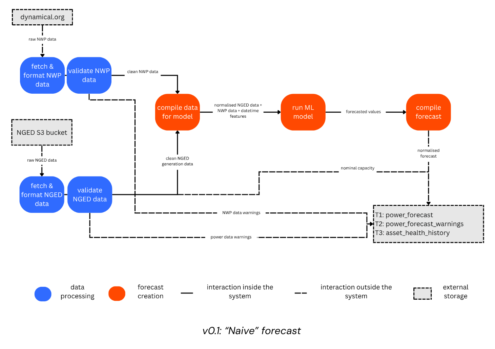
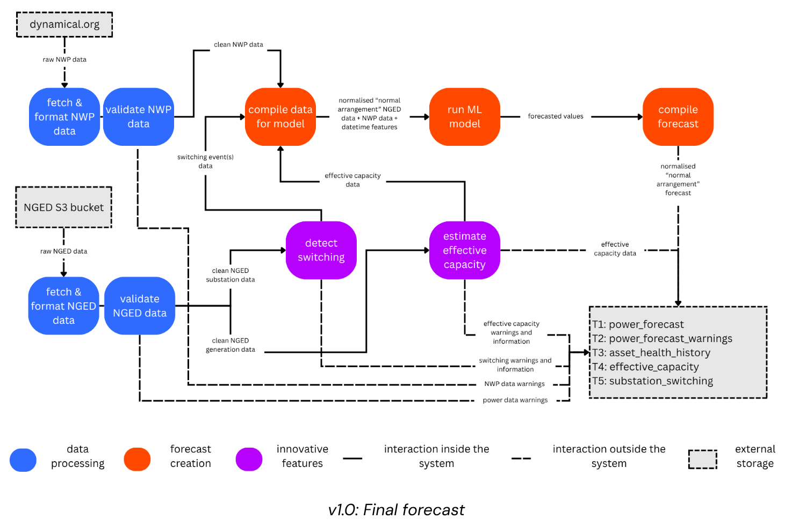

# Roadmap

This roadmap outlines the planned order of development toward the v1.0 live forecast release
(January 2027) and beyond. This page was last substantially revised **July 2026**, following a full codebase
review and a reprioritisation (decided 2026-07-01) that made **getting *any* forecast running on
AWS** the top priority over scientific-improvement work. That shipped as v0.1 in July 2026; the
live service is now on v0.2 (deployed 13 August 2026), and work continues on the milestones below
toward v1.0. Technical plans change as we learn more — treat this as a best-estimate, not a
guarantee.

> For how this page relates to GitHub issues, `docs/architecture/`, and the rest of the docs —
> and which place to put new planning content — see the
> [Documentation Guide](../documentation-guide.md).
>
> **Status legend** (used throughout these design docs):
> ✅ **Implemented** — exists in code today ·
> 🚧 **Planned** — designed, not yet built ·
> 🔬 **Research** — exploratory / v2.

## Design documents

- [Delivery tables](delivery-tables.md) — the five Delta Lake tables OCF delivers to NGED
  (`power_forecast`, `power_forecast_warnings`, `asset_health_history`, `effective_capacity`,
  `substation_switching`), with full field-level schemas.
- [Forecast building blocks](forecast-building-blocks.md) — "normal" vs. "prevailing conditions"
  forecasts, sign conventions, and worked examples.
- [Metrics & leaderboard](metrics-and-leaderboard.md) — cross-fold validation protocol, evaluation
  metrics, horizon time-slices, and leaderboard grouping tags.
- [Estimating the money a better forecast saves](cost-savings-metrics.md) — the two £ leaderboard
  metrics (flexibility procurement and curtailment), the equal-risk method that avoids needing a
  price for a network breach, their limitations, and the open questions for NGED.
- [Data sources](data-sources.md) — NGED power data + supporting files, network topology, and the
  weather datasets (ECMWF ENS, ERA5, CM SAF).
- [Live service](live-service.md) — the AWS deployment: the `live_forecasts` inference
  asset, the champion-model container, the costed AWS architecture options, and production
  monitoring.
- [Handover to NGED](handover.md) — the preferred post-NIA operating model (NGED runs the
  service themselves, on NGED's AWS — their stated preference as of 2026-07-14, pending NGED
  internal sign-off): the operator-contract design constraint, and the handover workstreams
  (runbooks, alert-on-absence, infra-as-code, NGED landing-zone probing, game days).
- [XGBoost improvements](xgboost-improvements.md) — the v0.5 experiment backlog: four effort
  tiers, ordered best bang-for-the-buck within each tier, targeting the 3–10 day user band.
- [Extending the training history](training-history.md) — using ERA5 to train on the power data
  that predates the ECMWF ENS archive: the era-confounding hazard that dictates the ingest's
  scope, the reconciliation and pooling variants, the COVID covariate, and why ERA5 scoring is a
  diagnostic rather than a promotion criterion.
- [Engineering health](engineering-health.md) — scientific-rigor tests and cleanup.
- [Capacity estimation](capacity-estimation.md) — the v0.7 head-to-head between candidate
  estimators of the time-varying effective capacity of metered generators: a
  [convex (CVXPY)](../techniques/convex-optimisation.md) censored quantile-envelope estimator, a
  [differentiable-physics](../techniques/differentiable-physics.md) variational estimator, and
  cheap baselines — the winner ships in v1.
- [Net-demand disaggregation](disaggregation.md) — the canonical v2 research arc:
  graph-structured disaggregation of net substation power into latent demand and DER generation,
  the convex dictionary baseline, MVA metering, prior art, and the novelty claims.
- [Switching events](switching-events.md) — the canonical treatment of switching events and
  estimating latent demand under the normal running arrangement: the v0.6 unsupervised statistical
  detector and the v2 mixture models (the graph is a data structure).

## Milestones

The milestone sections below show the order in which this work is planned. Each maps 1:1 to a
GitHub epic issue.

---

## v0.1 — "Naive" MVP (internal only)

*Epic: [#137](https://github.com/openclimatefix/nged-substation-forecast/issues/137) — deploy the
naive forecast on AWS. **✅ Shipped July 2026** (`v0.1.0`), superseded on AWS by v0.2 on
13 August 2026.*

**Goal**: A simple XGBoost forecast that lets us test infrastructure end-to-end and establish a
baseline. Intentionally does not detect switching events or estimate effective capacity — hence
"naive" (assumes the grid is always in perfect health). The data pipeline, per-series XGBoost
models, and CV leaderboard were already built; the remaining work was deployment, now running on
AWS — see [Live service](live-service.md).

---

## v0.2 — Code Quality & Documentation

*Epic: [#138](https://github.com/openclimatefix/nged-substation-forecast/issues/138) — code
quality, reproducibility, and observability hardening. **✅ Shipped 13 August 2026** (`v0.2.0`)
— running on AWS.*

- More unit tests, including feature-level lag-leakage and forecaster-level determinism tests ✅
  ([#62](https://github.com/openclimatefix/nged-substation-forecast/issues/62); exercised by
  `test_nullify_leaky_lags`, `test_engineer_features_weather_lag_leakage_prevention` and
  `test_random_seed_makes_training_deterministic`, alongside new package coverage for
  `dynamical_data` ([#163](https://github.com/openclimatefix/nged-substation-forecast/issues/163))
  and `geo` ([#164](https://github.com/openclimatefix/nged-substation-forecast/issues/164))). The
  CV-windowing no-lookahead, leaderboard-fairness and fold-level determinism guardrail tests
  remain unwritten — see
  [Engineering health](engineering-health.md#scientific-rigor-tests-and-cleanup)
- CI on GitHub (ruff + ty + pytest on every PR) ✅ (per-PR gate + nightly network tests; see
  [Testing → Continuous integration](../architecture/testing.md#continuous-integration))
- Improve documentation ✅
  ([#139](https://github.com/openclimatefix/nged-substation-forecast/issues/139))
- Verify daylight savings time handling is correct ✅
  ([#84](https://github.com/openclimatefix/nged-substation-forecast/issues/84);
  `test_apply_local_time_features_dst_transitions` covers both the spring-forward and fall-back
  transition instants)
- Reproducibility stamping: git SHA + Delta table versions on every MLflow run ✅ (implemented in
  `ml_core.repro`; every MLflow run carries the stamp)
- Drop Hydra in favour of plain YAML + importlib + pydantic ✅ (`contracts.config_schemas` owns the
  `_target_` round-trip; dropping the two dependencies also unpinned `antlr4-python3-runtime`,
  which had been breaking Dagster's asset-selection strings)
- Asset check on `live_forecasts` reporting **missed NWP runs** at forecast time
  ([#424](https://github.com/openclimatefix/nged-substation-forecast/issues/424)) ✅
  (`live_forecasts_are_healthy`: it also reads the slot's rows back off disk, so every production
  asset now has a check — including the one NGED consume)
- Start the [intervention log](../live_service/intervention-log.md) ✅ (started with the v0.1 AWS
  period; its measurement window opens at v1.0, but it cannot be reconstructed retrospectively,
  which is why it exists now)

---

## v0.3 — Leaderboard / Performance Analysis

*Epic: [#6](https://github.com/openclimatefix/nged-substation-forecast/issues/6)*

- Implement the ML energy forecasting "leaderboard" (cross-fold validation metrics in MLflow), ready for systematic ML experimentation ✓ (CV assets added)
- Metrics: MBE, MAE, NMAE, RMSE, Pinball loss, PICP, interval width, CRPS, Spread-Skill Ratio —
  all ✅ (definitions in the
  [evaluation-metrics reference](../techniques/evaluation-metrics.md); plan and remaining 🚧
  items in [Metrics & leaderboard](metrics-and-leaderboard.md))
- Time-slice filters: nowcasting (0–6 h), day-ahead (6–36 h), medium range (Day 2–7), extended range (Day 8–14), peak events (top 5%)
- Baseline forecasters (persistence + climatology) so leaderboard scores are interpretable
- **Cost-savings metrics (£)** — two figures per leaderboard row, for flexibility procurement and
  for curtailment, scored against manual review and against a perfect forecast; see
  [Estimating the money a better forecast saves](cost-savings-metrics.md). Expected to be the
  metrics NGED read first, so they land early in this milestone.
- Production monitoring of the live service (`production_monitoring` metrics scope)
- **Failure-scenario evaluation** — the evaluation machinery must precede the v0.5 experiments it
  is meant to judge, or v0.5 picks a champion blind to how it behaves when inputs degrade:
    - Canonical failure-scenario suite: named, versioned degradation transforms
      ([#437](https://github.com/openclimatefix/nged-substation-forecast/issues/437)) —
      see [Scoring under failure scenarios](metrics-and-leaderboard.md#scoring-under-failure-scenarios)
    - Degradation smoke-tests in CI
      ([#436](https://github.com/openclimatefix/nged-substation-forecast/issues/436))
    - Score every leaderboard experiment under each scenario, against `nged_incumbent`
      ([#438](https://github.com/openclimatefix/nged-substation-forecast/issues/438))
- One-command rollback for `promoted_model`
  ([#440](https://github.com/openclimatefix/nged-substation-forecast/issues/440)), plus the runbooks
  that pin down what "one command" means
  ([#448](https://github.com/openclimatefix/nged-substation-forecast/issues/448))

---

## v0.4 — Automatic Data Cleaning

*Epic: [#150](https://github.com/openclimatefix/nged-substation-forecast/issues/150)*

- Automatic cleaning of NGED's power data. Versions 0.1 to 0.3 do none: the models train on,
  and the live service forecasts from, raw NGED telemetry
- `power_forecast_warnings` **Phase 1** — `STALE NWP` and `STALE POWER`, with `warning_source`
  ([#439](https://github.com/openclimatefix/nged-substation-forecast/issues/439))
- `power_forecast_warnings` **Phase 2** — the meter-error warning types, which are this milestone's
  cleaning detections surfaced to NGED
  ([#441](https://github.com/openclimatefix/nged-substation-forecast/issues/441))
- The `asset_health_history` table — the historical view of the same detections
  ([#442](https://github.com/openclimatefix/nged-substation-forecast/issues/442))

---

## v0.5 — XGBoost Upgrades ("Quick Wins")

*Epic: [#145](https://github.com/openclimatefix/nged-substation-forecast/issues/145)*

Establish a strong XGBoost baseline before investing in capacity estimation and switching event detection.

The full experiment backlog — four effort tiers, ordered best bang-for-the-buck within each
tier — is in [XGBoost improvements](xgboost-improvements.md).

This milestone also carries the **ERA5 ingest**
([#143](https://github.com/openclimatefix/nged-substation-forecast/issues/143), moved here from
v0.7) and the **pre-training experiments** it unlocks
([#167](https://github.com/openclimatefix/nged-substation-forecast/issues/167)) — see
[Extending the training history](training-history.md). Our power data reaches back to late 2019
while the ENS archive starts 2024-04-01, and Dynamical.org's ENS back-fill is not expected until
~November 2027, so ERA5 is how the seasonal experiments on this page get more than one winter to
learn from. The Tier-1 and Tier-2 config wins do not wait for it.

This milestone also carries the **quantile-ensemble pipeline** (per-member quantile forecasts
pooled into delivered percentiles — Phase D of
[Delivering the probabilistic metrics](metrics-and-leaderboard.md#delivering-the-probabilistic-metrics);
theory in
[Probabilistic forecasting from NWP ensembles](../techniques/probabilistic-forecasting.md)),
which builds directly on the lead-time-feature and ensemble-member-training wins in that
backlog.

It also carries the **degradation** half of the
[inherent-stability](../design-philosophy/inherent-stability.md) work, which is gated on that same
quantile pipeline:

- Degradation-conditional interval calibration — conformal prediction per regime
  ([#443](https://github.com/openclimatefix/nged-substation-forecast/issues/443)), so the bands
  widen honestly when the inputs degrade rather than staying over-confident
- The weather-blind guarantee: outage-shaped training augmentation
  ([#445](https://github.com/openclimatefix/nged-substation-forecast/issues/445)), which is what
  makes "never worse than the incumbent" true rather than hopeful
- Clear-sky as the zero-data **floor**
  ([#444](https://github.com/openclimatefix/nged-substation-forecast/issues/444)), extending
  [#168](https://github.com/openclimatefix/nged-substation-forecast/issues/168)
- Make `live_forecasts` degrade rather than raise when NWP is absent
  ([#446](https://github.com/openclimatefix/nged-substation-forecast/issues/446)) — deliberately
  gated on the two items above, since degrading earlier would emit output no scenario has tested

**Automated experimentation ("auto-research")**:

Once the leaderboard (v0.3) is stable, we plan to drive hyperparameter and feature search with an LLM agent in the style of Karpathy's "auto-research": the agent programmatically registers experiments, materialises them, reads the MLflow leaderboard, and iterates — with no human in the loop and no Dagster UI in the path. (This may have to wait until v2).

The ML-assets architecture is designed to support this from day one (programmatic experiment
registration, MLflow as a machine-readable leaderboard, a manual retirement job to prune the
experiment catalogue). The one piece to add when we start is a **machine-readable leaderboard**: a
thin, typed Python surface answering "fetch the aggregate leaderboard metrics for experiment X" and
"rank every experiment by metric Y", so the agent reads results without scraping a UI. The visual
leaderboard ([#4](https://github.com/openclimatefix/nged-substation-forecast/issues/4)) needs the
same query underneath it, so writing that query as a reusable function rather than burying it in
the chart script is what makes the agent's surface nearly free when we get there.

MLflow's own MCP server does not serve this need, so it is not a shortcut we can take instead. Its
tools are generated by capturing the stdout of a curated subset of MLflow CLI commands, so a client
receives rendered text tables rather than structured data. And the two run-reading tools it exposes
(`list_runs`, `describe_run`) accept neither a filter nor an `order_by`. Ranking N experiments
therefore costs N+1 round trips of text to parse — precisely the operation a leaderboard exists to
perform.

---

## v0.6 — Switching Events

*Epic: [#151](https://github.com/openclimatefix/nged-substation-forecast/issues/151). Internal
only for first month, then shared with NGED. (v0.6 vs v0.7: we don't yet know which of switching
events and capacity estimation will actually land first — but naming one v0.6 and the other v0.7
beats the ambiguity of "v0.6 or v0.7"; we'll swap them later if reality disagrees.)*

- Build the shared switching infrastructure: the stage-1 weather/calendar baseline, normalised residuals, the labelled event table, and the synthetic-injection harness — see [Switching events & latent demand](switching-events.md)
- Ingest the NGED supporting files this needs (substation adjacency, switching logs)
- Make the forecaster switching-aware with residual, event-age, and pooled-neighbour features, and run the v1 label-exclusion experiments — the feature-based mainline
- Conditional — see [the decision point](switching-events.md#the-decision-point-a-feature-based-mainline-vs-the-staged-detector): the discrete detector (changepoint detection and attribution), training-data cleaning from detected events, and the `substation_switching` Delta table

---

## v0.7 — Dynamic Generator Capacity

*Epic: [#141](https://github.com/openclimatefix/nged-substation-forecast/issues/141). Internal
only for first month, then shared with NGED.*

**Dynamic effective capacity estimation for *metered* generators ([capacity estimation](capacity-estimation.md))**

**The estimator is chosen by racing candidates head-to-head on the same data, and the winner ships
in v1.** What they estimate is the effective capacity of the *metered* wind and solar PV generators
over time, which bumps up and down with maintenance, faults, and build-out. The contenders are a
[convex (CVXPY)](../techniques/convex-optimisation.md) censored quantile-envelope estimator, a
[differentiable-physics (PyTorch)](../techniques/differentiable-physics.md) variational estimator,
and cheap baselines. The judging criteria — including uncertainty quality and [robustness to missing
inputs](capacity-estimation.md#robustness-to-missing-inputs), scored against the same
failure-scenario vocabulary the forecasting leaderboard uses — are on the [capacity
estimation](capacity-estimation.md) page.

**Capacity estimation is the first model family we must actively *build* for missingness.** A
differentiable-physics estimator [degrades most gracefully of
all](../techniques/differentiable-physics.md#graceful-degradation-when-an-input-is-missing), and
that should count in the judging.

**A deliberate secondary goal of the contest is building hands-on CVXPY experience**, to inform v2
tooling choices and our advice to NGED.

**The "clever" latent-demand and abnormal-running-arrangement inversion is explicitly not in scope
here.** That inversion is [v2 research](disaggregation.md).

The remaining work items for metered-generator capacity:

- Two-pass approach: first pass estimates effective capacity; second pass normalises the time series by effective capacity before training the power forecast model
- Ingest **CM SAF** (Satellite Application Facility on Climate Monitoring) — high-resolution satellite-derived irradiance, used to estimate solar PV capacity ([data sources](data-sources.md#weather-data)). Capacity estimation also needs ERA5, which [v0.5](#v05-xgboost-upgrades-quick-wins) already ingests to serve the pre-training experiments
- Populate the `effective_capacity` Delta table

**Consider testing CAMS — the Copernicus Atmosphere Monitoring Service solar radiation time
series — alongside CM SAF ([data sources](data-sources.md#weather-data)).** Both are **offline** sources:
each feeds historical capacity estimation, and the production serving path depends on neither, so
CAMS's near-real-time freshness is not the reason to look at it. The reason is that CAMS offers
steps down to 1 minute where SARAH-3 stops at 30, which is what the [dynamic thermal
model](../techniques/differentiable-physics.md) would need.

**The cost of looking is small.** CAMS serves one point per request rather than a grid, but the [v1
trial area](../index.md#scope) needs at most 32 requests, and 6 of those requests cover its solar
farms. A head-to-head against SARAH-3 on those sites settles whether sub-hourly irradiance improves
the fitted plant model before anything larger is committed to.

**Dynamic effective capacity estimation for substations**:

- For now, while we're forecasting substations top-down, just use the 99th percentile per year as
  the effective capacity. Later, in v2, the system should already capture everything we need to
  know about substation capacity, as a function of all the weather, demand, and topology drivers
  of the substation's behaviour.

**"Prevailing conditions" building block** (needs both the v0.6 switching and v0.7 capacity blocks):

- Produce example Python code for NGED to construct a "prevailing conditions" forecast from OCF's building blocks

---

## v0.8 — Improve Live Service

*Epic: [#323](https://github.com/openclimatefix/nged-substation-forecast/issues/323)*

The bucket for **operational improvements to the running live service** — efficiency,
robustness, and operability polish discovered during early live running, as distinct from the
forecast-skill milestones above. Items so far:

- Replace the polling schedules with Dagster sensors
  ([#324](https://github.com/openclimatefix/nged-substation-forecast/issues/324)): cheap
  "is there new data?" detection runs on the control-plane box, and Fargate tasks launch only
  when there is real work to do. Design context:
  [Production Deployment — Design](../architecture/production-deployment.md#running-the-data-ingest-runs-on-the-control-plane-vm).
- Codify the AWS infrastructure as infra-as-code
  ([#326](https://github.com/openclimatefix/nged-substation-forecast/issues/326)): the
  Terraform-vs-CDK question and the sequencing (start at access-phasing Stage 2) are in the
  [live-service plan](live-service.md#deployment-workstream-3-aws-infrastructure); the
  account-portability requirement is in
  [Handover to NGED](handover.md#4-infrastructure-as-code-portable-to-ngeds-account).
- Consider five pieces of industry best practice we currently lack
  ([#449](https://github.com/openclimatefix/nged-substation-forecast/issues/449)): input-drift
  detection, shadow deployment of a challenger model, a schema-evolution policy for the delivery
  contract (which may need pulling forward to v0.6), statistical process control on forecast
  error, and naming *poka-yoke* among the design principles — each discussed in
  [Design Principles → Industry best practices we have not yet absorbed](../design-philosophy/design-principles.md#industry-best-practices-we-have-not-yet-absorbed).
  A holding issue: the task is
  to consider them once the live service has run for a while, not a commitment to build them.

---

## v0.9 — Nice-to-haves if we have time

*Epic: [#361](https://github.com/openclimatefix/nged-substation-forecast/issues/361)*

Genuinely optional experiments worth trying **if the schedule allows**, sitting between the
operational polish of v0.8 and the v1.0 trial-service milestone. Nothing downstream depends on
any of them — if we are short on time, none of it blocks v1.0. Each lands as its own registered
leaderboard experiment or controlled ad-hoc ablation, so we keep the result either way.

- **Neural net vs XGBoost as a leaderboard experiment**
  ([#362](https://github.com/openclimatefix/nged-substation-forecast/issues/362)): does a simple
  neural net — an MLP with a per-series embedding and quantile-regression heads — beat
  gradient-boosted trees? XGBoost suits the current per-series regime (one model per series, on
  the order of 10⁴–10⁵ rows), and the recurring "trees are bad at maths" pain is already handled
  cheaply by the physics and residual features on the
  [XGBoost improvements](xgboost-improvements.md) page. So the decisive, cheap test is the
  sibling of the
  [global model per `time_series_type`](xgboost-improvements.md#global-model-per-time_series_type)
  win: a global MLP against a global XGBoost on the *identical* feature frame, run once that
  win's prerequisites (per-series target normalisation, static per-series features, and
  init-time-anchored features) exist, so the comparison isolates the model family. A negative
  result de-risks the neural approaches on the [v2.0](#v20-scale-up-future-research) research
  list before we spend research time on the fancier ones. The spike must also **state and test how
  it handles missing inputs**: XGBoost gets NaN routing for free and an MLP does not, so a
  zero-filled MLP would lose the comparison for a reason that has nothing to do with model family
  (zero is a real physical value — see
  [Encoders → Handling missing inputs](../techniques/encoders.md#handling-missing-inputs-remove-the-token-dont-zero-fill)),
  and it should be scored under the failure-scenario suite like any other experiment.
- **Additional NWP source, e.g. ICON-EU**
  ([#363](https://github.com/openclimatefix/nged-substation-forecast/issues/363)): explore
  whether adding ICON-EU from Dynamical.org improves forecast skill over ECMWF ENS alone — the
  v1 nice-to-have version of the broader "further NWP sources" idea on the
  [v2.0 research list](#v20-scale-up-future-research). **Sized by the v0.5
  [perfect-weather ceiling](metrics-and-leaderboard.md#the-perfect-weather-ceiling-what-it-gates)**:
  a low ceiling means there is little forecast-error headroom to chase and this drops down the
  list — though not off it, because ICON-EU's ~6.5 km grid could still beat 31 km ERA5 on
  representativeness, which that ceiling does not bound. Because ICON-EU's history starts early
  2026 (shorter than the canonical CV folds) it is assessed via a controlled ad-hoc ablation,
  not the leaderboard, until it has ~1–2 complete years of history. See
  [Evaluating a data source whose history is shorter than the
  folds](../ml_experimentation/cross-validation-folds.md#evaluating-a-data-source-whose-history-is-shorter-than-the-folds).

---

## v1.0 — Stable Live Service for NGED's Trial Area

*Epic: [#133](https://github.com/openclimatefix/nged-substation-forecast/issues/133)*

Target: **January 2027**

- All features listed above (v0.1–v0.8), plus fixes discovered during live running
- 32 time series in the NGED trial area ([scope](../index.md#scope))
- Five Delta Lake output tables delivered to NGED every 6 hours:
    1. `power_forecast` — [−1, +1] ensemble power forecasts
    2. `power_forecast_warnings` — meter, generator, and feed-health warnings per
       `time_series_id` ([the nine warning types](delivery-tables.md#table-2-power_forecast_warnings))
    3. `asset_health_history` — complete historical record of each time series's health state
    4. `effective_capacity` — half-hourly probabilistic effective-capacity estimates (mean + std
       after the v0.7 upgrade,
       [#247](https://github.com/openclimatefix/nged-substation-forecast/issues/247); a static
       scalar per series in v0.1)
    5. `substation_switching` — estimated power diverted between substation pairs (mean + std)

---

## v2.0 — Scale-Up (Future Research)

*Epic: [#156](https://github.com/openclimatefix/nged-substation-forecast/issues/156) (WP5:
delivery of the v2 live service)*

**Required**:

- Scale to approximately 2,500 time series: all of NGED's primary substations (1,161), BSPs (271), GSPs (52), and most customer meters (~1,000)
- Estimate the installed capacity of *unmetered* solar PV and wind on each primary substation (by [disaggregating net primary substation power flows](disaggregation.md))
- Compare top-down forecasts vs. bottom-up forecasts for BSPs and GSPs

**Research (advanced ML)**:

- **Graph-structured disaggregation**: Model substations, metered generators, and unmetered generator fleets as nodes in an electrical/spatial graph, with edges representing physical connections. The graph is a **data structure** — a structural prior on who can exchange load and which sites share weather: each substation is reconstructed as a sum of per-site differentiable-physics modules with inferred capacities, and cross-site gains come from hierarchical parameter sharing. (See [Net-demand disaggregation](disaggregation.md) — the canonical page for this arc, including the [convex dictionary baseline](disaggregation.md#the-convex-dictionary-baseline) it must beat — and [the switching-events approaches](switching-events.md#the-approaches).)
- **Latent-demand recovery under switching**: reconstruct the demand each substation would have metered under the *normal running arrangement*, using a time-varying neighbourhood mixture (optionally type-resolved into demand / PV / wind) over the network graph. This neighbourhood-mixture approach reconstructs the topology-normalised demand NGED requires, and goes beyond the v0.6 statistical detector — which only flags and masks switching periods. See [Switching events & latent demand](switching-events.md).
- **Pre-trained neural network [encoders](../techniques/encoders.md)**: "weather encoder" and "time encoder" pre-trained on large datasets, then fine-tuned for substation forecasting
- **Multi-sequence alignment** with axial attention: find "similar" historical days and feed them as additional context to the forecasting model
- **CRPS training objective**: train the ensemble power forecast model to directly optimise CRPS for sharper probabilistic forecasts
- **JEPA** (Joint Embedding Predictive Architecture, à la Yann LeCun): adapt to demand forecasting using JEPA's encoder and predictor as the "load" module in the graph-structured disaggregation engine
- **[Differentiable physics](../techniques/differentiable-physics.md) for power forecasting** (not just capacity estimation): use DP models to directly forecast power, handling MVA metering natively (see [the graph-structured engine](disaggregation.md#the-graph-structured-engine) and [MVA metering](disaggregation.md#apparent-power-mva-metering))
- **Additional NWP sources (far from certain that we'll get round to this)**: explore whether adding further NWP sources — e.g. ICON-EU from Dynamical.org — improves forecast skill over ECMWF ENS alone. The v0.5 [perfect-weather ceiling](metrics-and-leaderboard.md#the-perfect-weather-ceiling-what-it-gates) sizes the forecast-error headroom a further source could recover; the separate case for a *finer-resolution* source survives a low ceiling, because that ceiling is measured on a 31 km reanalysis. Sources with shorter history than the canonical CV folds (ICON-EU starts early 2026) cannot enter the leaderboard directly; they are first assessed via a controlled ad-hoc ablation, and only promoted to a new leaderboard epoch once they have ~1–2 complete years of history. The ICON-EU trial specifically is also pulled forward as a [v0.9 nice-to-have](#v09-nice-to-haves-if-we-have-time); this v2.0 item is the wider question of further sources beyond it

**Stretch goals**:

- Forecast *unmetered* solar and wind power at each primary substation
- Disaggregate additional DERs (price-sensitive assets like batteries) from substation power flow
- Build a REST API on top of the Delta Lake delivery mechanism (purely additive — see [when a REST API would earn its keep](../architecture/forecast-delivery.md#when-would-a-rest-api-earn-its-keep))

---

## Handover to NGED (post-NIA operating model)

*Epic: [#309](https://github.com/openclimatefix/nged-substation-forecast/issues/309) — see
[Handover to NGED](handover.md) for the design.*

NGED confirmed (2026-07-14) that their *preference* is to **run Flexpectation themselves, on
NGED's own AWS infrastructure** after the NIA project — not yet a commitment; NGED's DSO,
Cyber, and IT&D teams still need to sign off (see [Requirements → Operating model &
handover](../background/requirements.md#operating-model-handover)). This handover is not a
single late milestone: it sets a standing design constraint from today (the service must be
operable day to day by a non-expert — the [operator
contract](handover.md#1-the-operator-contract)), one workstream that must start early ([probing
NGED's AWS landing zone](handover.md#5-probe-ngeds-aws-landing-zone-early), since it could
invalidate the Tailscale-based access design), and a cluster of late-project work (runbook
hardening, game days, progressive transfer of control). The gate: OCF runs the full v2 service
for a few months before NGED decides.
