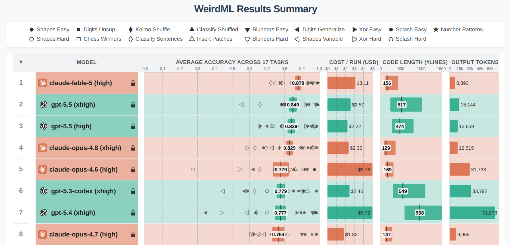

# Metrics & leaderboard

How OCF measures the skill of its forecasts and compares forecasting approaches.

> **Status legend** — ✅ Implemented · 🚧 Planned · 🔬 Research. The `Metrics` schema, the
> `metrics` Dagster asset, and the deterministic metrics (MAE, NMAE, RMSE, MBE) are ✅
> implemented. The interactive leaderboard visualisation and probabilistic metrics are 🚧 planned.
> The implemented [cross-validation protocol](../ml_experimentation/cross-validation-folds.md) has
> moved out of the roadmap. See the [roadmap index](index.md) for status conventions.
> The 🚧 items are tracked under the v0.3 epic
> [#6](https://github.com/openclimatefix/nged-substation-forecast/issues/6):
> baseline forecasters [#147](https://github.com/openclimatefix/nged-substation-forecast/issues/147) ·
> probabilistic evaluation [#225](https://github.com/openclimatefix/nged-substation-forecast/issues/225) ·
> peak-events filter [#254](https://github.com/openclimatefix/nged-substation-forecast/issues/254) ·
> tricky-days filter [#255](https://github.com/openclimatefix/nged-substation-forecast/issues/255) ·
> fold hygiene [#226](https://github.com/openclimatefix/nged-substation-forecast/issues/226).

---

## The leaderboard concept 🚧

Issue: [#4](https://github.com/openclimatefix/nged-substation-forecast/issues/4)

A key deliverable is a **leaderboard** comparing many forecasting approaches. We plan **one
leaderboard per `time_series_type`**, e.g. primary substations, GSPs, BSPs, solar PV sites, wind
farms, BESS, etc.

Each leaderboard will have tens (maybe hundreds) of rows. Each row is one **ML experiment**: a
particular model, trained with a particular set of features, processed a particular way. Entrants
must be compared apples-to-apples — same test dataset, same metrics, same assumptions.

Per-experiment configuration, trained weights, and metrics are stored in the project's **MLflow**
database. The leaderboard will be displayed as an interactive table showing multiple metrics at a
glance, inspired by the [WeirdML leaderboard](https://htihle.github.io/weirdml.html):

---

## Baseline forecasters 🚧

Issue: [#147](https://github.com/openclimatefix/nged-substation-forecast/issues/147)

No naive baseline exists anywhere in the codebase (only docstring mentions, e.g.
`contracts/power_schemas.py:242`). Until the leaderboard carries naive rows, XGBoost's NMAE
numbers aren't interpretable — and, more to the point, we can't answer the question this project
exists to answer: **do we beat what NGED does today?**

### The headline baseline — `nged_incumbent`

NGED's current approach to "forecasting" primary-substation demand uses no weather model and no
ML. For each substation they build an ensemble of analogues from its own history — the observed
power at the same time-of-day on the same weekday over the **last 6 weeks**, plus the same weekday
and time-of-day from **roughly a year ago** (the seven weeks spanning **49–55 weeks back**) — then
**plot all 13 and let an operator read a forecast off the spread by eye.** If they need a single
deterministic number they take the **95th percentile** of the analogue values ("more of a *vibe*
than anything rigorous", in their words) — a deliberately conservative operating point, because the
tool exists to keep demand under the flex/firm capacity limit. This is *the bar we have to clear to
justify the project* — "XGBoost beats persistence" is table stakes; "XGBoost beats the incumbent"
is the deliverable. It is the first baseline we implement; if we implement only one, it is this one.
(Recipe confirmed by NGED, July 2026.)

It slots into our machinery beautifully, because every one of its 13 members is just a **power
lag**:

- Weekly group (last 6 weeks, same weekday & time): `power_lag_168h, 336h, 504h, 672h, 840h, 1008h`
- Annual group (49–55 weeks ago, same weekday & time): `power_lag_8232h, 8400h, 8568h, 8736h,
  8904h, 9072h, 9240h`

So it rides the same audited, no-lookahead pipeline as `PersistenceForecaster` (below) with zero
new time-series logic. `_nullify_leaky_lags` already sheds the shortest members as lead time grows
(past 7 days the 168 h member nullifies, past 14 days the 336 h, and so on), leaving the annual
members to carry the full 14-day horizon. Because the shortest member is a week old, the incumbent
has *no* short-horizon skill from recent power — realistic, since that is exactly what NGED do
today, and a reason to keep the pure `PersistenceForecaster` as a contrast rather than to sneak a
recent-power member in.

**It is also our first _probabilistic_ baseline — and this is the faithful representation, not a
bonus.** The plotted spread *is* the incumbent's output — an operator reads it by eye. We emit the
13 analogues as 13 `ensemble_member` rows and let the [probabilistic
metrics](#phase-b--probabilistic-metrics-from-the-existing-ensemble) score them for free — scoring
the spread is the closest automatable proxy for the plot a human actually reads. Two consequences
worth stating plainly:

- **`ensemble_member` is overloaded here.** For NWP models that column indexes an NWP ensemble
  member; for `nged_incumbent` it indexes a *historical analogue*. Same column, different meaning.
  We document this on the `PowerForecast` / `AllFeatures` schema so nobody assumes
  `ensemble_member ⇒ NWP`. The incumbent *synthesises* its ensemble inside `predict()` (by
  unpivoting its analogue-lag columns into member rows) rather than consuming an NWP ensemble; it
  runs with `weather_source: "none"`.
- **The deterministic collapse is NGED's own P95, not a mean.** For the deterministic leaderboard
  metrics we need a single number, and NGED gave us theirs: the **95th percentile** of the 13
  analogue values. It is deliberately conservative (a peak-safety operating point), so scoring it
  with MAE/RMSE/MBE will show a large *positive* bias **by design** — a property of their risk
  preference, not a forecasting error, and not something to "fix". The fair, like-for-like skill
  comparison therefore lives in the probabilistic metrics (CRPS over the members); NGED weight the
  analogues equally ("no further processing at all"), so equiprobable members are faithful, not an
  approximation.

### A faithful replica and a "cheap upgrades" variant

We implement two closely-related incumbent baselines, and the *pair* carries a message that is
itself a valuable project outcome — **most of the benefit may come from a few simple upgrades to
what NGED already do, not from heavy ML**:

- `nged_incumbent` — the faithful replica above. No holiday handling; warts and all. Pure lag
  features.
- `nged_incumbent_holiday_aligned` — the same skeleton, but analogue *selection* becomes
  calendar-aware: a bank-holiday target draws from prior bank holidays / the matching day-type
  (a bank-holiday Monday behaves like a Sunday), and moveable feasts align holiday-to-holiday
  (Easter→Easter) rather than by fixed week offset. This no longer rides the pure lag machinery —
  the analogue offset is conditional on the calendar — so it needs a bespoke picker plus a GB
  bank-holiday calendar (the pure-Python `holidays` package), and ships as an immediate follow-up
  PR, not part of the first one.

### Persistence and climatology — diagnostic bookends

The incumbent is really a *hybrid* — its weekly group is persistence-like recency, its annual
group is climatology-like seasonality — so the two pure forms are still worth having: they isolate
short-horizon vs long-horizon naive skill (at 0–6 h persistence is famously hard to beat; at day
8–14 seasonal climatology often beats everything). A model could "win" the leaderboard while
adding no skill over either, and without these rows nobody would know.

Side benefit: several more `BaseForecaster` implementations pressure-test the abstraction (the
docs promise the interface is model-agnostic; today only `XGBoostForecaster` exercises it).

### Implementation details — baselines (deleted when they ship)

New workspace package `packages/baseline_forecasters/` mirroring the `xgboost_forecaster`
layout (`pyproject.toml`, `src/baseline_forecasters/`, `tests/`), hosting all the baselines
below. Add to the root `pyproject.toml` `[tool.uv.sources]` and dependencies.

**1. `NGEDIncumbentForecaster` (`nged_incumbent`) — the faithful replica, built first.** Reuses
the lag machinery exactly like persistence, but *combines* the members instead of coalescing to
one:

- `selected_features` = the 13 analogue lags `{"power_lag_168h", "power_lag_336h",
  "power_lag_504h", "power_lag_672h", "power_lag_840h", "power_lag_1008h", "power_lag_8232h",
  "power_lag_8400h", "power_lag_8568h", "power_lag_8736h", "power_lag_8904h", "power_lag_9072h",
  "power_lag_9240h"}` — 6 weekly + 7 annual, per NGED's confirmed recipe. Keep the weekly count
  and annual span config-driven so variants stay cheap to try.
- `predict()` unpivots the analogue-lag columns into `ensemble_member` rows (member index =
  analogue index) — this is where the ensemble is *synthesised*, not consumed from NWP. Members
  nulled by `_nullify_leaky_lags` (lag ≤ lead time) or by insufficient history are dropped; rows
  where *all* members are null (very long horizons + data gaps) are dropped and the count logged,
  as in persistence. The members are the faithful output (NGED plot all 13 and read the spread by
  eye); the deterministic point forecast is NGED's stated **95th-percentile** collapse over the
  surviving members — conservative by design, so expect a positive MBE (see prose above).
- **Deterministic-scoring wrinkle:** `compute_metrics` currently collapses members by *mean* for
  the deterministic metrics. Scoring the incumbent's P95 faithfully needs a per-experiment collapse
  statistic (default `mean`; `p95` for `nged_incumbent`) — a small `compute_metrics` extension, or
  have the forecaster carry a designated point-forecast column. Do not silently score its members'
  mean and call it the incumbent.
- `train()` records `trained_time_series_ids` only. `save`/`load` persist a `meta.json` with the
  config + ids (copy the `XGBoostForecaster` pattern).
- `MODEL_NAME = "nged_incumbent"`, `MODEL_VERSION = 1`; runs with `weather_source: "none"`.
- **Schema doc change (this PR):** document the `ensemble_member` overload on `PowerForecast` and
  `AllFeatures` — an NWP-member index for NWP models, a historical-analogue index for
  `nged_incumbent`. Because this baseline *owns* the member dimension, it must **not** be
  broadcast across the NWP members (contrast the deterministic baselines in item 5); this is the
  case where a per-forecaster `uses_nwp_ensemble = False` flag actually earns its keep.

**2. `NGEDIncumbentForecaster` + holiday alignment (`nged_incumbent_holiday_aligned`) — immediate
follow-up PR.** Same output shape and ensemble emission, but analogue *selection* becomes
calendar-aware and so can no longer be a fixed set of lag columns:

- A bespoke picker maps each target `valid_time` to its source timestamps: bank-holiday targets
  draw from prior bank holidays / the matching day-type (a bank-holiday Monday → Sundays), and
  moveable feasts align holiday-to-holiday (Easter→Easter) rather than by fixed week offset.
- GB bank-holiday calendar via the pure-Python `holidays` package (pandas-free).
- `MODEL_NAME = "nged_incumbent_holiday_aligned"`, `MODEL_VERSION = 1`.
- Keep this out of the first PR; it ships once baseline 1 lands. It exists to test the project
  thesis that a few cheap upgrades recover most of the benefit.

**3. `PersistenceForecaster` (seasonal-naive) — diagnostic bookend.** Reuse the existing lag
machinery instead of writing any new time-series logic:

- `selected_features` = `{"power_lag_24h", "power_lag_48h", "power_lag_168h",
  "power_lag_336h"}` (configurable in the config, this is the default).
- `predict()` = `pl.coalesce` of the lag columns in ascending-lag order. The existing
  `_nullify_leaky_lags` already nulls any lag ≤ lead time, so coalesce naturally selects the
  *shortest non-leaky* lag per row — same-time-yesterday for day-1 horizons, last-week for
  day 2–7, two-weeks-ago beyond that. Zero lookahead risk because it rides the audited pipeline.
- `train()` records `trained_time_series_ids` only (nothing to fit). `save`/`load` persist a
  `meta.json` with the config + ids (copy the pattern from `XGBoostForecaster`).
- `MODEL_NAME = "persistence"`, `MODEL_VERSION = 1`.
- Rows where all lags are null (long horizons + data gaps): drop those rows from the output
  (`PowerForecast.power_fcst` presumably non-nullable — check) and log the dropped count.

**4. `ClimatologyForecaster` — diagnostic bookend.**

- `train()`: collect `(time_series_id, valid_time, power)` from the features frame and build a
  lookup table of mean power per `(time_series_id, month, half-hour-of-day, is_weekend)` over
  the training window. Store as a small Polars frame; `save` writes it as one parquet +
  `meta.json`.
- `predict()`: join the lookup onto the prediction rows by the same keys.
- `selected_features` needs only the target join — reuse existing time features
  (`local_time_of_day_*` etc.) or derive month/half-hour directly from `valid_time` inside the
  forecaster; prefer deriving directly to keep the feature list empty.
- `MODEL_NAME = "climatology"`, `MODEL_VERSION = 1`.

**5. Configs and registration.**

- `conf/model/nged_incumbent.yaml`, `conf/model/persistence.yaml`,
  `conf/model/climatology.yaml` (and later `conf/model/nged_incumbent_holiday_aligned.yaml`)
  following `conf/model/xgboost.yaml`'s `_target_` structure, with `weather_source: "none"`.
- `PowerForecast.nwp_init_time` is already nullable for exactly this case
  (`power_schemas.py:242`); confirm `cv_power_forecasts` tolerates it end-to-end.
- **Ensemble members:** for the *deterministic* baselines (persistence, climatology) the CV
  predict path feeds all ~51 members and they produce identical forecasts per member — wasteful
  but harmless (the ensemble mean is unchanged); MVP accepts it. `nged_incumbent` is different:
  it emits its own 13-member ensemble, so broadcasting it across the 51 NWP members would be wrong,
  not merely wasteful. A per-forecaster `uses_nwp_ensemble` class flag (default `True`) that
  `cv_power_forecasts` honours — restricting deterministic baselines to member 0 and letting
  `nged_incumbent` own the member axis — resolves both at once.

**6. Run and publish.** Register each via `register_experiment_job` (`run_mode: smoke_test`
first, then `full_cv`) and materialise `trained_cv_model` → `cv_power_forecasts` → `metrics`
so each appears in MLflow as a leaderboard row.

**Recipe confirmed by NGED (July 2026).** No open questions remain; the spec above is their method
verbatim:

- **Weekly analogues:** the last **6** weeks, same weekday & time-of-day.
- **Annual analogues:** the **seven** weeks spanning **49–55 weeks back**, same weekday & time.
- **Deterministic value:** the **95th percentile** of all 13 analogue values ("more of a vibe").
- **No further processing:** no weighting, no holiday handling, no anomaly rejection, no
  load-growth scaling. (This is precisely why the holiday-aligned variant in item 2 is a genuine,
  un-done upgrade — not a reimplementation of something NGED already do.)

**Verification.** (1) Unit tests in `packages/baseline_forecasters/tests/`: `nged_incumbent`
unpivots to the expected 13 members and its **P95** collapse matches a hand-computed value;
persistence picks the shortest non-null lag; climatology lookup round-trips through `save`/`load`;
all freeze `trained_time_series_ids`. (2) Smoke-test fold end-to-end via the existing
integration-test pattern (`tests/test_trained_cv_model.py` fixtures), and confirm the incumbent's
13-member ensemble flows through the Phase B probabilistic metrics (e.g. CRPS computes over its
members). (3) Sanity-check the numbers: persistence NMAE should be *worse overall* than XGBoost but
plausibly competitive at short horizons; `nged_incumbent`'s P95 point forecast should show a clear
positive MBE (the conservative operating point) even where its CRPS over the 13 members is
competitive — do not mistake that bias for a bug.

---

## Cross-fold validation

The cross-validation protocol is **implemented**, so it has moved to its permanent home:
[ML Experimentation → Cross-validation folds](../ml_experimentation/cross-validation-folds.md).
That page covers the expanding-window protocol, the current single MVP fold (and why the available
weather data constrains us to it), the target multiple-yearly-fold protocol, and the fold-design
alternatives we considered.

### Fold hygiene: selection bias and a final-test window 🚧

Issue: [#226](https://github.com/openclimatefix/nged-substation-forecast/issues/226)

The single leaderboard fold (`mid_2025_to_mid_2026` in `conf/cv/default.yaml`: train 2024-04 →
2025-06, validate 2025-07 → 2026-06) serves as **both** the model-selection set and the
reported skill number. Every hyperparameter choice, feature ablation, and model comparison is
adjudicated on the same 12 months that the leaderboard reports. With hundreds of planned
experiments (the roadmap mentions LLM-driven auto-experimentation in v0.5), the winner's
reported skill will be optimistically biased — classic leaderboard overfitting. The epoch
mechanism handles *data* changes but not *adaptive selection* on a fixed fold.

Until the structural fix lands: leaderboard metrics are selection metrics; differences smaller
than fold-level noise should not drive decisions; and the number of experiments per epoch is
itself a relevant statistic (visible as the MLflow experiment count).

#### Implementation details — final-test window (deleted when it ships)

**1. Document the caveat (immediately).** A short "Selection bias" subsection in
`docs/ml_experimentation/cross-validation-folds.md` restating the paragraph above.

**2. Reserve a final-test window (next leaderboard epoch).** Found a new epoch in
`conf/cv/default.yaml` (the epoch mechanism exists for exactly this):

- Shrink the leaderboard fold's validation window to `2025-07-01 → 2026-03-31`.
- Add a `final_test` fold `2026-04-01 → 2026-06-30` with a new per-fold flag
  `final_test: true` (extend `CvConfig` / the fold schema in
  `packages/contracts/src/contracts/hydra_schemas.py`; it is neither a leaderboard fold nor a
  dev fold — `_fold_ids_for_run_mode` in `defs/jobs.py:96` must *not* include it in any
  run mode, so no experiment trains or scores on it in the normal flow).
- Scoring against the final-test window is a deliberate, rare act — only for champion
  candidates immediately before promotion — via the `metrics` asset with
  `evaluation_scope="ad_hoc"` and the window's `valid_time` bounds in the existing
  `PopulationFilter`. No new asset needed; the discipline is procedural. Note: the model
  trained for the leaderboard fold is reused as-is (train window unchanged), so final-test
  scoring needs a `cv_power_forecasts` run over the reserved window — check whether the
  existing asset can forecast a window disjoint from the fold's `val_start/val_end`, and add a
  window override to its config if not.
- Rule, documented alongside: final-test results are never used to *choose between*
  candidates (that re-creates the problem); they exist to report honest skill for the chosen
  champion and to detect gross overfitting (final-test NMAE ≫ validation NMAE).

**3. Trade-off (decide at implementation time).** This costs 3 of the 12 validation months, on
a dataset that is already short. The alternative — accepting documented bias until
Dynamical.org backfills enable multiple yearly folds — is defensible; if the backfill is
expected within a couple of months, do part 1 now and fold part 2 into the multi-fold epoch
instead of spending a separate epoch on it. Decide based on the backfill outlook.

**Verification.** (1) `register_experiment_job` in all three run modes never creates a
partition for the `final_test` fold (extend `tests/test_register_experiment_job.py`).
(2) Eligibility for the leaderboard fold is unchanged by the shrunk validation window (the
eligibility rule keys off `val_start`/`val_end` — re-materialise `eligible_time_series` and
diff). (3) End-to-end: score one existing experiment against the reserved window via the
`ad_hoc` metrics path and confirm rows land in `forecast_metrics.delta` with the window label,
and nothing is logged to the leaderboard MLflow runs.

---

## Evaluation metrics

| Metric | Type | Status | Purpose |
|---|---|---|---|
| Mean absolute error (MAE) | Deterministic | ✅ | Typical error magnitude (MW). |
| Normalised MAE (NMAE) | Deterministic | ✅ | MAE normalised by the series' [effective capacity](#normalising-nmae-by-effective_capacity) (full-history P99) — comparable across substations of different sizes. |
| Root mean squared error (RMSE) | Deterministic | ✅ | Heavily penalises large misses (one 100 MW error costs more than two 50 MW errors). |
| Mean bias error (MBE) | Deterministic | ✅ | Systematic over/under-prediction. |
| Histogram of errors | Deterministic | 🚧 | Visual check that errors are ~Normal. |
| Pinball loss (quantile loss) | Quantile | 🚧 | Penalises asymmetrically by target quantile. Averaged across quantiles for a single quantile-skill score. |
| PICP (Prediction Interval Coverage Probability) | Quantile | 🚧 | Of a P10–P90 band, exactly 80% of observations should fall inside. < 80% ⇒ overconfident. |
| CRPS (Continuous Ranked Probability Score) | Ensemble | 🚧 | Probabilistic equivalent of MAE; rewards both accuracy and sharpness. |
| Spread-Skill Ratio | Ensemble | 🚧 | Ensemble spread ÷ RMSE of the ensemble mean. 1.0 = well-calibrated; < 1 under-dispersed (overconfident); > 1 over-dispersed (underconfident). |

> The `Metrics` schema (`contracts.ml_schemas.Metrics`) stores results as
> `(time_series_id, power_fcst_model_name, fold_id, horizon_slice, metric_name, metric_param,
> metric_value)`. `metric_param` carries, e.g., the quantile for Pinball Loss (`p10`) or the band
> for PICP (`p10_p90`). The `metrics` Dagster asset computes the deterministic metrics ✅ and writes
> per-series rows to `forecast_metrics` Delta (partitioned by `experiment_name, fold_id`), with
> per-fold and mean-across-folds aggregates logged to MLflow — see
> [Running an ML experiment end-to-end](../ml_experimentation/dagster-workflow.md#step-8-materialise-metrics).

### Normalising NMAE by `effective_capacity`

NMAE is MAE divided by a per-series **effective capacity**, not by the mean or a per-fold P99. A
capacity-like denominator is what makes NMAE comparable across asset types: intermittent generators
(PV, wind) spend much of their time near zero output, so normalising by the *mean* would inflate
their NMAE relative to a demand substation of similar peak size. Computing the denominator over each
series' **full history** (rather than within the validation window) also keeps it stable across
folds — an unusually calm year for a wind farm would otherwise give a low in-window P99 and an
inflated NMAE.

Normalisation is also why NMAE is the **headline cross-series metric**: the aggregate `mae__all` /
`rmse__all` values logged to MLflow are unweighted means across series whose scales span roughly
two orders of magnitude, so the GSPs dominate them. They are useful for tracking a single model
over time, not for comparing skill across the population.

The denominator comes from the [`effective_capacity`](delivery-tables.md#table-4-effective_capacity)
Delta table (schema `contracts.power_schemas.EffectiveCapacity`), consumed by `compute_metrics`
(`ml_core.metrics`).

**MVP representation (v0.1): one scalar row per series.** The `effective_capacity` asset writes one
row per `time_series_id` — `effective_capacity_mw` = P99 of `|power|` over the whole observation
history, `time` = the latest observed timestep. `compute_metrics` joins it onto the per-series
metrics **on `time_series_id` alone** and divides.

**Why the MVP is a single row per series, not the value repeated at every half-hour.** The
v0.7 upgrade below *will* store one row per `(time_series_id, time)` half-hour — but with a
genuinely *time-varying* value. In the MVP the value is a single constant per series, so repeating it
across every half-hour would just be a denormalised encoding of one number: at V2 scale (~2,500
series × ~4 years × 17,520 half-hours/yr ≈ 175M rows) that is hundreds of millions of rows to
express ~2,500 scalars, for zero extra information. It would also *not* buy forward-compatibility,
because the real MVP→DP interface change is not the data shape but **the join** (below). The
`EffectiveCapacity` schema — `(time_series_id, time, effective_capacity_mw)` — already accommodates
both the one-row-per-series MVP and the one-row-per-half-hour DP shape; that is the
forward-compatibility we want. (The DP upgrade does widen the *columns* — the value becomes a
mean + std pair,
[#247](https://github.com/openclimatefix/nged-substation-forecast/issues/247) — but the row shape
and the join are unaffected by that.)

**DP upgrade (v0.7): time-varying, and the join changes.** The
[differentiable-physics](capacity-estimation.md) capacity model produces a value that changes over
time (panel degradation, inverter trips, seasonal derating). At that point two things change, and
nothing else:

- the `effective_capacity` asset body emits one row per `(time_series_id, time)`; and
- `compute_metrics` changes its capacity join from `time_series_id`-only to a **temporal as-of join**
  on `(time_series_id, valid_time)` — matching each forecast's `valid_time` to the capacity in effect
  at that time.

The `Metrics` schema and the rest of the metrics pipeline are untouched. Note the table is
**backward-looking only** (it holds no future `valid_time`s): fine for historical CV folds (whose
validation windows lie inside the observed history), but live-forecast scoring
([production monitoring](live-service.md#production-monitoring)) must
choose which reference time's capacity to apply rather than expecting a row at a future `valid_time`.

One related distinction to keep straight: the *metric denominator* may use the full-history
**smoothed** DP capacity estimate, but any capacity used to normalise model inputs at forecast init
time (the two-pass training scheme) must be the **causal** estimate available at that init time, or
backtests gain lookahead — see
[Capacity estimation, Phase 1](capacity-estimation.md#phase-1-dynamic-capacity-estimation-for-metered-generators-v1).

### Peak events — the metric filter that matters most for flexibility

Issue: [#254](https://github.com/openclimatefix/nged-substation-forecast/issues/254)

Because NGED's goal is **flexibility procurement** (entirely about peak management and congestion),
overall RMSE only tells half the story. We add a **"Peak Events"** filter:

- **Peak RMSE / Peak Pinball Loss**: score models *only* on the top 5% highest-demand half-hours
  (or hours where solar generation unexpectedly drops during peak demand).
- **Hand-picked "hard examples"**: if NGED supplies a list of historically tricky times, we compute
  performance on those alone.

### Tricky days — a calendar-deterministic metric filter 🚧

Issue: [#255](https://github.com/openclimatefix/nged-substation-forecast/issues/255)

Alongside Peak Events, we add a **"Tricky days"** filter: score models separately on the handful of
calendar dates whose demand shape departs sharply from the usual weekly rhythm. We scope it
deliberately to the **calendar-deterministic** set — fixed and moveable public holidays (Christmas,
Easter, and the rest of the GB bank holidays) plus the two annual daylight-saving transitions —
because these are exactly the days our weekday/seasonal analogues are *built* to mishandle. Days
that are hard for *data-dependent* reasons stay in their own already-planned filters:
[switching-event days](#measuring-performance-during-switching-events) and NGED's hand-picked
"hard examples" (above). One shared filter *mechanism*, several named filters — folding genuinely
different failure modes into one bucket would make the number impossible to act on ("bad on tricky
days" — is that Christmas, or a switching event?).

Mechanically it is another population filter (the same mechanism the planned Peak Events filter
uses): a boolean flag per timestep, derived from `valid_time` alone. Because it is purely
calendar-driven it **shares its calendar module with `nged_incumbent_holiday_aligned`** — the same
GB bank-holiday calendar (the pure-Python `holidays` package) plus the two DST dates feed both the
holiday-aligned baseline and this metric filter. And the two reinforce each other: `nged_incumbent`
(no holiday logic) should be *visibly* worst on tricky days, and `nged_incumbent_holiday_aligned`
should recover most of the gap — turning "we added holiday alignment" into a *measurable* number,
exactly the cheap-upgrades story we want to show NGED.

**Flag the day _and_ its analogue-relevant neighbours, not just the day itself.** The disruption
spills onto surrounding timesteps:

- **DST transitions**: the hard part is not only the 23/25-hour day but that lag and analogue
  features are misaligned by an hour on the days either side.
- **The Christmas run-up**: demand in the days *before* Christmas is already atypical, so the window
  must cover the run-up, not just the 25th.

So the flag covers a small **window** around each date rather than a single day; the exact per-event
widths are an implementation-time choice.

**A subtlety to document now but _not_ model yet.** The shape of the Christmas run-up depends not
just on the number of days before Christmas but also on **which weekday Christmas falls on** — the
run-up demand pattern shifts year to year with that day-of-week alignment. We record it here as a
known effect; the MVP tricky-days *flag* ignores it (it simply marks the window), and we defer any
explicit day-of-week-aware modelling of the run-up until there is evidence it moves the leaderboard.

#### Implementation details — tricky days (deleted when this ships)

- A small calendar module (shared with baseline 2, `nged_incumbent_holiday_aligned`) answers, for
  any `valid_time`, whether it falls inside a tricky-days window. Back it with the `holidays` GB
  calendar plus the two annual DST dates; expose the per-event window widths as config.
- Represent the tricky-days slice the same way the Peak Events filter is represented — one more
  named population filter, resolved by the same mechanism, **not** a new schema axis — so the
  leaderboard gains a **Tricky days** column with no `Metrics` schema change.
- Verification: unit-test the flag on known dates (a Christmas week, an Easter, both DST
  switchovers, and a plain week that must be *excluded*); on a smoke-test fold, confirm
  `nged_incumbent` scores worse on the tricky-days slice than overall.

---

## Time-slices for performance evaluation

We compute every metric separately per horizon slice, because the driver of model skill changes
with lead time:

| Horizon slice | Industry term | Primary driver of model skill |
|---|---|---|
| 0–6 hours | Intraday / Nowcasting | Lagged power & persistence. NWP is often too coarse to beat simple autoregressive features here. |
| 6–36 hours | Day-Ahead | Deterministic NWP. Covers the critical day-ahead market gate; relies on the diurnal cycle + high-res weather. |
| Day 2–7 | Short/Medium Range | Synoptic weather. Skill driven by mapping large weather fronts to power; ensemble spread starts to matter. |
| Day 8–14 | Extended Range | Ensemble probabilities. Deterministic weather is essentially noise; skill comes from processing ensemble uncertainty. |

### Measuring performance during switching events 🚧

We will flag each timestep for whether it contains a switching event, and compute metrics separately
for periods with switching events in the model inputs (or in the forecast's `valid_time`). This
distinguishes models that perform well *only* on clean periods from models that handle switching
events in their inputs. The flags come from the detector described in
[Switching events & latent demand](switching-events.md).

---

## Delivering the probabilistic metrics 🚧

Issue: [#225](https://github.com/openclimatefix/nged-substation-forecast/issues/225)

The 51-member ensemble is very likely **underdispersed**: XGBoost trained with squared error on
the control member (`cv_assets.py:373`) learns a conditional mean, so pushing 51 members through
it yields spread from *weather uncertainty only* — no model or observation uncertainty. Such
ensembles are systematically overconfident, worst at short horizons where members haven't
diverged. Flexibility procurement is a tails problem (P90+ peaks), so this hits the use case
directly — yet nothing measures calibration today: `compute_metrics` averages members into a
deterministic mean (`packages/ml_core/src/ml_core/metrics.py:84-90`) and scores only MAE/NMAE/
RMSE/MBE on the `"all"` horizon slice (`metrics.py:51`). We pay 51× inference cost and score
only the mean.

Fix in three phases, each an independent PR. Phases A and B are pure evaluation (no model
changes) and should land before any further MAE-driven experimentation.

### Phase A — horizon-sliced metrics

`HORIZON_SLICES` already exists in `contracts/ml_schemas.py:172` and the
[time-slices table above](#time-slices-for-performance-evaluation) argues skill drivers differ
radically by horizon; only `"all"` is computed.

- In `compute_metrics` (`metrics.py`), derive `lead_time = valid_time − power_fcst_init_time`
  per row (confirm `power_fcst_init_time` survives into the forecast/actuals join; it is a
  `PowerForecast` primary-key column) and map it onto the `HORIZON_SLICES` bands with
  `pl.when/then` chains or `cut`.
- Compute the existing four metrics per `(series, fold, model, horizon_slice)` via one
  `group_by` including the slice column, plus the existing `"all"` aggregate.
- `build_mlflow_aggregate_metrics` gains keys like `nmae__all__day_ahead`. Keep the existing
  key format for `"all"` slices unchanged so historical MLflow runs stay comparable.
- Schema needs no change (the `Metrics` tall format was designed for this).

### Phase B — probabilistic metrics from the existing ensemble

Compute member-aware metrics *before* the ensemble-mean collapse in `compute_metrics`:

- **Spread-skill ratio**: mean ensemble stddev ÷ RMSE of the ensemble mean, per group. Ratio
  ≪ 1 confirms underdispersion — this is the headline diagnostic for the finding above.
- **PICP**: empirical member quantiles per `(series, valid_time)` (`pl.quantile` over members),
  then coverage of the P10–P90 interval. `metric_param` (currently only `"all"`,
  `ml_schemas.py:203`) carries the interval label, e.g. `"p10_p90"`.
- **Pinball loss** at P10/P50/P90 from the same empirical quantiles; `metric_param` = quantile
  label. (Schema docstrings already anticipate pinball/PICP.)
- **CRPS** (fair/ensemble form): per timestamp, `mean|xᵢ − y| − ½·mean|xᵢ − xⱼ|`. The pairwise
  term over 51 members is computable with a self-join on member index within
  `(series, valid_time)` groups; ~51² × rows is fine at V1 scale. If it's slow, the
  sorted-member O(m log m) form is a known optimisation — don't start there.
- Extend `METRIC_NAMES` (`ml_schemas.py:188`) and `METRIC_PARAMS` accordingly. Both are
  `pl.Enum` columns written to Delta as String (documented gotcha) — additive enum growth is
  safe for existing data.
- Flip the statuses in the [metrics table above](#evaluation-metrics) from 🚧 to ✅ as they
  land.

### Phase C — cheap calibration (after B proves the diagnosis)

Decide based on Phase B's spread-skill numbers; recommended order:

1. **Post-hoc spread inflation** (EMOS-lite): per horizon slice, fit a scalar `s` on the
   *training* window so that inflating members around the ensemble mean
   (`mean + s·(member − mean)`) makes spread match error. Zero schema change, zero new model —
   implementable as an optional step in `predict` or as a wrapper forecaster. Fit on train,
   apply on validation (no tuning on the fold being scored).
2. **XGBoost native multi-quantile** (`objective: reg:quantileerror`, several
   `quantile_alpha`s) as a separate experiment/model family. This gives directly calibrated
   quantiles but requires a percentile representation in `PowerForecast` (the
   [delivery tables](delivery-tables.md) already plan percentiles) — a bigger schema/design
   step, so keep it as its own follow-up plan when Phase B/C1 results justify it.

### Implementation details — probabilistic metrics (deleted when they ship)

Verification: (1) unit tests in `packages/ml_core/tests/` with hand-computable fixtures — a
3-member toy ensemble where PICP, spread-skill, pinball, and CRPS are worked out by hand.
(2) Property check: CRPS of a single-member "ensemble" equals MAE. (3) Re-score an existing
experiment via the `metrics` asset (`ad_hoc` scope) and eyeball that spread-skill ≪ 1 at short
horizons — the expected signature of the finding.

---

## Grouping the results

Each ML experiment is tagged with metadata so we can group experiments and compute average
performance per group (e.g. "does lagged power *always* help, regardless of model sophistication?",
or "how robust is each model to weather-forecast uncertainty — CERRA reanalysis vs. operational
NWP?"). Example tags:

| Tag | Example values |
|---|---|
| `time_series_type` | PV, Wind, disaggregated demand (primaries) |
| `model_family` | nged_incumbent, baseline_persistence, xgboost, pytorch_mlp, pytorch_gnn |
| `weather_source` | none, ecmwf_control, full_ecmwf_ensemble, cerra |
| `input_features` | datetime, power_lag_24h, power_lag_7d, temperature |
| `training_strategy` | direct_multistep, horizon_as_feature, end_to_end |
| `generator_capacity_estimation` | none, simple_p99, differentiable_physics |
| `switching_event_detection` | none, simple_statistical |
| `pre_training` | none, CERRA |

> Estimating **cost savings (£)** attributable to each forecasting approach, per leaderboard row, is
> a 🔬 v2 stretch goal.
