# Separating solar from a battery works on simple synthetic aggregates, overshoots once demand is added, and is not validated on real aggregate Balancing Mechanism Units

**This study asks whether public prices, and then an explicit model of the battery's state of
charge, can fix the failure the [solar disaggregation study](solar-bmu-disaggregation.md) found.**
That study separated the solar part of an aggregate beside wind or gas, and found that none of the
methods it tried separated the solar part beside a battery or pumped storage. Here each step adds
one complication, and the page shows the simple step working before the harder one. The steps are
called rungs. A Balancing Mechanism Unit (BMU) is the unit that Elexon, the settlement body, meters
in the Balancing Mechanism, the market in which the system operator buys changes to generation and
demand close to delivery. A BMU can be a power station, a battery, or an aggregate of embedded
generation held by a supplier. Two background pages explain [how batteries in Great Britain (GB)
schedule themselves](../background/gb-battery-scheduling.md) and [GB electricity prices](../background/gb-price-data-and-ancillary-markets.md).

**A joint model of solar and a battery recovers the solar part of a simple synthetic aggregate
when it is given the battery's true power. Once a demand-like part is added, the joint model
overshoots the solar capacity and falsely detects solar, and for the 25 real aggregate BMUs it
gives no validated solar capacity.** A synthetic aggregate is a real solar BMU's output plus a
real battery BMU's output, each rescaled. The joint model fits solar and a battery together, as a
linear programme: an optimisation that chooses the solar weights and the battery's charge and
discharge schedule that leave the least unexplained output. The tests below measure the solar error,
which is the mean absolute error of the recovered solar over daylight half-hours, as a percentage
of the true solar part's 99th-percentile output (written "p99").

- **With no demand-like part (rung 6), the joint model nearly halves the solar error.** A solar-only
  fit has a solar error of 27.2%, the joint model 14.8%, and the same solar model given the true
  battery's output 14.0%. Of the 12.4-point gain of the joint model over the solar-only fit, 9.9
  points come from a new solar model that uses four fleet curves (typical output shapes of
  east-facing, south-facing, west-facing, and sun-tracking solar arrays), and 2.5 points come from
  the battery model. Given half or double the true battery power, the joint model's solar error is
  15.7% and 16.2%: worse than at the true power, and still better than the 17.3% of the same solar
  model with no battery ([rung 6, half or double the true battery
  power](#rung-6-half-or-double-the-true-battery-power)).
- **With a demand-like part (rung 7c), the model's gain shrinks and it overshoots the capacity.**
  Giving the joint model the battery's true power lowers the solar error by 0 to 1.4 points against
  no battery. The same step raises the fitted capacity from 0.86 to 1.02 times the capacity of the
  same model fitted to the solar part alone, to 1.17 to 1.50 times, and up to 1.98 times at an
  assumed 200 MW. In 35 of 48 synthetic aggregates with no solar, the model fits more than 1 MW of
  solar at the true power. These false alarms rest on the assumption that the demand-like parts hold
  no solar ([known-answer test](#rung-7c-known-answer-test)).
- **For the 25 real aggregate BMUs, this study establishes no solar capacity.** With a
  calendar baseline (a seasonal and time-of-day baseline, as in the solar study) and a battery with
  a state-of-charge limit, the joint model fits 1,154 to 1,217 MW of alternating-current (AC) solar
  capacity at assumed battery powers from 0 to 200 MW ([rung
  7b](#rung-7b-the-same-fit-with-the-solar-studys-calendar-baseline)). That narrow range is not
  evidence of correctness, for the three reasons below.

**Three tests in rungs 7b and 7c show why the narrow range is not evidence of correctness.**

- **The linear programme causes part of the stability.** The programme charges a throughput cost
  of 0.1 per megawatt of battery charge or discharge, against 1 per megawatt of unexplained output.
  At 200 MW the median BMU's fit is exact in every half-hour, and the total moves between 1,150 and
  1,165 MW as the throughput cost changes from 0.08 to 0.3 per megawatt. At the highest throughput
  cost the battery is unused, and the answer reverts to the no-battery 1,160 MW
  ([cost sensitivity](#rung-7c-cost-sensitivity)).
- **Part of the fitted capacity could be shape rather than cloud.** A calendar replica is a BMU's
  mean output for each month, half-hour of the day, and day type, which has the mean solar shape and
  no cloud. Replicas fit 216 MW of solar with no battery and 426 MW at 200 MW, which is 19% and 37%
  of the real-output totals (1,160 and 1,154 MW). Up to a third of the fitted capacity could
  therefore come from shape ([rung
  7b](#rung-7b-the-same-fit-with-the-solar-studys-calendar-baseline)).
- **The synthetic aggregates do not behave like the real BMUs.** On the synthetic aggregates the
  fitted capacity rises steeply with the assumed battery power, from 0.96 to 1.98 times the
  reference for one demand-like part and solar size. On the real BMUs the total is flat, from 1,154
  to 1,217 MW. The synthetic aggregates' bias at the true power therefore cannot be carried over to
  the real BMUs, whose true battery power is unknown, and this study cannot say how biased the real
  total is.

**Neither this fit nor the solar study's gives a validated total, and their agreement at about 1,160
MW is not a confirmation.** The two capacity measures differ: on the synthetic aggregates of rung 6
the fleet-curve fit given the true battery fits 1.13 times the direct physical fit to the solar
part. The solar study's own methods are not validated beside a battery either. On the rung 7c
synthetic aggregates its difference separation (a fit of the fleet curves to four-hour changes, then
the baseline) fits 1.34 to 1.60 times the reference capacity, and the solar study found that its
physical fit recovers 0.24 to 0.44 of the reference beside storage, against 0.93 beside wind or gas.
What would establish the capacity is set out in the [Discussion](#discussion).


- **To separate solar from a battery whose true power is known, model the battery explicitly with a
  state-of-charge limit.** Within the fleet-curve solar model, the battery model closes 2.5 of the
  3.3 points between a fit with no battery (17.3%) and a fit given the true battery (14.0%)
  ([rung 6](#rung-6-solar-and-a-battery-fitted-together)). Unconstrained price regressors (price
  columns that each get a free coefficient) cut the solar error by 8.5 points, but a wrong-week
  control gains 4.9 of those points. Under rung 4's variance rule, they falsely detect solar in 6
  of 16 battery-only aggregates
  ([rung 4](#rung-4-price-regressors-on-synthetic-solar-plus-battery-aggregates)). Within the
  same fleet-curve solar model, the battery constraint recovers solar 1.5 points [1.1, 1.9] better
  than the two price columns do (post hoc, [rung 6](#rung-6-solar-and-a-battery-fitted-together)).
  The joint model with rung 3's drift-inflated energy capacity falsely detects no solar in 16
  battery-only aggregates, but with half that capacity or with 2 hours of energy it detects solar
  in 8 and 4 of the 16 at a 1 MW threshold
  ([rung 6](#rung-6-solar-and-a-battery-fitted-together)).
- **Do not trust a structured schedule built from prices to beat unconstrained price regressors.** A
  rank rule (charge in the cheapest [price ranks](../background/gb-battery-scheduling.md#price-rank)
  of each day and discharge in the dearest) and a linear programme each recover the solar about 7
  points worse than unconstrained price regressors
  ([rung 5](#rung-5-structured-schedules-do-not-beat-unconstrained-price-regressors)).
- **Do not quote a solar capacity for an aggregate BMU without saying which model, which capacity
  measure, and which battery size were assumed.** Without a calendar baseline, the fitted capacity
  of the nine cloud-signal BMUs (the nine aggregate BMUs whose fit in the solar study shows a
  cloud-correlated component) falls from 262.4 MW with no battery to 98.6 MW with a 200 MW battery
  ([rung 7](#rung-7-the-real-aggregate-bmus)). With the baseline they are 1,146 MW with no battery
  and 1,129 MW with a 200 MW battery
  ([rung 7b](#rung-7b-the-same-fit-with-the-solar-studys-calendar-baseline)).

> **How this page was made.** The research question came from a human. Everything else — the code
> behind every result, the analysis, the figures, and the text — was written by Claude, Anthropic's
> AI model (for this page, Claude Sonnet 5.5).

## Terms used on this page

- **Rung:** one step of the study, each adding one complication. **Arm:** one variant of the fit,
  labelled A0 to A9 and B1 to B8 for contrasts between arms. A0 is a solar-only fit, A1 adds
  price regressors, A3 is handed the true battery's output (an oracle), and A0b, A1b, and A3b are
  the same three fits with the joint model's solar model. A8 is the joint model given the true
  battery's power and rung 3's energy capacity. A8h and A8d use half and double that energy
  capacity, and A9 uses 2 hours of energy.
- **Joint model and linear programme:** the joint model fits solar and a battery together by linear
  programming, which finds the solar weights and the battery schedule that leave the least
  unexplained output (the residual).
- **Synthetic aggregate:** a real solar BMU's output plus a real battery BMU's output, each scaled
  to a stated p99, as in the solar study. **Demand-like half:** a third part added in rung 7c, the
  output of a real aggregate BMU in which the solar study found no cloud signal. **Solar half:**
  the solar part of a synthetic aggregate.
- **Calendar baseline and calendar replica:** the baseline is the solar study's seasonal and
  time-of-day design, fitted beside solar. A replica is a BMU's mean output for each month,
  half-hour, and day type.
- **Variance rule and capacity rule:** the two ways to count a false alarm on a battery-only
  aggregate. The variance rule is rung 4's, and the capacity rule is rung 6's.
- **Regional sky and GB-mean sky:** the two forms of the CAMS irradiance input, defined in rung 4.

## Historical separation versus forecasting a battery

**A historical separation may use any quantity that is known after the event, and a forecast may use
only what is known at its issue time.** The table says which input is known when. This study uses
after-the-event inputs throughout, so its results bound what a forecast could achieve and do not
show that a forecast achieves it.

| Input | Known after the event | Known the day before | Known an hour before |
|---|---|---|---|
| Metered output of the battery (the target) | Yes, about 5 working days later | No | No |
| Metered output of an aggregate BMU (the target of rung 7) | Yes, about 5 working days later | No | Past values only |
| Copernicus Atmosphere Monitoring Service (CAMS) satellite irradiance | Yes | No | No |
| Day-ahead price | Yes | Yes, after about 10:00 on the day before | Yes |
| Intraday market index | Yes | No | Partly (only trades so far) |
| System price and net imbalance volume | Yes | No | No |
| Accepted balancing volumes | Yes | No | Partly (acceptances already issued) |
| The battery's planned output | Yes | Partly (planned outputs are submitted the day before; source not checked) | Yes (fixed at the deadline an hour before) |
| Grid frequency | Yes | No | Past values only |
| Response and reserve auction results | Yes | Yes, after the 14:00 auction | Yes |
| Demand and wind forecasts | Yes | Yes | Yes |
| Energy capacity and efficiency | Never observed | Never observed | Never observed |

**A forecast would have to predict the unknown inputs first.** The unknown inputs are the day-ahead
price before the auction, the system price, the frequency, the accepted balancing volumes, and the
battery's planned output. A forecast would also replace CAMS satellite irradiance with a numerical
weather prediction.

## Experiments, simplest first

**Each rung adds one complication and scores itself against a known answer where one exists.** The
page labels every contrast planned, post hoc, or exploratory, and uses these conventions:

- **A planned contrast** was written into the study plan before any result existed. The plan holds
  only B1 to B4.
- **A post hoc contrast** was written after results were seen. B5 to B8 were written before the
  rung that tests each of them ran, but after rung 4's results and outside the plan, so they are
  treated as post hoc. So are the capacity rule that rung 6 uses to pass B4, and the contrasts that
  involve A1b, an arm added at a reviewer's request to test a stated claim.
- **An exploratory contrast** was computed without a stated hypothesis.
- **Errors** are percentages of a series' own p99. The solar error is the mean absolute error of the
  recovered solar over daylight half-hours, as a percentage of the true solar part's p99.
- **Numbers in square brackets** are 95% intervals from resampling whole calendar months, or whole
  aggregates where the text says so.
- **Public BMU names and megawatts** are shown.

### Rung 1: one real battery

The four batteries in this study are Lakeside, Dollymans, Thurrock, and Ocker Hill, all public
BMUs.

**Lakeside charged when the day-ahead price was low and exported when it was high.** Over the year,
its mean output was −15.6 MW in the cheapest third of each day's half-hours, −3.5 MW in the middle
third, and 14.9 MW in the dearest third. In the cheapest third it charged in 56% of half-hours and
discharged in 15%. In the dearest third the shares were 25% and 47%.

**Output correlates most with the price at a shift of 0 half-hours, and the neighbouring shifts are
nearly as high.** The correlation of Lakeside's output with the day-ahead price is 0.236 at a shift
of 0 half-hours. The correlation peaks at a shift of 0 for all four batteries, at 0.21 to 0.27, and
a shift of one half-hour lowers it by 0.004 to 0.014.

**The planned output and the accepted balancing volumes explain most of a battery's output.** [How
GB batteries schedule themselves](../background/gb-battery-scheduling.md) shows the decomposition of
metered output into planned output, accepted balancing volume, and a remainder (Figure P2 there).
Over the year, the planned output alone explains 29.2% to 36.3% of the variance of output across the
four batteries. The planned output plus the accepted volumes explains 81.4% to 97.2%. The remainder
has a standard deviation of 3.91 to 10.33 MW.

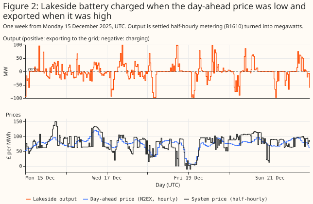

### Rung 2: price alone predicts a little of a battery's output

**Knowing the day's price ranking lowers a battery's prediction error, but only slightly.** The
prediction fits the mean output of each half-hour of the day, then adds the day-ahead price rank and
price level. A half-hour's [price rank](../background/gb-battery-scheduling.md#price-rank) is its
place in that day's cheapest-to-dearest order. Four held-out 3-month blocks score each fit. Pooled
over the four batteries, the price rank lowers the error from 21.30% to 20.72% of p99, a change of
−0.58 points [−0.89, −0.29]. The price-rank gain is planned contrast B1, which claimed that adding
the price rank and level to the time of day lowers the held-out error. B1 is met pooled, and met
for three of the four batteries; Dollymans' interval, −0.28 [−0.72, 0.23], includes zero. A
gradient-boosted tree does no better than the price rank (exploratory, 0.08 points [−0.35, 0.63]
worse than the rank).

**The plan's contrast B2 was not run.** B2 claimed that a state-of-charge fit beats a price-only fit
one step ahead. No state-of-charge predictor of output was built, so B2 has no result.

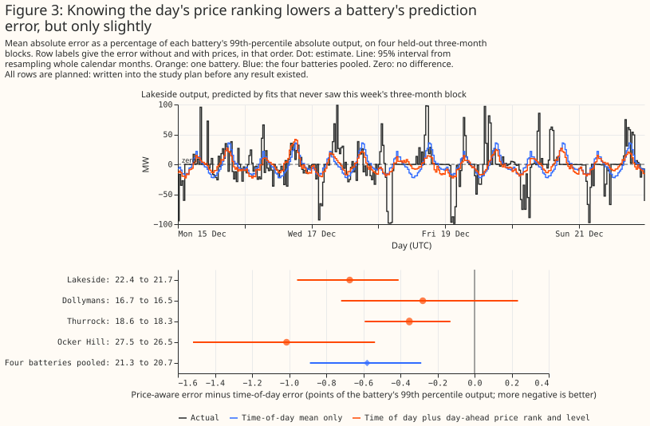

### Rung 3: integrating output gives a state of charge

**Adding up a battery's output gives a state of charge that rises and falls with it, and slow drift
inflates the energy capacity that the year-long fit needs.** Each half-hour that exports x MWh
removes x divided by the efficiency from the cells, and each half-hour that imports y MWh adds y
times the efficiency. The fit searches the one-way efficiency from 0.80 to 0.98 and takes the
smallest energy capacity that keeps the path between empty and full. For Lakeside the fit gives an
efficiency of 0.935 (round trip 0.874) and a capacity of 514 MWh, which is 5.23 hours at p99 power.
The capacity is not identified, because many pairs of efficiency and capacity keep the path inside
its bounds: with the efficiency fixed at 0.92 the same method gives 3,136 MWh, and at 0.85 it gives
17,136 MWh.

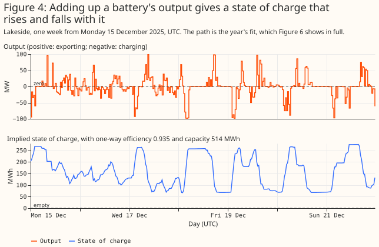

**The four batteries fit one-way efficiencies of 0.922 to 0.935 and whole-year capacities of 5.0 to
9.0 hours at p99 power, and drift inflates those capacities.** Each 3-month block fitted alone gives
2.7 to 5.1 hours, and the largest range of the path within any single week (post hoc) is 2.5 to 4.0
hours. For Lakeside, the blocks give 261 to 287 MWh against 514 MWh for the year. The path sits
within 2% of a bound in 0.2% to 0.5% of the year. Drift here means that small errors accumulate
over a year into a path that wanders, so the fit needs a larger capacity to keep the path inside
its bounds. This study cannot say whether the cause is a varying efficiency or energy that the
metering does not capture.

**No check of the state of charge here is independent of the fit.** No state of charge is
published. A path that stays inside its bounds is true by construction of the fit. The fitted
efficiency also agrees with the square root of energy exported over energy imported (0.921 to
0.935) by construction.

### Rung 4: price regressors on synthetic solar-plus-battery aggregates

**A solar-only fit to a solar-plus-battery sum recovers only a small part of the solar.** Each
synthetic aggregate (built [as in the solar
study](solar-bmu-disaggregation.md#building-a-synthetic-aggregate)) is a real solar half plus a
real battery half. The solar halves are Burwell, Bishampton, Litchardon, and the three together.
The battery halves are the four batteries above. Each half is scaled to its own p99, the solar half
to the solar share times 100 MW and the battery half to one minus the share times 100 MW. The
aggregate's own p99 is therefore not exactly 100 MW. The solar share is 0%, 10%, 25%, or 50%. Every
arm (one variant of the fit) fits the solar study's physical plant (tilt, azimuth, ratio of
direct-current (DC) to alternating-current (AC) rating, and AC capacity) to 4-hour changes. A 4-hour
change is a half-hour's output minus the output 4 hours earlier. Differencing removes the slowly
varying part of demand and keeps the changes that follow the sun and cloud. The arms differ only in
their extra regressors. Figure 5 shows a week with a 25% solar share.

**Every arm uses CAMS irradiance in one of two forms, the regional sky or the GB-mean sky.** The
regional sky is the irradiance at the solar half's own location, which real aggregates cannot use.
The GB-mean sky is the mean of 18 CAMS points across Great Britain. The text gives regional-sky
results unless it says otherwise.

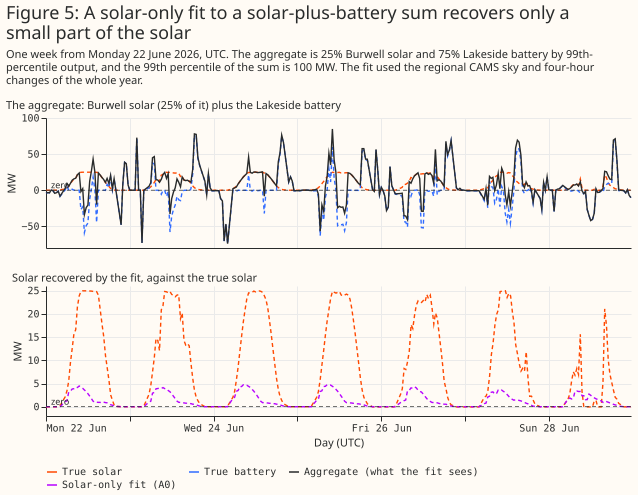

| Arm | Extra regressors |
|---|---|
| A0 | None (solar only) |
| A1 | Day-ahead price minus the day's mean; within-day rank of the day-ahead price |
| A2 | The two of A1, plus system price minus day-ahead price |
| A3 | The true battery output (an oracle, the upper bound) |
| A4 | The two of A1, taken from 7 days earlier (a wrong-week control) |

**Price regressors recover more of the solar, but the fitted battery follows the real battery only
loosely.** The two fits with prices cannot reproduce the battery's sharp swings, and the oracle in
Figure 7 shows how much better the solar looks when the true battery is known.


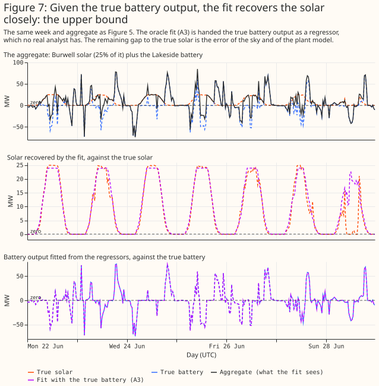

**Price regressors cut the solar error by 8.5 points, and prices from another week cut it by 4.9.**
Pooled over the 16 aggregates of each share, the solar series error is 27.2% for A0, 18.7% for A1,
18.1% for A2, 13.8% for the oracle A3, and 22.4% for the control A4. The planned contrast B3 claimed
that A1 recovers solar better than A0. A1 minus A0 is −8.5 points [−10.9, −5.9]: met. The control A4
minus A0 is −4.9 [−6.3, −3.4] (exploratory). More than half of A1's gain therefore comes from
regressors that carry no information about the right week. Intervals resample whole aggregates, and
the four solar halves make them wide. For Ocker Hill alone, the control gains at least as much as
the prices do (A1 minus A4 is +1.0 points [0.0, 2.0]).


**The recovered solar energy rises from about a quarter to about three quarters of the truth.**
The energy ratio (recovered energy over true energy) is 0.24 for A0, 0.76 for A1, 0.94 for A3, and
0.50 for A4.

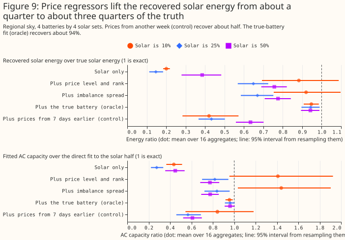

**The price regressors raise false alarms under the variance rule, and the planned false-alarm
control B4 fails.** The variance rule counts a battery-only aggregate (solar share 0%) as a false
alarm when the fitted plant explains more of the 4-hour changes than it does in any of A0's own 16
battery-only aggregates, a threshold measured on the same aggregates (in-sample). The in-sample
threshold deviates from the plan, which set B4's threshold from the solar study's threshold. The
rule gives A0 zero false alarms by construction. Even the wrong-week control A4 fails in 8 of 16. A1
raises 6 of 16 false alarms on the regional sky and 12 of 16 on the GB-mean sky, where its solar
error is lower (17.8% against 18.7%). The control A4 raises 8 and 16. B4 claimed that A1's count
would not exceed A0's: not met.

### Rung 5: structured schedules do not beat unconstrained price regressors

**One structured battery schedule, with a single free coefficient, recovers the solar about 7 points
worse than unconstrained price regressors.** The hypothesis was that A1's several free columns
absorb the repeating time-of-day shape of every day, and that one schedule built from physical rules
would keep the gain with fewer false alarms. The schedules are a rank rule (A5: charge in the 4
cheapest half-hours of the day and discharge in the 4 dearest, for a 2-hour battery) and a linear
programme (A6: a daily price-taker with one-way efficiency 0.92, state of charge between 5% and 95%,
and at most 1 cycle a day). Each also has a wrong-week control (A5c and A6c). Figure 10 shows the
schedules for 2 days.

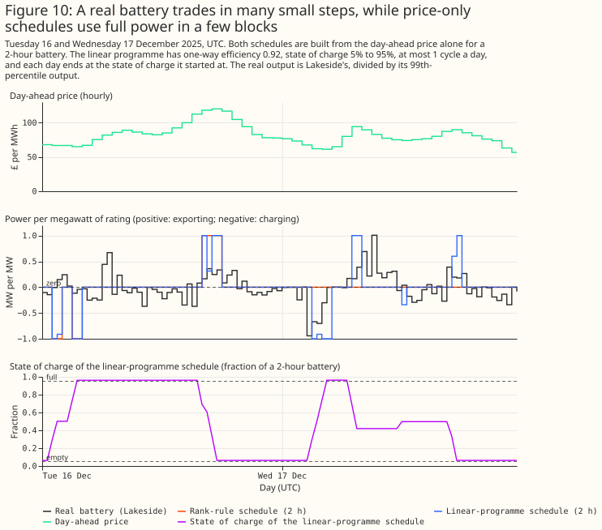

**The fitted battery contribution is about a fifth of the true battery and follows the true battery
no better than unconstrained price regressors.** The fitted coefficient is a mean of 0.20 of the
battery's true p99 output for A6 and 0.18 for A5.

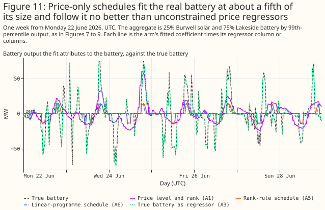

**The solar error is 25.4% for A6 and 25.7% for A5, against 18.7% for A1 (regional sky).** The post
hoc contrast B5 claimed that A6 recovers solar at least as well as A1. A6 minus A1 is +6.7 points
[4.5, 8.6]: not met. Post hoc contrast B6 had two parts and no pass rule. The first part is the
price-specific gain. A6 minus A6c is −0.3 points [−0.5, −0.2], so the gain specific to the right
week's prices is small. The wrong-week controls reach 25.8%.

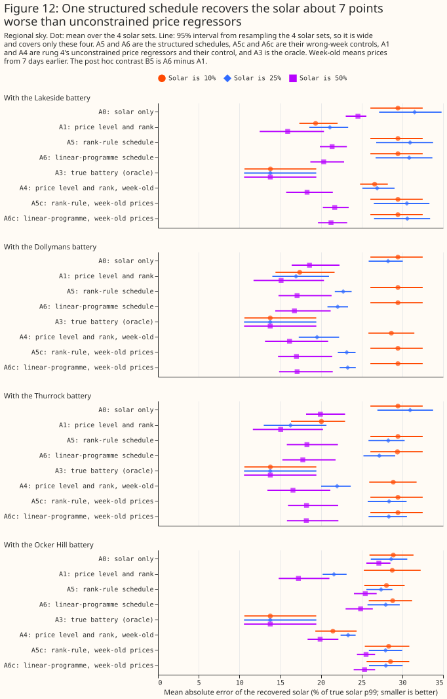

**Structured schedules raise fewer false alarms than unconstrained regressors on the regional sky,
but not on the GB-mean sky.** The second part of B6 counts false alarms under the variance rule. A5
and A6 each have 3 of 16 false alarms on the regional sky, against 6 for A1 and 0 for A0 by
construction. On the GB-mean sky the counts are 12 for A5, 8 for A6, and 12 for A1. B6 is read as
not met. That reading was chosen after the numbers were seen, because the right-week gain of 0.3
points is small and the false-alarm counts remain above A0's 0.

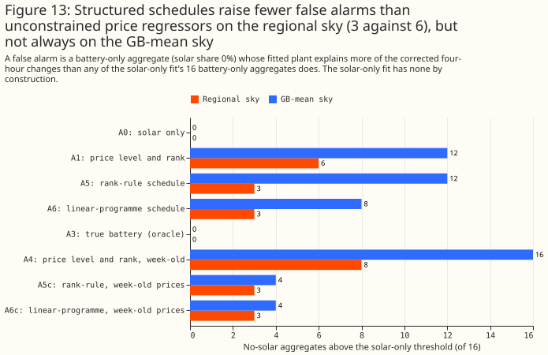

Exploratory longer batteries help a little: a 4-hour linear programme (A6_4h) gives 23.1%, against
25.4% for the 2-hour version.

### Rung 6: solar and a battery fitted together

**Fitting solar and a battery together, with the battery's state of charge limited, recovers the
solar nearly as well as the oracle on synthetic aggregates with no demand-like half.** The model
writes the aggregate as solar plus a battery. Solar is a non-negative sum of four fleet curves
(east, south, west, and tracker). The battery is a free charge and discharge schedule within a power
limit, an energy capacity, and a one-way efficiency of 0.92, fitted by linear programming in windows
of about 4 weeks. A throughput cost of 0.1 per megawatt of charge or discharge, against 1 per
megawatt of residual (unexplained output), stops the battery charging and discharging
simultaneously. Arm A8 gives the model the true battery's power and rung 3's whole-year capacity,
which drift inflates. Arms A8h and A8d use half and double that energy capacity, and A9 uses the
true power with 2 hours of energy. Figure 1 (at the top of this page) shows one week of one
synthetic aggregate. The fit follows the clear days and misses the cloud on the last, cloudy day.


**On the regional sky the joint model has a solar error of 14.8% (A8) and 14.6% (A9), against 27.2%
for the solar-only fit.** The post hoc contrast B7 claimed that A8 recovers solar better than
A0, and B8 made the same claim for A9. B7 (A8 minus A0) is −12.4 points [−15.6, −9.1] and B8 (A9
minus A0) is −12.6 [−15.7, −9.3]: both met.

**An energy capacity above rung 3's whole-year fit hurts, and half of it does not.** A battery with
double the energy capacity is worse (A8d, 16.3%), and half that capacity is slightly better (A8h,
14.3%). Half of A8's whole-year capacity is close to the 3-month block fits of rung 3, which may be
why A8h does best.

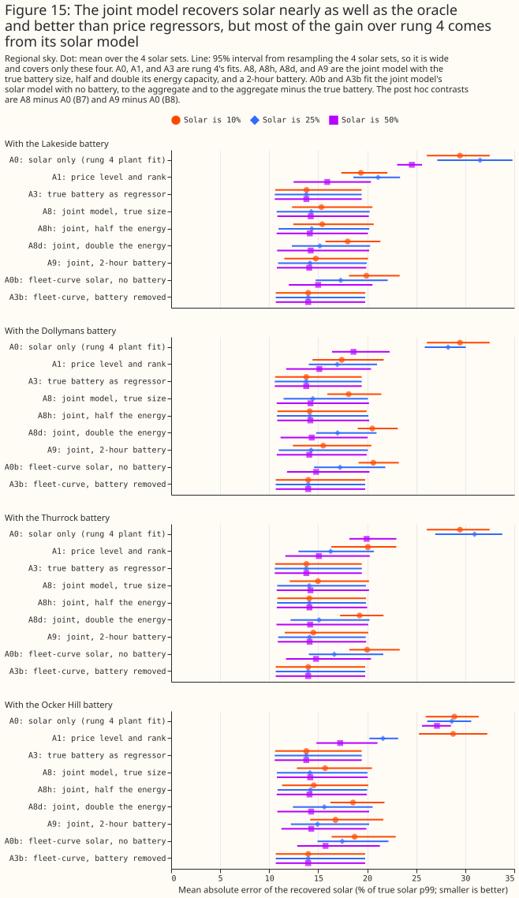

**Within the fleet-curve solar model, the battery model closes 2.5 of the 3.3 points between a fit
with no battery and a fit given the true battery.** A0b is the fleet-curve solar fit with no battery
(17.3%), and A3b is the fleet-curve fit given the true battery's output, removed from the aggregate
(14.0%). A8 (14.8%) is 0.8 points [0.5, 1.2] above A3b, a like-for-like gap (exploratory). A8 minus
A0b is −2.5 points [−2.9, −2.1] (exploratory). The oracle A3 of 13.8% uses rung 4's physical plant,
which is a different solar model. The battery model's own contribution is largest at a 10% solar
share (−3.8 points) and shrinks to −0.9 at 50%. At a 10% share A0b fits under the 2 MW detection
threshold in 4 of 16 aggregates. In 2 of those 16 A0b fits no solar at all, so A0b's correlation
with the true solar there is undefined (NaN).

**Of the 3.9 points between A1 (18.7%) and A8 (14.8%), 2.4 come from the fleet-curve solar model and
1.5 from the battery constraint.** The intermediate arm A1b, the fleet-curve solar fit with A1's two
price columns as free signed regressors, splits the gap. The arms A1, A0b, and A8 differ in both the
solar model and the battery treatment, so no single contrast separates price regressors from the
battery model. A1b has a solar error of 16.3%, against 17.3% for A0b and 14.8% for A8. The price
columns therefore gain 1.0 point over A0b (A1b minus A0b is −1.0 [−1.3, −0.8], post hoc), and the
battery constraint gains a further 1.5 points (A8 minus A1b is −1.5 [−1.9, −1.1], post hoc). Moving
A1's price columns onto the fleet-curve solar model lowers A1's error by 2.4 points (A1b minus A1
is −2.4 [−3.8, −1.1], post hoc).

**The recovered battery output is close to the true output, and the state of charge only partly.**
Over the 48 aggregates with solar, A8's battery output differs from the true output by 3.08% of the
battery's p99 (correlation 0.96). The correlation with the state of charge that rung 3 integrates
from the true battery's output is 0.50 for A8, 0.73 for A8h, 0.31 for A8d, and 0.77 for A9. A8h and
A9 correlate better than A8 with that path, which fits the explanation that A8's energy capacity is
inflated by drift.

**On synthetic aggregates with no demand-like half, the fitted solar AC capacity of A8 and A9 is 14%
to 28% above the true capacity.** The ratio of fitted to true solar AC capacity is 1.18 for A8 and
1.14 for A9 on the regional sky, and 1.28 for A8 and 1.21 for A9 on the GB-mean sky. A3b, with the
true battery removed, has 1.13 on the regional sky, so most of the bias is already in the
fleet-curve solar model. The energy ratio is 1.03 for A8 pooled and 1.09 at a 50% share.

**With rung 3's energy capacity or more, the joint model fits no solar on battery-only aggregates
under the capacity rule, and with less it fits up to 1.7 MW.** The capacity rule was set post hoc
for B4 when rung 6 was specified. It counts a fitted solar capacity above 2 MW (2% of the
aggregate's p99) as detected solar. A8, A8d, A0b, A1b, and A3b fit 0.00 MW in all 16 battery-only
aggregates (0 of 16 false alarms each). A8h and A9 fit at most 1.72 MW and 1.46 MW, just under the
threshold, so none counts as a detection: B4 is met for the joint model. The zero false alarms of A8
rest on rung 3's whole-year energy capacity, which drift inflates. At a threshold of 1 MW, A8h has 8
of 16 false alarms and A9 has 4 of 16, and at 2 MW neither has any.

**Under the variance rule too, the fleet-curve arms with no battery, or with a battery at least as
large as rung 3's, stay at 0 of 16.** The variance rule is rung 4's, and it counts a fit of 0 MW as
undetected. It differs from the capacity rule, so the 0 of 16 under the capacity rule does not
compare with A1's 6 of 16 under the variance rule. Under the variance rule, A8h has 14 of 16 false
alarms and A9 has 4 of 16. Five fleet-curve arms stay at 0 of 16: A0b and A1b (no battery), A3b (the
true battery removed), and A8 and A8d (a battery at least as large as rung 3's). A battery smaller
than rung 3's is where the joint model starts to fit solar that is not there, at most 1.7% of the
aggregate's p99 for the arms that stay under the 2 MW threshold.


### Rung 6: half or double the true battery power

**Half or double the true battery power is worse than the true power, and both still beat a fit with
no battery.** Rungs 7 and 7b must assume a battery power, because the real BMUs' batteries are
unknown. This run (post hoc) refits A8 on the regional sky with the power and the energy capacity
both multiplied by 0.5 (A8_p05) and by 2 (A8_p2), which keeps the duration. The pooled solar error
is 15.7% [13.9, 18.2] for A8_p05 and 16.2% [14.3, 18.3] for A8_p2, against 14.8% [12.7, 17.4] for A8
and 17.3% [15.6, 19.5] for the no-battery fit A0b. Against A8, A8_p05 is 0.9 points worse [0.6, 1.2]
and A8_p2 is 1.4 points worse [0.9, 1.8]. The wrong power raises the solar error most at a 10% solar
share (1.3 and 2.8 points) and not at all at 50%. The energy ratio is 0.92 for A8_p05 and 0.90 for
A8_p2, against 1.03 for A8. The pooled AC capacity ratio is 1.01 and 1.02, against 1.18 for A8. The
pooled value hides a low ratio at a 10% share (0.82 and 0.74) and a high one at 50% (1.17 and 1.24).
No battery-only aggregate has more than 1 MW of fitted solar under any of the five arms (0 of 16 at
1 MW and at 2 MW).

### Rung 7: the real aggregate BMUs

**On the 25 real aggregate BMUs the battery size is not identified, and the fitted solar capacity
depends on it.** The BMUs are supplier and virtual BMUs, registered by electricity suppliers and by
virtual lead parties, that hold the embedded generation and demand of many small sites. The solar
study could not tell solar from batteries in them. This rung fits each BMU's real output with rung
6's joint model for an assumed battery power between 0 and 200 MW, with 2 hours of energy. A power
of 0 is solar only. The sky is the mean of the three CAMS grid points nearest to the centroid of the
BMU's grid supply point group, because the solar location of a real aggregate is unknown. The model
has no calendar baseline, and the solar study's fits had one. Rung 7b below adds the baseline.

**A smaller residual is not evidence that a battery exists.** The residual falls steadily as the
assumed battery grows, for real output and for calendar replicas alike. The median over BMUs is 0.29
of its value at 0 MW for a 50 MW battery for real output, and 0.28 for replicas. No ground truth
exists.

**Allowing a larger battery cuts the fitted solar capacity of the biggest BMUs.** Only
2__ATGPL000 and 2__HTGPL000 fall to about 0 MW at 200 MW. The BMU 2__LTGPL000, which has the largest
fitted capacity at no battery, falls from 109.7 to 56.9 MW.


**Allowing a 50 MW battery cuts the fitted solar peak of 2__ATGPL000, the BMU with the
second-largest fitted capacity at no battery, from 62 MW to 46 MW.** At that size the fitted battery
runs at its ±50 MW power limit in 3.9% of the half-hours of the year.


**The fitted solar capacity of the 25 BMUs is between 161 and 323 MW at every assumed battery power
from 0 to 200 MW, far below the solar study's 1,089 to 1,163 MW.** The totals differ in kind as well
as in size, because this fit has no calendar baseline. The maximum, 322.7 MW, is at 5 MW, which the
table omits: the total is 316.5, 322.0, 322.7, and 319.0 MW at 0, 2, 5, and 10 MW.

| Assumed battery power (MW) | 0 | 10 | 50 | 200 |
|---|---|---|---|---|
| Fitted solar capacity, 25 BMUs, real output (MW) | 316.5 | 319.0 | 275.3 | 161.0 |
| Fitted solar capacity, 25 BMUs, calendar replicas (MW) | 281.6 | 283.2 | 227.5 | 143.1 |
| Fitted solar capacity, nine cloud-signal BMUs, real output (MW) | 262.4 | 253.1 | 208.7 | 98.6 |
| Fitted solar capacity, nine cloud-signal BMUs, replicas (MW) | 226.2 | 217.7 | 160.8 | 80.7 |


**The replicas also fit solar, so the model is not isolating the cloud signal.** A replica contains
the mean solar shape and no cloud, so a replica that fits solar shows that the fit works from the
daily shape, not that the fit invents solar from nothing. The replicas fit 226.2 MW over the nine
cloud-signal BMUs with no battery. The gap between real output and replica, the part that follows
the real weather, is 36.1 MW over those nine BMUs at no battery and 17.9 MW at 200 MW.

### Rung 7b: the same fit with the solar study's calendar baseline

**With a calendar baseline, the joint model's total fitted solar over the 25 BMUs is 1,154 to 1,217
MW at every assumed battery power.** Rung 7 had no baseline, so its solar part absorbed every
regular daily and seasonal shape of a BMU's output. Rung 7b fits each BMU's output as the sum of
solar, a calendar baseline, and a battery. Solar is the four fleet curves under the same regional
CAMS sky. The baseline is the solar study's seasonal design (an indicator for each local half-hour
of the day and day type, plus two annual harmonics for each half-hour) with free signed
coefficients. A linear programme cannot hold the small ridge penalty the solar study put on that
baseline, so this fit puts a small absolute penalty on the coefficients instead (0.001 per unit of
coefficient, against 1 per megawatt of residual). The battery is rung 7's, with an assumed power
from 0 to 200 MW and 2 hours of energy.

| Assumed battery power (MW) | 0 | 5 | 20 | 50 | 100 | 200 |
|---|---|---|---|---|---|---|
| Fitted solar capacity, 25 BMUs, real output (MW) | 1,160 | 1,198 | 1,217 | 1,216 | 1,202 | 1,154 |
| Fitted solar capacity, 25 BMUs, calendar replicas (MW) | 216 | 239 | 265 | 304 | 366 | 426 |
| Fitted solar capacity, nine cloud-signal BMUs, real output (MW) | 1,146 | 1,171 | 1,182 | 1,173 | 1,161 | 1,129 |
| Fitted solar capacity, nine cloud-signal BMUs, replicas (MW) | 213 | 223 | 245 | 282 | 341 | 403 |

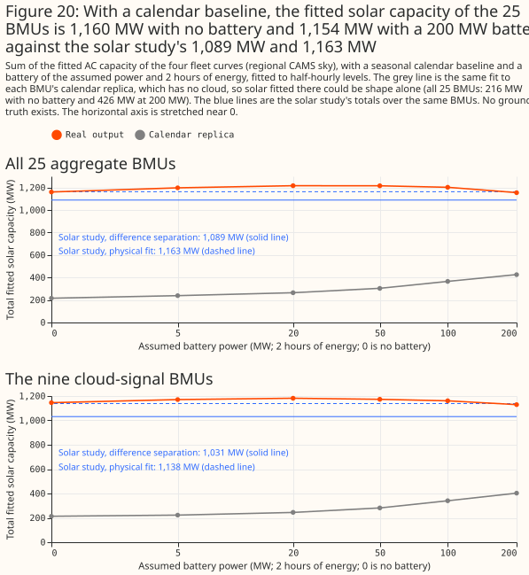

**With a calendar baseline, the fitted total is a conditional fit, not a check on the solar
study.** The total is 1,160 MW with no battery, and it stays between 1,154 and 1,217 MW across the
assumed battery sizes. The solar study's totals are 1,163 MW from its physical fit and 1,089 MW from
its difference separation (a fit of the fleet curves to four-hour changes, then the baseline). The
two capacity measures differ: on the synthetic aggregates of rung 6, the fleet-curve fit given the
true battery fits 1.13 times the direct physical fit to the solar half, and the solar study found
that its physical fit recovers 0.24 to 0.44 of the reference capacity beside storage, against 0.93
beside wind or gas. The match of 1,160 MW with 1,163 MW is therefore not evidence that either total
is right, and no ground truth exists.

**With the baseline, the fitted solar of the largest BMUs no longer falls to zero as the battery
grows.** The nine cloud-signal BMUs hold 1,146 MW at no battery and 1,129 MW at 200 MW, against 262
MW and 99 MW in rung 7 without the baseline. That fourfold difference shows that the fitted
capacity depends on the model, not only on the data. 2__ATGPL000 stays at 271 to 277 MW, and
2__HTGPL000 ends at 216 MW at 200 MW (255 MW with no battery). In rung 7, without the baseline,
both fell to about 0 MW at 200 MW. At 50 MW, the fitted battery runs at its limit in 0.7% of
2__ATGPL000's half-hours, against 3.9% in rung 7.

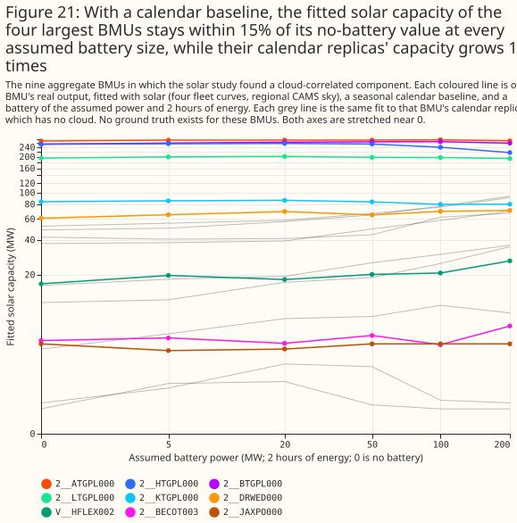

**Part of the fitted solar could be daily and seasonal shape that a calendar replica also
produces, and that part grows with the assumed battery.** A replica has no cloud, so solar fitted to
a replica is shape alone. The replicas total 216 MW at no battery, which is 19% of the real output's
1,160 MW, and 426 MW at 200 MW, which is 37% of the real output's 1,154 MW. A fifth to over a third
of the fitted capacity could therefore be shape. The gap between real output and replicas falls
from 944 MW at no battery to 728 MW at 200 MW.

**The residual falls with the assumed battery power for real output and for replicas alike, so the
battery size is not identified.** The fit alone cannot separate the cloud-driven part from shape.
The median over BMUs of the residual is 0.30 of its no-battery value at 50 MW for both.

### Rung 7c: known-answer test

**On synthetic aggregates with a demand-like half, the joint model overshoots the solar capacity at
the true battery power, and by more at larger assumed powers.** Each synthetic aggregate is a solar
half (25 or 50 MW p99), a battery half, and a demand-like half: the real output, or the calendar
replica, of one of three aggregate BMUs, scaled to a 50 MW p99. The solar study found no cloud
signal in those three BMUs, and this test assumes they hold no solar. The assumption was not tested:
rung 7b fits real output of one of them, V__NFLEX003, with 7.6 MW of solar and no battery, and 18.4
MW at 100 MW. The battery half has a p99 of 100 MW minus the solar half's: 75 MW beside 25 MW of
solar, 50 MW beside 50 MW, and 100 MW with no solar. Rung 7b's model is fitted to 48 aggregates per
row (4 solar halves, 4 batteries, and 3 demand-like BMUs). Those 48 aggregates share their 4 solar
halves, 4 batteries, and 3 demand-like BMUs, so the intervals understate the uncertainty. This run
is post hoc. Capacity is a ratio over the same model fitted to the solar half alone (the fleet-curve
reference), which is what the model fits with no battery or demand-like half to confuse it.

| Capacity over the fleet-curve reference | 0 MW | 20 MW | 50 MW | 100 MW | 200 MW | True power |
|---|---|---|---|---|---|---|
| Real demand-like half, 25 MW solar | 0.96 | 1.10 | 1.35 | 1.69 | 1.98 | 1.50 |
| Real demand-like half, 50 MW solar | 1.02 | 1.18 | 1.30 | 1.43 | 1.56 | 1.30 |
| Replica demand-like half, 25 MW solar | 0.86 | 0.93 | 1.14 | 1.42 | 1.72 | 1.26 |
| Replica demand-like half, 50 MW solar | 0.93 | 1.06 | 1.17 | 1.32 | 1.44 | 1.17 |

In the last column the assumed power is the battery half's true power, which is 75 MW for the rows
with 25 MW of solar and 50 MW for the rows with 50 MW of solar. The last column therefore differs
from the 100 MW column.

**The two capacity measures are biased in the same direction.** With no battery assumed, the fitted
capacity is 0.86 to 1.02 times the fleet-curve reference. At the true power, the fitted capacity
over the direct physical fit to the solar half is 1.11 to 1.44 times, against 1.17 to 1.50 times
over the fleet-curve reference. At 100 and 200 MW the fleet-curve ratio is 1.32 to 1.98. The solar
series error is 14.5% to 16.8% at the true power and rises to 16.9% to 24.3% at 200 MW. Recovered
solar energy over true energy is 0.97 to 1.22 at the true power. The solar study's difference
separation, which has no battery, fits 1.34 to 1.60 times the fleet-curve reference.

**With no solar present, the model fits more than 1 MW of solar in most sums once the assumed
battery power is large.** The sums with no solar have a 100 MW battery half, so their true power is
100 MW. With a real demand-like half, the false alarms above 1 MW are 11 of 48 at 0 MW, 26 of 48 at
50 MW, and 35 of 48 at the true power; 45 of 48 at 200 MW. With the demand-like half taken as a
calendar replica, the false alarms are 38 of 48 at the true power. The false alarms at 0 MW, which
are 11 of 48 for a real demand-like half against 5 of 48 for a replica, are consistent with some of
the demand-like halves holding solar.


**On these sums, giving the joint model the battery's true power lowers the solar error by 0 to 1.4
points and raises the fitted capacity.** Against no battery, the solar series error at the true
power is 16.7% against 16.7% (real demand-like half, 25 MW solar), 14.5% against 15.4%, 16.8%
against 17.8%, and 14.9% against 16.3%. The same step raises the fitted capacity from 0.86 to 1.02
times the fleet-curve reference to 1.17 to 1.50 times. Rung 6 recovered solar from sums with no
demand-like half. The joint model's gain shown there is therefore not shown to survive a demand-like
half. The real BMUs differ from these sums in a second way: the real total is flat from 1,154 to
1,217 MW as the assumed power rises, while the capacity of the sums rises steeply.

### Rung 7c: cost sensitivity

**The fitted total stays between 1,150 and 1,220 MW at every throughput cost that uses the battery,
and the stability is partly the linear programme's.** The linear programme charges 0.1 per megawatt
of battery throughput, against 1 per megawatt of residual. At 200 MW and a throughput cost of 0.3
or less, the median share of half-hours that the fit reproduces exactly is 100%. Many solutions
therefore fit equally well, and the two weights in the objective settle which one the solver
returns. This run (post hoc) refits rung 7b's model at 50 and 200 MW with the throughput cost
changed from 0.08 to 1 per megawatt. At the highest throughput cost (1 per megawatt) the battery is
not used, the median residual stays at 0.92 of its no-battery value at 50 MW and 0.95 at 200 MW, and
the total reverts to the no-battery 1,160 MW. The calendar replicas' totals are cost-sensitive: at
200 MW they are 341 MW at a throughput cost of 0.3 against 426 MW at 0.1, and at 50 MW they are 269
MW against 304 MW.

**The two solar-cost settings are not informative.** The run also charged 0.01 and 0.05 per
megawatt of fitted solar capacity, and the total moved by at most 1 MW. That cost is charged once
per megawatt of capacity, against a residual summed over about 17,500 half-hours, so it is too
small to move the fit. The result says nothing about whether the total is robust to a prior on the
capacity.


## Discussion

**The evidence supports a joint model with an explicit battery for simple synthetic aggregates when
the battery's power is known. It supports no solar capacity for the 25 real aggregate BMUs, so the
capacity answer is not established by this study.** The summary at the top of the page gives the
results. Two lessons carry over:

- **Judge any separation against a control with the same daily shape, and against a synthetic
  aggregate with a known answer.** The calendar replicas of rung 7 and the wrong-week prices of
  rung 4 each show how much a method fits without the signal, and rung 7c shows a bias that no
  replica can.
- **Report the model, the capacity measure, and the battery size that a result assumes.** Without a
  calendar baseline, the fitted solar capacity of 2__ATGPL000 and 2__HTGPL000 falls to about 0 MW
  with a 200 MW battery. With the baseline, it stays at 271 MW and 216 MW (from 255 MW).

**A ground truth would establish the capacity.** An aggregate BMU whose solar and battery are
metered separately would let the fit be scored against a known answer on real data, rather than on
synthetic aggregates. Short of that, a better real-aggregate result would need at least three inputs
this study did not use. A demand model would describe the non-solar part of a supplier BMU, which is
mostly demand. Planned-output data for the BMU (its physical notification) would say what the
battery intended, leaving the remainder. Response-contract data would explain the frequency-driven
remainder (Figure P3 of [how GB batteries schedule
themselves](../background/gb-battery-scheduling.md)).

## Limitations

- **The scripts were first run during exploration, before their code review.** No separate diff
  review of the page and its scripts has been done yet, and the mutation-testing pass of
  `packages/studies` is pending.
- **The contrasts are labelled planned, post hoc, or exploratory, and no correction is made for
  multiple comparisons.** The planned contrasts are B1, B3, and B4 (variance rule). The post hoc
  contrasts are B5 to B8, B4 (capacity rule), and those involving A1b. The plan's B2 was not run,
  because no state-of-charge predictor of output was built. Each rung's section gives the results.
- **Four batteries and one year in Coordinated Universal Time (UTC) are the whole sample**, with
  four solar halves, so the intervals of rungs 4 to 6 resample only four solar halves or 16
  aggregates and are wide. The intervals of rung 7c resample 48 aggregates as if independent,
  although the aggregates share 4 solar halves, 4 batteries, and 3 demand-like BMUs.
- **Rung 3's energy capacities are inflated by slow drift**, so A8's capacity, and every cycle count
  computed from it, is biased. The solar capacity of A8 and A9 is biased high by 14% to 28% on the
  synthetic aggregates of rung 6. The false alarms that A8 does not raise rest on this inflated
  capacity.
- **The solar halves are real BMUs**, and the solar study found that 8 of its 11 solar BMUs are
  hybrids, so a solar half may already include battery effects.
- **The joint model's best arms are told the true battery's power.** A8 also takes its energy
  capacity from rung 3's fit to the same battery, an advantage that a real aggregate does not give.
- **The regional irradiance for synthetic aggregates is picked from the solar half's true
  location**, an advantage that the real aggregates do not have. The GB-mean sky removes it, and
  raises the false-alarm counts of the unconstrained price regressors.
- **State of charge is never observed**, so no check on it is independent of the fit.
- **Response-contract blocks are candidates**, matched by identifier only (see [how GB batteries
  schedule themselves](../background/gb-battery-scheduling.md)).
- **The four batteries are all registered in the Balancing Mechanism.** Batteries that trade in
  other markets are not seen in the price-response data.
- **Rung 7c's demand-like halves come from three BMUs, half of them as real output and half as
  calendar replicas, and are assumed to hold no solar.** A real aggregate's demand, with its own
  weather dependence, may bias the capacity differently. Rung 7c is post hoc. The solar-cost
  settings of the cost-sensitivity run are too small to test anything.
- **A battery assumed where none is present was not tested.** Every synthetic aggregate holds a
  battery, so the study does not show whether an assumed but absent battery inflates or deflates
  the fitted capacity of the 25 real BMUs, whose batteries are unknown.
- **Rungs 7 and 7b have no ground truth.** Adding the calendar baseline raises the total from
  316.5 MW to 1,160 MW, close to the solar study's totals, and that agreement does not show the
  total is right.
- **Rung 7b penalises the baseline coefficients with an absolute penalty**, where the solar study
  used a ridge penalty, and the effect of that difference was not tested. Rung 6's synthetic
  aggregates had no calendar baseline, so they do not measure the capacity bias of rung 7b's fit.
  Rung 7c measures it, with demand-like halves from only three BMUs.

## Scope

**Two related questions are separate studies and are not answered here.** The first asks how well an
embedded battery can be forecast, and the second asks how to estimate the size of an unmetered
battery from an aggregate. The scripts for a private case study of one battery in NGED's telemetry
(`nged_battery_a*.py`) are in the repository. The case study's figures and report are unpublished
and wait for those two studies.

## Data and code availability

**The prices and metered data are public.** Contains Balancing Mechanism Reporting Service (BMRS)
data © Elexon Limited, copyright and database right 2026. National Energy System Operator (NESO)
data, including the N2EX day-ahead prices and the auction results, is published under the NESO Open
Data Licence. CAMS irradiance comes through the solar study. The market datasets sit under
`data/studies/downloads/market/`, each folder with a README that gives its column meanings and time
conventions.

The scripts are in `studies/battery_pv_separation/`. The shared machinery is in
`packages/studies/src/studies/` (`battery_dispatch.py`, `battery_joint_lp.py`, `pv_fit.py`), and the
results are under `data/studies/per_study/battery_pv_separation/`, which are not committed.

## Reproducing

The market datasets under `data/studies/downloads/market/` must be on disk first. Then run the
scripts in this order. Set `OMP_NUM_THREADS=2` for each command.

```bash
uv run python studies/battery_pv_separation/battery_primer.py
uv run python studies/battery_pv_separation/battery_rung1.py
uv run python studies/battery_pv_separation/battery_rung2.py
uv run python studies/battery_pv_separation/battery_rung3.py
uv run python studies/battery_pv_separation/battery_rung4.py
uv run python studies/battery_pv_separation/battery_rung4_summary.py
uv run python studies/battery_pv_separation/battery_rung5.py
uv run python studies/battery_pv_separation/battery_rung5_summary.py
uv run python studies/battery_pv_separation/battery_rung6.py
uv run python studies/battery_pv_separation/battery_rung6_summary.py
uv run python studies/battery_pv_separation/battery_rung7.py
uv run python studies/battery_pv_separation/battery_rung7_summary.py
uv run python studies/battery_pv_separation/battery_rung7b.py
uv run python studies/battery_pv_separation/battery_rung7b_summary.py
uv run python studies/battery_pv_separation/battery_rung6_wrong_power.py
uv run python studies/battery_pv_separation/battery_rung6_wrong_power_summary.py
uv run python studies/battery_pv_separation/battery_rung7c_costs.py
uv run python studies/battery_pv_separation/battery_rung7c_costs_summary.py
uv run python studies/battery_pv_separation/battery_rung7c_known_answer.py
uv run python studies/battery_pv_separation/battery_rung7c_known_answer_summary.py
uv run python studies/battery_pv_separation/battery_report.py
uv run python studies/battery_pv_separation/battery_charts_primer.py  # writes docs/background/assets/
uv run python studies/battery_pv_separation/battery_charts.py
uv run python studies/battery_pv_separation/battery_charts_rung5.py
uv run python studies/battery_pv_separation/battery_charts_rung6.py
uv run python studies/battery_pv_separation/battery_charts_rung7.py
uv run python studies/battery_pv_separation/battery_charts_rung7b.py
uv run python studies/battery_pv_separation/battery_charts_rung7c.py
```

The helper modules `battery_inputs.py` and `battery_synthetic.py` hold the shared loading and the
synthetic aggregates, and are not run on their own.
