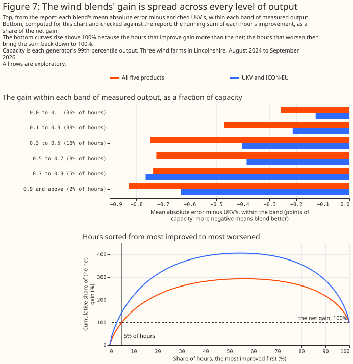
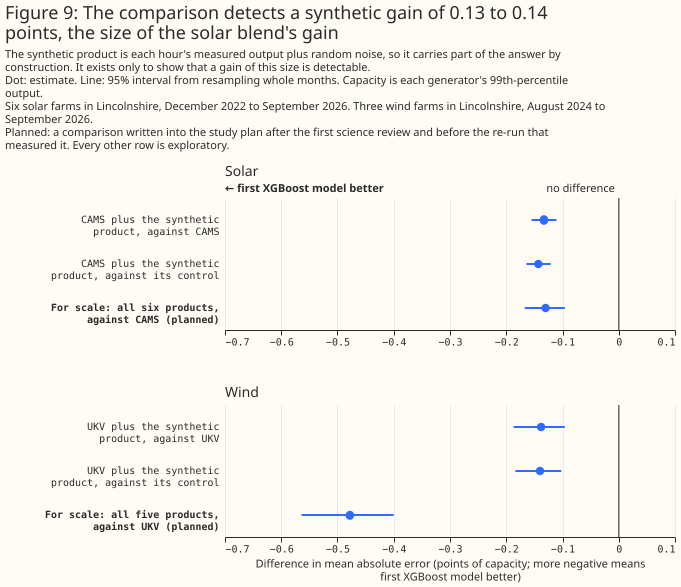

# Does blending weather products beat the best single weather product?

> **This study uses only Flexpectation's own data, and its purpose is to inform Flexpectation's
> choices.** The study scores each weather product and each blend only at the generators in
> Flexpectation's trial area in Lincolnshire. The study does not compare results across many regions
> or climates, so a result on this page may not hold elsewhere.

**This study asks which weather data best describes the weather that has already happened. The study
does not test weather forecasts.** Every product is scored on hours in the past, against what each
generator actually produced in those hours. Several of the products are numerical weather prediction
(NWP) models: UKV, ICON-D2, ICON-EU, and ICON global. The NWP models are included because this study
reads only the first few hours of each NWP run, at lead times of 0 to 6 hours depending on the
model, and uses those hours as a stand-in for an analysis: the model's best estimate of the weather
at the time the run starts. How well the same NWP models forecast hours or days ahead is a separate
question, tracked in [#810](https://github.com/openclimatefix/nged-substation-forecast/issues/810).

**At 6 solar farms and 3 wind farms in Lincolnshire, an XGBoost model given several weather products
at once beats an XGBoost model given the best single product, even when the single product is also
given its values for the neighbouring hours, the hours either side.** Every error here is a mean
absolute error as a percentage of each generator's capacity. A difference between two errors is in
percentage points of capacity, written "points", and a bracketed pair after a number is its 95%
interval. For solar, an XGBoost model given all six products has an error of 4.79% of capacity,
against 4.92% for an XGBoost model given CAMS, the Copernicus satellite retrieval, with its
neighbouring hours and its split of sunlight into direct beam and diffuse light: 0.13 points better
[0.10, 0.17]. At a solar farm with 10 MW of capacity, 0.13 points is 13 kW off a mean absolute error
of 492 kW. For wind, an XGBoost model given all five products has an error of 5.76%, against 6.24%
for an XGBoost model given the wind of UKV, the Met Office's UK model, with its neighbouring hours:
0.48 points better [0.40, 0.56]. A blend that a live forecasting service could read beats the best
single product as well: UKV with ICON-EU, by 0.26 points [0.21, 0.31] for wind. All three
comparisons are post hoc, chosen after a first run's results, as "Data and methods" explains. The
evidence is 77,616 generator-hours (one generator's output over one hour) at the 6 solar farms from
December 2022 to September 2026, and 50,734 generator-hours at the 3 wind farms from August 2024 to
September 2026, except the CAMS-with-SARAH-3 section: 115,594 generator-hours from January 2021.

**The gain comes from the other products' hour-by-hour weather, not from giving the XGBoost model
more columns.** A control that keeps the extra columns but replaces their weather with other days'
values from the same month does no better than the single product.


**Figure 1 ranks each single product and each blend by its own mean absolute error. Figure 2 tests
each named blend against its best single product directly.** Figure 1's intervals are wide mainly
because every XGBoost model's error rises and falls together from month to month. Figure 2 compares
two XGBoost models on the same months and the same fitting seed, the random start an XGBoost model
is trained from, which cancels that shared swing, so Figure 2's intervals are much narrower. Two
rows can therefore overlap in Figure 1 even where the difference between them, tested directly in
Figure 2, is statistically significant at the 5% level. Figure 1 also marks the rows a live service
anywhere in Great Britain can read. For both solar and wind the best of those rows is UKV with
ICON-EU, each product given its neighbouring hours.


> **How this page was made.** The research question came from a human. Everything else — the code
> behind every result, the analysis, the figures, and the text — was written by Claude, Anthropic's
> AI model (for this page, Claude Opus 5.5). Several independent Claude reviewers have checked the
> method, the evidence, and the prose adversarially.

## Key findings

- **[The XGBoost models behind every comparison track the measured output at every
  generator.](#the-xgboost-models-track-the-measured-output)**
- **[For solar, an XGBoost model given all six products beats an XGBoost model given CAMS alone by
  0.13 points, and an XGBoost model given the four weather models beats an XGBoost model given
  ICON-D2 alone by 0.34 points.](#solar-a-blend-beats-cams-given-its-neighbouring-hours)**
- **[For wind, an XGBoost model given all five products beats an XGBoost model given UKV alone by
  0.48 points, and an XGBoost model given UKV and ICON-EU beats UKV alone by 0.26
  points.](#wind-a-blend-beats-ukv-given-its-neighbouring-hours)**
- **[The gain comes from the other products' weather: a control given the same columns without their
  weather does no better than the best single
  product.](#the-gain-comes-from-the-other-products-weather)**
- **[Every named blend beats its best single product at every generator and in every
  season.](#the-gain-holds-at-every-generator-and-in-every-season)**
- **[The wind gain is spread across every level of output. The study script's report finds that 5%
  of hours carry 99% of the gain, which reflects hours that improve and hours that worsen netting
  out.](#the-wind-gain-is-spread-across-every-level-of-output)**
- **[An XGBoost model given every product's columns beats a linear stack of single-product
  predictions, and averaging with CAMS makes the solar error far
  worse.](#an-xgboost-blend-beats-a-linear-stack-and-simple-averages)**
- **[A known small signal, sized to about the solar headline gain, is recovered in
  full.](#a-known-small-signal-is-recovered-in-full)**
- **[CAMS's split beats SARAH-3 alone, but blending the two beats CAMS's split with its own
  neighbouring hours by 0.18 points (post hoc) and plain CAMS's split by 0.20 points (planned), and
  both gains survive a climatology
  control.](#blending-cams-with-sarah-3-beats-camss-own-split)**

## Introduction

**Two earlier pages ranked weather products one at a time, and neither measured whether an XGBoost
model given several products at once does better.** [Which weather product best describes past
sunshine?](weather-products-for-past-solar.md) found that CAMS, the Copernicus Atmosphere Monitoring
Service's satellite retrieval, describes past sunshine far better than any weather model tested.
[Which weather product best describes past wind?](weather-products-for-past-wind.md) found that
ICON-D2 and UKV describe past hub-height wind best of the five products tested. Both pages scored
each product through an XGBoost model fitted per generator to predict hourly output from that
product alone.

**Several parts of this project read past weather, and each could read a blend instead of one
product.** The solar page names these consumers of past weather. Training history is the years of
past weather that pre-training a forecasting model needs. Historical features give the live
forecasting model the weather of hours already past.
Capacity estimation infers a generator's size from how its output tracks the weather. Disaggregation
separates hidden generation from demand at a substation. This page asks whether an XGBoost model
given several products beats an XGBoost model given the best single product, and says which blend,
if any, each consumer should read.

**The products are the same as on the two earlier pages.** The solar products are CAMS; ERA5, the
reanalysis of the European Centre for Medium-Range Weather Forecasts (ECMWF); the Met Office's UK
variable-resolution model (UKV); and three models of the German weather service (DWD): ICON-D2,
which covers Germany and its neighbours, ICON-EU, and ICON global. The four products other than CAMS
and ERA5 are weather models, run every few hours. The wind products are the same, less CAMS, which
publishes no wind. ICON-D2 does not cover South West England or South Wales. ICON-D2's western edge
runs from about 2°W on the south coast to about 2.5°W in the Midlands.


**Each blend reads one set of products; the last column says which consumer the set could serve:**

| Set | Solar products | Wind products | Why this set |
|---|---|---|---|
| All products | all six | all five | the most any blend can read |
| CAMS and ICON-D2 | CAMS, ICON-D2 | – | history where ICON-D2 covers |
| CAMS and ICON-EU | CAMS, ICON-EU | – | history anywhere in Great Britain |
| CAMS and ERA5 | CAMS, ERA5 | – | history back to 2004 |
| ICON-D2 and UKV | – | ICON-D2, UKV | the two leaders on the wind page |
| UKV and ICON-EU | UKV, ICON-EU | UKV, ICON-EU | a live service anywhere in Great Britain |
| Four weather models | UKV, ICON-D2, ICON-EU, ICON global | the same | a live service where ICON-D2 covers |

## Data and methods

**Every comparison is scored on the two earlier studies' own hours, folds, and fitting seeds.** Each
XGBoost model is trained on some blocks of whole months and scored on the others. Each held-out
block is called a fold, and there are five. Each XGBoost model is fitted three times, from three
fitting seeds. The solar rows are 77,616 generator-hours at six solar farms, labelled A to F, from 1
December 2022 to 10 September 2026. The wind rows are 50,734 generator-hours at three wind farms,
labelled W1 to W3, from 12 August 2024 to 10 September 2026. Each hour is kept only if every product
covers it. This study refits every single-product XGBoost model the two earlier pages published: 22
solar and 16 wind combinations of weather columns and hyperparameter setting. Every refit reproduces
the published per-hour errors bit for bit, which shows that the hours and the folds are unchanged.

**Each XGBoost model is fitted per generator and given the same calendar columns as on the earlier
pages, plus the weather columns below.** The calendar columns are the time of day, the season, and
which side of the Met Office's upgrade of UKV on 21 January 2026 the hour falls on. The solar
XGBoost models are also given the sun's position and ERA5's air temperature. Each comparison is
between two such XGBoost models, differing only in the weather columns:

- **Plain single product:** the columns the earlier pages gave one product. Solar: the product's
  global horizontal irradiance. Wind: the product's hub-height speed, that height's direction as a
  sine and a cosine, and its 10 m speed.
- **Enriched single product:** the plain columns plus the extras the solar page found improve one
  product on its own. Solar: the irradiance in the hour before and the hour after; for CAMS, its
  beam and diffuse irradiance as well; for UKV, the hour rebuilt as the mean of the snapshots at its
  start and end. Wind: the hub-height speed 1 and 2 hours either side, and the 10 m speed 1 hour
  either side.
- **Blend:** every product in a set, each with its plain columns or each with its enriched columns.

**The best single product of a set is the single-product XGBoost model with the lowest error among
the set's products.** The candidates are every single-product XGBoost model the earlier pages
published and every enriched one. For every set containing CAMS the best single product is enriched
CAMS, with an
error of 4.92%. For the four weather models it is ICON-D2 enriched, at 7.50%. For every wind set it
is UKV enriched, at 6.24%, ahead of ICON-D2 enriched at 6.28%. The extra columns matter on their
own: enriching UKV lowers its wind error by 0.59 points, and enriching CAMS lowers its solar error
by 0.18 points.

**Each set is blended four ways:**

- **XGBoost given every product's columns**, the blend this page's headline results describe.
- **XGBoost given the products' mean**: the mean of the products' values, as the same number of
  columns as one product has. The wind mean mixes ICON's 80 m speed with the 100 m speed of ERA5 and
  UKV, which a per-generator XGBoost model can absorb.
- **A linear stack**: a weighted mean of the single-product XGBoost models' predictions, with
  weights that are not negative and sum to 1. The weights are fitted per generator, per fitting
  seed, and per fold, on the other folds only.
- **The equal-weight mean** of the single-product XGBoost models' predictions.

**Each XGBoost blend has a control given the same columns without their weather.** The control keeps
the best single product's real columns. Every other product's columns are shuffled among the hours
sharing a generator, a calendar month, and an hour of the day. The shuffle keeps each month's mean
at each hour of the day, and removes the hour-to-hour weather. The blend minus its control measures
what the other products' weather adds. The control minus the best single product measures what the
extra columns add alone, with no weather in them.

**A synthetic product shows that the comparison can detect a gain of the size found.** The synthetic
product is each hour's measured output as a fraction of capacity, plus random noise drawn once with
a fixed seed. The noise has a standard deviation of 0.30 of capacity for solar and 0.45 for wind.
The best single product of the all-products set is given the synthetic product as one more column,
and a control is given the same column shuffled as above.

**Every error is a mean absolute error as a percentage of each generator's own capacity.** Capacity
here is each generator's 99th percentile of metered output, not its registered or export capacity. A
difference between two errors is in percentage points of capacity, written "points".

**A bracketed pair after a number is its 95% interval, from resampling whole calendar months and one
of the three fitting seeds.** A difference whose interval excludes zero is statistically significant
at the 5% level. That test covers month-to-month variation in the weather and the choice of fitting
seed. It does not cover differences between generators, or between the XGBoost models trained on
different folds. Each headline result therefore also carries a t-interval across the five folds'
differences and the range of the difference across the generators.

**Each comparison is planned, post hoc, or exploratory.** A planned comparison is one written into
the study plan before the run that measured it. A post hoc comparison is one chosen after the first
run's results, and fixed before the re-run that produced the numbers on this page. Every other
number is exploratory. The headline comparisons, of each enriched blend against the enriched best
single product, are post hoc: the first science review saw the first run's results, found that much
of that run's gain was available from one product given its extra columns, and the plan was fixed to
compare enriched XGBoost models before the re-run that measured them. The plain comparisons were
written into the plan before any result existed, and are reported as secondary.

**If no two XGBoost models compared differed, about one exploratory interval in twenty would still
be statistically significant at the 5% level by chance.** Here 121 of the 139 exploratory intervals
exclude zero. The intervals share hours and XGBoost models with one another, so they are not
independent tests, and the study script's report quotes no count of how many could be chance.

**Every planned or post hoc comparison is also rerun with a shallower, more heavily regularised set
of XGBoost settings, to check that a result is not an accident of one choice of settings.** The main
settings are those the two earlier pages used. The shallower settings drop the maximum tree depth
from 6 to 4, raise the regularisation strength, and run 1,200 rounds at a lower learning rate.

**Figures 4 and 5's three weeks per generator are chosen by rule, from the weeks in which every
generator has at least 4 scored solar hours or 12 scored wind hours on each of the seven days.**
From those weeks, each figure shows the week with the highest mean output, the week with the lowest
mean output, and the most variable week: for solar, the week with the largest day-to-day spread in
daily mean output; for wind, the week with the largest mean hour-to-hour change.

## Results

### The XGBoost models track the measured output

**The XGBoost models given the best single product, and those given every product, follow the
measured output hour by hour at every generator, in weeks chosen by rule.** Figures 4 and 5 show
three weeks at each generator: the week with the highest mean output, the most variable week, and
the week with the lowest mean output. Each XGBoost model's prediction is out of fold, so the hours
it predicts were held out of its training. The prediction shown is the mean over the three fitting
seeds.


**The blend's error is lower than the best single product's at every generator, for every set in
Figure 6.** The errors range from about 4% of capacity at the best solar farm to about 9% for the
four weather models at the worst. Generator W3's output swings for months at a time against every
product's wind, which the wind page attributes to turbine availability the feed does not record.


### Solar: a blend beats CAMS given its neighbouring hours

**An XGBoost model given all six products beats an XGBoost model given enriched CAMS by 0.13 points
[0.10, 0.17], 2.7% of CAMS's error, in a post hoc comparison.** The t-interval across the five folds
is [0.09, 0.18], and the gain at each generator ranges from 0.09 to 0.18 points. With the shallower
settings the gain is 0.12 points [0.09, 0.16].

**CAMS with ICON-EU alone gives most of that gain: 0.10 points [0.07, 0.14] over enriched CAMS, in a
post hoc comparison.** The t-interval across the folds is [0.06, 0.15], and the per-generator gain
ranges from 0.06 to 0.13 points. In exploratory comparisons, CAMS with ICON-D2 gains 0.12 points
[0.09, 0.15], and CAMS with ERA5 0.07 points [0.04, 0.10].

**Among the weather models alone, an XGBoost model given all four beats an XGBoost model given
enriched ICON-D2 by 0.34 points [0.25, 0.44], 4.5% of ICON-D2's error, in a post hoc comparison.**
The t-interval across the folds is [0.22, 0.48], and the per-generator gain ranges from 0.26 to 0.42
points. With the shallower settings the gain is 0.30 points [0.21, 0.40]. In an exploratory
comparison, UKV with ICON-EU beats enriched UKV by 0.50 points [0.41, 0.58].

**The plain comparisons, planned before the first run, show larger gains because their single
product lacks the extra columns.** Against plain CAMS, an XGBoost model given all six products'
plain columns gains 0.20 points [0.16, 0.24]. Against plain ICON-D2, an XGBoost model given the four
weather models' plain columns gains 0.47 points [0.40, 0.55].

### Wind: a blend beats UKV given its neighbouring hours

**An XGBoost model given all five products beats an XGBoost model given enriched UKV by 0.48 points
[0.40, 0.56], 7.7% of UKV's error, in a post hoc comparison.** The t-interval across the five folds
is [0.33, 0.59], and the gain at each generator ranges from 0.41 to 0.53 points. With the shallower
settings the gain is 0.50 points [0.43, 0.58].

**UKV with ICON-EU beats enriched UKV by 0.26 points [0.21, 0.31], 4.2% of UKV's error, in a post
hoc comparison.** The t-interval across the folds is [0.16, 0.34], and the per-generator gain ranges
from 0.23 to 0.32 points. With the shallower settings the gain is 0.27 points [0.23, 0.32]. In
exploratory comparisons, the four weather models beat enriched UKV by 0.46 points [0.39, 0.54], and
ICON-D2 with UKV by 0.39 points [0.32, 0.46].

**The plain comparisons, planned before the first run, again show larger gains.** Against plain
ICON-D2, the best plain wind product, all five products' plain columns gain 0.82 points [0.74,
0.90]. Against plain UKV, UKV with ICON-EU gains 0.65 points [0.59, 0.72].

### The gain comes from the other products' weather

**For every named blend, the blend beats its control, and the control does no better than the best
single product.** Figure 7 splits each blend's gain in two. For all six solar products, the blend
beats its control by 0.20 points [0.17, 0.23], and the control is 0.07 points worse than enriched
CAMS [0.05, 0.09]. For all five wind products, the blend beats its control by 0.53 points [0.46,
0.62], and the control is 0.06 points worse than enriched UKV [0.02, 0.09]. For UKV with ICON-EU,
the control's difference from enriched UKV is not statistically significant at the 5% level (0.02
points worse [−0.01, +0.04]). All of these comparisons are post hoc.

**Extra columns without weather make the XGBoost model slightly worse, so the blend's gain over its
control is larger than its gain over the best single product.** The control keeps each month's mean
at each hour, which carries a little real information, so a blend's gain over its control is if
anything understated.


### The gain holds at every generator and in every season

**Each named blend beats its best single product at each of its farms, in each of the four seasons,
and on each side of UKV's January 2026 upgrade.** The solar blends are scored at the 6 solar farms
and the wind blends at the 3 wind farms. All 54 of these exploratory intervals are statistically
significant at the 5% level, and so are all 54 intervals of each blend against its control. The
splits share hours and XGBoost models with the whole-record results and with one another, so they
are not independent tests.

**The solar gain is smallest from June to August, and the wind gain holds in every season.** An
XGBoost model given all six products beats enriched CAMS by 0.09 points [0.03, 0.15] from June to
August, and by 0.20 points [0.11, 0.28] from December to February. All five wind products beat
enriched UKV by 0.39 to 0.58 points in each season. Since UKV's upgrade the solar gain is 0.07
points [0.03, 0.12] and the wind gain 0.40 points [0.33, 0.50], each resting on 8 months.


### The wind gain is spread across every level of output

**The wind blends beat enriched UKV in every band of measured output, and most of the net gain sits
in hours below half of capacity.** All five products gain 0.26 points in the hours below a tenth of
capacity, which are 36% of the hours, and 0.725 to 0.828 points in each band above 0.3 of capacity.
The three bands below half of capacity carry 19%, 33%, and 24% of the net gain, so the hours below
0.3 of capacity carry 52%, and the hours above 0.9 carry 4%. The top
panel of Figure 9 shows each band.

**The study script's report states that the most-improved 5% of hours carry 99% of the gain, which
describes gains and losses netting out, not a gain confined to a few hours.** Of the hours, 56%
improve and 44% worsen. Sorting the hours from most improved to most worsened, the running sum of
the improvement passes the net gain after about 5% of hours, rises to 2.93 times the net gain where
the improving hours end, and falls back as the worsening hours are added. So the other 95% of hours
net to about 1% of the gain. For UKV with ICON-EU the most-improved 5% carry 143% of the net gain,
and the running sum rises to 4.06 times the net gain before the other 95% of hours bring it back
down. The bottom panel of Figure 9 shows both running sums.



### An XGBoost blend beats a linear stack and simple averages

**An XGBoost model given every product's columns beats a linear stack of the single-product XGBoost
models, by 0.07 points for solar [0.05, 0.10] and 0.10 points for wind [0.05, 0.16], in post hoc
comparisons.** For wind the t-interval across the folds, [−0.01, +0.19], includes zero, so the wind
result rests on the month resampling alone. With the shallower settings the wind difference is 0.11
points [0.06, 0.17], with a fold t-interval of [0.03, 0.18]. The stack still beats the best single
product for both solar and wind: by 0.06 points [0.03, 0.10] for all six solar products, and 0.38
points [0.32, 0.43] for all five wind products, in exploratory comparisons.

**Averaging CAMS with the other solar products makes the error far worse, because CAMS is far better
than every other product.** For all six solar products, the XGBoost model given the products' mean
is 1.65 points worse than enriched CAMS [1.48, 1.81], and the equal-weight mean of the predictions
is 1.78 points worse [1.61, 1.96]. For wind, both averages of UKV and ICON-EU beat enriched UKV, by
0.22 points each. All of these comparisons are exploratory.


**The XGBoost blend has the lowest error of the four blends in every named set.** For UKV with
ICON-EU the XGBoost blend leads the linear stack by 0.01 points [−0.02, +0.04], which is not
statistically significant at the 5% level (exploratory). The linear stack weights CAMS heavily for
solar and splits the wind weight between UKV and ICON-D2. For all six solar products the stack's
mean weight on enriched CAMS is 0.85, and no other product's exceeds 0.07. For all five wind
products the mean weights are 0.43 on UKV, 0.37 on ICON-D2, 0.12 on ICON-EU, 0.06 on ERA5, and 0.02
on ICON global. Across folds each weight moves by 0.031 or less on average.

**Fitting the stack's weights on the scored fold as well would flatter the stack by at most 0.02
points.** The report prints that in-sample gap for every stack, from 0.002 to 0.020 points. Stacking
one product's three fitting seeds, which isolates what averaging XGBoost models alone contributes,
gains about 0.01 points.

### A known small signal is recovered in full

**The comparison recovers in full a synthetic gain planted at about the size of the solar headline
gain.** The noise was sized on a pilot fit. Given the synthetic product, an XGBoost model beats the
best single product by 0.14 points for solar [0.11, 0.16] and 0.14 points for wind [0.10, 0.19],
with all five folds agreeing, in exploratory comparisons. Against its shuffled control the gain is
0.15 points for solar and 0.14 points for wind (exploratory). Because the noise level was chosen to
target the headline gain's size, this comparison shows the pipeline can recover a known gain of that
size. The comparison does not independently confirm the headline gain's magnitude. A comparison
where a large gain is known to exist, CAMS with ICON-D2 against ICON-D2 alone, shows a gain of 2.86
points [2.64, 3.08] (exploratory).



### Blending CAMS with SARAH-3 beats CAMS's own split

**An XGBoost model given CAMS's split plus SARAH-3's global irradiance beats an XGBoost model given
CAMS's split with its own neighbouring hours by 0.18 points [0.16, 0.21] (post hoc), and beats plain
CAMS's split by 0.20 points [0.17, 0.22] (planned); both gains survive a climatology control.**
[Which weather product best describes past
sunshine?](weather-products-for-past-solar.md#sarah-3-is-second-to-cams-under-every-satellite) found
CAMS the best single product and SARAH-3 the best of the rest, 0.43 points behind [0.35, 0.51] on
these rows, for a reason the page could not identify. The two retrievals build their hourly value
differently — CAMS integrates over the hour itself, while SARAH-3 here is the mean of two 30-minute
snapshots — and apply different cloud retrievals and clear-sky models to the same Meteosat images,
so SARAH-3's errors may be partly independent of CAMS's even though SARAH-3 is the weaker product
alone, the same way ICON-EU added information to CAMS above despite being a weaker single product
for solar. This section tests that directly.

**The rows are the past-solar page's [record
panel](weather-products-for-past-solar.md#how-the-comparison-was-made): 115,594 common site-hours at
the same 6 solar farms, labelled A to F, from 1 January 2021 to 31 August 2026, the longer row set
that page uses for its SARAH-3 comparison.** This row set is not the 77,616-row set the rest of this
page scores: it holds four products only — CAMS, SARAH-3, ERA5, and ICON-DREAM-EU — starting in
January 2021 rather than December 2022, so none of the numbers in this section are comparable in
absolute terms to the headline results above. Before any blend was fitted, refits of CAMS's split,
CAMS alone, and SARAH-3 alone were checked row for row against the past-solar page's own saved
errors on this row set, and matched them bit for bit on all 346,782 scored rows (115,594 rows times
three fitting seeds).

**Every comparison reads the record panel's calendar and sun-position columns plus one set of weather
columns.** CAMS's split with SARAH-3 carries CAMS's global, direct-beam and diffuse irradiance plus
SARAH-3's global irradiance; its climatology control carries the same columns with SARAH-3's global
irradiance permuted within a generator, a calendar month, and an hour of day, which keeps each
month's climatology at each hour but removes SARAH-3's hour-by-hour values. Two more comparisons
repeat the same blend and control on CAMS's and SARAH-3's global irradiance alone, without CAMS's
split, so the two products contribute the same kind of column (exploratory): a matched comparison,
but one that cannot say whether a blend beats CAMS's own split. CAMS's split with its own
neighbouring hours — the hour before and the hour after, read separately from CAMS's own download —
is a third, post hoc reference, added after the first science review found this section's reference
lacked the extras every other single-product reference on this page carries; blended with SARAH-3 it
is tested against both that enriched reference alone and its own climatology control. An XGBoost
model given the mean of CAMS's and SARAH-3's global irradiance as a single column is exploratory
too, distinct from the linear stack and the equal-weight average, which are built from the
single-product models' own out-of-fold predictions rather than from a shared column; all three are
built on the two products' global irradiance only, since SARAH-3 has no split of its own to combine
with CAMS's. Two negative controls pair CAMS with a noised copy of itself: one noised at 48.2 W/m2,
the measured root-mean-square difference between CAMS's and SARAH-3's global irradiance on these
rows, so its two columns differ from each other about as much as the two products genuinely do; the
other noised at a fixed 5 W/m2, close to a duplicate column.

**Two comparisons were written into the study's design before this run, as the git history shows:**
CAMS's split with SARAH-3 against CAMS's split alone, and against the climatology control. Both are
refitted at a second, more heavily regularised XGBoost setting to check the result is not an accident
of one choice of settings. CAMS's split with its own neighbouring hours plus SARAH-3, against that
enriched reference and against its own climatology control, is post hoc, added after the first
science review, and is refitted at the second setting too. Every other number in this section is
exploratory.

**Both planned comparisons are statistically significant at the 5% level, at both settings, and so
are both post hoc comparisons against the enriched reference.** Against CAMS's split with its own
neighbouring hours, CAMS's split with its own neighbouring hours plus SARAH-3 gains 0.18 points
[0.16, 0.21] at the main setting and 0.18 points [0.16, 0.21] at the second setting (post hoc); the
t-interval across the five folds is [0.14, 0.22]. It beats its own climatology control by 0.20
points [0.17, 0.22] at the main setting and 0.19 points [0.17, 0.22] at the second setting
(t-interval [0.16, 0.23]). Against plain CAMS's split, the planned comparison gains 0.20 points
[0.17, 0.22] at the main setting and 0.19 points [0.17, 0.22] at the second setting (t-interval
[0.15, 0.24]), and beats the climatology control by 0.21 points [0.19, 0.24] and 0.21 points [0.18,
0.23] (t-interval [0.17, 0.25]). Since each blend beats its own control by about as much as it beats
its own reference, most of the gain comes from SARAH-3's hour-by-hour values rather than from the
extra column alone. A single column averaging CAMS's and SARAH-3's global irradiance already gains
0.12 points over CAMS (exploratory), as much as CAMS's own split gives CAMS (0.12 points,
exploratory), so part of the gain is two retrievals of the same images averaging out each other's
errors, or two footprints of the same cloud field: CAMS is interpolated from satellite pixels about
5 km across, and SARAH-3 is read from a 0.05° grid cell 0.8 to 2.8 km away from CAMS's own point, so
the two rarely see exactly the same patch of cloud. No comparison here separates that spatial
averaging from weather one retrieval sees and the other misses.


**The gain holds at every generator, grows with clearness in points though not as a share of CAMS's
split's own error, and holds in every year since 2021, though its size varies.** Broken down by
generator, CAMS's split with SARAH-3 beats CAMS's split by 0.10 to 0.48 points, largest at generator
D, which holds 13% of the rows and 32% of this contrast's total gain; excluding generator D the gain
is 0.15 points [0.13, 0.18]. Every one of these 6 breakdowns is statistically significant at the 5%
level. Broken down by CAMS's and SARAH-3's mean clearness index, the gain is 0.15 points [0.12, 0.19]
in overcast hours, 0.20 points [0.17, 0.23] in broken cloud, and 0.24 points [0.19, 0.28] in clear
hours: the blend helps most in points when the sky is clearest, but as a share of CAMS's split's own
error in each band the gain sits in a narrow band throughout — 5.0% overcast, 3.7% broken cloud, 4.0%
clear. Broken down by calendar year, restricted to January–August so a partial 2026 compares against
the same months of every complete year, the gain ranges from 0.18 to 0.28 points and is statistically
significant every year. These breakdowns share hours and XGBoost models with the whole-record result
and with one another, so they are not independent tests. Resampling the six generators with
replacement instead of the months gives a wider but still positive interval: 0.20 points [0.14, 0.30]
for the planned comparison and 0.18 points [0.12, 0.30] against CAMS's split with its own
neighbouring hours (both exploratory), and every one of the 68 scored months gains for both
comparisons.

**The gain does not track CAMS's own hour-to-hour ramp, so a timing repair to CAMS alone would not
explain it.** Against CAMS's split with its own neighbouring hours, the gain is 0.21 points in the
calmest fifth of hours (CAMS's own irradiance changing least from the hour before to the hour after)
and 0.16 points in the steepest fifth (exploratory), the opposite of what a fix to CAMS's own timing
convention would predict. The gain is instead concentrated where CAMS and SARAH-3 disagree most:
0.53 points in the fifth of hours where the two differ most (exploratory). A least-squares fit of
SARAH-3's global irradiance on CAMS's own hour and its immediate neighbours, restricted to daytime
hours, gives SARAH-3 ≈ 0.82·CAMS(t) + 0.12·CAMS(t−1) + 0.07·CAMS(t+1): SARAH-3 leans towards CAMS's
own hour, not towards a shifted one, so the gain looks like genuine disagreement between the two
retrievals rather than CAMS's hour being mislabelled.

**Blending the two products' global irradiance alone, without CAMS's split, also beats CAMS, but at a
smaller gain than CAMS's split with SARAH-3 gets against the same reference, CAMS's split.** CAMS
with SARAH-3, both global, beats CAMS alone by 0.24 points [0.21, 0.27] and its own climatology
control by 0.26 points [0.23, 0.29] (exploratory). Against CAMS's split, rather than plain CAMS, the
all-global blend's gain is smaller: 0.12 points [0.09, 0.15] (exploratory), and adding CAMS's own
split on top of the all-global blend gains a further 0.08 points [0.06, 0.10] (exploratory), which by
construction sum to the 0.20-point gain the planned comparison finds directly against CAMS's split.
The
mean of the two products' global irradiance beats CAMS by 0.12 points [0.09, 0.16], the linear stack
by 0.18 points [0.16, 0.21], and the equal-weight average by 0.13 points [0.10, 0.17], all
exploratory and all smaller than the XGBoost blend's gain.

**Both negative controls show the pipeline does not manufacture a gain from an uninformative second
column.** CAMS paired with a copy of itself noised to match the measured CAMS/SARAH-3 gap is 0.01
points worse than CAMS alone [0.00, 0.01] — statistically significant, but about 36 times smaller
than the 0.20-point gain CAMS's split gets from SARAH-3, and in the wrong direction to explain it.
CAMS paired with a copy of itself noised at a fixed 5 W/m2, close to a duplicate column, is not
statistically significant at the 5% level (0.00 points [−0.00, +0.01]). Neither control comes close
to the size or the sign of the gain SARAH-3 itself adds.


**No other second product beats CAMS's split by as much as SARAH-3 does.** ERA5 and ICON-DREAM-EU
each cover the same rows as SARAH-3, so both can be blended with CAMS's split the same way, each
with its own climatology control. CAMS's split with ERA5 gains 0.10 points [0.08, 0.12] over plain
CAMS's split and 0.11 points [0.09, 0.13] over its own control; CAMS's split with ICON-DREAM-EU
gains 0.10 points [0.08, 0.12] and 0.11 points [0.09, 0.13] (all post hoc). Both are real gains, each
statistically significant at the 5% level, but each is about half of SARAH-3's 0.20-point gain over
the same reference: SARAH-3 is not merely one second column among several that happens to help, and
the size of its gain is unusual among the products tested here.


## What to use

**A blend waits for its slowest product, plus one hour (solar) or two hours (wind) for its own
neighbouring hours. The consumer therefore decides which sets are available at all.** The table
gives each set's latency, which consumers can read it, and the first scored hour.

| Solar or wind | Set | Available after | Live anywhere in Great Britain? | Includes a history-only product (CAMS or ERA5)? | Needs ICON-D2's domain? | Archive serves every product from | Scored hours start |
|---|---|---|---|---|---|---|---|
| Solar | CAMS and ICON-D2 | about 1 day | no | yes | yes | December 2022 | 1 December 2022 |
| Solar | CAMS and ICON-EU | about 1 day | no | yes | no | November 2022 | 1 December 2022 |
| Solar | CAMS and ERA5 | about 5 days | no | yes | no | January 2004 | 1 December 2022 |
| Solar | UKV and ICON-EU | about 5 hours | yes | no | no | November 2022 | 1 December 2022 |
| Solar | Four weather models | about 5 hours | no | no | yes | December 2022 | 1 December 2022 |
| Solar | All six products | about 5 days | no | yes | yes | December 2022 | 1 December 2022 |
| Wind | ICON-D2 and UKV | about 6 hours | no | no | yes | August 2024 | 12 August 2024 |
| Wind | UKV and ICON-EU | about 6 hours | yes | no | no | August 2024 | 12 August 2024 |
| Wind | Four weather models | about 6 hours | no | no | yes | August 2024 | 12 August 2024 |
| Wind | All five products | about 5.1 days | no | yes | yes | August 2024 | 12 August 2024 |
| Solar | CAMS and SARAH-3 | about 2 to 5 days | no | yes | no | 2004 (SARAH-3's Interim Climate Data Record from January 2021) | 1 January 2021 |

**These recommendations rest on 6 solar farms and 3 wind farms in one part of Lincolnshire,
over less than 4 years for solar and 2 years for wind.**

- **Historical features in the live service: UKV with ICON-EU, anywhere in Great Britain; the four
  weather models where ICON-D2 covers.** UKV with ICON-EU beats enriched UKV by 0.26 points for wind
  (post hoc) and 0.50 points for solar (exploratory). Inside ICON-D2's domain the four weather
  models beat the best single weather model by 0.34 points for solar (post hoc) and 0.46 points for
  wind (exploratory). A live blend needs every product at run time, so a blend has more products
  that can go missing, and under this project's [inherent stability
  rules](../design-philosophy/inherent-stability.md) each needs a fallback. Every result here scores
  the archive's freshest run for each hour, and at run time the last few hours come from an older
  run.
- **Training history: CAMS with ICON-EU for solar anywhere in Great Britain from December 2022; all
  products where ICON-D2 covers.** For solar, all six products beat enriched CAMS by 0.13 points,
  and CAMS with ICON-EU by 0.10 points, both post hoc. For wind, all five products beat enriched UKV
  by 0.48 points (post hoc), but UKV's hub-height wind starts only in August 2024, so the wind
  blends say nothing about training history before that. CAMS with ERA5 reaches back to 2004 for a
  gain of 0.07 points (exploratory), measured only from December 2022. CAMS with SARAH-3 also gains
  0.20 points over plain CAMS's own split (planned) and 0.18 points over CAMS's split with its own
  neighbouring hours (post hoc), on a different row set, longer but holding four products, from
  January 2021, so the two blends were not fitted on the same rows. On the 76,727 site-hours the two
  studies share, each blend's gain over its own study's CAMS's split with its own neighbouring hours
  is 0.19 points [0.16, 0.23] for CAMS with SARAH-3, 0.13 points [0.10, 0.17] for all six products,
  and 0.10 points [0.07, 0.13] for CAMS with ICON-EU (exploratory): CAMS with SARAH-3 gave the larger
  gain, by 0.06 points [0.01, 0.10] over the six-product blend. The two studies' own reference models
  differ by 0.16 points on these shared hours, so only each blend's own gain, not the reference
  models themselves, compares across the studies. Where CAMS and SARAH-3 both cover the training
  period, CAMS with SARAH-3 is therefore the stronger of the two recommendations; both products take
  their clouds from satellite images rather than from a weather model, and no other second product
  tested gains as much as SARAH-3 does (above). Before 2021 SARAH-3 comes from its Climate Data
  Record rather than the Interim Climate Data Record scored here, and the blend is untested there.
- **Capacity estimation and disaggregation: no recommendation.** Both have to read a product's
  weather without an XGBoost model fitted to the generator's own output, and every gain here exists
  only after an XGBoost model is fitted to that generator's output. The single-product
  recommendations on the solar and wind pages stand.

## Limitations

- **Region and period.** The study covers 6 solar farms inside one 25 km by 23 km box, and 3 wind
  farms in flat country, all in Lincolnshire. The solar hours run from December 2022 (from January
  2021 in the CAMS-with-SARAH-3 section) and the wind hours from August 2024. Nothing here speaks to
  other regions, to terrain, or to offshore wind.
- **The intervals cover weather and fitting seeds, not generators or folds.** The per-generator
  range and the fold t-interval beside each headline show those two sources separately. With three
  wind farms, a fourth could rank the blends differently.
- **The headline comparisons were written after the first science review.** The review saw the first
  run's results before asking for the enriched comparisons, so the choice of extras was informed by
  results, though not by the enriched blends' own results.
- **The enriched best single product may not be the best single product possible.** The extras are
  the ones the solar page found useful. A single product given further columns, such as more
  neighbouring hours or its neighbouring grid cells, might close part of the gap.
- **The linear stack's weights are fitted on out-of-fold predictions from XGBoost models trained on
  the scored fold's months.** This second-order leak is standard in cross-validated stacking, and
  would favour the stack, and the XGBoost blend still matches or beats the stack. The interval
  treats the weights as fixed.
- **Every product is read from Open-Meteo's archive, at the served lead the earlier pages
  describe, except the CAMS-with-SARAH-3 section.** CAMS is read from the Copernicus Atmosphere
  Monitoring Service's own radiation service, never Open-Meteo, and SARAH-3 from EUMETSAT's CM SAF;
  neither reads Open-Meteo's archive anywhere on this page. The weather models' values are forecasts
  made up to a few hours before each hour. A blend's gain at the leads a live forecast uses is not
  measured here.
- **The results rest on the `effective_capacity` table as rebuilt in September 2026, and on version
  3 of the power Delta table.** A rebuilt capacity table would move every number.
- **Open-Meteo's UKV solar archive before 12 August 2024 is a backfill from a source Open-Meteo does
  not name.** Every set reading UKV, including UKV with ICON-EU, spans that boundary; the wind sets
  do not, because UKV's hub-height wind on Open-Meteo starts only in August 2024.
- **The solar row set drops hours where UKV's archive holds a physically impossible sunrise value,
  which the solar page's own [Limitations](weather-products-for-past-solar.md#limitations) section
  describes in full.** Every solar figure on this page inherits that row set, 77,616 generator-hours
  rather than 79,384, except the CAMS-with-SARAH-3 section: its 115,594 generator-hours are the
  past-solar page's `record` panel rows, built and filtered separately, and do not read UKV at all.

## Reproducing the figures

```bash
uv run python studies/beam_diffuse_split/weather_products.py
uv run python studies/beam_diffuse_split/wind_products.py
uv run python studies/beam_diffuse_split/blend_products.py
uv run python studies/beam_diffuse_split/blend_product_charts.py
```

The report lands in `data/studies/beam_diffuse_split/blend_products/report.md`, beside
`reproduction.md`, the per-hour errors and out-of-fold predictions of every XGBoost model, the stack
weights, and every interval as a table. `blend_products.py --resume` reuses the fits a crashed run
left behind. The chart script checks each chart's numbers against the report before drawing.

The CAMS-with-SARAH-3 section needs the past-solar page's `record` panel written first, then:

```bash
uv run python studies/beam_diffuse_split/weather_products.py --panel record
uv run python studies/beam_diffuse_split/blend_satellites.py
uv run python studies/beam_diffuse_split/blend_satellites_charts.py
```

The report lands in `data/studies/beam_diffuse_split/satellite_blend/report.md`, beside
`reproduction.md` and `losses.parquet`. `blend_satellites.py --resume` reuses the fits a crashed run
left behind; `--fit-missing OLD_OUTPUT_DIR` reuses a previous run's published `losses.parquet`
(moved to a `superseded/` subfolder first) for every arm it already holds, fitting only a newly
added arm; `--report-only` rebuilds `report.md` from `losses.parquet` and `reproduction.md` already
on disk.
