# How well can an embedded battery's output be forecast, and how many of NGED's batteries have a published plan?

**For 35 large embedded batteries from October 2025 to August 2026, no forecast we built from the
day-ahead price, the calendar, and the battery's own metered output beat a 56-day trailing
climatology at 18:00 the day before (provisional).** The climatology is the spread of the
battery's own output at the same time of day over the previous 56 days, on days of the same type,
and it is a loose forecast: its middle value is wrong by 15.5% of the battery's 99th-percentile
output on an average half-hour. An XGBoost forecast that adapts as fast as the climatology was not
tested, nor were domestic batteries, batteries below 1 MW (most of the connected batteries in the
distribution network of National Grid Electricity Distribution, NGED), or any input that only NGED
holds.

## Summary

**All numbers on this page are provisional until the maintainer has reviewed the page.** The page
asks four questions. Differences are in points of p99 (1% of a battery's own 99th-percentile
output); a negative difference in "first minus second" means the first forecast's error is
lower, so "worse by X" next to a positive number means the first forecast's error is higher by X;
square brackets give a 95% interval. The terms are defined after the bullets.

- **Can a battery with a published plan be forecast day ahead? Not better than the
  climatology.**
    - Tested: XGBoost, a machine-learning library, given the actual day-ahead price at 18:00 the
      day before, for 35 Balancing Mechanism Units (BMUs, the units in which a battery's output
      is notified, metered, and settled with the system operator), against the climatology (D1).
    - Its CRPS was 12.05 points of p99 against 11.99 for the climatology: a difference of +0.066
      points [-0.075, +0.216], not statistically significant at the 5% level (provisional).
    - A forecast built the same way but given the price of another day, a negative control, scored
      worse than one given the real price by 0.139 points (D2: difference -0.139 [-0.173, -0.105],
      1.1% of the CRPS of XGBoost given another day's price; provisional).
    - A price forecast available at 06:00 the day before improved XGBoost over another day's price
      by 0.035 points (D3: difference -0.035 [-0.062, -0.011]), but XGBoost given it was worse than
      the climatology by 0.195 points [+0.080, +0.331] (provisional).
    - An improvement over the climatology larger than 0.14 points, 1.1% of the climatology's CRPS,
      is excluded at both XGBoost hyperparameter settings tested (0.075 at the first setting
      alone), because it lies outside the 95% interval (provisional).
    - For individual batteries, 18 of 35 have a positive point estimate of improvement, with a
      median skill of +0.001 (a CRPS 0.1% below the climatology's). Two batteries with exactly
      zero output until spring 2026 do much worse (provisional).
- **Can a battery without a published plan be forecast? We could test one battery, with the same
  answer.**
    - Tested: the same XGBoost forecast for one NGED battery, called battery A, against the
      climatology at 18:00 the day before (D5).
    - Its CRPS was 10.06 points of p99 against 9.98: a difference of +0.079 points [-0.068,
      +0.228], not statistically significant at the 5% level. An improvement larger than 0.10
      points, 1.0% of the climatology's CRPS, is excluded at both settings (provisional).
    - One battery cannot show how the answer varies, and its meter may include site load.
- **Does the published plan of another company's battery help? A little, and only if that plan is
  public at gate closure.**
    - A Final Physical Notification (FPN) is the output that a BMU files with the system operator
      for each half-hour, final at gate closure, 1 hour before the half-hour.
    - Tested: for the 35 BMUs 1 hour ahead, XGBoost given the FPNs of other lead parties' batteries
      against XGBoost given the FPNs of another day (D4). A lead party is the company that trades
      for a BMU.
    - The gain was 0.159 points (difference -0.159 [-0.203, -0.113]), 1.3% of the CRPS of XGBoost
      given another day's FPNs (provisional).
    - The battery's own FPN lowers the CRPS by 3.2 points relative to XGBoost given no FPN, and
      other lead parties' FPNs lower it by 0.17 points, which is 5.2% of the own FPN's gain (95%
      interval 2.0% to 7.5% when lead parties are resampled as well as months; provisional). The
      study plan named a tenth as the share below which the fleet's FPNs "say little".
    - XGBoost given others' FPNs was not significantly better than the climatology (-0.120 points
      [-0.283, +0.073]; exploratory).
- **How many of NGED's batteries have an FPN? The registers list 8 BMUs against 176 storage rows,
  and cannot say how many rows the 8 BMUs stand for.**
    - NGED's Embedded Capacity Register (ECR) lists 176 connected storage rows of 50 kW or more in
      NGED's four licence areas (the regions in which NGED operates), and 141 rows are under 1 MW.
    - The BMU register lists 8 embedded storage BMUs in NGED's four grid supply point groups
      (sets of substations where the transmission network meets NGED's distribution network). The
      ratio of 8 BMUs to 176 rows is 4.5%, a ratio of two registers' counts and not a match rate
      (5 of the 8 have at least 95% of the year's settled output, 2.8%; provisional).
    - Comparing names and capacities matched none of the 8 BMUs to an ECR row, and one BMU may
      stand for several rows or for none.
- **What the methods can and cannot support.** The study measures month-resampled differences in
  CRPS for 35 BMUs of about 50 MW over 11 scored months. The study supports claims about those
  batteries in that period. The study does not support claims about batteries below 1 MW, about
  other periods, or about a battery whose meter includes site load. The forecasts also assume
  that the battery's own output is known at the issue time (see "Data and methods").

**Terms.** A forecast here is 13 quantiles for each half-hour. A quantile is a value that the
outcome falls below with a stated probability, so the outcome exceeds the 10th quantile (p10) nine
times in ten. The score is the CRPS, the continuous ranked probability score: the weighted sum, over
the 13 quantiles, of a pinball loss, a penalty that grows with the distance between the outcome and
the quantile, so a forecast scores well only if it is sharp (narrow) and honest about its spread.
Smaller is better. A CRPS "skill" is one minus the ratio of a forecast's CRPS to the climatology's,
so +0.01 means a CRPS 1% lower. A "point of p99" is 1% of a battery's own 99th-percentile absolute
output, so batteries of different sizes compare, and a negative difference favours the first
forecast in "first minus second". Square brackets give a 95% interval. A difference is statistically
significant at the 5% level when its interval does not contain zero, and is "excluded" when it lies
outside the interval. The five planned contrasts are D1 to D5: **D1** XGBoost given the actual price
minus the climatology; **D2** XGBoost given the actual price minus XGBoost given another day's
price, both at 18:00 the day before; **D3** XGBoost given a forecast price minus XGBoost given
another day's price, at 06:00 the day before; **D4** XGBoost given other lead parties' FPNs minus
XGBoost given the same lead parties' FPNs of another day, 1 hour ahead; **D5** D1 for NGED battery
A. The *lead time* of a forecast is the time from its issue to the half-hour it describes.

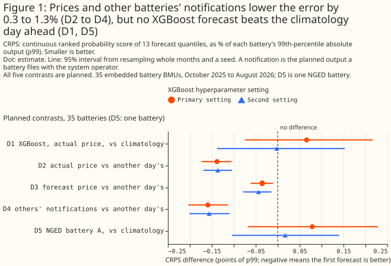

**Take-home bullets, one per use of the data:**

- **For a day-ahead forecast of a large embedded battery, use the 56-day climatology as the
  baseline.** No XGBoost forecast tested beat it.
- **For a forecast 1 hour ahead, the battery's own FPN is the input that matters,** if it is
  public at gate closure. Other lead parties' FPNs give 5.2% of the own FPN's CRPS gain.
- **For NGED's planning, treat the share of connected batteries with an FPN as unknown but
  probably small.** The registers list 8 BMUs against 176 storage rows, and 141 of the rows are
  under 1 MW.

> **How this page was made.** The research question came from a human. Everything else — the code
> behind every result, the analysis, the figures, and the text — was written by Claude, Anthropic's
> AI model (for this page, Claude Sonnet 5.5, Claude Sonnet 5, and Claude Opus 5.5). Several
> independent Claude reviewers have checked the method, the evidence, and the prose
> adversarially.

## Key findings

- **The day-ahead price's gain over another day's price (D2) survives resampling the 12 lead
  parties as well as the months: [-0.209, -0.069].** See
  [the price](#the-day-ahead-price-improves-xgboost-a-little-not-enough-to-beat-the-climatology).
- **A price forecast at 06:00 recovers about a quarter of the actual price's gain, and its
  significance does not survive resampling lead parties.** See
  [the forecast price](#a-price-forecast-at-0600-recovers-about-a-quarter-of-the-actual-prices-gain).
- **Dropping the idle months of two batteries does not rescue them, and removing them leaves D1
  not significant.** See
  [the idle batteries](#two-batteries-idle-until-spring-do-not-explain-why-xgboost-fails-to-beat-the-climatology).
- **XGBoost is slightly overconfident (its p10 to p90 band covers 76.5% of outcomes), and about
  half of the climatology's lower-tail miss is ties at exactly zero.** See
  [the calibration](#xgboost-is-slightly-overconfident).

## Introduction

**Planning a distribution network needs a half-hourly forecast of what embedded batteries will do
tomorrow, and few of NGED's connected batteries publish their own plan.** A BMU files an FPN, and
most embedded batteries are not BMUs, so a forecaster of a non-BMU battery sees only prices, the
calendar, the weather, and the battery's own recent output. The [battery and solar separation
study](battery-pv-separation.md) used after-the-event inputs throughout, so that study gives only an
upper limit on what a forecast could achieve, because it used inputs that a forecaster would not
have at the time. This study measures forecasts built at three issue times, with
one assumption stated under "Data and methods". Part A forecasts 35 battery BMUs, which have
public output, prices, and FPNs. Part B forecasts NGED battery A, which has no FPN, and says what
Part A can and cannot transfer. A census counts how many connected batteries are BMUs; its result
is in the last Results section.

| Issue time | When | Price input | FPN |
|---|---|---|---|
| 06:00 the day before | 06:00 UTC, before the day-ahead auction result is out | A forecast of the day-ahead price | None exists yet |
| 18:00 the day before | 18:00 UTC, after the result | The actual price | Exists, but a public copy at 18:00 is not available |
| Gate closure | 1 hour before the half-hour | The actual price | Own and others' final FPNs, for BMUs |

The day-ahead auction is the N2EX auction, whose hourly prices NESO (the National Energy System
Operator) republishes. Results are public by 10:00 UK time on the day before.

## Data and methods

**The testbed is every embedded battery BMU with enough public data.** A BMU is in the testbed if
its type is embedded and at least 95% of the year's half-hours are present in both Elexon's settled
output and the half-hourly FPN file: 35 BMUs, with a median generation capacity of 49 MW, run by 12
lead parties. One lead party runs 14 of the 35, and 3 of the 35 sit in NGED's grid supply point
groups. Of the 8 embedded storage BMUs in those groups, 5 have a full year of settled output, and
the testbed also needs a full year of FPNs, which leaves 3. In D4 a battery's neighbours are the
testbed batteries of other lead parties, wherever they are. A lead party is the trading
counterparty, not necessarily the party that schedules the battery, so some neighbours may share the
target's scheduler.

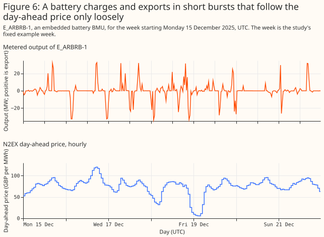

**The forecast is 13 quantiles for each half-hour, never a Gaussian.** A battery's output is bounded
and has three modes: charging hard, idle at exactly zero, and exporting hard, so a Gaussian would
put its probability where the battery rarely is. The 13 levels are p1, p2, p5, p10, p20, p35, p50,
p65, p80, p90, p95, p98, and p99. Each forecast is sorted to repair quantile crossing (a model
sometimes returns a higher quantile below a lower one) and clipped to the 0.1st and 99.9th
percentile of the battery's output on the training months.

**The score is the CRPS, approximated from the 13 quantiles, and the CRPS skill is positive when a
forecast beats the climatology.** The CRPS is the weighted sum of pinball losses (a pinball loss
penalises an outcome above a quantile in proportion to the quantile's level, and an outcome below
it in proportion to one minus the level), in points of p99. The approximation does not cover the
tails beyond p1 and p99. The skill is one minus the ratio of a forecast's CRPS to the
climatology's, and 0.01 means a CRPS 1% lower.

**Four kinds of forecast are compared.** The climatology is described at the top of the page. The
*persistence plus past errors* forecast adds the training months' error quantiles to the latest
observed output at the same time of day. The *rank rule* places charging and export at the
cheapest and dearest hours of the day, then adds error quantiles by schedule state. The XGBoost
quantile model (`reg:quantileerror` at the 13 levels, XGBoost 3.4.1) is given 13 columns:
half-hour of day, day of week, the price, its rank within the day, the day's mean price and range,
the rank rule's value, the persistence value, the climatology's median, and four slots for FPNs.
A slot with no source holds that slot's value from 7 days earlier (for NGED battery A, the
climatology's median from 7 days earlier). `colsample_bytree` is set to 1, so every fit sees all
13 columns. Each choice of inputs, such as "given another day's price", is called an arm on this
page.

**The price inputs bracket what a price forecast could deliver.** *Actual* is the N2EX price. At
06:00 the actual price is not yet public, so XGBoost given it at 06:00 is a "perfect-price
forecast", an upper limit on what a price forecast could deliver. *A week earlier* is the price at
the same hour 7 days before. *Forecast* is an XGBoost model of the price, given the latest wind
forecast that NESO had published, through Elexon's data portal, before the issue time, the calendar,
and the earlier prices, fitted out of fold. *Another day's* is the price of a different day of the
same calendar month and day type. It is the negative control: it keeps the price's typical daily
shape and removes the target day's decisions.

**Apart from the perfect-price forecast at 06:00, only prices that are public at the issue time
enter the forecasts.** The auction prices each hour of the UK day, midnight to midnight UK time.
In summer UK clocks are one hour ahead of UTC, so the hour 23:00 to 24:00 UTC already belongs to
the next UK day, and its price is not public until 10:00 UTC on the target day itself, which the
study uses as a safe reading of Nord Pool's 10:00. A forecast issued before then replaces that
hour's price, and the day's rank, mean, range, and rank-rule value, with the price at the same
hour a week earlier. The perfect-price forecast at 06:00 keeps every hour, because that forecast
is an upper bound.

**The battery's own output is assumed known in real time.** Elexon publishes settled output
about 7 days after the half-hour, so a forecaster using public data alone would have neither the
persistence value nor the latest week of the climatology. The study assumes the network operator
reads each battery's output from its own telemetry, as NGED does for NGED battery A. That
assumption helps every forecast here, so a forecaster using public data alone would do no better
than these results.

**Every forecast is scored on the same 16,080 half-hours per battery, from 1 October 2025 to 31
August 2026, with month-block folds and month-resampled intervals.** The data run from September
2025, so the climatology has at least 28 days of history at the start of scoring (56 days from
late October). The folds are four contiguous blocks of three whole months, so the first holds two
scored months, and there are 11 scored months. A fold is one block of months held out for
testing: each forecast of a month comes from a model fitted on the other three blocks, which is
what "fitted out of fold" means. Training on months later than the test month is acceptable here,
because no input to a forecast uses the target day's own history after the issue time (the
climatology, persistence and prices are built only from data public at the issue time, and the
price forecast is itself fitted without the held-out block), and because the target's own
months are never in training. It could still let XGBoost learn behaviour that only appears
later in the year, which favours XGBoost and so makes the D1 result conservative.

**Each 95% interval resamples whole calendar months and one of 3 fitting seeds, so it covers
month-to-month weather and the seed, not differences between batteries.** Resampling means drawing
months at random with replacement 2,000 times and recomputing the difference, with the same months
for both forecasts of a contrast. A fitting seed is the random number that sets XGBoost's row
subsampling, and a hyperparameter setting is one fixed choice of XGBoost's tuning values (tree
depth, learning rate, and so on). A second XGBoost hyperparameter setting is run for every planned
contrast, and the bound that holds at both settings is quoted.

**Only D1 to D5 were planned; every other number is exploratory, and no correction is made for
multiple comparisons across the five planned contrasts.** A planned contrast was written into the
study plan before any result existed, and any comparison added after the first run is post hoc. An
exploratory row with no real effect has a nominal 5% chance of reaching statistical significance
at the 5% level. The number of such spurious rows is unknown, because the number of rows with no
real effect is unknown. The rows share months, so spurious results cluster.

**A known-answer check on 40 synthetic batteries shows that the pipeline finds a price effect
where one exists and none where none exists.** For 20 batteries that follow the optimal schedule
for the real price, XGBoost given the actual price beat XGBoost given another day's price by 5.006
points [-5.303, -4.652] (all 20 batteries significant). For 20 price-blind batteries the
difference was 0.000 points [-0.016, +0.013] (1 of 20 significant, with at most 2 allowed).
Figure 3 shows each battery. The positive control is about 35 times the real effect (D2), so the
positive control shows that the pipeline works, not that the pipeline would detect an effect of
D2's size against a real battery's noise.

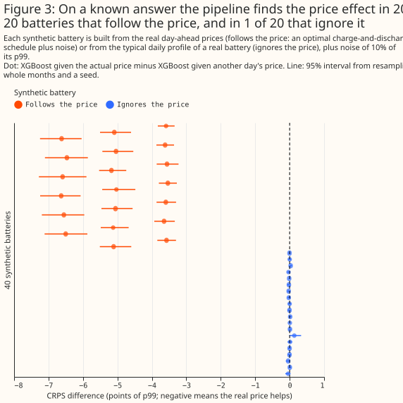

**Amendments after the first science review are post hoc.** The study plan scores every
half-hour. After the review, three readings were added beside it: the fits with each battery's
idle lead-in dropped, the contrasts with the two batteries that have an idle lead-in removed, and
an interval that resamples the lead parties as well as the months. A calendar month is idle when
at least 99% of its present half-hours are exactly zero, and the idle lead-in is the run of idle
months at the start of a battery's series. The published-price rule above was added by the same
review.

## Results

### XGBoost is slightly overconfident

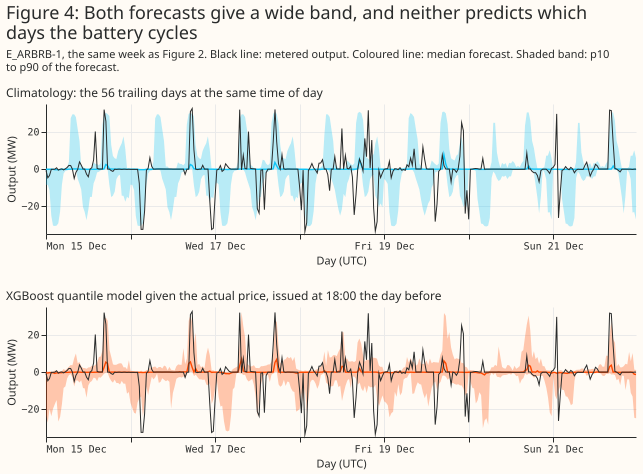

**XGBoost's p10 to p90 band covers 76.5% of outcomes against the nominal 80%, and its p1 to p99 band
covers 96.3% against 98%.** The climatology's p10 to p90 band covers 77.6% and is 6.2 points of p99
wider (48.5 against 42.3). At the lower end, 2.9% of outcomes fall strictly below the climatology's
p1, and another 2.95% equal it, almost all of them exactly zero outputs of the two batteries that
were idle until spring 2026. About half of the climatology's lower-tail miss is therefore ties at
exactly zero. Figure 5 counts a tie as half, and on that count XGBoost is the better calibrated in
the lower tail even though its p10 to p90 band, at 76.5%, is too narrow.

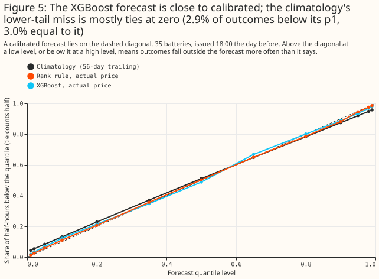

### Without the battery's own FPN, every XGBoost forecast is level with the climatology or worse

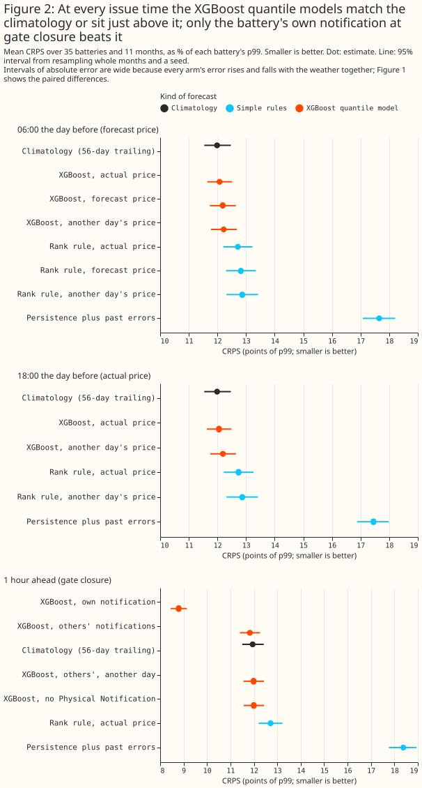

**At 18:00 the day before, XGBoost given the actual price scores 12.05 points of p99 against
11.99 for the climatology.** The rank rule scores 12.74 and persistence 17.45. At 06:00, XGBoost
given the forecast price scores 12.18, which is 0.195 points [+0.080, +0.331] worse than the
climatology (exploratory). One hour ahead, with no FPN, XGBoost scores 12.00 against 11.95 for the
climatology (+0.048 [-0.097, +0.211], exploratory). Only XGBoost given the battery's own FPN beats
the climatology (see "Other lead parties' FPNs help a little").

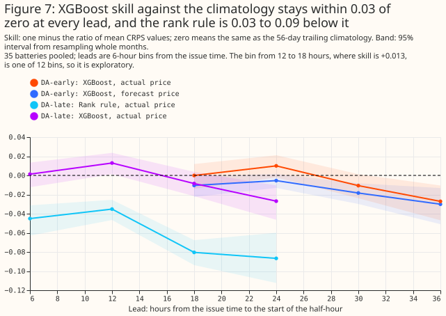

**Across lead times, the XGBoost forecasts' skill stays within about 0.03 of zero.** It is
statistically significant at the 5% level and positive in 1 of 12 six-hour bins, and significant
and negative in 5 (Figure 7; exploratory).

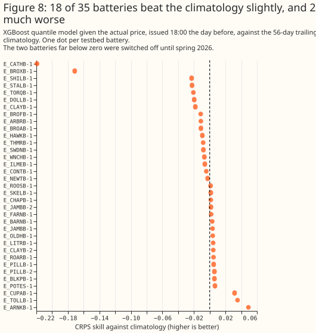

**For individual batteries, 18 of 35 have a positive point estimate of skill at 18:00 the day
before, with a median of +0.001, and two batteries are far below zero.** No per-battery test was
run, so these are point estimates (Figure 8).

### The day-ahead price improves XGBoost a little, not enough to beat the climatology

**The real price beats another day's price by 0.139 points (D2), and the second setting agrees
(-0.136 [-0.170, -0.104]).** The D2 gain is 1.1% of the CRPS of XGBoost given another day's price.
The price from a week earlier recovers almost none of it (-0.012 [-0.029, +0.004], exploratory),
so the gain is the target day's price and not the month's typical shape.

**D1 compares this XGBoost model with a baseline that adapts every day, so D1 does not measure
what public inputs could carry in principle.** D1 is +0.066 points [-0.075, +0.216] at the first
setting and -0.002 [-0.138, +0.153] at the second. The climatology adapts every day. XGBoost is
fitted once per three-month fold, and some of the fold's training months are later than the month
it is tested on.

### A price forecast at 06:00 recovers about a quarter of the actual price's gain

**The price forecast's mean absolute error is £14.92 per MWh against £22.29 for the price a week
earlier (ratio 0.669).** The ratio is below the 0.8 that the study plan set as the mark of a weak
price forecast. The forecast is worse than the week-earlier price in January 2026 (£22.89 against
£17.43) and February 2026 (£12.63 against £11.25).

**Given the forecast price, XGBoost gains 0.035 points over another day's price, about a quarter
of the 0.144 that the actual price gains at 06:00.** D3 is -0.035 points [-0.062, -0.011] (second
setting -0.044), 0.3% of the CRPS of XGBoost given another day's price, and XGBoost given the
forecast price is still 0.195 points worse than the climatology. The perfect price at 06:00 gives
-0.144 [-0.181, -0.108] against another day's price (exploratory).

### Other lead parties' FPNs help a little

**Others' FPNs improve the forecast 1 hour ahead by 0.159 points over another day's FPNs (D4), and
by 0.168 points over no FPN, while the battery's own FPN improves it by 3.205 points over no FPN
(all three exploratory except D4).** The share recovered is the ratio of the last two gains,
0.168 to 3.205: 5.2% [4.1%, 6.2%] with months resampled, and 2.0% to 7.5% with lead parties
resampled too. Leaving out the five batteries whose FPN is exactly zero in at least 80% of
half-hours changes the share to 5.1%. D4's 0.159 is a different comparison, so 0.159 over 3.205
(5.0%) is not the share.

**The D4 gain survives a negative control and the removal of the largest lead party.** XGBoost
given another day's FPNs of the same other lead parties gains 0.009 points over no FPN, far below
D4's 0.159. Leaving out the largest lead party (14 batteries) from the neighbour set gives -0.157
[-0.202, -0.111] (exploratory). FPNs of the same lead party, for the 29 batteries that have another
unit of their own party, give -0.607 points [-0.715, -0.490] (4.8%) against no FPN (exploratory).

**The battery's own FPN is worth far more: a CRPS skill of +0.264 against the climatology, if
Elexon publishes the FPN at gate closure.** The skill is positive for 32 of 35 batteries
(exploratory). A forecaster has the own FPN only if Elexon makes the FPN public at gate closure,
which the study did not verify.

### Two batteries idle until spring do not explain why XGBoost fails to beat the climatology

**Two batteries of one lead party have exactly zero metered output until March or April 2026.**
The data cannot tell switched off from not yet commissioned. Dropping their idle lead-in from
training and scoring leaves D1 at +0.068 points [-0.060, +0.202]. Removing both batteries leaves D1
at +0.007 [-0.094, +0.104] at the first setting and -0.066 [-0.162, +0.030] at the second, still
not statistically significant at the 5% level (post hoc). D2, D3, and D4 move by at most 0.010
points under either reading. Dropping the idle months does not rescue the two batteries: their
skill against the climatology stays near -0.2. With four three-month folds, a battery that starts
in spring has 2 or 3 working months to train on, while the climatology needs 56 days.

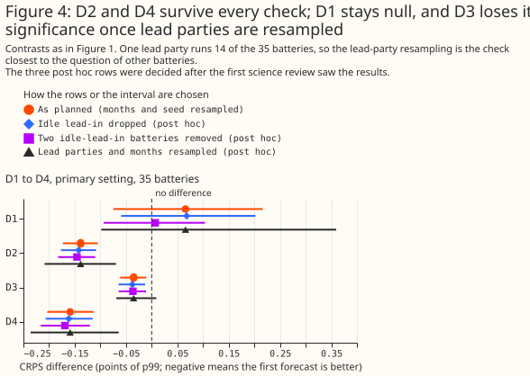

**Resampling the 12 lead parties as well as the months widens every interval.** D2 is [-0.209,
-0.069] and D4 is [-0.236, -0.064], so both stay below zero. D1 is [-0.098, +0.360] and D3 is
[-0.069, +0.009], so D3 crosses zero (post hoc; the intervals rest on 12 lead parties, one of
which runs 14 batteries). The per-party means of D3 have both signs, so the D3 result is specific
to these 35 batteries in this year.

### NGED battery A is also level with the climatology

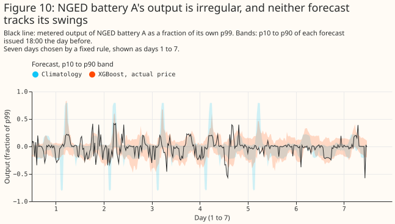

**D5 is +0.079 points [-0.068, +0.228], and the second setting gives +0.017 [-0.104, +0.140].**
An improvement larger than 0.068 points is excluded at the first setting and 0.104 at the second.
With the fleet's FPNs as inputs 1 hour ahead, XGBoost's CRPS is 9.92 against 9.95 for the
climatology, and improves on XGBoost given another day's FPNs by 0.123 points (difference
-0.123 [-0.160, -0.087]; exploratory).

### The registers list 8 embedded storage BMUs against 176 storage rows

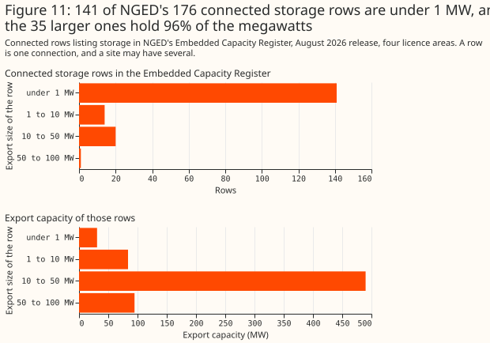

**NGED's Embedded Capacity Register lists 176 connected storage rows of 50 kW or more, 141 of them
under 1 MW, with a total export capacity of 699 MW.** A row is one connection entry in the register.
The BMU register lists 8 embedded storage BMUs in NGED's four grid supply point groups, 4.5% of the
176 rows, and 5 of the 8 have at least 95% of the year's settled output (2.8%). Comparing names and
capacities matched none of the 8 BMUs to a row, and one BMU may stand for several rows or for none,
so the share of rows with an FPN is not known from these registers. It is probably small, because
141 of the 176 rows are under 1 MW. The census finds no storage BMU in NGED's grid supply point
groups that matches NGED battery A by name or capacity, so NGED battery A is very probably not a
BMU. The counts and their method are in [the background page on battery
scheduling](../background/gb-battery-scheduling.md#how-many-batteries-are-connected-in-ngeds-area).

## Discussion: what to use

- **For a day-ahead forecast of the large batteries tested, and of NGED battery A, the
  climatology is the baseline to beat.** The XGBoost forecasts are level with the climatology in
  CRPS, slightly sharper, and better calibrated in the lower tail when ties at exactly zero
  count as half (Figure 5). Below 1 MW the climatology is
  a starting point, not a tested result.
- **For NGED's planning, a forecast that needs the battery's own FPN applies to few batteries.**
  The own FPN lowered the CRPS by 3.2 points 1 hour ahead (27% of the CRPS of XGBoost given no
  FPN), FPNs of the same lead party by 0.6 points (4.8%), and others' FPNs by 0.16 points (1.3%).
- **What would change these answers:** an XGBoost model that adapts as fast as the climatology
  (see Limitations), more than 11 scored months, and an FPN archive.
- **Archiving FPNs as they are filed would allow a test of early FPN versions as a day-ahead
  input.** Elexon's public API keeps only the final version, so this study has no day-ahead FPN
  forecast.

## Limitations

- **The testbed is large batteries.** The 35 BMUs have a median capacity of 49 MW, while the
  median connected storage row in the ECR is 0.19 MW and 141 of 176 rows are below 1 MW. A result
  for the testbed need not hold for small batteries.
- **Part A may not transfer to Part B.** A BMU is dispatched through the Balancing Mechanism,
  which a non-BMU battery is not, and NGED battery A is one battery whose meter may include site
  load.
- **Eleven scored months are the sample.** Every interval rests on 11 months, and one lead party
  runs 14 of 35 batteries.
- **The FPN is assumed public at gate closure.** The API keeps only the final version, and the
  minute at which Elexon publishes it is unverified.
- **XGBoost was not given the climatology's adaptivity.** The XGBoost model sees the climatology
  only through its median and is retrained once per three-month fold, so a battery that changes
  behaviour mid-year handicaps it. An XGBoost model that adapts as fast as the climatology was not
  tested. Dropping the idle lead-in leaves the two idle batteries' skill near -0.2, so the idle
  months do not explain D1.
- **The simple forecasts are crude.** The persistence forecast adds a residual spread to a weakly
  correlated centre, and the rank rule pools residuals across the day. Neither result shows that
  recent output or the price rank carries no information. The 1-hour-ahead XGBoost model with no
  FPN sees one lag of the battery's output, so it says nothing about real-time telemetry.
- **The score ignores the tails beyond p1 and p99.**
- **The census compares two registers.** The registers match none of the 8 BMUs to an ECR row by
  name and capacity. The ECR copy is the August 2026 workbook, and it was not compared with NGED's
  portal version.
- **Fits ran on the CPU** with two hyperparameter settings and three seeds. The deterministic
  forecasts hold no random draw, so the seed term of their intervals is zero.
- **The another-day arms draw from the whole calendar month,** future days included, so they know
  the month's price level in advance, which suits a negative control.

## Scope

The study says nothing about batteries below 1 MW, domestic batteries, the frequency-response
contracts that batteries hold, state of charge, any input that only NGED holds (such as metered
flows at the primary substation), forecasts beyond one day ahead, or any period other than
September 2025 to August 2026 (scored from October 2025).

## Data and code availability

**Inputs.** The N2EX day-ahead prices are NESO open data. Elexon supplies the settled output
(B1610), the FPNs, the BMU register, and the wind forecast that NESO publishes through it. The
Embedded Capacity Register is NGED's workbook, marked shared and not open, so only a holder of the
workbook can rerun the census; this page carries only counts from it. NGED battery A's series is
private, and the page shows it only as a fraction of its own p99, on days numbered 1 to 7. The
code is under `studies/embedded_battery_forecast/` and `packages/studies/`, at the commit of the
pull request that added this page. XGBoost 3.4.1 runs the `reg:quantileerror` objective, and the
hyperparameters are `PRIMARY_HYPER_PARAMETERS` and `SENSITIVITY_HYPER_PARAMETERS` in
`studies.cross_validation`.

## Reproducing the figures

The report that compares the earlier fits, which treated the whole UTC day's prices as public,
reads fits archived from the first run,
which a clean checkout does not hold, so a clean checkout cannot rebuild that comparison table.
Every other step below rebuilds from the inputs.

```bash
export OMP_NUM_THREADS=2
uv run python studies/embedded_battery_forecast/census_report.py
uv run python studies/embedded_battery_forecast/forecast_inputs.py
uv run python studies/embedded_battery_forecast/forecast_synthetic.py primary
uv run python studies/embedded_battery_forecast/forecast_price_model.py
uv run python studies/embedded_battery_forecast/forecast_bmus.py primary
uv run python studies/embedded_battery_forecast/forecast_bmus.py sensitivity
uv run python studies/embedded_battery_forecast/forecast_nged_battery_a.py primary
uv run python studies/embedded_battery_forecast/forecast_nged_battery_a.py sensitivity
FIT_VARIANT=idle_dropped uv run python studies/embedded_battery_forecast/forecast_bmus.py primary
FIT_VARIANT=idle_dropped uv run python studies/embedded_battery_forecast/forecast_bmus.py sensitivity
FIT_VARIANT=idle_dropped uv run python studies/embedded_battery_forecast/forecast_report.py
uv run python studies/embedded_battery_forecast/forecast_report.py
uv run python studies/embedded_battery_forecast/forecast_charts.py
```
