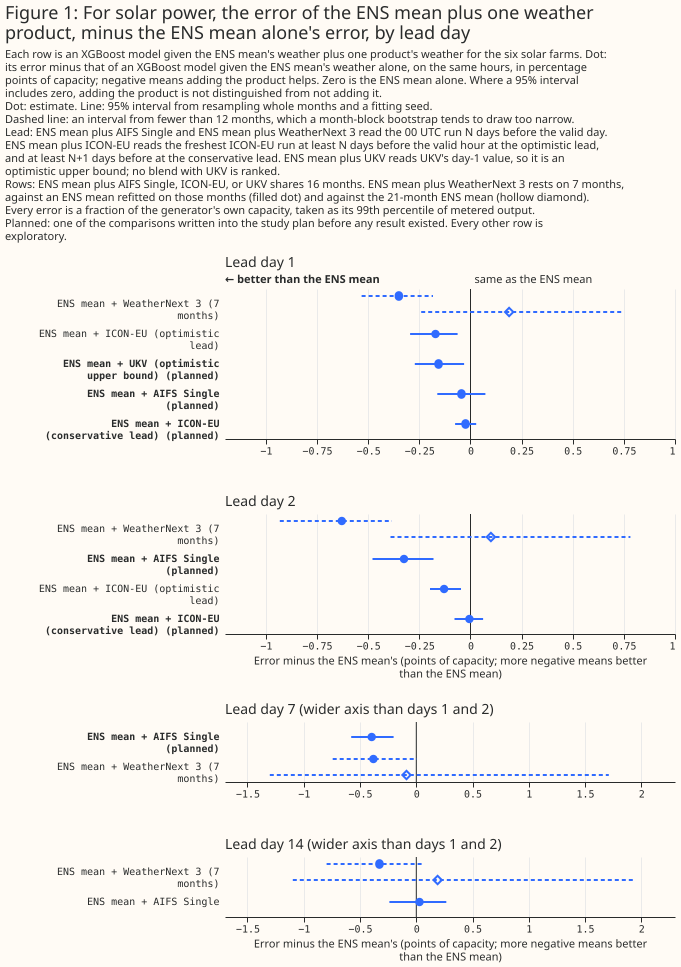
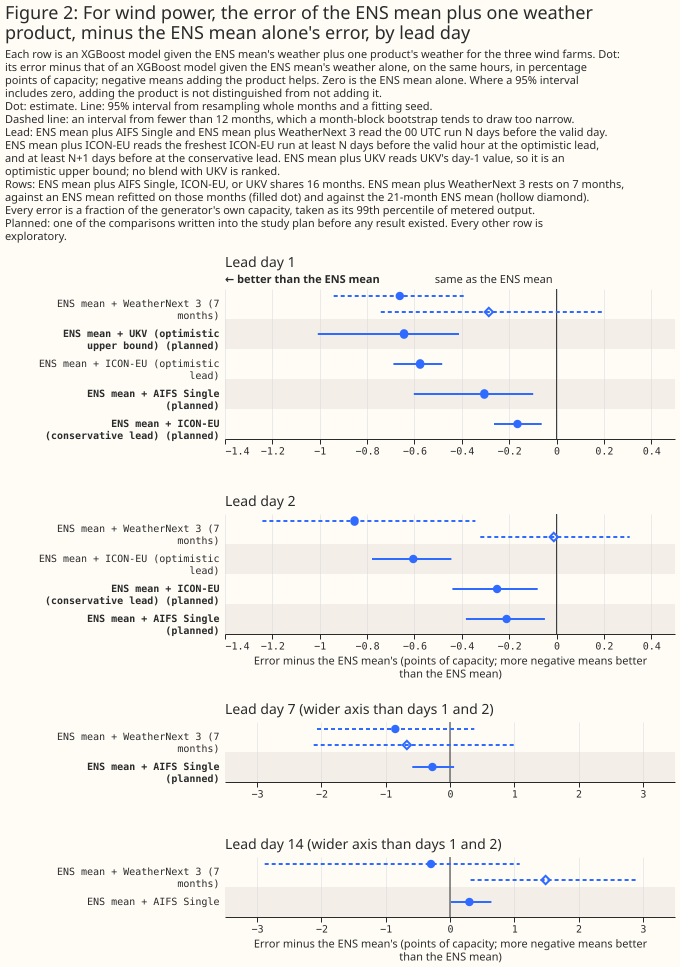

# Which single weather forecast should be added to ECMWF's ensemble mean first?

**At 6 solar farms and 3 wind farms in Lincolnshire, adding one weather forecast to the mean of
ECMWF's ensemble forecast (ENS) lowered the power forecast's error in a few cells, and the page can
name a first product only for solar at day 2.** Each comparison gives an XGBoost model (a
gradient-boosted tree model) the ENS mean's weather plus one product's weather, and scores the
power forecast as a mean absolute error in percentage points of the generator's capacity. A negative
difference means the added product helps. Differences are blend minus the ENS mean alone, with 95%
intervals from resampling whole months and a fitting seed. Every result below is on the 16 months of
the `single` rows, at both hyperparameter settings (primary, then sensitivity in brackets), and is
uncorrected for multiplicity unless the text says otherwise.





> **How this page was made.** The research question came from a human. Everything else — the code
> behind every result, the analysis, the figures, and the text — was written by Claude, Anthropic's
> AI model (for this page, Claude Sonnet 5.5). Several independent Claude reviewers have checked the
> method, the evidence, and the prose adversarially.

## Key findings

- **At wind day 1, adding ICON-EU at the optimistic lead lowers the error by 0.58 points [0.48, 0.69]
  (0.55 at sensitivity), from the ENS mean's 8.20%.** The result survives a Bonferroni correction.
  At the conservative lead the gain is 0.165 [0.063, 0.264] (0.158), which does not survive it
  ([wind results](#wind-icon-eu-and-ukv-lower-the-error-at-day-1-and-the-conservative-lead-gains-less)).
- **At solar day 2, adding AIFS Single lowers the error by 0.33 points [0.18, 0.48] (0.27) from
  10.13%.** The result survives the correction. It beats the optimistic ICON-EU blend by 0.20
  [0.03, 0.37], but at sensitivity that difference's upper bound is -0.000, on the line
  ([solar results](#solar-aifs-single-helps-at-day-2-and-icon-eu-at-the-conservative-lead-shows-no-gain)).
- **At solar, ICON-EU at the conservative lead shows no detectable gain at day 1 or day 2.** A gain
  above 0.08 points is excluded at both days and both settings. The conservative lead is older than
  a live service would read, so this is not evidence that ICON-EU adds nothing.
- **At wind day 1, adding AIFS Single lowers the error by 0.31 points [0.10, 0.60] (0.17 [0.07,
  0.28]).**
- **At wind days 1 and 2, AIFS Single and ICON-EU are not separable,** except that AIFS Single is
  worse than the optimistic ICON-EU blend at day 2 (+0.39 [+0.25, +0.59], +0.29 at sensitivity).
- **UKV at day 1, an optimistic upper bound, lowers the wind error by 0.64 points [0.41, 1.01]
  (0.46).** The solar gain, 0.16 [0.03, 0.27], fails the correction.

## Introduction

**The question is which one weather forecast to add to the ENS mean first.** The [matched-lead
page](matched-lead.md) scores each product alone against ENS and tests one blend of ENS with two
products. AIFS Single is ECMWF's machine-learned forecast, ICON-EU is the German weather service's
regional forecast, and UKV is the Met Office's UK forecast.

**No ICON-EU blend uses the lead a live service would get.** ENS and AIFS Single read the 00 UTC run,
so their day-1 leads run from about 24 to 47 hours. The optimistic ICON-EU blend reads the freshest
run at least N days before the valid hour, fresher than ENS for most hours. The conservative blend
reads one at least N+1 days before, older than ENS for every hour. The two blends therefore bracket
the live value: the optimistic blend is an upper bound on ICON-EU's gain and the conservative blend a
lower bound. A live 09:00 UTC issue would read roughly the 00 or 03 UTC ICON-EU run, about as old as
ENS's. UKV has only a day-1 value, so its blend is an optimistic upper bound and is never ranked.

| Product | Days fitted | Rows |
|---|---|---|
| AIFS Single | 1, 2, 7, 14 | `single`: 16 months |
| ICON-EU, optimistic and conservative lead | 1, 2 | `single` |
| UKV | 1 | `single` |
| WeatherNext 3 (WN3, Google DeepMind's machine-learned forecast) | 1, 2, 7, 14 | `wn3`: 7 months |

## Data and methods

**Each blend is compared with an XGBoost model given the ENS mean alone, and with a control of equal
column count.** The control shuffles the product's columns among hours that share a generator, a
year-month, and an hour of day. The rows, folds, settings, seeds, and GPU device are those of the
saved AIFS Single blends in `nwp_forecast_comparison_aifs_blends`, which this study reuses. The
fitting script refits only the 5 (arm, setting) pairs that folder lacked, and raises unless its build
stamp and every new arm's `(site, time, seed, fold)` keys equal the saved ones.

**Five contrasts were planned before any fit.** C1 is the conservative ICON-EU blend minus ENS at
days 1 and 2. C2 is the AIFS Single blend minus ENS at days 1, 2, and 7. C3 is the UKV blend minus ENS
at day 1. C4 is each blend minus its control. C5 is the AIFS Single blend minus each ICON-EU blend at
days 1 and 2. Every other row is exploratory, including the optimistic ICON-EU blend, WN3, and day 14.

**The ranking rule was fixed before any fit.** A blend lowers the error at a lead only if the blend
minus ENS and the blend minus its control both have an upper bound below zero at both settings. AIFS
Single ranks above ICON-EU only if C5 against the optimistic ICON-EU blend has an upper bound below
zero at both settings, and ICON-EU ranks above AIFS Single only if C5 against the conservative blend
has a lower bound above zero at both settings.

## Results

### Solar: AIFS Single helps at day 2, and ICON-EU at the conservative lead shows no gain

**Adding AIFS Single lowers the solar error at day 2 and day 7 but not at day 1.** The differences are
-0.044 [-0.162, +0.073] at day 1, -0.325 [-0.479, -0.181] at day 2, and -0.396 [-0.578, -0.201] at day
7. At sensitivity they are -0.044 [-0.155, +0.067], -0.265 [-0.384, -0.136], and -0.258 [-0.432,
-0.077]. Only the day-2 result survives the correction at both settings.

**The conservative ICON-EU blend gains nothing detectable.** The differences are -0.024 [-0.075,
+0.028] at day 1 and -0.005 [-0.078, +0.062] at day 2 (+0.001 [-0.048, +0.055] and -0.011 [-0.073,
+0.049] at sensitivity). The optimistic blend gains 0.171 [0.063, 0.295] and 0.129 [0.046, 0.198],
which fail the correction at sensitivity (+0.001, +0.001). The UKV blend gains 0.156 [0.031, 0.272]
(0.139), which fails it.

**AIFS Single beats both ICON-EU blends at day 2, and the gap to the optimistic blend is fragile.**
C5 gives -0.319 [-0.465, -0.175] against the conservative blend and -0.195 [-0.373, -0.029] against
the optimistic one, with sensitivity values -0.255 and -0.136 (upper bound -0.000). At day 1 the
two are not separable.

### Wind: ICON-EU and UKV lower the error at day 1, and the conservative lead gains less

**Adding ICON-EU at the optimistic lead lowers the wind error at both days.** The differences are
-0.576 [-0.689, -0.483] at day 1 and -0.605 [-0.779, -0.444] at day 2 (-0.547 and -0.486 at
sensitivity), and both survive the correction. At the conservative lead they are -0.165 [-0.264,
-0.063] and -0.251 [-0.440, -0.080] (-0.158 and -0.144), and neither survives it.

**Adding AIFS Single lowers the wind error at day 1 and survives the correction.** The differences are
-0.305 [-0.603, -0.099] (-0.167 [-0.278, -0.073]) at day 1 and -0.211 [-0.383, -0.049] at day 2
(-0.200), which fails the correction. At day 7 the differences are -0.274 [-0.586, +0.064] and -0.361
[-0.529, -0.183].

**AIFS Single and ICON-EU are not separable at wind day 1 or day 2, except that AIFS Single is worse
than the optimistic ICON-EU blend at day 2.** C5 against the optimistic blend is +0.270 [-0.050,
+0.484] at day 1 and +0.394 [+0.250, +0.587] at day 2 (+0.380 and +0.286). Against the conservative
blend it is -0.140 [-0.462, +0.097] and +0.040 [-0.176, +0.275].

**The UKV blend lowers the wind error at day 1.** The difference is -0.644 [-1.008, -0.412]
(-0.457 [-0.562, -0.368]), and it survives the correction.

**At wind day 14, adding AIFS Single shows no detectable gain.** The difference is +0.302 [+0.015,
+0.644], and +0.115 [-0.075, +0.336] at sensitivity. The blend is worse than its own control by
+0.379, and AIFS Single alone is worse than its shuffled copy by +0.569 [+0.071, +1.080]. These are
signs of an input with no skill at that lead and of overfitting, not of harm from the blend.

### WeatherNext 3: the 7-month rows give no safe gain

**The WN3 blend's gains against the same-row ENS mean are not gains against the 21-month ENS mean.**
An XGBoost model given the ENS mean alone and fitted on the 7 WN3 months scores worse than the
21-month ENS mean by +0.539 [+0.085, +1.194] at solar day 1, +0.729 [+0.042, +1.654] at solar day 2,
+0.377 [+0.144, +0.626] at wind day 1, and +0.841 [+0.561, +1.054] at wind day 2. Against the
21-month ENS mean, the WN3 blend differs by +0.189 [-0.241, +0.744] and +0.100 [-0.391, +0.782] at
solar days 1 and 2, by -0.286 [-0.742, +0.196] and -0.012 [-0.322, +0.309] at wind days 1 and 2, and
by +1.487 [+0.320, +2.897] at wind day 14. The page therefore draws no ranking from WN3.

### Multiplicity and the controls

**About 2 of the 40 listed intervals would reach the 5% level by chance.** The correction divides the
5% level across all 40 intervals and widens only the blend-minus-ENS intervals, which is
conservative. The wind day-1 conservative ICON-EU upper bound becomes +0.010, and the solar UKV,
solar AIFS Single day-7 (+0.031 at sensitivity), and solar optimistic ICON-EU day-2 (+0.007) bounds
also stay above zero.

**The controls are a weak guard.** Controls are significantly worse than the ENS mean in 14 of 32
(blend, setting) cells, 9 of them solar, so the blend-minus-control test passes more easily than the
blend-minus-ENS test, which decides. At wind day 2 with the primary setting, both ICON-EU controls
beat the ENS mean alone (-0.118 [-0.253, -0.015] and -0.158 [-0.296, -0.056]), so the primary fit of
ENS alone looks weak there.

## Discussion: what to use

**Only solar day 2 has a first choice, AIFS Single, and it is fragile.** Everywhere else the
rule finds the two products not separable. For wind day 1, add ICON-EU or AIFS Single, and expect
less from ICON-EU than its optimistic gain, because a live service would read a run about as old as
ENS's. A conservative lead of at least N+1 days measures a lower bound, so no solar conclusion about
ICON-EU should be drawn from it. What would change this: ICON-EU fitted at the lead a 09:00 UTC
service would read, and more months of data.

## Limitations

**The results rest on one region, 16 months, and a lead that no live service reads.** The sample is
weather episodes, not generator-hours, and the intervals resample months. Every figure uses the
effective-capacity table built for the matched-lead study. The WN3 months overlap WN3's training data.

## Scope

**This study does not cover blends of two products, UKV from the CEDA archive, days 3 and 5, or
probabilistic scores.**

## Data and code availability

**The inputs and fitted losses are in the private data store, and every output carries only the
anonymised `site` label.** The code is `studies/nwp_forecast_comparison/fit_product_blends.py` and
`dot_interval_vs_ens.py --blends`, with `fit_aifs.py` and `packages/studies/`. XGBoost 3.4.1 fitted
every model on one RTX A6000 GPU.

## Reproducing the figures

```bash
D=/home/jack/dev/nged-substation-forecast/data/studies
uv run python studies/nwp_forecast_comparison/fit_product_blends.py --lookahead-cleared \
  --workers 2 --published-dir $D/nwp_forecast_comparison \
  --output-dir $D/nwp_forecast_comparison_product_blends
uv run python studies/nwp_forecast_comparison/fit_product_blends.py \
  --published-dir $D/nwp_forecast_comparison \
  --output-dir $D/nwp_forecast_comparison_product_blends \
  --report-dir $D/nwp_forecast_comparison_product_blends_report
uv run python studies/nwp_forecast_comparison/dot_interval_vs_ens.py --blends \
  --output-dir $D/nwp_forecast_comparison_vs_ens_dots_blends_final
```
