# Elexon's INDDEM and INDGEN reach 15 to 42 hours ahead, and no published table maps their zones to the GSP groups of NGED's licence areas

**This study describes two Elexon series, INDDEM and INDGEN, beside the settled energy that each of
Great Britain's 14 Grid Supply Point (GSP) groups takes from the transmission system.** INDDEM and
INDGEN sum the Physical Notifications (PNs) that Balancing Mechanism Units (BMUs) submit. A PN is the
level of generation or demand that a BMU's operator says it plans to deliver. INDDEM sums the PNs of
the BMUs that plan to import, and INDGEN sums the PNs of the BMUs that plan to export. Elexon
publishes both for the whole of Great Britain and for 17 overlapping regions, called boundaries. The
study downloads 13 months of each series, and looks at whether the series carry a regional signal
that could help a forecast of NGED's four licence areas. It makes no forecast, runs no significance
test, and says nothing about whether either series improves a forecast.

- **Do INDDEM and INDGEN reach far enough ahead to help a forecast of the next 14 days?** Only the
  first 15 to 42 hours.
    - An INDDEM or INDGEN issue reaches 15 to 42 hours ahead of its publication time, depending on
      the hour of publication ([Reach](#how-far-ahead-an-issue-reaches)).
    - Elexon publishes an issue in 47 of the 48 half-hour slots of a UTC day, and on 16 of 396 days
      some of those issues are missing ([Reach](#how-far-ahead-an-issue-reaches)).
- **Can the regional series be recovered from the boundaries Elexon publishes?** Yes, if the 2012
  circular's table still holds.
    - The 17 boundaries are sums of 17 non-overlapping study zones, defined in an Elexon circular of
      2012. The recovered zones have the expected sign in all but 26 of 644,640 zone half-hours
      ([Recovering the zones](#recovering-the-zones)).
    - A fit of each zone's INDDEM on the PNs places each of 10 interconnectors in the region where it
      lands ([Mapping](#the-gsp-groups-do-not-map-cleanly-onto-the-zones)).
- **Does the sum of the sampled PNs reproduce INDDEM and INDGEN?** INDDEM yes, once the BMUs of each
  interconnector are netted, and INDGEN nearly.
    - The sum reproduces INDDEM's national total to within 5 MW in 125 of 192 sampled half-hours, and
      to within 275 MW in all
      ([Summing the PNs](#summing-the-pns-reproduces-inddem-once-interconnectors-are-netted)).
    - INDGEN stays a median of 17 MW below the sum, by up to 375 MW, and the study did not find why
      ([Summing the PNs](#summing-the-pns-reproduces-inddem-once-interconnectors-are-netted)).
- **Do the GSP groups line up with the zones?** Not in a way the study could show.
    - A fit puts `_C` (London), `_M`, and `_N` in the same zone in all five fits, and does not settle
      the other groups ([Mapping](#the-gsp-groups-do-not-map-cleanly-onto-the-zones)).
    - With the shared daily, weekly, and seasonal cycles and the national anomaly removed, the
      highest correlation between a GSP group's settled take and a zone's INDDEM is 0.58, for
      southern Scotland, and the highest for an NGED group is 0.32
      ([Correlations](#correlations-between-the-gsp-groups-and-the-zones)).
- **Does a zone's INDDEM match the demand of an NGED licence area?** Not in level.
    - The zone with the highest correlation for each NGED group has 0.5 to 1.9 times the group's mean
      settled take
      ([NGED's four groups](#ngeds-four-gsp-groups-against-their-best-correlated-zones)).
    - INDDEM is 69% of the national demand outturn, because suppliers' demand PNs hold only part of
      demand ([The unit of AGV](#the-unit-of-agv)).
    - PV_Live's estimate of solar generation in the four NGED licence areas equals 9% to 26% of the
      settled take of the group
      ([Embedded solar](#embedded-solar-equals-9-to-26-of-the-settled-take-of-ngeds-groups)).
- **What the data and methods can support.** The page describes 13 months of public data, 4 sampled
  days of PNs, and one description of each series. It can support a choice of what to look at next.
  It cannot support a claim that either series helps or fails to help a forecast.

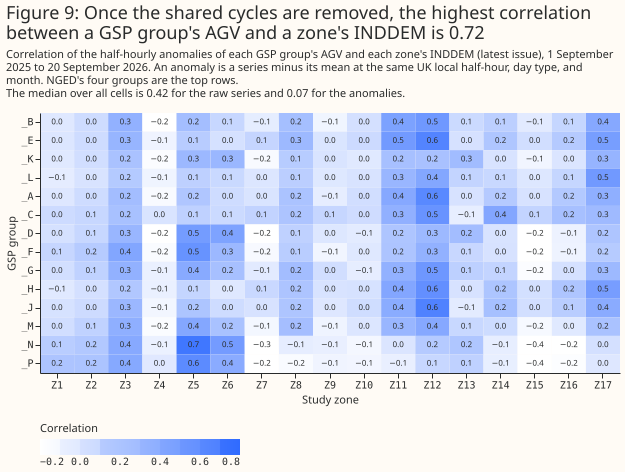

- **To forecast NGED's licence areas, treat INDDEM and INDGEN as at most a 42-hour-ahead national
  and regional signal that no published table maps to NGED's licence areas.** The 2012 circular
  defines the zones, and no source the study found maps them to GSP groups
  ([Discussion](#discussion-what-to-use)).
- **To describe regional demand, start from the settled take of the GSP groups (AGV) and not
  INDDEM.** The download of 9 October 2026 holds AGV for 385 settlement dates, and a zone's INDDEM
  does not match a group's level ([Discussion](#discussion-what-to-use)).

> **How this page was made.** The research question came from a human. Everything else — the code
> behind every result, the analysis, the figures, and the text — was written by Claude, Anthropic's
> AI model (for this page, Claude Sonnet 5.5). Several independent Claude reviewers have checked the
> method, the evidence, and the prose adversarially.

## Key findings

- **An AGV value, doubled, is 93% of the national demand outturn, so AGV is in megawatt-hours per
  half-hour** ([The unit of AGV](#the-unit-of-agv)).
- **The 00:00 UTC issue differs from the latest issue by a mean absolute 543 MW for INDDEM and
  1,188 MW for INDGEN, and most of the difference arises at 23:00 UK local time in both
  seasons** ([The 00:00 UTC issue and the latest issue](#the-0000-utc-issue-and-the-latest-issue)).
- **The two series differ in size and in the shape of their day across the 17 zones**
  ([What the series look like](#what-the-series-look-like)).
- **A fit on four sample days puts each of 10 interconnectors in one zone, and four of them in the
  same zone, Z15** ([Mapping](#the-gsp-groups-do-not-map-cleanly-onto-the-zones)).
- **The settled take of the South West group is negative in 362 of 18,478 half-hours, which means
  the group exported to the transmission system**
  ([Embedded solar](#embedded-solar-equals-9-to-26-of-the-settled-take-of-ngeds-groups)).

## Introduction

**INDDEM and INDGEN are published for each half-hour as a sequence of issues.** Each issue holds
the half-hours from its publication time to 05:00 UK local time the next morning, or, for issues
published from about 11:47 local time, to 05:00 the morning after. Elexon publishes an issue every
30 minutes, and the Elexon Insights API serves the issues without a key. Each half-hour therefore
has many vintages, one from each issue that covers it. A forecast that used the series would have to
use the issue published before the forecast, so each result below says which issue it takes.

**A boundary is one of 17 regions that the Seven Year Statement of the National Electricity
Transmission System defines by transmission constraints, and a study zone is one of 17
non-overlapping regions that make up the boundaries.** [Elexon CVA Change Circular 235
(2012)](https://assets.elexon.co.uk/wp-content/uploads/2012/04/28170121/CVA_CC235.pdf), Appendix 1,
lists which zones make up each boundary. Boundary `N` is the national total. The circular also
gives the formulas that recover each zone from the boundaries, for example zone Z17 equals boundary
B13 (South West), and zone Z11 equals boundary B17 (West Midlands). The zones follow the
transmission network, so a zone need not coincide with a distribution licence area.

**A GSP group is one of 14 regions that settlement uses, and each has a letter from `_A` to `_P`.**
NGED's four licence areas are the groups `_B` (East Midlands), `_E` (West Midlands), `_K` (South
Wales), and `_L` (South West). AGV is Elexon's Aggregated GSP Group Take Volume (data flow
CDCA-I029). AGV gives the energy each group takes from the transmission system in each half-hour, as
settled. Generation embedded in a group's distribution network reduces the group's take, so AGV is
net of embedded generation and is not gross demand.

| Series | What it is | Geography | Time coverage used | Source |
|---|---|---|---|---|
| INDDEM | Sum of the PNs submitted by the BMUs that plan to import, MW, negative | National total and 17 boundaries | Issues published 31 August 2025 to 30 September 2026 | [Elexon Insights API](https://data.elexon.co.uk/bmrs/api/v1/datasets/INDDEM) |
| INDGEN | Sum of the PNs submitted by the BMUs that plan to export, MW | The same | The same | [Elexon Insights API](https://data.elexon.co.uk/bmrs/api/v1/datasets/INDGEN) |
| AGV | Settled energy a GSP group takes from the transmission system, MWh per half-hour | 14 GSP groups | Settlement dates 1 September 2025 to 20 September 2026, `SF` settlement run | [Elexon Open Settlement Data](https://elexon.co.uk/data/open-settlement-data) |
| PV_Live | Estimated solar generation, MW | NGED's four distribution licence areas | 1 September 2025 to 30 September 2026 | [Sheffield Solar PV_Live](https://www.solar.sheffield.ac.uk/pvlive/) |
| Sampled PNs | Final PNs of every BMU, as MW segments | About 2,500 BMUs | Four Wednesdays, 192 half-hours | Elexon Insights API, dataset `PN` |

## Data and methods

**All numbers on this page are exploratory.** The study names no planned contrasts, because it
tests no hypothesis, and it runs no significance test, so no interval claims significance. A
correlation describes 18,000 half-hours of one year. It does not say how the correlation would
differ in another year.

**The study keeps two views of each target half-hour.** The latest view takes the latest issue
published at or before the half-hour starts. The 00:00 UTC view takes the latest issue published at
or before 00:00 UTC on the target's UTC day, which is the 23:47 UTC issue of the day before. Both
views are lookups as of a cut-off, so neither uses a value published after its cut-off. Unless a
figure says otherwise, a figure uses the latest view.

**The study recovers the zones by least squares on the circular's table.** Zone Z12 belongs to no
boundary and appears only in the national total, so the 17 boundaries alone cannot recover it.
The study therefore solves the 18 equations (the national total and 17 boundaries) for the 17
zones. The system has one equation more than unknowns, so a second identity checks the table:
B16 minus B11 must equal B9 minus B17 minus B8, because both sides equal zone Z10.

**AGV is the `SF` settlement run, converted to megawatts.** Elexon publishes seven settlement runs
(II, SF, R1, R2, R3, RF, DF), and a settlement period has one row for every run published so far.
Taking the `SF` run, Elexon's initial settlement run, puts the whole window on one vintage. The run
appears about 20 days after the settlement date, so the download of 9 October 2026 holds `SF` rows
up to 20 September 2026. Each AGV volume is in megawatt-hours, so multiplying by 2 gives the mean
megawatts of the half-hour. An import row is positive and an export row is negative.

**An anomaly of a series is the series minus its mean at the same UK local half-hour, the same day
type (weekday or weekend), and the same month.** Every demand series shares the daily, weekly, and
seasonal cycles, so correlations of the raw series sit high between any two. Even the anomalies
share a national component, which is mostly weather, so the study also removes from each series the
multiple of the national anomaly that a least-squares fit gives. The national anomaly of AGV is the
sum of the 14 groups' anomalies, and the national anomaly of INDDEM is the sum of the 17 zones'.

**The sum of the sampled PNs is a time-weighted mean of each BMU's notified level, with each
interconnector netted.** The PN of a BMU is a sequence of segments that tile the settlement period,
and the level changes linearly between the two ends of a segment. The study averages each segment's
two end levels, weights by the segment's duration, and sums over the BMUs of one unit. A unit is
one BMU, or all the BMUs of one interconnector, which trade in both directions in one half-hour.
The study then sums the negative units as imports and the positive units as exports. Each BMU
belongs to one GSP group in Elexon's BMU register, if the register gives one.

**The study fits the zones' shares by non-negative least squares.** The fit models each zone's INDDEM
as the sum, over columns, of the column's summed import PNs times a share. The columns are the 14 GSP
groups, 10 interconnectors, and `none`, the BMUs that the register gives no GSP group. The shares
of one column sum to 1 over the 17 zones. The fit uses the half-hours in which the sampled PNs
reproduce INDDEM's national total to within 5 MW, and the study repeats it leaving out each sample
day in turn.

## Results

### The unit of AGV

**AGV, doubled, is 93% of the national demand outturn, with a correlation of 0.996 over 18,480
half-hours, so AGV is in megawatt-hours per half-hour.** The national demand outturn (INDO) is
Elexon's initial estimate of national demand. The ratio has a 1st to 99th percentile range of 0.87
to 0.96, and its median by UTC hour of day stays between 0.92 and 0.93. INDO is also net of
embedded generation, so the study does not attribute the 7% gap to embedded generation. The cause,
which may be transmission losses or demand connected directly to the transmission system, is not
identified.

**National INDDEM is a median 69% of INDO, with a correlation of 0.78 over 18,958 half-hours.**
Supplier base BMUs hold 83% of the sampled import PNs, and the study did not check how much of
demand they leave out. INDDEM is therefore a part of national demand, and a comparison of a zone's
INDDEM with a group's AGV is a comparison of different quantities.

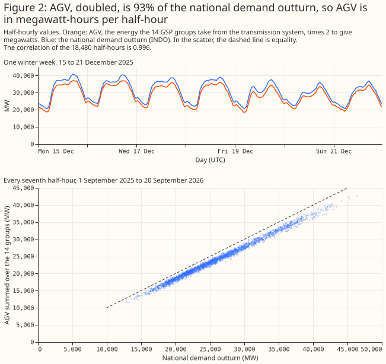

### Recovering the zones

**The zones recovered from the boundaries have the expected sign in all but 26 of 644,640 zone
half-hours.** Both series are whole megawatts, so the study allows 1 MW of rounding. The 26
exceptions are 9 half-hours of INDDEM and 17 of INDGEN, all in zone Z10. The second identity, B16
minus B11 equals B9 minus B17 minus B8, holds to within 2 MW in every half-hour. The two checks
test only part of the circular's table, because the system has one equation more than unknowns. The
interconnector fit in [the mapping section](#the-gsp-groups-do-not-map-cleanly-onto-the-zones)
tests the table further.

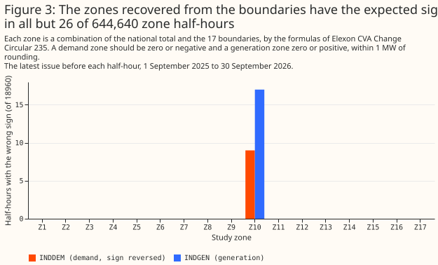

### What the series look like

**National INDDEM averages 18.1 GW and INDGEN 29.4 GW over the 13 months, and both follow the daily
cycle.** Both are highest in winter. The monthly mean of INDDEM peaks at 21.5 GW in January 2026
and is lowest at 15.4 GW in May 2026, and the monthly mean of INDGEN peaks at 36.1 GW in January
2026 and is lowest at 24.5 GW in July 2026. INDGEN exceeds INDDEM by 11.3 GW on average. INDDEM
leaves out part of demand, as the previous section shows, and the study did not find the rest of
the difference.

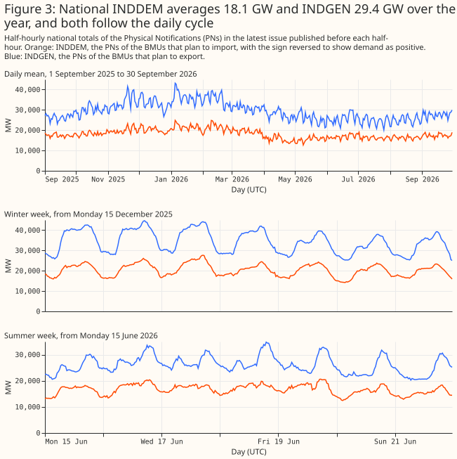

**The 17 zones differ in size and in the shape of their day.** Zone Z12 holds the most INDDEM, 5.3
GW on average, and no boundary equals it. INDDEM exceeds INDGEN in five zones (Z5, Z11, Z12, Z14,
and Z17) and falls short of it in the other 12. Zone Z17, the South West boundary B13, holds 555 MW
of INDDEM and 501 MW of INDGEN on average.

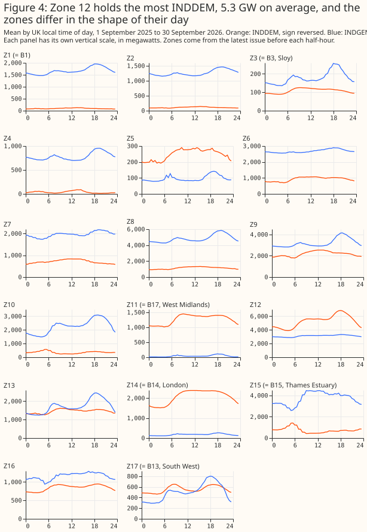

### How far ahead an issue reaches

**An INDDEM issue reaches 15 to 42 hours ahead, far short of the 14 days of the forecast
horizon.** The reach of an issue is the time from publication to the end of the last half-hour in
the issue. Every issue ends at 05:00 UK local time. An issue published at 00:00 UK local time
reaches a median 28 hours, and the reach falls by about one hour for each hour of publication to 19
hours at 10:00 local time. The long issue appears at about 12:00 UK local time and reaches a median
40 hours, and the reach then falls again. A UTC day has 47 half-hour slots with an issue, because
Elexon publishes none in the half-hour that starts at 08:30 UK local time. On 16 of the 396 UTC
days some issues are missing, and the lowest count is 42 slots.

**One issue holds only half-hours that are already past.** The issue published at 08:31 UTC on 3
November 2025, in the half-hour that otherwise never has an issue, holds 61 half-hours that end 3.5
hours before its publication. Neither view takes it, because a view takes only an issue that covers
the target half-hour.

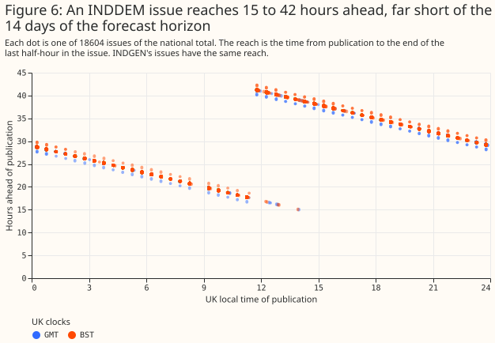

### The 00:00 UTC issue and the latest issue

**The 00:00 UTC issue differs from the latest issue by a mean absolute 543 MW (INDDEM) and 1,188 MW
(INDGEN), and most of the difference arises from 23:00 UK local time in both seasons.** The mean
absolute difference is 3% of INDDEM's mean and 4% of INDGEN's. From 23:00 local time to midnight
the 00:00 UTC issue is 2.4 to 2.6 GW less negative than the latest issue for INDDEM and 5.0 to 5.7
GW lower for INDGEN under GMT. Under BST the step covers 23:00 to 01:00 local time, with 2.3 to 2.4
GW for INDDEM and 6.0 to 7.1 GW for INDGEN. Outside 22:00 to 02:00 local time, the mean absolute
difference is 428 MW for INDDEM and 856 MW for INDGEN. 23:00 UK local time is the start of the next
GB trading day, and the study did not test whether that explains the step.

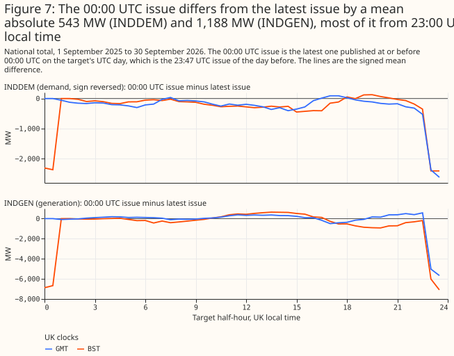

### Summing the PNs reproduces INDDEM once interconnectors are netted

**The sampled PNs reproduce INDDEM's national total to within 5 MW in 125 of 192 half-hours, and to
within 275 MW in all, once the BMUs of each interconnector are netted.** An interconnector has
dozens of trading BMUs, and some import while others export in the same half-hour, so a sum that
splits the BMUs one at a time by sign counts both directions. Netting each interconnector first
brings the median gap between INDDEM and the sum of import PNs to 0.05 MW. The 125 half-hours are
41, 26, 24, and 34 on the four days. INDGEN sits a median of 17 MW below the sum of export PNs, and
the gap reaches 375 MW. The study did not find what INDGEN leaves out. The sampled PNs are the PNs
that Elexon serves now, which are the final PNs, and an issue published before gate closure holds
earlier PNs.

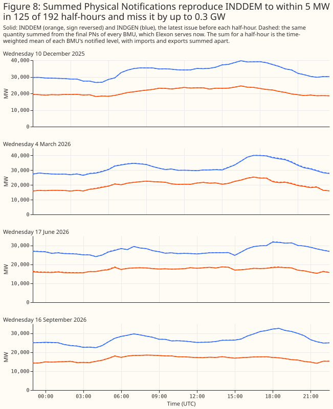

### The GSP groups do not map cleanly onto the zones

**A fit of INDDEM on the netted PNs places each of 10 interconnectors in one zone, and four of them
in Z15.** The zones are the regions where the interconnectors are known to land, as their operators
describe: BritNed, ElecLink, IFA (`FRANCE`), and NEMO Link in Z15 (the Thames Estuary, Kent); IFA2
in Z16 (the south coast); EWIC in Z9 (North Wales); Greenlink in Z13 (Pembrokeshire); Moyle in Z6
(Ayrshire); the North Sea Link in Z7 (Northumberland); and Viking Link in Z10 (Lincolnshire). The
study did not check the landing points against a table. Five interconnectors stay in the same zone
in all five fits, with and without each sample day, and the other five stay in four of the five.
The result tests the circular's table in a second way, and gives a known answer for the method.

**The same fit does not settle the GSP groups.** `_C` (London) goes to Z14 (the London boundary),
`_M` to Z8, and `_N` to Z6 in all five fits, and `_P` changes zone in three of five. The fit puts
`_L` (South West) in Z12 in all five fits and `_D` (Merseyside and North Wales) in Z12 in four, and
the circular's table does not say where Z12 lies, so the study cannot tell whether that is right.
Zone Z11, which equals the West Midlands boundary, takes `_E` with a fitted share of 0.32. The fit
has 125 half-hours of four days, 25 columns, and 17 zones.

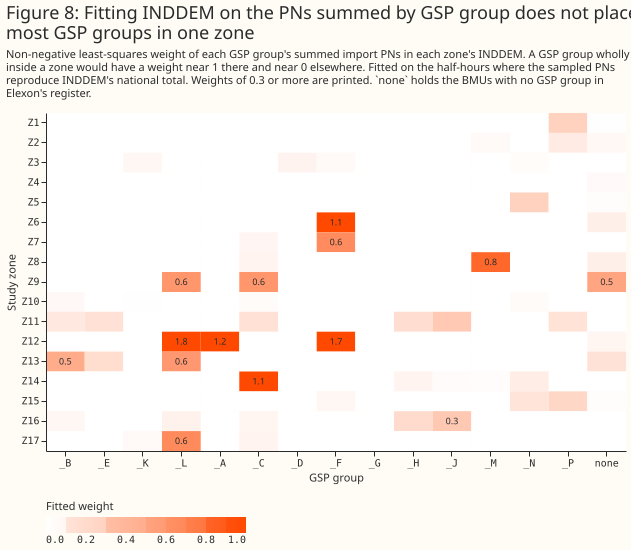

### Correlations between the GSP groups and the zones

**With the shared daily, weekly, and seasonal cycles and the national anomaly removed, the highest
correlation between a GSP group's AGV and a zone's INDDEM is 0.58, and the median over all 238
pairs is −0.01.** The pair with the highest correlation is `_N` (southern Scotland) with Z5. For
NGED's groups the highest correlation is 0.22 for `_B` (East Midlands) with Z11, 0.18 for `_E`
(West Midlands) with Z11, 0.26 for `_K` (South Wales) with Z13, and 0.32 for `_L` (South West)
with Z17. Z11 is the West Midlands boundary, and Z17 is the South West boundary, so two of the four
NGED groups have their highest correlation with the zone of the same name. Before the national
anomaly is removed, the highest correlation is 0.72, and the zone that wins for `_B`, `_E`, and
`_C` is Z12, the largest zone. The median of the raw correlations over the 238 pairs is 0.42, and
the median after removing the cycles is 0.07. Between two GSP groups' AGV, the median over the 91
pairs is 0.76 for the raw series, 0.77 after subtracting a mean daily profile, and 0.47 after
removing the cycles. Figure 1, at the top of the page, shows every pair.

### NGED's four GSP groups against their best-correlated zones

**The zone with the highest correlation for an NGED group has 0.5 to 1.9 times the group's mean
AGV.** The best-correlated zone for the East Midlands (`_B`) and West Midlands (`_E`) is Z11, with
a mean INDDEM of 1,270 MW, against a mean AGV of 2,111 MW and 2,213 MW. The best zone for South
Wales (`_K`) is Z13, with 1,457 MW against 758 MW. The best zone for the South West (`_L`) is Z17,
with 556 MW against 1,039 MW. The levels differ in both directions, and the correlations are low,
so the page does not scale either series.

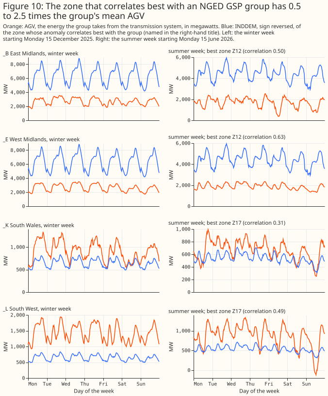

### Embedded solar equals 9% to 26% of the settled take of NGED's groups

**PV_Live's estimate of the solar generation in each NGED licence area equals 9% to 26% of the
group's settled take over the 385 days.** The ratio is 9% for the West Midlands (`_E`), 17% for the
East Midlands (`_B`), 18% for South Wales (`_K`), and 26% for the South West (`_L`). As a share of
AGV plus solar, the figures are 8%, 15%, 15%, and 21%. On midsummer days AGV falls while solar
rises, and the South West's AGV is negative in 362 of 18,478 half-hours, which means the group
exported to the transmission system. After the shift from end labels to start labels, the mean
profile of the South West's solar generation in June and July centres on 12:15 UTC, the middle of
the half-hour that starts at 12:00 UTC, which is close to solar noon at 3.5° W. AGV plus solar is
not gross demand, because other embedded generation is still netted out.

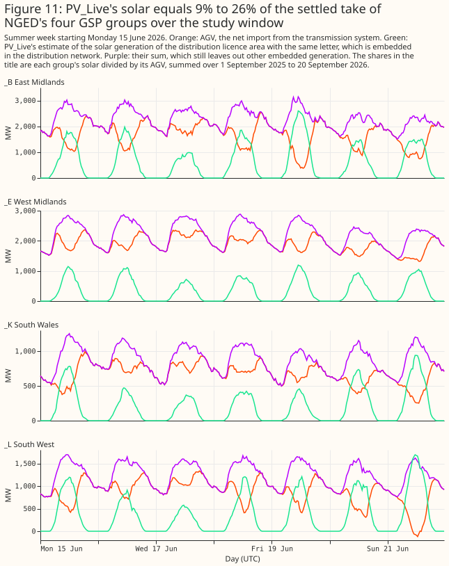

## Discussion: what to use

**To forecast NGED's licence areas, INDDEM and INDGEN are not a drop-in regional input.** The
series reach at most 42 hours, so they can inform at best the first two days of a 14-day forecast.
No source the study found maps the 17 zones to GSP groups or to NGED's supply points, and the fit
here leaves most GSP groups unplaced. The sum of the PNs does reproduce INDDEM once interconnectors
are netted, so a user could rebuild a zone's INDDEM from the PNs if each BMU's zone were known. A
study that wants to test the series needs that mapping first.

**To describe the demand of a GSP group, AGV is the series to start from, and it is not available
live.** AGV is settled, so the `SF` run arrives about 20 days after the settlement date. AGV is net
of embedded generation, and PV_Live's solar estimate turns AGV towards gross demand for the four
licence areas that the study downloaded. A user who needs a live signal would need a different
source.

**What would change these recommendations.** A published mapping from zones to supply points, an
explanation of INDGEN's gap of up to 375 MW from the sum of export PNs, or a longer history of
regional PNs would each change what to try next. The study does not recommend running any
forecasting experiment, and leaves that choice to the issue tracker.

## Limitations

- **The window is 13 months of one period, and one year is not a sample of years.** Every
  correlation and mean describes that period.
- **The PN sample is four Wednesdays.** The fit of the zones' shares uses 125 half-hours, and the
  results may differ on other days. The fit also uses only the half-hours that reproduce INDDEM.
- **AGV uses the `SF` run only.** A later run would revise the values, and the study did not
  measure how much. AGV's Estimate Indicator is `T` on 88% of rows, and Elexon's files do not say
  what it means.
- **The unit of AGV is established by a ratio to INDO.** Elexon does not state the unit in the
  files, and the 7% gap between AGV and INDO is unexplained.
- **The interconnectors' landing zones are the operators' public descriptions.** The study did not
  check them against a table.
- **PV_Live estimates and revises.** The study records each estimate's update time and does not
  correct for revisions, and it did not check what solar PV_Live leaves out.
- **A correlation of anomalies depends on how the anomaly is defined.** The definition removes a
  mean at the half-hour, day type, and month, and another definition would give other values. The
  month key pools September 2025 with September 2026.
- **The page corrects for no multiple comparisons.** It reports every group-and-zone correlation,
  and no significance test applies.

## Scope

The page says nothing about whether INDDEM or INDGEN improves a forecast of NGED's substations. It
does not cover the Insights API's other boundary datasets, the settlement runs other than `SF`,
GSP-level data finer than the 14 groups, the legacy BMRS archive, or any year before September
2025. It reads no NGED telemetry, so it names no NGED generator and shows no time series of one.

## Data and code availability

All inputs are public. INDDEM, INDGEN, the PNs, and the national demand outturn come from the
Elexon Insights API, which Elexon publishes under its [licence to use BMRS
data](https://www.elexon.co.uk/data/balancing-mechanism-reporting-agent/copyright-licence-bmrs-data/).
Contains BMRS data © Elexon Limited copyright and database right 2026. AGV comes from Elexon's
Open Settlement Data, which Elexon [announced as open
data](https://www.elexon.co.uk/bsc/article/making-electricity-market-data-more-openly-available-2/).
PV_Live comes from [Sheffield Solar](https://www.solar.sheffield.ac.uk/pvlive/). The downloads are in
[`studies/market_downloads/`](https://github.com/openclimatefix/nged-substation-forecast/tree/main/studies/market_downloads),
and the analysis is in
[`studies/indgen_inddem/`](https://github.com/openclimatefix/nged-substation-forecast/tree/main/studies/indgen_inddem).
The tests of the download scripts are in `packages/studies/tests/`.

## Reproducing the figures

```bash
uv run python studies/market_downloads/fetch_system_series.py --sources elexon_inddem elexon_indgen --start 2025-08-31
uv run python studies/market_downloads/fetch_agv.py
uv run python studies/market_downloads/fetch_pv_live.py
uv run python studies/market_downloads/fetch_pn_all_bmus_sample.py
uv run python studies/market_downloads/fetch_system_series.py --sources elexon_demand_outturn
uv run python studies/indgen_inddem/build_tables.py
uv run python studies/indgen_inddem/make_charts.py
```

`build_tables.py` writes `report.md` to `data/studies/per_study/indgen_inddem/`. `report.md` holds
every number on this page, or the numbers from which a derived number is computed.
