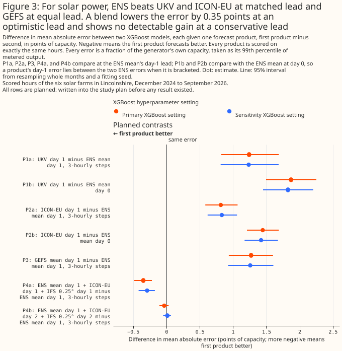
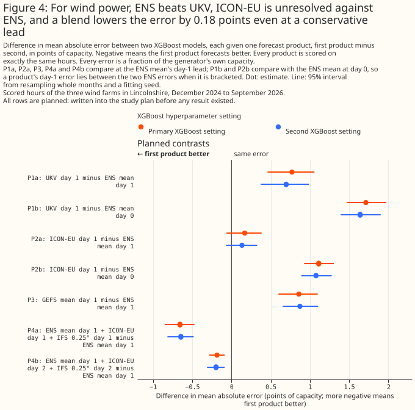
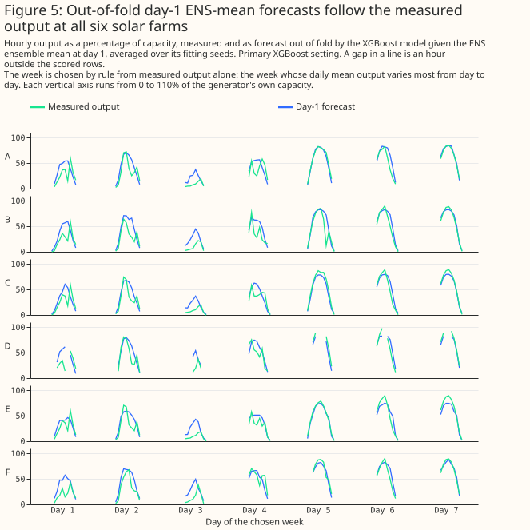
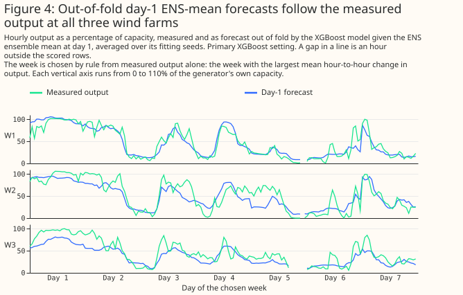
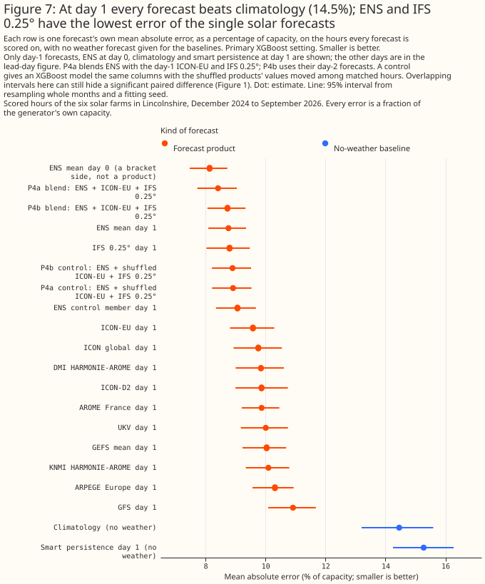
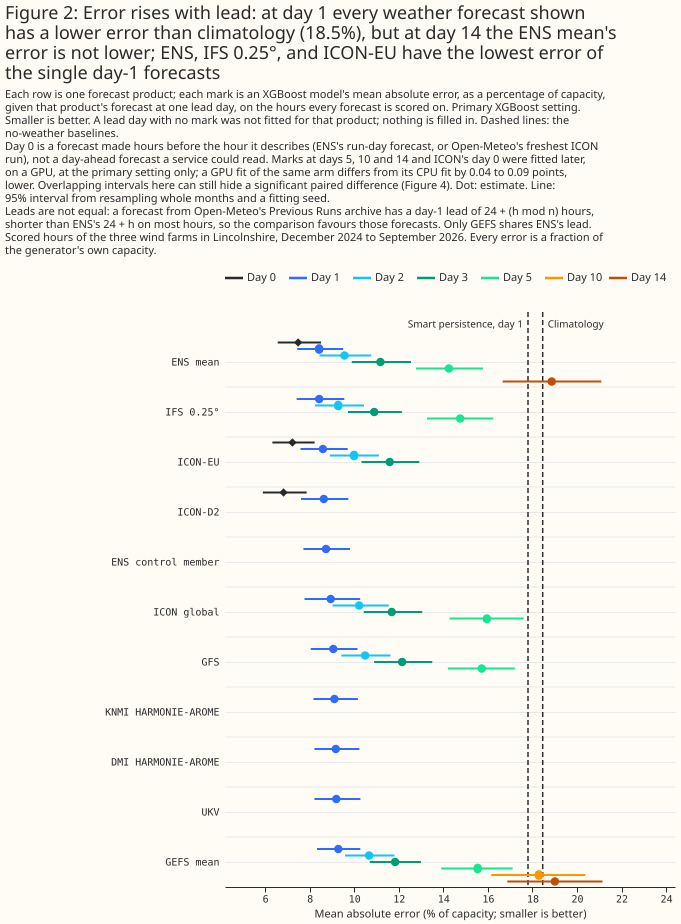
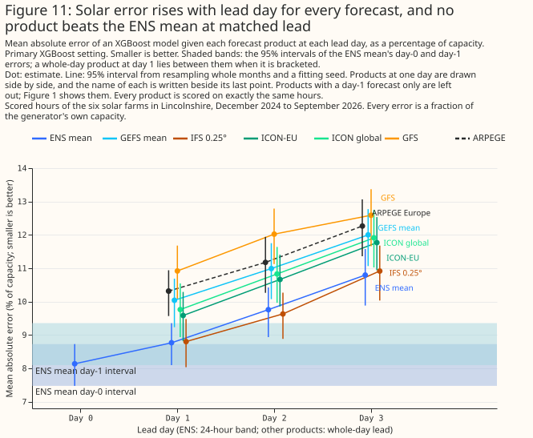
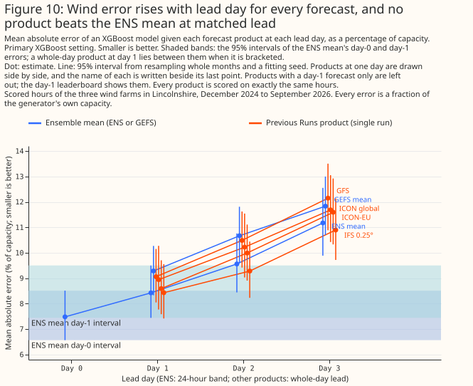

# ECMWF's ensemble mean beat UKV and GEFS at six solar and three wind farms, and a blend helped wind

**At six solar farms and three wind farms in Lincolnshire, none of the four single products we
tested beat the mean of the European Centre for Medium-Range Weather Forecasts (ECMWF) ensemble
forecast (ENS) at a matched lead.** Each comparison gives an XGBoost model, a gradient-boosted tree
model, one product's weather forecast and scores the power forecast it makes as a mean absolute
error, in percentage points of the generator's capacity. A difference is the first product's error
minus the second's, so a positive difference means the first product forecasts worse. Each bracketed
pair is a 95% interval. The four single products are the Met Office's UK variable-resolution model
(UKV), ICON-EU from the German weather service's (DWD's) Icosahedral Nonhydrostatic (ICON) model
family, the National Oceanic and Atmospheric Administration's (NOAA's) Global Ensemble Forecast
System (GEFS), and ECMWF's own single-run 0.25° Integrated Forecasting System (IFS 0.25°). The study
also tests blends of ENS with ICON-EU and IFS 0.25°. The study reads the products in three ways:
UKV, ICON-EU, and IFS 0.25° are single deterministic runs read at one grid point, ENS is a 51-member
mean averaged over an H3 cell (one hexagon of the H3 global hexagonal grid), and GEFS is a 31-member
mean read at the nearest 0.25° cell. The live lead of UKV and ICON-EU is unmeasured, and would
probably strengthen the verdicts against UKV and ICON-EU. The effect of the live lead on the blends
was not tested.

**For solar power, ENS beat UKV, ICON-EU, and GEFS, and a blend gained only at an optimistic
lead.** The XGBoost model's error given UKV's day-1 forecast, minus its error given ENS's day-1
forecast, is +1.242 points [+0.824, +1.689]. The same difference is +0.817 points [+0.584, +1.069]
for ICON-EU and +1.272 points [+0.937, +1.601] for GEFS.
<!-- report: Solar, Planned contrasts and verdicts (P1a, P2a, P3) -->
A blend of ENS, ICON-EU, and IFS 0.25° changed the error by -0.347 points [-0.482, -0.219] when the
other two products' forecasts came from runs that may have been published after the forecast is
issued (P4a). When the ICON-EU and IFS 0.25° forecasts were both a day older (P4b, the deciding
contrast), the blend changed the error by -0.033 points [-0.106, +0.033], which is not
distinguishable from zero.
<!-- report: Solar, P4, the blend -->

**For wind power, ENS beat UKV and GEFS, ICON-EU was not separable from ENS, and a blend lowered the
error even at a conservative lead.** The error given UKV's day-1 forecast, minus the error given
ENS's, is +0.770 points [+0.460, +1.057]. The same difference is +0.858 points [+0.598, +1.099] for
GEFS and +0.169 points [-0.064, +0.384] for ICON-EU. For IFS 0.25°, an exploratory comparison, the
difference is +0.003 points [-0.163, +0.186].
<!-- report: Wind, Planned contrasts and verdicts (P1a, P2a, P3); Wind, P4, the blend -->
The blend changed the error by -0.656 points [-0.851, -0.472] at the optimistic lead and by -0.184
points [-0.282, -0.087] at the conservative lead. At the conservative lead, a live service could
read the added ICON-EU and IFS 0.25° runs at 09:00 Coordinated Universal Time (UTC). The study fits
every XGBoost model at two hyperparameter settings, a primary setting and a more heavily regularised
sensitivity setting. The permutation controls of both blends, which shuffle the ICON-EU and IFS
0.25° weather columns among comparable hours, were not significantly worse than ENS alone at either
setting (exploratory).
<!-- report: Wind, P4, the blend -->



Figure 1: For solar power, ENS beats UKV and ICON-EU at matched lead and GEFS at equal lead. A blend
gains 0.35 points at an optimistic lead and shows no detectable gain at a conservative lead.



Figure 2: For wind power, ENS beats UKV, ICON-EU is unresolved against ENS, and a blend lowers the
error by 0.18 points even at a conservative lead.

> **How this page was made.** The research question came from a human. Everything else — the code
> behind every result, the analysis, the figures, and the text — was written by Claude, Anthropic's
> AI model (for this page, Claude Opus 5, Claude Opus 5.5, and Claude Sonnet 5, with Claude Opus 5.5
> and Claude Sonnet 5 also reusing shared code that Claude Opus 5 wrote). Several independent Claude
> reviewers have checked the method, the evidence, and the prose adversarially.
>
> **This study uses only Flexpectation's own data, and its purpose is to inform Flexpectation's
> choices.** The study scores each weather product only at the six solar farms and three wind farms
> in Flexpectation's trial area in Lincolnshire. The study does not compare results across many
> regions or climates, so a result on this page may not hold elsewhere.

## Key findings

**Every finding below is about each product as this study reads it.** UKV, ICON-EU, and IFS 0.25°
are single deterministic runs, read through Open-Meteo at one grid point. ENS is the mean of 51
ensemble members, averaged over an H3 cell. GEFS is a 31-member mean read at the nearest 0.25°
cell. A finding is therefore not a ranking of the weather
models that produce these forecasts.

- **For solar power, ENS beats UKV, ICON-EU, and GEFS at matched lead, at both XGBoost settings**
  ([solar results](#solar-does-any-product-beat-ens-at-matched-lead)).
- **For wind power, ENS beats UKV and GEFS, and ICON-EU and IFS 0.25° cannot be separated from
  ENS** ([wind results](#wind-does-any-product-beat-ens-at-matched-lead)).
- **IFS 0.25° is the closest rival to ENS among the single products tested, and the lead the
  comparison uses favours IFS 0.25°** (exploratory). IFS 0.25°'s day-1 error minus ENS's is +0.036
  points [-0.225, +0.296] for solar and +0.003 points [-0.163, +0.186] for wind. IFS 0.25°'s lead is
  shorter than ENS's on most hours ([other products](#other-products-exploratory)).
  <!-- report: Solar and Wind, P4, the blend (X-ifs025_day1 rows) -->
- **Adding ICON-EU and IFS 0.25° to ENS changes the wind error by -0.184 points [-0.282, -0.087] at
  a lead a live service could use, and changes the solar error detectably only at a lead a live
  service may not be able to use** ([blending](#does-blending-products-help)).
- **For wind, ICON-EU at day 2 carries most of the blend's gain** (exploratory, and post hoc,
  because the two single-product blends were fitted after P4b's result was seen): ENS plus ICON-EU
  alone changes the error by -0.169 points [-0.250, -0.090], and P4b, which adds IFS 0.25° as well,
  is not statistically distinguishable from the ENS plus ICON-EU blend
  ([blending](#does-blending-products-help)).
- **At the wind farms, part of ENS's advantage over the single-run products may be timing noise that
  averaging removes, but at the solar farms averaging does not shrink the gaps relative to ENS's own
  error** (exploratory; [gaps](#how-much-of-enss-advantage-is-ensemble-averaging-and-timing)).
- **Every weather forecast shown in the day-1 leaderboards has a lower error than the no-weather
  climatology baseline.** The XGBoost model's error given ENS is 8.766% of capacity for solar and
  8.427% for wind, against climatology's 14.458% and 18.460% ([the XGBoost
  forecasts work](#do-the-xgboost-power-forecasts-work)).
- **Open-Meteo's Previous Runs day 1 gives UKV, ICON-EU, and IFS 0.25° a shorter lead than ENS's on
  most hours, which flatters those three products** ([matched leads](#how-the-leads-are-matched)).

<!-- report: Solar and Wind, Leaderboard, primary setting; P4, the blend; Exploratory: which
product carries P4b's wind gain; Exploratory: each arm's own error over blocks of hours -->

## Introduction

**The question is which weather forecast, or blend of forecasts, gives the most accurate day-ahead
power forecast at the six solar farms and three wind farms.** Flexpectation's live service reads
ENS at 09:00 UTC, so the answer decides whether a second weather source is worth ingesting. ENS is
the incumbent. The table sets out each product a headline contrast uses, plus ICON-D2. The other
products in the study are exploratory and appear in [Other products](#other-products-exploratory).

| Product | Lead at day 1, in hours after the run starts | Grid | Domain (the study reads Great Britain) | Archive read from | Delivery |
|---|---|---|---|---|---|
| ECMWF ENS, mean of 51 members | 24 + h | About 9 km native, served on 0.25° cells; the study averages the cells overlapping each generator's H3 cell | Global | 2024-04-01 | Not measured; the study assumes the 00 UTC run is readable at 09:00 UTC |
| NOAA GEFS, mean of 31 members | 24 + h | 0.25°; the study reads the nearest cell | Global | 2020-10-01 | Not measured; the study assumes the 00 UTC run is readable at 09:00 UTC |
| UKV | 24 + (h mod n) | 1.5 km over the UK, served at 2 km | UK | 2024-08-06 | About 4 hours after the run starts |
| ICON-EU | 24 + (h mod n) | 6.5 km, served at about 7 km | Europe | 2024-01-19 | About 3.5 hours after the run starts |
| ICON-D2 (exploratory tables only) | 24 + (h mod n) | 2.2 km, served at about 2 km | Germany and neighbouring countries, not all of Great Britain | 2024-01-19 | About 1.5 hours after the run starts |
| IFS 0.25° | 24 + (h mod n) | About 9 km native, served at 0.25° | Global | 2024-03-06 | Not measured |

**IFS 0.25° is the open-data 0.25° version of ECMWF's single high-resolution forecast run (HRES),
not a member of ENS.**

**ICON-D2 covers Germany and neighbouring countries, ICON's 100 m wind is a derived value, and ENS
at a generator is a smoothed mean.** ICON-D2 is the German weather service's 2.2 km ICON
configuration for Germany and neighbouring countries. ICON-EU's, ICON-D2's, and ICON global's
served "100 m" wind speed is Open-Meteo's derivation, the 120 m speed multiplied by about 0.98, and
not a product of the German weather service. ENS at a generator is the mean of the 0.25° grid cells
that overlap the generator's H3 resolution-5 hexagon (about 253 km²), weighted by overlap. That
mean is a smoothed value, whereas each Previous Runs product is read at a single grid point.

In the table, h is the UTC hour of the row and n is the interval between runs of a product's weather
model. ENS and GEFS start one run per day, at 00 UTC. UKV, ICON-EU, and IFS 0.25° reach the study
through Open-Meteo's Previous Runs archive, whose lead depends on n ([How the leads are
matched](#how-the-leads-are-matched)). The scored rows start on 2024-12-01, after the archive start
date of every product in the table. The grids, coverage, and delivery times of UKV, ICON-D2, and
ICON-EU come from [the past-wind study](weather-products-for-past-wind.md), which measured the
delivery times for a different purpose. The archive start dates come from the [weather-products
survey](../background/weather-products-survey.md). The study did not measure the delivery time of
ENS, GEFS, or IFS 0.25°, and ECMWF's published dissemination schedule was not checked against the
09:00 UTC assumption.
<!-- source: the past-wind study's product table and the weather-products survey; none of these
figures is measured here -->

## How the leads are matched

**Open-Meteo's Previous Runs archive is not a fixed-lead instrument, so the study cannot compare its
products with ENS at one lead.** A value labelled `previous_dayN` comes from the freshest run of the
weather model that was initialised at least N × 24 hours before the hour it describes. For a weather
model that starts a run every n hours, the lead of that value is 24N + (h mod n) hours, where h is
the UTC hour of day. The lead therefore differs between products. No Previous Runs value reproduces
a forecast issued at a fixed time each day.

**A check against GFS runs on two days supports the run-selection rule, and the same check found no
clear run cycle for UKV.** The study's verification script (V1) checked this run-selection rule
against NOAA's Global Forecast System (GFS) runs on two days (2025-07-01 and 2025-07-02) at the nine
generators, and the check passed. Served 100 m wind speed differed from the run initialised exactly
24N hours before the hour by a mean absolute difference of 0.102 km/h at N = 1 and 0.100 km/h at N =
2, against 0.416 and 0.515 km/h for a run one hour older. Served radiation matched a run chosen by
the hour's label (a mean absolute difference of 4.96 W/m² at N = 1) better than a run chosen by the
hour's start (21.94 W/m²).
<!-- report: Inputs and verification, V1 wind gate and V1 radiation; Design constants (V1 gate) -->
The rule for every other product rests on the assumption that Open-Meteo applies one rule to every
weather model. For UKV, the run-switch check (V1b) found no clear run cycle: the check's score was
1.07 for wind and 1.10 for temperature, and a cycle needs a score of 1.3. The study therefore
reports, for solar, the share of hours whose rebuilt radiation value, which the next paragraph
explains is built from two hourly snapshots, would straddle a run change under two assumed cycles:
33.3% at a 3-hour cycle and 16.9% at a 6-hour cycle.
<!-- report: Inputs and verification, V1b; Design constants (V1b); Solar / Rows -->

**UKV's hourly solar radiation is the study's own rebuild from two snapshots, so the solar gap
between UKV and ENS includes the effect of that rebuild.** The radiation timestamp check gave a
median peak offset of -13 minutes for UKV, the offset a snapshot taken at the hour's label gives.
Every other product measured -28 to -35 minutes, the offset an hour-ending mean gives. The study
rebuilds UKV's hourly radiation from its hourly snapshots at offsets (-60, 0) minutes. The rebuild
gives a median peak of -43 minutes, the offset of an hour-ending mean, and the timestamp check
agrees with the rebuild. UKV's solar radiation is not published as an hourly mean, so the study
assembles the hourly mean from two snapshots. The study chose the two offsets by the timestamp check
alone. The study did not compare UKV's error under any other rebuild, so the solar gap between UKV
and ENS includes the effect of this reconstruction.
<!-- report: UKV radiation timestamp convention (V3) -->

**If Open-Meteo fills a missing run with an older run, a row's lead can exceed the lead the rule
gives, and a longer lead would weaken the upper side of the bracket.** The upper side needs each
product's lead to be no longer than ENS day N's. On a filled row the product's lead is longer, so
its error could exceed ENS day N's because of the run's age and not because of the weather model.
The V1 check compared GFS with runs on two days only, so the study cannot rule out a fill for any
product.

**ENS and GEFS are compared at exactly matched lead, because both are whole-run archives.** Each
ensemble contributes its 00 UTC run, read as though at 09:00 UTC on the run's day. A forecast for
day d is the run's forecast for the calendar day d days after the run, so a row's lead is 24d + h
hours for both ensembles. The study assumes both runs were readable by 09:00 UTC, which is when the
live service reads its ENS run, and did not measure when either run was published. The GEFS
contrast, P3, is therefore the only planned contrast whose two arms have exactly the same lead on
every row.

**ENS at day N−1 and at day N brackets each Previous Runs product at day N.** On a row for hour h,
ENS day N−1 has lead 24(N−1) + h hours, which is shorter than the product's 24N + (h mod n). ENS day
N has lead 24N + h, which is at least as long. If a product's error is lower than ENS day N−1's
error, the product beats ENS even though ENS had the shorter lead. If a product's error is higher
than ENS day N's error, ENS beats the product even though the product's lead was no longer. The
study calls the first contrast the lower side of the bracket (P1b for UKV, P2b for ICON-EU) and the
second contrast the upper side (P1a and P2a). The bracket needs no knowledge of a product's run
cycle n.
<!-- plan: Leads, and what matched means -->
ENS day 0 is a bracket side only. A service issuing at 09:00 UTC cannot deliver a forecast whose
early hours have already passed, so ENS day 0 is never offered as a product.

**A product beats ENS, loses to ENS, or is unresolved, and a verdict stands only if both XGBoost
settings give it.** These three verdicts were fixed in the plan before any fit:

- **Beats ENS at matched lead:** the lower-side difference is negative and significant at the 5%
  level.
- **Loses to ENS at matched lead:** the upper-side difference is positive and significant at the 5%
  level.
- **Unresolved at matched lead:** neither of those two conditions holds, so the product's error lies
  between the two ENS errors, and the study cannot place the product's error more precisely.

**"Beats" needs a product to beat ENS at day N−1, not at day 0, and "loses" is easier to reach than
"beats" by construction.** For a product at day N, ENS at day N−1 has a lead 24 − (h − (h mod n))
hours shorter than the product's, and ENS at day N has a lead h − (h mod n) hours longer. Averaged
over the 24 UTC hours, for a product whose runs start every 6 hours, ENS at day N−1 has a lead 15
hours shorter and ENS at day N has a lead 9 hours longer. The "loses" test therefore sits closer to
a matched lead than the "beats" test does, and gives ENS a smaller handicap. Both tests are
conservative, but the "beats" test is the more conservative one. A product a little worse than ENS
is therefore likelier to reach "loses" than a product a little better than ENS is to reach "beats".

**A verdict that the two settings disagree on is unresolved, and only the planned contrasts carry
headline claims.** The page shows both settings. The planned contrasts are P1a, P1b, P2a, P2b, P3,
P4a, P4b, and the two blend guards per technology (each blend minus its permutation control). All of
the planned contrasts were written into the study plan before any result existed. The split between
planned and exploratory contrasts applies to the contrast tables and to the headline claims: every
contrast outside the planned list is exploratory, and so is any number that a paragraph quotes from
an exploratory table. Analyses added after a result was seen, such as the two single-product wind
blends, are exploratory and also post hoc. About 1 in 20 exploratory intervals reaches significance
at the 5% level by chance.
<!-- report: header -->

**The bracket assumes that ENS's own error does not fall as its lead lengthens, and the study tests
that assumption band by band.** For each day pair the study uses (day 0 to 1, 1 to 2, and 2 to 3)
and for each 3-hour band of UTC hours, the study computes the change in ENS's error. A band whose
point estimate is zero or below is voided. Every bracket that rests on that day pair loses the
voided band. The rule reacts to noise, because a point estimate can fall to zero or below by chance
where the interval contains zero. The check tests only ENS's own error, so it does not test whether
the Previous Runs archive follows the lead rule above, and it does not test any product's error at
all.
<!-- plan: Leads, and what matched means -->
The [solar](#solar-does-any-product-beat-ens-at-matched-lead) and
[wind](#wind-does-any-product-beat-ens-at-matched-lead) sections give the result of this check.
<!-- report: Solar and Wind, ENS monotonicity by band -->

## The XGBoost model, the scored hours, and the folds

**Every arm is the same XGBoost model given the same kinds of column, and only the weather product
differs.** The XGBoost model is fitted separately for each generator with an absolute-error
objective and three fitting seeds (0, 1, and 2). Forecasts are scored out of fold. Curtailed hours
are left out of training and kept for scoring. Every prediction is held to the generator's export
cap. Column subsampling is switched off (`colsample_bytree` is 1), because a wider arm otherwise
wins without carrying more information. Each single-product arm has seven columns:

- **Solar:** hour of day, day of year, an era code, the sun's elevation and azimuth, and the
  product's global horizontal irradiance and 2 m air temperature at its own lead.
- **Wind:** hour of day, day of year, an era code, and the product's wind speed at 100 m, the sine
  and cosine of its 100 m wind direction, and its 10 m wind speed at its own lead.

<!-- report: Solar and Wind, Arm columns; Design constants -->

**A blend has more columns than a single-product arm, so each blend has a control with the same
column count.** The solar blend has 11 columns and the wind blend has 15. ENS's columns stay real in
the control. Each other product's weather columns are replaced by values shuffled among the hours
that share a generator, a year-month (a calendar month of one year, such as 2025-03), and a UTC hour
of day, so no shuffled value crosses a fold. A wind product's direction sine and cosine move
together under one shuffle, and every other column is shuffled separately. The blend minus its
control separates the effect of the other products' weather from the effect of the extra columns.
<!-- report: Solar and Wind, Arm columns; Design constants (Permutation control) -->

**Scoring is on the same hours for every arm.** Every arm is scored on the rows where the target,
the no-weather baselines, and every planned product are present. A row is one hour at one generator.
Solar has 39,030 candidate rows from 2024-12-01 and 35,263 shared rows. Wind has 42,144 candidate
rows and 37,407 shared rows.
<!-- report: Solar and Wind, Rows -->
Requiring a UKV day-1 value removes the most rows, so the shared rows hold little of spring 2026
([Limitations](#limitations) gives the counts).
<!-- report: Solar and Wind, Rows; UKV day-1 requirement: rows removed -->
Exploratory arms are fitted on the same rows with their few missing values left as missing, which
XGBoost handles natively ([Limitations](#limitations) gives the shares).
<!-- report: Solar and Wind, Exploratory arms: missing weather on the shared rows -->
The shared rows cover 21 year-months.
<!-- report: Solar and Wind, Leaderboard, primary setting -->

**Folds are whole months, cut inside three eras, and the study prints which months no fold can
cover.** The eras end at 2025-10-01 and at the Met Office's UKV upgrade on 2026-01-21. The part
month around the upgrade is dropped. Five folds of whole months are cut inside each era. The third
era's folds are rotated by three fold positions (`NWP_ERA_FOLD_OFFSETS = {0: 0, 1: 0, 2: 3}`) so
that no calendar month is held out of every era at once. A rotation of 3 is the first rotation
`search_fold_offsets` returns that covers every month in both technologies. `search_fold_offsets`
reads only which hours exist and ran before any XGBoost model was fitted, so no forecast error
informed the rotation. The 2025-10-01 cut comes from the shared fold helper and is harmless here.
IFS Cycle 50r1 (2026-05-12) is not an era cut.
<!-- plan: Rows, folds, and fairness; README: Folds -->
Every arm gets the same era code. Of 124 solar (site, fold, month) cells, 20 are not covered by
training, and of 63 wind cells, 9 are not covered. Every uncovered cell is a calendar month that
occurs in one year only at that site, so no other fold holds that month and training never sees the
season.
<!-- report: Solar and Wind, Rows (coverage table) -->

**Every error is divided by its own generator's capacity before any mean or difference, and every
interval resamples whole year-months.** Capacity is the generator's `effective_capacity_mw`, its
99th percentile of metered output, as [defined on the blending
page](blending-weather-products.md#data-and-methods). Each of 2,000 resamples draws whole
year-months, and one of the three fitting seeds, paired across the two arms of a contrast. Each
contrast asserts that both arms hold the same rows. The XGBoost model is fitted at two
hyperparameter settings, called primary and sensitivity, and the sensitivity setting is run on
every planned contrast.
<!-- report: Design constants (Intervals, Capacity) -->

## Do the XGBoost power forecasts work?

**The XGBoost models track the measured output at every farm, so contrasts of a few tenths of a
point are contrasts between working forecasts.** Figure 3 shows out-of-fold day-1 forecasts given
ENS against the measured output at all six solar farms, and Figure 4 shows the same for the three
wind farms. Each figure covers one week, chosen by a stated rule from the measured output alone. For
solar, the rule takes the week whose daily mean output varies most from day to day. For wind, the
rule takes the week with the largest mean hour-to-hour change in output. Only weeks in which every
generator has scored hours on all seven days qualify.



Figure 3: Out-of-fold day-1 ENS-mean forecasts follow the measured output at all six solar farms.



Figure 4: Out-of-fold day-1 ENS-mean forecasts follow the measured output at all three wind farms.

**At day 1, an XGBoost model given ENS beats climatology by a wide margin.** Given ENS's day-1 mean,
the error is 8.766% of capacity [8.096, 9.355] for solar and 8.427% [7.444, 9.503] for wind. The
climatology baseline scores 14.458% [13.205, 15.592] for solar and 18.460% [16.341, 20.389] for
wind. Climatology is the median output at each generator for each calendar month and hour of day
over the training folds.
<!-- report: Solar and Wind, Leaderboard, primary setting -->

**Persistence baselines do no better than climatology on solar, and smart persistence (the last
day's clear-sky index applied to clear-sky irradiance for solar, persistence blended with
climatology for wind) beats climatology on wind (exploratory).** Smart persistence at day 1 scores
15.274% [14.251, 16.272] on solar and 17.799% [15.824, 19.614] on wind. Smart persistence's error
minus climatology's is +0.816 points [+0.040, +1.609] on solar and -0.662 points [-0.946, -0.390] on
wind.
<!-- report: Solar and Wind, Leaderboard, primary setting; Exploratory: the no-weather floor -->
A baseline for a day-1 to day-3 forecast reads only telemetry up to 09:00 UTC on the run's day, the
same information the live service has. A baseline for the run's own day (day 0) reads telemetry only
up to the run's 00 UTC initialisation time. Solar persistence on the run's own day
(`persistence_day0`) is left off the leaderboards, because day-0 solar persistence repeats the last
observed hour, a night-time value near zero, across the whole day.
<!-- report: Design constants (Baselines); Solar, Exploratory: the no-weather floor -->



Figure 5: At day 1 every weather forecast shown has a lower error than climatology (14.5%); ENS and
IFS 0.25° have the lowest error of the single solar forecasts.



Figure 6: At day 1 every weather forecast shown has a lower error than climatology (18.5%), by more
than 9 points; ENS, IFS 0.25°, and ICON-EU have the lowest error of the single wind forecasts.

**Overlapping intervals in Figures 5 and 6 do not mean two products are equal.** The errors of all
the products rise and fall together from month to month, and pairing the two arms of a contrast
cancels that shared swing. The paired differences in Figures 1 and 2 are the test of which gaps are
statistically significant.

**Figures 5 and 6 favour the Previous Runs products, because their day-1 leads are shorter than
ENS's on most hours.** Only GEFS has ENS's exact lead on every row. UKV, ICON-EU, IFS 0.25°, and the
other products from Open-Meteo's Previous Runs archive have a lead of 24 + (h mod n) hours, against
ENS's 24 + h. IFS 0.25° day 1 can also come from a newer ECMWF run than ENS's 00 UTC run. The
ordering of those products against ENS in Figures 5 and 6 is therefore not an ordering at equal
lead.

## Solar: does any product beat ENS at matched lead?

**For solar power, no product tested beats the European Centre for Medium-Range Weather Forecasts
ensemble (ENS) at matched lead: UKV and ICON-EU both lose, at both XGBoost hyperparameter
settings.** Every difference below is the mean absolute error of an XGBoost model given the first
product, minus the error of an XGBoost model given the second, in percentage points ("points") of
capacity, with a 95% interval. A positive difference means the first product forecasts worse. UKV
is the Met Office's UK weather model. ICON-EU is the European domain of the German weather
service's ICON weather model.
<!-- report: Solar / Planned verdicts -->

**A Previous Runs product cannot be given ENS's exact lead, so each product is bracketed between ENS
at day 0 and ENS at day 1.** [How the leads are matched](#how-the-leads-are-matched) defines the
bracket, the three verdicts, and which contrasts are planned. Every other contrast on this page is
exploratory.
<!-- report: Header, Solar / Planned verdicts -->

| Contrast (solar, points) | Primary setting | Sensitivity setting |
|---|---|---|
| P1a: UKV day 1 − ENS day 1 (upper side) | +1.242 [+0.824, +1.689] | +1.236 [+0.815, +1.686] |
| P1b: UKV day 1 − ENS day 0 (lower side) | +1.872 [+1.497, +2.252] | +1.826 [+1.451, +2.205] |
| P2a: ICON-EU day 1 − ENS day 1 (upper side) | +0.817 [+0.584, +1.069] | +0.832 [+0.619, +1.060] |
| P2b: ICON-EU day 1 − ENS day 0 (lower side) | +1.447 [+1.210, +1.689] | +1.422 [+1.174, +1.676] |
| P3: GEFS day 1 − ENS day 1 (equal lead) | +1.272 [+0.937, +1.601] | +1.259 [+0.927, +1.606] |

<!-- report: Solar / Planned brackets (day 1); Solar / P3, GEFS against ENS -->

**Both sides of both brackets are positive and significant, so UKV and ICON-EU have a higher error
than ENS even at ENS's shorter day-0 lead.** The verdict for each product is "loses" at the primary
setting and at the sensitivity setting. At the primary setting the XGBoost model given ENS at day 1
has an error of 8.766% of capacity [8.096, 9.355], against 10.009% [9.178, 10.750] for UKV and
9.583% [8.819, 10.290] for ICON-EU. ENS at day 0 has an error of 8.137% [7.475, 8.728]. ENS at day 0
is a bracket side only, because a service issuing at 09:00 UTC cannot read a forecast for hours that
have already passed.
<!-- report: Solar / Planned verdicts; Solar / Leaderboard, primary setting -->

**The bracket rests on ENS's error rising with lead, and that assumption fails in one band of hours
for solar power.** From day 0 to day 1 the ENS error changes by -0.025 points [-0.133, +0.051] in
the band 03-06 UTC at the primary setting, and by -0.019 points [-0.155, +0.106] at the sensitivity
setting, so the study voids every bracket in that band. The sensitivity setting checks the
day-0-to-day-1 pair only. Within that band each product's own bracket is unresolved: for UKV the
lower side is -0.013 [-0.088, +0.092] and the upper side is +0.012 [-0.100, +0.145] at the primary
setting (exploratory). Dropping the voided band from the rows leaves the upper sides positive:
+1.261 [+0.840, +1.715] for UKV and +0.828 [+0.595, +1.075] for ICON-EU at the primary setting, from
34,735 rows. UKV's lower side is +1.901 points [+1.527, +2.284]. UKV and ICON-EU therefore still
lose (exploratory). In every other band of the day-0-to-day-1 pair, the point estimate is positive
at both settings. Within the day-0-to-day-1 pair, the interval is above zero in all but the band
18-21 UTC, where the change is +0.036 points [-0.062, +0.125] at the primary setting and +0.062
points [-0.048, +0.175] at the sensitivity setting. The point estimate for the band 18-21 UTC is
positive, so the study does not void the band. In every band of the pairs day 1 to 2 and day 2 to 3,
the point estimate is positive at the primary setting.
<!-- report: Solar / ENS monotonicity by band; Solar / Planned verdicts;
Solar / X: brackets without the hours where ENS's error did not rise -->

**At equal lead the solar test of ICON-EU has too few rows to separate the products.** ICON-EU's
day-1 lead equals ENS day 1's on hours 00-05 UTC, but the shared solar rows in that window fall at
05 UTC only. On those 528 rows in 8 months, ICON-EU minus ENS at day 1 is +0.092 points [-0.056,
+0.269] (exploratory). The verdict for ICON-EU therefore rests on the bracket.
<!-- report: Solar / X: ICON-EU day 1 against ENS day 1 on hours 00-05 UTC -->

**ENS also beats GEFS, the free ensemble from the US National Oceanic and Atmospheric Administration
(NOAA), at exactly equal lead.** GEFS is the Global Ensemble Forecast System. GEFS and ENS have the
same lead on every row, so the P3 contrast needs no bracket. The XGBoost model given the GEFS
ensemble mean at day 1 has an error of 10.039% [9.234, 10.689] against 8.766% for ENS, a difference
of +1.272 points [+0.937, +1.601] at the primary setting and +1.259 points [+0.927, +1.606] at the
sensitivity setting.
<!-- report: Solar / P3, GEFS against ENS; Solar / Leaderboard, primary setting -->

**The solar result holds at each of the six generators.** The generators are labelled A to F. UKV
minus ENS at day 1 (P1a) is positive and significant at every generator, from +1.087 points [+0.533,
+1.649] at generator A to +1.442 points [+1.008, +1.918] at generator E. ICON-EU minus ENS at day 1
(P2a) is positive and significant at every generator too, from +0.668 points [+0.408, +0.966] at
generator E to +1.075 points [+0.786, +1.375] at generator F. These contrasts are exploratory. Each
interval resamples months and fitting seeds within one generator, so the interval does not cover
differences between generators.
<!-- report: Solar / X: P1a, P2a and P4b one generator at a time -->


Figure 7: At each of the six solar farms UKV and ICON-EU have a higher error than ENS at day 1.

## Wind: does any product beat ENS at matched lead?

**For wind power, UKV loses to ENS at matched lead, and ICON-EU is unresolved against ENS.** The
verdict for UKV is "loses" at both settings, and the verdict for ICON-EU is "unresolved" at both
settings. The differences and the bracket are defined in the solar section above. A positive
difference means the first product forecasts worse.
<!-- report: Wind / Planned verdicts -->

| Contrast (wind, points) | Primary setting | Sensitivity setting |
|---|---|---|
| P1a: UKV day 1 − ENS day 1 (upper side) | +0.770 [+0.460, +1.057] | +0.697 [+0.371, +0.987] |
| P1b: UKV day 1 − ENS day 0 (lower side) | +1.713 [+1.467, +1.970] | +1.640 [+1.391, +1.902] |
| P2a: ICON-EU day 1 − ENS day 1 (upper side) | +0.169 [-0.064, +0.384] | +0.134 [-0.069, +0.328] |
| P2b: ICON-EU day 1 − ENS day 0 (lower side) | +1.112 [+0.926, +1.305] | +1.077 [+0.890, +1.277] |
| P3: GEFS day 1 − ENS day 1 (equal lead) | +0.858 [+0.598, +1.099] | +0.872 [+0.652, +1.105] |

<!-- report: Wind / Planned brackets (day 1); Wind / P3, GEFS against ENS -->

**ICON-EU is unresolved because its upper side includes zero while its lower side is well above
zero.** ICON-EU is not better than ENS at day 0 (P2b is positive and significant), and its
difference from ENS at day 1 (P2a) has an interval that includes zero at both settings. The wind
error of the XGBoost model given ENS at day 1 is 8.427% of capacity [7.444, 9.503] at the primary
setting, against 9.197% [8.213, 10.279] for UKV and 8.595% [7.588, 9.707] for ICON-EU. ENS at day 0
has an error of 7.483% [6.566, 8.511].
<!-- report: Wind / Planned verdicts; Wind / Leaderboard, primary setting -->

**For wind, ENS's error rises with lead in every band of hours, so no bracket is voided.** The
change from day 0 to day 1 is positive in all eight 3-hour bands at both settings, from +0.629
points [+0.331, +0.948] in the band 03-06 UTC to +1.203 points [+0.874, +1.546] in the band 15-18
UTC at the primary setting. The pairs day 1 to 2 and day 2 to 3 also have a positive point estimate
in every band at the primary setting.
<!-- report: Wind / ENS monotonicity by band;
Wind / X: brackets without the hours where ENS's error did not rise -->

**At exactly equal lead, ICON-EU also has a higher error than ENS for wind (exploratory).**
ICON-EU's day-1 lead equals ENS day 1's on hours 00-05 UTC. On those 9,228 rows, ICON-EU minus ENS
at day 1 is +0.540 points [+0.237, +0.840], against +0.169 points [-0.064, +0.384] over all hours.
The contrast is +0.669 points [+0.378, +0.987] on the band 00-03 UTC (4,632 rows) and +0.410 points
[+0.035, +0.761] on the band 03-06 UTC (4,596 rows). UKV's day-1 lead equals ENS day 1's on hour 00
UTC, where UKV minus ENS at day 1 is +1.278 points [+0.901, +1.697] on 1,540 rows. All of these
contrasts are exploratory. The ICON-EU contrast on hours 00-05 UTC is positive and significant,
unlike the unresolved bracket over all hours.
<!-- report: Wind / X: exact-lead wind re-read;
Wind / X: ICON-EU day 1 against ENS day 1 on hours 00-05 UTC -->

**ENS also beats GEFS at exactly equal lead for wind.** The P3 difference is +0.858 points [+0.598,
+1.099] at the primary setting and +0.872 points [+0.652, +1.105] at the sensitivity setting. The
GEFS error is 9.285% [8.333, 10.273] at the primary setting.
<!-- report: Wind / P3, GEFS against ENS; Wind / Leaderboard, primary setting -->

**UKV has a higher error than ENS at all three wind generators in the point estimates, but the
difference is statistically significant at the 5% level at only two of the three generators, and at
generator W3 the difference is +0.269 points [-0.463, +0.857].** The generators are labelled W1 to
W3. UKV minus ENS at day 1 (P1a) is +1.128 points [+0.819, +1.475] at generator W1 and +0.893 points
[+0.640, +1.161] at generator W2. At generator W3 the difference is +0.269 points [-0.463, +0.857].
ICON-EU minus ENS at day 1 (P2a) is +0.206 points [-0.041, +0.464] at W1, +0.303 points [+0.014,
+0.585] at W2, and -0.012 points [-0.358, +0.319] at W3. These contrasts are exploratory. Each
interval resamples months and fitting seeds within one generator, so the interval does not cover
differences between generators.
<!-- report: Wind / X: P1a, P2a and P4b one generator at a time -->


Figure 8: At two of the three wind farms UKV has a higher error than ENS at day 1, and at two of the
three wind farms the P4b blend has a lower error.

## Does blending products help?

**A blend of ENS, ICON-EU, and IFS 0.25° lowers the wind error at both leads tested, and lowers the
solar error only at the optimistic lead.**

**Blend P4a adds ICON-EU and IFS 0.25° at their day 1 and blend P4b at their day 2, and P4b decides
the verdict because a live service could have read every value it adds.** Each blend gives one
XGBoost model the ENS day-1 columns plus the ICON-EU and IFS 0.25° columns. Both blends are
planned. Every value P4b adds comes from a run published before the 09:00 UTC issue time. P4a's
IFS 0.25° day-1 value can come from a 06, 12, or 18 UTC run. The 12 and 18 UTC runs are published
after that issue time, so P4a may use weather that a live service could not have read. Each blend
is compared with ENS alone at day 1, and with a permutation control
that has the same columns with the two added products' weather shuffled among hours of the same
generator, year-month, and UTC hour of day.
<!-- report: Solar / P4, the blend; Wind / P4, the blend -->

| Contrast (points) | Solar, primary | Solar, sensitivity | Wind, primary | Wind, sensitivity |
|---|---|---|---|---|
| P4a: blend − ENS day 1 | -0.347 [-0.482, -0.219] | -0.290 [-0.418, -0.174] | -0.656 [-0.851, -0.472] | -0.645 [-0.816, -0.481] |
| P4b: blend − ENS day 1 | -0.033 [-0.106, +0.033] | +0.014 [-0.049, +0.068] | -0.184 [-0.282, -0.087] | -0.197 [-0.311, -0.088] |
| P4a guard: blend − control | -0.499 [-0.612, -0.389] | -0.442 [-0.543, -0.343] | -0.604 [-0.810, -0.398] | -0.643 [-0.837, -0.450] |
| P4b guard: blend − control | -0.168 [-0.241, -0.095] | -0.136 [-0.194, -0.079] | -0.148 [-0.266, -0.026] | -0.198 [-0.317, -0.087] |
| Control P4a − ENS day 1 (exploratory) | +0.152 [+0.097, +0.215] | +0.152 [+0.097, +0.211] | -0.052 [-0.151, +0.032] | -0.001 [-0.090, +0.064] |
| Control P4b − ENS day 1 (exploratory) | +0.136 [+0.066, +0.211] | +0.150 [+0.092, +0.209] | -0.036 [-0.139, +0.048] | +0.001 [-0.094, +0.070] |
| IFS 0.25° day 1 − ENS day 1 (exploratory) | +0.036 [-0.225, +0.296] | +0.088 [-0.171, +0.336] | +0.003 [-0.163, +0.186] | -0.055 [-0.238, +0.133] |

<!-- report: Solar / P4, the blend; Wind / P4, the blend -->

**For wind, the blend lowers the day-ahead error even at the conservative lead, and the guard
confirms that the gain comes from the added weather.** P4b is -0.184 points [-0.282, -0.087] at the
primary setting and -0.197 points [-0.311, -0.088] at the sensitivity setting. P4b's guard is
negative and significant at both settings. Neither wind control is significantly worse than ENS
alone, so a blend that beats its control is a blend that adds real information. The wind blend
verdict is "lowers the day-ahead error". At the primary setting the P4a blend has an error of 7.771%
[6.839, 8.834] and the P4b blend 8.243% [7.299, 9.277], against 8.427% for ENS alone.
<!-- report: Wind / P4, the blend; Wind / Leaderboard, primary setting -->

**For solar, the blend lowers the error at the optimistic lead only, so the verdict is "may lower
the error".** P4a is -0.347 points [-0.482, -0.219] at the primary setting and -0.290 points
[-0.418, -0.174] at the sensitivity setting. P4b, the deciding contrast, is -0.033 points [-0.106,
+0.033] at the primary setting and +0.014 points [-0.049, +0.068] at the sensitivity setting, and
both intervals include zero. A gain as large as 0.106 points at the primary setting is not excluded.
The P4a blend has an error of 8.419% of capacity [7.727, 9.044] at the primary setting, against
8.766% for ENS alone.
<!-- report: Solar / P4, the blend; Solar / Leaderboard, primary setting -->

**The solar guard is uninformative, because each solar control is itself worse than ENS alone.** A
blend beats a control that is significantly worse than ENS alone whether or not the blend adds
information to ENS. The P4a control is +0.152 points [+0.097, +0.215] worse than ENS at the primary
setting, and the P4b control is +0.136 points [+0.066, +0.211] worse. Both controls are
significantly worse at the sensitivity setting too. The P4a gain may therefore reflect newer ECMWF
runs rather than a second weather model ([What this study cannot
separate](#what-this-study-cannot-separate)). P4b is the deciding contrast because P4b's added
runs precede 09:00 UTC. IFS 0.25° alone at day 1 does not differ detectably from ENS at day 1:
+0.036 points [-0.225, +0.296] at the primary setting and +0.088 points [-0.171, +0.336] at the
sensitivity setting (exploratory). The same contrast for wind is +0.003 points [-0.163, +0.186] and
-0.055 points [-0.238, +0.133].
<!-- report: Solar / P4, the blend; Wind / P4, the blend -->

**Each blend covers Great Britain, and its delivery time is set by the latest run it reads.**
ENS, ICON-EU, and IFS 0.25° all cover Great Britain, so each blend does. P4b reads only runs
published before 09:00 UTC, so the latest run it needs is ENS's 00 UTC run, which a live service
can read from about 09:00 UTC. P4a's day-1 values can come from runs published after 09:00 UTC.
The study did not measure when those runs are published, so P4a's delivery time is not established.

**For wind, ICON-EU at day 2 carries most of the gain, and IFS 0.25° at day 2 carries a smaller
share (exploratory and post hoc).** The study fitted two further XGBoost models on wind only after
P4b's result was seen: ENS's day-1 columns plus ICON-EU's day-2 columns, and ENS's day-1 columns
plus IFS 0.25°'s day-2 columns. Each of the two post hoc XGBoost models has 11 columns, whereas P4b
has 15, so equal column counts with P4b are impossible. The fair reference for each post hoc XGBoost
model is ENS alone at day 1, with 7 columns. ENS plus ICON-EU differs from ENS alone by -0.169
points [-0.250, -0.090] at the primary setting and -0.180 [-0.284, -0.085] at the sensitivity
setting. ENS plus IFS 0.25° differs from ENS alone by -0.073 points [-0.132, -0.011] and -0.067
[-0.128, -0.006]. Against P4b, ENS plus ICON-EU is +0.015 points [-0.033, +0.065] and +0.018
[-0.022, +0.058], so the study cannot distinguish ENS plus ICON-EU from P4b. ENS plus IFS 0.25° is
+0.111 points [+0.035, +0.189] and +0.130 [+0.064, +0.200] worse than P4b, so ENS plus IFS 0.25°
reaches only part of P4b's gain. The ICON-EU permutation guard is -0.142 points [-0.217, -0.066] and
-0.181 [-0.273, -0.105]. The ICON-EU control is not worse than ENS alone (-0.027 [-0.081, +0.023]
and +0.002 [-0.038, +0.036]), so the gain comes from ICON-EU's weather.

**IFS 0.25°'s small wind gain cannot be told apart from what a shuffled column gives.** The IFS
0.25° permutation guard is -0.040 points [-0.138, +0.074] and -0.058 [-0.151, +0.033], and neither
interval is statistically significant at the 5% level.

**The study cannot say whether ICON-EU's wind gain comes from a second weather model or from
reading one grid point.** Two differences between the added products and ENS could account for
part of the ICON-EU gain, and the study did not test either difference. Both added products are read
at one grid point, whereas ENS is an average over an H3 cell. ICON-EU is also a different weather
model from ENS. IFS 0.25° is ECMWF's own weather model, so an older IFS 0.25° run may act like an
extra ensemble member of ENS. The study has no contrast that separates these two explanations.
<!-- report: Wind / Exploratory: which product carries P4b's wind gain; Wind / Arm columns -->

**Averaging over 3 hours or a day leaves the wind gain in place, and makes the solar gain at the
conservative lead statistically significant over a day (exploratory).** For wind, P4b minus ENS is
-0.194 points [-0.285, -0.095] averaged over 3 hours and -0.188 points [-0.311, -0.066] averaged
over a day, against -0.184 points [-0.282, -0.087] hourly. P4b's guard is -0.130 points [-0.253,
-0.000] over 3 hours and -0.164 points [-0.332, -0.000] over a day, so the guard's upper bound
rounds to zero at both block lengths. For solar, P4b is -0.055 points [-0.124, +0.014] over 3 hours
and -0.097 points [-0.190, -0.016] over a day, with a guard of -0.139 points [-0.200, -0.073] and
-0.139 points [-0.218, -0.057]. These contrasts are exploratory, at the primary setting only, and
the planned P4b remains the hourly one.
<!-- report: Solar and Wind, Exploratory: each arm's own error over blocks of hours, and P4b
over blocks -->

**The per-generator P4b contrasts agree with the pooled result for wind and differ across solar
generators.** For solar, the P4b blend minus ENS at day 1 is -0.096 points [-0.215, -0.006] at
generator A and -0.111 points [-0.204, -0.003] at generator B, but it is +0.026 points [-0.132,
+0.169] at generator E and +0.068 points [-0.015, +0.160] at generator F. For wind, the P4b contrast
is -0.073 points [-0.164, +0.005] at W1, -0.179 points [-0.309, -0.073] at W2, and -0.304 points
[-0.536, -0.093] at W3. These contrasts are exploratory, and Figures 7 and 8 draw these
per-generator contrasts.
<!-- report: Solar / X: P1a, P2a and P4b one generator at a time; Wind / same -->


Figure 9: For solar power a blend of ENS, ICON-EU, and IFS 0.25° gains 0.35 points at an optimistic
lead, but its control is itself worse than ENS alone.


Figure 10: For wind power a blend of ENS, ICON-EU, and IFS 0.25° lowers the error by 0.66 points at
an optimistic lead and 0.18 points at a conservative lead, and its control does not.

## How much of ENS's advantage is ensemble averaging and timing?

**The gaps between ENS and the other products are partly gaps in ensemble averaging and timing, not
only gaps in weather-model quality, and the evidence differs between solar and wind.** ENS is
averaged over its ensemble members, whereas each Previous Runs product is one run. The study has no
contrast that separates ENS's H3-cell average from a Previous Runs product's single grid point. The
contrasts below show how much of each gap remains when the ensemble averaging or the hourly timing
is removed.
<!-- report: Solar and Wind, Exploratory: ENS control against ENS mean; day-1 gap to ENS day 1
scored over blocks of hours -->

**A single ENS control run has a higher error than the ENS mean, and against the control run the
wind differences for ICON-EU and ICON-D2 are not statistically significant.** The ENS control
run is one run of the ensemble at ENS's own day-1 lead. The ENS mean minus the control run at day 1
is -0.300 points [-0.447, -0.130] for solar and -0.307 points [-0.440, -0.191] for wind, so
averaging the ensemble members lowers the error (exploratory, primary setting only).
<!-- report: Solar / X: ENS control against ENS mean, day 1; Wind / same -->

| Exploratory: day-1 product minus ENS control run (points, primary) | Solar | Wind |
|---|---|---|
| UKV | +0.942 [+0.545, +1.377] | +0.463 [+0.151, +0.733] |
| ICON-D2 | +0.802 [+0.432, +1.281] | -0.098 [-0.364, +0.137] |
| ICON-EU | +0.517 [+0.284, +0.778] | -0.138 [-0.403, +0.100] |
| ICON global | +0.695 [+0.373, +1.091] | +0.212 [-0.145, +0.632] |
| IFS 0.25° | -0.264 [-0.498, -0.033] | -0.304 [-0.514, -0.095] |
| GFS | +1.851 [+1.493, +2.250] | +0.329 [+0.052, +0.584] |
| GEFS mean | +0.972 [+0.680, +1.269] | +0.551 [+0.274, +0.772] |

<!-- report: Solar / X: day-1 products against the single ENS control run; Wind / same -->

**The control-run contrasts favour the Previous Runs products, because those products have a
shorter lead than the control run on most hours.** The control run has a lead of 24 + h hours. UKV,
ICON-D2, ICON-EU, ICON global, IFS 0.25°, and GFS have a lead of 24 + (h mod n) hours, and IFS 0.25°
day 1 can come from a newer ECMWF run than the control run's 00 UTC run. Only GEFS has the control
run's exact lead. The table also compares products with different native grids: ICON-EU's is 6.5 km,
ICON-D2's is 2.2 km, UKV's is 1.5 km, and the control run's is about 9 km.

**For wind, ICON-EU, ICON-D2, and ICON global have no detectable difference from the single ENS
control run, and for solar every ICON product still has a higher error.** IFS 0.25° has a lower
error than the control run for both technologies. UKV has a higher error than the control run for
both technologies, and GEFS has a higher error for both. The single-run contrasts are exploratory
and use the primary setting only.
<!-- report: Solar / X: day-1 products against the single ENS control run; Wind / same -->

**Averaging the forecasts over 3 hours or a day shrinks the wind gaps to ENS relative to ENS's own
error, and does not shrink the solar gaps (exploratory).** Each product's predictions and the
measurements are averaged over the block before the error is scored. ENS and GEFS reach the XGBoost
model as smoothed 3-hourly fields, so a gap that shrinks as the block lengthens may reflect that
smoothing rather than forecast skill. Only GEFS shares ENS's lead.
<!-- report: Solar / X: day-1 gap to ENS day 1 scored over blocks of hours -->

| Exploratory: difference from ENS day 1 (points, primary) | 1 hour | 3 hours | 1 day |
|---|---|---|---|
| Solar, UKV | +1.242 [+0.824, +1.689] | +0.984 [+0.560, +1.425] | +0.945 [+0.453, +1.480] |
| Solar, ICON-EU | +0.817 [+0.584, +1.069] | +0.655 [+0.416, +0.904] | +0.590 [+0.296, +0.877] |
| Solar, ICON-D2 | +1.102 [+0.704, +1.633] | +0.942 [+0.541, +1.473] | +0.925 [+0.468, +1.451] |
| Solar, GEFS | +1.272 [+0.937, +1.601] | +1.155 [+0.826, +1.468] | +1.300 [+0.925, +1.673] |
| Wind, UKV | +0.770 [+0.460, +1.057] | +0.458 [+0.165, +0.731] | +0.303 [-0.119, +0.666] |
| Wind, ICON-EU | +0.169 [-0.064, +0.384] | +0.031 [-0.194, +0.242] | -0.083 [-0.393, +0.218] |
| Wind, ICON-D2 | +0.209 [-0.015, +0.426] | +0.038 [-0.183, +0.268] | -0.147 [-0.435, +0.128] |
| Wind, GEFS | +0.858 [+0.598, +1.099] | +0.875 [+0.607, +1.123] | +0.689 [+0.397, +1.006] |

<!-- report: Solar / X: day-1 gap to ENS day 1 scored over blocks of hours; Wind / same -->

**Averaging shortens every error, so the table below states each gap as a share of ENS's own error
at the same block length (exploratory).**

| Exploratory: gap as % of ENS's own error at that block length (primary), with 95% interval | 1 hour | 3 hours | 1 day |
|---|---|---|---|
| Solar, ENS's own error (% of capacity) | 8.766 | 6.817 | 5.830 |
| Solar, UKV | +14.2% [+9.4%, +19.3%] | +14.4% [+8.2%, +20.9%] | +16.2% [+7.8%, +25.4%] |
| Solar, ICON-EU | +9.3% [+6.7%, +12.2%] | +9.6% [+6.1%, +13.3%] | +10.1% [+5.1%, +15.0%] |
| Solar, ICON-D2 | +12.6% [+8.0%, +18.6%] | +13.8% [+7.9%, +21.6%] | +15.9% [+8.0%, +24.9%] |
| Solar, GEFS | +14.5% [+10.7%, +18.3%] | +16.9% [+12.1%, +21.5%] | +22.3% [+15.9%, +28.7%] |
| Wind, ENS's own error (% of capacity) | 8.427 | 7.482 | 5.233 |
| Wind, UKV | +9.1% [+5.5%, +12.5%] | +6.1% [+2.2%, +9.8%] | +5.8% [-2.3%, +12.7%] |
| Wind, ICON-EU | +2.0% [-0.8%, +4.6%] | +0.4% [-2.6%, +3.2%] | -1.6% [-7.5%, +4.2%] |
| Wind, ICON-D2 | +2.5% [-0.2%, +5.1%] | +0.5% [-2.4%, +3.6%] | -2.8% [-8.3%, +2.4%] |
| Wind, GEFS | +10.2% [+7.1%, +13.0%] | +11.7% [+8.1%, +15.0%] | +13.2% [+7.6%, +19.2%] |

Each interval is the gap's paired interval divided by ENS's own error at that block length, which
the division treats as fixed.

<!-- report: Solar and Wind, Exploratory: each arm's own error over blocks of hours -->

**For solar, the gaps shrink in points but not relative to ENS's own error, so the block averages
give no support for a timing-noise reading of the solar gaps (exploratory).** Averaging over a day
cuts ENS's own error from 8.766% to 5.830% of capacity. UKV's gap falls from +1.242 points to +0.945
points, but rises from 14.2% to 16.2% of ENS's own error, and ICON-EU's rises from 9.3% to 10.1%.
GEFS, which has ENS's exact lead, keeps a gap of +1.300 points [+0.925, +1.673] over 1 day, which is
22.3% of ENS's own error. Every solar gap is statistically significant at every block length. For
every product, though, the share's interval at 1 hour overlaps its interval over 1 day, so the study
cannot show that any solar share changed with the block length.
<!-- report: Solar / X: day-1 gap to ENS day 1 scored over blocks of hours -->

**For wind, the gaps of the Previous Runs products shrink relative to ENS's own error, which is
consistent with timing noise accounting for part of them, and GEFS's gap does not shrink
(exploratory).** UKV's
gap falls from 9.1% of ENS's own error at 1 hour to 5.8% over 1 day, and from +0.770 points [+0.460,
+1.057] to +0.303 points [-0.119, +0.666], which is not statistically significant at the 5% level.
ICON-EU's gap is +0.031 points [-0.194, +0.242] at 3 hours and -0.083 points [-0.393, +0.218] over
1 day, and ICON-D2's is +0.038 points and -0.147 points. The hourly gaps of ICON-EU (+0.169 points
[-0.064, +0.384]) and ICON-D2 (+0.209 points [-0.015, +0.426]) already had intervals that include
zero, so averaging did not turn a significant ICON gap into a null one. GEFS's gap is +0.875 points
at 3 hours and +0.689 points at 1 day, both statistically significant, and rises from 10.2% to 13.2%
of ENS's own error. The shrinkage for the Previous Runs products does not show whether timing noise
or grid-point sampling accounts for more of the wind gap. The share's interval at 1 hour also
overlaps its interval over 1 day for every wind product, so the study cannot show that any wind
share changed.
<!-- report: Wind / X: day-1 gap to ENS day 1 scored over blocks of hours -->

## Other products (exploratory)

**Among the remaining products, with IFS 0.25° for comparison (all exploratory), only IFS 0.25°
avoids the verdict "loses" for solar, and only IFS 0.25° and ICON-D2 avoid it for wind, as ICON-EU
(planned) does.** The exploratory brackets
repeat the planned bracket for every other Previous Runs product and every other day, at the primary
setting only. The table gives the upper-side contrast at day 1: the product minus ENS at day 1. A
positive, significant contrast is a verdict of "loses".
<!-- report: Solar / Exploratory brackets; Wind / same -->

| Product, day 1 minus ENS day 1 (points, primary) | Solar | Wind |
|---|---|---|
| AROME | +1.106 [+0.738, +1.479] | no wind arm |
| ARPEGE | +1.549 [+1.210, +1.879] | no wind arm |
| DMI HARMONIE-AROME | +1.084 [+0.748, +1.421] | +0.746 [+0.352, +1.270] |
| GFS | +2.152 [+1.746, +2.544] | +0.636 [+0.394, +0.856] |
| ICON-D2 | +1.102 [+0.704, +1.633] | +0.209 [-0.015, +0.426] (unresolved) |
| ICON global | +0.995 [+0.673, +1.418] | +0.519 [+0.193, +0.914] |
| IFS 0.25° | +0.036 [-0.225, +0.296] (unresolved) | +0.003 [-0.163, +0.186] (unresolved) |
| KNMI HARMONIE-AROME | +1.330 [+0.857, +1.926] | +0.684 [+0.388, +1.037] |

<!-- report: Solar / Exploratory brackets; Wind / same -->

**At days 2 and 3, IFS 0.25° stays unresolved against ENS, and ICON-EU at day 2 still loses.** For
solar, IFS 0.25° minus ENS is -0.132 points [-0.362, +0.092] at day 2 and +0.120 points [-0.108,
+0.332] at day 3, both unresolved. For wind the IFS 0.25° contrasts are -0.280 points [-0.470,
-0.095] at day 2 and -0.278 points [-0.629, +0.078] at day 3, and the verdict is unresolved for
both days because the lower side of the bracket, the IFS 0.25° error minus ENS's error one day
earlier, is positive: +0.857 points [+0.613, +1.123] at day 2 and +1.335 points [+1.049, +1.633] at
day 3. ICON-EU day 2 has upper sides of +0.906 points [+0.646, +1.157] for solar and +0.430 points
[+0.217, +0.653] for wind, and both verdicts are "loses". The lower side of IFS 0.25° at day 1 for
wind is +0.947 points [+0.796, +1.105].
<!-- report: Solar / Exploratory brackets; Wind / same -->



Figure 11: Solar error rises with lead day for every forecast, and no product beats the ENS mean at
matched lead.



Figure 12: Wind error rises with lead day for every forecast, and no product beats the ENS mean at
matched lead.

**UKV loses to ENS both before and after the upgrade of 2026-01-21 (exploratory).** Before the
upgrade, UKV minus ENS day 1 is +1.056 points [+0.478, +1.674] for solar (22,621 rows in 13 months)
and +0.772 points [+0.364, +1.145] for wind (26,923 rows in 13 months). After the upgrade, the
differences are +1.577 points [+1.116, +2.103] for solar (12,642 rows in 8 months) and +0.765 points
[+0.406, +1.065] for wind (10,484 rows in 8 months). The lower sides are also positive in both eras.
For solar the point estimate is larger after the upgrade, but the two intervals overlap ([+0.478,
+1.674] before and [+1.116, +2.103] after), so the study does not show that the gap changed. For
wind the two intervals overlap almost entirely.
<!-- report: Solar / X: UKV P1 by era; Wind / X: UKV P1 by era -->

## What to use

**Each recommendation below is about a product as this study reads it, and rests on an XGBoost model
fitted at nine generators in one area.** Each paragraph gives the size of the effect beside ENS's
own error, and says whether the live lead, which the study did not measure, would strengthen or
weaken the verdict. A live service reads ENS at 09:00 UTC. The Previous Runs day-1 lead of UKV,
ICON-EU, and IFS 0.25° is probably shorter than the lead a 09:00 UTC service would get from those
products, so the live lead would probably make those products look worse than this study does.

**For solar, keep the ECMWF ENS ensemble mean as the day-ahead weather input.** UKV loses to ENS at
a matched lead by +1.242 points of capacity [+0.824, +1.689], and ICON-EU loses by +0.817 points
[+0.584, +1.069] (both planned, primary setting). ENS's own day-1 error is 8.766% of capacity, so
the two gaps are +14.2% [+9.4%, +19.3%] and +9.3% [+6.7%, +12.2%] of it (exploratory shares). The
sensitivity setting gives +1.236 [+0.815, +1.686] and +0.832 [+0.619, +1.060], so both verdicts
stand. The unmeasured live lead would probably strengthen both verdicts, because it would raise the
errors of UKV and ICON-EU. UKV's solar radiation is also the study's own reconstruction from two
snapshots. What would change the recommendation: a weather product that beats ENS's day-0 error,
which no Previous Runs product did (the closest of them, IFS 0.25°, is +0.666 points [+0.462,
+0.852] behind, exploratory).
<!-- report: Solar, Planned brackets (day 1); Leaderboard, primary setting; Exploratory brackets;
Exploratory: each arm's own error over blocks of hours -->

**For solar, adding ICON-EU and IFS 0.25° to ENS shows no detectable gain at the conservative lead,
so the study gives no reason to ingest a second weather model.** The deciding contrast, P4b
(planned), is -0.033 points [-0.106, +0.033] at the primary setting and +0.014 [-0.049, +0.068] at
the sensitivity setting, which is -0.4% [-1.2%, +0.4%] of ENS's own error (exploratory share). A
gain as large as 0.106 points is therefore not excluded, and a loss of 0.068 points is not excluded
either. The optimistic contrast, P4a (planned), is -0.347 points [-0.482, -0.219], but its
permutation guard is uninformative: the control is itself worse than ENS alone by +0.152 points
[+0.097, +0.215], and P4a's IFS 0.25° value can come from a run newer than ENS's. The study did not
test how the live lead would move P4b, so the effect of the live lead on this verdict is unknown.
What would change the recommendation: a test that separates a second weather model from a newer
ECMWF run, such as a solar blend given ICON-EU alone, which the study fitted for wind only.
<!-- report: Solar, P4, the blend; Exploratory: each arm's own error over blocks of hours -->

**For solar, the free GEFS ensemble is not a substitute for ENS.** At the same lead, an XGBoost
model given GEFS's mean is +1.272 points [+0.937, +1.601] worse than one given ENS's mean (P3,
planned, primary setting; +1.259 [+0.927, +1.606] at the sensitivity setting), which is +14.5%
[+10.7%, +18.3%] of ENS's own error (exploratory share). GEFS's own error, 10.039% of capacity, is
still well below climatology's 14.458%, so GEFS carries real information. GEFS and ENS have the same
lead, so the live lead does not change this verdict.
<!-- report: Solar, P3, GEFS against ENS; Leaderboard, primary setting; Exploratory: each arm's own
error over blocks of hours -->

**For wind, keep ENS and do not use UKV.** UKV loses to ENS at a matched lead by +0.770 points
[+0.460, +1.057] (planned, primary setting), and by +0.697 [+0.371, +0.987] at the sensitivity
setting. On an ENS day-1 error of 8.427% of capacity, the gap is +9.1% [+5.5%, +12.5%] of ENS's own
error (exploratory share). The unmeasured live lead would probably strengthen this verdict. The
study did not test the Met Office's ensemble, MOGREPS-UK, so this finding is about UKV as one
deterministic run and not about the Met Office's forecasts as a whole. The loss is the same before
and after UKV's 2026-01-21 upgrade: +0.772 points [+0.364, +1.145] before and +0.765 [+0.406,
+1.065] after (exploratory). The gap also depends on timing: averaged over whole days it falls to
+0.303 points [-0.119, +0.666], no longer statistically significant at the 5% level (exploratory).
What would change the recommendation: a comparison that reads UKV at ENS's exact lead, which the
Previous Runs archive cannot supply and Open-Meteo's Single Runs archive might.
<!-- report: Wind, Planned brackets (day 1); Exploratory: UKV P1 by era; day-1 gap over blocks; each
arm's own error over blocks of hours -->

**For wind, ICON-EU is unresolved against ENS, so the study gives no reason to swap ENS for
ICON-EU.** The upper side of the bracket is +0.169 points [-0.064, +0.384] (P2a, planned, primary
setting) and its lower side is +1.112 points [+0.926, +1.305] (P2b), so ICON-EU sits between ENS's
day-0 and day-1 errors. The upper end of the P2a interval means that ICON-EU could be up to 0.384
points worse than ENS, which is 4.6% of ENS's own error of 8.427% (exploratory share). On the hours
where the two leads are exactly equal, 00 to 05 UTC, ENS wins by +0.540 points [+0.237, +0.840]
(exploratory). Against a single ENS control run, which has no ensemble averaging, ICON-EU is -0.138
points [-0.403, +0.100] (exploratory), so the study cannot separate ICON-EU from one ENS run: the
interval runs from an error 0.403 points lower to one 0.100 points higher. The Previous Runs day-1
lead of ICON-EU is probably shorter than a 09:00 UTC service would get for most hours of the day,
so the control-run comparison favours ICON-EU. The unmeasured live lead would therefore probably
move ICON-EU towards a "loses" verdict, and would strengthen the case for keeping ENS.
<!-- report: Wind, Planned brackets (day 1); Exploratory: ICON-EU day 1 against ENS day 1; day-1
products against the single ENS control run; each arm's own error over blocks of hours -->

**For wind, adding ICON-EU and IFS 0.25° to ENS is the one measured gain, and it is about 0.2 points
of capacity.** The deciding contrast, P4b (planned), is -0.184 points [-0.282, -0.087] at the
primary setting and -0.197 [-0.311, -0.088] at the sensitivity setting, on an ENS day-1 error of
8.427% of capacity. The primary-setting gain is -2.2% [-3.3%, -1.0%] of ENS's own error (exploratory
share). The guard is negative at both settings (-0.148 [-0.266, -0.026] and -0.198 [-0.317,
-0.087]), and the controls are not significantly worse than ENS alone (exploratory), so the gain
comes from the other products' weather rather than from extra columns. The optimistic contrast, P4a,
is -0.656 points [-0.851, -0.472]. The gain is not the same at every generator: at W1 the P4b
interval reaches zero (-0.073 [-0.164, +0.005]), at W2 it is -0.179 [-0.309, -0.073], and at W3 it
is -0.304 [-0.536, -0.093] (exploratory; each interval covers month-to-month weather and the fitting
seed, not differences between generators). The study did not test how the live lead would move
P4b, so the effect of the live lead on this verdict is unknown.

**A service that ingests one added product would probably get most of the wind gain from ICON-EU
(exploratory and post hoc).** ICON-EU at day 2 alone, added to ENS, gives -0.169 points [-0.250,
-0.090], which is not statistically distinguishable from P4b. Against P4b, ENS plus ICON-EU alone is
+0.015 points [-0.033, +0.065], so it could be up to 0.065 points worse than P4b. What would change
the recommendation: more than 3 wind generators.
<!-- report: Wind, P4, the blend; Exploratory: one generator at a time; which product carries P4b's
wind gain; each arm's own error over blocks of hours -->

**A network planner acting on these recommendations needs two things the study does not cover.**
The study is a comparison of archived forecasts scored against past output, and not a test of a live
service. [Scope](#scope) lists what else the study does not cover.

- **Fetch latency and outage behaviour.** Previous Runs values come from an archive, so the study
  says nothing about how late a live feed arrives or what happens when a second feed is down.
- **Licence and cost.** The study did not check the licence terms or the cost of any second weather
  source.

<!-- design of the study, not a report number -->

## What this study cannot separate

**A blend's gain cannot be split between a second weather model and a newer run.** P4a reads
ICON-EU and IFS 0.25° at day 1 and P4b at day 2, so the two contrasts differ in lead and in the
age of the run behind each value at once. IFS 0.25°'s day-1 value can come from a 06, 12, or 18
UTC run, all newer than ENS's 00 UTC run, and the later two are published after the 09:00 UTC
issue time. P4a's gain (-0.347 points for solar, -0.656 for wind) may therefore reflect newer
ECMWF information, and only P4b (-0.033 and -0.184) is a conservative bound.
<!-- report: Solar, P4, the blend; Solar, Rows -->

**At the wind farms, a Previous Runs product's gap to ENS may include timing noise and ENS's spatial
averaging, and the study cannot say how much (exploratory).** Averaging over longer blocks shrinks
the wind gaps relative to ENS's own error, but the study cannot say whether timing noise or
grid-point sampling accounts for more of them ([the block-average
contrasts](#how-much-of-enss-advantage-is-ensemble-averaging-and-timing)). For solar the gaps do not
shrink relative to ENS's own error, so the block averages give no support for a timing-noise
reading of the solar gaps.
<!-- report: Solar and Wind, Exploratory: day-1 gap to ENS day 1 scored over blocks of hours -->

**ENS's standing cannot be separated from ensemble averaging.** The error given the mean of ENS's
members is lower than the error given its single control run, for solar and for wind
([the control-run contrast](#how-much-of-enss-advantage-is-ensemble-averaging-and-timing),
exploratory). Mean absolute error rewards a smoother forecast, so part of ENS's lead over each
single-run product is averaging rather than weather-model quality. The comparisons against the
control run favour the Previous Runs products, whose leads are shorter than the control run's on
most hours, so ICON-EU's deficit is probably larger at equal lead and IFS 0.25°'s advantage
probably smaller. UKV, a single deterministic run, is behind the control run too, so UKV's loss to
ENS is not only ensemble averaging, but the study cannot say how much of it is.
<!-- report: Solar and Wind, Exploratory: ENS control against ENS mean; day-1 products against the
single ENS control run -->

**ICON's "100 m" wind is not an independent 100 m level.** ICON-D2, ICON-EU, and ICON global
serve a native 120 m wind rescaled by about 0.98. An XGBoost model treats that speed exactly as
the 120 m speed, so the ICON arms read a wind from a different height than the other products'
native 100 m wind, and the study cannot say how much of any ICON gap comes from the height.
<!-- report: UKV radiation timestamp convention (V3), height convention -->

**GEFS against ENS cannot be separated from the two ensembles' spatial sampling.** P3 is exact
in lead, because both ensembles' 00 UTC runs are read at 09:00 UTC, but the two are not sampled
alike. ENS is averaged over each generator's H3 cell, GEFS is read at the nearest cell of its
own grid, and the two ensembles have different numbers of members. The GEFS gap does not shrink
with the block as the Previous Runs gaps do (solar +1.272 points [+0.937, +1.601] at 1 hour and
+1.300 [+0.925, +1.673] over 1 day; wind +0.858 [+0.598, +1.099] and +0.689 [+0.397, +1.006]),
which points away from timing noise (exploratory). The study cannot separate weather-model quality
from the sampling differences.
<!-- report: Solar and Wind, P3, GEFS against ENS; day-1 gap over blocks; plan: Rows, folds, and
fairness -->

**The ERA5 and CAMS reference rows are not fitted, so the study has no past-weather ceiling.** The
earlier past-weather studies score ERA5 and CAMS as descriptions of hours that have already
happened, and no forecast could have had that information. This study fits no XGBoost model
given either product, so it cannot say how far the best day-ahead forecast lies from perfect
weather. The lowest floor it does report is the no-weather one: climatology's error is 14.458%
of capacity for solar and 18.460% for wind.
<!-- report: Solar and Wind, Leaderboard, primary setting; plan: Departures from the plan found
while running the study -->

## Limitations

**The UKV day-1 requirement removes most of spring 2026 from the rows.** The shared rows require
UKV's day-1 value, because UKV is a planned product. The study did not investigate why the value is
missing. The gap is in the Open-Meteo Previous Runs feed the study reads, and the cause is presumed
to be a gap in that feed and not in the Met Office's forecasts, unless shown otherwise. UKV's day-1
value is missing on 6.8% of the
solar candidate rows (2,659 of 39,030) and 11.1% of the wind candidate rows (4,678 of 42,144).
The gaps fall on 38 calendar dates between April and June 2026 for solar (16 in April, 18 in May,
and 4 in June) and 70 for wind (27, 29, and 14), plus 1 date in 2025 for solar and 2 for wind. For
solar, the requirement
removes 47.8% of the rows of 2026-04, 50.5% of 2026-05, and 11.1% of 2026-06; for wind, 86.8%,
89.4%, and 47.0%. The removal is nearly uniform across the hours of the day for wind (about 11%
each hour) and heaviest at 05 and 06 UTC for solar (12.4% and 12.6%). Every arm is scored on the
rows that remain, so spring 2026 is under-represented in every figure on this page, and the
eight months after UKV's 2026-01-21 upgrade hold 12,642 solar rows and 10,484 wind rows.
<!-- report: Solar and Wind, Rows; UKV day-1 requirement: rows removed; Exploratory: UKV P1 by era
-->

**An XGBoost model that never trained on the calendar month scores 20 solar cells and 9 wind
cells.** The coverage table has 124 (generator, fold, calendar month) cells for solar, of which 20
are not covered by training data, and 63 for wind, of which 9 are. Every uncovered cell holds a
calendar month that occurs in one year only at that generator, so no other fold can hold the month.
January is one such month, because the part-month that straddles UKV's upgrade on 2026-01-21 is
dropped, and October and November are others, because the rows run from December 2024 to September
2026 and hold each of those two months once. Two of the 20 uncovered solar cells, at generator E
(August in fold 1, September in fold 2), arise because E's rows cover 19 months, not 21. The
uncovered cells hold from 69 to 356 scored rows for solar and from 539 to 729 for wind.
`raise_on_uncovered_months` allows only such single-year cells and raises on any other, so the
study scores them rather than dropping them, and the errors in those seasons are those of an
XGBoost model that has not seen the season.
<!-- report: Solar and Wind, Rows (coverage table); Exploratory: one generator at a time; plan:
Rows, folds, and fairness -->

**Three facts about the study's inputs limit what the numbers mean.**

- **The capacity table is the `effective_capacity` table at version 1, committed on 2026-09-22.**
  The report records the table's version and commit time, and that the study's inputs were built on
  2026-09-24, after the commit. A rebuilt table would move every number.
  <!-- report: Inputs and verification -->
- **The GEFS build stops if a run the rows need is missing or incomplete.** The build script raises
  unless every 00 UTC run the rows need holds all 31 members, so a gap in the GEFS download cannot
  become empty GEFS columns. The report does not print this check.
  <!-- build_forecast_inputs.py docstring; not a report number -->
- **The exploratory arms carry a small share of missing weather values, and the planned arms carry
  none.** The planned arms define the shared rows, so they hold every value. The exploratory arms
  are fitted on the same rows with their gaps left as missing values, which XGBoost routes
  natively. For solar the largest shares are 0.83% (KNMI HARMONIE-AROME), 0.35% (ICON-D2), and
  0.27% (ICON global); for wind, 1.48% (DMI HARMONIE-AROME) and 0.25% (KNMI HARMONIE-AROME). Every
  other exploratory arm is at 0.05% or lower. An exploratory contrast involving those arms
  therefore rests on a slightly different information set from a planned one.
  <!-- report: Solar and Wind, Exploratory arms: missing weather on the shared rows -->

**The rows cover 21 months at 6 solar and 3 wind generators in one trial area, so the sample is
small.** Neighbouring generators share their weather, so the sample is 21 months of weather rather
than 21 months of independent generators. An interval covers month-to-month weather and the
fitting seed, and not differences between generators. Each interval resamples the 21 year-months as
whole blocks, and all nine generators lie in one small area, so the intervals are probably too
narrow. About 1 in 20 exploratory intervals reaches statistical significance at the 5% level by
chance, so an isolated exploratory result deserves less weight than a planned one.
<!-- report: header; Rows tables -->

**Three statistical caveats limit how far the intervals can be trusted.**

- **No multiplicity correction.** The study has 14 planned contrasts (seven for solar and seven for
  wind, not counting the four blend guards) and many exploratory contrasts, among them which
  product carries the wind blend gain, the 00-05 UTC subset, and the result at wind generator W3.
  No interval is adjusted for the number of comparisons.
- **The sensitivity setting is not independent confirmation.** It changes the XGBoost
  hyperparameters and keeps the same rows, folds, and weather. Agreement between the two settings
  shows only that a verdict does not depend on the hyperparameters.
- **The voiding rule reacts to noise.** A band is voided when its point estimate is zero or below,
  which a noisy estimate can reach by chance.

**One month can move a point estimate a little, and no month reverses one.** With each year-month
dropped in turn, and no refit, P1a runs from +1.127 to +1.343 points for solar and from +0.713 to
+0.871 for wind. P2a runs from +0.769 to +0.870 and from +0.128 to +0.226, P3 from +1.183 to +1.361
and from +0.784 to +0.941, and P4b from -0.042 to -0.009 and from -0.205 to -0.162 (exploratory,
primary setting). Every dropped-month estimate keeps the sign of the full-sample estimate. The
dropped month still trained the XGBoost models that scored the other months.

<!-- report: Design constants; Exploratory: leave-one-month-out; ENS monotonicity by band -->

## Scope

**This study says nothing about the skill of any ensemble's spread, about the Met Office's ensemble
MOGREPS-UK, about leads beyond day 3, or about generators outside the trial area.** It scores point
forecasts, made by an XGBoost model fitted separately for each generator, of hourly solar and wind
output at 6 solar and 3 wind generators, at a day-ahead lead that depends on each Previous Runs
product's run cycle and at an exact lead for ENS and GEFS. It says nothing about substation demand,
and because it scores generators and not substations, it does not show how the gaps carry into a
forecast summed over a substation's generators. It gives the XGBoost model ENS's mean and none of
its spread, so the uncertainty information in ENS is unused. It says nothing about a forecast
issued at any time other than 09:00 UTC, or about the values an Open-Meteo archive would have
served live rather than as a Previous Runs value. It does not test any product's grid, physics, or
resolution as a cause of a gap, and it does not test the live service.
<!-- plan: The question and the products; What no contrast here can separate -->

## Data and code availability

**Most inputs are public, but the generator telemetry and the capacity table are private.** The
public inputs are ECMWF ENS (from 2024-04-01) and NOAA GEFS (from 2020-10-01) from Dynamical.org,
and the Previous Runs values of Open-Meteo, whose day-offset archive starts on 2024-01-19 for
ICON-EU and ICON-D2, on 2024-03-06 for IFS 0.25°, and on 2024-08-06 for UKV (start dates from the
[weather-products survey](../background/weather-products-survey.md)). Dynamical.org's access ends on
2026-09-30. The generator telemetry and the `effective_capacity` table are private, because a
single generator's output can be commercially sensitive.

**The code is in the repository, at a fixed commit and with fixed XGBoost settings.** The scripts
under `studies/nwp_forecast_comparison/` and the shared code under `packages/studies/` last changed
at commit 1773787a8a254be1e774f04c5f60273860253e5e. The XGBoost version is 3.4.1. The primary
setting has a maximum depth of 6, a learning rate of 0.05, 500 boosting rounds, a row subsample of
0.8, a minimum child weight of 20, and an L2 penalty of 1. The sensitivity setting has a maximum
depth of 4, a learning rate of 0.03, 1,200 rounds, a row subsample of 0.8, a minimum child weight of
50, and an L2 penalty of 5. Both settings use the absolute-error objective, no column subsampling,
and the seeds 0, 1, and 2.
<!-- report: Design constants -->

## Reproducing this page

**Every number on this page is printed into a `report.md` by a committed script, and the commands
below rebuild the report and the figures.** Run them from the repository root, in this order.
The verification scripts write the `verification/` directory that `report.md` quotes.

```bash
uv run python studies/nwp_forecast_comparison/verify_previous_runs_leads.py \
    --output-dir data/studies/nwp_forecast_comparison/verification
uv run python studies/nwp_forecast_comparison/check_input_steps.py \
    --output-dir data/studies/nwp_forecast_comparison/verification
uv run python studies/nwp_forecast_comparison/build_forecast_inputs.py
uv run python studies/nwp_forecast_comparison/nwp_forecast_comparison.py
uv run python studies/nwp_forecast_comparison/nwp_forecast_comparison.py --report-only
uv run python studies/nwp_forecast_comparison/nwp_forecast_charts.py \
    --input-dir data/studies/nwp_forecast_comparison --output-dir docs/studies/assets
```

The third command writes `solar_forecast_inputs.parquet` and `wind_forecast_inputs.parquet`
under `data/studies/nwp_forecast_comparison/`. The fourth command fits every arm and saves
`<domain>_losses.parquet` and `<domain>_predictions.parquet` there. The fifth command rewrites
`report.md` from the saved losses without fitting again. The chart script runs
`npx svgo@4 --multipass --precision=1 --final-newline` on every SVG it writes, so no separate
optimisation step follows.

**The inputs are on disk and cannot all be downloaded again.** The build reads the finished GEFS
download in `data/studies/weather/GEFS_window_2024-11-01_None/` and each Previous Runs product's
`combined.parquet`. Dynamical.org's access ends on 2026-09-30. Every worktree writes to the
main checkout's `data/studies/`, so move the saved outputs to `superseded/` before re-running
the fourth command.
<!-- plan: Process and constraints -->
