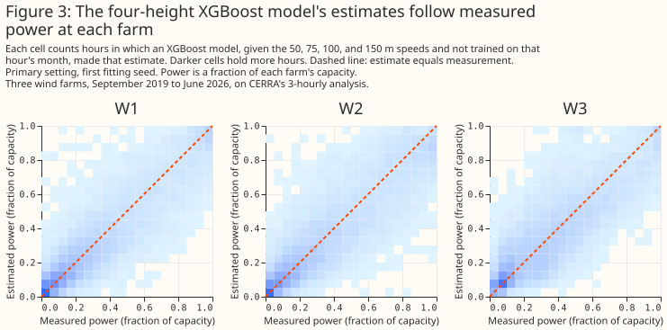

# At three wind farms, a second CERRA wind height gives most of the gain from using several heights

## Summary

**At three wind farms in Lincolnshire, an XGBoost model given the Copernicus regional reanalysis for
Europe's (CERRA's) wind speed at 10 m and at 100 m has a mean absolute error different by -0.319
points [-0.374, -0.270] from one given the 100 m speed alone.** The comparison is exploratory. CERRA
gives wind speed at 10, 50, 75, 100, and 150 m every 3 hours, on a 5,500 m grid, and the study fits
one XGBoost model per wind farm to predict the farm's hourly power from one choice of those speeds.
Each error is a percentage of the farm's capacity (its 99th percentile of metered output), each
difference is in percentage points of capacity, written "points", and each bracketed pair is a 95%
interval. The rows are 53,107 farm-hours between 17 September 2019 and 30 June 2026, where a
farm-hour is one wind farm's power in one hour. The comparison the study planned in advance, four
heights (50, 75, 100, and 150 m) against 100 m alone, gives a difference in error of -0.394 points
[-0.448, -0.344], which is 5% of the 100 m error, in every one of the five folds. CERRA is a
reanalysis, so every number describes how well CERRA's wind explains power that has already been
generated, and none describes forecast skill.

**Most of that gain comes from having a second height, and the study does not show that more heights
beat two.** The 10 m and 100 m pair gives 76% to 83% of the fall in error that four heights give and
76% to 78% of the fall that five heights give, at the two XGBoost settings. That share is a ratio of
point estimates and has no interval. Four heights differ from the pair by -0.074 points [-0.097,
-0.051], and five heights by -0.104 points [-0.121, -0.086], but both comparisons were chosen after
the results were seen, so each is a lead to follow up rather than a finding. The 10 m and 100 m
pair also differs from the 10 m speed alone by -0.370 points [-0.411, -0.332], another post hoc
comparison. The planned comparison of the 10 m speed with the 100 m speed gives -0.050 points
[-0.123, +0.025], which is not statistically significant at the 5% level. Its Bonferroni-adjusted
interval, [-0.145, +0.046], does not rule out the 100 m speed having an error up to 0.145 points
lower than the 10 m speed. The page draws no conclusion about wind direction, because the study
downloaded CERRA's speed only.


**Three scoped recommendations follow from the evidence below.**

- **To describe past wind at these three farms from CERRA, read at least two heights.** The 10 m and
  100 m speeds together have a lower error than either alone (-0.319 points against 100 m and
  -0.370 points against 10 m, both exploratory). The evidence does not say which second height is
  best, because the pair tested always held the 10 m speed.
- **Do not read a mean of near-100 m heights as a substitute for separate heights.** The planned
  mean of the 75, 100, and 150 m speeds changes the error by -0.050 points [-0.070, -0.032], and
  the 50, 75, 100, and 150 m speeds as separate columns differ from that mean by -0.344 points
  [-0.393, -0.294] (exploratory).
- **Do not read the page as a statement about forecasting.** CERRA is an analysis of the past, so
  the page says nothing about forecast skill, and it says nothing about wind direction.

> **How this page was made.** The research question came from a human. Everything else — the code
> behind every result, the analysis, the figures, and the text — was written by Claude, Anthropic's
> AI model. This page and its study scripts were written by Claude Sonnet 5.5, reusing shared study
> code written by Claude Opus 5.5, Claude Opus 5, and Claude Sonnet 5. Two independent reviews by
> Claude Opus checked the method, the results, and the prose adversarially.

## Key findings

- **Four CERRA heights change the error by -0.394 points against the 100 m speed alone, a planned
  comparison.** See [A second height gives most of the gain from using several
  heights](#a-second-height-gives-most-of-the-gain-from-using-several-heights).
- **The 10 m and 100 m speeds together give 76% to 83% of that fall, an exploratory finding.** See
  the same section.
- **The 10 m speed against the 100 m speed is a null result, with a difference of up to 0.145 points
  not ruled out.** See [The planned comparison of 100 m with 10 m is
  null](#the-planned-comparison-of-100-m-with-10-m-is-null).
- **The mean of three heights and the fifth height each change the error by a small amount.** See
  [The mean of three heights and the fifth height add
  little](#the-mean-of-three-heights-and-the-fifth-height-add-little).
- **Four shuffled columns raise the error by 0.089 points, and a synthetic target shows that the
  XGBoost models can use a second height.** See [The negative and positive
  controls](#the-negative-and-positive-controls).
- **The checks made before the fits found no step in the CERRA record and no better power-hour
  offset than the centred hour.** See [The checks before the fits](#the-checks-before-the-fits).

## Introduction

**The question is which of CERRA's wind heights an XGBoost model should be given to describe a wind
farm's past power, and whether blending the heights beats reading 100 m alone.** CERRA is the
Copernicus regional reanalysis for Europe, produced by a consortium led by the Swedish
Meteorological and Hydrological Institute for the Copernicus Climate Change Service, which the
European Centre for Medium-Range Weather Forecasts implements. A reanalysis re-runs a weather model
over past years with the observations of each period, so every value is an analysis of a past hour
and no value is a forecast. The Copernicus Climate Data Store serves CERRA's wind at 10 m from one
dataset,
[`reanalysis-cerra-single-levels`](https://cds.climate.copernicus.eu/datasets/reanalysis-cerra-single-levels),
and at 50, 75, 100, and 150 m from another,
[`reanalysis-cerra-height-levels`](https://doi.org/10.24381/cds.38b394e6). The other studies under
[past weather](index.md) compare weather products with each other. This study holds the product
fixed and varies which of its heights the XGBoost model reads.

**A hub-height wind speed is the natural input for a wind farm's power, but a reanalysis serves
several heights, and it is not obvious that 100 m is the only one worth reading.** The wind speed at
one height differs from the speed at hub height by an amount that depends on how quickly the wind
strengthens with height, and a tree-based XGBoost model can combine several heights to estimate that
change. A later decision about which CERRA heights to ingest for past weather can cite the result.
The study also answers a narrower question, how much 100 m wind adds to 10 m wind in a simple
XGBoost model.

| Property | CERRA's wind |
|---|---|
| Heights | 10, 50, 75, 100, and 150 m |
| Quantity | Wind speed; the study downloaded no direction |
| Time step | Every 3 hours (00, 03, ..., 21 UTC), an analysis |
| Grid | 5,500 m, read at each farm's nearest cell |
| History used | 1 September 2019 to 30 June 2026 |
| Source of the 10 m speed | `reanalysis-cerra-single-levels`, a surface diagnostic |
| Source of the other four speeds | `reanalysis-cerra-height-levels`, values interpolated to fixed heights above ground |

## Data and methods

**The rows are the 3-hourly farm-hours on which every column set has a value.** There are 53,107
farm-hours between 17 September 2019 and 30 June 2026, and each of the three farms has at least
15,950 of them. A farm-hour's power is the mean of the half-hourly readings in the hour centred on
the CERRA time, and any hour holding a half-hour of exactly zero is dropped, from the target alone,
so that every column set is scored on the same rows. The wind farms appear only as W1 to W3. Each
farm reads CERRA at its nearest grid cell, and the loader stops if that cell sits on the edge of the
downloaded crop. The 3-hourly rows mean `hour_of_day` takes only 8 values. Each farm's capacity is
the `effective_capacity_mw` column of the roster metadata (`NGED/metadata.parquet`, last written on
5 September 2026), one 99th-percentile value per farm over its whole observed history.

**Each XGBoost model is fitted per wind farm, on two shared features plus five wind columns.** The
two shared features are `hour_of_day` and `day_of_year`. Every column set has 7 columns in total, so
that width does not decide a comparison: a set with fewer than five real wind columns is padded with
monotone transforms of one of its real columns (the square, the square root, the log of one plus the
speed, and the cube), which a tree cannot use to learn anything new. The wind columns of each
column set are:

| Column set | Real wind columns | Padding |
|---|---|---|
| `speed_10m` | 10 m | 4 transforms of 10 m |
| `speed_100m` | 100 m | 4 transforms of 100 m |
| `speed_10m_100m` | 10 m and 100 m | 3 transforms of 100 m |
| `mean_near_100m` | mean of 75, 100, and 150 m | 4 transforms of the mean |
| `levels_50_to_150` | 50, 75, 100, and 150 m | 1 transform of 100 m |
| `levels_all` | all five heights | none |
| `speed_100m_noise` | 100 m | 4 columns of other months' 10, 50, 75, and 150 m speeds |

**Folds, intervals, and the two XGBoost settings follow the [Methods page](methods.md).** Each
XGBoost model is trained on some blocks of whole months and scored on the others, in 5 folds per
farm. The 2,000 resamples of whole calendar months, each with one of three fitting seeds, give the
95% intervals. Every fit ran on the CPU, with no column subsampling and no early stopping. The
primary setting is `max_depth` 6, and the second setting is a shallower, more heavily regularised
one. Every planned comparison was also fitted at the second setting.

**"Planned" and "exploratory" have one meaning each on this page.** A comparison is planned when it
was written into the study plan before any fit, and every other comparison is exploratory. Four
exploratory comparisons were added after the results were seen, so the page calls them post hoc.
The four planned comparisons are:

1. the `speed_100m` column set minus the `speed_10m` column set;
2. `mean_near_100m` minus `speed_100m`;
3. `levels_50_to_150` minus `speed_100m`;
4. `levels_all` minus `levels_50_to_150`.

Each difference is the error of the first column set minus the error of the second, so a negative
difference means the first column set has the lower error. The four post hoc comparisons are
`levels_50_to_150` minus `speed_10m_100m`, `levels_all` minus `speed_10m_100m`, `speed_10m_100m`
minus `speed_10m`, and `levels_50_to_150` minus `mean_near_100m`. The plan is in
the repository's git history (commits `cdc79928` and `5e90f63c`).

**The test covers the month-to-month weather and the fitting seed, and not differences between wind
farms.** A difference is called statistically significant at the 5% level when its 95% interval lies
wholly on one side of zero. The three farms share their weather, so the intervals describe these
three farms. An exploratory comparison with no real effect behind it has a nominal 5% chance of
reaching statistical significance at the 5% level, and the number of such spurious results on the
page is unknown, because the number of comparisons with no real effect is unknown. The comparisons
share their months, so spurious results cluster. The page corrects for multiple comparisons in one
place: each planned comparison also has a 98.75% interval, which is a Bonferroni correction for the
four planned comparisons. No exploratory or post hoc comparison is corrected.

**Two controls check the setup.** The negative control is the `speed_100m_noise` column set: the 100
m speed plus four columns, each holding the 10, 50, 75, or 150 m speed from another month of the
same farm, so that the columns look like wind and say nothing about the hour. Every column set has 7
columns, so the control measures four shuffled columns replacing the four inert padding columns of
`speed_100m`. The positive control is a synthetic target: a cubic power curve (cut-in 3 m/s, rated
12 m/s) of the wind speed at 120 m, which is interpolated linearly in log-height between the 100 m
and 150 m speeds, plus noise of 1% of capacity. On that target only `speed_100m` and
`levels_50_to_150` were fitted, and the run stops unless `levels_50_to_150` has the lower error.

**Two checks run before any fit, and either would have stopped the run.** The era check tests
whether CERRA's record steps at some month, because the record was produced in several streams. For
each height's ratio to the 100 m speed and for each height's own monthly mean speed, the check
removes the mean of each calendar month, then compares the mean of the next 12 months with the mean
of the previous 12 months, and divides by the standard error that independent months would give. The
run stops if any such z-score exceeds 5. The check has two limits: a 12-month window cannot test the
first or the last 12 months of the record, and the standard error assumes that months are
independent of one another. The power-hour scan refits the `speed_100m` column set with the power
hour shifted by -1 to 3 half-hours, on the rows every shift shares, and stops if another shift beats
the centred one by more than the seed spread.

## Results

### Each XGBoost model has an error of 7.950 to 8.462 points, and on a synthetic target the models can use a second height

**The seven column sets have pooled errors between 7.950 and 8.462 points of capacity, and the
intervals of all seven overlap.** The overlap comes from the months of weather that all seven share,
so Figure 1 says nothing about which set is better, and the paired differences in Figure 2 do. The
seven errors and their 95% intervals are in the table below, and each farm's own error is in the
second table.

| Column set | Error (points of capacity) | 95% interval |
|---|---|---|
| `speed_10m` | 8.424 | [8.078, 8.752] |
| `speed_100m` | 8.373 | [8.044, 8.699] |
| `speed_10m_100m` | 8.054 | [7.716, 8.377] |
| `mean_near_100m` | 8.323 | [7.993, 8.646] |
| `levels_50_to_150` | 7.980 | [7.646, 8.297] |
| `levels_all` | 7.950 | [7.612, 8.271] |
| `speed_100m_noise` | 8.462 | [8.116, 8.795] |

| Column set | W1 | W2 | W3 | Second setting, all farms |
|---|---|---|---|---|
| `speed_10m` | 7.333 | 8.714 | 9.333 | 8.341 |
| `speed_100m` | 7.270 | 8.750 | 9.196 | 8.303 |
| `speed_10m_100m` | 7.010 | 8.330 | 8.926 | 8.018 |
| `mean_near_100m` | 7.225 | 8.696 | 9.142 | 8.251 |
| `levels_50_to_150` | 6.989 | 8.209 | 8.844 | 7.959 |
| `levels_all` | 6.937 | 8.215 | 8.802 | 7.939 |
| `speed_100m_noise` | 7.336 | 8.780 | 9.379 | 8.400 |

**On the synthetic target, `levels_50_to_150` has an error of 0.756 points [0.747, 0.766] against
1.707 points [1.613, 1.805] for `speed_100m`, a difference of -0.951 points [-1.043, -0.861], in
all 5 folds.** The synthetic target needs the speed at 120 m, which is a blend of the 100 m and 150
m speeds, so the result shows that the XGBoost models can learn a blend of heights when the target
needs one. The result says nothing about whether the real wind farms' power needs one. Figure 3
shows the estimates of the four-height XGBoost model on the real target.



### A second height gives most of the gain from using several heights

**Four CERRA heights change the error by -0.394 points [-0.448, -0.344] against the 100 m speed
alone, and the result is planned.** The 98.75% interval is [-0.461, -0.330], all 5 folds have the
same sign, and the result keeps its sign and size at the second setting, where the difference is
-0.345 points [-0.390, -0.300]. The table below lists each planned comparison at the primary
setting. The error of the first column set and the error of the second are beside each difference.

| Comparison | Error of first | Error of second | Difference (points) | 95% interval | 98.75% interval | Folds with the same sign |
|---|---|---|---|---|---|---|
| `speed_100m` − `speed_10m` | 8.373 | 8.424 | -0.050 | [-0.123, +0.025] | [-0.145, +0.046] | 4 of 5 |
| `mean_near_100m` − `speed_100m` | 8.323 | 8.373 | -0.050 | [-0.070, -0.032] | [-0.075, -0.029] | 5 of 5 |
| `levels_50_to_150` − `speed_100m` | 7.980 | 8.373 | -0.394 | [-0.448, -0.344] | [-0.461, -0.330] | 5 of 5 |
| `levels_all` − `levels_50_to_150` | 7.950 | 7.980 | -0.029 | [-0.042, -0.016] | [-0.046, -0.013] | 5 of 5 |

**The gain is mostly a second height, an exploratory and post hoc reading.** The `speed_10m_100m`
column set, with two heights, changes the error by -0.319 points [-0.374, -0.270] against
`speed_100m` in all 5 folds, and the four heights change it by -0.394 points and the five heights by
-0.423 points [-0.478, -0.370]. The share of each fall that the two-height set gives is below.

| Setting | Column set | Fall in error against `speed_100m` (points) | Share given by the two heights |
|---|---|---|---|
| primary | `speed_10m_100m` | 0.319 | 100% |
| primary | `levels_50_to_150` | 0.394 | 81% |
| primary | `levels_all` | 0.423 | 76% |
| second | `speed_10m_100m` | 0.285 | 100% |
| second | `levels_50_to_150` | 0.345 | 83% |
| second | `levels_all` | 0.365 | 78% |

**The post hoc comparisons against the two-height column set are small, and none is a finding.**
`levels_50_to_150` minus `speed_10m_100m` is -0.074 points [-0.097, -0.051], with the same sign in
all 5 folds, and -0.060 points [-0.076, -0.043] at the second setting. `levels_all` minus
`speed_10m_100m` is -0.104 points [-0.121, -0.086], and -0.080 points [-0.092, -0.068] at the second
setting. These comparisons were added after the results were seen, with no correction for that. Two
further post hoc comparisons are the two-height set minus `speed_10m`, -0.370 points [-0.411,
-0.332], and four heights minus the mean of three heights, -0.344 points [-0.393, -0.294], both in
all 5 folds. The per-farm table below lists the estimates for the first two comparisons. The page
draws no conclusion from the split, because each farm's interval is unadjusted and three farms are
few.

| Comparison | W1 | W2 | W3 |
|---|---|---|---|
| `levels_50_to_150` − `speed_10m_100m` | -0.020 [-0.053, +0.013] | -0.121 [-0.152, -0.091] | -0.082 [-0.127, -0.036] |
| `levels_all` − `speed_10m_100m` | -0.073 [-0.098, -0.048] | -0.116 [-0.142, -0.090] | -0.125 [-0.162, -0.086] |

### The planned comparison of 100 m with 10 m is null

**The planned comparison of `speed_100m` against `speed_10m` gives a difference of -0.050 points
[-0.123, +0.025], which is not statistically significant at the 5% level, and its 98.75% interval is
[-0.145, +0.046].** The interval does not rule out an XGBoost model given the 100 m speed having an
error up to 0.145 points lower than one given the 10 m speed, and does not rule out an error up to
0.046 points higher. At the second setting the difference is -0.038 points [-0.106, +0.031], with a
98.75% interval of [-0.126, +0.051]. Four of the five folds have the negative sign.

**The 10 m and 100 m speeds come from two CERRA products, so the comparison is between a surface
diagnostic and a value interpolated to a fixed height as well as between two heights.** The 10 m
speed comes from `reanalysis-cerra-single-levels` and the 100 m speed from
`reanalysis-cerra-height-levels`. A difference between the two could therefore come from how each
product derives its speed, and the study has no way to separate that from the height.

### The mean of three heights and the fifth height add little

**The planned mean of the 75, 100, and 150 m speeds changes the error by -0.050 points [-0.070,
-0.032] against the 100 m speed, and the fifth height changes it by a further -0.029 points [-0.042,
-0.016].**
Both are statistically significant at the 5% level after the Bonferroni correction, with 98.75%
intervals of [-0.075, -0.029] and [-0.046, -0.013], and both have the same sign in all 5 folds. Both
are small. The four heights as separate columns differ from the mean of three of them by -0.344 points
[-0.393, -0.294], a post hoc comparison. The fifth height's gain is under 1% of the error of the
four-height set. At the second setting the two differences are -0.052 points
[-0.066, -0.038] and -0.020 points [-0.029, -0.011].

### The negative and positive controls

**Four shuffled columns raise the error by 0.089 points [0.051, 0.128] against four inert padding
columns, in all 5 folds, and by 0.096 points [0.069, 0.126] at the second setting.** Every column
set has 7 columns, so the negative control measures shuffled columns replacing inert padding, and
not the effect of width. The control shows that columns holding no information about the hour can
still move the error, by an amount larger than the 0.029 point gain of the fifth height. The
positive control is in the first Results section: the same XGBoost models find the gain of a blend
when the synthetic target needs one.

### The checks before the fits

**The era check found no step, and the power-hour scan found no better offset than the centred
hour.** The largest z-score of any height's ratio to the 100 m speed is 2.56, at 150 m in August
2021, and the largest of any height's own monthly mean speed is -3.08, at 150 m in December 2020.
The level steps at December 2020 have the same sign at every height, which is what a weather
anomaly gives and not what a change of production stream gives. Both are below the gate of 5. The
scan gave errors of 9.045, 8.719, 8.615, 8.787, and 9.116 points at shifts of -1, 0, 1, 2, and 3
half-hours, and the centred hour is shift 1.

### The CERRA documentation does not give the stream boundary dates

**The study did not find the dates where CERRA's production streams join.** The [product user
guide](https://confluence.ecmwf.int/x/WFQ7E) says the production was suspended after June 2021
until a contract for near-real-time updates was in place, so the record after June 2021 comes from
a later extension. The [dataset page](https://doi.org/10.24381/cds.38b394e6) does not give the
stream boundary dates in the parts read. The era check therefore rests on the data alone, and a
join too small for a 12-month window to detect would not have stopped the run.

### The step statistic at July 2021

**The step statistic at July 2021, the first month after the documented pause, is at most 1.81
in size for any height's ratio to 100 m and at most 0.32 for any height's own level.** The ratio
z-scores are -1.07 at 10 m, -1.47 at 50 m, -1.49 at 75 m, and +1.81 at 150 m. The level z-scores
are -0.04 at 10 m, +0.03 at 50 m, +0.11 at 75 m, +0.18 at 100 m, and +0.32 at 150 m.

## Discussion: what to use

**To describe past wind at these three farms from CERRA, an XGBoost model should be given at least
two heights.** The planned tests do not separate the 10 m and 100 m pair from four heights. A post
hoc comparison favours four heights by -0.074 points [-0.097, -0.051], with the same sign in all 5
folds and at both settings. The study did not test other pairs. What would change the recommendation
is a result on a pair that leaves out the 10 m speed, or on a farm where the wind's change with
height differs from these three.

**A mean of near-100 m heights is not a substitute for separate heights.** The mean changes the
error by -0.050 points against the 100 m speed, and four heights given separately differ from the
mean by -0.344 points [-0.393, -0.294], a post hoc comparison.

**The page recommends nothing about forecasting.** CERRA is an analysis of past hours, so a result
about how well it explains past power does not carry to a forecast at any lead.

## Limitations

**The results describe three wind farms in Lincolnshire, and the intervals describe those farms
only.** The farms share their weather, so the intervals resample months and seeds, not farms.

- **The gap between the 10 m and 100 m speeds mixes height and product.** The 10 m speed is a
  surface diagnostic from one CERRA product, and the other four speeds come from another.
- **The study downloaded speed only, so no column set holds direction.** The wind page's XGBoost
  models carry direction as sine and cosine, so the errors here are not comparable in level with the
  errors there.
- **The 3-hourly rows hold 8 values of `hour_of_day`,** and the rows are one hour in three, so the
  XGBoost models see fewer rows than an hourly study would give them.
- **No land-sea mask was read.** A nearest cell near the coast could be influenced by the sea, and
  the study has not checked whether any of the three farms' cells is.
- **The era check has the limits stated in the methods,** and the documentation did not give the
  stream boundary dates in the parts read.
- **The four post hoc comparisons were chosen after the results were seen,** and no exploratory row
  is corrected for multiple comparisons.
- **Each farm's capacity is one value from the roster metadata,** computed over the farm's whole
  history, including the months a fold holds out.

## Scope

**The page says nothing about forecast skill, wind direction, other reanalyses, other heights than
the five CERRA serves, or regions other than Lincolnshire.**

- **Forecasting is not covered.** CERRA is a reanalysis.
- **Direction is not covered.** The study downloaded speed only.
- **Other weather products are not covered.** The [wind page](wind.md) compares products.
- **Offshore wind and other regions are not covered.**

## Data and code availability

**Every input except the wind farms' metered output, coordinates, and capacity table is public, and
the code is in the repository at the commit that merged this page.** The code is in
`studies/beam_diffuse_split/` (`cerra_wind_levels.py`, `cerra_wind_levels_shear.py`, and
`cerra_wind_levels_charts.py`) and in `packages/studies/`.

- **Public inputs:** CERRA's wind speed from the Copernicus Climate Data Store, at 10 m from
  [`reanalysis-cerra-single-levels`](https://cds.climate.copernicus.eu/datasets/reanalysis-cerra-single-levels)
  and at 50, 75, 100, and 150 m from
  [`reanalysis-cerra-height-levels`](https://doi.org/10.24381/cds.38b394e6).
- **Private inputs:** the three farms' metered output and coordinates, and the capacity table. The
  farms appear only as W1 to W3.
- **Planned comparisons:** recorded in the study plan, in the repository's git history at commits
  `cdc79928` and `5e90f63c`.
- **XGBoost:** version 3.4.1, with `tree_method` `hist`, the objective `reg:absoluteerror`, and 4
  threads per fit, two fits at a time. The primary setting is `max_depth` 6, `learning_rate` 0.05,
  `subsample` 0.8, `min_child_weight` 20, `reg_lambda` 1, and 500 boosting rounds. The second
  setting is `max_depth` 4, `learning_rate` 0.03, `subsample` 0.8, `min_child_weight` 50,
  `reg_lambda` 5, and 1,200 rounds. Neither setting subsamples columns or uses early stopping, and
  each fit is repeated with the seeds 0, 1, and 2.
- **Device:** every fit ran on the CPU.

## Reproducing the figures

**Run the commands below in order.** The fit script writes its report and saved losses under
`data/studies/cerra_wind_levels/`, and the second script reads those losses and writes its report
under `data/studies/cerra_wind_levels_post_hoc/`. That report holds the first report followed by the
post hoc sections, and `check_page_numbers.py` checks the page against it. The command checks every
results section and the Key findings. The Summary was checked the same way, on a copy of the page
without its disclaimer, because the disclaimer's model version numbers are not in the report.

```bash
uv run python studies/beam_diffuse_split/cerra_wind_levels.py
uv run python studies/beam_diffuse_split/cerra_wind_levels_shear.py
uv run python studies/beam_diffuse_split/cerra_wind_levels_charts.py
npx svgo@4 --multipass --precision=1 --final-newline docs/studies/assets/cerra_wind_levels_*.svg
uv run python studies/beam_diffuse_split/check_page_numbers.py \
    docs/studies/past-weather/cerra-wind-levels.md \
    data/studies/cerra_wind_levels_post_hoc/report.md \
    --section "## Key findings" \
    --section "### Each XGBoost model has an error of 7.950 to 8.462 points, and on a synthetic target the models can use a second height" \
    --section "### A second height gives most of the gain from using several heights" \
    --section "### The planned comparison of 100 m with 10 m is null" \
    --section "### The mean of three heights and the fifth height add little" \
    --section "### The negative and positive controls" \
    --section "### The checks before the fits" \
    --section "### The step statistic at July 2021"
```
