# In ERA5, cloud variables explain most of the solar output that its solar radiation misses

**At six solar farms in Lincolnshire, giving an XGBoost model ERA5's cloud variables as well as its solar radiation cut the error in the farms' hourly output by about 7%, and giving it every ERA5 variable cut the error by about 12%.** ERA5 is the European Centre for Medium-Range Weather Forecasts' (ECMWF) estimate of past weather. The cloud variables carry most of the gain, and the other variables add little more. ERA5 is a reanalysis and not a forecast, and the review found signs that part of the gain comes from ERA5's cloud fields having seen observations that a forecast cannot see, so the page does not say that a forecast would gain as much. The [matched-lead IFS study](ifs-solar-variables.md) tests that on forecasts.

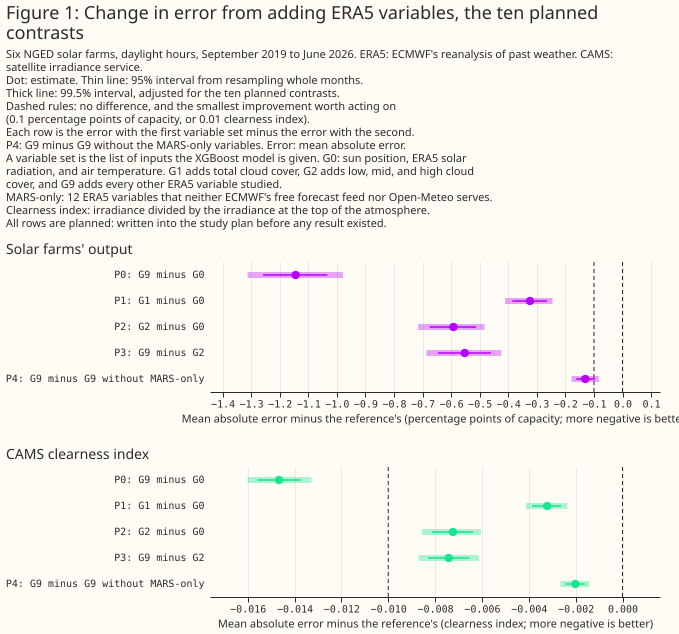

- **Which ERA5 variables help predict solar farm output?** The cloud variables.
  Adding total cloud cover (G1) lowers the mean absolute error from 9.22% to 8.89% of capacity (−0.32 points [−0.39, −0.26]). Adding low, mid, and high cloud cover as well (G2) lowers it by 0.59 points [−0.68, −0.51]. Every variable together (G9) lowers it by 1.14 points [−1.26, −1.03], or 12.4%. Both figures are planned contrasts, and each beats the smallest improvement worth acting on at the adjusted level (Figure 1).
- **Does anything beyond the cloud layers help?** Yes, but the credit cannot be split cleanly.
  Going from G2 to G9 lowers the error by a further 0.55 points [−0.65, −0.46]. Cloud water and cloud base height give the largest single step (0.33 points), and the other groups each add 0.00 to 0.08 points. Removing any one group from the full set costs at most 0.07 points, because the groups carry overlapping information (Figures 7 and 10).
- **Is it worth fetching the 12 variables that ECMWF serves only through its MARS archive?** Unresolved.
  The 12 MARS-only variables lower the error by 0.13 points [−0.16, −0.10] at the main hyperparameter setting and 0.11 [−0.14, −0.08] at the second. The adjusted intervals straddle the smallest improvement worth acting on (0.1 points), so the pre-set rule gives no recommendation. The [IFS study](ifs-solar-variables.md) puts the gain beside the gain from adding a second forecast.
- **Does the gain hold on the satellite irradiance target?** In relative terms, yes.
  On CAMS's clearness index the full set lowers the error by 14.5%, against 12.4% for output. The CAMS verdicts look weaker only because the CAMS smallest effect is stricter relative to its error.
- **Does aerosol help?** Not detectably. A gain of 0.1 points of capacity is ruled out, and the clear and dusty hours are too few to say.
- **Does the extra detail help the XGBoost model say how uncertain it is?** No.
  At the same coverage, one fixed-width interval is no wider than the quantile fits' intervals.
- **What can the study support?** Statements about ERA5 at six farms in one county from September 2019 to June 2026. Three limits matter most: ERA5 is not a forecast, the farms share weather, and the ladder's order affects how credit is split.

> **How this page was made.** The research question came from a human. Everything else — the code behind every result, the analysis, the figures, and the text — was written by Claude, Anthropic's AI model (for this page, Claude Sonnet 5.5). Several independent Claude reviewers have checked the method, the evidence, and the prose adversarially.

## Key findings

- **Cloud cover, cloud layers, and cloud water carry about 0.9 of the 1.14 points of gain.** Humidity and haze (G7) add 0.05 points beyond the groups below them, and snow and albedo (G8) add nothing detectable ([Figure 7](#every-variable-set-scored-on-the-same-hours)).
- **The gain is largest around solar noon, steps up between 09 and 10 UTC, and is absent or negative at low sun.** The step at 09 to 10 UTC is where ERA5's cloud fields move to the next analysis window, so part of the gain may be a timing advantage of a reanalysis ([Figure 11](#the-gain-changes-with-the-hour-of-day)).
- **Twenty-nine columns of shuffled weather made the error 0.11 points worse.** Wide variable sets start at a disadvantage, so their gains are, if anything, understated ([Figure 7](#every-variable-set-scored-on-the-same-hours)).
- **Output is far better explained when CAMS irradiance is added.** The positive control lowers the error by 3.65 points [−3.84, −3.45], so the instrument can detect a large effect ([Figure 7](#every-variable-set-scored-on-the-same-hours)).
- **The gain is similar in every season and cloud regime** (11% to 15% of the error at the farms' output) ([Figure 8](#the-gain-is-similar-in-every-season-and-cloud-regime)).
- **Aerosol from CAMS's reanalysis lowers the error by 0.03 points [−0.05, 0.00].** A gain of 0.1 points is ruled out at the 95% level ([Figure 14](#aerosol-adds-little-and-dusty-hours-are-too-few-to-say)).
- **The quantile intervals are too narrow in both tails, and the extra variables narrow them further** ([Figure 13](#the-extra-variables-do-not-improve-the-uncertainty-estimates)).

## Introduction

**The question is which ERA5 variables, beyond solar radiation and temperature, help explain how much power a solar farm produces.** ERA5 holds 27 single-level variables that bear on sunshine. A forecast service chooses which variables to ingest, and each costs engineering effort. ERA5 is the cheapest place to screen the variables, because it has six years of hourly values for every one of them. A forecast archive has far fewer.

| Group | Adds | ERA5 variables |
|---|---|---|
| G0 | the minimal set | downward solar radiation (`ssrd`), 2 m air temperature (`t2m`), sun position |
| G1 | total cloud | `tcc` |
| G2 | cloud layers | `lcc`, `mcc`, `hcc` |
| G3 | clear-sky irradiance | `ssrdc` |
| G4 | cloud water and base | `tclw`, `tciw`, `tcslw`, `cbh` |
| G5 | direct beam | `fdir`, `cdir` |
| G6 | wind and thermal radiation | `u10`, `v10`, `strd` |
| G7 | humidity and haze | `d2m`, `tcwv`, `blh` |
| G8 | snow and albedo | `sd`, `sf`, `asn`, `fal` |
| G9 | all other ERA5 variables | `tp`, `tcrw`, `tcsw`, `cape`, `cin`, `skt`, `tco3`, `uvb`, `i10fg`, `sp`, `deg0l` |
| G10 | aerosol (not ERA5) | CAMS reanalysis aerosol optical depth, total and dust |

Each group includes every group above it. The 12 MARS-only variables are `ssrdc`, `cdir`, `tclw`, `tciw`, `tcslw`, `cbh`, `tcrw`, `tcsw`, `tco3`, `uvb`, `fal`, and `deg0l`.

## Data and methods

**The rows are 126,229 daylight hours at six farms, from September 2019 to June 2026.** Output is each farm's hourly output as a fraction of its capacity. The second target is the CAMS clearness index, which is the irradiance from the Copernicus Atmosphere Monitoring Service's satellite service divided by the irradiance at the top of the atmosphere. Every variable set is scored on exactly the same hours.

**One XGBoost model per farm is fitted for each variable set.** An XGBoost model is a gradient-boosted tree model. Folds are contiguous blocks of whole months, so a month is never in training and test sets together. The error is the mean absolute error as a percentage of the farm's capacity, from three fitting seeds. An interval comes from resampling whole months, paired across variable sets, because neighbouring farms share their weather. The page states "statistically significant at the 5% level" only for such intervals. They cover the month-to-month weather and the fitting seed, not differences between farms.

**Planned means written into the study plan before any result existed.** The plan named ten contrasts (P0 to P4 on each target) and a decision rule for the MARS variables. They are shown at the 99.5% level, adjusted for ten contrasts, and at 95%. A planned verdict needs both hyperparameter settings to agree. Every other number is exploratory: an exploratory row with no real effect behind it has a 5% chance of reaching statistical significance, the number of such rows is unknown, the rows share months so spurious results cluster, and the page does not correct for multiple comparisons.

**The controls are a negative control, a positive control, and a second hyperparameter setting.** The negative control adds 29 shuffled copies of the extra weather to G2, keeping each month's mean at each hour. The positive control adds the CAMS irradiance, which is the answer. Both settings fit every planned contrast.

**ERA5 hour conventions.** Accumulations (solar radiation, thermal radiation, precipitation) are means over the hour ending at the label. Instantaneous variables are averaged over the labels H−1 and H so the hour matches. All times are UTC.

## Results

### The data and their issues

**ERA5's cloud fields and CAMS's irradiance agree on the shape of a day and disagree in detail.** Figure 2 draws ERA5's irradiance, cloud, and cloud water beside CAMS's irradiance on three days at one farm (the clearest, most variable, and dullest by CAMS's clear-sky index; December 2024, January 2021, and February 2025).

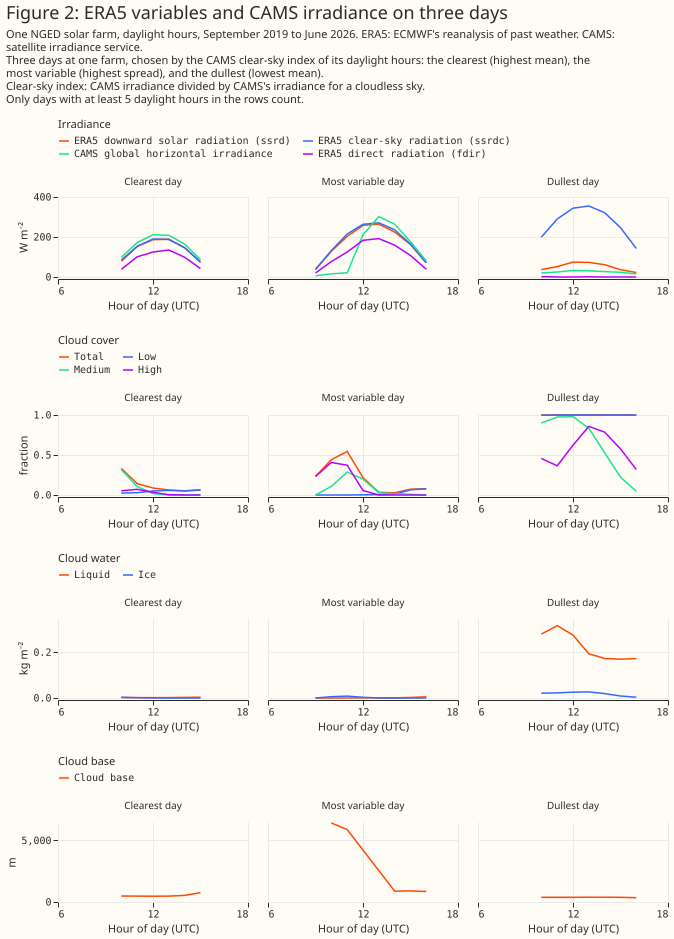

**ERA5's clear-sky bias and cloud bias show up against CAMS.** Figures 3 to 5 show where ERA5's solar radiation differs from CAMS, and how CAMS's clearness index falls with ERA5's cloud cover and cloud water.

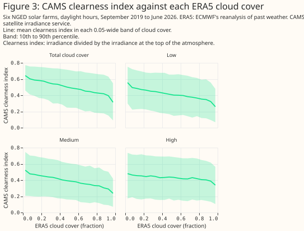

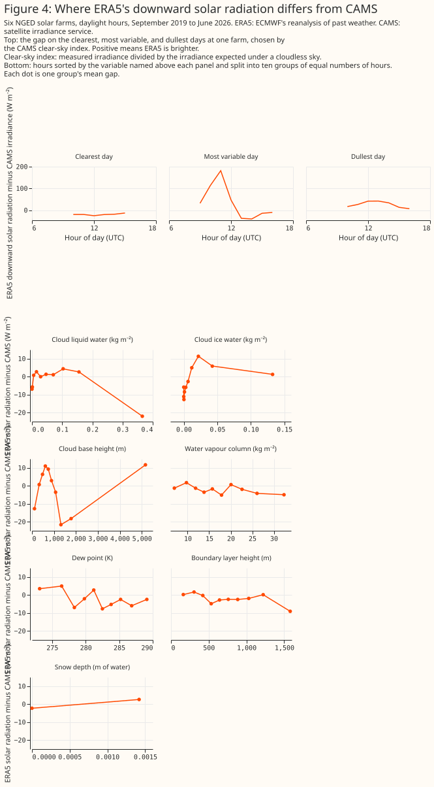

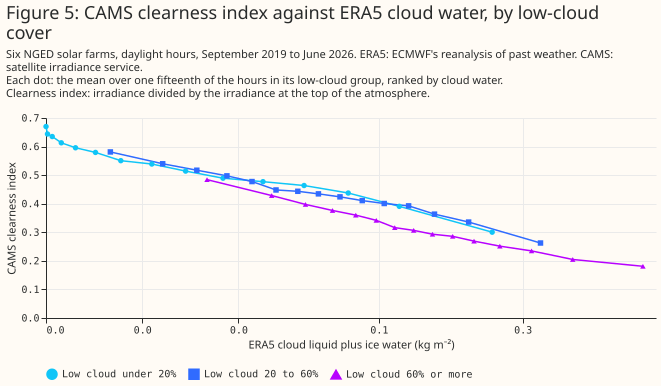

### The XGBoost models work

**Predictions follow the measured output on months the models never saw.** Figure 6 draws three days at every farm, chosen by a stated rule per farm, and each farm's error for four variable sets. The farms are labelled A to F.

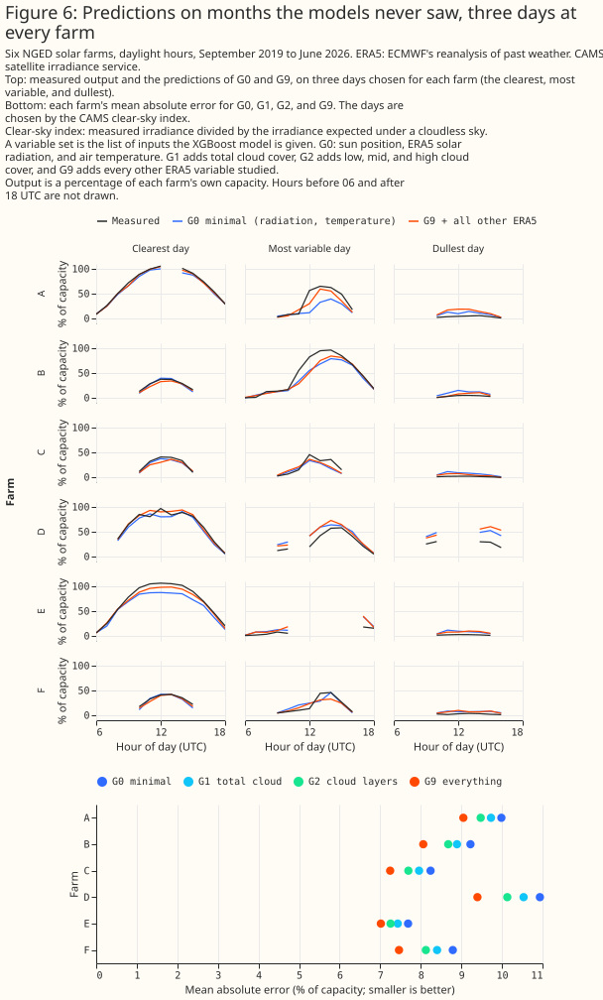

### Every variable set scored on the same hours

**The leaderboard shows the ladder, both controls, and the drop-one runs on the farms' output.** Its intervals overlap more than the paired differences of Figure 1 do, because every variable set's error rises and falls with the weather.

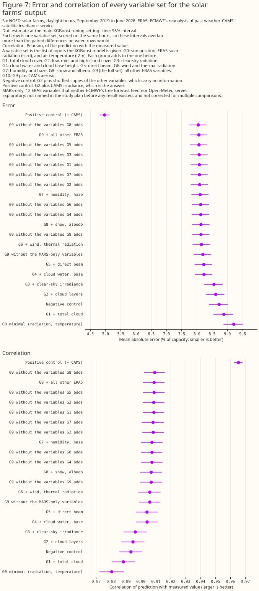

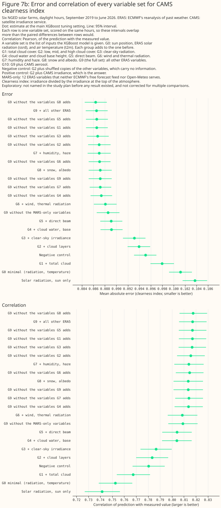

### The gain is similar in every season and cloud regime

**The full set lowers the error by 11% to 15% of the farms' output error in every season and in every ERA5 cloud regime.** Clear, broken, and overcast hours gain 13.7%, 11.2%, and 13.1% of their error. The overcast gain is larger in absolute terms.

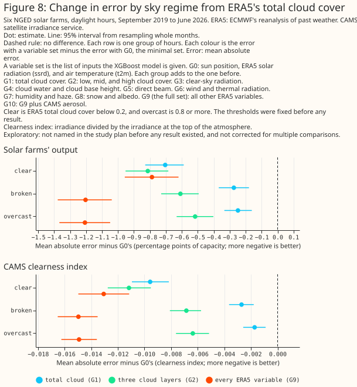

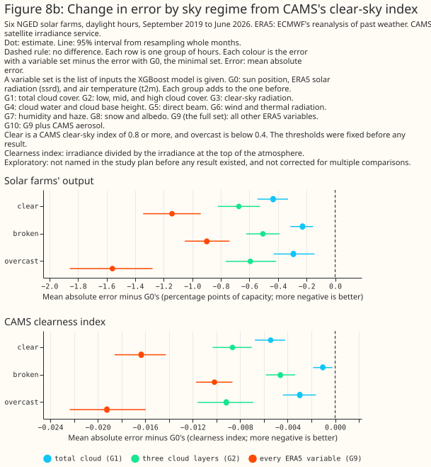

### Removing one group costs little

**Removing any one group from the full set costs at most 0.07 points on output, because the groups overlap.** Cloud water and cloud base (G4) is the least replaceable group (0.06 points). Removing snow and albedo (G8) improves the error by 0.02 points, which is about what the cost of four uninformative columns would produce. The page does not conclude that snow variables hurt. Where the order of the ladder is changed, the credit moves, so only the planned contrasts and the variable-level statements are safe.

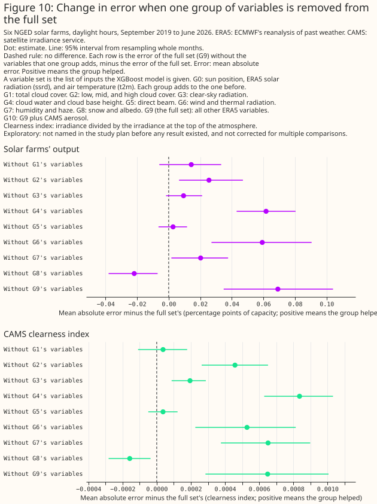

### The gain changes with the hour of the day

**The gain from cloud water and cloud base steps up between 09 and 10 UTC, and the full set is worse than the minimal set at low sun.** At the farms' output, the G4 step is 1.4% of the error at 09 UTC and 3.8% at 10 UTC. On the CAMS target it is 2.7% at 09 UTC and 4.9% at 10 UTC. The full set lowers the error by 8.1% at 09 UTC and 15.0% at 15 UTC, and is worse than the minimal set by 8% to 24% at 05, 06, 19, and 20 UTC. ERA5 builds its cloud, humidity, and wind fields from the analysis, whose window changes between 09 and 10 UTC, and builds solar radiation from the forecasts started at 06 and 18 UTC. A step at that hour is what a timing advantage of the analysis fields would produce, but an afternoon-weighted gain could also come from cloud types that vary with the time of day, so the page treats the timing as likely and unquantified.

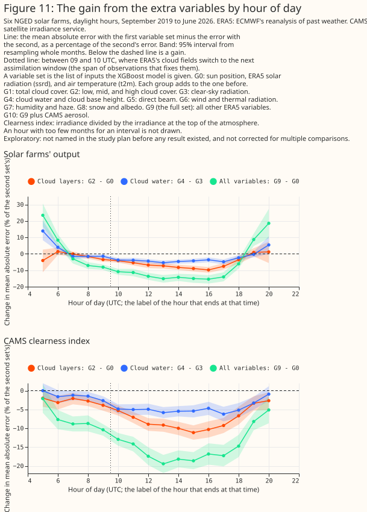

### Which variables the XGBoost model leans on

**ERA5's solar radiation takes about two thirds of the full set's importance, then the ultraviolet flux, the direct beam, and the rain and snow water.** The importance of an XGBoost model is descriptive, because correlated variables share the credit. The shuffled-copy noise line is 0.09% for the largest shuffled copy, so the top 12 variables are well above noise.

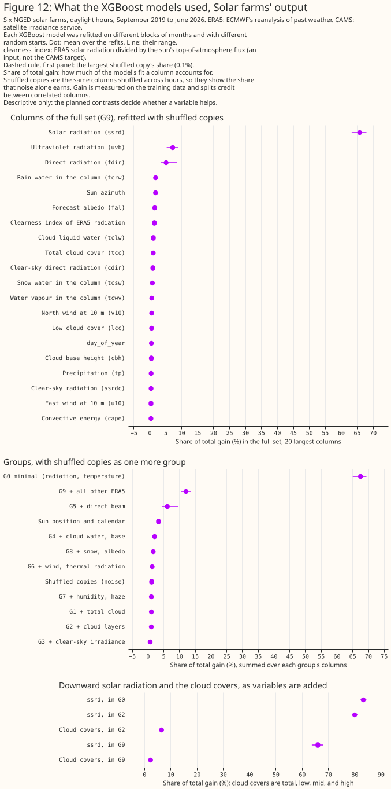

### The extra variables do not improve the uncertainty estimates

**The quantile fits' 10 to 90% intervals contain 73% to 76% of outcomes, against the 80% they aim for.** The full set's intervals are 17% narrower than the minimal set's, and contain 72.8% against 75.9%. At that coverage, one fixed-width interval from the same errors is 21.4 points of capacity wide against 22.9 for the full set's quantile fit. The extra variables therefore do not help the XGBoost model estimate its own uncertainty. The CRPS, a score for a whole forecast distribution, falls from 6.32 to 5.65, which follows the better central estimate.

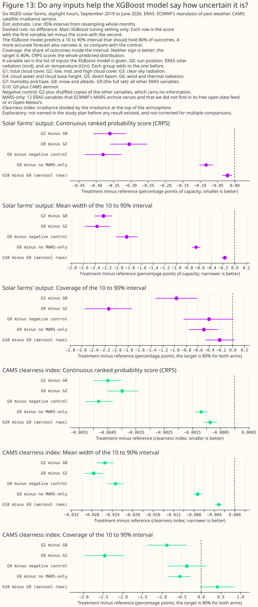

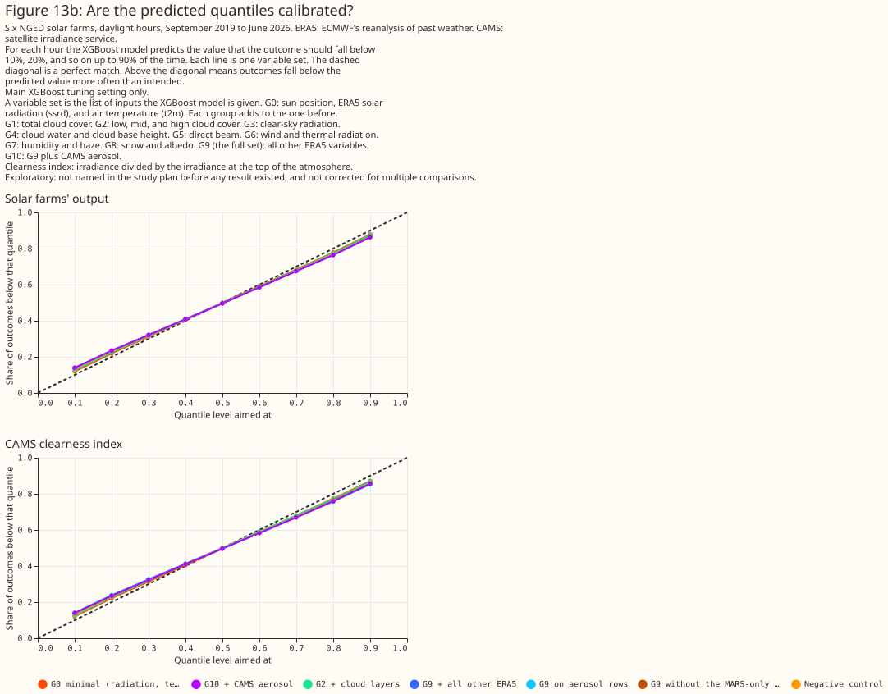

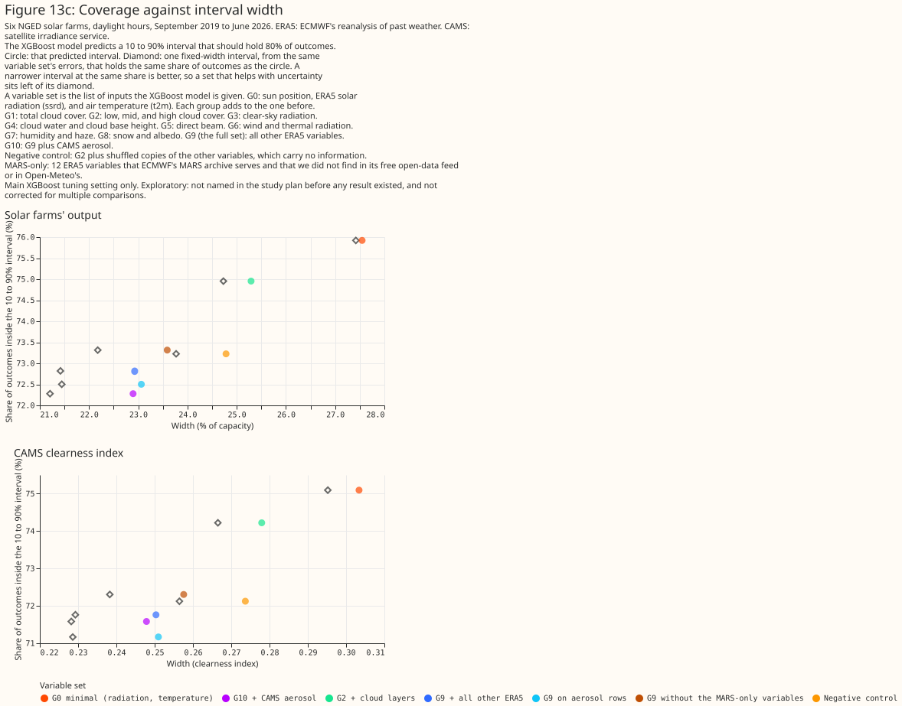

### Aerosol adds little, and dusty hours are too few to say

**On the hours that CAMS's reanalysis covers, aerosol lowers the error by 0.03 points [−0.05, 0.00].** A gain of 0.1 points is ruled out at the 95% level. In clear and dusty hours (55 days in 27 months), the interval is −0.26 to +0.29 points, so the study cannot say. The reading rule needed an interval wholly below −0.1, and gives "not shown". The CAMS target's gain of 0.001 is partly circular, because CAMS's irradiance is built with CAMS aerosol.

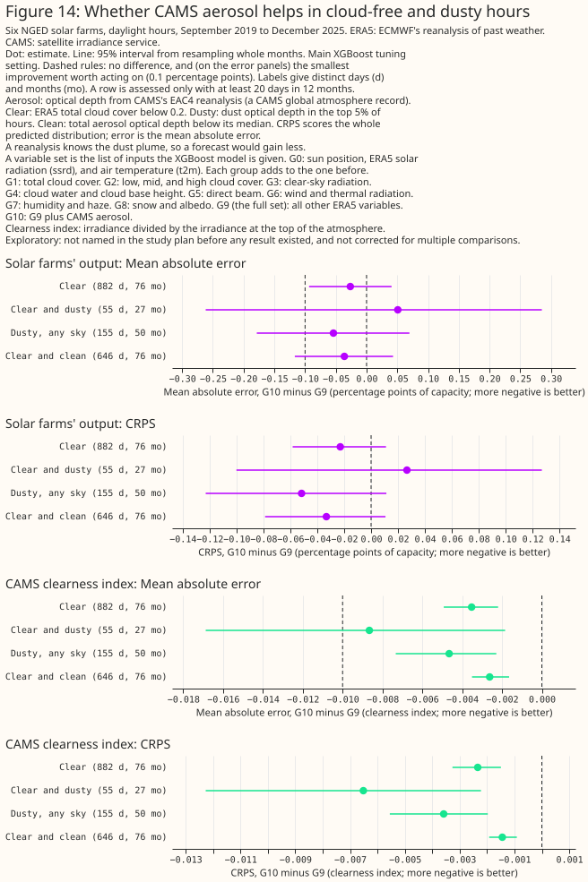

## Why cloud variables can add to ERA5's solar radiation

**The research note found three reasons that ERA5's cloud, humidity, and water variables can add to its own solar radiation.** ERA5 computes solar radiation hourly on a coarser grid, with only a monthly aerosol climatology and no cloud update between calls ([Hogan and Bozzo (2015)](https://doi.org/10.1002/2015MS000455)). ERA5 overestimates irradiance under cloud and slightly underestimates it under clear sky, and the bias grows when irradiance is turned into PV output ([Urraca et al. (2018a)](https://doi.org/10.1016/j.solener.2018.02.059); [Urraca et al. (2018b)](https://doi.org/10.1016/j.solener.2018.10.065)). The cloud fields are analysis fields and solar radiation is a forecast field, which gives the cloud fields a timing advantage. The closest published comparison used a regional weather model's own cloud, cloud water, and humidity fields to correct its irradiance at Dutch stations, and cut the error by 2% to 10% ([Bakker et al. (2019)](https://doi.org/10.1016/j.solener.2019.08.044)). The note found no paper that corrected ERA5 irradiance over Europe with humidity predictors.

## Discussion: what to use

- **Ingest total cloud cover first, and the cloud layers second, when choosing variables for a forecast of solar output.** ERA5 shows the largest gains there. Whether a forecast gains the same is untested here, and the [IFS study](ifs-solar-variables.md) tests it.
- **Do not decide on the 12 MARS-only variables from this page.** The gain of 0.11 to 0.13 points is real and may or may not exceed 0.1 points. The page gives no recommendation either way. The question is whether another forecast would give more, and the IFS study measures that.
- **Check which groups a forecast supplier can deliver before ranking them.** On 2026-10-10, ECMWF's [free open-data page](https://www.ecmwf.int/en/forecasts/datasets/open-data) listed total cloud cover, 2 m dew point, total column water vapour, 10 m wind, skin temperature, snow depth, precipitation, and downward solar and thermal radiation, and did not list the cloud layers, the cloud water and cloud base height, the direct beam, the clear-sky radiation, or the boundary layer height. [Open-Meteo's IFS service](https://open-meteo.com/en/docs/ecmwf-api) lists total and layered cloud cover, direct radiation, boundary layer height, and total column water vapour, and does not list the clear-sky radiation, the cloud water, or the cloud base height. The "not listed" entries were not rechecked against ECMWF's full parameter table.
- **Do not expect aerosol from a reanalysis to help.** A forecast would see less of a dust plume than a reanalysis does.

## Limitations

- **ERA5 is not a forecast.** Part of the gain from cloud, humidity, and wind variables may come from those fields having seen later observations than solar radiation. The hour-of-day figure fits that reading but does not prove it.
- **The ladder's order sets how credit is split.** A group that comes later gets only what the earlier groups missed.
- **Extra columns have a cost.** Twenty-nine shuffled columns made the error 0.11 points worse, so the wide sets' gains are understated.
- **Six farms in one county share weather.** The sample size is months of weather. Intervals cover that, not differences between farms or regions.
- **The snow variant was not run.** Hours with snow on the ground are excluded, so the snow and albedo variables are untested where they would matter.
- **Some worst days look like output faults.** Several of the worst days at one farm in March 2025 are clear days with almost no output, and one farm in June 2025 has one stray constrained hour. They add the same noise to every variable set, so the contrasts stand, and the report lists them.
- **The decision to add the second-setting runs came after the first results.** The runs were added by a rule fixed before the results: any contrast near the 5% line gets one.

## Scope

**The page says nothing about forecast skill, other regions, wind, or any lead time.** It tests ERA5 only, and CAMS reanalysis aerosol only for the hours that reanalysis covers.

## Data and code availability

**ERA5 comes from Google's ARCO-ERA5 copy, which matches the Copernicus Climate Data Store.** CAMS irradiance and the CAMS reanalysis aerosol come from the Copernicus Atmosphere Data Store. The farms' output is private to NGED and appears only as fractions of each farm's capacity under labels A to F. The code is in `studies/era5_solar_variables/` and `packages/studies/`. XGBoost runs on a GPU with 500 rounds, depth 6, a learning rate of 0.05, and `colsample_bytree=1`.

## Reproducing the figures

```bash
uv run python studies/era5_solar_variables/era5_ladder_build_dataset.py
uv run python studies/era5_solar_variables/era5_ladder_fit.py --max-workers 8
uv run python studies/era5_solar_variables/era5_ladder_importance.py --through-rung g9
uv run python studies/era5_solar_variables/era5_ladder_report.py
uv run --with vl-convert-python python studies/era5_solar_variables/era5_ladder_charts.py
```
