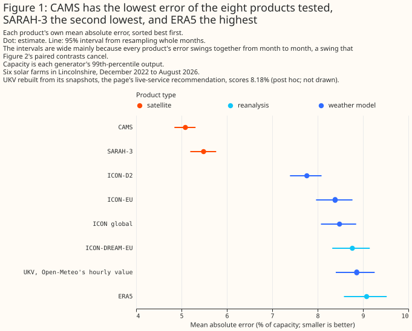

# Which weather product best describes past sunshine?

> **This study uses only Flexpectation's own data, and its purpose is to inform Flexpectation's
> choices.** The study scores each weather product only at the solar farms in Flexpectation's trial
> area in Lincolnshire. The study does not compare results across many regions or climates, so a
> result on this page may not hold elsewhere.

## Summary

**At six metered solar farms in Lincolnshire, two satellite retrievals describe past sunshine far
better than any of the weather models or reanalyses tested.** The main row set is the hours on which
all eight of its products have a value: two satellite retrievals (CAMS and SARAH-3), two reanalyses
(ERA5 and ICON-DREAM-EU), and four weather models (UKV, ICON-D2, ICON-EU, and ICON global). It holds
76,727 site-hours from December 2022 to August 2026, where a site-hour is one generator in one hour.
For each of the eight products, an XGBoost model, a gradient-boosted tree, was fitted per generator
to predict hourly output from that product's sunshine, and scored by its mean absolute error as a
percentage of the generator's capacity (its 99th percentile of metered output). Each XGBoost model
is recalibrated per generator, so a steady bias in a product does not count against the product, and
the error is not a forecast error. On the main row set, the error is 5.09% of capacity given the
Copernicus Atmosphere Monitoring Service's satellite retrieval (CAMS), and 5.49% given SARAH-3, the
satellite climate data record from EUMETSAT's Satellite Application Facility on Climate Monitoring
(CM SAF). The error is 7.76% given ICON-D2, the best of the four weather models on the main row set.
It is 8.77% given ICON-DREAM-EU, the German weather service's reanalysis, and 9.08% given ERA5, the
reanalysis from the European Centre for Medium-Range Weather Forecasts (ECMWF). ICON-D2 is the
German weather service's model for Germany and neighbouring countries. ICON-D2 has the lowest error
of all eight weather models on the extra row set, which adds four weather models to the main row
set's four (exploratory; not paired against ECMWF-IFS-HRES). On the CERRA row set, the error is
9.164% of capacity given CERRA, the Copernicus regional reanalysis for Europe, against 9.135% given
ERA5 (planned; not statistically significant at the 5% level), and 4.045 points above CAMS's 5.118%
(planned). A satellite observes the clouds of the
hour itself, where every weather model and reanalysis simulates them from a run started before the
hour, so a large gap is expected. The satellites cannot serve the live service, however: CAMS
arrives about 1 day after the hour, and SARAH-3 2 to 5 days after it, by manual order.

**The evidence is six farms in one 25 km by 23 km box, scored on five headline row sets that each
hold a different subset of the 15 products (the eight main-row-set products plus seven more), so an
absolute error on one row set is not comparable with an error on another.** Figure 1 draws one block
for each of the five headline row sets: the main row set (December 2022 to August 2026, 76,727
site-hours), the extra row set (November 2024 to August 2026, 40,243 site-hours), the ENS row set
(April 2024 to September 2026, 54,447 site-hours), the weather-station row set (December 2022 to
December 2025, 60,033 site-hours), and the CERRA row set (December 2022 to June 2026, 72,105
site-hours). A sixth, the record row set from January 2021, feeds only Figures 7 and 8. A difference
between two errors is in percentage points of capacity, written "points", and a bracketed pair after
a figure, such as [2.42, 2.90], is its 95% interval. A weather model's value "as served" is the
value Open-Meteo's archive holds for an hour, which comes from a run of the weather model that
started a few hours earlier. Overlapping intervals in Figure 1 do not make two products equal,
because Figure 2 tests each gap on the same hours. The lower panel of each block of Figure 2 holds
that row set's planned contrasts, which were written down before any result existed. Hours near
sunrise where Open-Meteo's UKV archive holds a physically impossible value are left out for every
product on every row set, the CERRA row set included; see [Limitations](#limitations). Absolute
errors on the extra row set are slightly pessimistic, for a reason the Limitations section gives,
and everything on this page holds only for six farms in Lincolnshire.




**At these six farms, the page recommends the following products for the four consumers of past
weather.** Each recommendation rests on the errors of XGBoost models given that product's global
irradiance, plus sun position, season, time of day, and ERA5's air temperature.

- **Capacity estimation, which infers a generator's size from how its output tracks sunshine:
  provisionally CAMS, fitted over at least a year of history or with November to January left out.**
  The reason is that CAMS's implied capacity, the capacity a generator's metered output implies
  given the product's sunshine, swings most with the seasons: it is 23% below its annual mean in
  December (SARAH-3's is 15% below). See [Discussion: what to use](#discussion-what-to-use).
- **Training history, the years of past weather that pre-training a forecasting model needs: CAMS,
  with the caveat that the mismatch between a CAMS-trained forecasting model and the forecast it
  meets at inference is unmeasured.** See [Discussion: what to use](#discussion-what-to-use).
- **Historical features, which give a forecasting model the weather of hours already past, in the
  live service: ICON-EU, the German weather service's European model, or rebuilt UKV, the Met
  Office's UK variable-resolution model (UKV) with its hourly value rebuilt from its own snapshots,
  each with the neighbouring hours added (the previous and next hours' values), because ICON-D2, the
  more accurate weather model here, does not cover South West England or South Wales.** A snapshot
  is UKV's value at one instant, which Open-Meteo's archive stores instead of an hourly mean.
  Rebuilt UKV is a post hoc result (added after results were seen), and it needs screening: this
  study dropped every snapshot the sun's geometry rules out, which removed 2.3% of every product's
  rows, all in the morning ramp between 05:00 and 10:00 UTC. See [Discussion: what to
  use](#discussion-what-to-use).
- **Disaggregation, which separates hidden solar generation from demand at a substation: CAMS where
  its one-day delay allows, otherwise ICON-EU or rebuilt UKV.** See [Discussion: what to
  use](#discussion-what-to-use).

**Separately from the four consumers, giving an XGBoost model CAMS, ERA5, UKV, ICON-D2, ICON-EU,
and ICON global at once beats giving it CAMS alone (with CAMS's neighbouring hours and its
direct-beam and diffuse-light split) by 0.13 points [0.10, 0.17] (post hoc).** See [Does blending
weather products beat the best single weather
product?](blending.md#solar-a-blend-beats-cams-given-its-neighbouring-hours).

> **How this page was made.** The research question came from a human. Everything else — the code
> behind every result, the analysis, the figures, and the text — was written by Claude, Anthropic's
> AI model (for this page, Claude Opus 5.5 and Claude Sonnet 5, reusing the data-preparation and
> model-fitting code that Claude Opus 5 wrote for the [beam/diffuse study](../beam-diffuse-split.md)).
> Several independent Claude reviewers have checked the method, the evidence, and the prose
> adversarially.

## Key findings

**Each finding below is labelled planned, exploratory, or post hoc.** A planned comparison was
written down before any result existed, every other comparison is exploratory, and a post hoc
comparison is an exploratory one added after results were seen; the [Methods
page](methods.md#planned-and-exploratory-comparisons) gives the rule. A product's served lead, the
hours before the hour it describes that its served value was forecast, is defined in the
[Introduction](#introduction), as is the analysis, written T+0, which is a lead of zero.

**Figure 1's intervals are wide mainly because every product's error rises and falls together from
month to month.** Some months are harder to describe than others for every product, and resampling
whole months carries that shared swing into each product's own interval. The six generators also
share their weather, so each interval on the main row set rests on 45 months rather than on
thousands of independent hours. Figure 2 pairs two products on the same hours, which cancels the
shared swing. Two products whose intervals overlap in Figure 1, or in the upper panel of a block of
Figure 2, can therefore still differ by a margin that is statistically significant at the 5% level.
Only a contrast pairing those two products tests them directly, and the lower panel of each block of
Figure 2 holds that row set's planned contrasts.

<!-- SLOT: WeatherNext 3 adds one Key findings bullet here -->

- **On the main row set, CAMS beats ICON-D2, the best of the four weather models tested, by 2.68
  points [2.42, 2.90] (planned), and the gap holds at every generator, in every season, and in each
  calendar year from 2023 to 2026.** See [CAMS describes past sunshine
  best](#cams-describes-past-sunshine-best-of-the-eight-main-row-set-products-by-a-wide-margin).
- **On the main row set, CAMS beats SARAH-3, the second satellite retrieval, by 0.40 points [0.29,
  0.50] (planned), and, in an exploratory comparison, by about as much under each satellite SARAH-3
  has used since 2021.** See [SARAH-3 is second to CAMS under every
  satellite](#sarah-3-is-second-to-cams-under-every-satellite).
- **On the main row set, ICON-DREAM-EU, the German weather service's reanalysis, beats ERA5 by 0.32
  points [0.12, 0.52] (planned), but trails all three ICON weather models.** See [ICON-DREAM-EU
  beats ERA5 but not the ICON weather
  models](#icon-dream-eu-beats-era5-but-not-the-icon-weather-models).
- **In an exploratory comparison on the record row set, on matched months (January to August), ERA5
  trails CAMS by between 3.6 and 4.7 points in each calendar year from 2021 to 2026, and SARAH-3 by
  between 3.2 and 4.3 points.** See [ERA5 trails both satellite
  retrievals](#era5-trails-both-satellite-retrievals-by-more-than-3-points-in-every-year-from-2021-to-2026).
- **On the main row set, ICON-D2 (from the German weather service's Icosahedral Nonhydrostatic model
  family) has the lowest error of the four weather models tested as served, beating ICON-EU by 0.62
  points [0.48, 0.76] (planned) across the record.** In a breakdown added after the first run,
  ICON-D2's advantage over ICON-EU shrinks from 1.03 points 1 hour into each run to 0.32 points 3
  hours in. See [ICON-D2 is the best weather
  model](#icon-d2-is-the-best-weather-model-on-the-main-and-extra-row-sets-and-its-advantage-shrinks-within-hours-of-each-run).
- **On the main row set, ICON-EU is 0.10 points ahead of ICON global, the same service's global
  model, as served [0.05, 0.15] (planned).** In a split added after the first run, most of that
  small gap sits in the hours ICON global is served further ahead than ICON-EU. See [ICON-EU against
  ICON global and UKV](#icon-eu-against-icon-global-and-ukv).
- **Once UKV's hourly value is rebuilt from its own snapshots, UKV is ahead of ICON-EU on the main
  row set, by a margin close to the 5% threshold: 0.21 points [0.03, 0.38] rebuilt as the mean of
  its two snapshots, and 0.26 [0.09, 0.43] given both snapshots (post hoc; not statistically
  significant at the 5% level after the Met Office's UKV upgrade of 21 January 2026).** Every
  rebuild of UKV was added after the first run. Against Open-Meteo's hourly value for UKV, ICON-EU
  is 0.48 points ahead [0.29, 0.65] (planned). See [UKV rebuilt from its
  snapshots](#icon-eu-against-icon-global-and-ukv).
- **On the main row set, rebuilt UKV also beats ERA5, by 0.90 points [0.72, 1.09] (post hoc), but
  Open-Meteo's hourly value for UKV beats ERA5 only across the whole record, not since August
  2024.** See [UKV rebuilt from its
  snapshots](#icon-eu-against-icon-global-and-ukv).
- **On the main row set, a product's own published direct beam improves the XGBoost model by 0.03 to
  0.10 points for every product except ERA5 and SARAH-3.** SARAH-3's direct beam is not tested,
  because CM SAF models it from SARAH-3's own global irradiance. See [A product's own direct beam
  adds little on the main row set](#a-products-own-direct-beam-adds-little-on-the-main-row-set).
- **On the main row set, an XGBoost model trained on five generators and applied to the sixth ranks
  the products the same way, with errors 0.10 to 0.20 points larger.** See [The main ranking
  survives a raw-irradiance comparison and a neighbour
  test](#the-main-ranking-survives-a-raw-irradiance-comparison-and-a-neighbour-test).
- **In an exploratory measure on the main row set, once the seasonal cycle is removed, the implied
  capacities of CAMS and SARAH-3 (the capacity that each product's sunshine and a generator's
  metered output imply) are the steadiest of the eight products from month to month, but both
  satellite retrievals swing the most with the seasons: CAMS's is 23% below its annual mean in
  December.** See [Implied
  capacity](#cams-and-sarah-3-imply-the-steadiest-capacity-from-month-to-month-once-the-seasonal-cycle-is-removed-but-swing-the-most-with-the-seasons).
- **On the extra row set, from November 2024, HARMONIE-AROME as Open-Meteo serves it from both the
  Danish Meteorological Institute (DMI)'s and the Royal Netherlands Meteorological Institute
  (KNMI)'s feeds trails the ICON model of similar grid spacing, and ECMWF-IFS-HRES against ICON-EU
  is not resolved.** KNMI HARMONIE-AROME trails ICON-EU by 0.56 points [0.32, 0.75] (planned), and
  DMI HARMONIE-AROME trails ICON-D2 by 1.02 points [0.73, 1.26] (planned). See [HARMONIE-AROME as
  Open-Meteo serves
  it](#harmonie-arome-as-open-meteo-serves-it-trails-the-icon-model-of-similar-grid-spacing).
- **On the ENS row set, an XGBoost model given the mean of the 51 members of ECMWF's ensemble
  forecast (ENS), from the 00 UTC run's `T+3` band (the first band of that run, covering leads of 3
  to 21 hours), beats an XGBoost model given ERA5 by 0.877 points [0.677, 1.080] and trails an
  XGBoost model given CAMS by 3.270 points [2.942, 3.585] (both planned), but the comparison differs
  in five ways besides forecast skill (lead, step width, native resolution, spatial support, and
  weather-model version), and 23% of the scored site-hours ended before that day's ENS run was
  readable from Dynamical.org's archive.** See [ECMWF ENS beats ERA5 and trails
  CAMS](#ecmwf-ens-beats-era5-and-trails-cams).
- **On the weather-station row set, an XGBoost model given the nearest Met Office weather station's
  irradiance and air temperature trails an XGBoost model given CAMS by 2.007 points [1.699, 2.248]
  and beats an XGBoost model given ERA5 by 2.082 points [1.817, 2.363] (both planned), but all six
  farms share one nearest station, 17 to 31 km away.** Adding the station's irradiance to CAMS
  lowers CAMS's error by a further 0.340 points [0.277, 0.420] (planned), against CAMS given a
  shuffled copy of the station's irradiance, which is permuted within each farm, month, and hour of
  day so that it keeps the station's monthly average and loses its hour-to-hour weather. See [The
  nearest station is a worse input than CAMS and a better input than
  ERA5](#the-nearest-station-is-a-worse-input-than-cams-and-a-better-input-than-era5).
- **On the CERRA row set, an XGBoost model given CERRA's global irradiance is no better than one
  given ERA5, and trails one given CAMS by 4.045 points [3.700, 4.382] (both planned).** CERRA's
  error is 9.164%, against 9.135% given ERA5 and 5.118% given CAMS. CERRA's error minus ERA5's is
  +0.029 points [-0.251, +0.341], which is not statistically significant at the 5% level at either
  XGBoost setting, and CERRA's own direct beam against Erbs separation, and CERRA against ERA5
  averaged to 3-hour steps, are unresolved. See [CERRA is no better than ERA5, and trails CAMS by
  about 4 points](#cerra-is-no-better-than-era5-and-trails-cams-by-about-4-points).

## Introduction

Several parts of this project read an estimate of weather that has already happened, not a forecast.
This page calls those parts the consumers of past weather, which are parts of the project, not
electricity customers. Capacity estimation infers a generator's size from how its output tracks
sunshine. Training history is the years of past weather that pre-training a forecasting model needs.
Historical features give a forecasting model the weather of hours already past. Disaggregation
separates hidden solar generation from demand at a substation. Each consumer reads one weather
product, and the project has to choose which. This page measures how well 15 products, including
ECMWF ENS, CERRA, and nearby weather stations, describe past sunshine at six metered solar farms,
and says which product each consumer should read.

**The products differ in how far ahead each value was forecast and in what area they cover, as well
as in accuracy, and both properties matter to a consumer.** A weather model run is one of the
forecasts each weather model starts every few hours. How many hours before the hour it describes a
product's value as served was forecast is the served lead. A lead of zero, written T+0, is the run's
analysis: the weather model's best estimate of the weather at the moment the run starts. A product's
value "as served" is its value at the lead its archive served it. ICON-D2 does not cover South West
England or South Wales, which are inside the licence area of National Grid Electricity Distribution
(NGED), the distribution network operator this project forecasts for. ICON-D2's western edge runs
from 1.8°W at 49.9°N, on the south coast, through 2.6°W at 53.2°N, in the Midlands, to 3.9°W at
57.3°N.


| Product | What it is | Served lead | Covers all of Great Britain? | Grid spacing, native and as served | Start of the archive read here | Available after |
|---|---|---|---|---|---|---|
| CAMS | Satellite retrieval from Meteosat images, with clear-sky irradiance from CAMS's modelled aerosol, water vapour and ozone | no forecast step | yes | point values, interpolated to each requested location from the satellite pixels, about 5 km across here | 2004 | about 1 day |
| ERA5 | ECMWF reanalysis, a consistent record back to 1940 | 1 to 12 hours | yes | about 31 km native (TL639); served on a 0.25° grid | 1940 | about 5 days |
| UKV | Met Office model for the UK | T+0, the analysis | yes | 1.5 km over the UK, coarsening to 4 km at the domain's edges; served at 2 km | March 2022, which Open-Meteo backfilled from a source it does not name until August 2024 | about 4 hours |
| ICON-D2 | German weather service (DWD) model for Germany and neighbouring countries | 1 to 3 hours | no | 2.2 km; served at about 2 km | December 2022 | about 1.5 hours |
| ICON-EU | DWD model for Europe, nested inside ICON global | 1 to 3 hours | yes | 6.5 km; served at about 7 km | November 2022 | about 3.5 hours |
| ICON global | DWD global model | 1 to 6 hours | yes | 13 km; served at about 11 km | November 2022 | about 3.5 hours |
| SARAH-3 | Satellite climate data record from Meteosat images, from EUMETSAT's Satellite Application Facility on Climate Monitoring (CM SAF); the years read here, from 2021, are from its Interim Climate Data Record | no forecast step | yes | 0.05° grid, about 3.3 km east to west by 5.6 km north to south here; read at the nearest cell | 1983; read here from January 2021 | 2 to 5 days |
| ICON-DREAM-EU | DWD reanalysis over Europe, built from ICON | 1 to 3 hours | yes | about 6.5 km; read at the nearest cell | 2010; read here from September 2019 | monthly; DWD's readme states 2 to 3 months, but August 2026 was on DWD's server by 23 September 2026 |
| ECMWF-IFS-HRES | ECMWF's global model | 1 to 12 hours before 1 October 2025, when Open-Meteo's archive held only the 00 and 12 UTC runs; 1 to 6 hours from it, when the archive switched to ECMWF's newly opened real-time catalogue and gained the 06 and 18 UTC runs | yes | 9 km; served on the native O1280 grid from 1 October 2025, served grid before then not established | 2017; read here from November 2024 | not established |
| ARPEGE Europe | Météo-France's global model, a stretched grid finest over France, as distributed on its European 0.1° grid | 1 to 6 hours (4-times-daily cycle) | yes | 0.1°, about 11 km, as Open-Meteo documents | November 2022 in Open-Meteo's archive; read here from November 2024 | not established |
| DMI HARMONIE-AROME | HARMONIE-AROME run by UWC-West, the collaboration of the Danish, Dutch, Icelandic and Irish weather services, over north-west Europe up to Iceland (the DINI domain), as distributed by the Danish Meteorological Institute (DMI) | 1 to 3 hours; run interval measured at 3 hours, matching the 3-hourly update Open-Meteo documents | yes | 2 km; Open-Meteo documents it at 2 km | July 2024; read here from November 2024 | not established |
| KNMI HARMONIE-AROME | The same UWC-West HARMONIE-AROME run, as distributed hourly by the Royal Netherlands Meteorological Institute (KNMI) | not measured here; KNMI and Open-Meteo document an hourly update, which would give 1 hour | yes | 2 km model, distributed on a reduced 0.05° grid, about 5.5 km | July 2024; read here from November 2024 | not established |
| ECMWF ENS (`T+3` band) | ECMWF's 51-member global ensemble forecast, from Dynamical.org's IFS ENS catalogue, which archives only the 00 UTC run of ENS's four daily runs; a forecast from a 00 UTC run, where ERA5 and ECMWF-IFS-HRES also serve forecast leads of 1 to 12 hours | 3 to 21 hours, its shortest available band in this download; 5 to 20 hours on the hours scored here | yes | about 9 km native (O1280); served on the open-data 0.25° grid, about 28 km north to south here, and read as the overlap-weighted mean of the 0.25° cells that each generator's H3 resolution-5 cell overlaps | April 2024 | about 09:00 UTC on the run's day, from Dynamical.org's archive, as the [ENS horizons study](../forecasts/ens-horizons.md) finds; ECMWF disseminates the run's steps 0 to 90 by about 06:55 UTC |
| Met Office weather stations (MIDAS Open, the open release of the Met Office Integrated Data Archive System) | Observations from Met Office stations, read one station at a time, not as a gridded product: the 10 radiation stations and 38 air-temperature stations downloaded for these studies, a subset of the Met Office's network of weather stations; some of the air-temperature stations report only once a day | no forecast step (an observation of the hour itself) | no: sparse points across the UK, and the nearest radiation station is 17 to 31 km from a farm | point observations at each station | 2017; the files read here end on 2025-12-31 | not established; MIDAS Open `dataset-version-202607` ends on 2025-12-31 |
| CERRA | Copernicus regional reanalysis for Europe, run with the HARMONIE-ALADIN weather model and three-dimensional variational data assimilation, forced by ERA5 ([Ridal et al., 2024](https://doi.org/10.1002/qj.4764)) | 0 to 3 hours after each 3-hourly analysis: the download holds 3-hour accumulations only, each the mean over the 3 hours ending at 00, 03, ..., or 21 UTC | yes (the domain covers all of Europe) | 5.5 km native; read at each generator's nearest of 190 cells, 1.0 km to 3.5 km away (pooled range) | September 1984; read here from December 2022 | about 12 weeks on 2026-09-23 |

<!-- SLOT: WeatherNext 3 adds one row to this products table, and the count of products (15) changes
in each place it is written -->

**Most of the latencies come from each service's own documentation, and CERRA's latency is the
[weather-products
survey's](../../background/weather-products-survey.md#reanalyses-hindcasts-and-satellite-retrievals)
check of the Copernicus Climate Data Store on 2026-09-23:** CAMS's [radiation-service
notes](https://confluence.ecmwf.int/x/jOLjDw), the [ERA5 dataset
page](https://cds.climate.copernicus.eu/datasets/reanalysis-era5-single-levels?tab=overview),
Open-Meteo's [UKV documentation](https://open-meteo.com/en/docs/ukmo-api), and the publication times
of the German weather service's own open-data files for ICON-D2, ICON-EU and ICON global. SARAH-3 is
CM SAF's [Surface Solar Radiation Data Set – Heliosat, Edition
3](https://doi.org/10.5676/EUM_SAF_CM/SARAH/V003), published by the European Organisation for the
Exploitation of Meteorological Satellites (EUMETSAT) and available by manual order from CM SAF; its
2-to-5-day figure is this project's own tracking, cross-referenced in the [disaggregation
roadmap](../../roadmap/disaggregation.md#an-irradiance-nowcast-would-be-a-more-useful-product), not
a figure CM SAF itself publishes. DWD publishes ICON-DREAM-EU a month at a time, after the month
ends: its readme states 2 to 3 months' delay, but August 2026 was on DWD's server by 23 September
2026. DMI's and KNMI's joint UWC-West run is documented on [KNMI's data
platform](https://english.knmidata.nl/open-data/harmonie), [Open-Meteo's DMI
documentation](https://open-meteo.com/en/docs/dmi-api), and [Open-Meteo's KNMI
documentation](https://open-meteo.com/en/docs/knmi-api). ARPEGE Europe's grid and Open-Meteo's own
archive start are from [Open-Meteo's Météo-France
documentation](https://open-meteo.com/en/docs/meteofrance-api), and ECMWF-IFS-HRES's O1280 grid
from [Open-Meteo's historical-forecast
documentation](https://open-meteo.com/en/docs/historical-forecast-api).

## Data and methods

**Every error on this page is a mean absolute error as a percentage of each generator's own
capacity, and this section states only what is specific to this page.** The [Methods
page](methods.md) holds what the past-weather studies share: the [row sets](methods.md#row-sets),
the [capacity normalisation](methods.md#capacity-normalisation) that defines the capacity and the
XGBoost model each error comes from, the [month-block folds](methods.md#month-block-folds), the
[bootstrap intervals](methods.md#bootstrap-intervals), the rule for [planned and exploratory
comparisons](methods.md#planned-and-exploratory-comparisons), and the [second hyperparameter
setting](methods.md#the-second-hyperparameter-setting).

### Where each product comes from, and its served lead

**The eight weather models come from Open-Meteo's historical-forecast archive, and ERA5 from
Open-Meteo's copy of the Copernicus archive.** `verify_era5_sources.py` checked that copy against
the Copernicus original. CAMS comes from the CAMS radiation service. The start dates for the weather
models are those of Open-Meteo's archive: DWD has run ICON global and ICON-EU since 2015, and
ICON-D2 since February 2021. SARAH-3 comes from CM SAF's own gridded files and ICON-DREAM-EU from
DWD's own gridded files, each read at the grid cell nearest each generator: 0.8 km to 2.8 km away
for SARAH-3, and 1.6 km to 5.0 km for ICON-DREAM-EU. CAMS is computed for each generator's own
coordinates. For the Open-Meteo products, Open-Meteo serves the grid cell nearest the coordinates
requested.

**Neither SARAH-3 nor ICON-DREAM-EU publishes an hourly mean, so each is converted to the mean over
the hour ending at the label, as every other product serves it.**

- **SARAH-3 publishes a snapshot every 30 minutes.** The hour labelled 12:00 is the mean of the
  snapshots stamped 11:00 and 11:30. The satellite scans Great Britain some minutes after each
  snapshot's stamp, so that pair straddles the hour's midpoint more closely than the snapshots
  stamped 11:30 and 12:00. Over the whole record, SARAH-3's hourly values track the sun's height
  best 30 to 35 minutes before the label at every generator, as a mean over the hour ending at the
  label should and as CAMS's do; the later pair of snapshots would peak at the label itself.
- **ICON-DREAM-EU publishes the mean since its latest 3-hourly forecast start**, so the value
  labelled 11:00 averages 09:00 to 11:00. Each hour's own mean is recovered by subtracting the
  running mean an hour earlier, weighted by the number of hours each covers. Assuming the wrong
  start hours leaves 8% to 10% of the recovered hourly means below −1 W m⁻², against 0.06% with
  starts at 00, 03, 06 UTC and so on, the hours ICON-DREAM-EU uses. The recovered values track the
  sun best 30 minutes before the label at every generator.

Each served lead comes from how the product's archive is built:

- **ERA5's hourly radiation is not an analysis.** It comes from the reanalysis's own short
  forecasts, started at 06 and 18 UTC, at steps of 1 to 12 hours ([ERA5
  documentation](https://confluence.ecmwf.int/display/CKB/ERA5%3A+data+documentation)).
- **Open-Meteo's weather-model archive keeps, for each hour, the freshest run that covers it.** For
  UKV, which runs every hour, the freshest run is the T+0 analysis. `verify_ukv_lineage.py` matched
  Open-Meteo's served UKV value against the Met Office's own files to within 0.55 W m⁻² at five
  instants either side of the January 2026 upgrade, at one generator's location. The check does not
  reach the backfill before August 2024.
- **For ICON-EU, the freshest run is measured.** `verify_icon_lineage.py` reconstructed each hour
  from 08 to 16 UTC on one day, at one place, from every run the German weather service still
  published. At all nine hours the freshest run reproduced Open-Meteo's served value to within
  1 W m⁻².

- **For ICON-D2 the same check does not confirm the mapping on its own.** The freshest run was the
  closest match at 7 of 9 hours, but still differed by up to 44 W m⁻². That mismatch is between
  Open-Meteo's served value and DWD's own files, so it bears on the archive, not on ICON-D2's
  accuracy. The 3-hour pattern in ICON-D2's own errors, described under [ICON-D2 is the best weather
  model](#icon-d2-is-the-best-weather-model-on-the-main-and-extra-row-sets-and-its-advantage-shrinks-within-hours-of-each-run),
  is the stronger evidence. The lead analysis below assumes that ICON-D2's archive is built the same
  way as ICON-EU's, which runs on the same 3-hourly cycle.

- **ICON global's lead is inferred from its 6-hourly cycle.** DWD publishes ICON global's open data
  only on the weather model's native icosahedral grid, which `verify_icon_lineage.py` does not read.
- **ICON-DREAM-EU's lead is 1 to 3 hours by construction.** Each value comes from one of the
  reanalysis's own short forecasts, started every 3 hours from an analysis.

**How each served lead was measured, or why it was not (exploratory):** `check_new_products.py`
reads a single-site hourly 2 m temperature fetch for each of the four models and looks for an hour
where the mean absolute second difference of temperature stands out from the rest of the day — a run
switch. Temperature carries its own diurnal cycle, a smooth afternoon warming that raises this
curvature from 12 to 18 UTC for every one of the four models, unlike radiation's sharp on/off
pattern at sunrise and sunset. A ratio read against the whole day's median absorbs that afternoon
hump into the baseline, and a run switch that sits inside the hump can then read as unremarkable.
ECMWF-IFS-HRES's temperature peaks 12 hours apart before 1 October 2025 and 6 hours apart from it,
when Open-Meteo's historical-forecast archive switched its upstream source for ECMWF-IFS-HRES to
ECMWF's own real-time open-data catalogue; ARPEGE's peaks 6 hours apart across its whole record,
matching its public four-times-daily cycle. Against the whole day's median, neither HARMONIE-AROME
model shows a single peak standing out clearly enough to read a cycle off directly, which is where
that afternoon hump hid DMI's own signal. Against each hour's two neighbours instead —
`check_new_products.py`'s local-prominence row, below the whole-day ratio for each product — DMI
HARMONIE-AROME peaks at every hour divisible by 3, 1.07 to 1.29 times its neighbours, the same phase
as ICON-D2's own 3-hourly cycle. This method has no positive control: no single-site temperature
fetch for ICON global, whose run interval is already known from its documented 6-hourly cycle, is on
disk to check the method finds a cadence it already knows. The strongest independent evidence for
DMI's 3-hour cycle is that DMI's and KNMI's radiation are exactly equal at 36% of rows at 07, 10,
13, 16, and 19 UTC, against 3% at other hours, together with Open-Meteo's own documented 3-hourly
update for DMI's feed. KNMI's temperature shows no peak at a fixed phase, so KNMI gets no measured
interval; that absence is what an hourly update, with a run switch at every hour, would look like,
matching the hourly update KNMI and Open-Meteo both document.

### How the comparison was made

**Within each row set, every product is scored on the same hours, with the same XGBoost model and
the same features, so a difference between two products on a row set is a difference between their
irradiance alone.**

- **Main.** An hour is kept only if all eight products cover it, which ends the record at the end of
  August 2026, where ICON-DREAM-EU's download stops. An hour is dropped if either of its two
  half-hours of metered power reads zero, whatever any product says about that hour. Two products'
  own values also decide which hours are scored, and both reject only a missing or physically
  impossible reading rather than an inaccurate one. An hour is dropped where the UKV snapshot
  recovered from Open-Meteo's archive at either end of the hour, or at a neighbouring hour, exceeds
  what the sun's geometry allows (see [Limitations](#limitations)). An hour is also dropped where
  SARAH-3 marks either of its two snapshots as unusable, which removes 426 of the 300,960 site-hours
  SARAH-3's files cover (0.14%), all of them in daylight. CAMS is read in full, not only on the
  hours it rates as reliable. The main row set holds 76,727 site-hours.
- **Record.** The year-by-year comparison with ERA5 and SARAH-3's comparison by satellite use the
  record row set, described under [Row sets](methods.md#row-sets).
- **Extra, ENS, Stations, and CERRA.** The extra Open-Meteo models, ECMWF ENS, the Met Office
  weather stations, and CERRA are each scored on their own row set, described under [the row set of
  the four extra Open-Meteo models](#row-set-of-the-four-extra-open-meteo-models), [the ECMWF ENS
  arms](#the-ecmwf-ens-arms), [the weather-station arms](#the-weather-station-arms), and [the CERRA
  arms](#the-cerra-arms). The [Methods page](methods.md#row-sets) lists all six row sets.
- **One treatment of UKV's change of source.** Open-Meteo's UKV archive before 12 August 2024 is a
  backfill from a source Open-Meteo does not name. Every product's comparison with ERA5 is also
  reported on the hours since that date, and no XGBoost model is told which side of the date an hour
  falls.
- **One XGBoost model per generator.** A gradient-boosted tree (XGBoost) is fitted per generator on
  one product's global horizontal irradiance plus sun position, season, time of day, and ERA5's air
  temperature. Every XGBoost model is given the same temperature.
- **Folds that respect an upgrade.** The Met Office's PS47 upgrade of UKV went live on 21 January
  2026. The record is cut into five folds separately before and after that date, so every fold is
  scored by an XGBoost model trained on both versions. Every XGBoost model is also told which side
  of the date an hour falls. The 11 days from 21 to 31 January are dropped, because the folds are
  cut by whole month and January counts as a pre-upgrade month.
- **Short spans.** An interval that resamples only part of a row set's months (7, 8, 18, or 19 here)
  is likely too narrow, and each section that quotes such an interval says how many months it rests
  on.
- **Six planned contrasts on the main row set, three more on the extra row set, two more on the ENS
  row set, three more on the weather-station row set, and four more on the CERRA row set.** The
  [Methods page](methods.md#planned-and-exploratory-comparisons) defines planned and exploratory
  comparisons and lists the [18 planned contrasts](methods.md#the-18-planned-contrasts). Each
  planned contrast is also refitted with a second set of XGBoost settings, and the second-setting
  figure is printed beside the contrast. Every other figure on this page is exploratory. The UKV
  snapshot rebuilds, the hour-by-hour and by-lead breakdowns, and the split of ICON global by lead
  are post hoc: they were added after the first run.

The [Methods page](methods.md#bootstrap-intervals) says where the fold-cutting and bootstrap code
lives and how it is tested.

### Row set of the four extra Open-Meteo models

**Four more weather models, the extra Open-Meteo models, are scored on their own row set, not on the
main row set.** ECMWF's 9 km global model, Météo-France's global model on its European grid, and the
UWC-West HARMONIE-AROME run as the Danish and the Dutch weather services each distribute it are all
available from Open-Meteo's archive at each generator's coordinates. Two of the four start only in
July 2024, and ARPEGE changed its radiation scheme in October 2024 (Météo-France's [cycle
48t1](https://www.umr-cnrm.fr/old/IMG/pdf/r_r_2024-gb_web_2.pdf)), so a comparison that includes all
four needs its own row set, from November 2024, separate from the main row set. The extra row set
holds 40,243 common site-hours from November 2024 to August 2026, all 12 products sharing every
hour, and each pooled interval resamples 22 months.

**The row set starts in November 2024 for two reasons, and ARPEGE's own longer record does not rule
out a step in irradiance at cycle 48t1.** ARPEGE's ratio to CAMS rises at cycle 48t1, and its ratio
to ECMWF-IFS-HRES cannot isolate ARPEGE. Open-Meteo's UKV archive is a backfill before 12 August
2024, and Météo-France's [cycle 48t1](https://www.umr-cnrm.fr/old/IMG/pdf/r_r_2024-gb_web_2.pdf), on
15 October 2024, replaced ARPEGE's radiation scheme; the first whole month after the later of the
two changes is the start. ARPEGE's own per-site build reads back to January 2024, further back than
this row set's own November 2024 start, so it can check whether cycle 48t1 left a step: ARPEGE's
ratio to ECMWF-IFS-HRES shows no step at cycle 48t1's date. That ratio cannot isolate ARPEGE's own
change, because ECMWF's own [Cycle
49r1](https://www.ecmwf.int/en/about/media-centre/news/2024/forecast-upgrade-improves-wind-and-temperature-predictions)
went operational on 12 November 2024, inside the same window. ARPEGE's ratio to CAMS does rise: from
0.94 to 1.07 across the 10 calendar months from January to October 2024, to 1.01 to 1.32 from
November 2024, and it is higher in 8 of the 10 calendar months the report holds on both sides of the
change (`report.md`), roughly equal in June and 0.01 lower in April. The row set's November 2024
start rests on the documented change of radiation scheme.

**The direct beam Open-Meteo serves for ARPEGE Europe and KNMI HARMONIE-AROME is not scored, because
Open-Meteo derives it from each weather model's global irradiance with a separation model
(exploratory).** Open-Meteo's documentation says so for both products: only global irradiance is
native, the diffuse share comes from the Razo, Müller and Witwer separation model, and the direct
beam is the remainder (<https://open-meteo.com/en/docs/meteofrance-api>,
<https://open-meteo.com/en/docs/knmi-api>). `sources.py`'s check agrees: the served direct fraction
varies by only 0.018 inside a bin of similar cloud and sun height, against a threshold of 0.05 — the
signature of a model applied to the product's own global irradiance, carrying no information beyond
it. **DMI HARMONIE-AROME's served direct beam is not scored either, for a different reason: on
daytime rows, it is exactly zero in 50% of them and exceeds the served global flux, which is
physically impossible, in 6 (`product_checks.md`).** This page does not establish whether that
defect belongs to DMI's model or to how Open-Meteo's archive serves it; `sources.py` documents the
check, and the pattern is not a separation model's signature. All three get a global arm only.
ECMWF-IFS-HRES's own direct beam passes both checks and is scored.

### The ECMWF ENS arms

**ENS is scored on its own row set, on global irradiance only, from the 00 UTC run's `T+3` band
rebuilt to hourly values, and every XGBoost model there has eight feature columns.** The ENS row set
holds 54,447 site-hours from 1 April 2024 to 10 September 2026, and the comparison of ENS with ERA5
and CAMS differs in five ways besides forecast skill:

- **Lead:** the hours ahead of the target hour that the value was forecast.
- **Step width:** the 3-hourly steps belong to the open-data subset of ENS that Dynamical.org's
  archive holds. ECMWF's full ENS output is hourly to 90 hours ahead, then 3-hourly to 144 hours.
- **Native resolution:** ENS's native grid is about 9 km (O1280) since IFS Cycle 48r1, which ECMWF
  made operational on 27 June 2023. ERA5's native grid is about 31 km (TL639).
- **Spatial support:** the area each value averages over. Both products are served on a 0.25° grid,
  and the results under [Averaging ERA5 and CAMS over 3-hour
  steps](#averaging-era5-and-cams-over-3-hour-steps-narrows-both-of-enss-gaps) set out what each
  value averages over.
- **Model version:** ENS ran IFS Cycle 48r1 until 12 November 2024, then 49r1 until 12 May 2026,
  then 50r1. ERA5 uses Cycle 41r2, which ECMWF made operational on 8 March 2016.

**The comparison is not lead-equal, and ERA5's lead is not like for like with an operational ENS
lead.** ERA5's radiation is a forecast 1 to 12 hours ahead, UKV's archive holds the analysis,
ICON-D2 and ICON-EU read 1 to 3 hours ahead, and CAMS is a satellite retrieval whose cloud
information has no forecast step. Dynamical.org archives only the 00 UTC run of ENS's four daily
runs. `T+3` is the download's label for the first band of that run, covering leads of 3 to 21 hours.
After this section's row set is joined to the rest of the page's hours, the scored leads are 5 to 20
hours, with a mean of 12.63 hours against ERA5's 6.52. ERA5's four-dimensional variational (4D-Var)
assimilation windows run 09 to 21 UTC and 21 to 09 UTC, and its forecasts start from the 06 and 18
UTC analyses. Each of those analyses therefore already uses observations up to 3 hours after the
forecast's start. An operational ENS run uses no observation after its start time, so the 6.11-hour
gap in mean lead is not like for like with an operational ENS lead.

**A live service reading Dynamical.org's archive gets the 00 UTC run from about 09:00 UTC, so 12,648
of the 54,447 scored site-hours (23.2%) ended at or before the time the run became readable there.**
ECMWF itself disseminates the run's steps 0 to 90 by about 06:55 UTC, and 2,582 of the scored
site-hours (4.7%) end at or before that time. The [ENS horizons study](../forecasts/ens-horizons.md)
takes the 09:00 UTC time from Dynamical.org's archive. Every consumer on this page reads a value
after its hour has passed, so for the 12,648 site-hours the ENS value reaches a live service up to 4
hours after the hour it describes. That delay is shorter than CAMS's one-day delay.

**The row set is ENS's own, shorter and later than the rest of the page, so each pooled interval
resamples 30 calendar months, against 45 for the main row set.** Generator E covers 23 of the 30
months. ENS's own archive here starts on 1 April 2024, well after the main row set's December 2022
start, so this section scores 54,447 common site-hours from 1 April 2024 to 10 September 2026. That
end date is the last date of the ERA5 grid, which `build_dataset.py` trims every product to. ENS's
own runs go on to 22 September 2026, and the join drops none of the ENS rows dated on or before 10
September 2026. The same shape of caveat applies to the [four extra Open-Meteo
models](#row-set-of-the-four-extra-open-meteo-models) and to
[ICON-DREAM-EU](#icon-dream-eu-beats-era5-but-not-the-icon-weather-models).

**ERA5 and CAMS are refit on this section's own row set, following this page's shared-rows rule, and
every XGBoost model in this section carries eight feature columns.** The eight columns are the
shared solar geometry and calendar features, an era flag for UKV's January 2026 upgrade, and either
the product's own global irradiance or, for ENS, ENS's mean-of-members irradiance and temperature.
The era flag does not mark ENS's own cycle changes (49r1 and 50r1). ERA5's and CAMS's temperature
column is ERA5's own air temperature, one of the shared features every product on this page reads,
because the CAMS radiation service publishes no temperature.

**ENS is scored on global irradiance only, like every other global-only product on this page,
because the free open-data subset of ENS that Dynamical.org's archive is built from carries no
direct-beam field, although ECMWF's full ENS catalogue does.**

**ENS's `T+3` band holds seven 3-hour steps per run, and each run is rebuilt into 19 hourly values
by the clear-sky-index reconstruction that the ENS horizons study picked as best for ENS's
radiation.** The reconstruction interpolates the ratio of ENS's radiation to clear-sky radiation
between the steps, then multiplies the ratio by each hour's clear-sky radiation.

**Two contrasts are planned: ENS's mean-of-members forecast against ERA5, and against CAMS.** Both
contrasts, the `T+3` band, the member mean, and the clear-sky-index reconstruction were fixed in the
written instructions for the first run, before the first model was fitted. Those instructions are a
working file outside the repository, so, unlike the other 16 planned contrasts, the repository does
not record the ordering. ERA5's and CAMS's results on the main row set were published before ENS was
planned, so a large gap between ENS and CAMS was predictable. Every other comparison in the ENS
results is exploratory.

### The weather-station arms

**A station arm is an XGBoost model given one Met Office station's hourly global irradiance in place
of a gridded product's irradiance, the stations are chosen by a rule fixed before any score existed,
and every planned contrast pairs arms with equal column counts.**

**The section asks how well a pyranometer some tens of kilometres from a farm stands in for the
irradiance at the farm, not how accurate the station is.** A station arm is an XGBoost model given
the station's hourly global horizontal irradiance in place of a gridded product's irradiance. In the
files read here, the diffuse and direct irradiance columns are empty at all 10 stations, so no
station arm has a split into direct beam and diffuse light.

**Three contrasts were written down before the first model was fitted, and every other comparison in
this section is exploratory.** The three planned contrasts were written into the study's plan file,
in a commit made before the first XGBoost model was fitted (the commit stays in the git history of
the study's pull request after the plan file is deleted at merge): the nearest station's irradiance
and temperature against CAMS, the same against ERA5, and CAMS with the nearest station against CAMS
with a shuffled copy of the station's irradiance. The shuffled copy is permuted within each farm,
each calendar month of each year, and each hour of day, so the shuffled copy keeps the station's
monthly average at each hour and removes the station's hour-to-hour weather. CAMS with the shuffled
copy is called the padded control below, and CAMS with the real station column is called the blend
below. The padded control carries the same nine feature columns as the blend. ERA5's and CAMS's
results on the main row set were published before this section was planned, so it was known in
advance that CAMS beats ERA5, though not where the station would fall.

#### What the station files hold, and where they end

**The files are the quality-controlled version (`qc-version-1`) of the Met Office's MIDAS Open
dataset, version 202607, from 2017-01-01 to 2025-12-31: hourly global irradiation from the 10
radiation stations downloaded for these studies, and air temperature from the 38 weather stations
downloaded.** Some of the 38 weather stations report once a day, and so cannot meet the coverage
rule below. MIDAS reports each irradiance row as an amount in kJ m⁻² over the hour ending at its
label. This section converts each amount to a mean irradiance in W m⁻², keeping the hour-ending
convention of the page's power aggregation. An air-temperature row is a spot reading at its label.

**This section's row set ends on 2025-12-31 and holds 60,033 common site-hours over 37 calendar
months, against the main row set's 76,727 site-hours from 2022-12-01 to 2026-08-31.** The last hour
in the files is 2025-12-31 23:00 UTC. This page does not establish how often the Met Office releases
a new version of the files. Each pooled interval here therefore resamples 37 months, and treats
neighbouring months as independent.

**The download kept only the radiation stations that were still reporting in 2025 and lie within 100
km of at least one study site, which gave 10 stations.**

**Measured power tracks the irradiance of the same hour more strongly than the irradiance of the
hour before or after, for both the station and CAMS, so the station's hours are labelled the same
way as CAMS's.** Across the 47,369 site-hours whose neighbouring hours are also scored (exploratory,
post hoc), the correlation of measured power with the station's irradiance is 0.880 for the same
hour, against 0.768 for the hour before and 0.819 for the hour after. The same three correlations
for CAMS's irradiance are 0.926, 0.804, and 0.824.

**CAMS's irradiance at the farms correlates more strongly with the nearest station's irradiance than
ERA5's irradiance does (exploratory).** Across the six farms, CAMS's irradiance follows the nearest
station's irradiance with a correlation of 0.939 and a mean difference, product minus station, of
−9.7 W m⁻². ERA5's irradiance follows the station's irradiance with a correlation of 0.890 and a
mean difference of −10.3 W m⁻². The mean station irradiance is 273.6 W m⁻². Each product is read at
the farms, 17 to 31 km from the station, so these figures are not a validation of either product
against the station.

**Six irradiance values in the whole files are corrected, and no quality-control flag is used to
drop an hour.** The station-reading code makes two corrections, counted over the whole files before
the row set is cut: the code clips three slightly negative irradiance values to zero, and sets 3
hours to missing where the station reports more than 5 W m⁻² in an hour that starts and ends with
the sun below the horizon. No upper-limit check against clear-sky irradiance was run beyond that
night-time test. The files' quality-control flags are kept as delivered, and the page does not
decode the flag values. At 107 of the 60,033 site-hours, the nearest radiation station's flag
differs from 6, the value the flag carries at most hours. The station-reading code then drops the
hours where a station an arm needs has no value. Of the 60,611 candidate site-hours, 578 (0.95%)
were dropped because a station value was missing.

#### How the stations were chosen

**The station rule was written before any score existed: the nearest station with a usable value at
no less than 99% of a farm's hours.** Stations are ranked by great-circle distance, with ties going
to the lower station number. A threshold of 100% leaves at least one farm with no eligible station,
because none of the downloaded stations has a usable value at every one of that farm's hours. At
every farm, the rule chose the nearest downloaded radiation station, and no nearer radiation station
was skipped for low coverage. The nearest air-temperature stations are chosen by the same rule from
their own 38 stations, so a farm's nearest air-temperature station can differ from its nearest
radiation station.

**No radiation station left out of the download is nearer to any farm than the nearest radiation
station chosen here.** For radiation, the rule is applied only to the 10 stations downloaded. The
station-metadata file lists 76 more radiation stations whose record overlaps this section's years.
The nearest of those 76 stations is 107 km or more from every farm, so no radiation station in that
file is nearer to a farm than the nearest radiation station chosen here.

| Kind | Rank | Distance range (km) | Distinct stations | Lowest coverage | Most nearer stations skipped |
|---|---|---|---|---|---|
| radiation | 1 | 17 to 31 | 1 | 0.9933 | 0 |
| radiation | 2 | 36 to 51 | 1 | 0.9991 | 0 |
| radiation | 3 | 52 to 89 | 2 | 0.9903 | 1 |
| air temperature | 1 | 7 to 17 | 3 | 0.9956 | 0 |
| air temperature | 2 | 18 to 28 | 2 | 0.9989 | 2 |
| air temperature | 3 | 18 to 31 | 4 | 0.9969 | 2 |

**The table gives ranges pooled over the six farms, because a station-to-farm mapping would narrow
where a metered generator is.**

**Only the third-nearest radiation rank varies across the six farms, so the nearest and
second-nearest arms each rest on a single station.** The nearest radiation station is the same at
every farm, and the second-nearest radiation station is also the same at every farm. The
third-nearest radiation rank holds two stations. The air-temperature stations vary across the six
farms at every rank. The gap between the nearest-station and second-nearest-station arms therefore
compares two single stations.

**Every planned contrast compares two arms with the same number of feature columns.** In every
planned contrast, and in every exploratory contrast except the three that set an arm carrying an
extra column against a plain product, the two arms carry the same number of feature columns, 8 or 9,
with `colsample_bytree` at 1, so every tree sees every column. The three exceptions are CAMS padded
with a shuffled station column against plain CAMS, ERA5 padded the same way against plain ERA5, and
the blend against plain CAMS. The report prints every arm's feature columns. The nearest-station arm
reads the station's air temperature where the CAMS and ERA5 arms read ERA5's air temperature.

### The CERRA arms

**CERRA is scored on its own row set, from 3-hour accumulations that are rebuilt to hourly values,
and every XGBoost model there carries eight feature columns, except the two given CERRA's split of
global irradiance into direct beam and diffuse light, which carry ten.** CERRA is the Copernicus
regional reanalysis for Europe, on a 5.5 km grid, forced by ERA5
([Ridal et al., 2024](https://doi.org/10.1002/qj.4764)). Its
[dataset page](https://cds.climate.copernicus.eu/datasets/reanalysis-cerra-single-levels) documents
the fields. The download holds two of them: global irradiance on a horizontal surface, and the
producer's own direct beam. The dataset page does not say whether the direct beam is measured on a
horizontal surface; the data are consistent with a horizontal surface, because the direct beam never
exceeds global irradiance in a scored hour. Both are forecast fields, accumulated over 3
hours, and the download holds forecast lead 3 only. Each value is therefore the energy over the
window (valid time minus 3 hours, valid time], with valid times at 00, 03, ..., and 21 UTC only.
Dividing by the 10,800 seconds of a window gives the window's mean flux in W m⁻².

**The download holds no diffuse, temperature, or cloud field, so diffuse light is global irradiance
minus direct beam, and every XGBoost model reads ERA5's air temperature.** ERA5's air temperature is
the shared feature every product on this page reads. CERRA's direct beam exceeds its global
irradiance in none of the scored hours, so no diffuse value is clipped to zero. The row set covers
190 CERRA grid cells, and each generator is read at its nearest cell, 1.0 km to 3.5 km away (pooled
range).

**The rebuild from 3-hour windows to hourly values is a model, and its measured limit is that the
rebuilt hours do not conserve each window's energy.** The rebuild is the clear-sky-index
reconstruction used for ENS's steps: the ratio of irradiance to clear-sky irradiance is interpolated
between the midpoints of neighbouring windows, then multiplied by each hour's clear-sky irradiance,
with no rescaling to the window mean. For windows whose mean is at least 50 W m⁻², the mean of a
window's three rebuilt hours differs from the window mean by more than 10% in 10.3% of CERRA's
global-irradiance windows and in 26.0% of CERRA's direct-beam windows (median gaps 3.01% and 5.27%).
CERRA's hourly values inside a window are therefore not CERRA's own values. The report checks that
the clear-day composite of the rebuilt CERRA peaks in the same hour as ERA5's (12:00 UTC for both),
and stops the run otherwise.

**ERA5 and CAMS are given the same 3-hour treatment, so that CERRA can be compared with the step
width matched.** The two extra XGBoost models take ERA5's and CAMS's hourly means, average each over
CERRA's own windows, and rebuild hourly values with the same function. Both are written "averaged to
3-hour steps" on this page. ERA5 and CAMS at their hourly values are also refitted on this row set.
Seven XGBoost models are fitted per generator:

- **CERRA:** global irradiance rebuilt to hourly values.
- **CERRA with its own direct beam:** rebuilt global irradiance, rebuilt direct beam, and diffuse
  light as their difference (10 columns).
- **CERRA with Erbs separation:** rebuilt global irradiance, with the direct beam and diffuse light
  estimated by the [Erbs et al. (1982)](https://doi.org/10.1016/0038-092X(82)90302-4) correlation
  (10 columns).
- **ERA5 and CAMS:** each product's hourly global irradiance.
- **ERA5 averaged to 3-hour steps and CAMS averaged to 3-hour steps:** as above.

**The CERRA row set holds 72,105 site-hours from 2022-12-01 to 2026-06-30, and 71,934 of them are
also in the main row set.** The row set is the main study's 77,616 common site-hours, cut to those
ending at or before CERRA's last window, which ends at 2026-07-01 00:00 UTC, and to hours where
CERRA, ERA5, and CAMS all have a value. Those 77,616 site-hours are joined from six of the main row
set's eight products, UKV among them, so the rule that removes physically impossible UKV sunrise
values applies to the CERRA row set as it does to the main row set. The 171 site-hours outside the
main row set are hours that the main row set drops because of its two further products, SARAH-3 and
ICON-DREAM-EU, which the CERRA row set does not need (this follows from how the two row sets are
built; the page has not counted the 171 hours one by one). The hours span 43 calendar months. The
CERRA row set ends two months before the main row set does, on 2026-08-31.

**The folds are cut so that every scored hour's calendar month occurs in the training rows.** The
folds are cut inside two eras, one starting in December 2022 and one in February 2026 (after the Met
Office's UKV upgrade), with offsets chosen so that 0.0% of the scored hours fall in a calendar month
with no training row. Under the main row set's own published folds, carried over to these rows,
1.1% would. A further 322 scored hours sit in a calendar month that occurs in one year only for
their generator, which no fold design can cover.

**Four contrasts are planned, and every other contrast is exploratory.** The four were written into
the study plan before the first fit, and each is refitted at the second XGBoost setting:

1. CERRA against ERA5.
2. CERRA against CAMS.
3. CERRA against ERA5 averaged to 3-hour steps, which matches the step width but not the grid
   spacing, radiation scheme, or lead.
4. CERRA with its own direct beam against CERRA with Erbs separation.

Contrasts 1 and 2 compare CERRA with products read at hourly values, so they differ from the
comparison by more than the product: CERRA's step width, grid spacing, radiation scheme, and lead
also differ. The page does not read either gap as CERRA's physics alone.

## Results

### The XGBoost models work

**On the [main row set](methods.md#row-sets), given CAMS, the XGBoost model tracks measured power
closely at every generator, in a clear, a variable, and a dull week.** Given ERA5, the XGBoost model
still follows the shape of each day, but runs further from the measured line, most visibly in the
dullest week. Figure 4 plots both XGBoost models' out-of-fold predictions against measured power,
each prediction held to the export cap as every score on this page is.

**The three weeks are chosen by a rule that reads measured power alone, so the choice cannot favour
CAMS or ERA5.** The rule pools the six generators and considers only April to September, so that a
short midwinter day cannot dominate the choice. The clearest week is the one in which the generators
produced the most output relative to their own capacity, and the dullest week the one in which they
produced the least. The most variable week is the one whose daily output swings the most from day to
day. The clearest week and the most variable week both fell in May 2026, and the dullest week in
July 2025.

**Figure 4 shows each week as days 1 to 7, with no calendar dates, because a dated hourly series
would identify the solar farm.** With only 6 solar farms in the study, a generator's hourly output
on known dates could be matched against publicly available generation data. That match would undo
the anonymisation that names the generators only as Generator A to F. The page therefore gives each
week's month and year in the text and no finer date.


**CAMS has the lowest error at each of the six generators, SARAH-3 the second lowest, and ICON-D2
the third.** Figure 5 plots every product's mean absolute error at each generator separately, one
dot per product per generator. The other five products reorder between generators: at two
generators, for instance, Open-Meteo's hourly UKV scores worse than ERA5. The lead of CAMS, then
SARAH-3, then ICON-D2, described in [CAMS describes past sunshine
best](#cams-describes-past-sunshine-best-of-the-eight-main-row-set-products-by-a-wide-margin),
therefore holds generator by generator, rather than resting on a pooled average that one generator
could dominate.


### CAMS describes past sunshine best of the eight main-row-set products, by a wide margin

**On the [main row set](methods.md#row-sets), CAMS beats the best of the four weather models tested
by 2.68 points [2.42, 2.90] (planned), and the gap holds at every generator, in every season, and in
each calendar year from 2023 to 2026.** At the second set of XGBoost settings, CAMS's error minus
ICON-D2's is −2.649 points [−2.868, −2.395], and all 5 folds agree in sign.

| Product | Mean absolute error, % of capacity |
|---|---|
| CAMS | 5.09 |
| SARAH-3 | 5.49 |
| ICON-D2 | 7.76 |
| UKV given its two snapshots as separate inputs (added after the first run) | 8.13 |
| UKV rebuilt as the mean of its two snapshots (added after the first run) | 8.18 |
| ICON-EU | 8.39 |
| ICON global | 8.48 |
| ICON-DREAM-EU | 8.77 |
| UKV, Open-Meteo's hourly value | 8.86 |
| ERA5 | 9.08 |

Across the six generators, CAMS's margin over ICON-D2 ranges from 2.29 to 3.41 points. By season it
ranges from 1.81 points in winter to 3.07 in autumn, and in each calendar year from 2023 to 2026
(2026 to August) it lies between 2.62 and 2.87.


**ERA5 has the largest error of the eight main-row-set products, and [Why ERA5 describes past
sunshine and wind worse than most current weather
products](../../roadmap/data-sources.md#why-era5-describes-past-sunshine-and-wind-worse-than-most-current-weather-products)
sets out ERA5's documented weaknesses.**

**The gap is not an artefact of lead or of reading CAMS in full.** On the hours ICON-D2 is served 1
hour after its run started, CAMS still beats it by 2.24 points [1.99, 2.45]. Reading CAMS in full is
the conservative choice: on the 69,573 hours CAMS rates as reliable, CAMS's margin over ERA5 widens
from 4.00 to 4.40 points.

### SARAH-3 is second to CAMS under every satellite

**CAMS beats SARAH-3 by 0.40 points [0.29, 0.50], one of the main row set's six planned contrasts,
and by about as much under each satellite SARAH-3 has used since 2021.** With the second set of
XGBoost settings, CAMS is 0.42 points ahead [0.32, 0.52]. For a generator predicted from its
neighbours, CAMS is 0.45 points ahead [0.34, 0.54]. For XGBoost models trained on the 7 months since
UKV's upgrade alone, CAMS is 0.29 points ahead [0.02, 0.53], an interval that rests on 7 months and
is likely too narrow.

**SARAH-3 trails CAMS by about 0.4 points in every period since 2021.** SARAH-3's retrieval over
Europe moved from Meteosat-11 to Meteosat-10 on 21 March 2023, and Meteosat-9 stood in for a
fortnight, 17 to 31 January 2022. On the record row set from January 2021, in comparisons chosen
after SARAH-3's first results, CAMS is ahead by:

| Satellite behind SARAH-3 | CAMS's margin over SARAH-3 (points) |
|---|---|
| Meteosat-11, 2021 | 0.40 [0.20, 0.60] |
| Meteosat-11, February 2022 to 20 March 2023 | 0.50 [0.32, 0.68] |
| Meteosat-10, from 21 March 2023 | 0.41 [0.32, 0.50] |

January 2022, the month holding the fortnight from Meteosat-9, is one month and too short for an
interval: CAMS is 0.42 points ahead in that month. No XGBoost model is told which satellite an hour
comes from. CAMS also works from Meteosat's images, so a change of satellite reaches both products,
and each span above is also a different stretch of years. The table therefore shows that SARAH-3's
deficit did not change across the switches, not how SARAH-3 alone responds to a satellite. A few
days in each span came from another satellite: SARAH-3's own `platform` attribute shows Meteosat-9
standing in for 19 to 20 December 2021, inside the "Meteosat-11, 2021" span, and Meteosat-11
standing in for a few days in 2024, 2025 and 2026, inside the "Meteosat-10" span.


**Why CAMS beats SARAH-3 is not identified, but the gap is largest in broken cloud and sits at four
of the six generators.** CAMS is computed for each generator's own coordinates. SARAH-3 is read from
a 0.05° grid cell 0.8 km to 2.8 km from each generator. Across the generators CAMS's margin on the
main row set ranges from 0.03 to 0.64 points, and at two of them it is not statistically significant
at the 5% level. Relative to CAMS's own error, SARAH-3's is about 7.1% larger in overcast hours,
10.7% larger in broken cloud, and 4.3% larger in clear hours, binned on the mean of CAMS's and
SARAH-3's own clearness index, so that neither product alone decides the bins, in comparisons chosen
after the results were seen. That pattern points at how each hourly value is built: CAMS's hourly
value is the service's own integration over the hour, while SARAH-3's is this study's mean of two of
SARAH-3's 30-minute snapshots. Another construction, such as a weighted mean of the snapshots
stamped 11:00, 11:30, and 12:00, was not tested, so part of the gap may belong to this study's
conversion rather than to SARAH-3. A steady bias could not explain the gap either, because the
XGBoost model fitted to each generator corrects a steady bias.

**On the extra row set, SARAH-3's error is 0.415 points higher than CAMS's [0.245, 0.582]
(exploratory).** SARAH-3's own error there is 5.61% and CAMS's is 5.20%. The gap points the same way
as on the main row set, where it is 0.402 points [0.294, 0.498].

### ICON-DREAM-EU beats ERA5 but not the ICON weather models

**On the [main row set](methods.md#row-sets), ICON-DREAM-EU beats ERA5 by 0.32 points [0.12, 0.52],
one of the main row set's six planned contrasts, but its error of 8.77% is higher than that of each
of the three ICON weather models.** The two reanalyses and SARAH-3, a satellite climate data record,
are built to be consistent over time, each with one fixed version of its weather model or retrieval,
though the observations and satellites each uses change over time. With the second set of XGBoost
settings, ICON-DREAM-EU is 0.33 points ahead of ERA5 [0.14, 0.52], and for a generator predicted
from its neighbours 0.37 points ahead [0.17, 0.58]. At the first setting only 4 of the 5 folds agree
in sign, and at the second setting all 5 agree. On the record row set from January 2021,
ICON-DREAM-EU is 0.39 points ahead [0.23, 0.54].

**Since August 2024, ICON-DREAM-EU's advantage over ERA5 is not statistically significant at the 5%
level. But every product's lead over ERA5 is smaller in 2025 and in 2026 than in 2024, in point
estimate.** ICON-DREAM-EU is 0.16 points ahead on those hours [−0.09, +0.38], and 0.23 points ahead
after UKV's upgrade [−0.22, +0.57], on 7 months. In the same years CAMS's lead over ERA5 falls from
4.50 points in 2024 to 3.69 in 2026, and ICON-EU's from 1.13 to 0.47, while ICON-DREAM-EU's gap to
ICON-EU shows no trend across those years. The smaller advantage over ERA5 is therefore not evidence
that ICON-DREAM-EU got worse; every product's lead over ERA5 narrows together. All of these
comparisons are exploratory.

**ICON-DREAM-EU and ERA5 are served at different leads, but ICON-DREAM-EU and ICON-EU can be
compared at equal leads, because both run on the same 3-hourly cycle.** ICON-DREAM-EU's radiation
comes from its own forecasts 1 to 3 hours after each 3-hourly analysis, and ERA5's from forecasts 1
to 12 hours after 06 and 18 UTC. Equal leads would favour ERA5 relative to what is measured here. In
an exploratory comparison, ICON-DREAM-EU trails ICON-D2 by 1.00 points [0.82, 1.17], trails ICON
global by 0.28 points [0.17, 0.39], and is not statistically significantly different from
Open-Meteo's hourly UKV, at −0.10 points [−0.27, +0.09]. ICON-DREAM-EU trails ICON-EU by 0.38 points
at equal leads, in an exploratory comparison, and the gap is statistically significant at the 5%
level at each lead: 0.34 points [0.20, 0.47] on hours 1 hour into a run, where no de-averaging is
needed, so the conversion to hourly means is not the main cause. The gap is 0.49 points [0.34, 0.63]
at 2 hours and 0.39 points [0.25, 0.54] at 3 hours.

### ERA5 trails both satellite retrievals by more than 3 points in every year from 2021 to 2026

**On matched months, January to August, ERA5 trails both satellite retrievals by more than 3 points
in every calendar year from 2021 to 2026, and ICON-DREAM-EU by up to about 0.7 points.** Every
figure in this section is exploratory, on the record row set from January 2021, and each year's
interval comes from resampling that year's own January-to-August months alone; restricting every
year to the same months keeps a partial 2026 from being compared against the other years' full 12
months. Each year's interval rests on 8 months, so the intervals are likely too narrow. ERA5 trails
CAMS by between 3.62 points (2026) and 4.74 points (2021). ERA5 trails SARAH-3 by between 3.21
points (2026) and 4.31 points (2021). ERA5 trails ICON-DREAM-EU by about half a point to 0.68 points
in each year from 2021 to 2024, a gap that is statistically significant at the 5% level in each of
those years, and by 0.21 points in 2025 and 0.18 points in 2026, where the gap is not statistically
significant at the 5% level.

**No year from 2021 to 2024 has a gap between ERA5 and ICON-DREAM-EU that differs from 2025's by a
margin statistically significant at the 5% level.** Resampling each year's months independently of
2025's, and restricting every year to January to August, the change from each of 2021 to 2024 to
2025 is −0.27 to −0.47 points, and every interval includes zero, so a reader should not conclude
that ICON-DREAM-EU's gap to ERA5 has genuinely narrowed rather than moved within the noise.


### ICON-D2 is the best weather model on the main and extra row sets, and its advantage shrinks within hours of each run

**On the [main row set](methods.md#row-sets), ICON-D2 beats ICON-EU across the record by 0.62 points
[0.48, 0.76] (planned), by 1.03 points [0.87, 1.18] in the first hour after each run, and by only
0.32 points [0.16, 0.48] in the third hour.** At the second set of XGBoost settings, ICON-EU's error
minus ICON-D2's is +0.606 points [+0.470, +0.737], and all 5 folds agree in sign. ICON-D2 has the
lowest error of the weather models tested on both the main and extra row sets, as Figure 1's Main
and Extra blocks show. ICON-D2 and ICON-EU run on the same 3-hourly cycle, so at any given hour both
are served at the same lead.

| Hour (UTC) | 09 | 10 | 11 | 12 | 13 | 14 | 15 | 16 |
|---|---|---|---|---|---|---|---|---|
| Served lead of both | 3 h | 1 h | 2 h | 3 h | 1 h | 2 h | 3 h | 1 h |
| ICON-D2 − ICON-EU (points) | −0.40 | −1.38 | −0.60 | −0.20 | −1.48 | −0.76 | −0.47 | −0.97 |

The table shows hours 09 to 16 UTC. Each hour is labelled by its end, so 12 UTC is the mean from
11:00 to 12:00. The by-lead figures above average over 07 to 19 UTC. At those two edge hours, with
the sun low, the pattern weakens: 1 hour into a run, ICON-D2's advantage is only 0.35 points at 07
UTC and 0.06 points at 19 UTC.


**The time of day does not explain the pattern around noon.** The hours 12 and 13 UTC sit on either
side of solar noon, yet ICON-D2's advantage is 0.20 points at 12 UTC, 3 hours into a run, against
1.48 points at 13 UTC, 1 hour in. ICON-EU shows no such pattern with lead. Against UKV rebuilt from
its snapshots, which is always served at T+0, ICON-EU is 0.20 to 0.24 points behind at every lead
from 1 to 3 hours into its runs, in a comparison added after the first run; only the 1-hour gap is
statistically significant at the 5% level (2 h: 0.21 [−0.01, +0.44]; 3 h: 0.20 [−0.02, +0.42]).

**The mechanism is not identified, and the rate of decay may not hold elsewhere.** ICON-D2 takes the
weather at its boundaries from ICON-EU. The six generators sit about 160 to 200 km east of ICON-D2's
western boundary, so air arriving on a westerly wind may carry ICON-EU's weather to them within
hours. Another candidate is ICON-D2's own data assimilation: an advantage built into each run's
starting state would be expected to decay over the run's first hours. By a 3-hour lead only 0.32
points of the advantage remain, so the as-served advantage should not be assumed to hold a day
ahead.

### ICON-EU against ICON global and UKV

**On the [main row set](methods.md#row-sets), most of ICON global's 0.10-point deficit to ICON-EU
(planned; +0.094 points [+0.051, +0.134] at the second set of XGBoost settings, with all 5 folds
agreeing in sign) sits in the hours ICON global is served further ahead.** ICON global runs every 6
hours, so half its hours are served 4 to 6 hours after the run started, where ICON-EU is at 1 to 3
hours. On those hours ICON global is 0.19 points behind [0.09, 0.30]. On the hours where the two
leads are equal ICON global is 0.02 points behind [−0.03, +0.08]. So at equal leads the difference
between ICON global and ICON-EU is not statistically significant at the 5% level, though a
difference as large as 0.08 points is not excluded. The split also divides the hours of the day: the
longer leads fall at 10 to 12 and 16 to 18 UTC, so a difference in either weather model's skill by
time of day would show up here as an effect of lead.

**ICON-EU beats Open-Meteo's hourly value for UKV by 0.48 points [0.29, 0.65], one of the main row
set's six planned contrasts, but UKV is ahead of ICON-EU, by a margin close to the 5% threshold,
once UKV's hour is rebuilt from its own snapshots.** At the second set of XGBoost settings,
ICON-EU's error minus Open-Meteo's hourly UKV's is −0.433 points [−0.602, −0.255], and all 5 folds
agree in sign. Each ICON product's archived value for an hour is a mean over that hour. UKV
publishes a snapshot each hour, and Open-Meteo builds UKV's hourly value from the snapshot at the
hour's end, rescaled by the change in the sun's angle. In comparisons added after the first run,
averaging UKV's snapshots at both ends of the hour cuts UKV's error by 0.68 points, which puts UKV
0.21 points ahead of ICON-EU [0.03, 0.38]. The interval's lower end, 0.03 points, is close to zero,
so this result should not be read as settled. An XGBoost model given the two snapshots as separate
inputs puts UKV 0.26 points ahead of ICON-EU [0.09, 0.43]. No second XGBoost setting was saved for
the rebuilt-UKV contrast against ICON-EU, so that verdict does not rest on both settings.

**Giving each XGBoost model the neighbouring hours improves both products by about 0.2 points, and
leaves rebuilt UKV about as far ahead of ICON-EU.** An XGBoost model given ICON-EU's hourly mean for
the hour before and after, as well as the hour itself, improves by 0.18 points. The same context
improves UKV's rebuilt hour by 0.19 points. With context on both, ICON-EU is 0.23 points behind
rebuilt UKV [0.05, 0.39], and since August 2024 0.26 points behind [0.02, 0.50]. No second setting
was saved for the since-August-2024 contrast either. With context, ICON-EU is 0.09 points behind
UKV's two snapshots given as separate inputs [−0.08, +0.25], a difference that is not statistically
significant at the 5% level.

**Every rebuilt UKV construction scores ahead of ICON-EU across the record, and UKV is also served
at the shorter lead.** UKV is served at T+0 and ICON-EU 1 to 3 hours ahead, so equal leads would if
anything favour ICON-EU. On the 7 months after UKV's upgrade alone, ICON-EU is 0.15 points behind
rebuilt UKV in point estimate [−0.23, +0.57], with only 2 of 5 folds agreeing in sign. That interval
rests on 7 months and is likely too narrow.


**On the [main row set](methods.md#row-sets), UKV rebuilt from its snapshots beats ERA5 in every
period tested, but Open-Meteo's hourly value for UKV beats ERA5 only across the whole record.** In
comparisons added after the first run, UKV rebuilt as the mean of its two snapshots beats ERA5 by
0.90 points [0.72, 1.09] across the record, by 0.79 points [0.57, 1.00] since Open-Meteo's own UKV
downloader started in August 2024, and by 0.62 points [0.45, 0.75] after the January 2026 upgrade.
The post-upgrade interval rests on 7 months and is likely too narrow, though all 5 folds agree in
sign.

**Open-Meteo's hourly value for UKV is 0.22 points ahead of ERA5 across the record [0.06, 0.39], and
0.14 points ahead since August 2024 [−0.04, +0.35].** This contrast is near the 5% line, because one
bound of its 95% interval, 0.06 points, lies within 20% of the interval's width from zero. At the
second set of XGBoost settings, Open-Meteo's hourly UKV's error minus ERA5's is −0.248 points
[−0.413, −0.086]. After the upgrade neither fit finds a difference that is statistically significant
at the 5% level. XGBoost models trained on the whole record, both sides of the upgrade, score
Open-Meteo's hourly UKV 0.06 points worse than ERA5 on the post-upgrade months [−0.08, +0.24].
XGBoost models trained on the post-upgrade months alone score the two within 0.01 points of each
other [−0.16, +0.14]. Both post-upgrade intervals rest on 7 months and are likely too narrow. No
XGBoost model for rebuilt UKV was trained on the post-upgrade months alone.

**Every UKV contrast with ERA5 mixes the products with their leads.** UKV is served at T+0 and ERA5
at 1 to 12 hours, and equalising the leads could narrow the gap.

### The main ranking survives a raw-irradiance comparison and a neighbour test

**Two checks on the main row set support the ranking above: a comparison of raw irradiance, and a
neighbour test.**

**Before any power model sees it, the raw irradiance already ranks the products almost exactly as
the power-model contrasts above do, which is why ICON-DREAM-EU's modest lead over ERA5 is not an
artefact of the power model.** Each product's own served global irradiance, compared row for row
against CAMS's on the 76,727 daylight site-hours every main-row-set product shares — no XGBoost
model, no per-generator recalibration — orders the products almost exactly as the
mean-absolute-error table above does: SARAH-3 closest to CAMS, then ICON-D2, ICON-EU, ICON global,
ICON-DREAM-EU, ERA5, with Open-Meteo's hourly value for UKV the furthest from CAMS. Correlation with
measured output, which does not use CAMS as the reference, gives the same order. Two swaps stand
out. Open-Meteo's hourly value for UKV is the furthest from CAMS by every raw measure here, but its
power-model error is lower than ERA5's. Rebuilt UKV is further from CAMS than ICON-EU, ICON global,
ICON-DREAM-EU, and ERA5 by mean absolute difference (68.53 W/m² against 58.38 to 63.27 W/m²), and
correlates less with output than ICON-EU, ICON global, and ICON-DREAM-EU, yet its power-model error,
8.18%, is lower than all four. Open-Meteo builds UKV's hourly value from the snapshot at the hour's
end, a timing error that depends on the sun's position, and a per-generator XGBoost model given the
sun's position can partly undo that error, which a raw comparison cannot. Rebuilt as the mean of its
two snapshots, UKV's correlation with CAMS rises from 0.889 to 0.912. UKV also reads about 40 W/m²
below CAMS in either form, a steady bias that each per-generator XGBoost model removes. This
comparison is exploratory.

| Product | Bias vs CAMS (W/m²) | MAD vs CAMS (W/m²) | Correlation with CAMS | Correlation with output |
|---|---|---|---|---|
| CAMS | — | — | — | 0.933 |
| SARAH-3 | +9.67 | 32.53 | 0.977 | 0.928 |
| ICON-D2 | −5.32 | 52.46 | 0.935 | 0.889 |
| ICON-EU | −9.27 | 58.38 | 0.921 | 0.875 |
| ICON global | −6.68 | 59.01 | 0.919 | 0.873 |
| ICON-DREAM-EU | −8.47 | 60.57 | 0.915 | 0.868 |
| UKV, Open-Meteo's hourly value | −44.46 | 77.21 | 0.889 | 0.846 |
| UKV rebuilt from its snapshots | −40.11 | 68.53 | 0.912 | 0.867 |
| ERA5 | −1.28 | 63.27 | 0.904 | 0.857 |

Correlation with output is the mean of each generator's own Pearson correlation between the
product's raw global irradiance and its measured output as a fraction of capacity. ICON-DREAM-EU's
mean absolute difference from CAMS is 2.70 W/m² smaller than ERA5's [−4.36, −0.87], ICON-EU's is
0.63 W/m² smaller than ICON global's [−0.93, −0.33], and ICON global's is 1.56 W/m² smaller than
ICON-DREAM-EU's [−2.56, −0.59], each resampling whole months.

**An XGBoost model trained on five generators and applied to the sixth ranks the products the same
way, with errors 0.10 to 0.20 points larger.** Each held-out generator is predicted by an XGBoost
model that never saw that generator and never saw the held-out months at any generator. The
neighbours share their weather. An XGBoost model trained on the held-out months at the other
generators would already have seen how each of those days turned out, and would overstate how well
an XGBoost model carries over to a generator it has never seen. The prediction is converted back to
megawatts with the generator's own capacity, so this neighbour test assumes the capacity is known
and says nothing about capacity estimation itself. The training generators all sit within 34 km of
the held-out generator. The increase in error is therefore likely smaller here than for a generator
further from its neighbours, which this page does not measure. For disaggregation, the result
supports the ranking but not the size of the error.


### HARMONIE-AROME as Open-Meteo serves it trails the ICON model of similar grid spacing

**On the extra row set, from November 2024, none of the four extra Open-Meteo models has a lower
error than CAMS or is shown to beat ICON-EU, and one of the three planned contrasts is not
resolved.** The extra row set is defined under [Row set of the four extra Open-Meteo
models](#row-set-of-the-four-extra-open-meteo-models).

**Each product's own mean absolute error on the extra row set, exploratory:** CAMS 5.20%, SARAH-3
5.61%, ICON-D2 7.81%, ECMWF-IFS-HRES 8.29%, ICON-EU 8.38%, ICON global 8.52%, UKV (Open-Meteo's
hourly value) 8.79%, ICON-DREAM-EU 8.81%, DMI HARMONIE-AROME 8.83%, ERA5 8.87%, KNMI HARMONIE-AROME
8.94%, and ARPEGE Europe 9.30%, the highest.

**Two of the three contrasts planned before the extra row set's first result concern HARMONIE-AROME,
each also refitted at a second XGBoost setting:**

- **KNMI HARMONIE-AROME, as Open-Meteo's archive serves it, trails ICON-EU by 0.56 points of
  capacity [0.32, 0.75] (planned), and the gap holds at the second XGBoost setting (0.50 points
  [0.22, 0.73]).** KNMI's served run interval is not measured here (under [Where each product comes
  from, and its served lead](#where-each-product-comes-from-and-its-served-lead)), so this contrast
  mixes weather-model skill with lead. KNMI and Open-Meteo both document an hourly update for this
  feed, which would put KNMI at a 1-hour lead on every row against ICON-EU's 1 to 3 hours. The
  plan's own reasoning, written before either result existed, made the same prediction: a shorter
  lead biases the contrast in KNMI's favour rather than against it.
- **DMI HARMONIE-AROME, as Open-Meteo's archive serves it, trails ICON-D2 by 1.02 points [0.73,
  1.26] (planned), and the gap holds at the second setting (0.94 points [0.66, 1.18]).** DMI's own
  run interval is inferred at 3 hours from weak peaks in its temperature, the same as ICON-D2's
  (under [Where each product comes from, and its served
  lead](#where-each-product-comes-from-and-its-served-lead)), so the two sit at the same served lead
  on every row if that inference holds: DMI trails ICON-D2 by 1.09 points [0.78, 1.35] on 07–19 UTC,
  close to the unsplit figure above, and the loss is positive in 21 of 22 months (point estimates,
  no interval; three of the positive months are below 0.2 points) and at all six farms (0.77 to 1.19
  points, exploratory). DMI's 2 km native grid is matched in resolution to ICON-D2's 2.2 km, as
  KNMI's reduced 0.05° output grid, about 5.5 km, is to ICON-EU's 6.5 km, so a coarser grid cell is
  unlikely to explain either loss.

**The loss is larger at the first hour after each run than at the rest of the day, where DMI's and
KNMI's feeds — the same UWC-West HARMONIE-AROME run — serve almost the same global irradiance.**
Split by the first served hour after each run, exploratory and found after these results: 1.55
points [1.22, 1.83] at that hour against 0.84 points [0.52, 1.11] at the rest of the day. DMI's and
KNMI's own archives read almost the same global irradiance at that hour, 61% of rows within 2 W/m²
of each other and 36% exactly equal, against 14% within 2 W/m² and 3% exactly equal at other hours.
This page does not establish why the loss concentrates there, and cannot tell apart three candidate
explanations: HARMONIE-AROME's own first forecast hour, for example cloud spin-up; how Open-Meteo
turns that hour's accumulation into an hourly mean; and that the same hour is also ICON-D2's own
freshest, one hour into its run. KNMI's loss against ICON-EU does not concentrate at that first hour
the same way, exploratory: 0.70 points [0.44, 0.94] at the first hour against 0.54 points [0.26,
0.79] at other hours, both excluding zero.

### ECMWF-IFS-HRES against ICON-EU is not resolved, and IFS-HRES beats ERA5

**On the extra row set, ECMWF-IFS-HRES against ICON-EU is not resolved: −0.09 points [−0.37, +0.17]
(planned), and −0.002 points [−0.282, +0.267] at the second setting, where 3 of 5 folds agree in
sign.** IFS-HRES's own run interval is measured (under [Where each product comes from, and its
served lead](#where-each-product-comes-from-and-its-served-lead)). ECMWF runs IFS-HRES every 6
hours, or every 12 for its longest forecasts, where ICON-EU runs every 3, so the plan's own
reasoning, written before either result existed, expected IFS-HRES's longer average lead to bias the
pooled contrast against it. Splitting the row set by whether the two products' leads match,
exploratory and added after the first result, is consistent with that direction but does not resolve
it: the gap widens to −0.31 points [−0.69, +0.06] at matched leads, in IFS-HRES's favour relative to
the pooled figure, and narrows to +0.05 points [−0.27, +0.35] where IFS-HRES's lead is the longer of
the two, with neither interval excluding zero. No row fell where IFS-HRES's lead was the shorter.
The matched-lead and longer-lead rows also differ in hour of day, so the split does not isolate lead
on its own. Hour by hour the gap ranges from −0.65 to +0.65 points with no steady pattern by time of
day, exploratory and found after these results. Open-Meteo's historical-forecast archive still
serves IFS-HRES throughout this row set; only its upstream source changed, on 1 October 2025, from a
source Open-Meteo does not document, which held only the 00 and 12 UTC runs, to ECMWF's own
real-time open-data catalogue. That date is a change of source inside this row set as well as a
change of cadence. The folds are not cut at that date and no XGBoost model is told which side of it
an hour falls, so the contrast is instead split before and after it: −0.06 points [−0.49, +0.30]
before, and −0.12 points [−0.49, +0.22] on or after, neither resolved. This page does not establish
whether the served grid changed across the switch. ECMWF's Cycle 49r1 went operational on 12
November 2024, inside this row set, which the panel's own splits do not separate out.

**ECMWF-IFS-HRES beats ERA5 by 0.58 points [0.36, 0.81] on the 40,243 site-hours of the extra row
set (5 of 5 folds, exploratory).** The gap is the difference between the two products' mean absolute
errors above, 8.29% against 8.87%.

**The ranking of the five arms in the extra row set's planned contrasts is unchanged when the folds
cover every calendar month.** The order is ICON-D2, ECMWF-IFS-HRES, ICON-EU, DMI HARMONIE-AROME,
KNMI HARMONIE-AROME, on the CPU at the first XGBoost setting. Under such folds, none of the three
planned contrasts changes sign or significance, and each moves by at most 0.06 points at the first
setting. The [fold-design
measurement](https://github.com/openclimatefix/nged-substation-forecast/blob/fdddb065/studies/era_fold_design/README.md)
reports the check.

### A product's own direct beam adds little on the main row set

**On the [main row set](methods.md#row-sets), for every product tested except ERA5, an XGBoost model
given the product's own published direct beam, instead of a separation model's estimate from the
product's own total, improves by 0.03 to 0.10 points.** The separation model is the [Erbs et al.
(1982)](https://doi.org/10.1016/0038-092X(82)90302-4) correlation, applied to each product's own
global irradiance. CAMS improves by 0.08 points and UKV by 0.10. The three ICON weather models and
ICON-DREAM-EU improve by 0.03 to 0.05 points each. ERA5's effect is not statistically significant at
the 5% level. Every effect is smaller than each planned contrast except ICON global against ICON-EU,
which is about as large as UKV's. For CAMS and ERA5 the own-beam effects agree with [the
beam/diffuse study](../beam-diffuse-split.md), which tested whether the published beam carries
information or merely encodes the total differently. SARAH-3 is not tested, because its direct beam
is modelled from its own global irradiance. ICON-DREAM-EU's own-beam gain of 0.034 points [0.010,
0.059] disappears on the record row set, where it is −0.005 points [−0.027, +0.018], so this result
should not be read as settled.


**SARAH-3's direct beam is modelled from its own global irradiance, so this page scores SARAH-3's
global irradiance alone.** CM SAF derives SARAH-3's direct irradiance from its global irradiance
with a model of the diffuse fraction. SARAH-3's published direct fraction varies about as little,
for a given sky clearness and sun angle, as the output of a separation model applied to the global
irradiance would: its median spread is 0.041, below the threshold of 0.05 that
`studies.served_column_checks` applies. An XGBoost model given that direct beam would measure the
diffuse-fraction model rather than the satellite.

**On the extra row set, the own-beam results differ by product.** ECMWF-IFS-HRES's own split is 0.08
points worse than a synthetic Erbs split derived from its own global irradiance alone [0.02, 0.14],
an exploratory result in the opposite direction to the finding on the main row set; ICON-EU's own
beam (+0.01 [−0.05, +0.07]) and ICON global's (+0.04 [−0.00, +0.08]) show no gain either, and only 2
of the 5 folds agree in sign on ECMWF-IFS-HRES's own result, so the result is not settled.

**On the extra rows, UKV and ICON-D2 gain from their own direct beam, exploratory.** UKV's own split
is 0.144 points better than a synthetic Erbs split derived from its own global irradiance alone
[0.085, 0.208], and ICON-D2's is 0.076 points better [0.031, 0.122]. Both gains hold in 5 of the 5
folds.

### ECMWF ENS beats ERA5 and trails CAMS

**On the ENS row set, an XGBoost model given the mean of ECMWF ENS's 51 members, from the 00 UTC
run's shortest-lead band (`T+3`), beats an XGBoost model given ERA5 by 0.877 points of capacity
[0.677, 1.080], and trails one given CAMS, the gridded product with the lowest error on every row
set, by 3.270 points [2.942, 3.585].** Both contrasts are planned and statistically significant at
the 5% level. The control member alone, the one member run from ECMWF's unperturbed best estimate of
the atmosphere, beats ERA5 by 0.637 points [0.437, 0.836]. The other 50 members each start from a
slightly perturbed state. The comparison differs in five ways besides forecast skill, listed under
[The ECMWF ENS arms](#the-ecmwf-ens-arms).

Both contrasts hold at the second hyperparameter setting. At that setting ENS beats ERA5 by 0.816
points [0.612, 1.024] and trails CAMS by 3.244 points [2.912, 3.568], each within 0.07 points of the
primary setting's figure, so neither ordering depends on the hyperparameter setting.

**On the ENS row set, averaging all 51 members, the control member and the 50 perturbed members,
lowers the error by 0.240 points [0.147, 0.344] against the control member alone (exploratory):**
the XGBoost model given the control member alone scores 8.507% of capacity, against 8.267% for the
model given the mean of the members.

**The control member alone beats ERA5 by 0.637 points [0.437, 0.836] here (8.507% against 9.144%),
matching the ENS horizons study's day 0 on largely overlapping rows.** That study finds the control
member beating ERA5 by 0.64 points [0.42, 0.87] (8.41% against 9.06%). The two comparisons use
different rows: the ENS horizons study scores 50,643 site-hours at leads 0 to 23 hours from 15 April
2024, and this section scores 54,447 site-hours at leads 5 to 20 hours from 1 April 2024. The ENS
horizons study reports the ensemble mean beating ERA5 by 0.29 points [0.05, 0.53] at day 1, leads 24
to 47 hours, against 0.877 points here at leads 5 to 20 hours.

**ERA5 and CAMS refit here score 9.144% and 4.996%, against 9.080% and 5.085% on the main row set.**
The refit figures differ by +0.064 and -0.089 points because this section's row set holds 54,447
site-hours from April 2024, against the main row set's 76,727 from December 2022.

### Averaging ERA5 and CAMS over 3-hour steps narrows both of ENS's gaps

**With CAMS averaged over the 3-hour steps of ENS's open-data subset, ENS still trails CAMS by 2.434
points [2.145, 2.729] (exploratory).** CAMS is averaged over the seven 3-hour steps and rebuilt to
hourly values with the code that rebuilds ENS's own hours. The rebuilt CAMS scores 0.837 points
worse than CAMS as first measured [0.728, 0.942]. The same treatment makes ERA5 better, so how much
of the gap the 3-hourly steps explain is not measured here. The 2.434 points that remain combine
ENS's longer lead, its native resolution and spatial support, and its model version. This section
does not separate those differences.

**ERA5 given the same 3-hour treatment is better by 0.287 points [0.219, 0.359], and ERA5 averaged
over the 3 by 3 block of served 0.25° cells around each generator's nearest cell is better by 0.157
points [0.117, 0.196].** This section does not establish why averaging ERA5 to 3 hours improves it.

**The 3 by 3 block averages over more area than either ENS's value or ERA5's nearest cell, so the
0.157 points measures the effect of averaging over 9 cells, not the effect of ENS's own weighting of
2 to 4 cells.** Both products are served on the same 0.25° grid, where one cell covers 464 km² at
these generators' latitude. ERA5's value is the one cell nearest the generator. ENS's value is the
mean of the grid cells that the generator's H3 resolution-5 cell (253 km²) overlaps, weighted by
overlap. The four H3 cells the generators sit in overlap 2 to 4 grid cells each, 9 distinct grid
cells in all, and the 2 cells nearest the generators for ERA5 are 2 of those 9. The 3 by 3 block is
9 grid cells covering 4,179 km².

**ENS still beats ERA5 in each case, by 0.590 points [0.417, 0.774] against the rebuilt ERA5, and by
0.721 points [0.544, 0.910] against the 3 by 3 ERA5.** The three extra XGBoost models were added
after the first science review, so they are exploratory. Each carries the same eight feature columns
as every other XGBoost model in this section and is scored on the same 54,447 site-hours. At the
second hyperparameter setting every sign and ordering holds, and each of the six contrasts moves by
less than 0.06 points.


**How much ENS's longer lead raises ENS's error is not measured here, because lead and time of day
are the same variable for a 00 UTC run.** Every ENS value in this section comes from the 00 UTC run,
so an hour's lead equals its hour of day, and no model can separate lead from the daily cycle of
sunshine. The ENS horizons study reports error rising by 0.61 points [0.45, 0.79] from day 0 to day
1, which is 24 hours of extra lead. Scaled to this section's 6.11 hours of extra lead, that rise is
about 0.16 points, with no interval and from the other page's own rows. That scale is the only guide
here. The 0.16 points is smaller than the 0.287 points by which the 3-hour treatment lowers ERA5's
error, and close to the 0.157 points by which the 3 by 3 average lowers it. Lead, step width, native
resolution, spatial support, and model version move the 0.877-point gain in ways this section cannot
separate, so the gain may be too high or too low.

### ENS beats ERA5 both before and after the 00 UTC run became readable (exploratory, post hoc)

**Splitting the scored hours at 09:00 UTC does not show that ENS's gain over ERA5 depends on whether
the run was readable (exploratory, post hoc).** In the split, ENS beats ERA5 by 0.992 points [0.766,
1.230] on the 41,799 site-hours that end after 09:00 UTC and by 0.499 points [0.297, 0.703] on the
12,648 that end at or before it. ENS trails CAMS by 3.790 points [3.363, 4.184] on the hours that
end after 09:00 UTC and by 1.553 points [1.333, 1.746] on the hours that end at or before it. ENS's
gain is 9.6% of ERA5's error on the hours that end after 09:00 UTC and 9.3% on the hours that end at
or before it, so the split mostly separates midday hours from morning hours. The delay itself, that
12,648 of the 54,447 scored site-hours ended at or before the time the run became readable, is
stated under [The ECMWF ENS arms](#the-ecmwf-ens-arms).

<!-- SLOT: WeatherNext 3 follows the ENS results here -->

### CERRA is no better than ERA5, and trails CAMS by about 4 points

**On the CERRA row set, an XGBoost model given CERRA's global irradiance has a mean absolute error
of 9.164% of capacity [8.675, 9.600], no better than the 9.135% [8.630, 9.576] of one given ERA5:
the difference is +0.029 points [-0.251, +0.341] (planned).** The difference is not statistically
significant at the 5% level at either XGBoost setting: at the second setting it is -0.007 points
[-0.289, +0.287]. An advantage for CERRA as large as 0.25 points (0.29 at the second setting) is
therefore not excluded. Among the six generators, CERRA is worse than ERA5 at generator E by 0.661
points [+0.207, +1.142] (exploratory) and not significantly different at the other five, where the
signs differ.

| XGBoost model given | Error (% of capacity) | 95% interval |
|---|---|---|
| CAMS | 5.118 | [4.872, 5.358] |
| CAMS averaged to 3-hour steps | 5.900 | [5.594, 6.183] |
| ERA5 averaged to 3-hour steps | 8.839 | [8.343, 9.274] |
| CERRA with Erbs separation | 9.087 | [8.601, 9.514] |
| CERRA with its own direct beam | 9.129 | [8.639, 9.567] |
| ERA5 | 9.135 | [8.630, 9.576] |
| CERRA | 9.164 | [8.675, 9.600] |

Figures 1 and 2 draw the CERRA row set as their fifth block. The intervals in the table resample 43
months and are not comparable with the intervals of another row set.

**CAMS beats CERRA by 4.045 points [3.700, 4.382] (planned, statistically significant at the 5% level),
and the gap holds at the second setting, 3.949 points [3.598, 4.284].** The gap holds at each of the
six generators, from 3.717 to 4.634 points (exploratory). CAMS also beats CERRA when CAMS is
averaged to 3-hour steps: by 3.264 points [2.947, 3.589] (exploratory). Averaging to 3-hour steps
therefore does not explain most of the gap between CERRA and CAMS.

**The contrast of CERRA with ERA5 averaged to 3-hour steps is unresolved, because the two XGBoost
settings disagree.** The contrast is +0.325 points [+0.030, +0.635] (planned) at the first setting,
which is statistically significant at the 5% level, and +0.273 points [-0.015, +0.575] at the
second, which is not. The page claims no sign for it. The step width alone moves ERA5's error: ERA5
at hourly values is 0.296 points worse than ERA5 averaged to 3-hour steps [0.232, 0.362] (9.164%
against 8.839%; exploratory; +0.280 [+0.225, +0.340] at the second setting), close to the 0.287
points measured on ENS's step phase under [Averaging ERA5 and CAMS over 3-hour
steps](#averaging-era5-and-cams-over-3-hour-steps-narrows-both-of-enss-gaps), but a separate
measurement on CERRA's own windows. CAMS at hourly values is 0.781 points better than CAMS averaged
to 3-hour steps [0.673, 0.881] (exploratory; 5.900% for CAMS averaged to 3-hour steps).

**CERRA's own direct beam against Erbs separation is unresolved, because the two XGBoost settings
disagree.** An XGBoost model given CERRA with its own direct beam scores 9.129% and one given CERRA
with Erbs separation scores 9.087%. The difference is +0.042 points [-0.003, +0.091] (planned) at
the first setting and +0.047 points [+0.003, +0.098] at the second, where it is statistically
significant at the 5% level. The two settings disagree, so the page claims no sign for it. The
difference is of the same size as the gains for other products in [A product's own direct beam
adds little on the main row set](#a-products-own-direct-beam-adds-little-on-the-main-row-set),
which are 0.03 to 0.10 points.

### The nearest station is a worse input than CAMS and a better input than ERA5

**On the station row set, at six solar farms in Lincolnshire, an XGBoost model given the nearest Met
Office weather station's irradiance and air temperature has a mean absolute error 2.007 points of
capacity above an XGBoost model given CAMS [1.699, 2.248], and 2.082 points below an XGBoost model
given ERA5 [1.817, 2.363].** Adding the station's irradiance to CAMS lowers the error by a further
0.340 points [0.277, 0.420], measured against CAMS given a shuffled copy of the station's
irradiance. The shuffled copy keeps the station's average irradiance for each month and hour but not
its hour-to-hour weather, so that any gain cannot come from the XGBoost model merely having one more
input column. These are the section's three planned contrasts. Each planned contrast is
statistically significant at the 5% level, has the same sign in all five folds of contiguous whole
months when the six generators are pooled, and keeps its sign and significance at the second
hyperparameter setting (+1.957 [+1.657, +2.193], −2.084 [−2.357, −1.828], and −0.321 [−0.401,
−0.257]).

**All six farms take the same nearest radiation station, 17 to 31 km away, so these results describe
one station's pyranometer record, from an instrument that measures global horizontal irradiance, set
against two gridded products.** The 95% intervals cover month-to-month weather and the fitting seed.
They do not cover the choice of station, or how a different station or region would compare.

**CAMS and ERA5 both score worse on this section's shorter row set than on the main row set, so this
section's absolute errors are not comparable with the page's main leaderboard.** CAMS scores 5.299%
of capacity here against 5.085% on the main row set, and ERA5 9.389% against 9.080%. The XGBoost
models fitted on the main row set score 5.170% for CAMS and 9.250% for ERA5 on the 59,873 site-hours
the two row sets share. The remaining 0.129 and 0.139 points are attributed to the shorter training
span, the folds re-cut on the shorter row set, and the 160 site-hours that this section's row set
holds and the main row set lacks, which the common rows of the [blending study](blending.md) do
include. No interval is computed for these two differences, so fitting-seed variation is not
separated from them. The station arms carry the same shorter-history handicap as the CAMS and ERA5
arms refitted on this row set.

**The 160 site-hours that only this section's row set holds do not change what the three planned
contrasts show (exploratory, post hoc).** On the 59,873 site-hours the two row sets share, the three
planned contrasts are +2.008 [+1.701, +2.250], −2.082 [−2.364, −1.817], and −0.341 [−0.420, −0.277].

**The station arm sits between CAMS and ERA5.** On the station row set, the XGBoost models score, in
percent of capacity: given CAMS and the nearest station, 4.968% [4.620, 5.287]; given CAMS alone,
5.299% [4.990, 5.599]; given the mean of the three nearest stations, 6.948% [6.402, 7.391]; given
the nearest station, 7.307% [6.740, 7.768]; given the second-nearest station, 8.396% [7.775, 8.887];
given ERA5, 9.389% [8.761, 9.919]; and given the third-nearest station, 9.397% [8.737, 9.931].

**Without the 107 site-hours at which the nearest radiation station's flag differs from 6 (described
under [What the station files hold, and where they
end](#what-the-station-files-hold-and-where-they-end)), the three planned contrasts are +2.009
[+1.702, +2.251], −2.068 [−2.337, −1.817], and −0.341 [−0.421, −0.277] (exploratory, post hoc).**

### Adding the nearest station's irradiance lowers the error of both CAMS and ERA5

**On the station row set, adding the nearest station's irradiance to ERA5 lowers ERA5's error by
2.432 points [2.196, 2.673] against ERA5 with a shuffled copy of the station's irradiance, and
adding the station's irradiance to CAMS lowers CAMS's error by 0.340 points [0.277, 0.420] against
the same padding (exploratory for ERA5, planned for CAMS).** The padded controls themselves
(exploratory, post hoc) score within 0.012 points of the plain products (+0.009 [−0.004, +0.021] for
CAMS and +0.012 [−0.018, +0.041] for ERA5). The 95% intervals put any effect of the shuffled column
within 0.041 points of zero, small beside the 0.340-point gain the real station column brings, so
the padding does not explain that gain. Against the XGBoost model given CAMS alone, which carries
one column fewer, the blend gains 0.331 points [0.267, 0.411] (exploratory, post hoc).


**Swapping the station's air temperature for ERA5's moves the nearest-station arm's error by no more
than 0.036 points (exploratory).** The nearest-station arm scores 0.012 points below the same arm
given ERA5's air temperature [−0.036, +0.011] (exploratory). The 95% interval puts the effect of the
temperature swap within 0.036 points of zero, small beside the 2-point gaps to CAMS and ERA5, so the
temperature swap is not what separates the arms.

**The nearest station's own irradiance is what carries the nearest-station arm's skill.** The
nearest-station arm scores 6.734 points below the same arm given a shuffled copy of the station's
irradiance [6.082, 7.402] (exploratory). The station's hour-to-hour irradiance is therefore what the
nearest-station arm adds over the shuffled arm, and the station's air temperature, the season and
time-of-day features, and the sun position are not.

**Splitting the planned contrasts by half of the year gives the same signs (exploratory, post
hoc).** The nearest station trails CAMS by 2.457 points [2.280, 2.628] in April to September and by
1.286 points [0.761, 1.794] in October to March. The nearest station beats ERA5 by 2.080 points
[1.784, 2.431] in April to September and by 2.087 points [1.643, 2.523] in October to March. The
blend's gain over the padded control is 0.193 points [0.157, 0.235] in April to September and 0.576
points [0.494, 0.670] in October to March. The split was added after the first results. Each
half-year interval resamples only 18 or 19 calendar months, so these intervals are likely too
narrow.

### Averaging the three nearest stations beats the nearest station, and the third-nearest station is no better than ERA5

**On the station row set, averaging the three nearest stations beats the nearest station alone by
0.359 points [0.245, 0.471], and the second-nearest station scores 1.089 points worse than the
nearest [0.921, 1.254] (exploratory).** The mean of the three nearest stations is still 1.648 points
behind CAMS [1.330, 1.912] and 2.441 points ahead of ERA5 [2.217, 2.671]. The third-nearest station
scores 2.091 points worse than the nearest station [1.848, 2.345]. The third-nearest station does
not differ statistically significantly at the 5% level from ERA5 (+0.009 points [−0.222, +0.244],
with 3 of 5 folds agreeing in sign, so the 95% interval runs from 0.222 points better than ERA5 to
0.244 points worse). The second-nearest station is 0.993 points ahead of ERA5 [0.774, 1.230].


**The rise in error from the nearest to the second- and third-nearest stations cannot be attributed
to distance alone.** The second-nearest station is 36 to 51 km from a farm and the third-nearest 52
to 89 km, against 17 to 31 km for the nearest. But the stations at the three ranks are also
different instruments at different places, with different records, and at one or more farms the
third rank skipped a nearer station that failed the coverage rule.

### Every planned contrast keeps its sign at the second XGBoost setting, and the ENS and station contrasts have the same sign at all six generators

**Every planned contrast that is statistically significant at the 5% level at the first XGBoost
setting keeps its sign and is statistically significant at the second setting.** ECMWF-IFS-HRES
against ICON-EU, unresolved at the first setting (−0.09 points [−0.37, +0.17]), is unresolved at the
second (−0.002 points [−0.282, +0.267]). Each contrast's second-setting figure is printed beside the
contrast in the section that discusses the contrast.

**On the ENS row set, the two planned contrasts keep their sign at all six generators, but the six
generators are not independent replication.** The six generators sit in a box 24.9 km north to south
by 22.7 km east to west, on 2 ERA5 cells and 4 distinct ENS inputs, and they share the resampled
months. In an exploratory comparison, ENS beats ERA5 by 0.410 to 1.355 points across the six
generators, and trails CAMS by 2.841 to 3.730 points at every one of them. Generators B and D share
one ENS input, because they fall in the same H3 resolution-5 cell, as do generators C and E. ENS
beats ERA5 by 1.041 points at B and 1.355 at D, and by 0.757 points at C and 0.410 at E, so
generators that read identical ENS values differ. Generator E covers 23 months against 30 at each of
the other five, and generator D scores 6,951 site-hours against 9,727 to 10,758 at A, B, C, and F.
At generator A, ENS beats ERA5 in 3 of the 5 folds, and every other per-generator contrast has the
same sign in all 5 folds.

**On the station row set, each planned contrast has the same sign at all six generators, and an
interval that excludes zero at each (exploratory).** The nearest station trails CAMS by between
1.174 and 2.656 points at the six farms, and beats ERA5 by between 1.555 and 2.528. The blend gains
between 0.221 and 0.469 points over its padded control. At generator E, which has the fewest
site-hours, 4 of 5 folds agree in sign for the CAMS contrast and for the blend contrast.

For the main row set, Figure 5 plots every product's mean absolute error at each generator, and
Figure 6 shows CAMS's margin over ICON-D2 at every generator.


### CAMS and SARAH-3 imply the steadiest capacity from month to month once the seasonal cycle is removed, but swing the most with the seasons

**On the [main row set](methods.md#row-sets), once the seasonal cycle is removed, the implied
capacities of CAMS and SARAH-3 are the steadiest of the eight products from month to month, but both
satellite retrievals swing the most with the seasons (exploratory).** A month's implied capacity is
the ratio of metered output to what a fixed south-facing panel at 30° tilt predicts per megawatt
from each product, over the hours with the sun above 10° and no curtailment cap. With each calendar
month's average removed, CAMS's month-to-month spread is 6.5% and SARAH-3's 6.6%, a difference that
is not statistically significant at the 5% level. The other six products spread by 8.0% to 9.8%, and
for each of them the difference from CAMS's spread is statistically significant at the 5% level.
CAMS, however, implies a capacity 7%, 23%, and 10% below its annual mean in November, December, and
January, and SARAH-3 implies a capacity 4%, 15%, and 7% below its annual mean in the same months. No
other product strays more than 11.1% from its annual mean in any of those three months. December's
figure rests on four Decembers, 22 generator-months at generators that share their weather, and
Figure 17 draws no interval.

**This study cannot say which product is right about December.** December's sun stays low all day,
which is where a satellite retrieval and this page's assumed panel geometry are both at their least
reliable. The two satellite retrievals dip in the same months, by different amounts. The swing may
therefore come from the retrieval or from the assumption that every panel faces south at 30° tilt,
which this page does not verify. Removing the seasonal cycle also needs several years of each
calendar month, which a capacity estimator run on a short window does not have.


## Discussion: what to use

**These recommendations rest on six generators in one part of Lincolnshire, and weigh accuracy
against availability and coverage.** The take-home bullets in the [Summary](#summary) state each
recommendation. The paragraphs below give the reasoning and say what would change each
recommendation.

**Only the implied-capacity measure speaks to capacity estimation.** Every accuracy figure on this
page comes from an XGBoost model fitted to each generator's own metered output, and that fit absorbs
any steady bias in a product. Capacity estimation cannot make that correction, so the evidence for
capacity estimation is the implied-capacity measure alone. That measure assumes every panel faces
south at 30° tilt, and the November-to-January rule was chosen after seeing Figure 17. SARAH-3's
implied capacity swings less with the seasons than CAMS's, but this page cannot say which of the two
is right about December. The implied-capacity measure is not the project's capacity estimator.
Running that estimator with each product over rolling windows, and scoring it against known
capacity, would test this recommendation directly.

**The mismatch between a CAMS-trained forecasting model and the forecast it meets at inference is
unmeasured.** CAMS gives the most accurate description of past sunshine of the eight products, and
SARAH-3 the second most accurate. A forecasting model pre-trained on CAMS and then run on a weather
forecast meets a different product at inference. This page does not measure how much that mismatch
changes forecast accuracy, nor whether pre-training on ICON-DREAM-EU, which is built from the same
ICON weather model as the ICON forecasts and reaches back to 2010, narrows the mismatch.
ICON-DREAM-EU beats ERA5 as a reanalysis, but by less than any of the three ICON weather models
does. ECMWF-IFS-HRES is archived from 2017, further back than any weather model this page tests
except ICON-DREAM-EU, and on the extra row set it beats ERA5 by 0.58 points [0.36, 0.81]
(exploratory; see [ECMWF-IFS-HRES against ICON-EU is not resolved, and IFS-HRES beats
ERA5](#ecmwf-ifs-hres-against-icon-eu-is-not-resolved-and-ifs-hres-beats-era5)).

**Latency rules out CAMS and ERA5 at run time, and coverage rules out ICON-D2 west of its edge.**
Rebuilding UKV's hour from Open-Meteo's snapshots produces physically impossible values in the first
hours after sunrise (see [Limitations](#limitations)), mostly before the January 2026 upgrade, so a
service reading rebuilt UKV has to screen those values as this study did. Since the upgrade, the
difference between rebuilt UKV and ICON-EU is not statistically significant at the 5% level (see
[Once UKV's hour is rebuilt from its
snapshots](#icon-eu-against-icon-global-and-ukv)). CAMS arrives
a day late and ERA5 about 5 days late, so neither can supply the last few hours at run time. ICON-D2
was more accurate at the six generators, all of which sit inside its domain. Reading ICON-D2 at
generators east of ICON-D2's western edge, and ICON-EU elsewhere, is therefore an option, though a
forecasting model trained on the result would mix two products across generators. Open-Meteo's UKV
archive has three stretches: a backfill from a source Open-Meteo does not name until August 2024,
Open-Meteo's own download of the Met Office's files until the January 2026 upgrade, and the upgraded
weather model since. A forecasting model trained on the whole UKV archive therefore mixes all three.
Every figure here scores the archive's freshest run for each hour. At run time the most recent hours
are not yet in the archive in that form: UKV arrives about 4 hours and ICON-EU about 3.5 hours after
each run starts, so the last few hours come from an older run, at a longer lead than any scored
here. ECMWF-IFS-HRES, on its own shorter row set, is not distinguishable from ICON-EU (not resolved;
see [ECMWF-IFS-HRES against ICON-EU is not
resolved](#ecmwf-ifs-hres-against-icon-eu-is-not-resolved-and-ifs-hres-beats-era5)) and covers all
of Great Britain, so it is a candidate alongside ICON-EU where a service already reads Open-Meteo's
ECMWF feed, though this page's evidence for it is thinner: a shorter row set, and a change of
Open-Meteo's ECMWF source on 1 October 2025 inside that row set. IFS-HRES is disseminated several
hours after each run starts, later than ICON-EU's about 3.5 hours (see [ECMWF's dissemination
schedule](https://confluence.ecmwf.int/display/DAC/Dissemination+schedule)), so at run time its last
hours come from an older run at a longer lead than scored here.

**For disaggregation, which reads a product at sites with no metered output, the neighbour test
supports the ranking but not the size of the error.** An XGBoost model trained on five generators
ranks the products the same way at the sixth, with errors 0.10 to 0.20 points larger ([neighbour
test](#the-main-ranking-survives-a-raw-irradiance-comparison-and-a-neighbour-test)). The test
assumes the held-out generator's capacity is known. The test's training generators lie within 34 km.
The error at a site further from any metered generator is therefore not measured here. CAMS serves
where its one-day delay allows; elsewhere, ICON-EU or rebuilt UKV, for the reasons under historical
features.

**None of the four uses above follows from this page's evidence alone for ECMWF ENS.** ENS was
compared only with ERA5 and CAMS, on rows from April 2024, so its error must not be set against the
errors of ICON-EU or UKV, which come from different, longer row sets. The [ENS horizons
study](../forecasts/ens-horizons.md) is where ENS's role as a forecast is assessed. The ENS results
support a narrow reading for each of the four uses:

- **Capacity estimation:** the ENS results compute no implied capacity for ENS, so they give no
  evidence for or against ENS.
- **Training history:** ENS describes past sunshine better than ERA5 and worse than CAMS, with the
  five differences between the ENS and CAMS arms (lead, step width, native resolution, spatial
  support, and weather-model version) not separated. The ENS results do not train a forecasting
  model on ENS and run the model on ENS forecasts, so they do not show whether ENS's match to its
  own forecasts offsets its lower accuracy than CAMS in describing past sunshine.
- **Historical features in the live service:** the ENS value for an hour can reach the service after
  the hour has ended (23% of the scored site-hours at Dynamical.org's archive latency). The ENS
  results give no comparison with ICON-EU or rebuilt UKV, so they give no reason to replace either.
- **Disaggregation:** CAMS is more accurate than ENS on these rows, and the ENS results do not show
  that ENS's shorter delay compensates.

**At these six farms, the nearest station is a worse input than CAMS and a better input than ERA5,
the only two gridded products scored on the weather-station row set, and the evidence rests on one
station.** For capacity estimation, training history, and disaggregation, CAMS covers every hour the
station files do, so none of those three uses needs a station in place of CAMS. Adding the station's
irradiance to CAMS lowers CAMS's error further (see [Adding the nearest station's irradiance lowers
the error of both CAMS and
ERA5](#adding-the-nearest-stations-irradiance-lowers-the-error-of-both-cams-and-era5)). For
historical features in the live service, the page recommends ICON-EU or rebuilt UKV because CAMS
arrives about a day late. The station was not scored against ICON-EU or UKV, and no near-real-time
station feed was tested, so this page cannot say whether a station would serve that use. Where CAMS
cannot be used, the nearest station is a better input than ERA5 (see [The nearest station is a worse
input than CAMS and a better input than
ERA5](#the-nearest-station-is-a-worse-input-than-cams-and-a-better-input-than-era5)), and the
third-nearest station, 52 to 89 km away, does not differ statistically significantly at the 5% level
from ERA5 (see [Averaging the three nearest stations beats the nearest station, and the
third-nearest station is no better than
ERA5](#averaging-the-three-nearest-stations-beats-the-nearest-station-and-the-third-nearest-station-is-no-better-than-era5)).

**Giving an XGBoost model CAMS, ERA5, UKV, ICON-D2, ICON-EU, and ICON global at once beats giving it
CAMS alone, with CAMS's neighbouring hours and its split of sunlight into direct beam and diffuse
light, by 0.13 points [0.10, 0.17], in a post hoc comparison written up in [Does blending weather
products beat the best single weather
product?](blending.md#solar-a-blend-beats-cams-given-its-neighbouring-hours)**

## Limitations

- **Hours where Open-Meteo's UKV archive holds a physically impossible sunrise value are dropped for
  every product.** Open-Meteo stores UKV's hourly value rounded to 1 W m⁻² and serves each snapshot
  by undoing the rescaling for the sun's angle described under [Once UKV's hour is rebuilt from its
  snapshots](#icon-eu-against-icon-global-and-ukv). In the first
  hours after sunrise that rescaling ratio can reach the hundreds, so undoing it turns the stored
  mean, and its rounding, into a value with no physical meaning — up to 16,537 W m⁻² against a real
  GHI ceiling of about 1,400 W m⁻². The study drops each snapshot that exceeds 1.1 times the
  top-of-atmosphere flux at its own instant, 1,554 of 238,320 hourly snapshots from March 2022 to
  September 2026, together with every hour built from one. Every dropped hour falls between 05:00
  and 10:00 UTC, and almost all of them predate UKV's January 2026 upgrade — 2.8% of pre-upgrade
  hours against 0.1% after it, and none from April 2026 onwards. Because every product is scored on
  one shared row set, dropping these snapshots removes 1,768 site-hours (2.3%) from every product's
  figures on this page, not only UKV's, leaving 76,727 common rows. Two smaller defects in
  Open-Meteo's UKV archive are not corrected here: at 318 raw hours (186 of the 76,727 scored rows)
  the served UKV beam exceeds the served global irradiance, which is physically impossible and bears
  on the own-beam figure above, and Open-Meteo's UKV wind file has a 94-hour gap, which does not
  bear on this page.
- **The evidence is regional.** All six generators sit in one 25 km by 23 km box, inside ICON-D2's
  domain, about 160 to 200 km east of its western edge, and in only two ERA5 grid cells. The ranking
  is untested elsewhere in Great Britain, and nothing here measures a site near ICON-D2's edge or
  outside its domain. The extra row set's intervals rest on 22 months against 45 on the main row
  set, so they are less reliable.
- **Every product except CAMS is read at a grid cell, not at the generator.** ERA5 is read at its
  nearest 0.25° cell, the Open-Meteo weather models at the cell Open-Meteo serves, SARAH-3 at a cell
  0.8 km to 2.8 km away, and ICON-DREAM-EU at a cell 1.6 km to 5.0 km away. A cell that misses a
  generator's own clouds handicaps the product read from it.
- **ENS is a forecast, not past weather, and the ENS row set says nothing about the ranking on the
  main row set.** ENS's own archive here starts on 1 April 2024, so the ENS row set says nothing
  about the ranking above, from December 2022. ICON-EU and rebuilt UKV also beat ERA5, on the main
  row set, so ENS's gain over ERA5 does not show that ENS competes with the products the
  [Discussion: what to use](#discussion-what-to-use) section recommends. This page scores ENS
  because ENS is the live service's own forecast product, and this page is where this project
  compares weather products. The ENS results do not separate ENS's lead, step width, native
  resolution, spatial support, and model version, so ENS's gaps to ERA5 and CAMS are not a measure
  of forecasting skill alone.
- **ECMWF's IFS Cycles 49r1 and 50r1 fall inside the ENS section's window and are not treated as
  breaks.** ECMWF introduced Cycle 49r1 on 12 November 2024 and Cycle 50r1 on 12 May 2026. The ENS
  section's folds and its `era_code` feature are cut around the Met Office's UKV upgrade only, so an
  XGBoost model given ENS trains and scores across three ECMWF model versions without being told
  which version produced each run.
- **Three limits are shared by every past-weather study:** every accuracy figure is recalibrated per
  generator, the intervals describe these six generators only, and the comparison is not lead-equal.
  The [Methods page](methods.md#limits-shared-by-the-past-weather-studies) states each.
- **The figures rest on the capacity table as rebuilt in September 2026.** Each generator's capacity
  is its 99th percentile of output from the `effective_capacity` table.
  [#825](https://github.com/openclimatefix/nged-substation-forecast/issues/825), which refreshes the
  beam/diffuse study's figures on the current power and capacity tables, may move the absolute
  figures and the size of every contrast, because each generator's errors are divided by its own
  capacity. A change to the capacities alone cannot flip the sign of a contrast that agrees at all
  six generators, such as CAMS against ICON-D2, but a change to the power table can move any figure.
- **The weather-station results rest on one station, and their intervals do not cover the choice of
  station.** All six farms take the same nearest radiation station, 17 to 31 km away, so the station
  results compare one pyranometer with two gridded products. The intervals cover month-to-month
  weather and the fitting seed, not the choice of station. The second- and third-nearest stations
  differ from the nearest in place, instrument, and record as well as in distance, so the gaps
  between the three ranks cannot be read as an effect of distance alone.
- **Some site-hours are scored in a calendar month that the training rows of the same fold do not
  cover.** The folds are blocks of whole months, so a held-out calendar month that occurs in more
  than one year can leave no training row for that calendar month. The share of site-hours in such
  months is 2.8% of the main row set (2,129 of 76,727 site-hours), 36.9% of the extra row set
  (14,853 of 40,243, in April to June), and 2.2% of the ENS row set (1,194 of 54,447). The share for
  the weather-station row set was not measured, because the fold report holds no saved solar station
  losses. A check with the folds offset moves the main row set's planned contrasts by at most 0.03
  points. On the extra row set, folds that cover every calendar month move the planned contrasts by
  at most 0.06 points on the CPU, the device the published fits used, and by at most 0.10 points on
  cuda (0.076 at the first setting, 0.096 at the second), with no change of sign or significance.
  Every arm's absolute error is 0.12 to 0.20 points lower on the CPU (0.14 to 0.22 on cuda) under
  folds that cover every calendar month, so the absolute errors printed for the extra row set are
  slightly pessimistic, and the ranking of the five arms in the planned contrasts is unchanged. The
  extra row set's other seven arms, and its contrasts against ERA5, were not refitted under covering
  folds.

- **The CERRA results rest on 3-hour accumulations rebuilt to hourly values, on a shorter window
  than the main row set, and on leads that differ.** CERRA's row set holds 72,105 site-hours to
  2026-06-30, against the main row set's 76,727 to 2026-08-31, so the page compares CERRA only with
  ERA5 and CAMS refitted on the CERRA row set (9.135% and 5.118%, against 9.080% and 5.085% on the
  main row set). The 3-hour step is matched only in the contrast of CERRA with ERA5 averaged to
  3-hour steps, which the two settings leave unresolved; the contrasts with ERA5 and with CAMS at
  hourly values carry the step width as well. CERRA's lead is the window's own span, 0 to 3 hours
  after each analysis, against ERA5's radiation forecasts of 1 to 12 hours, and the page makes no
  comparison at matched lead. The rebuild does not conserve each window's energy (see [The CERRA
  arms](#the-cerra-arms)), so a better rebuild, or the hourly values of forecast leads 1 and 2,
  which the download does not hold, could change CERRA's error.

## Scope

**The page says nothing about wind, forecast leads, the spread of ENS members, regions other than
Lincolnshire, or a comparison of ENS or the weather stations with every other product.**

- **Wind is not covered here.** [Which weather product best describes past wind?](wind.md) measures
  wind.
- **Forecast leads are not covered.** The comparison at longer leads belongs to
  [#810](https://github.com/openclimatefix/nged-substation-forecast/issues/810), the study comparing
  weather models for UK power forecasting.
- **ENS is compared only with ERA5 and CAMS,** not with ICON-EU or rebuilt UKV.
- **The weather-station results score only CAMS and ERA5 among the gridded products,** so they do
  not rank the station against the other products on this page.
- **The spread of the 51 ENS members is not assessed.** Only the member mean and the control member
  are scored, and the spread is what makes ENS a probabilistic forecast.
- **Regions other than Lincolnshire are not covered,** as [Limitations](#limitations) explains.

- **CERRA is not scored for consumers that need a recent hour.** CERRA arrives about 12 weeks after
  the hour it describes (on 2026-09-23), so the page says nothing about CERRA for historical features
  in the live service.

<!-- SLOT: WeatherNext 3 adds one Scope bullet here if the product leaves a use unscored -->

## Data and code availability

**Every input except the generators' metered output, the generators' coordinates, the capacity
table, and the station-to-farm mapping is public, and the code is in the repository at the commit
that merged this page.** The code that produced every figure is in `studies/beam_diffuse_split/` and
in `packages/studies/`.

- **Public inputs:** the weather-model values and ERA5 from Open-Meteo's archive, CAMS from the CAMS
  radiation service, SARAH-3 by manual order from CM SAF, ICON-DREAM-EU from the German weather
  service's own files, ECMWF ENS from Dynamical.org, and the station files from the Met Office's
  MIDAS Open release. The Introduction links each source.
- **Private inputs:** the six generators' metered output and coordinates (the generators appear only
  as A to F), the `effective_capacity` table, and the station-to-farm mapping, which is withheld
  because it would narrow where a metered generator is.
- **Planned contrasts:** the 16 planned contrasts other than ENS's were recorded in the study plans
  in the repository's git history, and the two ENS contrasts were fixed in a working file outside
  the repository, so their ordering is not public.
- **XGBoost:** version 3.4.1. The primary setting is `max_depth` 6, `learning_rate` 0.05,
  `subsample` 0.8, `min_child_weight` 20, `reg_lambda` 1, and 500 boosting rounds. The second
  setting is `max_depth` 4, `learning_rate` 0.03, `subsample` 0.8, `min_child_weight` 50,
  `reg_lambda` 5, and 1,200 rounds. Neither setting subsamples columns, and neither uses early
  stopping. Each fit is repeated with three seeds. The settings are
  `studies.cross_validation.PRIMARY_HYPER_PARAMETERS` and `SENSITIVITY_HYPER_PARAMETERS`.

- **CERRA:** from the Copernicus Climate Data Store's [CERRA single-levels
  dataset](https://cds.climate.copernicus.eu/datasets/reanalysis-cerra-single-levels), under a CC BY
  4.0 licence. The download holds forecast lead 3 only.

<!-- SLOT: WeatherNext 3 adds one source line here -->

## Reproducing the figures

**Run the commands below in order.** Cut SARAH-3 and ICON-DREAM-EU at each generator, fetch and
build the four extra Open-Meteo models, check every product's timestamps against the sun, build
every product's dataset, then fit and chart each row set. `check_new_products.py` relies on its
default `--sources`, all six products the second round adds. The extra models' own fetches therefore
have to run first, or the check fails on a missing file rather than silently dropping those four
models' checks.

```bash uv run --with netcdf4 python studies/beam_diffuse_split/extract_site_series.py --product
sarah-3 uv run python studies/beam_diffuse_split/extract_site_series.py --product icon-dream-eu uv
run python studies/beam_diffuse_split/fetch_open_meteo_point.py --model ecmwf-ifs-hres  # and
arpege-europe, dmi-harmonie-arome, knmi-harmonie-arome for source in ecmwf-ifs-hres arpege-europe
dmi-harmonie-arome knmi-harmonie-arome; do uv run python studies/beam_diffuse_split/build_dataset.py
--source $source done uv run python studies/beam_diffuse_split/check_new_products.py for source in
open-meteo ukv icon-d2 icon-eu icon-global cams sarah-3 icon-dream-eu; do uv run python
studies/beam_diffuse_split/build_dataset.py --source $source done uv run python
studies/beam_diffuse_split/build_dataset.py --source cams \ --min-cams-reliability 0 --suffix
_allhours uv run python studies/beam_diffuse_split/weather_products.py --panel long record uv run
python studies/beam_diffuse_split/weather_products.py --panel all uv run python
studies/beam_diffuse_split/weather_product_charts.py uv run python
studies/beam_diffuse_split/ens_past_solar.py uv run python
studies/beam_diffuse_split/ens_past_solar_charts.py uv run python
studies/beam_diffuse_split/station_past_solar.py uv run python
studies/beam_diffuse_split/station_past_solar_charts.py uv run python
studies/beam_diffuse_split/cerra_past_solar.py uv run python
studies/beam_diffuse_split/past_solar_leaderboard.py uv run python
studies/beam_diffuse_split/past_solar_leaderboard_charts.py ```

The eight-product report lands in
`data/studies/beam_diffuse_split/past_weather_v2/solar_long/report.md`, and the longer record's in
`solar_record/report.md` beside it, with each panel's year-by-year table in `era5_by_year.parquet`.
`weather_products.py --report-only` rebuilds a report from the saved losses without refitting, and
neither mode overwrites an existing file. `--concurrent-fits` lowers how many XGBoost models are
fitted at once. The report also prints the distances between the generators and to ICON-D2's edge,
the ERA5 cells they fall in, and every number the charts share with it. The charts come from `uv run
python studies/beam_diffuse_split/weather_product_charts.py`, which computes the numbers the report
does not print, the leaderboard's intervals and Figures 4 and 5, from the saved losses without
refitting any XGBoost model. `check_new_products.py` writes the timing and direct-beam checks on all
six products the second round adds to `past_weather_v2/product_checks.md`. The served-lead check
runs with `uv run --with cfgrib python studies/beam_diffuse_split/verify_icon_lineage.py --model
icon-eu`, against the runs the German weather service still publishes, which cover about one day.

`check_new_products.py` also reads a single-site hourly 2 m temperature fetch for each of the four
extra models, a throwaway download not scripted with its own command
(`sources.temperature_site_b_path_for`); without it, the night-jump table prints only "no positive
control" and skips each model's row. The extra row set's report lands in
`past_weather_v2/solar_all/report.md`.

The ENS row set's `ens_past_solar.py` reads `data/studies/weather/ENS/beam_diffuse_ens.parquet` (no
fetch needed) and the saved solar dataset that `weather_products.py` writes, and writes its report
to `past_weather_v2/ens_past_solar/report.md`. `--report-only` rebuilds the report from the saved
losses without refitting, checking a fingerprint against what a fresh run would now fit.

The CERRA script `cerra_past_solar.py` reads the CERRA files under `data/studies/weather/CERRA/`,
fits every XGBoost model, and writes `report.md`, `losses.parquet`, and `losses.fingerprint` to
`data/studies/beam_diffuse_split/past_weather_v2/cerra_past_solar/`. It refuses to overwrite an
existing output.

The weather-station scripts are `station_past_solar.py`, which builds the row set, fits every arm,
and writes `report.md` and `losses.parquet` to
`data/studies/beam_diffuse_split/past_weather_v2/station_past_solar/`, and
`station_past_solar_charts.py`, which draws Figures 14 to 16 from those two files and stops unless
the saved report matches the report the current code produces. The MIDAS Open files come from
`studies/weather_downloads/fetch_midas_open.py`. `past_solar_leaderboard.py` reads every row set's
saved losses and writes the leaderboard report that Figures 1 and 2 come from, to
`data/studies/beam_diffuse_split/past_weather_v2/solar_leaderboard_3/report.md`;
`past_solar_leaderboard_charts.py` draws them. The two post hoc UKV rebuilds appear in the charts as
"UKV, snapshot mean" and "UKV, both snapshots".
