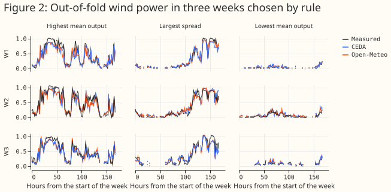
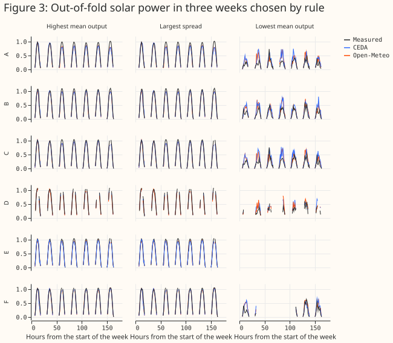
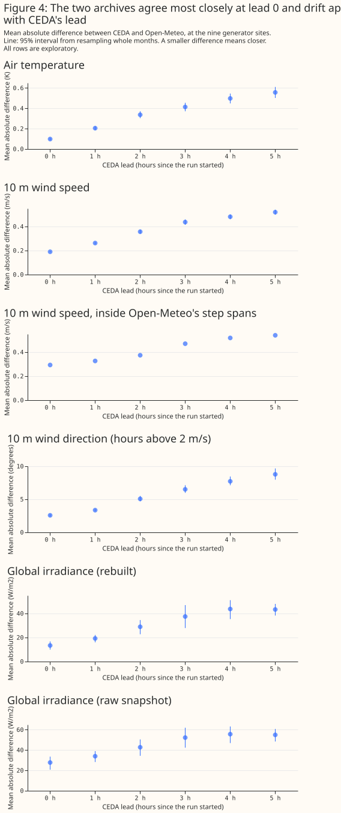
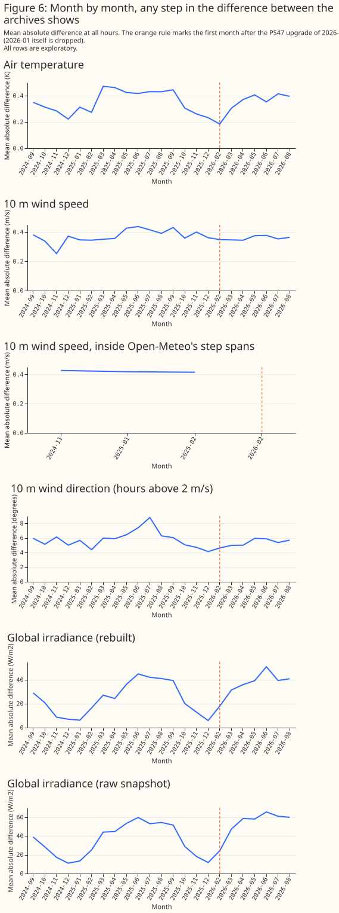
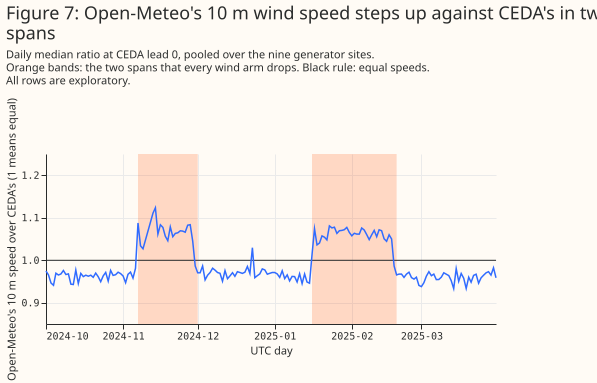
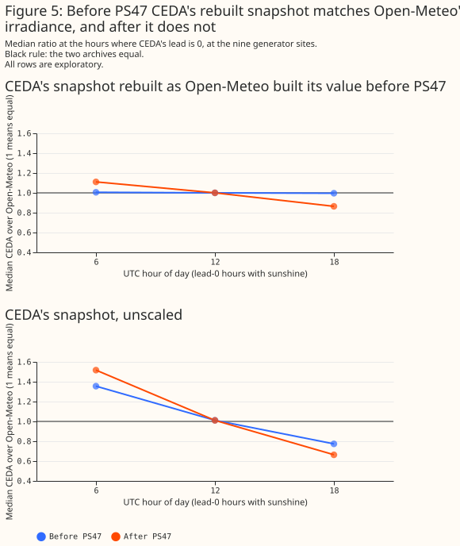
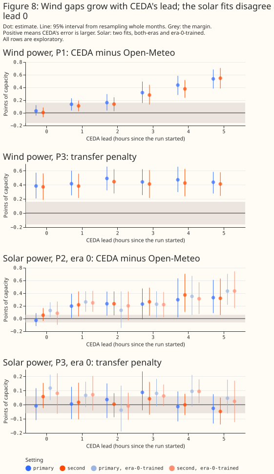
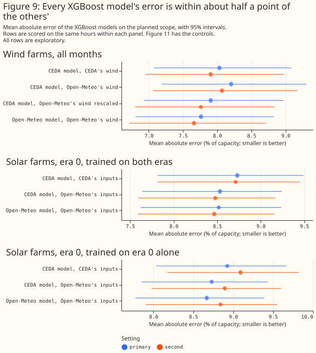

# CEDA's and Open-Meteo's archives of UKV give wind-power errors that match within 0.16 points at lead 0, but a wind model trained on CEDA's archive loses accuracy on Open-Meteo's wind speeds

**This study asks whether the two archives of the Met Office's weather model for the United Kingdom
(UKV) that the project can read give the same forecasts of wind and solar power.** One archive comes
from CEDA, a UK data centre, and holds UKV from September 2019. The other comes from Open-Meteo, a
public weather-data service, and its own UKV downloader starts in August 2024. The two archives
overlap for 23 whole months. Each month holds hourly values at the metered wind and solar farms, and
the question matters because a forecast trained on the longer CEDA history would be used with
whichever UKV values the forecast meets later.

**The answers, in plain words, are these.** At the start of each run of the weather model, the two
archives hold almost the same weather: air temperature differs by about a tenth of a degree, and
Open-Meteo's wind speed is about 3% lower than CEDA's. CEDA's archive is made of 6-hourly runs, and
its values for the later hours of each run drift away from Open-Meteo's. A forecast of wind-farm or
solar-farm power built on CEDA's archive has a larger error than one built on Open-Meteo's, but most
of that gap is CEDA's later hours, and at the start of each run the two forecasts match for wind and
cannot be told apart for solar. A wind forecast trained on CEDA's archive and then given Open-Meteo's
wind speeds loses accuracy, because it under-predicts when the speeds are 3% lower, and a simple
rescaling of the speeds removes most of the loss. For solar power the loss could not be resolved.
By the rules written before the study, a wind forecast trained on CEDA's history should not be given
Open-Meteo's values, and solar should be treated the same way by default. The page gives every
number with its interval below, defines its terms before it uses them, commits the project to
nothing, and does not compare CEDA's archive with the Met Office's own live feed.


**The page uses a few terms from the start, so the table below defines them first.** Every
difference on the page is CEDA's error minus Open-Meteo's, so a positive number means CEDA's is
larger. Each bracket holds a 95% interval from resampling whole calendar months and one of three
fitting seeds. The plan fixed the first group of comparisons below before any result existed. Every
other comparison is exploratory.

| Term | Meaning |
|---|---|
| CEDA archive, Open-Meteo archive | Two copies of UKV's output, a 2 km weather model of the United Kingdom. CEDA's holds the runs that start at 00, 06, 12, and 18 UTC. Open-Meteo's serves each hour's freshest analysis |
| Lead | Hours since a run of the weather model started. CEDA's values for an hour come from the latest run, so their lead is 0 to 5 hours. Open-Meteo's are always lead 0 |
| XGBoost model | A gradient-boosted tree model fitted for each wind or solar farm to its measured power |
| Points of capacity | Mean absolute error as a percentage of each farm's capacity, so 0.27 points on a 100 MW farm is 0.27 MW |
| Margin | The smallest difference the study counted as clear, fixed before any result: 0.16 points for wind and 0.06 for solar |
| P1 (planned) | Wind power: the XGBoost model given CEDA's 10 m wind minus the model given Open-Meteo's, each trained and scored on its own archive |
| P2 (planned) | Solar power: the same contrast for global irradiance and temperature, read on era 0 |
| P3 (planned) | Transfer penalty: the model trained on CEDA's values and scored on Open-Meteo's values, minus the model trained and scored on Open-Meteo's. Only a positive penalty counts |
| Era 0, era 1 | Before and after the Met Office's UKV upgrade of 21 January 2026 (PS47). Era 0 is 2024-09 to 2025-12 and era 1 is 2026-02 to 2026-08 |
| Primary, second setting | Two fixed, untuned choices of the XGBoost model's tree depth, learning rate, and number of rounds. A verdict stands only if both settings agree |
| Differ, interchangeable, unresolved | The three readings of P1 and P2. "Differ": the interval excludes zero and the estimate lies beyond the margin. "Interchangeable": the whole interval lies inside the margin. Anything else is "unresolved" |
| Penalty, no penalty, unresolved | The three readings of P3, read one-sided: a penalty needs the interval above zero and the estimate beyond the margin, and no penalty needs the upper bound below the margin |
| Planned, exploratory | Planned comparisons were written into the study plan before any result existed. Every other row, including every row labelled exploratory, is one of many and about one in 20 rows with no real effect reaches statistical significance at the 5% level by chance |

> **How this page was made.** The research question came from a human. Everything else — the code
> behind every result, the analysis, the figures, and the text — was written by Claude, Anthropic's
> AI model (for this page, Claude Opus 5, Claude Opus 5.5, Claude Sonnet 5, and Claude Sonnet 5.5).
> Several independent Claude reviewers have checked the method, the evidence, and the prose
> adversarially.

## Key findings

- **The two archives' temperature agrees to 0.098 K at lead 0 and 0.557 K at lead 5,** and the 10 m
  wind speed, wind direction, and irradiance also agree most closely at lead 0 and drift apart with
  CEDA's lead ([the model-free
  comparison](#the-archives-agree-closely-at-lead-0-and-drift-apart-with-cedas-lead)).
- **Open-Meteo's 10 m wind speed is about 3% below CEDA's at lead 0, and in two spans (2024-11-07 to
  2024-11-30 and 2025-01-16 to 2025-02-18) it is about 6% above,** so every wind arm drops the spans
  and the three months they empty ([the step in the served
  wind](#open-meteos-10-m-wind-speed-is-about-3-below-cedas-and-steps-up-in-two-spans)).
- **Open-Meteo builds its hourly irradiance from a snapshot with a zenith-angle scaling that CEDA's
  raw snapshot lacks, and the scaling matches before the 2026 upgrade but not after it,** so the
  solar contrasts are planned on era 0 only ([the irradiance
  construction](#open-meteo-builds-its-hourly-irradiance-differently-after-ps47-and-in-low-sun)).
- **Wind power (P1): CEDA's error is larger by +0.270 points [+0.209, +0.333], and at lead 0 the gap
  is +0.030 [-0.043, +0.122],** which lies inside the 0.16-point margin ([wind
  P1](#wind-power-ceda-is-0270-points-worse-over-all-hours-and-level-at-lead-0)).
- **Solar power (P2, era 0): CEDA's error is larger by +0.212 points [+0.109, +0.332], and at lead 0
  the gap is -0.028 [-0.117, +0.086],** which is not statistically significant ([solar
  P2](#solar-power-the-same-pattern-before-the-2026-upgrade)).
- **Wind transfer penalty (P3): +0.441 points [+0.286, +0.600], a level bias of about 2 points of
  capacity from the speed offset,** and rescaling Open-Meteo's speed leaves +0.142 [+0.066, +0.217]
  ([the transfer
  penalty](#a-wind-model-trained-on-ceda-loses-0441-points-on-open-meteos-wind-mostly-through-the-speed-level)).
- **Solar transfer penalty (P3): unresolved, with a largest upper bound of +0.125 points,** and by
  the plan's default rule it is treated as a penalty ([solar
  P3](#the-solar-transfer-penalty-is-unresolved)).
- **The controls, the second setting, and the GPU-against-CPU refit bound the noise,** and the
  shuffled wind control is not a clean null ([controls and
  noise](#the-controls-and-the-refit-bound-the-noise-but-the-shuffled-control-is-not-a-clean-null)).
- **By the plan's rule the training-history reading is "do not mix the two archives" for wind and,
  by default, for solar,** within this study's scope and with the licence left to the maintainer
  ([discussion](#discussion-what-to-use)).

## Introduction

**Flexpectation's weather-driven forecasts of wind and solar power learn from a history of past
weather, and UKV is one weather product that history can read.** The Met Office runs UKV every few
hours, and two archives of its output are available to the project. CEDA's archive reaches back to
September 2019, which covers the whole record of the network operator's power data. Open-Meteo's
archive serves the freshest analysis for each hour and starts its own UKV downloader on 12 August
2024. A forecast trained on CEDA's long history and then given Open-Meteo's values, or the reverse,
would meet inputs that the training never showed it. The CEDA download notes record that CEDA's
archive differs statistically from the live feed, and the earlier
[CEDA-against-ERA5 study](ukv-ceda-vs-era5.md) used CEDA's archive alone. This study measures how
different the two archives are, in temperature, wind, and irradiance, and in the power forecasts
that the project cares about.

| | CEDA archive | Open-Meteo archive |
|---|---|---|
| Source | The Met Office's UKV files at CEDA | Open-Meteo's mirror of UKV |
| Grid | 2 km, read at the cell nearest each farm | 2 km, served for each farm's coordinates |
| Runs and leads | 6-hourly runs, read at leads 0 to 5 hours | The freshest analysis for each hour (lead 0) |
| History used here | 2019-09 onward, 23 whole months overlap Open-Meteo | 2024-08-12 onward (earlier values are a backfill from an unnamed source) |
| Wind speed unit | m/s | km/h, converted here to m/s |
| Irradiance | One downward shortwave field, an instantaneous snapshot | An hourly value built from the snapshot at the hour's end |
| Licence | Creative Commons Attribution-NonCommercial-ShareAlike 4.0 | Open-Meteo's terms |

**This study compares CEDA's archive with Open-Meteo's UKV and not with the Met Office's own live
feed.** An earlier check of Open-Meteo's irradiance against the Met Office's files, for hours since
12 August 2024, found them within 0.55 W m⁻², but nobody has checked Open-Meteo's wind and
temperature against those files. A separate pilot of the live feed is in progress, and its result
may differ from this page's. The page promises no further study.

## Data and methods

**The study compares the two archives at the project's metered generators, in two ways: directly,
and through the power forecasts that an XGBoost model makes.** The metered generators are three
wind farms, labelled W1 to W3, and six solar farms, labelled A to F. Both sets sit in one box in
Lincolnshire. The labels come from a fixed permutation, and the page gives no farm's name,
identifier, or coordinates.

**The study's months are 2024-09 to 2025-12 (era 0, 16 months) and 2026-02 to 2026-08 (era 1, 7
months).** 2024-08 and 2026-09 hold fewer than 25 days of Open-Meteo's data, and 2026-01 holds the
upgrade of 21 January 2026, so the study drops those three months from every arm. The only change
of UKV's physics inside the overlap is that upgrade (PS47). The earlier upgrades, PS43 in December
2019, PS44 (whose date the project could not find), and PS45 in May 2022, precede Open-Meteo's UKV,
so the study cannot test them. A move to new computers in May 2025 (PS46) lies inside era 0, and the
model-free tables read before and after it without attributing a difference to it.

**The rows are decided by the target and by availability, never by either archive's value, with one
exception that the next paragraph states.** An hour stays only if the farm's power exists and both
archives hold every column an arm reads. An hour whose latest CEDA run is missing or partial is
dropped and never filled from an older run, because that would change its lead. The wind rows drop
every hour that holds an exactly zero half-hour, and the solar rows drop the commissioning ramp, as
the CEDA-against-ERA5 study did, and the solar rows carry that study's export-cap flag, which
excludes the hours the network operator curtailed from training and still scores them. The 94 hours
from 2024-11-09 to 2024-11-13 that Open-Meteo's earlier extract lacks are dropped from every arm,
and so are the 26 hours with a null wind direction.

**The exception is two spans in which Open-Meteo's 10 m wind speed is built differently, which
every wind arm drops.** The first fit found that Open-Meteo's speed against CEDA's at lead 0 reads
about 0.97 in most months and higher in three of them. The lineage check (committed as
`ukv_ceda_vs_openmeteo_wind_steps.py`) found two spans with sharp edges, the UTC days 2024-11-07 to
2024-11-30 and 2025-01-16 to 2025-02-18. The edges were set from the served series, from the ratio
of Open-Meteo's speed to CEDA's and not from any power result, at the resolution of whole UTC days,
so a few hours at each edge are dropped that the series did not change. A month that loses more than
a quarter of its rows to the spans is dropped whole: 2024-11, 2025-01, and 2025-02 lose 84%, 52%,
and 65%. The wind rows fall to 40,287, which is 13 months of era 0 and 7 of era 1. The solar rows
keep all 23 months, because none of the solar inputs steps in the spans.

**Open-Meteo's values are converted to match CEDA's, and a guard checks each conversion at lead 0,
where both archives are the same UKV analysis.**

- **Wind speed** is divided by 3.6, because Open-Meteo serves km/h. The guard stops the build if the
  median ratio of the two archives' speeds leaves 0.9 to 1.1, and a test shows that a factor of 3.6
  fails it.
- **Temperature** is the mean of the instants at the two ends of each hour, for both archives,
  because the solar power hour ends at its label.
- **Irradiance** needs more care. Open-Meteo's hourly value is UKV's snapshot at the hour's end
  multiplied by the ratio of the hour's mean cosine of the sun's zenith angle to the cosine at the
  hour's end. The study applies the same ratio to CEDA's snapshot, because CEDA's raw snapshot reads
  36% high at 06 UTC and 23% low at 18 UTC against Open-Meteo's value. The guard requires the median
  ratio of CEDA's rebuilt value to Open-Meteo's to stay within 0.97 to 1.03 at every hour of day in
  era 0.

**Every wind farm and every solar farm gets one XGBoost model per archive, trained on that farm's
own history.** The wind arms read the archive's 10 m wind speed and the sine and cosine of its 10 m
wind direction, plus the hour of day, the day of the year, and the era (6 columns each). CEDA has no
100 m wind, so the matched 10 m pair is the only wind pair both archives can serve. The solar arms
read the archive's global irradiance and temperature, the sun's zenith angle and azimuth, the
extraterrestrial flux, the hour of day, the day of the year, and the era (8 columns each). Beam and
diffuse irradiance cannot enter, because CEDA holds one shortwave field. XGBoost's column
subsampling is off, so a pair of arms with equal columns cannot win on a column count. The folds
are blocks of whole calendar months cut inside each era and rotated so that every calendar month
that occurs in two years has a training row. Each arm is fitted at both settings with three seeds
on a GPU, and one wind arm is refitted on the CPU to measure the difference between the two.

**The transfer scoring uses one fitted model to score several frames, so that the transfer penalty
needs no second fit.** The model trained on CEDA's values predicts each held-out fold from CEDA's
values, from Open-Meteo's values under CEDA's column names, and from a few partial swaps. Its
predictions on CEDA's own values are the arm P1 reads, and its predictions on Open-Meteo's values
are the treatment P3 reads.

**The solar contrasts are planned on era 0, and each is fitted twice.** The solar planned contrasts
(P2 and P3 for solar) are read on the 16 months of era 0, because Open-Meteo builds its hourly
irradiance differently after the upgrade (see the irradiance section below). One fit trains on the
rows of both eras and is scored on era 0. The other trains on era 0 alone, so that the construction
that differs after the upgrade cannot reach it. A solar verdict stands only if all four readings
agree (two fits at two settings), and otherwise it is "unresolved". The wind contrasts read all 20
months. The solar fits add 24 fit-sets, so the study has 78 fit-sets in all, plus 3 on the CPU.

**The margins are those of the [CEDA-against-ERA5 study](ukv-ceda-vs-era5.md), and this overlap may
be too short to resolve them.** The margins, 0.16 points for wind and 0.06 for solar, were fixed
before any result, and that study took them from the half-widths of earlier pages' intervals. This
study's solar P3 interval, [-0.042, +0.071] at the primary setting, is wider than the 0.06 margin,
so an "interchangeable" reading of the solar contrasts was out of reach before the fit, and a small
true difference was likely to read "unresolved". Each interval resamples whole calendar months,
paired across arms, and one of the three fitting seeds, 2,000 times, and an interval covers
month-to-month weather and the seed and not differences between farms.

## Results

### The XGBoost models track measured power at every farm

**Before any contrast, Figures 2 and 3 show that the XGBoost models forecast measured power
sensibly.** Each panel draws the out-of-fold prediction from the CEDA-trained and the
Open-Meteo-trained model against the measured power, in three weeks chosen by a stated rule: the
week of highest mean output, the week of the largest hour-to-hour spread, and the week of lowest
mean output. The wind weeks are in September 2025 (the first two) and October 2025, and the solar
weeks are in March 2025 (the first two) and August 2025. The mean absolute error of the models on
the planned scope is about 7.8% of capacity for wind and about 8.5% to 8.9% for solar (Figure 9),
and a model given weather shuffled within each month and hour has an error of 19.357% for wind
and 14.394% for solar, so the models use the weather they are given.





### The archives agree closely at lead 0 and drift apart with CEDA's lead

**The model-free comparison needs no forecast: it reads the two archives' values at the nine
generator sites and differences them.** At lead 0, where both archives are the same analysis, the
mean absolute difference in air temperature is 0.098 K [0.088, 0.109] and the correlation is
0.9997. The difference grows with CEDA's lead to 0.557 K [0.502, 0.611] at lead 5 (correlation
0.9919). The 10 m wind speed follows the same pattern: 0.190 m/s [0.185, 0.195] at lead 0 and
0.519 m/s [0.499, 0.540] at lead 5, with a correlation of 0.9944 at lead 0. The 10 m wind direction
differs by 2.580 degrees [2.393, 2.752] at lead 0 and 8.783 degrees [7.972, 9.668] at lead 5, in
hours when CEDA's speed exceeds 2 m/s. At lead 0 CEDA's direction is 1.898 degrees [1.754, 2.044]
lower than Open-Meteo's, a small rotation that does not change with era. Figure 4 draws the four
variables by lead. The intervals resample whole months, and every row is exploratory.



**Two features of the table limit what "the same analysis" can mean.** Open-Meteo does not serve the
nearest CEDA cell's value: the nearest of the nine CEDA cells around a site has the value closest
to Open-Meteo's at only 27% of lead-0 hours for wind speed and 47% for temperature, against 11% by
chance. So even at lead 0 the two archives are not one analysis sampled at one cell, and the
archives differ in how their values are interpolated or in which grid they read. Figure 6
draws the monthly mean absolute difference with the 2026 upgrade marked. The irradiance difference
rises after the upgrade, and the other three variables show no step that stands out from their
month-to-month swings, which is a reading of the chart and not a test. The before-and-after rows at
May 2025 (PS46) are labelled as not an isolated PS46 effect, because the two rows also differ in the
months they hold.



### Open-Meteo's 10 m wind speed is about 3% below CEDA's, and steps up in two spans

**At lead 0, Open-Meteo's 10 m wind speed averages 4.052 m/s against CEDA's 4.196 m/s, a
difference of +0.144 m/s [+0.137, +0.152] in CEDA minus Open-Meteo.** The median ratio of
Open-Meteo's speed to CEDA's is 0.968 outside the two spans described below, and it stays between
0.960 and 0.974 in each of the 20 months outside them, so the offset is a level difference between
the archives and not noise. It
reappears in the power forecasts as the wind transfer penalty.

**In two spans with sharp edges the ratio rises to 1.063, and the step is in Open-Meteo's served
series.** The spans are the UTC days 2024-11-07 to 2024-11-30 and 2025-01-16 to 2025-02-18. In them
the median ratio of Open-Meteo's speed to CEDA's is 1.063 against 0.968 outside, on 1,944 and 22,761
site-hours at lead 0. CEDA's speed against ERA5's stays steady across the months while Open-Meteo's
against ERA5's rises in the spans (2024-11: 0.774 for Open-Meteo against 0.754 for CEDA), which puts
the step in Open-Meteo's archive. Open-Meteo's 100 m to 10 m speed ratio falls from 1.945 to 1.789
in the spans, so the 10 m speed rose relative to the 100 m speed. Open-Meteo's temperature offset
(+0.009 K against +0.022 K), wind-direction difference (+1.0 against +2.0 degrees), and irradiance
ratio (0.999 against 1.000) do not step. The `combined.parquet` file that the study reads equals the
`site_points/` extract that the other studies read in all 3,894 rows they share inside the spans, so
the step is in what Open-Meteo served and not in this study's file. The page does not know why
Open-Meteo's 10 m speed steps.



**The first fit, which kept the spans, read wind P1 as unresolved (+0.162 [+0.080, +0.241] at the
primary setting) and wind P3 as a penalty of +0.313 [+0.163, +0.459].** The study dropped the spans
after the first fit and refitted every arm, and the rerun's numbers are the page's. Inside the spans
the sign of the speed difference reverses (CEDA minus Open-Meteo is -0.251 m/s at lead 0), so
keeping them blurred the transfer penalty. The step is a risk to every wind result on the page, and
the page states it under Limitations.

### Open-Meteo builds its hourly irradiance differently after PS47 and in low sun

**CEDA's raw snapshot and Open-Meteo's hourly irradiance differ by up to 36% by hour of day, and
rebuilding CEDA's snapshot as Open-Meteo builds its value removes the difference before PS47.** At
lead 0 in era 0, the median ratio of CEDA's rebuilt irradiance to Open-Meteo's is 1.005 at 06 UTC,
1.000 at 12 UTC, and 0.996 at 18 UTC. The raw snapshot's ratios are 1.355, 1.011, and 0.774. After
the upgrade the rebuilt ratios are 1.111, 1.000, and 0.864 (the raw ones are 1.517, 1.010, and
0.663), so Open-Meteo builds its hourly value some other way. The mean absolute difference at lead 0
is 8.005 W m⁻² [6.416, 9.231] in era 0 and 22.939 W m⁻² [19.970, 25.770] in era 1. For this reason
the solar contrasts are planned on era 0 and the solar rows of era 1 are exploratory, with the note
"irradiance construction differs after PS47 (ratio 1.11 at 06 UTC, 0.86 at 18 UTC)".



**The rebuild also fails in low sun in both eras, and the mismatch after PS47 is not confined to low
sun.** By the sun's elevation, the median rebuilt ratio in era 0 is 0.008 up to 2 degrees, 0.681
from 2 to 5 degrees, 0.975 from 5 to 10 degrees, and 1.000 above 10 degrees. In era 1 the median
ratio is 1.003, 1.004, and 1.000 for the three bins above 10 degrees, but the 10th to 90th
percentile of the ratio is 0.823 to 1.210 from 10 to 20 degrees, against 0.941 to 1.058 in era 0.
The "sun above 5 degrees" scope barely moves the solar contrasts (P2 on era 0 reads +0.227
[+0.115, +0.365] against +0.212 [+0.109, +0.332]).

### Wind power: CEDA is 0.270 points worse over all hours, and level at lead 0

**Over all hours, the XGBoost model given CEDA's 10 m wind has a mean absolute error larger than
the model given Open-Meteo's by 0.270 points of capacity [+0.209, +0.333] at the primary setting
and 0.243 [+0.192, +0.294] at the second (P1, planned).** Both readings are "differ": the intervals
exclude zero and the estimates exceed the 0.16-point margin. The two models' own errors are 8.032%
[7.074, 9.083] for CEDA and 7.763% [6.805, 8.823] for Open-Meteo at the primary setting.

**The gap is mostly CEDA's lead, because it grows from +0.030 at lead 0 to +0.536 at lead 5.**
Figure 8 draws the planned contrasts by CEDA lead, and every row is an exploratory subset of the
planned fit. At lead 0 the gap is +0.030 [-0.043, +0.122] at the primary setting and +0.006
[-0.069, +0.085] at the second, and both intervals lie inside the margin. The gap is +0.135, +0.162,
+0.318, and +0.437 at leads 1 to 4 and +0.536 [+0.383, +0.682] at lead 5. A CEDA-trained model is
trained on all leads and so scores the lead-0 subset with a model that also learned from leads 1 to
5, which the page notes under Limitations. A lead of 0 hours is the case in which both archives are
the same analysis, so P1 over all hours measures CEDA's 6-hourly archive against Open-Meteo's
hourly analysis as much as it measures a difference between the two products.



### Solar power: the same pattern before the 2026 upgrade

**On era 0, the model given CEDA's irradiance and temperature has a larger error than the model
given Open-Meteo's by 0.212 points [+0.109, +0.332] at the primary setting and 0.246 [+0.127,
+0.393] at the second (P2, planned), and the fit trained on era 0 alone agrees (+0.256 [+0.173,
+0.360] and +0.251 [+0.155, +0.360]).** The verdict is "differ", because all four readings agree. At
CEDA lead 0 the gap is -0.028 [-0.117, +0.086] in the fit trained on both eras, which is not
statistically significant, and it grows to +0.330 [+0.086, +0.609] at lead 5. The era-0-trained fit
shows +0.127 [+0.021, +0.257] at lead 0, a difference between the two models and not between the
inputs (see the transfer section). On era 1, the exploratory rows read +0.267 [+0.098, +0.452] with
the note about Open-Meteo's irradiance construction.

### A wind model trained on CEDA loses 0.441 points on Open-Meteo's wind, mostly through the speed level

**When the model trained on CEDA's wind is given Open-Meteo's wind and scored on the same hours, its
error is larger than the Open-Meteo-trained model's by 0.441 points [+0.286, +0.600] at the primary
setting and 0.408 [+0.242, +0.574] at the second (P3, planned).** Both readings are "penalty". The
penalty is +0.474 [+0.279, +0.661] in era 0 and +0.375 [+0.122, +0.651] in era 1, and +0.648
[+0.352, +0.881] from October to March against +0.298 [+0.145, +0.469] from April to September (all
exploratory). At lead 0 it is +0.384 [+0.208, +0.571], so unlike P1 the penalty does not shrink at
lead 0.

**The penalty is a level bias.** Figure 10 draws each wind arm's mean signed error, which is the
prediction minus the measured power as a share of capacity. The CEDA-trained model on CEDA's wind
has a mean signed error of -0.974 points, the Open-Meteo-trained model on Open-Meteo's wind has
-0.914, and the CEDA-trained model on Open-Meteo's wind has -3.327. The
model under-predicts by about 2 more points when it is given speeds that are 3% lower, which is what
a lower input speed produces on the steep part of a power curve. Swapping only the direction, which
differs by about 2 degrees, adds +0.023 points [+0.009, +0.037], so the direction carries almost
none of the penalty.


**Rescaling Open-Meteo's speed to CEDA's level removes most of the penalty and leaves +0.142
points [+0.066, +0.217] (exploratory).** The calibrator test scores the CEDA-trained model on
Open-Meteo's speed multiplied by each site's median ratio of CEDA's to Open-Meteo's speed at lead-0
instants, learned on the training folds only. The penalty falls from +0.441 to +0.142, which is
still statistically significant at the 5% level, and the mean signed error rises from -3.327 to
-1.555 points. A rescale therefore absorbs most of the level bias and not all of the penalty. The
study tested no other calibrator and no calibrator for solar.


### The solar transfer penalty is unresolved

**For solar power on era 0, the transfer penalty reads +0.014 points [-0.042, +0.071] at the primary
setting and +0.012 [-0.047, +0.067] at the second in the fit trained on both eras, so P3 is
"unresolved" for solar.** The fit trained on era 0 alone reads +0.061 [+0.010, +0.115] at the
primary setting, which is a penalty by the rule, and +0.054 [-0.012, +0.125] at the second, which is
unresolved. A verdict stands only if all four readings agree, so the verdict is "unresolved". The
largest upper bound across the four readings is +0.125 points, against absolute errors of 8.5% to
8.9%. By the plan's rule an unresolved reading is treated as a penalty, and the page states that
this is a default and not a measured penalty.

**The two fits differ in what they show, and the data say which input matters.** On era 0, the
Open-Meteo-trained model scores 8.52% when trained on both eras and 8.67% when trained on era 0
alone, and the CEDA-trained model scored on Open-Meteo's inputs scores 8.53% and 8.73%, so the
extra era-1 rows did not hurt either model on era 0. At CEDA lead 0 the era-0-trained CEDA model
scores 8.96% on CEDA's inputs and 8.95% on Open-Meteo's, so its transfer penalty is a difference
between the two models and not an input mismatch: the CEDA-trained model also learned from CEDA's
lead 1 to 5 inputs (exploratory). Scored on Open-Meteo's irradiance alone the CEDA-trained model's
error is -0.216 points [-0.352, -0.115] below its error on CEDA's, and scored on Open-Meteo's
temperature alone it is +0.017 [-0.001, +0.036] above, so irradiance and not temperature carries
any difference. The page does not explain the sign.

### The controls and the refit bound the noise, but the shuffled control is not a clean null

**The shuffled-weather controls and the GPU-against-CPU refit show how much of a contrast could be
noise.** Each archive's weather columns were shuffled within a site, a month, and an hour of day,
under its own permutation, and the shuffled CEDA arm minus the shuffled Open-Meteo arm reads -0.249
points [-0.522, +0.021] for wind and -0.068 [-0.248, +0.119] for solar, neither statistically
significant. The shuffled arms' errors are 19.357% and 19.606% for wind and 14.394% and 14.527% for
solar, far above the real arms' 7.7% to 8.9%. The shuffle keeps each archive's monthly-hourly
distribution, including Open-Meteo's lower speed level and CEDA's lead-dependent spread, so the two
shuffled arms are not equally informative by construction, and the control does not size the noise
of the pipeline. The refit of the Open-Meteo wind arm on the CPU reads -0.007 [-0.050, +0.022]
against the GPU fit, which is the noise floor of a refit. Figure 9 draws every arm's absolute error
and its interval.



### The second setting, the eras, the seasons, and the farms leave the readings as they are

**The second hyperparameter setting gives the same verdict as the primary setting for wind P1,
wind P3, and solar P2.** Wind P1 reads "differ" at both settings (+0.270 and +0.243), and wind P3
reads "penalty" at both (+0.441 and +0.408). Solar P3 is unresolved because its four readings
disagree. The exploratory splits agree in sign: wind P1 is +0.254 [+0.176,
+0.330] in era 0 and +0.300 [+0.209, +0.403] in era 1, +0.315 [+0.209, +0.414] from October to March
and +0.239 [+0.176, +0.310] from April to September, and +0.262 [+0.172, +0.342], +0.242 [+0.128,
+0.351], and +0.308 [+0.169, +0.444] at W1, W2, and W3. Wind P3 at the three farms reads +0.392
[+0.218, +0.565], +0.514 [+0.331, +0.693], and +0.410 [+0.049, +0.746]. The row "without 2025-01"
repeats the planned row for wind, because the wind rows hold no January 2025, and for solar it
reads +0.234 [+0.141, +0.335] for P2. Every one of these is one of many exploratory rows.

## Discussion: what to use

**This section reads the evidence as the plan's rules fix it, and it commits the project to
nothing.** The rules came before any result: a P3 reading of "penalty" or "unresolved" means do not
mix the two archives, and "no penalty" would have allowed a model trained on CEDA's history to be
given Open-Meteo's values.

- **Wind, training on CEDA's history and serving Open-Meteo's UKV:** the rule says train on
  Open-Meteo's history only (from August 2024) for wind, because P3 is a penalty at both settings
  (+0.441 and +0.408), and a calibrator is an alternative only where a calibrator test shows that it
  absorbs the penalty. A speed rescale left +0.142 [+0.066, +0.217]. What would change this: a
  longer overlap, a calibrator that removes the remaining penalty, or a reading of Open-Meteo's wind
  against the Met Office's files that explains the 3% offset and the two spans.
- **Solar, the same question:** the reading is "unresolved", so by the plan's default rule solar is
  treated like wind and the two archives are not mixed until a longer overlap exists. The study did
  not measure a solar penalty. The largest upper bound across its readings is +0.125 points, against
  absolute errors of 8.5% to 8.9%.
- **Comparing the archives' own accuracy:** P1 and P2 over all hours say that CEDA's 6-hourly
  archive, read at its latest run, gives a larger power error than Open-Meteo's hourly analysis, and
  the lead-0 rows say that the gap is mostly the lead (wind +0.030 [-0.043, +0.122], solar era 0
  -0.028 [-0.117, +0.086]). The page does not say that either archive is the better product.
- **The licence:** CEDA's catalogue record gives the Creative Commons Attribution-NonCommercial-
  ShareAlike 4.0 licence, so whether the main work's use of CEDA's UKV as training history is
  non-commercial is a decision for the maintainer.
- **The Met Office's live feed:** this study did not compare it with CEDA's archive, and a pilot of
  the feed is in progress, so the page makes no statement about it.

## Limitations

- **The comparison is between CEDA's archive and Open-Meteo's UKV, a proxy for the live feed.** Only
  Open-Meteo's irradiance has been checked against the Met Office's files. Open-Meteo's wind and
  temperature have not been checked, and the 3% speed offset and the two spans may come from
  Open-Meteo's processing and not from UKV.
- **The two spans were found from the served series and dropped.** The edges are whole UTC days, a
  few hours at each edge are dropped without a change, and the choice rests on Open-Meteo's ratio to
  CEDA's and not on a power result. The first run, which kept the spans, read wind P1 as unresolved.
  The page cannot rule out that further spans exist at a smaller size.
- **Leads beyond 5 hours are untested.** A live service would feed forecasts at leads of hours to
  days. A lead-0 analysis is the least noisy input such a model could meet, so the transfer penalty
  probably understates the effect for solar, and for wind the speed scale would carry over.
- **The lead-0 rows are scoring subsets.** The models are trained on all leads, so the lead-0 rows
  do not show how a model trained only on lead 0 would do.
- **The overlap is 23 months, and the planned solar contrasts rest on 16.** The era-1 rows rest on 7
  months and have approximate intervals, the intervals cover month-to-month weather and the seed,
  and the study covers three wind farms and six solar farms in one box in Lincolnshire.
- **Open-Meteo's irradiance construction changes after PS47, and the rebuild fails in low sun in
  both eras.** The solar results hold for the era before the upgrade only, and for a sun more than
  about 10 degrees above the horizon.
- **The `effective_capacity` table behind every figure is the one of the CEDA-against-ERA5 study,**
  at Delta version 1, as that study's build stamp records.
- **Beam and diffuse irradiance, 100 m wind, and the Met Office's stations are not compared,** and
  the study has no station check. Open-Meteo's UKV at the stations was not downloaded.
- **About one exploratory row in 20 with no real effect reaches statistical significance at the 5%
  level by chance,** and the report holds many exploratory rows over shared months. The page quotes
  an exploratory label only with its scope.

## Scope

**The study covers temperature, 10 m wind, and global horizontal irradiance at nine generators, over
23 months.** It does not cover other variables that the main forecast reads (such as pressure, dew
point, and precipitation), other weather products, other regions, or forecasts at leads beyond 5
hours. It does not compare the archives with measurements of the weather, and it does not say which
archive is closer to what happened.

## Data and code availability

**CEDA's UKV archive is public to registered users under the Creative Commons
Attribution-NonCommercial-ShareAlike 4.0 licence, and Open-Meteo's historical-forecast archive is
public.** The power data, the farm locations, and the frames and per-row losses are private. The
scores and charts on this page carry no UKV values. The code is in `studies/past_weather/` and
`packages/studies/` at the commit that merged this page. The XGBoost version is 3.4.1, the device is
an NVIDIA RTX A6000, and the two settings are those of the CEDA-against-ERA5 study. The source for
CEDA's data is Met Office (2016): NWP-UKV: Met Office UK Atmospheric High Resolution Model data,
Centre for Environmental Data Analysis.

## Reproducing the figures

Each script's output folder is write-once, so move an earlier output to a `superseded/` subfolder of
`data/studies/per_study/ukv_ceda_vs_openmeteo/` before a re-run. The build reads the
CEDA-against-ERA5 study's frames and Open-Meteo's previous-runs file, which
`studies/weather_downloads/` fetches.

```bash
uv run python studies/past_weather/ukv_ceda_vs_openmeteo_build.py --check-only   # must exit 0
uv run python studies/past_weather/ukv_ceda_vs_openmeteo_build.py
uv run python studies/past_weather/ukv_ceda_vs_openmeteo_compare.py
uv run python studies/past_weather/ukv_ceda_vs_openmeteo_wind_steps.py
uv run python studies/past_weather/ukv_ceda_vs_openmeteo_fit.py --verified --device cuda
uv run python studies/past_weather/ukv_ceda_vs_openmeteo_charts.py
```

Then optimise each figure in `docs/studies/assets/ukv_ceda_vs_openmeteo/` with
`npx svgo@4 --multipass --precision=1 --final-newline`. After a review, `fit.py --report-only`
rebuilds the intervals and the reports from the saved losses.
