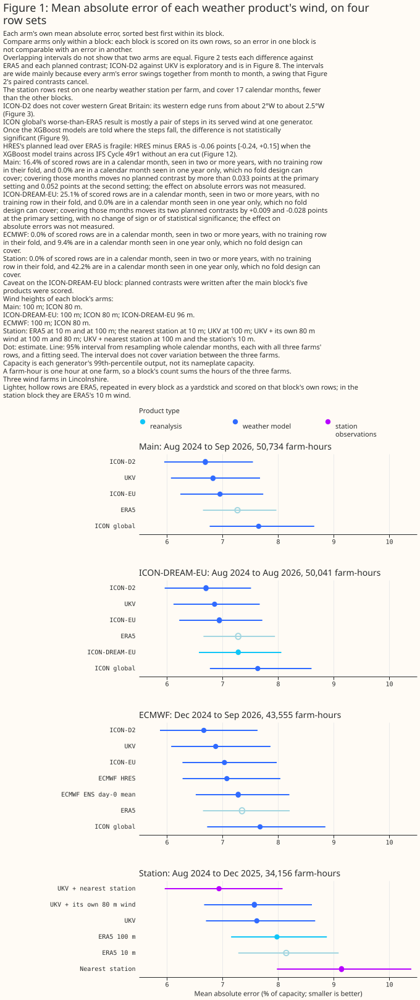
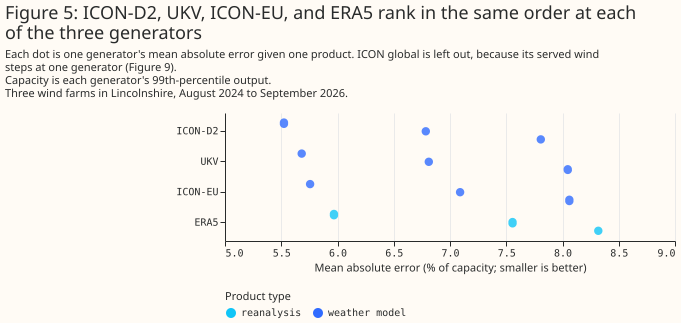
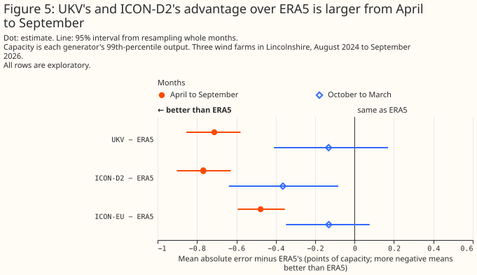
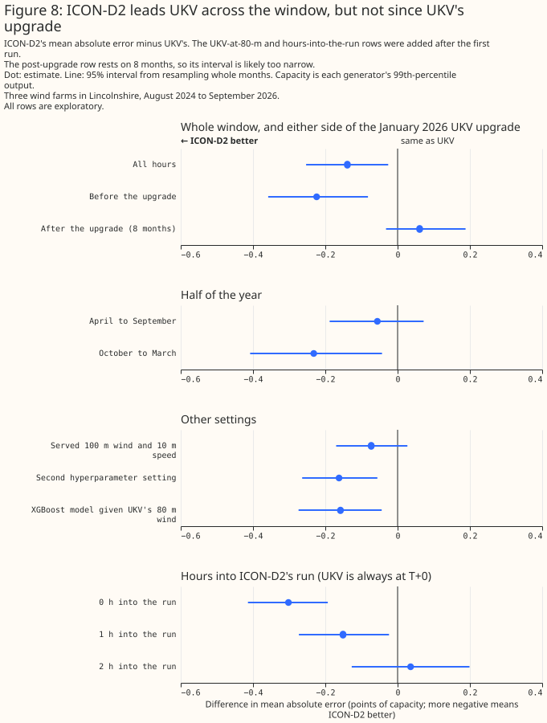

# Which weather product best describes past wind?

> **This study uses only Flexpectation's own data, and its purpose is to inform Flexpectation's
> choices.** The study scores each weather product only at the wind farms in Flexpectation's trial
> area in Lincolnshire. The study does not compare results across many regions or climates, so a
> result on this page may not hold elsewhere.

**At three wind farms in Lincolnshire, the German weather service's ICON-D2 and the Met Office's UK
variable-resolution model (UKV) describe past wind best of the five products on the main row set.**
ICON-D2 belongs to the German weather service's (DWD's) Icosahedral Nonhydrostatic (ICON) model
family. For each weather product, an XGBoost model, a gradient-boosted tree, was fitted per
generator to predict hourly output from that product's wind, and scored by its mean absolute error
as a percentage of the generator's capacity (its 99th percentile of metered output). Each bracketed
pair below is a 95% interval. Across the window of this study, August 2024 to September 2026, the
XGBoost model's error given UKV's wind is 0.44 percentage points of capacity [0.24, 0.63] lower than
given the wind of ERA5, the reanalysis of the European Centre for Medium-Range Weather Forecasts
(ECMWF). Given ICON-D2's wind, the error is 0.58 points [0.40, 0.75] lower than given ERA5's, in a
comparison chosen after the results were seen. The two gaps are 6% and 8% of ERA5's error.

Two ECMWF products were scored separately, on a shorter row set from December 2024 that every
product was refitted on. HRES is ECMWF's single high-resolution forecast. ENS day 0 is the mean of
the 51 members of ECMWF's ensemble forecast (ENS) for the hours 00 to 23 UTC of the 00 UTC run's own
day. On that row set, UKV's error is 0.20 points [0.06, 0.33] lower than the error given HRES's wind
in the first planned contrast, and 0.41 points [0.25, 0.58] lower than the error given ENS day 0's
wind in the second. In the third planned contrast HRES minus ERA5 is −0.27 points [−0.40, −0.12],
but in exploratory refits that train across ECMWF's upgrade to Integrated Forecasting System (IFS)
Cycle 49r1 on 12 November 2024 without telling the XGBoost model which side of the upgrade each hour
falls on, HRES's lead over ERA5 is no longer statistically significant at the 5% level. Three wind
farms are few independent sites, so these intervals describe these farms and this window only.
ICON-DREAM-EU, DWD's reanalysis, was scored on its own, slightly shorter row set: it is
statistically indistinguishable from ERA5 and trails ICON-EU by 0.34 points [0.27, 0.41].

**For historical features in the live service the page recommends UKV, and for training history
ICON-D2 where ICON-D2 covers, with ICON-EU or ERA5 elsewhere.** The evidence does not support
recommending ECMWF's HRES or ENS day 0 for either use. Historical features and training history are
two of the parts of this project that read past weather, described in the
[introduction](#introduction). For the other two, capacity estimation and disaggregation, this study
makes no recommendation. The evidence is three wind farms in flat Lincolnshire, and 50,734
generator-hours from August 2024 to September 2026.




**Figure 1's intervals are wide mainly because every product's error rises and falls together from
month to month.** Some months are harder to describe than others for every product, and resampling
whole months carries that shared swing into each product's own interval. The three generators also
share their weather, so each interval rests on 26 months rather than on thousands of independent
hours. Figure 2 pairs two products on the same hours, which cancels the shared swing. Two products
whose intervals overlap in Figure 1, or in the top panel of Figure 2, can therefore still differ by
a margin that is statistically significant at the 5% level. Only a contrast pairing those two
products tests them directly, and the bottom panel of Figure 2 holds the four planned ones.

> **How this page was made.** The research question came from a human. Everything else — the code
> behind every result, the analysis, the figures, and the text — was written by Claude, Anthropic's
> AI model (for this page, Claude Opus 5.5 and Claude Sonnet 5, reusing the data-preparation and
> model-fitting code that Claude Opus 5 wrote for the [beam/diffuse
> study](../beam-diffuse-split.md)). Several independent Claude reviewers have checked the method, the
> evidence, and the prose adversarially.

## Key findings

**A difference between two errors is in percentage points of capacity, written "points", and a
bracketed pair after a figure is its 95% interval.** Where a product "beats" another, the difference
is statistically significant at the 5% level. A weather model's value for an hour, as served, comes
from the freshest run of that weather model that Open-Meteo's archive holds for the hour.

- **UKV's and ICON-D2's advantage over ERA5 is larger from April to September, and from October to
  March only ICON-D2's advantage over ERA5 is statistically significant at the 5% level.** See [UKV
  and ICON-D2 describe past wind
  best](#ukv-and-icon-d2-describe-past-wind-best-of-the-five-products-tested).
- **In an exploratory comparison, ICON-D2 leads UKV across the window, but not since the Met Office
  upgraded UKV in January 2026.** Across the window ICON-D2 leads by 0.14 points [0.03, 0.25]. Since
  the upgrade UKV is 0.06 points ahead [−0.03, +0.19]. See [ICON-D2 leads UKV across the window, but
  not since UKV's upgrade](#icon-d2-leads-ukv-across-the-window-but-not-since-ukvs-upgrade).
- **An XGBoost model given the 80 m wind of ICON-EU, the European ICON model, beats an XGBoost
  model given ERA5's 100 m wind.** An XGBoost model given the 100 m wind Open-Meteo serves for
  ICON-EU also beats ERA5. From October to March, the difference between ICON-EU at 80 m and ERA5
  is not statistically significant at the 5% level. See [ICON-EU beats ERA5 at 80 m and at 100
  m](#icon-eu-beats-era5-at-80-m-and-at-100-m-mostly-from-april-to-september).
- **UKV's lead over ICON-EU is small, 0.13 points [0.01, 0.23], and depends on the XGBoost model's
  settings.** See [ICON-EU beats ERA5 at 80 m and at 100
  m](#icon-eu-beats-era5-at-80-m-and-at-100-m-mostly-from-april-to-september).
- **ICON global, DWD's global model, had the largest error of the five as served here, and about
  half of its gap to ICON-EU is a pair of steps in the wind Open-Meteo's archive serves for ICON
  global at one generator.** With the XGBoost models for ICON global and ERA5 both told when the
  steps fall, the difference between ICON global and ERA5 is not statistically significant at the 5%
  level. See [About half of ICON global's gap to ICON-EU is a pair of steps in its served
  wind](#about-half-of-icon-globals-gap-to-icon-eu-is-a-pair-of-steps-in-its-served-wind).
- **In an exploratory comparison on January to September of each year, UKV's lead over ERA5 grew
  from 0.46 points in 2025 to 0.75 points in 2026, a change of 0.30 points [0.04, 0.58] after
  rounding, while ICON-EU's and ICON-D2's leads did not change by a margin statistically
  significant at the 5% level.** See [ERA5's deficit, year by year](#era5s-deficit-year-by-year).
- **[ICON-DREAM-EU](https://doi.org/10.5676/dwd/icon-dream_v1), DWD's ICON-based reanalysis, does
  not beat ERA5, and trails ICON-EU, DWD's operational ICON model over Europe, by 0.34 points [0.27,
  0.41] at the primary hyperparameter setting and 0.34 points [0.28, 0.39] at the second.**
  ICON-DREAM-EU's hourly wind, read from DWD rather than Open-Meteo, is a 1 to 3 hour forecast,
  never an analysis. In an exploratory comparison restricted to hours where its served lead matches
  ICON-EU's, the gap narrows to 0.28 points [0.20, 0.36]. See [ICON-DREAM-EU does not beat ERA5, and
  trails ICON-EU](#icon-dream-eu-does-not-beat-era5-and-trails-icon-eu).
- **On 43,555 farm-hours from December 2024 to September 2026 at three wind farms, UKV beats ECMWF's
  HRES and ENS day 0, and HRES beats ERA5, in the three planned contrasts, but the third result
  depends on how the XGBoost model is trained.** HRES is the high-resolution forecast of ECMWF's
  Integrated Forecasting System (IFS), and ENS day 0 is the mean of the 51 members of ECMWF's
  ensemble forecast (ENS) for the hours 00 to 23 UTC of the 00 UTC run's own day. Each difference
  below is the first-named product's error minus the second's, so a positive difference means the
  first-named product's error is larger. HRES minus UKV is +0.20 points [+0.06, +0.33], ENS day 0
  minus UKV is +0.41 points [+0.25, +0.58], and HRES minus ERA5 is −0.27 points [−0.40, −0.12].
  Three wind farms are few independent sites, so these intervals describe these farms and this
  window only. See [How ECMWF's HRES and ENS day 0 compare with UKV and
  ERA5](#how-ecmwfs-hres-and-ens-day-0-compare-with-ukv-and-era5).
- **In exploratory refits added after the first results, HRES's lead over ERA5 is no longer
  statistically significant at the 5% level when the XGBoost model trains across IFS Cycle 49r1
  without being told which side of the upgrade each hour falls on, and ENS day 0 against ERA5 is
  unresolved.** These refits also train on August to November 2024. IFS Cycle 49r1 went live on 12
  November 2024, so those months span it. Under that training design HRES minus ERA5 is −0.06 points
  [−0.24, +0.15] on the rows from December 2024, against −0.27 points [−0.40, −0.12] in the planned
  contrast. ENS day 0 minus ERA5, an exploratory contrast, is −0.07 points [−0.19, +0.06] in the
  study's own design. That interval bounds the difference and does not show that the two products
  are equal. The figure for the same contrast on the [ENS forecast horizons
  page](../forecasts/ens-horizons.md), +0.170 points [+0.021, +0.322], comes from different rows and
  folds. An era cut gives the XGBoost model a separate era code and separate folds on each side of 1
  December 2024, the first whole month after the upgrade. It changes ENS day 0 minus ERA5 by −0.16
  points [−0.27, −0.06] on the rows from 12 August 2024. Three wind farms are few independent sites,
  so these intervals describe these farms and this window only. See [How ECMWF's HRES and ENS day 0
  compare with UKV and ERA5](#how-ecmwfs-hres-and-ens-day-0-compare-with-ukv-and-era5).
- **At three farms over 17 months (34,156 farm-hours), one nearby 10 m weather station gives a
  larger error than ERA5's 10 m wind by 0.99 points [0.59, 1.45], and lowers UKV's error by 0.64
  points [0.46, 0.81] against a control with the same number of columns.** The 0.99 points is
  about 12% of ERA5's 10 m error, and the 0.64 points is about 8% of the control's error. In
  exploratory comparisons, the mean of the three nearest stations could not be told apart from
  ERA5's 10 m wind, −0.09 points [−0.40, +0.27]. Adding ICON-D2's wind to UKV lowered the error
  more than adding the station did. In exploratory splits, the station's gap to ERA5 was larger in
  August to December than in January to July, a split confounded with which calendar months the
  XGBoost models trained on. See [One nearby 10 m weather station trails ERA5's 10 m wind on its
  own, and lowers UKV's error when added to
  it](#one-nearby-10-m-weather-station-trails-era5s-10-m-wind-on-its-own-and-lowers-ukvs-error-when-added-to-it).

## Introduction

This page is the wind counterpart of [Which weather product best describes past
sunshine?](solar.md). Several parts of this project read an estimate of
weather that has already happened: capacity estimation, training history, historical features in the
live service, and disaggregation. The solar page describes each of these consumers of past weather,
which are parts of the project, not electricity customers. Two of the four can use a result about
wind: training history, the years of past weather that pre-training a forecasting model needs, and
historical features, which give the live forecasting model the weather of hours already past. This
page measures how well five weather products describe past hub-height wind at the three metered wind
farms in the trial area, and says which product those two consumers should read.

**Each product publishes wind at different heights, and each archive serves a different lead, so the
comparison has to state the height and the lead each product is scored at.** The served lead is how
many hours after a run started its archived value was forecast. A lead of zero, written T+0, is the
run's analysis: the weather model's best estimate of the weather at the moment the run starts. CAMS,
the Copernicus Atmosphere Monitoring Service's satellite retrieval, describes past sunshine best of
the eight products on the solar page but publishes no wind, so it is not compared here.
ICON-DREAM-EU, DWD's reanalysis, is scored separately in [ICON-DREAM-EU does not beat ERA5, and
trails ICON-EU](#icon-dream-eu-does-not-beat-era5-and-trails-icon-eu), on its own row set. ECMWF's
HRES and ENS day 0 are scored separately in [the ECMWF results section][ecmwf-results], on a shorter
row set from December 2024 with every product refitted on it. The table below includes the grid,
lead, and history of ICON-DREAM-EU, HRES, and ENS day 0 alongside the five, for reference.

| Product | What it is | Grid spacing, native and as served | Wind heights served | Served lead | Covers all of Great Britain? | Start of the hub-height wind archive read here | Available after |
|---|---|---|---|---|---|---|---|
| ERA5 | ECMWF reanalysis, a consistent record back to 1940 | about 31 km; served on a 0.25° grid | 10 m and 100 m | an hourly analysis | yes | 1940 | about 5 days |
| UKV | Met Office model for the UK | 1.5 km over the UK, coarsening to 4 km at the domain's edges; served at 2 km | 100 m (Open-Meteo also serves 50 m and 80 m) | T+0, the analysis | yes | August 2024 | about 4 hours |
| ICON-D2 | DWD model for Germany and neighbouring countries | 2.2 km; served at about 2 km | 80 m and 120 m | 0 to 2 hours | no: its western edge runs from about 2°W on the south coast to about 2.5°W in the Midlands | November 2022 | about 1.5 hours |
| ICON-EU | DWD model for Europe, nested inside ICON global | 6.5 km; served at about 7 km | 80 m and 120 m | 0 to 2 hours | yes | November 2022 | about 3.5 hours |
| ICON global | DWD global model | 13 km; served at about 11 km | 80 m and 120 m | 0 to 5 hours | yes | November 2022 | about 3.5 hours |
| ICON-DREAM-EU | DWD reanalysis run of the ICON model, over Europe, with its own data assimilation | 6.5 km; served by DWD on ICON's native triangular grid, not by Open-Meteo; read at the nearest cell | every model level (levels 65 to 74 downloaded here); read at level 72 (about 96 m) and 10 m, with levels 71 and 73 added in one exploratory arm | 1 to 3 hours | yes | January 2010 | after each month ends, a month at a time; DWD's readme states a delay of about 2 to 3 months, and August 2026 was on DWD's server by 23 September 2026 |
| ECMWF-IFS-HRES | ECMWF's single high-resolution forecast, read as Open-Meteo's `ecmwf_ifs` | about 9 km native (O1280 octahedral reduced Gaussian grid); the served grid before 1 October 2025 is not established | 10 m and 100 m | 1 to 12 hours before 1 October 2025 and 0 to 5 hours from it, inferred from where hour-to-hour jumps fall; Open-Meteo does not document it | yes | January 2024 (Open-Meteo Previous Runs file as downloaded; the 9 km grid file read for a cross-check starts on 1 January 2017), scored here from 1 December 2024, the first whole month after IFS Cycle 49r1 | ECMWF's [dissemination schedule](https://confluence.ecmwf.int/display/DAC/Dissemination+schedule) lists the 00 UTC run's hourly steps 0 to 90 at 05:45 to 06:12 UTC; Open-Meteo's own delay was not measured |
| ECMWF ENS day 0 | mean of the 51 members of ECMWF's ensemble forecast, hours 00 to 23 UTC of the 00 UTC run's own day | about 9 km native (O1280 octahedral reduced Gaussian grid) since IFS Cycle 48r1 on 27 June 2023; served on a 0.25° grid in 3-hourly steps rebuilt to hourly here, each value the area-weighted mean of the 0.25° cells overlapping the farm's resolution-5 cell of the H3 hexagonal grid, with the eastward and northward wind averaged before the speed is taken | 10 m and 100 m | 0 to 23 hours | yes | April 2024 (Dynamical.org's archive of the 00 UTC run starts on 1 April 2024); this study reads it from 1 December 2024 | about 09:00 UTC for a 00 UTC run, this repository's assumption; ECMWF's [dissemination schedule](https://confluence.ecmwf.int/display/DAC/Dissemination+schedule) lists the 00 UTC ENS perturbation forecasts' hourly steps 0 to 90 at 06:40 to 06:55 UTC, and open-data publication and Dynamical.org's ingest come later and are not measured here |

**ENS day 0's 3-hourly steps and 0.25° grid come from Dynamical.org's archive, and this study does
not establish which of ECMWF's earlier open-data restrictions that archive inherits.** ENS runs four
times a day. ECMWF's [dissemination
schedule](https://confluence.ecmwf.int/display/DAC/Dissemination+schedule) lists hourly steps to 90
hours. Dynamical.org's archive holds the 00 UTC run in 3-hourly steps on a 0.25° grid, and this
study rebuilds the steps to hourly. Open-Meteo's [announcement of ECMWF's move to open
data](https://openmeteo.substack.com/p/ecmwf-transitions-to-open-data) describes ECMWF's earlier
open-data stream as limited to 0.25° grid spacing, with fewer variables, reduced time resolution,
and an additional 2 hours of delay. ECMWF's
[announcement](https://www.ecmwf.int/en/about/media-centre/news/2025/ecmwf-makes-its-entire-real-time-catalogue-open-all)
says that its entire real-time catalogue became open on 1 October 2025, with a free subset published
at 25 km resolution.

**The 09:00 UTC read time for ENS day 0 is an assumption of this repository, and this study did not
measure when each product's data arrive.** The assumption is this repository's
`NWP_PUBLICATION_DELAY_HOURS` setting. ECMWF's schedule lists the 00 UTC ENS perturbation forecasts'
hourly steps 0 to 90 at 06:40 to 06:55 UTC and the 00 UTC HRES steps 0 to 90 at 05:45 to 06:12 UTC.
Open-data publication and the ingest of Dynamical.org and Open-Meteo come later than those times.

**HRES is read from Open-Meteo's Previous Runs interface, and this study infers its served lead.**
HRES is read at each farm's point, at Open-Meteo's default land cell (the Previous Runs fetch sets
no `cell_selection`), as every other Open-Meteo product on this page is (`fetch_wind_point.py` sets
`land`). Open-Meteo's documentation says only that each run's first few hours are stitched into a
continuous hourly series, so HRES's served lead is inferred. Open-Meteo's announcement says that
from 1 October 2025 it redistributes HRES at 9 km "without any additional delay". This study places
a change of HRES's archive source on 1 October 2025, the date given in both Open-Meteo's and ECMWF's
announcements, because the served series' hour-to-hour jumps change there. Before that date the
served series hands over between runs twice a day. That handover describes how Open-Meteo's archive
assembles the series, and this study does not attribute it to ECMWF. Open-Meteo's `ecmwf_ifs` series
before 1 October 2025 is a backfill from a source Open-Meteo does not document, and the lineage file
beside the Previous Runs file records when this study downloaded it.

**IFS Cycle 49r1 went live on 12 November 2024, and Cycle 50r1 on 12 May 2026.** Cycle 49r1 went
live with the 06 UTC run of its day, according to ECMWF's [implementation
page](https://confluence.ecmwf.int/display/FCST/Implementation+of+IFS+Cycle+49r1), and Cycle 50r1
with the 06 UTC run of its day.


## Data and methods

### What each error measures

**Every error on this page is a mean absolute error as a percentage of each generator's own 99th
percentile of output, which the page calls its capacity.** That capacity is a statistic of the
metered output, not the farm's registered or export capacity. No wind measurement is used. Each
error is that of an XGBoost model fitted per generator to predict hourly output from one product's
wind, so the figures rank how much each product's wind says about the output, not how close its
speeds are to the true wind.

### Where each product comes from, and its height, lead, and history

**ERA5 comes from Open-Meteo's copy of the Copernicus archive, and the other four from Open-Meteo's
historical-forecast archive.** `verify_era5_sources.py` checked Open-Meteo's ERA5 radiation and
temperature against the Copernicus original, but not its wind. ERA5 is built as a consistent
multi-decade record from one fixed weather model, not for local wind at a single farm, and two of
the three farms here share one ERA5 grid cell.

- **Hub heights.** The three wind farms' hub heights are not known. For each ICON product,
  Open-Meteo serves a 100 m wind that is the product's 120 m speed multiplied by 0.98, so an XGBoost
  model cannot tell the served 100 m wind apart from the 120 m speed. The XGBoost model is therefore
  given each ICON product's 80 m wind, which is not a fixed multiple of another height, and ERA5's
  and UKV's 100 m wind. A check gives the XGBoost model UKV's 80 m wind instead, and scores 0.02
  points worse (6.85% against 6.83%).
- **Leads.** ERA5's hourly wind is an analysis at every hour, not a forecast. ERA5's largest
  hour-to-hour jumps fall between 09 and 10 UTC and between 21 and 22 UTC, the boundaries of the
  12-hour windows in which ERA5 absorbs observations, not at the start of its forecasts. The served
  leads for ICON-D2 and ICON global come from where their hour-to-hour jumps fall, because a jump
  marks the hour at which the archive switches from one run to the next. ICON-EU's jumps show its
  3-hourly pattern only weakly, so ICON-EU's lead rests on its 3-hourly run cycle and on the lineage
  check described on the solar page. The ICON leads here are an hour shorter than the solar page's 1
  to 3 hours, because wind is an instantaneous value at the hour's timestamp while radiation is a
  mean over the hour before it.
- **History.** Open-Meteo's archive of UKV hub-height wind starts in August 2024. This study starts
  on 12 August 2024, when Open-Meteo's own UKV downloader started, so the comparison covers only 2
  years. ERA5 starts in 1940, and Open-Meteo's archive of the ICON products' 80 m wind starts in
  November 2022. DWD has run ICON global and ICON-EU since 2015, and ICON-D2 since February 2021.

### How the comparison was made

**The method is the solar study's, with three differences: each hour of power is centred on its
timestamp, hours holding an exactly-zero half-hour are dropped, and every product is read from its
nearest grid cell over land.**

- **Same hours, same XGBoost model, same number of inputs.** An hour is kept only if all five
  products cover it. A gradient-boosted tree (XGBoost) is fitted per generator on one product's
  hub-height speed, that height's direction, and its 10 m speed. The tree is also given the time of
  day, the season, and which side of the Met Office's PS47 upgrade of UKV, on 21 January 2026, the
  hour falls on. No hour is removed for curtailment, because National Grid Electricity Distribution
  (NGED), the distribution network operator this project forecasts for, has confirmed that no wind
  farm in the trial area is under active network management.
- **The power hour is centred on its timestamp.** Open-Meteo's wind is an instantaneous value at the
  timestamp, where its radiation is a mean over the hour before. So the hour of power labelled T is
  the hour from 30 minutes before T to 30 minutes after. Every product scores best with the hour
  centred this way. The solar study's hour, ending at T, raises UKV's error by 0.28 points, in a
  check added after the first run.
- **Every hour holding an exactly-zero half-hour is dropped.** From April 2026 NGED's telemetry feed
  publishes no exact zeros at two of the generators. Their calm half-hours are missing instead, and
  the build already drops an hour with a missing half-hour. Dropping every hour holding an exact
  zero, before April 2026 as well, makes the two periods match. Most dropped hours are calm, so
  behaviour near the turbines' cut-in speed is under-sampled. Dropping no hours at all moves no
  contrast by more than 0.031 points, in a check added after the first run.
- **Every product except ENS day 0 is read from its nearest grid cell over land.** At one generator
  ICON global's nearest cell is influenced by the sea, and outside June 2025 to June 2026 its 10 m
  speed runs about 30% above that of the nearest land cell. At the other two generators ICON
  global's nearest cell is the land cell. In the ECMWF section, ENS day 0 is the area-weighted mean
  of the 0.25° cells that overlap each farm's H3 resolution-5 cell, with the eastward and northward
  wind averaged before the speed is taken. ENS day 0's speed is therefore not a point value, and
  averaging vectors can lower a mean speed.
- **Folds, normalisation, and intervals as in the solar study.** Each XGBoost model is trained on
  some blocks of whole months and scored on the others; each held-out block is called a fold. The
  folds are cut separately before and after the UKV upgrade, and the rest of January 2026 after the
  upgrade is dropped. Each error is divided by its own generator's capacity. Each 95% interval comes
  from resampling whole calendar months, each time also drawing one of three XGBoost fits that
  differ only in their random seed. This page calls a difference statistically significant at the 5%
  level when its 95% interval from resampling whole months lies wholly on one side of zero, and not
  statistically significant at the 5% level when the interval includes zero. The test covers
  month-to-month variation in the weather and the fitting seed only, not variation between
  generators. The intervals are not corrected for the number of comparisons, so among the many
  exploratory rows some will reach significance by chance.
- **Four planned contrasts:** ICON-EU against ERA5, UKV against ERA5, ICON-EU against UKV, and
  ICON-D2 against ICON-EU. The ICON-DREAM-EU section has two planned contrasts of its own,
  ICON-DREAM-EU against ERA5 and ICON-DREAM-EU against ICON-EU, written into that section's plan
  before ICON-DREAM-EU was fitted but after the five products above had been scored. The ECMWF
  section has three planned contrasts of its own, HRES against UKV, ENS day 0 against UKV, and HRES
  against ERA5, written into a plan committed before that section's first fit. A contrast is the
  difference between two products' errors on the same hours. A comparison is planned when it was
  written into the study plan before any result existed; every other figure is exploratory, chosen
  or added after results were seen. The distinction matters because with many comparisons, about 1
  in 20 exploratory rows reaches significance at the 5% level by chance, so an exploratory result is
  a lead to follow up rather than a finding. A chart holding both kinds marks each planned row
  "(planned)". A chart whose rows are all one kind says so once, in its subtitle. Every contrast is
  also rerun with a second hyperparameter setting for the tree. The plan written before the run gave
  the XGBoost model each product's served 100 m wind. After the first run, each ICON product was
  switched to its 80 m wind. The results with the served 100 m wind are reported alongside and
  change no ranking.

### How ECMWF's ENS and HRES were added

**The ECMWF section rests on a plan committed before its first fit.** The plan
holds the three planned contrasts. The plan was committed as `9bb0a6f7`, and the plan's last
revision before any fit is `83dbbad3`. The script that fitted every
XGBoost model, `ens_hres_past_wind.py`, was committed as `83dbbad3` before its first fit, and the
report records that commit.

**HRES comes from Open-Meteo's Previous Runs file, and ENS day 0 from the saved inputs of the ENS
forecast horizons page.** HRES is read from Open-Meteo's Previous Runs file, because that file
carries wind direction, where the 9 km grid file holds wind speed only, in kilometres per hour. The
grid file serves one cross-check: at each farm, one of the five nearest grid points reproduced the
Previous Runs speeds on every hour (71,712 farm-hours), which shows that two Open-Meteo downloads
agree and does not show that the grid or the served lead is right. ENS day 0 is read from the saved
inputs of the [ENS forecast horizons page](../forecasts/ens-horizons.md).
`fetch_ens_forecast_horizons.py` extracts those inputs from the production NWP Delta table, which
the Dagster `ecmwf_ens` asset fills from Dynamical.org's ECMWF ENS archive (00 UTC run, 0.25°), and
`ens_forecast_horizons.py` writes them to `wind_inputs.parquet`.

**In the planned ENS arm, wind direction is kept out of every average and interpolation, and two of
the three exploratory arms do not.** Each ENS member's speed and direction become eastward and
northward components at each 3-hourly step, the components are interpolated linearly to hourly
values, and the hourly speed and direction come from the interpolated vector. The mean of the 51
members' speeds is the ENS speed, and the direction of the mean wind vector is the ENS direction.
The three exploratory arms differ from the planned arm only in the interpolation. The horizons
page's own combination interpolates the speed by components and the direction in degrees, which
crosses north the wrong way in some hours. A second arm interpolates both speed and direction
linearly, and a third interpolates the speed linearly and the direction by components. Each XGBoost
model in this section is given the page's seven columns: the hour of the day, the day of the year,
an era code, the hub-height speed, that height's direction as sine and cosine, and the 10 m speed.
HRES, ENS day 0, ERA5, and UKV are read at 100 m.

**The row set starts on 1 December 2024, and the folds are cut inside three eras.** December 2024 is
the first whole month after IFS Cycle 49r1. Every product is refitted on the same 43,555 farm-hours
(W1 14,489, W2 14,994, W3 14,072) in 22 calendar months. The three eras are before 1 October 2025,
when the source of HRES's archive changed; 1 October 2025 to 20 January 2026; and from 1 February
2026, after the UKV upgrade. The era code takes three values for every XGBoost model. The second
hyperparameter setting is rerun for HRES, ENS day 0, UKV, and ERA5.

**Cutting folds inside each era can leave a calendar month with no training data, so the third era's
fold numbers are rotated.** Cutting folds inside each era ranks each era's months separately, so one
calendar month can be held out of every era at once and leave no training data for that season
([issue #868][issue-868]). A check before any fit found six such cases across the three farms, for
July and September, so the third era's fold numbers are rotated by 2, which leaves no failing case.

**October and November cannot be covered by any fold design, because each occurs in one year only.**
October and November occur in one year only, 2025, so whichever fold holds either month out has no
training row for that calendar month under any fold design. In the study's design the covered cell
(one farm, one fold, and one calendar month) with the fewest training rows is a September fold at
one farm, with 229 training rows against 680 rows scored.

**Everything after the first results is exploratory.** The plan lists each addition, and the results
below label each addition exploratory. After the first results, two scientific reviews, and a code
review, these were added:

- the same products refitted on the longer row set from 12 August 2024 under three fold designs
- a table of fold designs, with the number of calendar months each leaves without training rows
- a table of the hour-to-hour jumps that show HRES's served lead
- control contrasts for the split of the scored hours by label hour, which involve no ENS lead
- each product's 10 m wind speed over ERA5's, by month and by season
- corrections to how the page words the ENS run schedule, the 09:00 UTC read-time assumption, the
  date IFS Cycle 50r1 went live, the cell selection, and what the grid-file cross-check shows

After persona reviews, further tables were computed from the saved losses and inputs with no refit:

- the change each contrast shows between two fold designs, between the early and the late label
  hours, between two farms, and between the two periods of each split
- each product's 100 m speed over ERA5's
- each product's 10 m and 100 m speed over ERA5's before and after IFS Cycle 49r1
- the hour-to-hour jump ratios of ERA5 and UKV as controls

### How nearby weather stations were added

**One section of this page tests how well a 10 m anemometer 6 to 18 km away stands in for the wind
at a turbine's hub height.** The section adds the wind of the nearest weather station to the
products above. It uses the same three farms and the same XGBoost model per farm, and it reads
weather that has already happened, so it says nothing about a live weather-station feed. An arm
below means one XGBoost model per farm, given one set of feature columns. A farm-hour is one wind
farm's power in one hour, the same unit as the generator-hours elsewhere on this page.

**The stations come from MIDAS Open, the Met Office's open archive of UK land-station observations,
and the 18 candidates are the stations in the downloaded hourly-weather file whose wind speeds carry
a MIDAS unit code.** MIDAS is the Met Office Integrated Data Archive System, and the Centre for
Environmental Data Analysis (CEDA) publishes MIDAS Open. The unit code is 4, an anemometer reading
in knots, on every row, and the download script converts the knots to metres per second. The release
is `dataset-version-202607`, at quality-control version 1.

**Of the file's 38 stations, 18 report an hourly wind speed, 12 report no wind speed at all in this
file, and 8 return one reading a day, at 09:00.** Of those 8 stations, 7 carry a wind speed with no
unit code. Their speeds sit on Beaufort-force midpoints, which suggests the wind is estimated. None
of the daily stations is a candidate. The 12 stations with no wind in this file were not looked up
in MIDAS Open's other wind datasets, so a nearer anemometer may exist.

**The 38 stations are a list assembled by hand in the download script, so "nearest" means nearest
among those 38, and a nearer station outside the list is not ruled out.** The download's README
reconstructs the rule behind the list as a record that runs to 2025 or later and a location within a
fixed distance of at least one of the studies' sites, with one exception, a station whose record
ends in 2024. Each farm reads its nearest candidate station whose hours cover at least 90% of the
farm's hours, and every nearest station covers at least 99.7%. The nearest station lies 6 to 18 km
from its farm, and the third-nearest 25 to 37 km. A farm-hour is dropped where its nearest station
has no reading, which removes 27 of the 34,183 farm-hours in the window and leaves the 34,156 that
every arm in this section is scored on. The rule reads no target and no score.

**Exposure differs widely between the 18 candidates.** Over the window, the candidates' mean 10 m
speeds run from 2.7 to 6.0 m/s, and each candidate's share of calm hours runs from 0.02% to 1.61%.
Sheltering usually depends on wind direction, which may be part of what the station's direction
columns recover.

**The window runs from 12 August 2024 to 31 December 2025, 17 calendar months with August 2024
partial, because MIDAS Open is released once a year.** CEDA's own guide gives the example that the
202007 release, in July 2020, holds data to the end of 2019. The release read here,
`dataset-version-202607`, holds data to the end of 2025. The next annual release, about July 2027 by
the same pattern, would be expected to add 2026. The window therefore ends before the Met Office's
upgrade of UKV in January 2026, so this section scores UKV before that upgrade only.

**A reading stamped T is a 10-minute mean from about T − 20 to T − 10 minutes, so it sits about 15
minutes before the centre of the power hour stamped T.** The [Met Office Surface Data Users
Guide](https://artefacts.ceda.ac.uk/badc_datadocs/ukmo-midas/ukmo_guide.html) gives the SYNOP
(surface synoptic observation) 10-minute mean wind as "10-minute average, HH-20 to HH-10". Of the 18
candidates, 14 carry SYNOP rows only, 3 carry only rows of the automatic-weather-station hourly
report message type (AWSHRLY), and 1 carries both types. The averaging window of the AWSHRLY reports
is not documented in what was read. If an AWSHRLY mean ends on the hour, not 10 minutes before it,
the reading moves by 10 minutes, which is less than hourly data can resolve. The standard exposure
is 10 m over open level terrain, and a station with another exposure has an "effective height", so
the 10 m height is nominal.

**A reading is joined to the power row with the same UTC stamp, the alignment at which the nearest
station's speed correlates most with UKV's 10 m speed.** The correlation of the nearest station's
speed with UKV's 10 m speed is 0.848 at that alignment, against 0.837 with the station's reading one
hour later and 0.814 one hour earlier. Hourly data cannot test a shift of less than an hour.

**Speeds are whole knots and directions are in steps of 10 degrees, which the XGBoost model sees as
they are.** No estimated speed enters, because every wind speed row of the 18 candidates carries
unit code 4. North is written 360 and a calm hour is written 0. The calm flag is set before 360 is
mapped to north, and a calm hour enters as sine and cosine both zero.

**No row is filtered on a quality-control flag, although flag 106 covers every wind row of one
candidate station.** Quality-control flag 106 is set on whole stations or on runs of several months,
never on isolated hours. In MIDAS's five-digit quality-control code, 106 has status digit 1,
"observed and suspect (i.e. has failed the latest QC check), or there are strong grounds for
suspecting the accuracy of the observation", and level digit 6, "final (or only) areal or buddy job
run and queries processed". The flag is on every wind row in the window at station 62265, one of the
18 candidates. This page does not say whether that station was chosen. One further candidate carries
the flag on a run of several months at the end of the window. Whether excluding a flagged station
moves either planned contrast was not checked.

**The plan for this section was committed before any fit, and only two contrasts were planned.** The
plan first named the two contrasts in commit `7bc23521`, before any station arm was fitted but after
the five products above had been scored. The script that fitted the main arms was committed as
`021d0852` before its first fit. The three arms added after the first results were written down in
commit `750b130d` and fitted at commit `72d969b8`. Both planned contrasts are between arms with the
same number of feature columns.

- **S1, planned:** an XGBoost model given the nearest station's speed and the sine and cosine of its
  direction, against an XGBoost model given ERA5's 10 m speed and the sine and cosine of ERA5's 100
  m direction. The ERA5 download holds no 10 m direction. Each arm has 3 wind columns.
- **S2, planned:** an XGBoost model given UKV's four columns from the rest of this page plus the
  station's three, against an XGBoost model given UKV's four columns plus UKV's own 80 m speed and
  the sine and cosine of its 80 m direction. Each arm has 7 wind columns, so the second arm is a
  control for the extra columns.

**Every other figure in this section is exploratory.** The plan named these before any fit:

- the mean of the three nearest stations against the nearest station
- UKV plus the station against UKV alone
- S1 and S2 scored on August to December only
- S1 and S2 at each farm
- a shear control

These were chosen after the first results were seen:

- the two arms that give each source's speed alone
- the arm that adds ICON-D2 to UKV
- S1 and S2 scored on January to July
- the per-calendar-month means
- the calendar-month weighting, which gives each calendar month equal weight
- the contrast of ERA5 with and without its hub-height speed
- the contrast of S2's control, UKV plus UKV's own 80 m wind, with UKV alone
- the contrast of the mean of three stations with ERA5's 10 m wind
- the differences between farms and between seasons
- the two intervals that do not treat months as independent

**Every arm in this section is refitted on the 34,156 farm-hours, so an error here differs from the
same product's error above.** That includes each product's wind arm from the rest of this page.

**About one of the 24 exploratory paired-difference intervals at the main setting would be
statistically significant at the 5% level by chance alone.** The report prints all 24.

**The folds are five blocks of 4, 3, 4, 3, and 3 calendar months, and 42.2% of the scored farm-hours
fall in calendar months that no XGBoost model trained on.** January to July occur once in the
window, so an XGBoost model that scores one of them never saw that calendar month. The day-of-year
column of that model therefore extrapolates.

**Seventeen months are few independent weather episodes, so an interval from a percentile bootstrap
can run narrower than it should.** The intervals resample 17 calendar months and a fitting seed. The
results give two intervals that do not treat months as independent, one from the 5 per-fold
differences and one from the 17 per-month differences. A fold agrees with an estimate when the
difference, computed from that fold's held-out months alone, has the same sign. The second
hyperparameter setting is rerun for every planned contrast. The four planned intervals, two
contrasts at two settings counted as separate tests, are adjusted to the 98.75% level, so each bound
rests on about 12 of the 2,000 bootstrap resamples.

## Results

### The XGBoost models work

**Given either ICON-D2 or ERA5, the XGBoost model follows the shape of measured power at every
generator, in a windy, a variable, and a calm week.** The two predictions run close together,
because ICON-D2's advantage over ERA5 is a small fraction of the error. Figure 4 plots both XGBoost
models' out-of-fold predictions against measured power. At Generator W3 both predictions run well
above measured power for days at a time, most visibly in the windiest week. Generator W3's output
swings for months at a time with turbine availability that no product records, as described in
[UKV and ICON-D2 describe past wind
best](#ukv-and-icon-d2-describe-past-wind-best-of-the-five-products-tested).

**The three weeks are chosen by a rule that reads measured power alone, so the choice cannot favour
ICON-D2 or ERA5.** The rule pools the three generators. The windiest week is the one in which the
generators' mean output was highest relative to their own capacity, and the calmest week the one in
which it was lowest. The most variable week is the one whose daily mean output swings the most from
day to day. The windiest week fell in December 2024, the most variable week in February 2025, and
the calmest week ran from July into August 2026.

**Figure 4 shows each week as days 1 to 7, with no calendar dates, because a dated hourly series
would identify the wind farm.** With only 3 wind farms in the study, a generator's hourly
output on known dates could be matched against publicly available generation data. That match
would undo the anonymisation that names the generators only as Generator W1 to W3. The page
therefore gives each week's month and year in the text and no finer date.


**ICON-D2, UKV, ICON-EU, and ERA5 rank in the same order at each of the three generators.** Figure 5
plots each product's mean absolute error at each generator separately, one dot per product per
generator. ICON global is left out of Figure 5, because its dots would show which generator carries
the steps in ICON global's served wind, described in [About half of ICON global's gap to ICON-EU is
a pair of steps in its served
wind](#about-half-of-icon-globals-gap-to-icon-eu-is-a-pair-of-steps-in-its-served-wind), and this
page does not name that generator.



### UKV and ICON-D2 describe past wind best of the five products tested

**UKV beats ERA5 by 0.44 points [0.24, 0.63] across the window, and ICON-D2 beats ERA5 by 0.58
points [0.40, 0.75].** ICON-D2 also beats ICON-EU at every generator, by 0.26 points [0.19, 0.33]
across the three. ERA5 trails every product except ICON global, and [Why ERA5 describes past
sunshine and wind worse than most current weather
products](../../roadmap/data-sources.md#why-era5-describes-past-sunshine-and-wind-worse-than-most-current-weather-products)
sets out ERA5's documented weaknesses.

| Product | Mean absolute error, % of capacity |
|---|---|
| ICON-D2 | 6.69 |
| UKV | 6.83 |
| ICON-EU | 6.96 |
| ERA5 | 7.27 |
| ICON global | 7.65 |

**Both leaders' advantage over ERA5 is larger from April to September, and only ICON-D2's is
statistically significant at the 5% level from October to March.** UKV beats ERA5 by 0.71 points
[0.58, 0.85] from April to September, and is 0.13 points ahead [−0.17, +0.41] from October to March.
ICON-D2 beats ERA5 by 0.77 points [0.63, 0.90] from April to September and by 0.36 points [0.08,
0.64] from October to March. The seasonal split rests on parts of three summers and two winters, and
its cause was not examined.



**UKV's advantage over ERA5 is larger since its upgrade, and ICON-D2's is not.** Since the upgrade
UKV beats ERA5 by 0.79 points [0.63, 0.97], against 0.53 points [0.29, 0.72] over the same months of
the year before the upgrade. Over the same two periods ICON-D2's advantage over ERA5 is 0.73 and
0.79 points, so the change sits with UKV rather than with ERA5. The post-upgrade figures rest on 8
months, so their intervals are likely too narrow.

**UKV's advantage over ERA5 is statistically significant at the 5% level at two of the three
generators.** At the third generator the advantage is not statistically significant at the 5% level.
That generator's output swings for months at a time against every product's wind, which this page
attributes to turbine availability the feed does not record.


### ICON-D2 leads UKV across the window, but not since UKV's upgrade

**ICON-D2 leads UKV across the window, but not since UKV's upgrade.** Across the window ICON-D2
leads by 0.14 points [0.03, 0.25], an exploratory comparison. Before the upgrade ICON-D2
led by 0.22 points [0.08, 0.36]. Since the upgrade UKV is 0.06 points ahead [−0.03, +0.19], an
interval resting on 8 months. ICON-D2's lead is also statistically significant at the 5% level from
October to March, under the second hyperparameter setting, and with the XGBoost model given UKV's
80 m wind. ICON-D2's lead is not statistically significant at the 5% level from April to September,
and with the served 100 m wind the plan specified, where ICON-D2 leads by 0.07 points [−0.03,
+0.17].

**ICON-D2's lead over UKV is largest at the start of each ICON-D2 run.** ICON-D2 runs every 3 hours,
so at each run hour it is served at T+0, like UKV. On those hours ICON-D2 is 0.30 points ahead
[0.19, 0.41]. An hour into the run ICON-D2 is 0.15 points ahead [0.02, 0.27], and 2 hours in the
difference between ICON-D2 and UKV is not statistically significant at the 5% level (ICON-D2 0.04
points behind [−0.13, +0.20]). ICON-D2 at T+0 is ahead both before the upgrade, by 0.34 points
[0.20, 0.48], and after it, by 0.21 points [0.07, 0.33]. Since the upgrade, 2 hours into each
ICON-D2 run, UKV is 0.37 points ahead [0.25, 0.51]. The post-upgrade intervals rest on 8 months, and
every comparison in this paragraph was chosen after the first run.

**The rate at which ICON-D2's lead shrinks may differ nearer ICON-D2's edge.** ICON-D2 takes the
weather at its boundaries from ICON-EU, and the three farms sit about 150 to 200 km east of
ICON-D2's western boundary.



### ICON-EU beats ERA5 at 80 m and at 100 m, mostly from April to September

**An XGBoost model given ICON-EU's 80 m wind beats ERA5 by 0.31 points [0.17, 0.45].** An XGBoost
model given the served 100 m wind, which the plan specified before the first run, beats ERA5 by 0.22
points [0.08, 0.35]. Both XGBoost models are also given the 10 m speed. The 80 m wind improves
ICON-EU by 0.10 points and ICON-D2 by 0.07 points over the served 100 m wind. ICON-EU's advantage
over ERA5 depends on the season, as UKV's does. From April to September ICON-EU is 0.48 points ahead
[0.35, 0.59], and from October to March the difference between ICON-EU and ERA5 is not
statistically significant at the 5% level (ICON-EU 0.13 points ahead [−0.08, +0.35]).

**ICON-EU is 0.13 points behind UKV across the window [0.01, 0.23], a gap that depends on the
XGBoost model's settings and has widened since UKV's upgrade.** The gap is not statistically
significant at the 5% level when the tree is refitted with the second hyperparameter setting, and
when the XGBoost model is given UKV's 80 m wind. The difference between ICON-EU and UKV is not
statistically significant at the 5% level before the upgrade or from October to March. Since the
upgrade UKV is 0.41 points ahead of ICON-EU [0.33, 0.49], with all 5 folds agreeing, though that
interval rests on 8 months and is likely too narrow.

### About half of ICON global's gap to ICON-EU is a pair of steps in its served wind

**ICON global is 0.70 points behind ICON-EU [0.48, 0.93], and about half of that gap is a pair of
steps in ICON global's served wind at one generator.** At that generator, ICON global's wind
relative to ICON-EU's falls by about 15% at 10 m and 8% at 80 m in early June 2025, and rises by
about as much in early June 2026. No other product shows the steps. Telling the XGBoost model which
of the three periods each hour falls in cuts ICON global's deficit to ICON-EU at that generator from
1.39 to 0.44 points, and the deficit across the three generators to 0.38 points [0.27, 0.50]. The
same flag lowers ICON-EU's error by 0.06 points and ERA5's by 0.07, so every comparison with the
flag gives the flag to both products.


**The steps may belong to the archive rather than to ICON global, and their cause is not
identified.** The steps do not come from this study's choice of land cell, because at the generator
with the steps ICON global's nearest cell is the land cell. At the generator where ICON global's
nearest cell is influenced by the sea, the same two dates change how that cell's 10 m speed compares
with the nearest land cell's: about 30% faster before June 2025 and after June 2026, and about 3%
faster between. A change that appears in two neighbouring cells on the same dates and reverses a
year later could come from how the archive serves ICON global's grid cells as well as from the
weather model.

**Against ERA5, ICON global is behind only from October to March and at the generator with the
steps.** Across the window ICON global is 0.38 points behind ERA5 [0.09, 0.70], with only 3 of 5
folds agreeing. From October to March ICON global is 0.85 points behind [0.38, 1.31], and from April
to September the difference is not statistically significant at the 5% level (ICON global 0.03
points ahead [−0.18, +0.21]). At the two generators without the steps, ICON global's difference from
ERA5 is not statistically significant at the 5% level either. With both XGBoost models told when the
steps fall, ICON global is 0.07 points behind ERA5 [−0.09, +0.23].

**ICON global's longer served lead may explain a smaller part of its gap to ICON-EU.** ICON global
runs every 6 hours, so half its hours are served 3 to 5 hours after the run, where ICON-EU's are 0
to 2 hours. On the hours where the two leads are equal ICON global is 0.63 points behind ICON-EU
[0.41, 0.86], against 0.76 points [0.55, 1.00] on the others. This study did not test that
difference, and the split also divides the hours of the day.

**At the two generators without the steps ICON global is still 0.33 and 0.40 points behind
ICON-EU.** ICON-EU is a 6.5 km weather model nested inside ICON global's own 13 km run, so grid
spacing is the most obvious difference between the two, though this study does not isolate it. At
one of those two generators ICON global is read from a land cell further away than its nearest cell,
which may handicap ICON global there.

### ERA5's deficit, year by year

**In an exploratory comparison on January to September of each year, UKV's lead over ERA5 grew
from 0.46 points in 2025 to 0.75 points in 2026, a change of 0.30 points [0.04, 0.58] after
rounding, while ICON-EU's and ICON-D2's leads did not change by a margin statistically significant
at the 5% level.** Each comparison below is exploratory, and each year's interval comes from
resampling that year's months alone, restricted to January to September so a partial 2026 compares
against the same months of the earlier years rather than against their full 12 months. Each year's
interval rests on 9 months, so the intervals are likely too narrow.

**UKV, ICON-EU, and ICON-D2 each beat ERA5 in both years.** UKV beat ERA5 by 0.46 points [0.22,
0.64] in 2025 and by 0.75 points [0.59, 0.93] in 2026. The larger 2026 figure is in step with
UKV's January 2026 upgrade, and lines up with the post-upgrade contrast in [UKV and ICON-D2
describe past wind best](#ukv-and-icon-d2-describe-past-wind-best-of-the-five-products-tested),
0.79 points [0.63, 0.97] since the upgrade against 0.53 points [0.29, 0.72] over the same months a
year earlier. ICON-EU beat ERA5 by 0.49 points [0.33, 0.66] in 2025 and by 0.36 points [0.20,
0.52] in 2026. ICON-D2 beat ERA5 by 0.77 points [0.60, 0.97] in 2025 and by 0.71 points [0.59,
0.83] in 2026. Resampling each year's months independently of the other's, so the test covers the
change itself rather than each year on its own, UKV's lead over ERA5 grew by 0.30 points [0.04,
0.58] from 2025 to 2026; ICON-EU's changed by −0.12 points [−0.36, +0.10]; ICON-D2's by −0.06
points [−0.29, +0.15]. Only UKV's change is statistically significant at the 5% level. August to
December 2024 holds 5 months, too few for an interval even before the January-to-September
restriction, and is left out.

**ICON global's two years are not comparable with each other.** The pair of steps in ICON global's
served wind at one generator, described in [About half of ICON global's gap to ICON-EU is a pair of
steps in its served
wind](#about-half-of-icon-globals-gap-to-icon-eu-is-a-pair-of-steps-in-its-served-wind), falls in
early June 2025 and early June 2026, so each year holds part of the stepped period. In neither year
is ICON global's difference from ERA5 statistically significant at the 5% level.


### ICON-DREAM-EU does not beat ERA5, and trails ICON-EU

**ICON-DREAM-EU, DWD's ICON-based reanalysis, does not beat ERA5, and trails ICON-EU, DWD's
operational ICON model over Europe at the same 6.5 km grid spacing, by 0.34 points [0.27, 0.41] at
the primary hyperparameter setting and 0.34 points [0.28, 0.39] at the second.** ICON-DREAM-EU does
not consume ICON-EU's output: it is DWD's own reanalysis run of the ICON model family, with its own
data assimilation, nested inside a 13 km global run. Like ERA5, ICON-DREAM-EU runs one fixed version
of its weather model over its whole record so that the record is consistent over time, while
ICON-EU is DWD's operational run. This section's two planned contrasts ask whether a reanalysis
built on a newer model beats ERA5, and whether it improves on ICON-EU, the operational run sharing
its grid spacing.

**ICON-DREAM-EU is read from a gridded download, at DWD's model level 72, about 96 m, rather than
fetched at each generator's coordinates.** Its direction comes from its `U` and `V` wind-component
fields at that level, and its 10 m speed from its own surface field. Each generator reads the
nearest ICON-DREAM-EU grid cell: 1.9 km for Generator W1, 3.4 km for Generator W2, and 1.3 km for
Generator W3.

**ICON-DREAM-EU's hourly wind is a 1 to 3 hour forecast, never an analysis.** DWD's readme does not
say how the hourly series is built, but the files read here hold short forecasts from runs every 3
hours. At 00, 03, 06 UTC and every third hour after, ICON-EU is served here as a T+0 analysis, but
ICON-DREAM-EU at the same hour is a 3 hour forecast from the previous run, the longest lead in its
own cycle. The padding hours that cfgrib, the library that decodes DWD's GRIB files, fills in at
each month boundary establish that ICON-DREAM-EU's hourly series is a forecast, not an analysis:
they fall at 22:00 and 23:00 before the month and 00:00 of the next one, which fits a run every 3
hours starting from 00 UTC, giving steps 1 to 3. A second, independent check agrees: the mean
absolute hour-to-hour change in level 72's speed, over every cell in the download, is 0.604 m/s at
the hour a new run's first step arrives, against 0.561 and 0.562 m/s within a run, because a fresh
run, started from a new analysis, replaces the previous run's 3-hour forecast rather than continuing
it.

**Every arm — one XGBoost model fitted on one product's set of feature columns — including the five
products already scored above, is refitted on ICON-DREAM-EU's own row set: 50,041 generator-hours
from August 2024 to August 2026.** ICON-DREAM-EU's record stops 10 days short of the other five
products', ending 31 August 2026 against their 10 September 2026, so every arm is refitted on
ICON-DREAM-EU's months, giving every arm the same folds, rather than setting ICON-DREAM-EU's fits
beside fits whose folds were cut over a longer window. This section therefore rests on its own,
shorter row set than the rest of the page, though the row-build rules — the same power hour, the
same zero-half-hour drop, the same fold boundary at the UKV upgrade — are otherwise identical.

**In exploratory contrasts, the five original products still rank much as [UKV and ICON-D2 describe
past wind best](#ukv-and-icon-d2-describe-past-wind-best-of-the-five-products-tested) found, on this
shorter row set, with one exception.** ICON-EU still beats ERA5, by 0.340 points [0.193, 0.479],
close to the 0.31 points found there. ICON-D2 still beats ICON-EU, by 0.240 points [0.164, 0.317],
close to the 0.26 points found there. UKV's small lead over ICON-EU found there (0.13 points [0.01,
0.23], statistically significant at the 5% level) shrinks here to 0.086 points [−0.028, +0.193], not
statistically significant at the 5% level. `wind_products.py`'s own published fits, not refit,
scored on these same 50,041 rows, give 0.119 points [0.000, 0.228] for ICON-EU against UKV, −0.316
points [−0.451, −0.171] for ICON-EU against ERA5, and −0.263 points [−0.334, −0.183] for ICON-D2
against ICON-EU. Refitting on this row set's own folds, rather than reusing the published fit, moves
each of those three contrasts by 0.02 to 0.03 points, and moves the ICON-EU-against-UKV contrast
across the significance threshold. The month-resampled intervals do not capture that fold-layout
variation, so an effect of a few hundredths of a point on this page — the three-level arm's gain
below, the 0.06 attributed to the lead mismatch, and the column-count caveat — should be read with
that in mind.

**Every check below passed before any arm was fitted.** ICON-DREAM-EU's speed from its `U` and `V`
wind components agrees with its own served scalar speed almost exactly: a median absolute
difference of 0.0003 m/s at level 72 and 0.0002 m/s at 10 m. ICON-DREAM-EU's direction disagrees
with ERA5's own 100 m direction by 10.4 degrees mean absolute, consistent across all three
generators (10.1 to 10.5 degrees). As a same-method baseline, over the same row set ICON-EU
disagrees with ERA5's direction by 9.2 degrees, ICON-D2 by 10.5 degrees, and UKV by 10.6 degrees, so
ICON-DREAM-EU's 10.4 degrees sits inside the range already seen between products already trusted,
not a sign of a wrong meteorological convention. The hour-to-hour correlation between
ICON-DREAM-EU's and ERA5's speed changes peaks at zero offset (0.436), clearly higher than at plus
or minus one hour (0.345 and 0.322) or plus or minus two hours (0.194 and 0.181), confirming
ICON-DREAM-EU's served value carries no whole-hour offset relative to ERA5.


**ICON-DREAM-EU's error is statistically indistinguishable from ERA5's.** Across the window
ICON-DREAM-EU is 0.001 points behind ERA5 [−0.119, +0.131], not statistically significant at the 5%
level. At the second hyperparameter setting ICON-DREAM-EU is 0.047 points ahead of ERA5 [−0.080,
+0.163], also not statistically significant; both estimates sit close to zero. In an exploratory
paired contrast, ICON-DREAM-EU beats ICON global, the lowest-ranked of the other five products, by
0.351 points [0.137, 0.592].

**Over the window the two pages share, neither finds ICON-DREAM-EU statistically distinguishable
from ERA5, and both find it behind ICON-EU.** The [past-solar
page](solar.md#icon-dream-eu-beats-era5-but-not-the-icon-weather-models)
finds ICON-DREAM-EU ahead of ERA5 by 0.32 points [0.12, 0.52] over its longer window, back to
September 2019, but by 0.16 points [−0.09, +0.38] since August 2024, the window shared with the
past-solar page, not statistically significant at the 5% level. On both pages ICON-DREAM-EU trails
ICON-EU: by 0.38 points for solar, and, as the next section below finds, by 0.28 points [0.20, 0.36]
here.

**ICON-DREAM-EU trails ICON-EU by 0.34 points at both hyperparameter settings.** At the primary
setting the gap is 0.340 points [0.266, 0.405], and at the second setting 0.338 points [0.282,
0.391]; both are statistically significant at the 5% level, with every fold agreeing.


**The rest of this section is exploratory: chosen after the results were seen, not named in the
plan.**

**Part of ICON-DREAM-EU's gap to ICON-EU comes from its 3-hour forecasts: dropping the hours where
ICON-DREAM-EU is at step 3 and ICON-EU at T+0 narrows the gap to 0.28 points [0.20, 0.36].**
ICON-EU's own error against ERA5 is flat by lead: −0.341 points at T+0, −0.346 points at 1 hour, and
−0.332 points at 2 hours. ICON-DREAM-EU's error against ERA5 is not: it moves from −0.108 points at
step 1 to +0.121 points at step 3 (the next paragraph below sets out every step). So restricting to
equal-lead hours narrows the gap between ICON-DREAM-EU and ICON-EU by dropping ICON-DREAM-EU's
worst step, not by dropping one of ICON-EU's better leads. On the two hours in three where the two
products' served leads match (33,344 rows), ICON-DREAM-EU trails ICON-EU by 0.279 points [0.197,
0.356] at the primary setting and 0.271 points [0.208, 0.333] at the second, against 0.340 and 0.338
points on every hour. So dropping the step-3 hours removes about 0.06 of the 0.34-point gap (no
interval computed for that difference, and a change of that size sits within the refit noise
described above), and ICON-DREAM-EU still trails ICON-EU at every matched lead. On the same
equal-lead hours ICON-DREAM-EU is 0.059 points ahead of ERA5 [−0.091, +0.194] at the primary setting
and 0.113 points ahead [−0.036, +0.246] at the second, neither statistically significant at the 5%
level.

**ICON-DREAM-EU's own gap grows with its served lead.** Split by step, ICON-DREAM-EU trails
ICON-EU by 0.238 points [0.151, 0.325] at step 1, 0.321 points [0.226, 0.409] at step 2, and 0.462
points [0.371, 0.547] at step 3, each statistically significant at the 5% level. Against ERA5 the
pattern is similar: ICON-DREAM-EU is 0.108 points ahead [−0.055, +0.243] at step 1, not
statistically significant, 0.011 points ahead [−0.144, +0.162] at step 2, also not statistically
significant, and 0.121 points behind [+0.009, +0.230] at step 3, statistically significant at the
5% level. Step 3 is ICON-DREAM-EU's longest lead in its own cycle. Against ICON-EU the step-1 and
step-3 intervals do not overlap; against ERA5 they do, and no test of the step-1-to-step-3 change
was run, so the trend against ERA5 is suggestive only.

**Giving the XGBoost model two more ICON-DREAM-EU heights does not change either planned answer: the
three-level arm still trails ICON-EU, and still does not beat ERA5.** Giving the XGBoost model two
more height levels — about 42 m and 167 m — alongside level 72 improves on the primary, single-level
arm by 0.044 points [0.016, 0.074], statistically significant at the 5% level. Compared directly,
the three-level arm still trails ICON-EU, by 0.296 points [0.222, 0.365], statistically significant
at the 5% level with every fold agreeing, and is 0.043 points ahead of ERA5 [−0.079, +0.157], not
statistically significant, with only 2 of 5 folds agreeing.

**Part of the three-level arm's apparent gain may belong to its extra feature columns rather than
its extra heights.** Every arm here that includes the three-level arm carries two more feature
columns than the arm it is compared against. This repository's own measurement puts the effect of
extra columns alone at up to about 0.4% of mean absolute error even at this study's
column-subsampling setting — about 0.03 points on this page's error scale, the same size as the
refit noise described above. So part of the three-level arm's apparent gain, in every comparison
above, may belong to the extra columns rather than to the extra heights, and the benefit of the
extra heights themselves is not established.

**Direction adds skill for ICON-DREAM-EU too, in line with every other product tested.** Giving the
XGBoost model ICON-DREAM-EU's direction and 10 m speed alongside its hub-height speed, rather than
the hub-height speed alone, cuts its error by 0.305 points [0.204, 0.415]. The same addition cuts
ERA5's error by 0.616 points [0.454, 0.789], UKV's by 0.388 points [0.280, 0.501], ICON-D2's by
0.239 points [0.137, 0.344], ICON-EU's by 0.367 points [0.245, 0.496], and ICON global's by 0.541
points [0.377, 0.744].

**ICON-DREAM-EU's gap to ICON-EU is consistent across all three generators, but its comparison with
ERA5 is not.** Against ICON-EU, ICON-DREAM-EU trails by 0.403 points [0.324, 0.484] at Generator
W1, 0.293 points [0.144, 0.438] at Generator W2, and 0.326 points [0.160, 0.462] at Generator W3,
each statistically significant at the 5% level. Against ERA5, ICON-DREAM-EU trails by 0.164 points
[0.049, 0.285] at Generator W1, a gap statistically significant at the 5% level, but neither
Generator W2 (0.225 points ahead [−0.002, +0.449], not statistically significant) nor Generator W3
(0.074 points behind [−0.083, +0.238], not statistically significant) shows a difference
distinguishable from zero.

**At Generator W2, ICON-DREAM-EU's lead over ERA5 is not statistically significant at the 5% level,
and it is no larger than the shift every leading product shows there.** At Generator W2 every one of
the three leading original products beats ERA5 by more than it does across all three generators on
this section's row set: ICON-EU by 0.518 points, UKV by 0.775 points, and ICON-D2 by 0.803 points,
each statistically significant at the 5% level, against 0.340 points [0.193, 0.479], 0.425 points
[0.226, 0.600], and 0.579 points [0.405, 0.742] across all three generators on this section's row
set.

**Neither planned contrast's size changed by a margin statistically significant at the 5% level from
2025 to 2026, in a comparison restricted to January to August of each year so a partial 2026
compares against the same months of 2025.** Against ERA5, ICON-DREAM-EU was 0.075 points ahead
[−0.097, +0.273] in 2025 and 0.036 points ahead [−0.132, +0.217] in 2026 (signs flipped so ahead is
positive), a change of +0.039 points [−0.212, +0.297], not statistically significant. Against
ICON-EU, the gap was 0.416 points [0.312, 0.498] in 2025 and 0.376 points [0.309, 0.430] in 2026,
both statistically significant, a change of −0.041 points [−0.145, +0.080], not statistically
significant.

### How ECMWF's HRES and ENS day 0 compare with UKV and ERA5

#### The three planned contrasts and each product's own error

**UKV beats HRES by 0.20 points and ENS day 0 by 0.41 points, and HRES beats ERA5 by 0.27 points, on
43,555 farm-hours from December 2024, in the section's three planned contrasts.** A difference below
is the first-named product's error minus the second's, in points of capacity, so a positive
difference means the first-named product's error is larger. HRES minus UKV is +0.20 points [+0.06,
+0.33], with 4 of 5 folds agreeing. ENS day 0 minus UKV is +0.41 points [+0.25, +0.58], with all 5
folds agreeing. HRES minus ERA5 is −0.27 points [−0.40, −0.12], with all 5 folds agreeing. The three
contrasts share their 22 calendar months. Three wind farms are few independent sites, so these
intervals describe these farms and this window only. The third contrast depends on the training
design, as the paragraphs below on the era cut show.

**Each product's own error, in order, is ICON-D2 6.67%, UKV 6.88%, ICON-EU 7.04%, HRES 7.08%, ENS
day 0 7.29%, ERA5 7.35%, and ICON global 7.68% of capacity.** Every product is refitted on the same
43,555 farm-hours, so these errors differ from the errors reported earlier on this page. Own
intervals overlap widely, for example HRES's [6.28, 8.04] and ENS day 0's [6.52, 8.21], because
every product's error rises and falls with the month. The paired differences are the test. No paired
contrast between ICON-D2 and either ECMWF product was computed, so this section ranks ICON-D2
against them by own error alone.

**In exploratory contrasts on these rows, UKV minus ERA5 is −0.47 points [−0.64, −0.29] and ENS day
0 minus HRES is +0.20 points [+0.07, +0.33].** Three wind farms are few independent sites, so these
intervals describe these farms and this window only.


**ENS day 0 minus ERA5 is −0.07 points [−0.19, +0.06], so this section does not resolve whether ENS
day 0 differs from ERA5.** The interval bounds the difference. An ENS error from 0.19 points below
ERA5's to 0.06 points above it is not excluded, and the interval does not show that the two are
equal. The contrast is exploratory. Three wind farms are few independent sites, so this interval
describes these farms and this window only.

**At W1 and W2, and at W3 outside its windiest week, the XGBoost models given HRES's or ENS day 0's
wind follow the shape of measured power.** Figure 14 plots out-of-fold predictions against measured
power. The weeks are chosen by the rule the [first results section](#the-xgboost-models-work) uses,
from measured power alone: the windiest week fell in December 2024, the most variable in February
2025, and the calmest ran from July into August 2026. At Generator W3 in the windiest week both
predictions run above measured power on most days, and in the most variable week both run below
measured power at its peaks. Both misses are consistent with the turbine availability that no
product records. Figure 14 shows days 1 to 7 with no calendar date, for the reason the first results
section gives.


**ICON-D2 has the lowest own error at each of the three farms, and HRES's own error is lower than
ENS day 0's at each.** HRES's error is 5.94% against ENS day 0's 6.06% at Generator W1, 6.96%
against 7.18% at Generator W2, and 8.38% against 8.66% at Generator W3, and ICON-D2's is 5.54%,
6.58%, and 7.92%. No paired contrast was computed at each farm between these products, so the
ranking rests on own errors alone. Figure 15 leaves ICON global out, as Figure 5 does, because ICON
global's dots would show which generator carries the steps in ICON global's served wind.


#### How far the results depend on the training design

**The three planned contrasts keep their sign under five fold designs, one row subset, and the
second hyperparameter setting, and their size depends on the training design.** Four alternative
fold designs and one row subset were added after the first results, so they are exploratory, and the
first row of Figure 16 is the study's own design, the planned contrast. The six rows of Figure 16
are the study's design; the same losses without the rows of May 2026 (the row subset); three eras
with no fold rotation; two UKV eras, as in the rest of the page; the study's folds with an era code
of two values; and an extra era cut at IFS Cycle 50r1 with May 2026 dropped. Across them, HRES minus
UKV runs from +0.15 to +0.21 points, ENS day 0 minus UKV from +0.34 to +0.43, and HRES minus ERA5
from −0.24 to −0.29. Among the two positive contrasts, the lowest lower bound is HRES minus UKV's
under the two-valued era code, +0.15 points [+0.02, +0.28]. An extra era cut at IFS Cycle 50r1 moves
none of the three planned contrasts, nor ENS day 0 minus HRES, by more than 0.04 points from the
study's design (compared on the rows without May 2026).

**The three planned contrasts also keep their sign at the second hyperparameter setting, and none of
the three intervals adjusted for three contrasts includes zero.** At the second hyperparameter
setting the three differences are +0.21 points [+0.06, +0.36], +0.43 points [+0.28, +0.58], and
−0.29 points [−0.42, −0.13]. At the primary setting, intervals adjusted for the three contrasts
(98.33%, exploratory) are [+0.03, +0.36], [+0.21, +0.61], and [−0.42, −0.09], and none includes
zero. The adjustment covers only these three contrasts, and each tail of these adjusted intervals
rests on about 17 of the 2,000 resamples.

The three designs that train on the rows from 12 August 2024 and score only the rows from December
2024 give larger differences. HRES minus UKV runs from +0.17 to +0.39 points there, and ENS day 0
minus UKV from +0.39 to +0.54. Across all nine designs scored on the rows from December 2024, HRES
minus UKV runs from +0.15 to +0.39 points, ENS day 0 minus UKV from +0.34 to +0.54, and HRES minus
ERA5 from −0.29 to −0.06. The sign of the first two contrasts is robust, and their size depends on
the training design. HRES minus ERA5 is not statistically significant at the 5% level in the two
designs that train on August to November 2024 without an era cut. The nine designs share their
months and their weather, so they are not nine independent confirmations, and three wind farms are
few independent sites.

**The fold designs differ in how many calendar months they leave without training rows, and the
count is printed for each.** A cell is one farm, one fold, and one calendar month that occurs in two
years. The report counts the cells whose held-out month has no training row from any other fold. The
study's design leaves 0 cells, as do the study's folds with a two-valued era code and the design
with an extra cut at IFS Cycle 50r1. Three eras with no fold rotation leave 6 cells (July and
September), and two UKV eras, the rest of the page's design, leave 12 (February, April, May, and
June). On the longer row set, the horizons page's own folds leave 6 (June and July), and the other
two long-row designs leave 0. In the study's design the covered cell with the fewest training rows
holds 229 training rows, for September at one farm, where 680 rows are scored.


**The ENS horizons page's figure for ENS day 0 against ERA5 differs from this section's because the
two differ in row set and in how the folds treat IFS Cycle 49r1, and the era cut moves the result
more than the fold numbering does.** The horizons page reports ENS day 0 minus ERA5 as +0.170 points
[+0.021, +0.322] on 50,268 farm-hours from 12 August 2024. This section finds −0.07 points [−0.19,
+0.06] on 43,555 farm-hours from 1 December 2024. The 466 farm-hours that the horizons inputs hold
no power for, 299 in November 2025 and 167 in June 2026, explain the difference in row count. Three
refits on the page's own rows from 12 August 2024 (50,734 farm-hours in 26 calendar months) separate
the causes:

- **The horizons page's folds.** The first refit uses the horizons page's folds, which do not cut at
  IFS Cycle 49r1, and gives +0.16 points [+0.01, +0.31] for this study's ENS wind and +0.17 points
  [+0.03, +0.32] for the horizons page's own combination, which closely reproduces the published
  +0.170 (on 50,734 rather than 50,268 farm-hours). Scoring only the rows from 1 December 2024 under
  those folds gives +0.10 points [−0.05, +0.25].
- **Two eras, rotated folds.** The second refit keeps the two eras and rotates the folds of the
  second era, and gives +0.147 points [−0.005, +0.302] on all rows and +0.08 points [−0.07, +0.25]
  from December. For the horizons page's own combination the second refit gives +0.16 points [+0.01,
  +0.30] on all rows, which stays statistically significant at the 5% level.
- **One era cut at 1 December 2024.** The third refit adds one era cut at 1 December 2024, and gives
  +0.00 points [−0.12, +0.13] on all rows and −0.01 points [−0.14, +0.14] from December.

The horizons page's folds leave 6 cells without training rows (June and July), and the other two
designs leave 0. These refits are exploratory, added after the first results. Three wind farms are
few independent sites, so these intervals describe these farms and this window only.
[Issue #892](https://github.com/openclimatefix/nged-substation-forecast/issues/892) tracks the
horizons page's treatment of the cycle change.

**Paired differences between the designs separate the era cut from the fold numbering.** Each figure
below is one design's contrast minus another design's contrast on the same rows and seeds, from the
saved losses with nothing refitted, and is exploratory. For ENS day 0 minus ERA5 with this study's
ENS wind, rotating the folds changes the contrast by −0.01 points [−0.05, +0.03] on all rows and
−0.02 points [−0.06, +0.03] from December. Adding the era cut changes it by −0.15 points [−0.27,
−0.04] on all rows and −0.08 points [−0.18, −0.00] from December. Rotating the folds alone therefore
moves ENS day 0 minus ERA5 by no margin that is statistically significant at the 5% level, and the
era cut moves it by a statistically significant margin on all rows. ENS day 0 minus ERA5 is
statistically significant only without an era cut and only on all rows. A difference between a
significant and a non-significant interval, such as +0.147 points [−0.005, +0.302] against +0.16
points [+0.01, +0.31], is not a difference between the designs.

**The era cut also changes the fold layout, so its effect and the effect of the fold numbering are
not fully separable.** The cut changes the fold layout because the first era becomes its own set of
folds. On the main row set, the fold layout and the era coding alone move HRES minus UKV across a
range of +0.15 to +0.21 points and ENS day 0 minus UKV across +0.34 to +0.43, so the fold layout has
an effect of its own.

**In exploratory refits, HRES's lead over ERA5 is no longer statistically significant at the 5%
level when the XGBoost model trains across IFS Cycle 49r1 without an era cut.** HRES minus ERA5 is
+0.05 points [−0.14, +0.26] on all rows from 12 August 2024 with the horizons page's folds, and
−0.06 points [−0.24, +0.15] on the rows from December. With the two eras and rotated folds, HRES
minus ERA5 is +0.03 points [−0.18, +0.26] on all rows and −0.09 points [−0.27, +0.14] from December.
With the extra era cut, HRES minus ERA5 is −0.19 points [−0.32, −0.04] on all rows and −0.23 points
[−0.37, −0.06] from December. Paired, rotating the folds changes HRES minus ERA5 by −0.02 points
[−0.07, +0.02] on all rows and −0.03 points [−0.08, +0.02] from December, and adding the cut changes
it by −0.23 points [−0.39, −0.08] and −0.15 points [−0.28, −0.03]. HRES's advantage over ERA5
therefore depends on the era cut, not on the fold numbering. On these rows, a training history risks
losing HRES's advantage over ERA5 if it reads HRES across a cycle change without telling the XGBoost
model which side each hour falls on. Three wind farms are few independent sites, so these intervals
describe these farms and this window only.


#### The step in ECMWF's wind at IFS Cycle 49r1

**The mean 10 m wind speeds of ENS day 0 and HRES fall against ERA5's between October and November
2024, and UKV's does not fall.** ENS day 0's ratio to ERA5 is 0.97 in August and September 2024 and
0.94 in October, and it stays between 0.90 and 0.93 in every month from November 2024. HRES's is
0.89 in August 2024, 0.86 in September, and 0.85 in October, and it stays between 0.78 and 0.83 from
November 2024. UKV's ratio is 0.76 in August 2024, 0.75 in September, 0.71 in October, and 0.77 in
November, so UKV's own ratio moves by 0.06 between October and November. A month-to-month change
alone is weak evidence. A comparison that holds the season fixed is stronger evidence, although it
sets one year against one year. Pooled over August to October, ENS day 0's ratio is 0.96 in 2024 and
0.91 in 2025, HRES's is 0.86 and 0.80, and UKV's is 0.74 in both years, and UKV's stable ratio is
what rules out a step in ERA5.

**The step in ENS day 0's 10 m wind points to the weather model rather than to Open-Meteo's
archive.** ENS day 0 is served by Dynamical.org's archive, independently of Open-Meteo's. ECMWF's
[Newsletter
181](https://www.ecmwf.int/en/newsletter/181/earth-system-science/ifs-upgrade-improves-near-surface-wind-and-temperature)
describes IFS Cycle 49r1 as including "a revision of the diagnostic 10 m wind calculation, which
removes a limiter and modifies the blending height, leading to reduced 10 m wind biases". The step
is consistent with the cycle change, and this study does not establish that the cycle change caused
the step. Neither that newsletter article nor ECMWF's
[implementation
page](https://confluence.ecmwf.int/display/FCST/Implementation+of+IFS+Cycle+49r1), as read for this
study, mentions 100 m wind.

**At 100 m, the height the XGBoost models are given, the fall against ERA5 is smaller and gradual,
and HRES's is larger than ENS day 0's.** HRES's ratio to ERA5 is 0.97 in August 2024, 0.96 in
September, 0.95 in October, 0.93 in November, and 0.91 in December. ENS day 0's is 0.99 in August
and September 2024 and 0.98 in October, and stays between 0.94 and 0.98 from November 2024. The
table below splits each product's data at the first hour of IFS Cycle 49r1 (06 UTC on 12 November
2024 for HRES, 00 UTC on 13 November 2024 for ENS day 0), and splits UKV, which the cycle does not
touch, at HRES's hour.

| Product | 100 m ratio before | 100 m ratio after | 10 m ratio before | 10 m ratio after |
|---|---|---|---|---|
| HRES | 0.96 | 0.91 | 0.86 | 0.80 |
| ENS day 0 | 0.99 | 0.96 | 0.96 | 0.91 |
| UKV | 0.97 | 0.99 | 0.74 | 0.77 |

Over the 28 days on each side of the split, HRES's 100 m ratio falls from 0.96 to 0.91 and ENS day
0's from 0.98 to 0.97. This study does not establish why HRES's hub-height step is larger than ENS
day 0's, and a change in Open-Meteo's archive is possible. These are exploratory ratios of means
with no interval.


#### How the ECMWF wind was read, and what the contrasts mix

**None of the planned contrasts isolates which difference between an ECMWF product and its
comparator causes the gap.** Each contrast mixes served lead, step width, native and served grid,
IFS cycle, the source of HRES's archive, and how each value is read. ENS day 0's lead is 0 to 23
hours from the 00 UTC run, its steps are 3-hourly and rebuilt to hourly, and each value is the
area-weighted mean of the 0.25° cells that a farm's H3 resolution-5 cell overlaps. ENS day 0's speed
is the magnitude of the cell-mean wind vector, which can lower the speed relative to a point read.
HRES is a single land cell that Open-Meteo picks. UKV is read at T+0, and ERA5 is an analysis. The
ENS-against-HRES contrast also mixes ensemble averaging with a single run, so the contrast's result
cannot be attributed to ensemble averaging alone.

**HRES's served lead is inferred from where hour-to-hour jumps fall: 1 to 12 hours before 1 October
2025, and 0 to 5 hours from that date.** Before 1 October 2025 the 100 m wind speed's hour-to-hour
change at 01 UTC is 1.32 times the mean of its two neighbouring hours' changes, and at 13 UTC 1.29
times, the arrival hours of the 00 and 12 UTC runs.

**The 07 UTC jump is consistent with the morning boundary-layer transition and is not read as a
handover.** A jump of 1.19 at 07 UTC is not explained by a run schedule. It is concentrated in May
to August: on the main row set HRES's 07 UTC ratio is 1.39 in May, 1.11 in June, 1.49 in July, and
1.12 in August, and below 1.08 in every other calendar month. The same ratio for ERA5, an analysis
with no handover between runs, is 1.28 in May and 1.30 in August, and UKV's does not exceed 1.18 in
any month. No jump appears at 19 UTC.

From 1 October 2025 the jumps fall at 00 UTC (1.20), 06 UTC (1.15), and 18 UTC (1.14), and the jump
at 12 UTC (1.08) is below the report's threshold of 1.10 for wind. The plan wrote the threshold as
1.15, and 1.10 was chosen after the results were seen. At the plan's threshold both expected hours
before 1 October 2025 reach it at 100 m, and one of the four expected hours from that date does. An
hour above the threshold is evidence of a handover, not proof of one.

**The Previous Runs file's null pattern gives stronger evidence for the change of source than the
hour-to-hour jumps do.** Of the 1,072,512 values in its 49 `_previous_day*` columns before 1 October
2025, 1,320 are not null (the last on 2025-01-07), against 1,191,935 of 1,263,024 from that date,
and from that date the one-day-earlier 100 m wind speed jumps at 00 UTC (1.30), 06 UTC (1.21), 12
UTC (1.23), and 18 UTC (1.21), all four expected hours.

**The choice of ENS interpolation does not move ENS day 0's error by a margin statistically
significant at the 5% level.** Each of the ENS horizons page's three alternative interpolations
moves ENS day 0's error by no more than 0.02 points from the planned combination: +0.02 points
[−0.01, +0.04], −0.01 points [−0.05, +0.03], and +0.00 points [−0.03, +0.04]. These are exploratory
contrasts. Three wind farms are few independent sites, so these intervals describe these farms and
this window only.

#### Where the gaps are largest: time of day, farm, and period

**ENS day 0's gap to UKV and HRES is larger in the later hours of the day, as is ERA5's gap to UKV,
and the split cannot apportion the widening between ENS lead and time of day.** Splitting the scored
hours by label hour, an exploratory comparison, ENS day 0 minus UKV is +0.11 points [−0.06, +0.27]
for labels 00 to 08 UTC (16,140 farm-hours) and +0.60 points [+0.38, +0.84] for labels 10 to 23 UTC
(25,604 farm-hours). ENS day 0 minus HRES is +0.01 points [−0.10, +0.13] for labels 00 to 08 UTC and
+0.34 points [+0.16, +0.52] for labels 10 to 23 UTC. Label 09 is dropped. ERA5, an analysis with no
lead, shows the same pattern against UKV: UKV minus ERA5 is −0.26 points [−0.44, −0.07] for labels
00 to 08 UTC and −0.61 points [−0.79, −0.40] for labels 10 to 23 UTC. HRES minus UKV is +0.09 points
[−0.09, +0.27] and +0.26 points [+0.11, +0.40]. Against ERA5, ENS day 0 minus ERA5 is −0.15 points
[−0.30, +0.00] and −0.01 points [−0.18, +0.18].

The change between the halves, late minus early, has its own interval. Both halves hold the same
calendar months, so one draw of months and one fitting seed serves both. ENS day 0 minus UKV changes
by +0.49 points [+0.24, +0.76], ENS day 0 minus HRES by +0.33 points [+0.14, +0.50], ENS day 0 minus
ERA5 by +0.14 points [−0.07, +0.39], UKV minus ERA5 by −0.35 points [−0.50, −0.18], HRES minus UKV
by +0.17 points [−0.01, +0.35], and HRES minus ERA5 by −0.18 points [−0.33, −0.01]. The change in
ENS day 0 minus ERA5 is not statistically significant at the 5% level, and the change in UKV minus
ERA5, which involves no ENS lead, is. Part of the widening of ENS day 0's gap to UKV therefore does
not come from ENS lead. This study cannot attribute that part to time of day, because the controls
are not clean: HRES's served lead varies with the UTC hour before 1 October 2025, and ERA5's
assimilation windows change at 09 to 10 UTC and 21 to 22 UTC, beside the split. The split mixes four
effects: ENS lead (0 to 8 hours against 10 to 23 hours from the 00 UTC run), time of day, the
growing smoothing of an ensemble mean as the members' spread widens with lead, and the smoothing
from interpolating 3-hourly steps to hourly. In contrasts involving HRES, HRES's served lead before
1 October 2025 is mixed in as well. The split is not a test of whether ENS could be read in time.
Three wind farms are few independent sites, so these intervals describe these farms and this window
only.


**HRES minus ERA5 is statistically significant at the 5% level at one farm of three, Generator W2,
and only one pair of farms differs in it.** HRES minus ERA5 is −0.54 points [−0.72, −0.35] at
Generator W2, −0.05 points [−0.21, +0.11] at Generator W1, and −0.22 points [−0.51, +0.10] at
Generator W3. Between farms, W2 minus W1 is −0.49 points [−0.69, −0.26], W2 minus W3 is −0.32 points
[−0.63, +0.02], and W3 minus W1 is −0.17 points [−0.54, +0.22]. Of the nine between-farm differences
in the three planned contrasts, two are statistically significant at the 5% level: that one, and ENS
day 0 minus UKV between W2 and W3, at −0.37 points [−0.65, −0.10]. HRES minus UKV is +0.26 points
[+0.15, +0.37] at Generator W1, +0.02 points [−0.23, +0.26] at Generator W2, and +0.33 points
[+0.05, +0.61] at Generator W3. ENS day 0 minus UKV is +0.38 points [+0.16, +0.60] at Generator W1,
+0.24 points [−0.03, +0.50] at Generator W2, and +0.61 points [+0.43, +0.79] at Generator W3.
Per-farm rows are exploratory, and the three farms share their weather, so they are not independent
replications.


**The period splits do not settle which difference drives the gap between HRES and UKV.** HRES minus
UKV is +0.10 points [−0.13, +0.31] before 1 October 2025 (10 calendar months, 20,703 farm-hours) and
+0.29 points [+0.14, +0.44] from that date (12 calendar months, 22,852 farm-hours), although HRES's
lead is shorter from that date. A shorter lead would be expected to narrow the gap, and the two
periods also differ in season and archive source. The change between the periods, resampling each
period's own months, is +0.18 points [−0.08, +0.44], not statistically significant at the 5% level.
The later period also contains UKV's January 2026 upgrade. UKV's own lead over ERA5 grows between
the two periods, from −0.32 points [−0.57, −0.02] to −0.61 points [−0.80, −0.43], a change of −0.29
points [−0.64, +0.03] that is also not statistically significant. This study therefore does not
compare the size of the two changes. Three wind farms are few independent sites, so these intervals
describe these farms and this window only.

**The split at IFS Cycle 50r1 leaves too few months for a usable interval.** The split leaves 5
calendar-month labels from 12 May 2026, so the report marks the split's change intervals `too few
months`, and those intervals under-cover.

### One nearby 10 m weather station trails ERA5's 10 m wind on its own, and lowers UKV's error when added to it

**In the two planned contrasts, the nearest station's wind gives a larger error than ERA5's 10 m
wind, and lowers UKV's error against a control with the same number of columns.** S1, the nearest
station minus ERA5's 10 m wind, is 0.99 points [0.59, 1.45], with all 5 folds agreeing, and 1.02
points [0.61, 1.45] at the second hyperparameter setting. S2, UKV plus the station minus UKV plus
its own 80 m wind, is −0.64 points [−0.81, −0.46] with all 5 folds agreeing, and −0.60 points
[−0.73, −0.46] at the second setting.

**Both planned contrasts stay statistically significant at the 5% level after adjusting for the four
planned intervals and, at both settings, under two intervals that do not treat months as
independent.** Adjusted for the four planned intervals, at the 98.75% level, S1 is [0.51, 1.59] and
S2 is [−0.87, −0.43]. At the main setting, S1's interval is [0.15, 1.91] from the 5 per-fold
differences and [0.53, 1.48] from the 17 per-month differences, and S2's interval is [−0.85, −0.39]
from the per-fold differences and [−0.83, −0.45] from the per-month differences. S1's fold-level
interval is about twice as wide as its bootstrap interval. Three wind farms are few independent
sites, so each interval describes these farms only, on 34,156 farm-hours in 17 calendar months.


**The nearest station has the largest own error of the 11 arms in Figure 21, at 9.14% of capacity
[7.98, 10.40], against 8.15% [7.29, 9.09] for ERA5's 10 m wind.** ICON global, at 8.35%, has the
next largest. S1's 0.99 points is about 12% of ERA5's 10 m error, and S2's 0.64 points is about 8%
of the control's error of 7.58%. UKV plus the station has the second smallest own error of the 11
arms, at 6.94% [5.96, 8.08]. The arms' own intervals overlap widely, because every arm's error rises
and falls with the month, so the paired differences are the test.

**S1 tests how well a 10 m anemometer 6 to 18 km away stands in for the wind at a turbine's hub
height, and no planned contrast separates the reasons the anemometer does worse.** The station is
one point instrument, its reading is a 10-minute mean set against a 60-minute power hour, and its
siting, distance, terrain, and rounding to whole knots and 10 degrees all differ from ERA5's smooth
0.25° grid value. The page does not say which of those matters most. This page also did not check
whether ERA5 assimilates land-station 10 m wind, which bears on S1 the same way as UKV's
assimilation bears on S2.

**S1 compares two 10 m speeds, but the two sources' direction columns are at different heights:
ERA5's is at 100 m and the station's is at 10 m.** ERA5 given only its 10 m speed and 100 m
direction is behind ERA5 given its 100 m speed as well by 0.17 points [0.08, 0.26], a comparison of
4 wind columns with 3. Height alone therefore does not explain S1's 0.99 points. Giving each source
its speed alone widens the gap: the nearest station's speed alone minus ERA5's 10 m speed alone is
2.48 points [1.88, 3.07], so the station's direction columns recover part of the deficit. Wind
usually turns with height, so part of the 21.0 degree mean disagreement between the two sources'
directions over the hours that are not calm is expected. Rounding to 10 degrees accounts for at most
5 degrees of that disagreement.

**A second MIDAS Open wind dataset, `uk-mean-wind-obs`, was not tested.** MIDAS Open publishes the
dataset in the same release, and this page did not read its documentation. Whether the averaging
period of that dataset suits an hourly power window better, and how its time stamp aligns with the
power hour, were not checked.

**In an exploratory comparison, the difference between the mean of the three nearest stations and
ERA5's 10 m wind is not statistically significant at the 5% level.** The mean of the three nearest
stations' speeds, with the direction of their mean wind vector, has an own error of 8.06% [7.01,
9.24]. The mean minus the nearest station alone is −1.09 points [−1.32, −0.87], with all 5 folds
agreeing. The mean minus ERA5's 10 m wind is −0.09 points [−0.40, +0.27], and only 2 of 5 folds
agree with the sign of that estimate. Both contrasts are exploratory. The interval for the mean
minus ERA5's 10 m wind is wide, so the comparison is compatible with a single anemometer carrying
most of S1's deficit but does not show that one does.

**In exploratory splits, S1 is larger in August to December than in January to July, by 1.28 points
[0.69, 1.84], and the split is confounded with which calendar months the XGBoost models trained
on.** Figure 22 splits S1 by season. From January to July, 7 months and 14,411 farm-hours, S1 is
0.26 points [0.05, 0.46] at the main setting, with 2 of 3 folds agreeing, and not statistically
significant at the 5% level at the second, 0.33 points [−0.01, +0.69]. From August to December, 10
months and 19,745 farm-hours, S1 is 1.53 points [0.99, 2.05]. The difference between the two seasons
is 1.28 points [0.69, 1.84] at the main setting and 1.19 points [0.57, 1.77] at the second, with
each season resampling its own months. The split is confounded with training coverage, because the
models that score January to July never trained on those calendar months.

**Weighting every calendar month equally gives an S1 of 0.78 points, against 0.99 points with every
farm-hour weighted equally.** The interval for the 0.78 points is [0.45, 1.22]. The weights are
fixed for every resample, so a resample that misses a calendar month is not averaged over fewer than
12 calendar months, and the resampled estimates are not biased by the missing month.

**In exploratory per-calendar-month means, S1 is largest from October to December.** At the main
setting and with no interval, the mean difference in each calendar month runs from 1.83 to 2.48
points in October to December, is 0.71 to 0.73 in February and September, and runs from −0.21 to
0.54 in the other seven months.

**In an exploratory split, S1 is larger at Generator W1 than at Generator W2 or W3, and the
difference between W2 and W3 is not statistically significant at the 5% level.** Figure 23 splits S1
by farm. S1 is 1.70 points [1.13, 2.33] at Generator W1 and 0.94 points [0.41, 1.50] at Generator
W2, both statistically significant at the 5% level, and 0.30 points [−0.36, +0.96] at Generator W3,
which is not, at either setting. An interval that excludes zero at one farm and not at another does
not show that the farms differ, so each difference between farms gets its own interval. W1 minus W3
is 1.40 points [0.63, 2.40] and W1 minus W2 is 0.76 points [0.20, 1.43]. W2 minus W3 is 0.64 points
[−0.002, +1.321], so the lower bound is only just below zero. At the second setting, W1 minus W3 is
1.09 points [0.59, 1.70], W1 minus W2 is 0.64 points [0.07, 1.28], and W2 minus W3 is 0.45 points
[−0.02, +0.98].


**S2 is negative in both halves of the year and at every farm.** From January to July S2 is −0.77
points [−1.10, −0.41], from August to December −0.54 points [−0.68, −0.38], and with every calendar
month weighted equally −0.68 points [−0.89, −0.47]. At Generator W1 it is −0.57 points [−0.65,
−0.48], at Generator W2 −0.66 points [−0.85, −0.46], and at Generator W3 −0.68 points [−1.08,
−0.27].

**S2's control, UKV plus its own 80 m wind, adds almost nothing to UKV, so the gain in S2 comes from
the station's readings and not from the extra columns.** UKV plus its own 80 m wind differs from
UKV's own error by only −0.04 points [−0.08, −0.01], at 7.58% against 7.62%. The three extra UKV
columns help slightly, and S2 measures the station's gain over that slight help. UKV plus the
station minus UKV alone is −0.68 points [−0.84, −0.52], a comparison of 7 wind columns against 4
(exploratory).

**In an exploratory comparison added after the first results, adding ICON-D2's hub-height wind to
UKV lowers UKV's error by more than adding the station does.** UKV plus ICON-D2's hub-height speed
and direction has an own error of 6.76% [5.80, 7.85], and UKV plus the station and UKV plus ICON-D2
each have 7 wind columns. UKV plus the station minus UKV plus ICON-D2 is 0.18 points [0.09, 0.27],
and 0.17 points [0.10, 0.24] at the second setting, so the station adds less. ICON-D2 enters at hub
height and at leads of 0 to 2 hours, and the station at 10 m and a lead of 0 hours. No contrast here
separates the effect of height from the effect of lead. This page did not check whether UKV's own
data assimilation already reads surface weather-station reports, which would make part of the
station's readings redundant for UKV.

**The station reading is a same-hour observation, which is fair against ERA5 and UKV and favours the
station against the ICON products.** ERA5 and UKV are read as analyses, at lead zero. ICON-D2 and
ICON-EU are served at leads of 0 to 2 hours and ICON global at 0 to 5, so a reading at lead zero
gives the station an advantage over the ICON products.

**Scaling the station's 10 m speed to 100 m with a fixed power-law exponent of 1/7 cannot help an
XGBoost model.** An XGBoost tree ignores a monotone rescaling of one column, and fitting one fold of
one farm on the raw and the scaled speed gave predictions that differ by 0 MW. The exponent is a
guess.

**This section scores past station readings, so the result bears on training history directly. The
result bears on historical features in the live service only if a real-time station feed exists,
which this page did not test.** MIDAS Open is a yearly retrospective archive. The Met Office may
supply real-time observations by other routes that this page did not check.

## What to use

**These recommendations rest on three wind farms in one flat part of Lincolnshire, over 2 years.**

- **Historical features in the live service: UKV, with ICON-D2 an alternative where ICON-D2
  reaches.** UKV covers all of Great Britain and has been 0.41 points ahead of ICON-EU [0.33, 0.49]
  since its upgrade. ICON-D2's average advantage over UKV has not been statistically significant at
  the 5% level since that upgrade, so reading ICON-D2 inside its domain adds a seam near ICON-D2's
  western edge for no measured gain. ERA5 arrives about 5 days late and cannot supply the last few
  hours at run time. Every figure here scores the archive's freshest run for each hour. At run time
  the last few hours come from an older run, at a longer lead than any scored here.
- **Training history: ICON-D2 where ICON-D2 covers, from November 2022, with ICON-EU or ERA5
  elsewhere. This study scores none of them before August 2024.** ICON-D2 is the only product of the
  five that beats ERA5 in both halves of the year. ICON-EU's advantage over ERA5 is statistically
  significant at the 5% level only from April to September, so west of ICON-D2's edge this study
  cannot choose between ICON-EU and ERA5 for October to March. ERA5 is a reanalysis built with one
  fixed version of its weather model, so it has no weather-model upgrade by design, and its record
  goes back to 1940. UKV is not recommended, because Open-Meteo's archive of its hub-height wind
  starts only in August 2024. A training history that switches from ERA5 to an ICON product part-way
  through has to tell the forecasting model which product each hour comes from, as this study tells
  the XGBoost model which side of the UKV upgrade each hour falls on. Open-Meteo's ICON archives
  before August 2024 have not been screened for steps like the pair in ICON global's served wind.
  ICON-DREAM-EU reaches back to January 2010, the only product on this page besides ERA5 whose
  archive reaches before November 2022, but from August 2024 this study cannot distinguish
  ICON-DREAM-EU from ERA5, so this study gives no reason to prefer ICON-DREAM-EU for wind training
  history. ICON-DREAM-EU's extra record, from 2010 to 2022, covers years this wind study never
  scores, so whether ICON-DREAM-EU would beat ERA5 there is untested; the solar page finds
  ICON-DREAM-EU ahead of ERA5 over its own longer window, back to 2019. DWD publishes ICON-DREAM-EU
  a month at a time, after each month ends — about 2 to 3 months — so whatever its accuracy it
  cannot supply the last few weeks a live service needs.
- **ECMWF's HRES and ENS day 0: not recommended for historical features or for training history on
  this evidence.** For historical features, UKV beat both in the planned contrasts of [the ECMWF
  results section][ecmwf-results], on 43,555 farm-hours over 22 calendar months at three farms that
  are few independent sites. At this repository's assumed 09:00 UTC read time only ENS day 0's hours
  00 to 08 UTC have passed, so for live historical features ENS day 0 supplies at most the early
  hours.
- **For training history, HRES over ERA5 is not established, and ENS day 0 is not distinguished from
  ERA5.** The planned contrast favours HRES over ERA5 on rows from December 2024. Exploratory refits
  show the advantage is no longer statistically significant at the 5% level when the XGBoost model
  trains across IFS Cycle 49r1 without an era cut, so this study does not recommend HRES over ERA5
  for training history. ENS day 0 is not statistically distinguishable from ERA5 on these rows, and
  the interval bounds the difference without showing that the two are equal. Dynamical.org's archive
  of ENS day 0 starts in April 2024. Open-Meteo's HRES archive may reach further back, since the 9
  km grid file read for the cross-check starts on 1 January 2017, and any longer record spans many
  IFS cycles.
- **Scope of the ECMWF verdicts.** ECMWF's products were scored only on rows that every product was
  refitted on (the same 43,555 farm-hours), so the errors in the ECMWF section cannot be set beside
  the figures elsewhere on this page. The verdicts cover the ENS mean at day 0, from the 00 UTC run
  in Dynamical.org's 3-hourly steps at 0.25°. The ENS control member, the members' spread, the other
  three daily runs, and hourly steps were not tested.
- **Nearby weather-station wind: worse than ERA5's 10 m wind on its own, and a smaller gain added
  to UKV than ICON-D2's hub-height wind.** At three farms over 17 months before UKV's January 2026
  upgrade, the nearest station's 10 m wind alone was worse than ERA5's 10 m wind. Added to UKV,
  the station lowered the error by 0.64 points [0.46, 0.81] against a control with the same number
  of columns, but adding ICON-D2's hub-height wind instead lowered it by 0.18 points more [0.09,
  0.27] (exploratory). Whether a station adds to UKV since its upgrade, or on top of UKV and
  ICON-D2 together, is untested. MIDAS Open is released once a year, so the archive cannot supply
  the most recent months.
- **Capacity estimation and disaggregation: no recommendation.** Capacity estimation infers a farm's
  size from how its output tracks the wind, and disaggregation separates hidden generation from
  demand at a substation. Both have to read a product's wind without a fit to the farm's own metered
  output, and every figure here comes after such a fit.

**Giving an XGBoost model all five products at once beats giving it UKV alone, with UKV's
neighbouring hours, by 0.48 points [0.40, 0.56], a post hoc comparison written up in [Does blending
weather products beat the best single weather
product?](blending.md#wind-a-blend-beats-ukv-given-its-neighbouring-hours)**

## Limitations

- **Terrain.** [Issue #826](https://github.com/openclimatefix/nged-substation-forecast/issues/826)
  expected a finer grid to matter most for wind, because terrain shapes hub-height wind. The three
  generators are onshore in flat country, and two of them share one ERA5 grid cell, so this study
  cannot speak to terrain, offshore wind, or any other region.
- **The intervals describe these three farms only.** The intervals resample months, not farms, so
  they say nothing about how a fourth farm would rank the products.
- **Raw accuracy.** The products' mean speeds at the served 100 m differ by up to 0.7 m/s, and the
  ICON products' served 100 m value is Open-Meteo's rescaling of their 120 m wind. The per-generator
  XGBoost model absorbs such differences.
- **Any period before August 2024,** and behaviour near the turbines' cut-in speed, which the zero
  rule under-samples.
- **Turbine availability.** One generator's output swings for months at a time with availability no
  product can see, which weakens every contrast there.
- **The figures rest on the capacity table as rebuilt in September 2026.** Each generator's capacity
  is its 99th percentile of output from the `effective_capacity` table, so a rebuilt table would
  move every figure.
- **ICON-DREAM-EU's own row set.** [ICON-DREAM-EU does not beat ERA5, and trails
  ICON-EU](#icon-dream-eu-does-not-beat-era5-and-trails-icon-eu) refits every arm, including the
  five products above, on ICON-DREAM-EU's own, shorter row set (August 2024 to August 2026, 10 days
  short of the rest of the page), so that section's numbers are not directly comparable to the rest
  of this page's.
- **ICON-DREAM-EU's equal-lead and served-lead comparisons are exploratory.** Both split the row set
  by the hour of the day after the first run, not before it, so neither was named in the plan.
- **The ECMWF section's row set and folds.** The section scores 43,555 farm-hours from 1 December
  2024, 22 calendar months, against the page's 50,734 from 12 August 2024, so its errors are not
  comparable with the rest of the page's. October and November occur in one year, 2025, so a fold
  that holds either month out has no training row for that calendar month. The third era's fold
  numbers are rotated to cover every other calendar month. Three fold designs in the ECMWF section
  keep cells without training rows on purpose, and the report counts them: 6 for three eras with no
  fold rotation, 12 for the page's two-UKV-era design, and 6 for the horizons page's own folds on
  the longer row set.
- **ECMWF's products are compared over three farms, with different leads, grids, and archive
  sources.** HRES's archive source changed on 1 October 2025. IFS Cycle 49r1 went live before the
  main row set starts, and Cycle 50r1 went live inside it, on 12 May 2026. An XGBoost model given
  HRES or ENS day 0 therefore trains across cycle changes that only the era cuts described in the
  results partly separate. The study's three eras do not separate Cycle 50r1, and an extra era cut
  there moves none of the planned contrasts, nor ENS day 0 minus HRES, by more than 0.04 points (the
  fold-design table).
- **ENS day 0's read time.** At this repository's assumed 09:00 UTC read time, only ENS day 0's
  hours 00 to 08 UTC have passed; hours 09 to 23 are still a forecast up to 14 hours ahead. The ENS
  day-0 scores are therefore past weather delivered late for the early hours, and the best a 00
  UTC-only archive offers for the rest.
- **HRES's served lead is assembled after the fact.** HRES's 0 to 5 hour served lead is assembled
  after the fact by Open-Meteo, and ECMWF's dissemination schedule lists the 00 UTC HRES steps 0 to
  90 at 05:45 to 06:12 UTC, so at run time the freshest HRES hours would be older than the served
  lead scored here, and HRES's scores are a best case in the same way ENS day 0's early hours are.
- **HRES's archive before 1 October 2025 is a backfill from an undocumented source.** Open-Meteo's
  `ecmwf_ifs` series before 1 October 2025 is a backfill from a source Open-Meteo does not document,
  and the lineage file beside the Previous Runs file records when this study downloaded it.
- **The ECMWF verdicts cover one ENS product.** The verdicts cover only the ENS mean at day 0, from
  the 00 UTC run in Dynamical.org's 3-hourly steps at 0.25°. The control member, the members'
  spread, the other three daily runs, and hourly steps were not tested.
- **The exploratory ECMWF rows.** Every ECMWF figure other than the three planned contrasts is
  exploratory, including the rows added after the first results that Data and methods lists, and
  about 1 in 20 exploratory rows reaches significance at the 5% level by chance. The ENS horizons
  page's figure for ENS day 0 against ERA5 is not like for like with this section's, as the section
  explains.
- **One anemometer stands in for the wind at a turbine's hub height.** The station arms use a 10 m
  reading from a single station 6 to 18 km from each farm. The results say nothing about station
  data in general. In an exploratory comparison, the mean of the three nearest stations, up to 37 km
  away, could not be told apart from ERA5's 10 m wind: −0.09 points [−0.40, +0.27]. The 38 stations
  were listed by hand, and the 12 that report no wind in the file were not looked up in MIDAS Open's
  other wind datasets, so a nearer anemometer may exist.
- **The station section rests on 17 months and one UKV era.** The window ends on 31 December 2025,
  so S2 scores UKV before its January 2026 upgrade only, and 42.2% of the scored farm-hours fall
  in calendar months that no XGBoost model trained on.
- **The seasonal and per-farm splits are exploratory, and only the seasonal split is confounded.**
  The season split coincides with which calendar months the fitted models had seen. Generator W3's
  S1 is not statistically significant at the 5% level, and the difference between the S1 of
  Generator W2 and the S1 of Generator W3 is not statistically significant at the 5% level either.
- **The calendar-month-weighted interval is checked only by the study script.** The function that
  computes the interval is a copy inside the script, checked against one hand-computed case on
  every run, and no test in the `studies` package covers the function.
- **The reading's timing and averaging.** A reading is a 10-minute mean about 15 minutes before the
  centre of the power hour, and the averaging window of the AWSHRLY reports is not documented in what
  was read. Hourly data cannot test a shift of less than an hour.
- **Live use is untested.** MIDAS Open is a yearly retrospective archive, so the section does not
  test a real-time station feed or a station as a lagged input to a live forecast.

## Reproducing the figures

```bash
uv run python studies/beam_diffuse_split/fetch_wind_point.py
uv run python studies/beam_diffuse_split/wind_products.py
uv run python studies/beam_diffuse_split/wind_products.py --era5-by-year
uv run python studies/beam_diffuse_split/wind_product_charts.py
```

`wind_icon_dream.py` needs ICON-DREAM-EU's own gridded download already on disk in
`data/studies/weather/ICON-DREAM-EU/`. No committed script reproduces that download in this
repository: it was a one-off backfill for
[issue #841](https://github.com/openclimatefix/nged-substation-forecast/issues/841), documented in that
directory's own `README_*.md` files and their `lineage_*.json` siblings, which give the exact
request and any licence prerequisite. With the download in place:

```bash
uv run python studies/beam_diffuse_split/wind_icon_dream.py
uv run python studies/beam_diffuse_split/wind_icon_dream_charts.py
```

The ECMWF section has its own scripts. They need the ENS forecast horizons page's saved inputs and
the Open-Meteo Previous Runs file for HRES already on disk. The ENS inputs come from a chain of two
scripts. Before they run, the production NWP Delta table must hold the ENS runs; the Dagster
`ecmwf_ens` asset fills that table from Dynamical.org's ECMWF ENS archive (00 UTC run, 0.25°). The
HRES files come from two Open-Meteo downloads:

```bash
uv run python studies/beam_diffuse_split/fetch_ens_forecast_horizons.py
uv run python studies/beam_diffuse_split/ens_forecast_horizons.py
uv run python studies/weather_downloads/fetch_open_meteo_previous_runs.py --model ecmwf-ifs-hres
uv run python studies/weather_downloads/fetch_open_meteo_grid.py --model ecmwf-ifs-hres \
    --start-date 2017-01-01 --end-date 2026-09-22
```

`ens_forecast_horizons.py` writes the wind inputs, `wind_inputs.parquet`, that this section reads.
With those files in place:

```bash
uv run python studies/beam_diffuse_split/ens_hres_past_wind.py
uv run python studies/beam_diffuse_split/ens_hres_past_wind.py --extra-fits
uv run python studies/beam_diffuse_split/ens_hres_past_wind.py --report-only
uv run python studies/beam_diffuse_split/ens_hres_past_wind_charts.py
uv run python studies/beam_diffuse_split/check_page_numbers.py \
    docs/studies/past-weather/wind.md \
    data/studies/beam_diffuse_split/past_weather_v2/ens_hres_past_wind/report.md \
    --section "### How ECMWF's HRES and ENS day 0 compare with UKV and ERA5" \
    --section "### How ECMWF's ENS and HRES were added" \
    --bullet "## Key findings" "- **On 43,555 farm-hours from December 2024" \
    --bullet "## Key findings" "- **In exploratory refits added after the first results" \
    --allow-empty
```

Running `ens_hres_past_wind.py` a second time with no flag refuses to overwrite `losses.parquet`,
`losses.fingerprint`, `intervals.parquet`, `report.md`, and `script_commit.txt`, so each of those
files has to move to a `superseded/` folder first, and `--extra-fits` refuses in the same way.
`--allow-empty` applies to every checked section and list item, so a section that holds no decimal
number passes.

The check reads `intervals.parquet` beside the report, so it compares the page's two-decimal figures
with full-precision values.

The ECMWF section's report lands in
`data/studies/beam_diffuse_split/past_weather_v2/ens_hres_past_wind/report.md`. `--extra-fits` adds
the post-review fits and leaves the first fit's losses alone, and `--report-only` rebuilds the
report from the saved losses without fitting.

The wind-products report lands in
`data/studies/beam_diffuse_split/beam_diffuse_wind_products/report.md`. `wind_products.py
--fit-missing` keeps the losses already saved and fits only the XGBoost models they lack. That
report also prints the check with the solar study's power hour, the run that keeps the zero hours,
the step ratios, and the distances between the farms and to ICON-D2's edge. `uv run python
studies/beam_diffuse_split/check_served_wind.py` writes `served_wind_checks.md` beside it: the
grid-cell check, the 100 m rescaling, and when the ICON 80 m wind starts. The hour-to-hour jump
diagnostics behind the served leads were one-off checks during review, and are in neither
`report.md` nor `served_wind_checks.md`. `wind_products.py --era5-by-year` reads the saved losses,
fits nothing, and writes Figure 10's table to
`data/studies/beam_diffuse_split/past_weather_v2/wind/era5_by_year.md`. `wind_icon_dream.py`'s
report lands separately, in
`data/studies/beam_diffuse_split/past_weather_v2/wind_icon_dream/report.md`; `--report-only`
rebuilds it from a saved `losses.parquet` alone, fitting nothing.

`station_wind_arms.py` needs the page's own row set, so the first code block above comes first. It
also needs the MIDAS Open download in `data/studies/weather/MIDAS-OPEN/`. The download script needs
a `CEDA_TOKEN` in the main checkout's `.env`. The download script fetches `dataset-version-202607`
of two datasets, `uk-hourly-weather-obs` and `uk-radiation-obs`, at quality-control version 1. The
station arms read `uk-hourly-weather-obs` only. The report lands in
`data/studies/beam_diffuse_split/past_weather_v2/station_wind_arms/report.md`. A run that fits
refuses to overwrite an output that exists, so move earlier outputs aside first.

```bash
uv run python studies/weather_downloads/fetch_midas_open.py
uv run python studies/beam_diffuse_split/station_wind_arms.py
uv run python studies/beam_diffuse_split/station_wind_arms.py --report-only
uv run python studies/beam_diffuse_split/station_wind_arms_charts.py
uv run python studies/beam_diffuse_split/check_page_numbers.py \
    docs/studies/past-weather/wind.md \
    data/studies/beam_diffuse_split/past_weather_v2/station_wind_arms/report.md \
    --section "### One nearby 10 m weather station trails ERA5's 10 m wind on its own, and lowers UKV's error when added to it"
```

The `station_wind_arms.py` command without a flag fits every arm, including the three added after
the first results. The flag `--fit-post-review` adds only those three arms beside main losses fitted
earlier. `--report-only` rebuilds `report.md` and `intervals.parquet` from the saved losses, fitting
nothing except the two-fit shear control. Every command that writes `report.md` requires the script
to be committed. The chart script reads the report and `intervals.parquet` and fits nothing.

The main arms were fitted at commit `021d0852` and the three added arms at commit `72d969b8`. The
row-set fingerprint saved beside each loss file covers every row's values, every arm's columns, the
seeds, and the hyperparameters. Rebuilding `report.md` from the saved losses at the current commit
reproduces every table the page quotes, from losses whose files are unchanged. No refit was run at
the current commit, so this page does not say whether a refit reproduces the saved losses exactly.

[ecmwf-results]: #how-ecmwfs-hres-and-ens-day-0-compare-with-ukv-and-era5
[issue-868]: https://github.com/openclimatefix/nged-substation-forecast/issues/868
