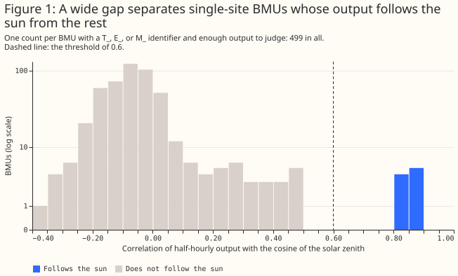
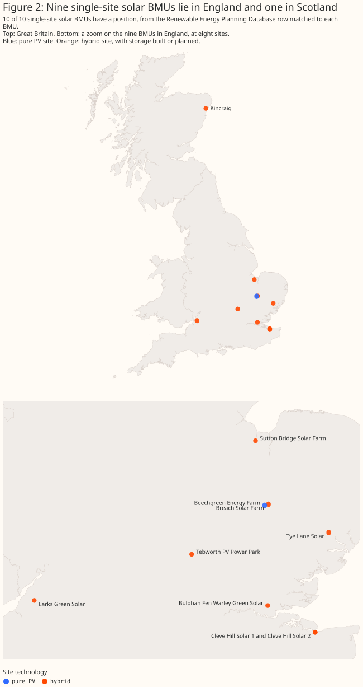
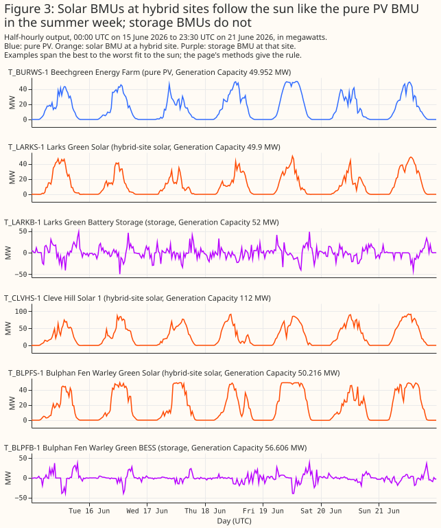
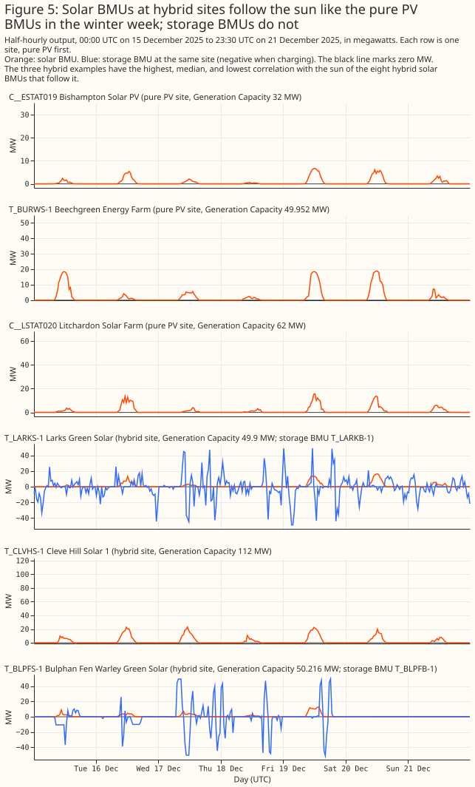

# At least 10 Balancing Mechanism Units in Great Britain are single solar sites, and 9 of them share a site with storage

**This study asks how many Balancing Mechanism Units (BMUs) in Great Britain are solar, and what
capacity each published figure gives them.** A BMU is the unit of trade in the Balancing Mechanism,
which the National Energy System Operator (NESO) uses to balance supply and demand. No field in the
BMU register says which BMUs are solar: none of the 3,115 registered BMUs has a fuel type of solar,
and 2,525 have no fuel type at all. The study therefore downloads the settled half-hourly output of
the 1,705 BMUs that are not interconnectors, over 12 months, and asks whether each BMU's output
follows the sun.

**Ten single-site BMUs are solar: nine follow the sun, and a tenth is registered as solar but has no
output yet.** All ten have a `T_` or `E_` identifier, which the study treats as one generating site.
Nine of the ten sit at a site that also holds storage, and one sits at a pure PV site. The study
reports totals for all ten, for the nine hybrid sites, and for the one pure PV site. A further 28
BMUs with supplier, virtual, or other identifiers also follow the sun or are registered as solar,
but 86% of their Generation Capacity is five gas-and-power supplier BMUs that import and export
heavily, so the study reports them apart. Seven of the 12 built PV projects in NESO's Transmission
Entry Capacity register have a BMU in the census, and the census cannot yet say how many embedded
solar BMUs it missed.



- **To find solar BMUs, read their output and not the register.** The fuel-type field never says
  solar, and a name search misses units whose name does not say so.
- **To compare capacities, keep the five published figures apart.** The ten BMUs' Generation
  Capacity sums to 682.9 MW, and the largest Maximum Export Limit that each BMU published in the 30
  days before the study sums to 667.0 MW. Two registers give a figure for a whole project, which can
  include storage.
- **A solar BMU at a hybrid site is metered apart from its storage in nine of ten cases.** One BMU,
  Tebworth PV Power Park, shows battery-like import on a few nights in January 2026 even though its
  site has a storage BMU.

> **How this page was made.** The research question came from a human. Everything else — the code
> behind every result, the analysis, the figures, and the text — was written by Claude, Anthropic's
> AI model (for this page, Claude Sonnet 5.5). Several independent Claude reviewers have checked the
> method, the evidence, and the prose adversarially.

## Key findings

- **A wide gap separates the single-site BMUs that follow the sun from the rest**, so the threshold
  is not a close call ([Figure 1](#the-census)).
- **The ten single-site solar BMUs have 682.9 MW of Generation Capacity in all**, 50.0 MW of it at
  the pure PV site and 633.0 MW at the nine hybrid sites ([Capacity](#capacity)).
- **Nine of the ten lie south of 53°N in England, and one lies in Scotland** ([Figure
  2](#where-the-bmus-are)).
- **A solar BMU at a hybrid site looks like a pure PV BMU, and its storage is a separate BMU that
  charges at midday and discharges in the early evening** ([Figures 3 and
  4](#what-a-solar-bmu-looks-like)).
- **The census has a BMU for 7 of the 12 built PV projects in the Transmission Entry Capacity
  register**, and at most 1 of the other 5 can be a solar BMU the census missed
  ([Recall](#how-many-solar-bmus-were-missed)).
- **28 aggregate BMUs also follow the sun or are registered as solar**, and their Generation
  Capacity is mostly not solar capacity ([Aggregates](#aggregate-bmus)).

## Introduction

**Several datasets publish a capacity for a BMU, and the figures mean different things.** The
figures answer different questions: what the unit's lead party declared it could generate, what NESO
lists as installed, what the site may export to the grid, what level of export the lead party
submitted to the system operator, and what the planning database holds for the project. Anyone who
wants "the capacity" of the solar BMUs first has to know which BMUs are solar, and the register does
not say.

**The study compares no weather products and fits no forecasting model.** Every other study in this
section works from weather data and NGED's own generators. This study uses only public data and
covers all of Great Britain, so a number here describes the BM-registered solar fleet and says
nothing about NGED's trial area.

## Data and methods

**Planned and exploratory.** The study plan, written before any result, named one question: how many
solar BMUs exist, and with what recall. The study runs no significance test and fits no forecasting
model, so no contrast is planned or exploratory, and every number is a count or a sum.

**Sources.** All six sources are public and were fetched live on 7 October 2026:

- the Elexon BMU register (`reference/bmunits/all`), which gives each BMU's identifier, name, lead
  party, and declared Generation Capacity;
- Elexon dataset B1610, the settled output of each BMU in each half-hour, in megawatt-hours, for 1
  September 2025 to 31 August 2026 (the 12 complete months that end at least two weeks before the
  run, because B1610 lags by about a week);
- Elexon report B1420 (dataset IGCPU), the installed capacity that NESO lists for a unit, with a
  resource type that is "Solar" for 9 BMUs;
- Elexon dataset MELS, the Maximum Export Limit that each BMU's lead party submitted, for the 30
  days from 7 September to 7 October 2026, which falls after the output window;
- NESO's Transmission Entry Capacity (TEC) register, the export capacity agreed for each project at
  the grid connection; and
- the Renewable Energy Planning Database (REPD) of the Department for Energy Security and Net Zero,
  the installed (DC) capacity of each project, with an Ordnance Survey grid position.

**Classifying a BMU.** The classifier takes each BMU's output and drops two kinds of half-hour. It
drops the 30 days after a BMU's first output, unless the BMU was already running in the first week
of the window, because a site often commissions in stages. It also drops half-hours of exactly zero
output while the sun is clearly up (the cosine of the solar zenith angle above 0.1), which is almost
certainly a metering fault in a solar unit. Output of 0.01 megawatt-hours or less in a half-hour
counts as meter noise, not generation. The classifier then computes the Pearson correlation between
the output and the cosine of the solar zenith angle, clipped at zero below the horizon, at one point
in central Great Britain (53°N, 1.5°W). A BMU has no coordinates, and the solar noon at the census
sites, which span longitude 2.5°W to 1.1°E, differs by about 14 minutes, which is small beside half
an hour. A BMU with a correlation above 0.6 and at least 100 positive half-hours follows the sun;
one with fewer than 100 positive half-hours, or a constant output, has no output to judge. The
census holds every BMU that follows the sun or has IGCPU resource type "Solar".

**Single-site and aggregate BMUs.** Elexon's naming convention gives a directly connected or
embedded BMU a `T_`, `E_`, or `M_` identifier, and the study treats such a BMU as one site. A `2_`
(supplier), `V_`, or `C_` identifier does not name a single site by that convention, and the study
did not check each, so it counts those BMUs apart.

**Hybrid and pure PV.** A site is hybrid if it also holds storage, and the study grades the evidence
from strongest to weakest. A separately registered storage BMU with output in the window is the
strongest, then an operational battery that REPD links to the site's solar row, then storage that is
planned or under construction (listed in the TEC plant type or in a REPD battery row that is not yet
operational). A site with none of these is pure PV when the TEC plant type lists PV only. TEC and
REPD carry no BMU identifier, so the study matches site names with a similarity score of at least
0.85. For 8 of the 10 BMUs the study set the match by hand from capacity, customer name, lead party,
and connection site, because the Elexon name does not resemble the project's name; two hand-made
tables are committed beside the scripts. The TEC register holds one row for each stage of a project,
so the study takes each project's most advanced row, and uses its connected capacity if built and
its agreed capacity if still under construction.

**Recall.** The study checks the census against the 12 built and 6 under-construction TEC projects
that list PV, because a project that holds TEC and lists PV should have a BMU. Each project is
matched by hand to its BMUs, and the check records whether any matched BMU is in the census.

**Examples.** Output is shown in megawatts on calendar dates. Each kind's examples are chosen by a
rule fixed before the plots were drawn: every pure PV BMU, and for solar BMUs at hybrid sites the
first, middle, and last by correlation. A storage BMU is added where a hybrid example's site has one
with output in both weeks. The weeks are those containing the solstices: 15 to 21 June 2026 and 15
to 21 December 2025.

**Public data, so BMUs are named.** Every source is public, so the page names each BMU and shows its
output. The study uses no data from NGED's own generators.

## Results

### The census

**Of 1,705 BMUs with a B1610 file, 689 have a single-site identifier and 1,016 do not.** 270 files
hold no rows. Nine single-site BMUs follow the sun, with correlations from 0.83 to 0.88. The next
highest single-site BMU, classed as not solar, scores 0.49 ([Figure 1](#the-census)). Keeping the
daytime zeros leaves the same nine BMUs, with a lowest correlation of 0.82 and a highest among the
rest of 0.38. Of the nine, 7 are also typed Solar in IGCPU, and 2 are found only by their output. A
tenth single-site BMU, Kincraig, is typed Solar and has no output in the window, so it is in the
census by type alone; its TEC project is under construction with no capacity connected. The
commissioning rule left out 3,459 of 155,666 half-hours of the nine BMUs, and the daytime-zero rule
removed 2,112.

### Capacity

**Each register names the same ten BMUs differently.** A dash means the register has no match, and
"(identifier only)" means the BMU register gives the BMU its own identifier as its name. TEC and
REPD name a project, so
Cleve Hill's two BMUs share one project name in each.

| BMU | Elexon BMU register | IGCPU | TEC register | REPD |
|---|---|---|---|---|
| `E_KINCS-1` | Kincraig | KINCS-1 | Kincraig Energy Centre | Kincraig - Solar Farm and battery storage system |
| `T_BLPFS-1` | Bulphan Fen Warley Green Solar | BLPFS-1 | Warley (tertiary) | Bulphan Fen Solar Farm & Battery Storage |
| `T_BRCHS-1` | (identifier only) | – | Breach Solar Farm | Breach Farm - Solar farm |
| `T_BURWS-1` | Beechgreen Energy Farm | BURWS-1 | Beechgreen Energyfarm | Burwell Solar Farm |
| `T_CLVHS-1` | Cleve Hill Solar 1 | CLVHS-1 | Cleve Hill Solar Park | Cleve Hill Solar Project |
| `T_CLVHS-2` | Cleve Hill Solar 2 | CLVHS-2 | Cleve Hill Solar Park | Cleve Hill Solar Project |
| `T_LARKS-1` | Larks Green Solar | LARKS-1 | Iron Acton | Larks Green Solar Farm |
| `T_SUTBS-1` | Sutton Bridge Solar Farm | SUTBS-1 | Walpole | Sutton Bridge Solar Farm |
| `T_TEBWS-1` | Tebworth PV Power Park | – | – | Tebworth - Solar Farm |
| `T_TYLNS-1` | Tye Lane Solar | TYLNS-1 | Bramford (Tertiary) | Tye Lane - Solar Farm |

**The ten single-site solar BMUs, with the five published capacity figures for each.** A dash means
no figure was found. Cleve Hill's two BMUs share one TEC project and one REPD row, so both rows show
the whole site's figure. REPD gives a project's installed (DC) capacity, so it can exceed the export
figures: Breach's REPD figure is 67 MW against 49.9 MW in TEC.

| BMU | Name | Site | Generation Capacity (MW) | IGCPU installed (MW) | TEC (MW) | Largest MEL, 30 days (MW) | REPD installed (MW) |
|---|---|---|---|---|---|---|---|
| `E_KINCS-1` | Kincraig | Hybrid (planned), embedded | 20.6 | 20.0 | 20.62 | 0.0 | 21.0 |
| `T_BLPFS-1` | Bulphan Fen Warley Green Solar | Hybrid | 50.216 | 57.0 | 57.0 | 50.0 | 49.9 |
| `T_BRCHS-1` | Breach Solar Farm | Hybrid | 50.0 | – | 49.9 | 67.0 | 67.0 |
| `T_BURWS-1` | Beechgreen Energy Farm | Pure PV | 49.952 | 49.0 | 50.0 | 50.0 | 49.9 |
| `T_CLVHS-1` | Cleve Hill Solar 1 | Hybrid | 112.0 | 112.0 | 350.0 | 112.0 | 373.0 |
| `T_CLVHS-2` | Cleve Hill Solar 2 | Hybrid | 205.0 | 205.0 | 350.0 | 205.0 | 373.0 |
| `T_LARKS-1` | Larks Green Solar | Hybrid | 49.9 | 50.0 | 99.4 | 50.0 | 70.0 |
| `T_SUTBS-1` | Sutton Bridge Solar Farm | Hybrid (planned) | 49.419 | 49.0 | 49.9 | 43.0 | 49.9 |
| `T_TEBWS-1` | Tebworth PV Power Park | Hybrid | 45.928 | – | – | 40.0 | – |
| `T_TYLNS-1` | Tye Lane Solar | Hybrid | 49.9 | 49.0 | 57.0 | 50.0 | 49.9 |

**The table sums each column over the single-site census BMUs that have a value, and the number of
BMUs with a value is in brackets.** A project that two BMUs share is counted once in the TEC and
REPD columns. The TEC figure for a hybrid project includes its storage, so a TEC sum is not
comparable with a sum of Generation Capacity.

| Group (BMUs) | Generation Capacity (MW) | IGCPU installed (MW) | TEC (MW) | Largest MEL, 30 days (MW) | REPD installed (MW) |
|---|---|---|---|---|---|
| All solar BMUs, hybrids included (10) | 682.9 (10) | 591.0 (8) | 733.8 (9) | 667.0 (10) | 730.6 (9) |
| Hybrid sites only (9) | 633.0 (9) | 542.0 (7) | 683.8 (8) | 617.0 (9) | 680.7 (8) |
| Pure PV site only (1) | 50.0 (1) | 49.0 (1) | 50.0 (1) | 50.0 (1) | 49.9 (1) |

**Of the nine hybrid sites, four have a storage BMU with output, three have an operational battery
in REPD, and two have storage planned or under construction.** The operational batteries are 150 MW
at Cleve Hill (linked to both BMUs) and 0.66 MW at Breach. Two IGCPU figures are missing for BMUs
that IGCPU does not list, one TEC figure is missing for the BMU with no matched TEC project, and one
REPD figure is missing because the matched row lists no capacity.

**Generation Capacity and the largest Maximum Export Limit agree within 0.5 MW for 6 of the 10 BMUs,
and differ by up to 20.6 MW for the rest.** The sums differ by only 2.3%, but that is because errors
offset: the absolute gaps add up to 7.4% of the Generation Capacity sum. Kincraig alone accounts for
20.6 MW, because its Maximum Export Limit is zero. The Maximum Export Limit is a level that each
lead party submits, not a capacity.

### Where the BMUs are



**Nine of the ten lie south of 53°N in England, seven of the nine east of the Greenwich meridian,
and one lies north of 55.5°N in Scotland.** All ten have a position, taken from the REPD row matched
to each BMU.

### What a solar BMU looks like





**A solar BMU at a hybrid site follows the sun like the pure PV BMU, and the storage is metered as
its own BMU.** In the summer week (15 to 21 June 2026) the pure PV BMU and the three solar BMUs at
hybrid sites rise at dawn, peak near midday, and fall to zero at dusk. The four storage BMUs at
census sites average between −4.0 and −6.0 MW at 13:00 UTC and between 9.0 and 11.8 MW at 18:00 UTC
over the year, so they charge at midday and discharge in the early evening. The figures show two of
them, at Larks Green and Bulphan Fen; Cleve Hill has no storage BMU identified.

**One BMU shows battery-like behaviour of its own.** Across the ten census BMUs, output falls below
minus 5% of Generation Capacity in 23 half-hours. Twenty-two of them belong to Tebworth PV Power
Park, which imported up to 35.3 MW (77% of its Generation Capacity) and exported in 4 half-hours
when the sun was well below the horizon, even though its site has a storage BMU. The other half-hour
is Cleve Hill Solar 1, at −22.4 MW. No other census BMU imports more than 5% of its capacity.

### How many solar BMUs were missed

**The census has a BMU for 7 of the 12 built PV projects in the TEC register.** Of the 10 built
hybrid projects, 6 have a census BMU, 3 map only to BMUs outside the census (a storage unit, a
combined-heat-and-power unit, and a wind-farm unit), and 1 has no BMU identified. Of the 2
built pure PV projects, 1 has a census BMU and 1 maps to a storage BMU. Of the 6 under-construction
projects, 1 has a census BMU and 5 have none. Nine of the ten census BMUs match a TEC project;
Tebworth does not. **At most 1 of the 12 built projects can be a solar BMU that the census missed**,
the one with no BMU identified, and the 4 projects that map to non-solar BMUs may have their PV
array metered inside that unit. A project with no BMU identified either has no solar BMU, was missed
by the classifier, or was missed by the hand mapping.

### Aggregate BMUs

**28 BMUs with other identifiers follow the sun or are typed Solar, and their Generation Capacity is
mostly not solar capacity.** Their correlations run from 0.62 to 0.90 with no gap to set a threshold
in, and 27 follow the sun by behaviour (24 if the daytime zeros are kept). Their Generation Capacity
sums to 1,896.8 MW, of which the five BMUs of one gas-and-power supplier hold 1,622.3 MW; the 14
BMUs of a second supplier hold 41.7 MW. The supplier BMUs declare a large Generation Capacity and
net imports against exports, so the sum is not a solar capacity. One `2_` BMU is typed Solar in
IGCPU and has no output.

**All 28 aggregate BMUs, with the capacity figures that exist for them.** None matches a TEC project
or an REPD row. The largest Maximum Export Limits sum to 68.0 MW, against a Generation Capacity of
1,896.8 MW, because most supplier BMUs publish a limit of zero. A dash means no figure.

| BMU | Name in the BMU register | Lead party | Generation Capacity (MW) | IGCPU installed (MW) | Largest MEL, 30 days (MW) | Correlation with the sun |
|---|---|---|---|---|---|---|
| `2__ABGAS000` | (identifier only) | British Gas Trading Ltd | 5.428 | – | 0 | 0.87 |
| `2__ALOND001` | EDFE Aggregate Eastern 01 | EDF Energy Customers Limited | 0 | 16 | 0 | – |
| `2__ATGPL000` | (identifier only) | TotalEnergies Gas & Power Ltd | 240.735 | – | 0 | 0.81 |
| `2__BBGAS000` | (identifier only) | British Gas Trading Ltd | 4.84 | – | 0 | 0.88 |
| `2__BECOT003` | ECOT_VPP_11 | ECOTRICITY LIMITED | 16 | – | – | 0.63 |
| `2__BEDGE001` | (identifier only) | Edgware Energy Limited | 54.785 | – | 0 | 0.67 |
| `2__BTGPL000` | (identifier only) | TotalEnergies Gas & Power Ltd | 163.502 | – | 0 | 0.75 |
| `2__CBGAS000` | (identifier only) | British Gas Trading Ltd | 0.438 | – | 0 | 0.89 |
| `2__DBGAS000` | (identifier only) | British Gas Trading Ltd | 3.568 | – | 0 | 0.88 |
| `2__DRWED000` | (identifier only) | ENGIE Power Limited | 60 | – | 68 | 0.62 |
| `2__EBGAS000` | (identifier only) | British Gas Trading Ltd | 3.157 | – | 0 | 0.86 |
| `2__FBGAS000` | (identifier only) | British Gas Trading Ltd | 2.227 | – | 0 | 0.88 |
| `2__GBGAS000` | (identifier only) | British Gas Trading Ltd | 2.016 | – | 0 | 0.81 |
| `2__HBGAS000` | (identifier only) | British Gas Trading Ltd | 4.951 | – | 0 | 0.88 |
| `2__HTGPL000` | (identifier only) | TotalEnergies Gas & Power Ltd | 912.53 | – | 0 | 0.79 |
| `2__JAXPO000` | (identifier only) | AXPO UK LIMITED | 8 | – | – | 0.84 |
| `2__JBGAS000` | (identifier only) | British Gas Trading Ltd | 3.311 | – | 0 | 0.88 |
| `2__KBGAS000` | (identifier only) | British Gas Trading Ltd | 1.973 | – | 0 | 0.89 |
| `2__KTGPL000` | (identifier only) | TotalEnergies Gas & Power Ltd | 100 | – | 0 | 0.77 |
| `2__LBGAS000` | (identifier only) | British Gas Trading Ltd | 3.804 | – | 0 | 0.89 |
| `2__LTGPL000` | (identifier only) | TotalEnergies Gas & Power Ltd | 205.511 | – | 0 | 0.84 |
| `2__MBGAS000` | (identifier only) | British Gas Trading Ltd | 3.093 | – | 0 | 0.87 |
| `2__NBGAS000` | (identifier only) | British Gas Trading Ltd | 1.663 | – | 0 | 0.83 |
| `2__PBGAS000` | (identifier only) | British Gas Trading Ltd | 1.245 | – | 0 | 0.89 |
| `C__ESTAT019` | C__ESTAT019-AR4-BSP-700 | Statkraft Markets Gmbh | 32 | – | – | 0.87 |
| `C__LSTAT020` | C__LSTAT020-AR4-LSF-700 | Statkraft Markets Gmbh | 62 | – | – | 0.71 |
| `V__HFLEX002` | (identifier only) | Flexitricity Limited | 0 | – | 0 | 0.90 |
| `V__NFLEX003` | (identifier only) | Flexitricity Limited | 0 | – | 0 | 0.62 |

## Discussion: what to use

- **For a list of GB solar BMUs, use the ten single-site BMUs as a floor, not a total.** Add the
  aggregates only if the use accepts pooled sites.
- **For the capacity of a solar BMU, use Generation Capacity.** The largest Maximum Export Limit
  agrees for 6 of 10 BMUs and is a submitted level. The TEC and REPD figures describe whole
  projects.
- **To compare a solar BMU with a solar forecast, use the solar BMU on its own.** Its storage is a
  separate series, with the exception of Tebworth.

## Limitations

- **The window is 12 months, and the classifier uses one reference point.** A BMU that started in
  the last month of the window has too little output to judge, and is in the census only if IGCPU
  types it Solar.
- **Embedded recall is unmeasured.** Only one embedded BMU is in the census, and no list of embedded
  solar BMUs exists to check against.
- **The matches to TEC and REPD rest on names and judgement.** 8 BMUs and 19 TEC projects were
  matched by hand, using lead party, customer, capacity, and connection site. A wrong match would
  change a technology label, a position, or a capacity sum. Both tables are committed in
  `studies/solar_bmu_census/`. A TEC project with PV and storage could hold a PV array that no BMU
  meters on its own.
- **The hybrid label rests on graded evidence.** Only four sites have a storage BMU with output.
  Breach's operational battery is 0.66 MW, and two sites have storage that is not yet built.
- **Zero output at midday is read as a metering fault.** It could instead be curtailment. Removing
  the zeros changes the single-site classes not at all and the aggregate count by 3 (27 against 24).
- **REPD lists some generating sites as under construction**, so the study accepts operational and
  under-construction rows.
- **The Maximum Export Limit comes from a window after the output window.**

## Scope

**The study does not cover solar generation that is not a BMU.** Most GB solar capacity is small
embedded generation with no BMU. The study also does not cover wind or other fuels, a forecast of
any BMU's output, or years other than September 2025 to August 2026.

## Data and code availability

**All inputs are public.** The BMU register, B1610, IGCPU, and MELS come from the [Elexon Insights
API](https://bmrs.elexon.co.uk/api-documentation), the TEC register from [NESO's data
portal](https://www.neso.energy/data-portal/transmission-entry-capacity-tec-register), and REPD from
[the Department for Energy Security and Net
Zero](https://www.gov.uk/government/publications/renewable-energy-planning-database-monthly-extract).
The two hand-made match tables are committed beside the scripts. The code is in
[`studies/solar_bmu_census/`](https://github.com/openclimatefix/nged-substation-forecast/tree/main/studies/solar_bmu_census),
and its classifier tests are in `packages/studies/tests/solar_bmu_census/`.

## Reproducing the figures

```bash
uv run python studies/solar_bmu_census/fetch_sources.py
uv run python studies/solar_bmu_census/classify.py
uv run python studies/solar_bmu_census/collate.py
uv run python studies/solar_bmu_census/report.py
uv run python studies/solar_bmu_census/census_charts.py
```

`report.py` writes `report.md`, which holds every number on this page, to
`data/studies/per_study/solar_bmu_census/`.
