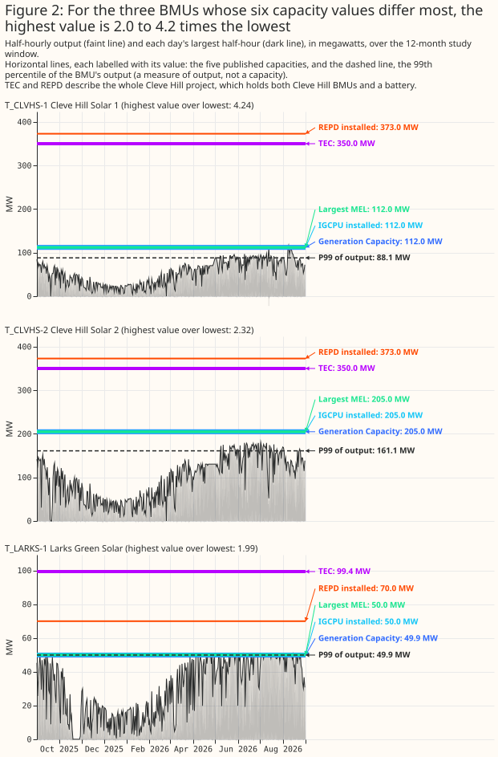

# At least 10 Balancing Mechanism Units at 9 solar sites in Great Britain, and 8 of those sites have storage built or planned

**This study counts the solar Balancing Mechanism Units (BMUs) in Great Britain, and compares the
capacity that each published source gives them.** A BMU is a unit of generation or demand that a
company (its lead party) registers with Elexon. Elexon settles the Balancing Mechanism: Elexon
calculates the metered volumes that the National Energy System Operator (NESO) pays for when NESO
uses the Balancing Mechanism to balance supply and demand. Elexon's BMU register does not say which
BMUs are solar, because none of its 3,115 rows has a fuel type of solar. The study therefore
downloads 12 months of Elexon's settled half-hourly output (report B1610) for each of 1,705 BMUs,
and asks whether each BMU's output follows the sun. The census is the list of BMUs whose output
follows the sun, plus the BMUs that Elexon's Installed Generation Capacity per Unit report (IGCPU)
types as Solar. It holds 38 BMUs: 10 single-site BMUs, which Elexon's naming convention ties to one
generating site, and 28 aggregate BMUs, which can pool many sites. Nine of the 10 single-site BMUs
follow the sun, and the tenth is typed Solar in IGCPU but has no output yet. The 10 BMUs sit at 9
sites. Eight of those sites are hybrid, meaning that the site also holds a battery (storage), built
or planned, and the ninth is pure photovoltaic (PV), with no storage found.

**Five published sources each give a capacity for a BMU, and each source measures a different
quantity. The study adds a sixth value, the P99 of the BMU's output, which is the level the BMU's
half-hourly output exceeds in 1% of half-hours.** The sources are the BMU register's Generation
Capacity, IGCPU, the Maximum Export Limit (MEL) that a lead party submits, the Transmission Entry
Capacity (TEC) register, and the Renewable Energy Planning Database (REPD).
[Introduction](#introduction) says what each capacity value measures. Across the census, the largest
of one BMU's six values is up to 4.2 times its smallest. The factor of 4.2 is at Cleve Hill Solar 1,
one of two BMUs at the Cleve Hill site, because TEC and REPD give one value for a whole project. The
REPD value for Cleve Hill, 373.0 MW, exceeds even the two Cleve Hill BMUs' Generation Capacity added
together, 317.0 MW, probably because REPD gives the solar array's direct-current (DC) rating. Cleve
Hill Solar 2 has the next-largest factor, 2.3, for the same reason as Cleve Hill Solar 1, and Larks
Green Solar follows at 2.0, because its TEC value covers the solar BMU and the site's battery.

- **To list solar BMUs, read each BMU's output and not the register, and treat the 10 single-site
  BMUs as a floor.** Add the 28 aggregate BMUs only where an application can accept BMUs that pool
  several sites ([Discussion](#discussion-what-to-use)).
- **To state the capacity of one solar BMU, use its Generation Capacity**, and keep the five
  published capacities and the P99 apart ([Capacity](#capacity)).
- **To compare a solar BMU's output with a solar forecast, use the solar BMU without its site's
  storage BMU, and drop 26 and 29 January 2026 at Tebworth PV Power Park and 13 July 2026 at Cleve
  Hill**, when the solar BMU's meter carried flows that were not solar
  ([Discussion](#discussion-what-to-use)).

## Key findings

- **A wide gap in correlation of output with the sun's height, from 0.49 to 0.83, separates the nine
  single-site BMUs that follow the sun from the other single-site BMUs**, so the census does not
  depend on where the threshold sits in that gap ([The census](#the-census)).
- **The 10 single-site solar BMUs have 682.9 MW of Generation Capacity in all**: 50.0 MW at the pure
  PV site and 633.0 MW at the 9 BMUs at hybrid sites. The parts do not add exactly to the total
  because each is rounded to one decimal place on its own ([Capacity](#capacity)).
- **One BMU's five published capacity values and the P99 of its output can differ by a factor of
  4.2**, at Cleve Hill Solar 1, where the TEC and REPD values describe the whole two-BMU site
  ([Capacity](#capacity)).
- **Nine of the 10 single-site solar BMUs lie south of 53°N in England, and the tenth lies in
  Scotland** ([Where the BMUs are](#where-the-bmus-are)).
- **By the BMU register, none of the 10 single-site BMUs is in a licence area of National Grid
  Electricity Distribution (NGED), and only one is embedded in a distribution network**: Kincraig,
  in North Scotland. The register gives no grid supply point group to the nine transmission-connected
  BMUs. By the coordinates of their REPD rows, two of the nine, Larks Green and probably Sutton
  Bridge, lie inside NGED's licence areas, although both connect to the transmission network and not
  to NGED's ([Distribution network operator areas](#distribution-network-operator-areas)).
- **At the four sites with a storage BMU, the solar BMU and the storage BMU look like two separate
  meters, with the exception of Tebworth on two days in January 2026**: a solar BMU follows the sun
  like the pure PV BMU, and a storage BMU charges at midday and discharges in the early evening
  ([What a solar BMU looks like](#what-a-solar-bmu-looks-like)).
- **All 12 built PV projects in the TEC register map to a BMU, and 7 of the 12 map to a BMU in the
  census**, so the census missed no separately registered solar BMU at a built project that the
  study's by-hand matching of TEC projects to BMUs could find
  ([Recall](#how-many-solar-bmus-were-missed)).
- **Of the 28 aggregate BMUs, five belonging to one supplier hold 86% of the Generation Capacity**,
  and each of the five has output below zero in 77% to 95% of its half-hours
  ([Aggregates](#aggregate-bmus)).

## Introduction

**Several datasets publish a capacity for a BMU, and each capacity value measures a different
quantity.** The study reads six public sources. The table says who publishes each source, what it
lists, and which capacity value the study takes from it.

| Source | Published by | What it lists | Capacity value the study takes |
|---|---|---|---|
| BMU register | Elexon | Every registered BMU, with its identifier, name, lead party, and fuel type | Generation Capacity, which the lead party declares |
| B1610 | Elexon | Each BMU's settled output (the metered volume that Elexon calculates) in each half-hour | None. The study uses the output itself |
| IGCPU (report B1420) | Elexon, for NESO | Installed capacity of each generating unit, with a resource type such as "Solar" | Installed capacity, as NESO lists it |
| MELS (Elexon's dataset of Maximum Export Limits) | Elexon | The Maximum Export Limit (MEL), the highest export level that each lead party submits for each BMU, which is a submitted level and not a capacity | The largest MEL in the 30 days before the run |
| TEC register | NESO | Each project's export capacity agreed at the grid connection, with one row for each stage of the project (for example under construction, or connected), and its plant types | Connected capacity if built, agreed capacity if not |
| REPD | Department for Energy Security and Net Zero | Each renewable project planned or built, with its technology, status, and grid position | Installed capacity of each project row; co-located storage has its own row, and a solar row's value may be a DC panel rating |

Choosing among the capacity values needs a list of the solar BMUs first, and a single lookup cannot
give that list.

### Why a single lookup is not enough

**A single lookup of the BMU register looks like enough, and it fails in four ways.** The lookup
would filter the BMU register for solar BMUs and add up their capacity. Each of the four problems
below breaks that plan, and together they are why the study reads several registers and then the
output itself.

**No register says which BMUs are solar.** The BMU register has a fuel-type field, but no row holds
a solar value: of the 3,115 rows, 2,525 have no fuel type, 103 say `OTHER`, and the rest name wind,
gas, hydro, nuclear, and similar fuels. IGCPU gives a resource type, but types only 9 BMUs as Solar
and 79 as "Generation", which names no technology. Two of those 9 BMUs have no output in the window,
so the typed list is also not a list of BMUs that generate.

**A name search misses BMUs, and most aggregate BMUs have no name to search.** Three of the 10
single-site census BMUs have a register name that says neither solar nor PV: Beechgreen Energy Farm,
Kincraig, and Breach, whose register name is its own identifier. Of the 28 aggregate BMUs, 24 have
only their identifier as a name, so a name search cannot find those 24 BMUs.

**The project registers do not name the BMU.** The TEC register and REPD each list projects and
carry no BMU identifier, so each BMU has to be matched to its project by name similarity or by hand
([Data and methods](#data-and-methods)).

**Capacity is five different numbers, and adding a column overcounts.** TEC and REPD describe a
project, and one project can hold two BMUs: adding the TEC column over the 10 single-site BMUs gives
1,083.8 MW, against 733.8 MW when each project is counted once. A hybrid project's TEC value can
also include its storage. Where solar and storage share one grid connection, TEC can be less than
the two added together: at Bulphan Fen and Tye Lane, TEC is 57.0 MW, against Generation Capacity
sums of 106.8 MW and 109.1 MW for the solar BMU plus the storage BMU. For the 28 aggregate BMUs,
adding Generation Capacity gives 1,896.8 MW, of which most is not solar capacity
([Aggregates](#aggregate-bmus)).

**Output identifies the technology where no register does, and it needs care.** A solar BMU's output
is zero at night and follows the sun's height by day, and the output of wind, gas, hydro, and
nuclear BMUs does not. The study therefore correlates each BMU's half-hourly output with the cosine
of the solar zenith angle (the sun's angle from the vertical) over a year, which is near 1 when the
sun is high and 0 at night. The study calls this number a BMU's correlation with the sun. The
correlation ranks every BMU on one scale and leaves a wide gap between the BMUs that follow the sun
and the rest ([The census](#the-census)). A rule such as "zero at night" would fail in both
directions: the rule admits any BMU that is idle at night, and rejects a solar BMU with a metering
fault or a battery that charges overnight.

## Data and methods

**The study runs no significance test and has no planned contrasts.** The study plan, written before
any result, asked how many solar BMUs exist and what share of the solar BMUs the census finds (its
recall). Every number is a count, a sum, or a correlation, so the page labels no number planned or
exploratory.

**Which BMUs the study downloads.** Of the BMU register's 3,115 rows, 1,323 belong to
interconnectors between Great Britain and another country, 86 of the other rows have no BMU
identifier, and 1 other row repeats an identifier. That leaves 1,705 BMUs whose output the study
downloads.

**Windows and dates.** The B1610 window is 1 September 2025 to 31 August 2026: the 12 complete
months that end at least 2 weeks before the fetch, because Elexon publishes B1610 about a week in
arrears. The MELS window is the 30 days from 7 September to 7 October 2026, which falls after the
output window. The TEC register is the release dated 5 October 2026, and REPD is the Q2 2026
release. All six sources were fetched live on 7 October 2026.

**Classifying a BMU.** The classifier takes each BMU's output and drops two kinds of half-hour. The
classifier drops the 30 days after a BMU's first output, unless the BMU was already running in the
first week of the window, because a site often commissions in stages. The classifier also drops
half-hours of exactly zero output while the sun is clearly up (the cosine of the solar zenith angle
above 0.1). Zero output in daylight from a solar BMU is an outage, curtailment, or a metering fault,
not weather. When the classifier finds a BMU's first output and counts its half-hours of output, a
half-hour of 0.01 megawatt-hours or less counts as meter noise, not generation. Only a reading of
exactly zero is dropped as a daytime zero. For the 9 BMUs that follow the sun, whose files hold
155,666 half-hours in all, the commissioning rule left out 3,459 half-hours and the daytime-zero
rule removed 2,112.

**The classifier scores each BMU by how closely its output follows the sun at one point in central
Great Britain.** The classifier computes the Pearson correlation between the output and the cosine
of the solar zenith angle, clipped at zero below the horizon, at the point 53°N, 1.5°W. The BMU
register gives no coordinates for a BMU, so the classifier uses one point. The positions of the nine
sun-following BMUs span longitude 2.5°W to 1.1°E, so their solar noon differs by about 14 minutes,
which is small beside the half-hour resolution of the output.

**A BMU follows the sun if its correlation is above 0.6 and it has at least 100 half-hours of output
above 0.01 megawatt-hours.** A BMU with fewer than 100 such half-hours, or with constant output, has
too little output to judge.

**Single-site and aggregate BMUs.** A BMU is single-site when its identifier starts with `T_`
(connected to the transmission network), `E_` (embedded in a distribution network), or `M_`, a
prefix that the study does not interpret. The BMU register's own `bmUnitType` field agrees with the
`T_` and `E_` prefixes: it holds `T` for every `T_` BMU and `E` for every `E_` BMU, and no `M_` BMU
is in the census. A single-site BMU's output and capacity belong to one place, so the study can
match the BMU to one project and one position. The other identifiers begin `2__` (a supplier BMU,
which belongs to an electricity supplier), `V__` (a virtual BMU), or `C__`, and these BMUs can pool
many sites. The study did not check each of them for a single site, so the page counts them apart as
aggregate.

**Hybrid and pure PV.** A site is hybrid if it also holds storage. The study grades the evidence of
storage from strongest to weakest. The strongest evidence is a separately registered storage BMU
with output in the window. Next is an operational battery that REPD links to the site's solar row.
Weakest is storage that is planned or under construction, listed in the TEC plant type or in a REPD
battery row that is not yet operational. A site with none of the three kinds of storage evidence is
pure PV when its TEC plant type lists PV only, or when REPD has a solar row and no battery row.

**Matching a BMU to TEC and REPD.** TEC and REPD carry no BMU identifier, so the study matches each
BMU's name in the BMU register to a TEC or REPD project name, accepting a match with a
string-similarity score of at least 0.85. For 8 of the 10 single-site BMUs, the Elexon name does not
resemble the project's name, so the study set the match by hand (the hand mapping) from the
capacity, the customer's name (the company that holds the TEC agreement), the lead party, and the
connection site. The TEC register holds one row for each stage of a project, so the study takes each
project's most advanced row. From that row, the study uses the connected capacity if the project is
built and the agreed capacity if the project is still under construction. Three matched projects
hold a later stage that the register does not list as built: Cleve Hill adds 200.0 MW with an
effective date of 2 June 2036, the Iron Acton project (Larks Green) adds 20.6 MW with status
Consents Approved, and the Walpole project (Sutton Bridge) adds 7.1 MW with status Scoping. None of
the three later stages is in the TEC column.

**Placing a BMU in a licence area.** The study uses two methods. The first reads the grid supply
point (GSP) group that the BMU register gives the BMU and maps the group's identifier to a
distribution network operator (DNO) with NESO's map of the 14 DNO licence areas
([Distribution network operator areas](#distribution-network-operator-areas)). The second finds the
licence area in that map that contains the position of the BMU's matched REPD row, by testing the
position against each area's boundary, and records how far the position sits from the nearest other
area. NESO calls its boundaries approximate, so a position within a few kilometres of a boundary is
placed with less confidence.

**Recall.** The study checks the census against the 12 built and 6 under-construction TEC projects
that list PV, because a project that holds TEC and lists PV should have a BMU. Each project is
matched by hand to its BMUs, and the check records whether any matched BMU is in the census.

**The P99 of output.** The P99 is a measure of what the BMU delivered, and not a registered
capacity. The P99 is the 99th percentile (linear interpolation) of the BMU's half-hourly output in
megawatts, which is the megawatt-hours in each half-hour times 2. The percentile is taken over the
half-hours that the classifier judges, after both cleaning rules above. Zeros at night and negative
readings stay in. A BMU with no judged output, such as Kincraig, has no P99. The study never adds
the P99 to another value.

**Examples.** Figures 4 and 5 show output in megawatts by day in UTC, one panel for each example
site. The example sites are chosen by a rule: every pure PV site (there is one), and the hybrid
sites whose solar BMU has the highest, the median, and the lowest correlation with the sun among the
eight hybrid solar BMUs that follow it. The ranking uses the unrounded correlations, because the
highest and the lowest correlation each tie with another BMU at two decimal places. The median is
the fifth-highest of the eight, which is Cleve Hill Solar 1. Where a hybrid example's site has a
storage BMU with output in both weeks, the panel draws that storage BMU on the same axes as the
solar BMU. The weeks are those containing the solstices: 15 to 21 June 2026 and 15 to 21 December
2025.

**Figure 2's BMUs.** Each single-site BMU whose output follows the sun is ranked by its highest
capacity value divided by its lowest, taking the values that exist and are above zero among
Generation Capacity, IGCPU installed capacity, TEC, the largest MEL, REPD installed capacity, and
the P99 of output. The three BMUs with the largest ratio are drawn. Figure 2 also draws each BMU's
largest half-hourly output, which takes no part in the ranking. The ranking is in `report.md`, the
file that `report.py` writes with every number on this page.

## Results

### The census

**Nine single-site BMUs follow the sun, with correlations from 0.83 to 0.88, and the next
single-site BMU scores 0.49.** Of the 1,705 BMUs with a B1610 file, 689 have a single-site
identifier and 1,016 do not. Keeping the daytime zeros leaves the same nine BMUs, with a lowest
correlation of 0.82 and a highest among the other single-site BMUs of 0.38.

**The census holds 38 BMUs: 10 single-site BMUs and 28 aggregate BMUs.** Of the 9 BMUs that follow
the sun, 7 are also typed Solar in IGCPU, and 2 are found only by their output. A tenth single-site
BMU, Kincraig, is typed Solar in IGCPU and has no output in the window, so Kincraig is in the census
by type alone. Kincraig's TEC project is under construction with no capacity connected.


### Capacity

**Each register names the same 10 BMUs differently.** A dash means the register has no match, and
"(identifier only)" means the BMU register gives the BMU its own identifier as its name. TEC and
REPD name a project, so Cleve Hill's two BMUs share one project name in each. The TEC project names
in four rows (Warley, Iron Acton, Walpole, and Bramford) are the names of the grid substations where
the projects connect, and not the names of solar farms.

| BMU | Elexon BMU register | IGCPU | TEC project | REPD |
|---|---|---|---|---|
| `E_KINCS-1` | Kincraig | KINCS-1 | Kincraig Energy Centre | Kincraig - Solar Farm and battery storage system |
| `T_BLPFS-1` | Bulphan Fen Warley Green Solar | BLPFS-1 | Warley (tertiary) | Bulphan Fen Solar Farm & Battery Storage |
| `T_BRCHS-1` | (identifier only) | – | Breach Solar Farm | Breach Farm - Solar farm |
| `T_BURWS-1` | Beechgreen Energy Farm | BURWS-1 | Beechgreen Energyfarm | Burwell Solar Farm |
| `T_CLVHS-1` | Cleve Hill Solar 1 | CLVHS-1 | Cleve Hill Solar Park | Cleve Hill Solar Project |
| `T_CLVHS-2` | Cleve Hill Solar 2 | CLVHS-2 | Cleve Hill Solar Park | Cleve Hill Solar Project |
| `T_LARKS-1` | Larks Green Solar | LARKS-1 | Iron Acton | Larks Green Solar Farm |
| `T_SUTBS-1` | Sutton Bridge Solar Farm | SUTBS-1 | Walpole | Sutton Bridge Solar Farm |
| `T_TEBWS-1` | Tebworth PV Power Park | – | – | Tebworth - Solar Farm |
| `T_TYLNS-1` | Tye Lane Solar | TYLNS-1 | Bramford (Tertiary) | Tye Lane - Solar Farm |

**The table gives the five published capacity values, and the P99 of the BMU's own output, for each
of the 10 single-site solar BMUs.** A dash means no value was found, and Kincraig has no P99
because it has no output. IGCPU does not list Breach or Tebworth, so two IGCPU values are missing.
Tebworth has no TEC value, because the only TEC project held by Tebworth's customer lists storage
only. One REPD value is missing because the matched REPD row lists no capacity. Cleve Hill's two
BMUs share one TEC project and one REPD row, so both rows show the whole site's value.

**At Breach and Larks Green, the REPD value exceeds Generation Capacity by about 17 MW and 20 MW,
and a DC panel rating is the likely reason.** The study found no published definition of the REPD
column "Installed Capacity (MWelec)", nor of the TEC register's columns, that says whether a value
is an alternating-current (AC) or a direct-current (DC) rating. The study therefore infers the DC
reading and has not established it. A value that includes the battery would not explain the gap,
because REPD lists each site's battery in a row of its own. The two REPD values are 67 MW and 70 MW.
Breach's Maximum Export Limit is also 67 MW against 49.9 MW in TEC. [National Grid describes Larks
Green as a 49.9 MW solar
farm](https://nationalgrid.com/uks-first-transmission-connected-solar-farm-goes-live), and [Solar
Power
Portal](https://www.solarpowerportal.co.uk/solar-projects/res-secures-asset-management-contract-for-70mw-solar-plus-storage-site)
reports 70 MW of solar PV generation at the site. [Solar Power
Portal](https://www.solarpowerportal.co.uk/battery-storage/octopus-acquires-68mw-breach-solar-farm-along-with-stake-in-storage-site)
describes Breach as about 68 MW.

| BMU | Name | Site | Generation Capacity (MW) | IGCPU installed (MW) | TEC (MW) | Largest MEL, 30 days (MW) | REPD installed (MW) | P99 of output (MW) |
|---|---|---|---|---|---|---|---|---|
| `E_KINCS-1` | Kincraig | Hybrid (planned), embedded | 20.6 | 20.0 | 20.62 | 0.0 | 21.0 | – |
| `T_BLPFS-1` | Bulphan Fen Warley Green Solar | Hybrid | 50.216 | 57.0 | 57.0 | 50.0 | 49.9 | 49.4 |
| `T_BRCHS-1` | Breach Solar Farm | Hybrid | 50.0 | – | 49.9 | 67.0 | 67.0 | 49.3 |
| `T_BURWS-1` | Beechgreen Energy Farm | Pure PV | 49.952 | 49.0 | 50.0 | 50.0 | 49.9 | 50.0 |
| `T_CLVHS-1` | Cleve Hill Solar 1 | Hybrid | 112.0 | 112.0 | 350.0 | 112.0 | 373.0 | 88.1 |
| `T_CLVHS-2` | Cleve Hill Solar 2 | Hybrid | 205.0 | 205.0 | 350.0 | 205.0 | 373.0 | 161.1 |
| `T_LARKS-1` | Larks Green Solar | Hybrid | 49.9 | 50.0 | 99.4 | 50.0 | 70.0 | 49.9 |
| `T_SUTBS-1` | Sutton Bridge Solar Farm | Hybrid (planned) | 49.419 | 49.0 | 49.9 | 43.0 | 49.9 | 34.2 |
| `T_TEBWS-1` | Tebworth PV Power Park | Hybrid | 45.928 | – | – | 40.0 | – | 40.6 |
| `T_TYLNS-1` | Tye Lane Solar | Hybrid | 49.9 | 49.0 | 57.0 | 50.0 | 49.9 | 49.5 |

**The table sums each published column over the single-site census BMUs that have a value, and the
number of BMUs with a value is in brackets.** A project that two BMUs share is counted once in the
TEC and REPD columns. A TEC sum is not comparable with a sum of Generation Capacity, for the
reason in [Introduction](#introduction). The last two columns measure observed output over the 12
months and are not registered capacities. The P99 of output is left out of the table.

| Group (BMUs) | Generation Capacity (MW) | IGCPU installed (MW) | TEC (MW) | Largest MEL, 30 days (MW) | REPD installed (MW) | Max of output (MW) | Highest combined output in one half-hour (MW) |
|---|---|---|---|---|---|---|---|
| All solar BMUs, hybrids included (10) | 682.9 (10) | 591.0 (8) | 733.8 (9) | 667.0 (10) | 730.6 (9) | 648.2 (10) | 593.5 |
| BMUs at hybrid sites (9) | 633.0 (9) | 542.0 (7) | 683.8 (8) | 617.0 (9) | 680.7 (8) | 598.0 (9) | 543.4 |
| BMU at the pure PV site (1) | 50.0 (1) | 49.0 (1) | 50.0 (1) | 50.0 (1) | 49.9 (1) | 50.1 (1) | 50.1 |

**Max of output is a sum of separate peaks, so it overstates what a group delivered at once, and the
highest combined output in one half-hour is the group's true peak.** Max of output adds each BMU's
largest half-hourly output, and the BMUs' largest outputs fall in different half-hours. All 10 BMUs
delivered 593.5 MW together in their best half-hour, against a sum of peaks of 648.2 MW. Both
columns are observed output, not registered capacities, so neither is added to a registered-capacity
column. A BMU's largest output can be curtailed or below its capacity, so max of output understates
a BMU that never ran flat out: Kincraig adds 0.0 MW because it has no output. A reader who wants the
most that a group delivered at once should take the highest combined output. A reader who wants a
figure for each BMU should take max of output and read it as the most that BMU delivered in the 12
months, not as its capacity. The highest combined output counts only the solar BMUs, and not the
storage BMUs at the same sites. The aggregate BMUs have no such columns.

**Of the nine BMUs at hybrid sites (eight sites), four have a storage BMU with output at their site,
three (at two sites) have an operational battery in REPD, and two have storage planned or under
construction.** REPD records two batteries as operational: 150 MW at Cleve Hill, which REPD links to
both Cleve Hill BMUs, and 0.66 MW at Breach. REPD's operational status for the Cleve Hill battery is
doubtful. REPD gives the battery the same operational date as the solar array, 1 July 2025.
[Quinbrook, the project's owner](https://www.quinbrook.com/?p=1921), and [pv
magazine](https://www.pv-magazine.com/2025/07/02/largest-uk-solar-plant-goes-online/) reported on 1
and 2 July 2025 that the battery was still under construction. The BMU register holds no Cleve Hill
storage BMU.

**For 6 of the 9 BMUs with output, the largest output is within 1% of Generation Capacity.** The
other 3 are Cleve Hill Solar 1 (4% above), Cleve Hill Solar 2 (12% below), and Tebworth PV Power
Park (11% above).

**Generation Capacity and the largest Maximum Export Limit agree within 0.5 MW for 6 of the 10 BMUs,
and differ by up to 20.6 MW for the rest.** The two sums differ by only 2.3% because the per-BMU
differences partly cancel: the absolute differences add up to 7.4% of the Generation Capacity sum.
Kincraig alone accounts for 20.6 MW, because its Maximum Export Limit is zero.

**Three BMUs have capacity values that differ most: Cleve Hill Solar 1, Cleve Hill Solar 2, and
Larks Green Solar, whose highest value is 4.24, 2.32, and 1.99 times their lowest.** The rule that
chose them is in [Data and methods](#data-and-methods). At Cleve Hill Solar 1, REPD gives 373.0 MW
and TEC 350.0 MW, against 112.0 MW for Generation Capacity, IGCPU, and the largest MEL, and 88.1 MW
for the P99 of output. At Cleve Hill Solar 2 the same two project values sit against 205.0 MW and a
P99 of 161.1 MW. TEC and REPD each give one value for the whole Cleve Hill project, which holds both
BMUs, so the two Cleve Hill ratios compare a project's value with a BMU's value.

**The two Cleve Hill project values cover different plant: REPD's 373.0 MW covers the solar array
alone, probably as its DC rating, and TEC's 350.0 MW covers the grid connection that the array
shares with the battery.** REPD's 373.0 MW is the solar row alone, because REPD lists the 150 MW
battery in a row of its own, and Quinbrook [describes 373 MW as the array's DC
capacity](https://www.quinbrook.com/?p=1921). The REPD value is 56.0 MW (18%) above the two BMUs'
summed Generation Capacity of 317.0 MW, which a DC rating would explain. According to the project's
[Grid Connection
Statement](https://nsip-documents.planninginspectorate.gov.uk/published-documents/EN010085-000208-5.4%20Grid%20Connection%20Statement.pdf),
the solar array and the battery share one connection to the Cleve Hill 400 kV substation. TEC's
350.0 MW covers that connection. TEC is less than 317.0 MW of solar plus 150 MW of battery, and
above the highest sum of the two BMUs' outputs in one half-hour, 276.75 MW.

**At Larks Green, TEC gives 99.4 MW and REPD 70.0 MW against 49.9 to 50.0 MW for the other four
values.** The Larks Green TEC value equals the 49.9 MW of the solar BMU plus the 49.5 MW battery
that REPD lists at the site. The P99 of output is the lowest of the six values at all three BMUs,
and at Larks Green the P99 equals Generation Capacity to one decimal place (49.9 MW).

**Figure 2 draws the five published capacity values and two measures of each BMU's own output: the
P99 and the maximum.** The largest half-hourly output is 116.2 MW at Cleve Hill Solar 1, 181.0 MW at
Cleve Hill Solar 2, and 50.1 MW at Larks Green. Like the P99, the maximum measures what the BMU
generated rather than a capacity, and the maximum took no part in choosing the three BMUs. Where
values agree to one decimal place, one text on their shared line names them all, such as "Largest
MEL = IGCPU installed = Generation Capacity = 112.0 MW". Every other value has a label in the
right-hand margin, joined to its line by an arrow.



### Where the BMUs are

**Nine of the 10 single-site solar BMUs lie south of 53°N in England, seven of the nine east of the
Greenwich meridian, and the tenth lies north of 55.5°N in Scotland.** Each of the 10 BMUs takes its
position from the REPD row matched to that BMU, because the BMU register gives no coordinates.


### Distribution network operator areas

**By the BMU register, one of the 10 single-site BMUs is in a distribution network operator (DNO)
area: Kincraig, in North Scotland.** Elexon's BMU register gives a grid supply point (GSP) group to
every embedded and supplier BMU, but to no transmission-connected BMU. None of the register's 514
rows of type T (transmission-connected) names a group, and all 176 rows of type E (embedded) do.
Nine of the 10 single-site BMUs are transmission-connected (`T_`), so the register gives no DNO area
for them. Only 1 of the 38 census BMUs is embedded, which is Kincraig, and Kincraig is also the only
embedded BMU that IGCPU types as Solar.

**A GSP group is, in [Elexon's
definition](https://bscdocscontent.elexon.co.uk/documents/market-domain-data-overview.pdf), the part
of one distributor's network that a set of grid supply points feeds, and NESO's map of the DNO
licence areas labels each area with its GSP group identifier.** The study maps each identifier to a
DNO from the attribute table of [NESO's map of the 14 DNO licence
areas](https://neso.energy/data-portal/gis-boundaries-gb-dno-license-areas). NGED holds four of the
14 areas: East Midlands (`_B`), West Midlands (`_E`), South Wales (`_K`), and South West England
(`_L`).

**By the coordinates of their matched REPD rows, two of the nine transmission-connected BMUs lie
inside NGED's licence areas: Larks Green, and probably Sutton Bridge.** The study tests each REPD
position against the boundaries in NESO's map. Larks Green is inside West Midlands (`_E`), 3.1 km
from the South West England boundary, and so is in an NGED area whichever neighbouring boundary is
meant. Sutton Bridge is inside East Midlands (`_B`) but 1.3 km from the East England boundary
(`_A`), a UK Power Networks area, and NESO calls its boundaries approximate, so Sutton Bridge is
probably in an NGED area. The other seven positions are in UK Power Networks areas (`_A` and `_J`),
and Kincraig is in North Scotland (`_P`). Both NGED-area sites connect to the transmission network,
at the projects that TEC lists as Iron Acton and Walpole, so neither feeds an NGED circuit. The REPD
county and region fields are not licence areas: REPD gives Larks Green the region South West, which
is a region that NGED's South West England area shares, although Larks Green is in the West Midlands
area.

| BMU | Name | Connection | GSP group in the register | DNO area from the register | Licence area at the REPD position | Generation Capacity (MW) | REPD county, region |
|---|---|---|---|---|---|---|---|
| `E_KINCS-1` | Kincraig | Embedded | `_P`, North Scotland | SSEN | `_P`, SSEN | 20.6 | Grampian, Scotland |
| `T_BLPFS-1` | Bulphan Fen Warley Green Solar | Transmission-connected | – | – | `_A`, UKPN | 50.216 | Essex, Eastern |
| `T_BRCHS-1` | Breach Solar Farm | Transmission-connected | – | – | `_A`, UKPN | 50.0 | Cambridgeshire, Eastern |
| `T_BURWS-1` | Beechgreen Energy Farm | Transmission-connected | – | – | `_A`, UKPN | 49.952 | Cambridgeshire, Eastern |
| `T_CLVHS-1` | Cleve Hill Solar 1 | Transmission-connected | – | – | `_J`, UKPN | 112.0 | Kent, South East |
| `T_CLVHS-2` | Cleve Hill Solar 2 | Transmission-connected | – | – | `_J`, UKPN | 205.0 | Kent, South East |
| `T_LARKS-1` | Larks Green Solar | Transmission-connected | – | – | `_E`, NGED | 49.9 | Gloucestershire, South West |
| `T_SUTBS-1` | Sutton Bridge Solar Farm | Transmission-connected | – | – | `_B`, NGED | 49.419 | Lincolnshire, East Midlands |
| `T_TEBWS-1` | Tebworth PV Power Park | Transmission-connected | – | – | `_A`, UKPN | 45.928 | Bedfordshire, Eastern |
| `T_TYLNS-1` | Tye Lane Solar | Transmission-connected | – | – | `_A`, UKPN | 49.9 | Suffolk, Eastern |

A dash in the table means the register has no value. SSEN is Scottish and Southern Electricity
Networks, and UKPN is UK Power Networks.

**By the register's GSP group, 1 single-site BMU (20.6 MW) is in SSEN's area and 9 (662.3 MW) have
no group. By the REPD position, 2 BMUs (99.3 MW) are in NGED areas, 1 (20.6 MW) is in SSEN's area,
and 7 (563.0 MW) are in UK Power Networks areas.**

| DNO area | BMUs by register GSP group | Generation Capacity (MW) | BMUs by REPD position | Generation Capacity (MW) |
|---|---|---|---|---|
| NGED | 0 | 0.0 | 2 | 99.3 |
| SSEN | 1 | 20.6 | 1 | 20.6 |
| UKPN | 0 | 0.0 | 7 | 563.0 |
| No GSP group in the register | 9 | 662.3 | 0 | 0.0 |

**The 28 aggregate BMUs name a GSP group, and 11 of them are in NGED's areas.** A supplier BMU
(`2__`) pools the supplier's metering systems in one GSP group, so its group does locate the pooled
sites. The evidence is Elexon's glossary entries for [Base BM
Unit](https://www.elexon.co.uk/bsc/glossary/base-bm-unit/) and [Additional BM
Unit](https://www.elexon.co.uk/bsc/glossary/additional-bm-unit/), and the convention that the fourth
character of a `2__` identifier is the group letter. The study did not read the clause of the
Balancing and Settlement Code that defines supplier BMUs, and did not check the rules for `C__` and
`V__` identifiers. What the study cannot say is how much of each BMU's capacity is solar. The 11
aggregate BMUs in NGED's areas have 647.6 MW of Generation Capacity, out of 1,896.8 MW for all 28,
and most of that capacity is not solar ([Aggregates](#aggregate-bmus)). The other 17 BMUs are in the
areas of UK Power Networks (6 BMUs, 257.9 MW), SSEN (4, 918.7 MW), SP Energy Networks (4, 65.2 MW),
Northern Powergrid (2, 5.3 MW), and Electricity North West (1, 2.0 MW).

### What a solar BMU looks like

**A solar BMU at a hybrid site follows the sun like the pure PV BMU.** In the summer week (15 to 21
June 2026, Figure 4) the pure PV BMU and the three solar BMUs at hybrid sites rise at dawn, peak
near midday, and fall to zero at dusk. The winter week (15 to 21 December 2025, Figure 5) shows the
same shape at a lower peak. Figures 4 and 5 draw the storage BMU on the same panel as the solar BMU
at two of the three hybrid examples, Larks Green and Bulphan Fen. The third hybrid example, Cleve
Hill, has no storage BMU that the study identified, so its panel shows the solar BMU alone.


**At the four sites with a storage BMU, the solar BMU and the storage BMU are consistent with two
meters, each metering only its own plant.** The four sites are Larks Green (solar BMU `T_LARKS-1`,
storage BMU `T_LARKB-1`), Bulphan Fen (`T_BLPFS-1` and `T_BLPFB-1`), Tye Lane (`T_TYLNS-1` and
`T_TYLNB-1`), and Tebworth (`T_TEBWS-1` and `T_TEBWB-1`). The study has no document that states how
any site is metered, so the study infers the arrangement from the output pattern of each BMU, and
"consistent with" is the strongest wording that the evidence supports.

- **At three of the four sites, the solar BMU's output is consistent with solar generation alone.**
  The solar BMU's correlation with the sun is 0.88 at Larks Green and Tye Lane and 0.83 at Bulphan
  Fen, and its lowest reading in the 12 months is -0.4 MW, -0.2 MW, and -0.2 MW at Larks Green,
  Bulphan Fen, and Tye Lane, with no half-hour below minus 5% of its Generation Capacity. A solar
  farm and a battery behind one meter would instead pull the solar BMU's reading well below zero
  whenever the battery charged. Tebworth is the exception that the paragraph after this list
  describes.
- **The storage BMU's output is consistent with a battery alone.** The output runs from -49.8 MW to
  49.6 MW at Larks Green, from -51.2 MW to 49.8 MW at Bulphan Fen, and from -100.3 MW to 59.2 MW at
  Tye Lane, positive when discharging and negative when charging. Averaged over the year, the
  storage BMUs at the four sites output between -6.0 MW and -4.0 MW in the half-hours between 13:00
  and 14:00 UTC and between 9.0 MW and 11.8 MW in the half-hours between 18:00 and 19:00 UTC, so the
  batteries charge at midday and discharge in the early evening.
- **The storage BMU does not carry the solar output.** Each storage BMU's correlation with the sun
  is slightly negative, from -0.19 to -0.08, so the storage BMU's output does not rise with the sun,
  as the output of a meter that held the solar farm would.
- **The two BMUs together stay near the site's TEC.** The highest sum of the two BMUs' outputs in
  one half-hour is 95.4 MW against a TEC of 99.4 MW at Larks Green, 56.7 MW against 57.0 MW at
  Bulphan Fen, and 59.1 MW against 57.0 MW at Tye Lane, where the sum exceeds TEC by 2.1 MW. At
  Tebworth, which has no TEC value, the highest sum is 39.5 MW.

**On 26 and 29 January 2026, the meter of the solar BMU Tebworth PV Power Park carried flows that
look like the site's battery.** Across the 10 single-site census BMUs, output falls below minus 5%
of Generation Capacity in 23 half-hours. Twenty-two of those half-hours belong to Tebworth PV Power
Park, which imported up to 35.3 MW (77% of its Generation Capacity) on those two days, by day as
well as by night. Tebworth PV Power Park also exported in 4 half-hours when the sun was more than 3°
below the horizon at the classifier's reference point (53°N, 1.5°W). In 20 of the 22 import
half-hours, the Tebworth storage BMU reads exactly 0.0 MW, which suggests that the battery's flow
moved onto the solar meter on those two days.

**On 13 July 2026, Cleve Hill Solar 1 imported 22.4 MW in one half-hour while Cleve Hill Solar 2
exported 21.9 MW, so the pair netted to -0.5 MW.** That half-hour is the twenty-third below minus 5%
of Generation Capacity. The netting suggests an allocation of output between the two Cleve Hill
BMUs, not storage. No other single-site census BMU imports more than 5% of its Generation Capacity.

### How many solar BMUs were missed

**All 12 built PV projects in the TEC register map to a BMU, and 7 of the 12 map to a BMU in the
census.** The TEC register lists projects with an agreement to export to the transmission network,
so the check tests recall mainly of transmission-connected solar BMUs. Of the 10 built hybrid
projects, 6 have a census BMU and 4 map only to BMUs outside the census: 2 storage BMUs, 1
combined-heat-and-power BMU, and 1 wind-farm BMU. The study read those technologies by hand from
each BMU's register name and fuel type, which `report.md` lists. Of the 2 built pure PV projects, 1
has a census BMU. The other, Sundon Pivoted Power, maps to a storage BMU: the project's TEC plant
type lists PV only, but its customer is a storage developer. Of the 6 under-construction projects, 1
has a census BMU and 5 have no BMU identified at all. Nine of the 10 census BMUs match a TEC project
that lists PV. The tenth, Tebworth PV Power Park, matches none ([Capacity](#capacity)).

**The hand mapping found no separately registered solar BMU at a built TEC project outside the
census.** None of the 5 built projects that map outside the census maps to a separately registered
solar BMU, so the census missed no such BMU at a built TEC project that lists PV. The PV at those
5 projects may be metered inside the storage, combined-heat-and-power, or wind BMU, or may not be
built. The result depends on the hand mapping having found every BMU at each site.

### Aggregate BMUs

**A further 28 aggregate BMUs follow the sun or are typed Solar, and their Generation Capacity is
mostly not solar capacity.** The aggregate BMUs' correlations run from 0.62 to 0.90, with no gap in
which to set a threshold. Of the 28, 27 follow the sun by behaviour (24 if the daytime zeros are
kept). One `2__` BMU is typed Solar in IGCPU and has no output.

**Five BMUs of one supplier, TotalEnergies Gas & Power, hold 86% of the aggregate BMUs' Generation
Capacity.** The 28 aggregate BMUs' Generation Capacity sums to 1,896.8 MW. The five TotalEnergies
BMUs hold 1,622.3 MW of that sum, and the 14 BMUs of British Gas Trading hold 41.7 MW. A supplier
BMU nets the demand of a supplier's customers against their embedded generation. Each of the five
TotalEnergies BMUs has output below zero (import) in 77% to 95% of its half-hours and an output of
46.7 MW to 222.6 MW at its highest, so the Generation Capacity of these BMUs is not a solar
capacity.

**The table gives the capacity values that exist for each of the 28 aggregate BMUs.** None matches
a TEC project or an REPD row. The largest Maximum Export Limits sum to 68.0 MW, against a Generation
Capacity of 1,896.8 MW, because most supplier BMUs publish a limit of zero. A dash means no value.

| BMU | Name in the BMU register | Lead party | Generation Capacity (MW) | IGCPU installed (MW) | Largest MEL, 30 days (MW) | Correlation with the sun |
|---|---|---|---|---|---|---|
| `2__ABGAS000` | (identifier only) | British Gas Trading Ltd | 5.428 | – | 0 | 0.87 |
| `2__ALOND001` | EDFE Aggregate Eastern 01 | EDF Energy Customers Limited | 0 | 16 | 0 | – |
| `2__ATGPL000` | (identifier only) | TotalEnergies Gas & Power Ltd | 240.735 | – | 0 | 0.81 |
| `2__BBGAS000` | (identifier only) | British Gas Trading Ltd | 4.84 | – | 0 | 0.88 |
| `2__BECOT003` | ECOT_VPP_11 | ECOTRICITY LIMITED | 16 | – | – | 0.63 |
| `2__BEDGE001` | (identifier only) | Edgware Energy Limited | 54.785 | – | 0 | 0.67 |
| `2__BTGPL000` | (identifier only) | TotalEnergies Gas & Power Ltd | 163.502 | – | 0 | 0.75 |
| `2__CBGAS000` | (identifier only) | British Gas Trading Ltd | 0.438 | – | 0 | 0.89 |
| `2__DBGAS000` | (identifier only) | British Gas Trading Ltd | 3.568 | – | 0 | 0.88 |
| `2__DRWED000` | (identifier only) | ENGIE Power Limited | 60 | – | 68 | 0.62 |
| `2__EBGAS000` | (identifier only) | British Gas Trading Ltd | 3.157 | – | 0 | 0.86 |
| `2__FBGAS000` | (identifier only) | British Gas Trading Ltd | 2.227 | – | 0 | 0.88 |
| `2__GBGAS000` | (identifier only) | British Gas Trading Ltd | 2.016 | – | 0 | 0.81 |
| `2__HBGAS000` | (identifier only) | British Gas Trading Ltd | 4.951 | – | 0 | 0.88 |
| `2__HTGPL000` | (identifier only) | TotalEnergies Gas & Power Ltd | 912.53 | – | 0 | 0.79 |
| `2__JAXPO000` | (identifier only) | AXPO UK LIMITED | 8 | – | – | 0.84 |
| `2__JBGAS000` | (identifier only) | British Gas Trading Ltd | 3.311 | – | 0 | 0.88 |
| `2__KBGAS000` | (identifier only) | British Gas Trading Ltd | 1.973 | – | 0 | 0.89 |
| `2__KTGPL000` | (identifier only) | TotalEnergies Gas & Power Ltd | 100 | – | 0 | 0.77 |
| `2__LBGAS000` | (identifier only) | British Gas Trading Ltd | 3.804 | – | 0 | 0.89 |
| `2__LTGPL000` | (identifier only) | TotalEnergies Gas & Power Ltd | 205.511 | – | 0 | 0.84 |
| `2__MBGAS000` | (identifier only) | British Gas Trading Ltd | 3.093 | – | 0 | 0.87 |
| `2__NBGAS000` | (identifier only) | British Gas Trading Ltd | 1.663 | – | 0 | 0.83 |
| `2__PBGAS000` | (identifier only) | British Gas Trading Ltd | 1.245 | – | 0 | 0.89 |
| `C__ESTAT019` | C__ESTAT019-AR4-BSP-700 | Statkraft Markets Gmbh | 32 | – | – | 0.87 |
| `C__LSTAT020` | C__LSTAT020-AR4-LSF-700 | Statkraft Markets Gmbh | 62 | – | – | 0.71 |
| `V__HFLEX002` | (identifier only) | Flexitricity Limited | 0 | – | 0 | 0.90 |
| `V__NFLEX003` | (identifier only) | Flexitricity Limited | 0 | – | 0 | 0.62 |

## Discussion: what to use

**For a list of solar BMUs in Great Britain, the 10 single-site BMUs are a floor and not a total.**
The census cannot count solar that is not a BMU ([Scope](#scope)), and the aggregate BMUs pool sites
that the register does not name.

**For the capacity of a solar BMU, Generation Capacity is the published capacity value closest to
the BMU's largest output.** For 6 of the 9 BMUs with output, the largest output is within 1% of
Generation Capacity. The largest MEL agrees with Generation Capacity within 0.5 MW for 6 of the 10
BMUs, but a MEL is a level that the lead party submits, not a capacity. The recommendation rests on
one year of output: a BMU whose largest output stays far below its Generation Capacity for a year
would need another capacity value.

**For a comparison of a solar BMU with a solar forecast, the solar BMU's output needs two days of
exclusions: 26 and 29 January 2026 at Tebworth PV Power Park, and 13 July 2026 at Cleve Hill.** At
the four sites with a storage BMU, the storage BMU's output is a separate series, and the solar
BMU's output is consistent with excluding the battery's flows, except at Tebworth on 26 and 29
January 2026. At Cleve Hill the two BMUs net to -0.5 MW on 13 July 2026, so a forecast comparison
should sum the two Cleve Hill BMUs or drop that day. At Cleve Hill and Breach the study found no
storage BMU and cannot say where the battery is metered.

## Limitations

- **The window is 12 months.** A BMU that started in the last month of the window has too little
  output to judge, because the classifier skips the first 30 days after a BMU's first output, and is
  in the census only if IGCPU types it Solar.
- **The classifier uses one reference point for the sun**, so a BMU's solar noon can differ from the
  reference by up to about 14 minutes ([Data and methods](#data-and-methods)).
- **The census's recall of embedded solar BMUs is unmeasured.** Only one embedded BMU is in the
  census, and the study found no list of embedded solar BMUs to check the census against.
- **The matches to TEC and REPD rest on names and judgement.** The study matched 8 BMUs and 18 TEC
  projects by hand, using lead party, customer, capacity, and connection site. A wrong match would
  change a technology label, a position, or a capacity sum.
- **DC against AC is inferred, and some facts come from outside the registers.** The study found no
  published field definition for REPD's "Installed Capacity (MWelec)" or for the TEC register's
  columns. The statements about the status of Cleve Hill's battery, the DC rating of Cleve Hill's
  solar array, Cleve Hill's grid connection, and the descriptions of Larks Green and Breach come
  from operator and planning documents, which the study read by hand and linked where they appear.
- **A TEC plant type can omit PV or be wrong.** Tebworth's customer holds a project that lists
  storage only, and the Sundon Pivoted Power row lists PV only although its customer and its BMU are
  a storage developer and a storage BMU. The recall check can therefore miss a site. A TEC project
  with PV and storage could also hold a PV array that no BMU meters on its own. The
  storage-only Sundon project that Tebworth's customer holds has a TEC value of 39.9 MW, close to
  the highest sum of Tebworth's two BMUs' outputs in one half-hour, 39.5 MW, which suggests that
  this TEC value limits the whole site's export. At Tye Lane the combined output reached 59.1 MW
  against a TEC value of 57.0 MW, so an output peak near TEC does not always mean that TEC caps the
  site. The 39.9 MW also equals the Tebworth storage BMU's Generation Capacity, so the study cannot
  tell whether the Sundon TEC value covers the solar farm.
- **The hybrid label rests on graded evidence.** Only four sites have a storage BMU with output.
  Breach's operational battery is 0.66 MW, and two sites have storage that is not yet built. The
  Cleve Hill battery's operational status in REPD is doubtful ([Capacity](#capacity)).
- **The pure PV site may have storage nearby.** Three embedded storage BMUs carry Burwell names
  (`E_BURWB-1`, `E_BURWB-2`, and `E_BURWB-3`). `E_BURWB-2` and `E_BURWB-3` have the same lead party,
  EDF Energy Customers Limited, as `T_BURWS-1`. A 57 MW storage project, Burwell (Tertiary), awaits
  consents at Burwell Main 400 kV substation, which is the connection site of the Beechgreen TEC
  project. The study could tie none of the three Burwell storage BMUs, nor the 57 MW storage
  project, to the Beechgreen site. `report.md` lists these BMUs and projects.
- **Zero output at midday is read as an outage, curtailment, or a metering fault, and is removed.**
  Removing the zeros changes the count of aggregate BMUs that follow the sun by 3 (27 against 24),
  and no single-site class.
- **REPD lists some sites that already generate as under construction**, so the study accepts both
  operational and under-construction REPD rows.
- **The Maximum Export Limit comes from a window after the output window.**
- **The distribution network operator (DNO) tables cover only BMUs.** Most embedded solar has no
  BMU, so the tables say nothing about how much solar NGED's network holds. NESO calls its licence
  area boundaries approximate, so a position within a few kilometres of a boundary is placed with
  less confidence ([Distribution network operator areas](#distribution-network-operator-areas)).

## Scope

**The study compares no weather products and fits no forecasting model.** The other studies on this
site work from weather data and from the output of generators connected to NGED's electricity
network. This study uses only public data and covers all of
Great Britain. Its numbers describe the solar BMUs registered in the Balancing Mechanism, not the
solar generation in NGED's network.

**The study does not cover solar generation that is not a BMU.** Much of the solar capacity in Great
Britain is small generation embedded in distribution networks, with no BMU. The study also does not
cover wind or other fuels, a forecast of any BMU's output, or years other than September 2025 to
August 2026.

## Data and code availability

**All inputs are public, so the page names each BMU and shows its output.** The BMU register, B1610,
IGCPU, and MELS come from the [Elexon Insights API](https://bmrs.elexon.co.uk/api-documentation),
the TEC register from [NESO's data
portal](https://www.neso.energy/data-portal/transmission-entry-capacity-tec-register), and REPD from
[the Department for Energy Security and Net
Zero](https://www.gov.uk/government/publications/renewable-energy-planning-database-monthly-extract).
NESO's [map of the 14 DNO licence
areas](https://neso.energy/data-portal/gis-boundaries-gb-dno-license-areas) is public too. The two
hand-made match tables are committed beside the scripts. The code is in
[`studies/solar_bmu_census/`](https://github.com/openclimatefix/nged-substation-forecast/tree/main/studies/solar_bmu_census),
and its tests are in `packages/studies/tests/solar_bmu_census/`.

> **How this page was made.** The research question came from a human. Everything else — the code
> behind every result, the analysis, the figures, and the text — was written by Claude, Anthropic's
> AI model (for this page, Claude Sonnet 5.5). Several independent Claude reviewers have checked the
> method, the evidence, and the prose adversarially.

## Reproducing the figures

```bash
uv run python studies/solar_bmu_census/fetch_sources.py
uv run python studies/solar_bmu_census/classify.py
uv run python studies/solar_bmu_census/collate.py
uv run python studies/solar_bmu_census/report.py
uv run python studies/solar_bmu_census/census_charts.py
```

`report.py` writes `report.md` to `data/studies/per_study/solar_bmu_census/`. `report.md` holds
every number on this page, or the numbers from which a derived number is computed.
