# A solar-plant model fitted to four-hour changes recovers solar from synthetic aggregates of real BMUs, and finds a cloud-correlated component in 9 of 25 aggregate BMUs

**This study asks whether the solar part of an aggregate balancing mechanism unit (BMU) can be
separated from its other generation and demand, using satellite irradiance from the Copernicus
Atmosphere Monitoring Service (CAMS).** Elexon registers an aggregate BMU for a supplier or for a
virtual lead party, and the BMU can pool many sites of many technologies. No public source says
which technologies, so the [solar BMU census](solar-bmu-census.md) could only bound the solar
capacity of its 26 aggregate BMUs from their output. This study builds aggregates whose answer is
known, by adding the real output of solar BMUs to the real output of BMUs that hold no solar, and
scores several methods against the known solar part. It then applies the best method to the 25 real
aggregate BMUs that have output. The controls are 81 real non-solar BMUs, the 11 real single-site
solar BMUs, and 25 solar-free replicas of the aggregates. A replica is an aggregate's mean output
for each month, half-hour of day, and day type, so it has the demand's daily shape and no cloud.

**A solar-plant model fitted to the four-hour changes in an aggregate's output recovers the solar
part beside wind or gas.** On synthetic aggregates, in the 24 detected aggregates with a solar share
of 25% or 50% beside wind or gas, the fitted series misses a median of 12.0% of the solar part's
99th-percentile output and recovers a median of 0.89 of its energy. The fitted tilt, azimuth, ratio
of panel (direct-current, DC) to inverter (alternating-current, AC) rating, and capacity are close
to a reference fit to the solar half alone. Beside a battery or pumped storage, no method separates
the solar part reliably.

**On the real aggregate BMUs, only the cloud-driven part of the fit is evidence of solar.** A
calendar replica explains as much of the output changes as the solar fit does, so the share of
variance explained, which first suggested solar in 20 of 25 aggregates, mostly measures the demand's
daily cycle. A cloud-correlated component appears in 9 of the 25 aggregate BMUs, and those 9 hold
1,139 MW of the fitted 1,163 MW AC capacity. The component is consistent with embedded solar, it is
larger in winter than in summer, and this study has no ground truth for it.

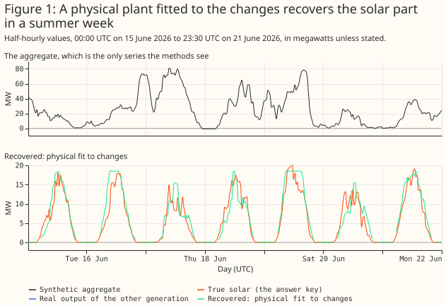

- **To find out whether an aggregate BMU holds solar, compare the cloud increment of its fit with
  the increment of its calendar replica.** The cloud increment is the share of four-hour changes
  that a fit with CAMS all-sky irradiance explains, minus the share that a fit with clear-sky
  irradiance explains ([Figure 19](#real-aggregate-bmus)).
- **To estimate the solar capacity of an aggregate, use the physical fit, and read the result as
  credible only for the 9 BMUs with a cloud increment above their replicas'** ([Figure
  22](#real-aggregate-bmus)).
- **To estimate the solar part of an aggregate beside wind or gas, use the physical fit, and treat
  the result as unreliable beside batteries and pumped storage** ([Figure 16](#where-it-fails)).
- **Do not scale the envelope of an aggregate's output by a clear-day shape to estimate its solar
  capacity**, because on aggregates with no solar it returns a mean of 83 MW of "solar" per 100 MW
  ([Controls](#controls)).

> **How this page was made.** The research question came from a human. Everything else — the code
> behind every result, the analysis, the figures, and the text — was written by Claude, Anthropic's
> AI model (for this page, Claude Sonnet 5.5). Several independent Claude reviewers have checked the
> method, the evidence, and the prose adversarially.

## Key findings

- **A free orientation predicts a single-site solar BMU's held-out output better than a fixed or
  tracking plant**, by 1.30 percentage points of capacity against a fixed 30°, south-facing plant (a
  contrast fixed before any result, [Figure 5](#single-site-solar-bmus)). The fitted tilts are 1° to
  16° and three sites sit at the 90° (due east) azimuth bound, so the orientation is a description
  of the output, not a measured property of the panels.
- **Capacity is the weakest of the four fitted parameters at single sites.** At the 6 sites where
  the output clips at the inverter limit, the fit's AC capacity is within 22.0% of Generation
  Capacity (the capacity registered with Elexon) on average and the largest output is within 3.5%
  (planned).
- **Simulated plants return their parameters**, with a +9.6° bias in tilt ([Figure
  6](#simulated-plants-return-their-parameters)).
- **The planned calendar-baseline separation recovers the shape of the solar part and a mean of 0.41
  of its energy.** It beats the census's envelope method by 121 percentage points of error
  (planned).
- **A physical fit to four-hour changes is the best of the methods tested**, and it is post hoc.
  Beside wind or gas it recovers a median of 0.89 of the energy, and its AC capacity is a median of
  0.93 of the capacity the same fit gives the solar half alone, at a 50% solar share, and 0.76 at
  10% ([Figure 8](#capacity-recovery)).
- **Weather-correlated output from other generation biases the calendar method's level.** Daily wind
  and clearness correlate at −0.36 over the study window. Differencing reduces that bias beside wind
  and gas, and reverses its sign when a demand term rises on dull days.
- **On real aggregate BMUs the share of variance explained cannot tell solar from demand.** The
  aggregates and their calendar replicas both explain a median 0.61 of the changes. The cloud
  increment separates 9 aggregate BMUs from their replicas, and is a fragile statistic.
- **Priors on tilt, azimuth, and DC:AC ratio help the azimuth only** (exploratory, [Figure
  18](#detection-and-parameter-errors)).

## Introduction

**The problem is to split one metered series into a solar part and everything else.** Under the
Balancing and Settlement Code (BSC) a supplier's Base BMU (the BMU that holds a supplier's
customers' demand) nets all the embedded generation behind it, and there is no technology field. The
first figure shows the problem with known answers. A solar part and a non-solar part, each a real
BMU's output, add to an aggregate. A method sees only the aggregate and the weather.

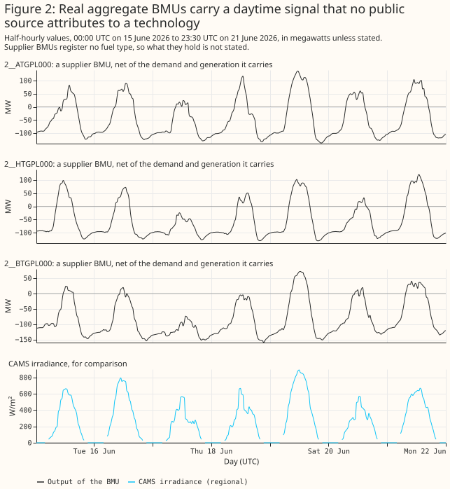

**This study answers four planned questions, and everything else is exploratory or post hoc.** The
plan fixed these contrasts before any result existed:

- **P1:** does a physical fit recover a single-site solar BMU's AC capacity better than the envelope
  methods?
- **P2:** does a free orientation fit hold-out data better than a fixed or tracking plant?
- **P3:** does a calendar-baseline separation recover the solar part of a synthetic sum better than
  the envelope-scaled curve?
- **P4:** does the calendar-baseline separation find under 2% false solar in an aggregate with no
  solar?

Six analyses were added after the first results, and the page labels them post hoc or exploratory:
the physical fit to changes, the difference separation, the dull-day demand control, the priors, the
detection statistics, and the calendar replicas. Two choices also differ from the plan: the primary
irradiance for synthetic aggregates is the mean of the 3 grid points nearest the solar sites'
centroid, not the supply point group's points with the solar sites' own points removed, and the
planned cosine-of-zenith comparison was replaced by clear-sky irradiance. No correction is made for
multiple comparisons.

## Data and methods

**The data are public.** Settled half-hourly output (Elexon report B1610) for 1,705 BMUs, the
register of BMUs, and CAMS global horizontal irradiance at 27 points (hourly, kept where the
reliability flag is at least 0.9). Wind at 100 m and temperature at 2 m from ERA5 come through
Open-Meteo, at 18 grid points, and serve only as controls. Public BMU names and megawatts are shown.

**The forward model turns irradiance into a plant's power.** CAMS gives hourly global irradiance.
The forward model splits each hour across its two half-hours by the cosine of the zenith angle,
splits global into beam and diffuse light with the Erbs correlation, transposes it to the panel
plane assuming diffuse light is equal from all of the sky (an isotropic sky), scales by an effective
DC capacity, and clips smoothly at the AC capacity. Four parameters are fitted: tilt, azimuth, DC:AC
ratio, and AC capacity.

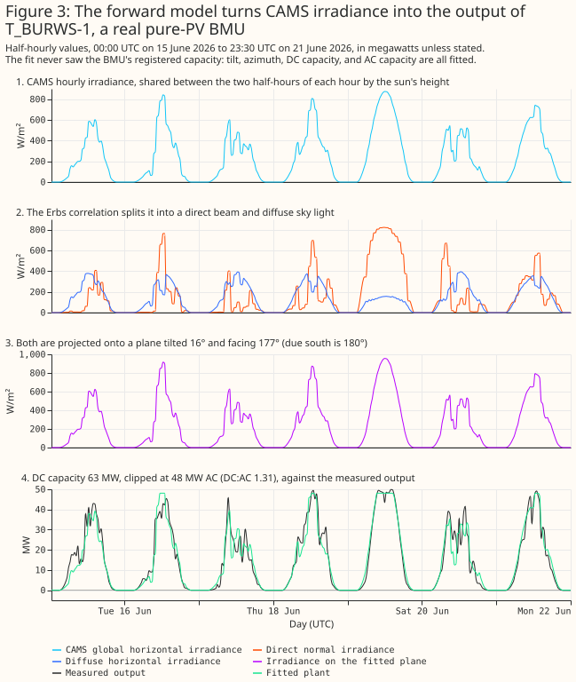

## Results

### Single-site solar BMUs

**A free-orientation plant follows the real output of known solar BMUs through a summer and a winter
week.** The 11 single-site BMUs are the known-answer case for the parameters.

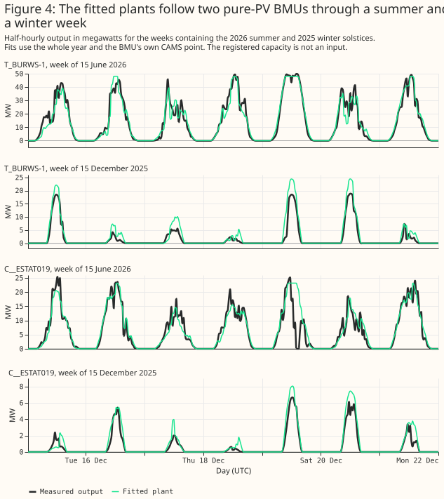

**A free orientation holds out better than a fixed or a tracking plant.** Over four contiguous folds
of three months, the free fit's mean error on held-out months is 8.32% of Generation Capacity,
against 9.62% for a fixed plant and 10.97% for a tracker. The paired difference is −1.30 points (95%
interval −1.97 to −0.70) against the fixed plant and −2.66 (−3.44 to −1.76) against the tracker
(planned P2). Free orientation wins at 10 of 11 BMUs and in 4 of 4 folds. The fitted tilts are low,
1° to 16°, which is implausible for fixed-tilt farms in Great Britain and may reflect the irradiance
model. Three sites fit at the 90° azimuth bound with a tilt of 1° to 5°, where the azimuth has no
meaning. Cleve Hill is reported to use an east-west layout, which one panel plane cannot represent.
The skill is real, and the fitted orientation describes the output, not the panels.

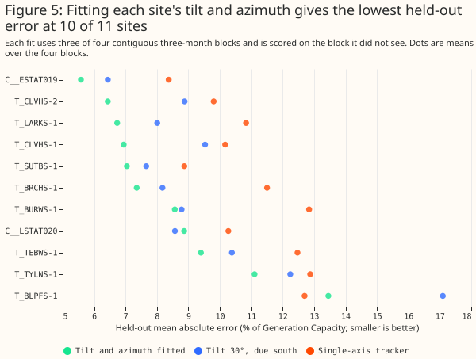

### Simulated plants return their parameters

**A simulation with a different irradiance chain recovers the parameters, with a tilt bias.** The
simulation uses the Direct Insolation Simulation Code (DISC) beam model, the Hay-Davies sky, a
temperature derate, and real residuals shifted in time. Over 44 simulated plants, azimuth is
recovered to a mean absolute error of 2.7°, DC:AC ratio to 0.05, and AC capacity to 1.5%. Tilt is
recovered with a correlation of 0.98 and a bias of +9.6°.

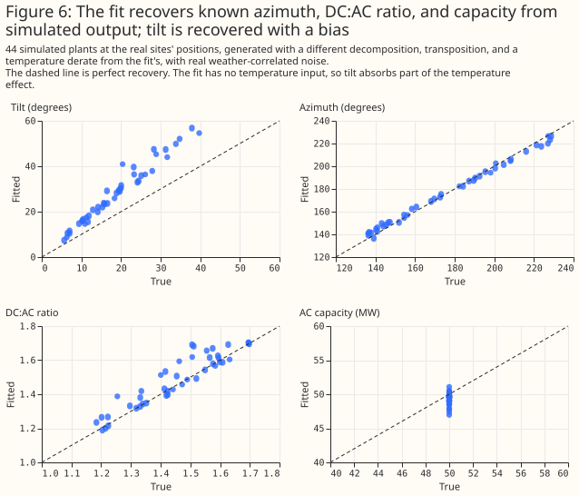

**Capacity is where a single-site fit is weakest, because the fit sits below the site's peak
output.** At the 6 sites where the output clips at the inverter limit, the fit's AC capacity has a
mean absolute error of 22.0% of Generation Capacity, against 3.5% for the largest output (planned
P1). Over all 11 sites the errors are 21.1% and 5.4%, and the physical fit is worse than every
comparator, by 15.7 points [7.7, 25.6] against the largest output. At all 11 sites the fitted AC
capacity is below the 99th percentile of the site's own output, which no inverter can be, for
example Litchardon (23.2 MW against 33.2 MW) and Cleve Hill's T_CLVHS-2 (143.8 against 162.0). The
robust loss treats the plant's real peaks as outliers, and the smooth clip stays below its limit.
The fitted "AC capacity" is therefore a fit parameter and not the inverter rating. Two sites also
disagree with the other public registers (Litchardon and Bishampton, whose Generation Capacity
exceeds their capacity in the Low Carbon Contracts Company and Renewable Energy Planning Database
registers).

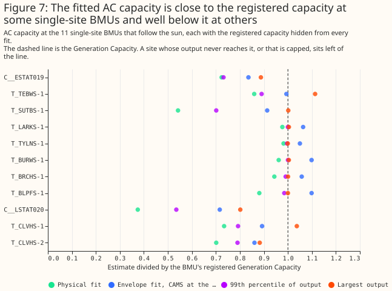

### Capacity recovery

**On synthetic aggregates (built in the next section), the fitted AC capacity beside wind or gas is
a median of 0.93 of the reference at a 50% solar share, 0.87 at 25%, and 0.76 at 10%.** The
reference is the capacity the same fit gives the solar half alone, so the ratio isolates the error
that the other generation adds. Beside pumped storage and batteries the fit recovers a median of
only 0.24 to 0.44 of the reference. The GB mean of 18 CAMS points, which the real aggregates could
use without knowing where their sites are, gives almost the same ratios (0.91, 0.84, and 0.70 beside
wind or gas).

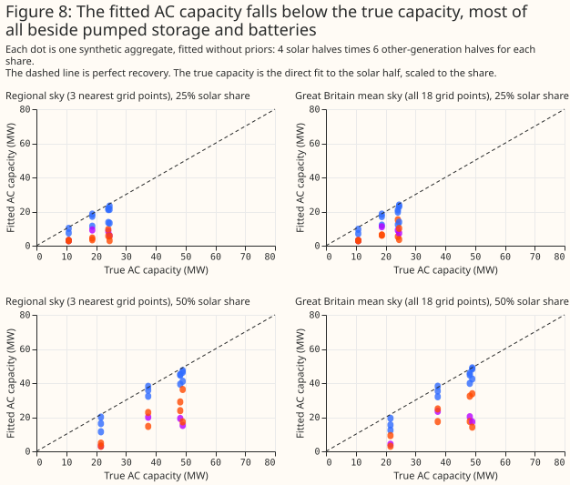

### Building a synthetic aggregate

**A synthetic aggregate is a real solar BMU plus a real non-solar BMU, each scaled so the total's
99th percentile is 100 MW.** The solar share is 0, 10%, 25%, or 50% of that 100 MW. The solar halves
are Burwell (T_BURWS-1), Bishampton (C__ESTAT019), Litchardon (C__LSTAT020), and the three together.
The non-solar halves are offshore wind (T_HOWBO-1), a gas peaker (T_PEHE-1), baseload gas
(T_HUMR-1), pumped storage (T_DINO-4), and two batteries (T_LKSDB-1 and E_DOLLB-1). That makes 72
aggregates with solar and 24 without.

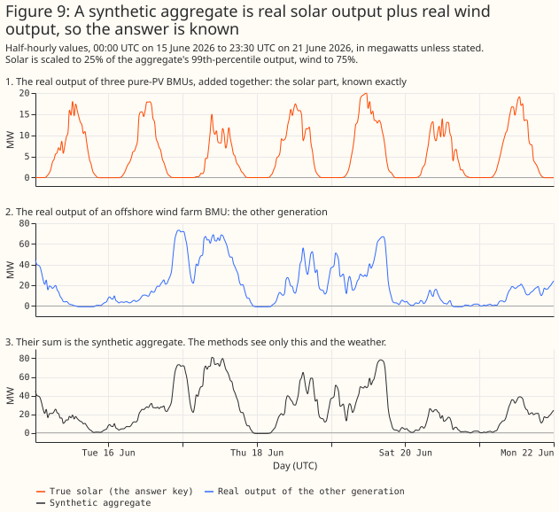

### Three methods, step by step

**The methods see the aggregate and a regional irradiance, and nothing else.** The regressor is the
mean CAMS irradiance at the three grid points nearest the solar sites' centroid, which the real
aggregates cannot use, so the page also reports the GB mean of 18 points. Each method turns the
regressor into basis curves: the output of 1 MW of AC capacity facing east, south, west, or tracking
the sun.

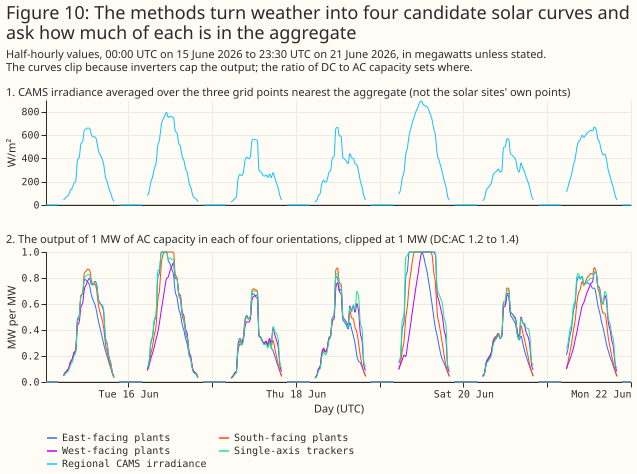

**The calendar-baseline separation recovers the shape of the solar part and too little of its
level.** The calendar-baseline separation fits non-negative weights on the four basis curves plus a
calendar baseline (half-hour of day, day type, and two annual harmonics). Cloud is what identifies
the solar part, because the baseline cannot follow day-to-day swings.

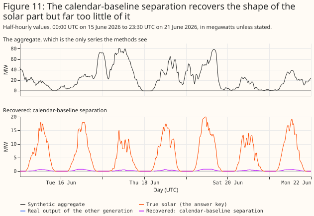

**The difference separation fits the same curves to the change in output over four hours.**
Differencing removes any output that moves more slowly than that, so the wind's multi-day swings
stop biasing the level beside wind and gas (post hoc).

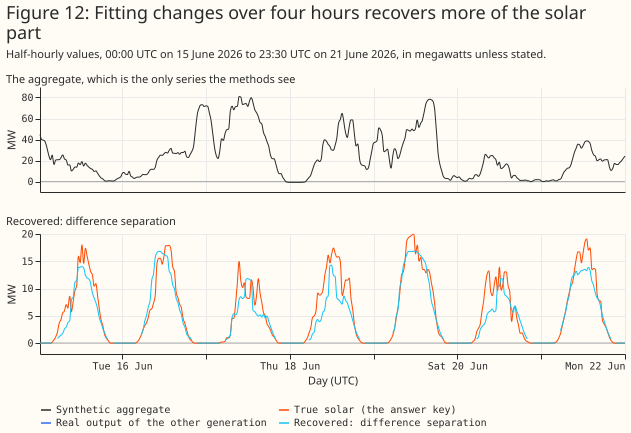

**The physical fit replaces the four fixed curves with one plant whose tilt, azimuth, DC:AC ratio,
and capacity are fitted to the same four-hour changes** (Figure 1, post hoc). The fit starts from
the difference separation's capacity and from nine starting orientations, and is robust to outliers
(a soft L1 loss). A pair of changes is used only when its two stamps are exactly four hours apart.

**The three parts add up to the aggregate by construction.** The calendar baseline absorbs demand's
regular daily pattern, and the residual holds the wind's weather-driven swings.

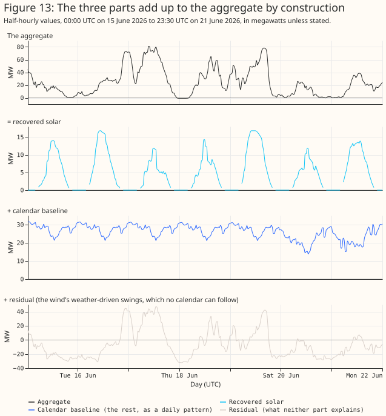

### What each method recovers

**Over a year, the calendar-baseline separation recovers a mean of 0.41 of the solar energy, and the
physical fit recovers most of it beside wind or gas, a mean of 0.77.** The energy ratio is the
recovered energy divided by the true energy.

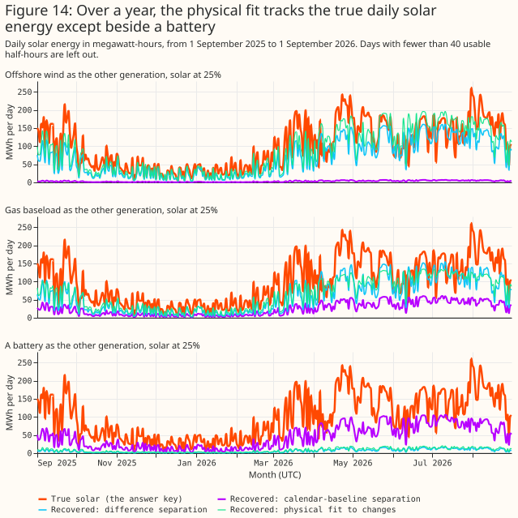

**Beside wind, the physical fit lies on the 1:1 line; beside a battery, none of the methods does.**

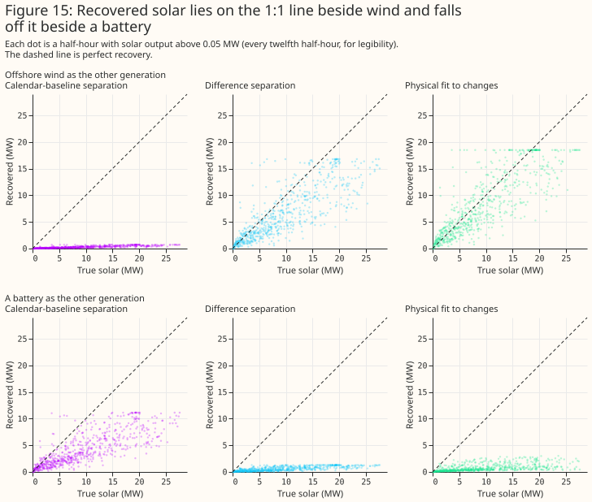

**The planned calendar-baseline separation beats the census's envelope method by 121 points of error
(planned P3).** The planned calendar-baseline separation's mean error is 24.8% of the solar part's
99th percentile [20.6, 28.3], against 146.2% [106.2, 176.5] for the envelope-scaled curve the census
used. The envelope method scales the upper envelope of an aggregate's output by a clear-day shape.
The census built it to bound a BMU's solar capacity from above, so this contrast shows only that the
envelope method is the wrong tool for an estimate. The paired difference is −121.3 points [−149.7,
−84.3] (planned P3). Clear-sky irradiance, which carries no cloud, is worse by 25.9 points [22.2,
29.4], so cloud is what gives the method its skill. Using the GB mean of 18 CAMS points instead of
the nearest three raises the error by 0.69 points. Giving the method the true non-solar part (an
oracle baseline) would improve it by 10.7 points, which bounds what a better baseline could gain.

### Where it fails

**Beside a battery or pumped storage, no method separates the solar part.** A battery that charges
when solar output is high moves with the sun, so its output is partly indistinguishable from solar.
The physical fit's median error is 22.3% of the solar part's 99th percentile beside batteries,
against 12.0% beside wind or gas, and the recovered energy falls to 0.44. Beside pumped storage the
fit detects solar in none of the 12 aggregates.

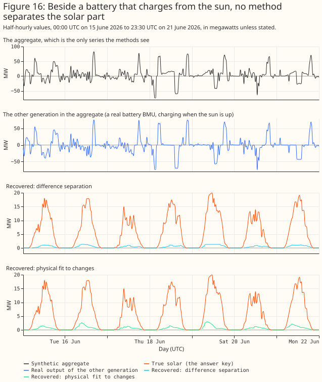

### Detection and parameter errors

**On synthetic aggregates the variance explained detects solar only when it is at least a quarter of
the aggregate.** The statistic is the share of the variance of four-hour changes that the fitted
plant explains. Its threshold is the largest value across the 24 aggregates without solar, 0.00017.
The 24 aggregates without solar are six distinct non-solar series, each seen under four skies, so
the false-positive rate is zero by construction and rests on six series. The fit detects solar in 0%
of aggregates at a 10% share, 50% at 25%, and 79% at 50% (post hoc). The non-solar halves have
almost no daily cycle, so the variance explained is valid on synthetic aggregates and not valid on
real aggregates (next section).

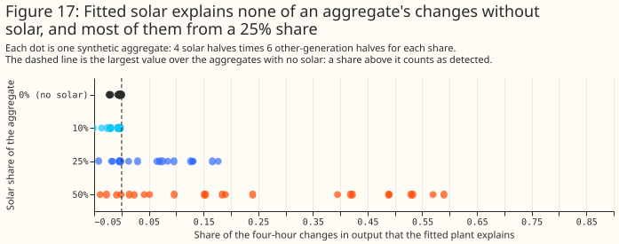

**Beside wind or gas, the fitted tilt, azimuth, and DC:AC ratio are close to the reference fits.**
In the 25% and 50% detected aggregates the median errors against the direct fit to the solar half
are 4.5° in tilt, 20.3° in azimuth, 0.03 in DC:AC ratio, and 10.8% in capacity. Beside batteries,
where only 7 aggregates are detected, the median errors are 10.2°, 47.5°, 0.17, and 50.5%. With the
GB mean sky, beside wind or gas, the errors are 6.2°, 25.6°, 0.12, and 12.3%.

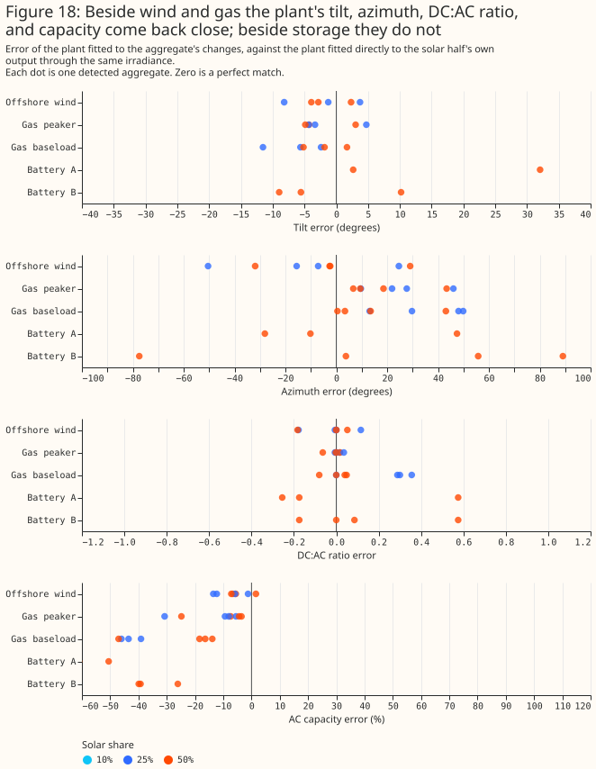

**Priors on the parameters help the azimuth and nothing else (exploratory).** A Gaussian prior
centred on a 30° tilt, a south azimuth, and a DC:AC ratio of 1.3 lowers the median azimuth error
beside wind or gas from 28.4° (no prior) to 23.1° (loose) and 17.7° (tight), and raises the median
capacity error from 13.7% to 14.2% and 15.8%. Detection, series error, and the battery results do
not change. The loose prior has standard deviations of 20°, 40°, and 0.3. The tight prior has 10°,
15°, and 0.15. The robust loss is linear beyond its scale, so the priors act more weakly than their
stated standard deviations where the data's noise is large.

### Controls

**Two controls bound the false-alarm rate of the separations.** On aggregates with no solar, the
census's envelope method returns a mean of 82.9 MW of "solar" per 100 MW and none of the 24 stay
under the 2 MW limit. The planned calendar separation finds a mean of 0.38 MW of false solar in 24
aggregates without solar, and 22 of 24 stay under the 2 MW limit (planned P4). When a demand term
that rises on dull days is added, it finds a mean of 4.6 MW and only 12 of 24 stay under the limit.
The difference separation finds none in either case. Beside that demand term, the energy the
difference separation recovers falls from 0.60 to 0.45 of the true energy and the physical fit's
from 0.77 to 0.53 (the physical-fit row with the dull-day demand has 12 scenarios, and the other
rows 36), so differencing reverses the bias of the dull-day demand and does not remove it.

### Real aggregate BMUs

**On real aggregates the share of variance explained cannot separate solar from demand.** The
aggregates explain a median 0.61 of their four-hour changes and their calendar replicas explain
0.61. A replica is the aggregate's mean output for each month, half-hour of day, and day type
(weekday, Saturday, or Sunday), so it has the demand's daily shape and no cloud. A fit with
clear-sky irradiance, which also has no cloud, explains a median 0.66. The 81 non-solar BMUs score
about zero because they have no daily cycle, so the non-solar controls say nothing about a BMU whose
output is mostly demand.

**The cloud increment separates 9 aggregate BMUs from their replicas.** The increment is the
variance explained with all-sky irradiance minus the variance explained with clear-sky irradiance.
With the regional irradiance of each BMU's grid supply point group, 9 aggregate BMUs have an
increment of 0.086 to 0.194, and the other 16 have −0.05 or less except for two at about zero. On
the GB mean sky, which the replicas and the non-solar controls use, the same 9 aggregates and one
more (V__NFLEX003) have an increment of 0.025 to 0.136, and their replicas are all negative (−0.076
to −0.005). The 81 non-solar controls reach 0.022 on that sky, apart from the 10 nuclear BMUs (0.026
to 0.728), whose clear-sky fits explain a negative share and so make the increment large without any
cloud. The 0.022 line was chosen after seeing the data, and no control was fitted on the regional
sky.

**A placebo sky and a season split test where the increment comes from.** The placebo permutes whole
days within each calendar month (20 permutations), so the sky keeps its seasonal level and daily
shape and loses the link to the real day's cloud. For all 9 aggregates the placebo increment is
negative (95th percentile −0.117 to −0.043), against a real increment of 0.086 to 0.194, so the
increment depends on the real day's cloud. The increment is larger in winter (0.13 to 0.34) than in
summer (0.06 to 0.16) for all 9 aggregates, although winter solar output is weaker. A
cloud-correlated demand, such as lighting and heating, would also behave this way, so the component
is not shown to be solar (post hoc).

**The cloud increment is small even for real solar.** The 11 known solar BMUs have a median
increment of 0.024 on the GB mean sky (range −0.009 to 0.076), and the 9 aggregates' increments are
larger than any known-solar case the study produced. The increment is a difference of two in-sample
squared-error shares, each unbounded below, so a degenerate clear-sky fit inflates it. A
cloud-correlated demand, such as lighting and heating, would also raise it.

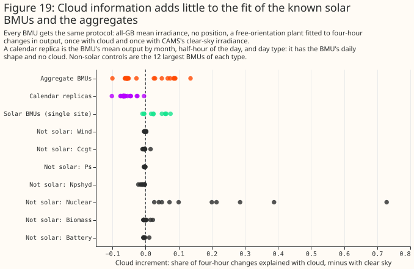

**On the 9 BMUs the fitted plant follows the output in summer, and the fitted orientation is
south-facing.** The 6 largest supplier BMUs have a tilt of 18° to 35°, an azimuth of 175° to 186°,
and a DC:AC ratio of 1.1 to 1.2. The 16 other aggregate BMUs mostly fit a ratio of 2.2 and show no
cloud signal, so the page reads their fits as daily shape.

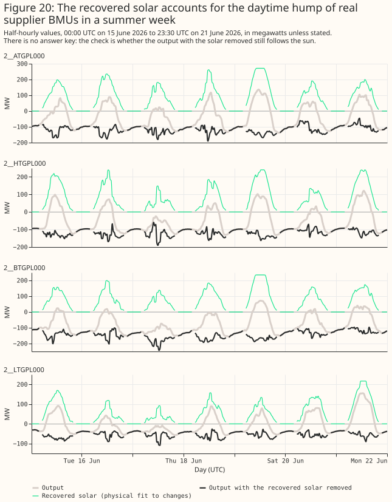

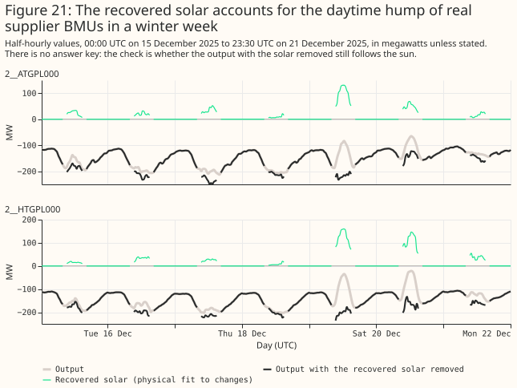

**The 9 BMUs with a cloud signal hold about 1.1 GW of fitted solar AC capacity.** The physical fit's
AC capacity is 1,138.5 MW for these 9 and 24.6 MW for the other 16, against 1,031.3 MW for the
difference separation on the same 9. The census's envelope bound for all 25 BMUs is 781.0 MW, and
their Generation Capacity is 1,802.8 MW. One BMU, 2__HTGPL000, has a Generation Capacity of 912.5 MW
and a fitted 240.4 MW. The fitted plants produce 1,693.3 GWh of solar per year in total. On the
synthetic aggregates the fit's capacity is a median of 0.87 to 0.93 of the reference beside wind and
gas and 0.24 to 0.44 beside storage, and the reference itself sits below the site's peak output.
Nothing here shows which way the error runs for a supplier BMU that nets demand: when a supplier BMU
is the non-solar half of a synthetic aggregate, the calendar separation returns 2 to 13 times the
added solar energy. There is no ground truth for these BMUs.

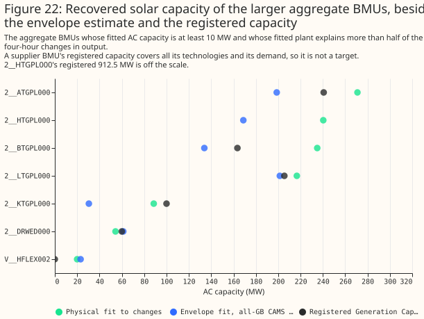

## Discussion

**The evidence supports carrying forward the physical fit to changes, judged by the cloud increment,
and it shows that batteries need an explicit model.** The physical fit needs no labelled training
data, and it recovered most of the solar part beside wind and gas. Four design lessons carry over.

- **Fit changes, not levels.** Weather-correlated output (wind, dull-day demand) biases a level fit
  and mostly cancels in four-hour differences beside wind and gas.
- **Judge a detection against a control with the same daily shape.** A control with no daily cycle
  flatters any statistic that fits the sun's daily rise.
- **Expect little orientation information.** Aggregate BMUs with no cloud signal fit at the
  parameter bounds, and the fitted tilts of real solar BMUs are 1° to 16°.
- **Model batteries explicitly.** A battery that charges when solar output is high looks like a
  solar plant with the opposite sign on cloud.

## Limitations

- **Single-site capacity from the fit is worse than the largest output** (22.0% against 3.5% at the
  6 sites where output clips), so capacity from an aggregate carries at least that error. The fitted
  AC capacity sits below the 99th percentile of output at all 11 solar BMUs, so it is a fit
  parameter and not an inverter rating.
- **Tilt has a +9.6° bias in simulation**, and the DC capacity is an effective scale.
- **8 of the 11 solar BMUs are hybrids**, so their output includes battery effects.
- **The physical-fit results on synthetic aggregates have no month bootstrap**, only the spread over
  scenarios.
- **The cloud increment is a weak, fragile detector.** It is a difference of two in-sample shares
  and no placebo-sky test is in the planned set. On the synthetic aggregates it exceeds its no-solar
  threshold in at most 21% of aggregates without dull-day demand (GB mean sky, 50% share) and in
  none with the regional sky. Its value for real solar BMUs is small. Its use on the real aggregates
  rests on the replicas and on the contrast with the known solar BMUs.
- **The non-solar controls and the replicas use the GB mean sky**, and the headline count of 9 uses
  the regional sky. On the GB mean sky the count is 10.
- **The supplier BMU results have no ground truth**, and the dull-day demand control is a single toy
  confound.
- **The synthetic aggregates pick their regional irradiance points from the solar half's true
  location**, an advantage that the real aggregates do not have. The GB mean sky removes it, at a
  small cost.
- **The simulation's noise and the timestamp-shift scan move by rows, not by clock time**, so near
  the gaps left by unreliable CAMS hours they shift by more than a half-hour.
- **The envelope numbers recomputed here (781.0 and 954.6 MW) differ slightly from the census's.**
- **The code was first run during exploration**, before its code review.
- **Primary-substation data from NGED was not used.**

## Scope

**This study separates solar from aggregate BMUs using public data. It does not use NGED's private
data and does not forecast.**

## Data and code availability

The scripts are in `studies/solar_disaggregation/`, the shared machinery in
`packages/studies/src/studies/` (`pv_physics.py`, `pv_fit.py`, `pv_separation.py`), and the results
under `data/studies/per_study/solar_disaggregation/`, which are not committed.

## Reproducing

```bash
uv run python studies/solar_disaggregation/stage1_single_sites.py
uv run python studies/solar_disaggregation/stage1b_synthetic_recovery.py
uv run python studies/solar_disaggregation/fetch_weather_covariates.py
uv run python studies/solar_disaggregation/stage2_synthetic_separation.py
uv run python studies/solar_disaggregation/stage2b_level_and_shape.py
uv run python studies/solar_disaggregation/stage2c_physical_fit_to_aggregates.py
uv run python studies/solar_disaggregation/stage3_real_aggregates.py
uv run python studies/solar_disaggregation/stage3b_real_controls.py
uv run python studies/solar_disaggregation/stage3c_placebo_sky.py
uv run python studies/solar_disaggregation/walkthrough_series.py
uv run python studies/solar_disaggregation/disaggregation_report.py
uv run python studies/solar_disaggregation/disaggregation_charts.py
```
