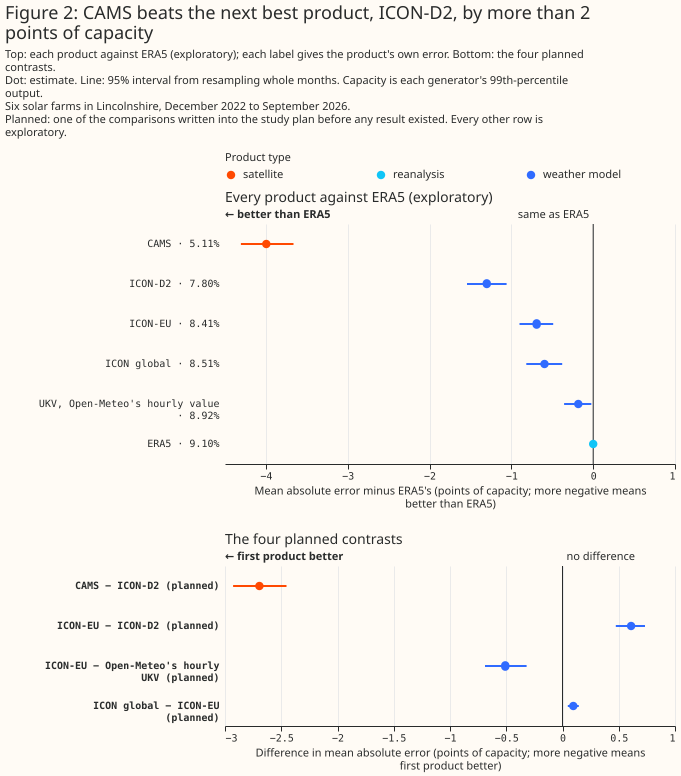
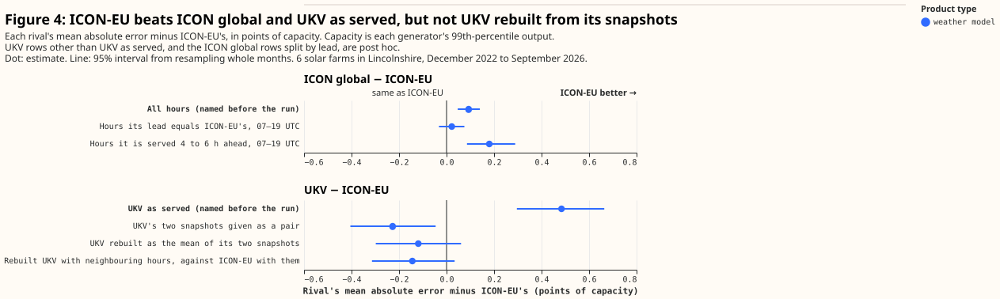
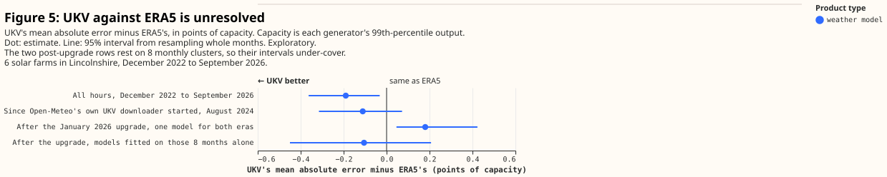
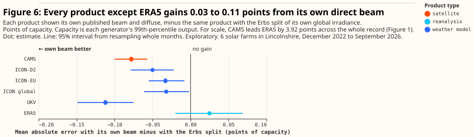
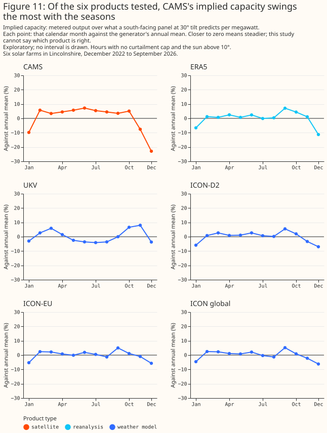

# Which weather product best describes past sunshine?

**At six metered solar farms in Lincolnshire, a satellite retrieval describes past sunshine far
better than any of the weather models tested or the reanalysis.** For each weather product, an
XGBoost model, a gradient-boosted tree, was fitted per generator to predict hourly output from that
product's sunshine, and scored by its mean absolute error as a percentage of the generator's
capacity. The error is 5.05% of capacity given the Copernicus Atmosphere Monitoring Service's
satellite retrieval (CAMS). The error is 7.71% given ICON-D2, the best of the four weather models
tested, and 8.98% given ERA5, the reanalysis of the European Centre for Medium-Range Weather
Forecasts (ECMWF). ICON-D2 is the German weather service's model for Germany and neighbouring
countries. The satellite observes the clouds of the hour itself, where every weather model simulates
them, so a large gap is expected.

**For capacity estimation, training history, and disaggregation the page recommends CAMS where its
one-day delay allows, and for historical features in the live service ICON-EU or rebuilt UKV.**
These four consumers of past weather are parts of this project, described in the
[introduction](#introduction). ICON-EU is the German weather service's European model. Rebuilt UKV
is the Met Office's UK variable-resolution model (UKV) with its hourly value rebuilt from its own
snapshots. The evidence is six metered solar farms inside one 25 km by 23 km box in Lincolnshire,
and 79,384 generator-hours from December 2022 to September 2026.



In Figure 1 the top panel's intervals are against ERA5, so two products whose intervals overlap
there may still differ; the bottom panel compares the named pairs directly.

> **How this page was made.** The research question came from a human. Everything else — the code
> behind every result, the analysis, the figures, and the text — was written by Claude, Anthropic's
> AI model (for this page, Claude Opus 5.5, reusing the data-preparation and model-fitting code that
> Claude Opus 5 wrote for the [beam/diffuse study](beam-diffuse-split.md)). A human has reviewed the
> figures and the text, and several independent Claude reviewers have checked the method, the
> evidence, and the prose adversarially.

## Key findings

**A difference between two errors is in percentage points of capacity, written "points", and a
bracketed pair after a figure, such as [2.42, 2.88], is its 95% interval.** A weather model's value
"as served" is the value Open-Meteo's archive holds for an hour, which comes from a run of the
weather model that started a few hours earlier.

- **CAMS beats ICON-D2, the best of the weather models tested, by 2.65 points [2.42, 2.88], and the
  gap holds at every generator, in every season, and in each calendar year from 2023 to 2026.** See
  [CAMS describes past sunshine
  best](#cams-describes-past-sunshine-best-of-the-six-products-tested-by-a-wide-margin).
- **Among the four weather models tested, ICON-D2 (from the German weather service's Icosahedral
  Nonhydrostatic model family) is the best as served, beating ICON-EU by 0.60 points [0.46, 0.71]
  across the record.** In a breakdown added after the first run, ICON-D2's advantage over ICON-EU
  shrinks from 0.98 points 1 hour into each run to 0.30 points 3 hours in. See [ICON-D2 is the best
  weather model
  tested](#icon-d2-is-the-best-weather-model-tested-and-its-advantage-shrinks-within-hours-of-each-run).
- **ICON-EU is 0.09 points ahead of ICON global, the same service's global model, as served [0.05,
  0.14].** In a split added after the first run, most of that small gap sits in the hours ICON
  global is served further ahead than ICON-EU. See [ICON-EU against ICON global and
  UKV](#icon-eu-against-icon-global-and-ukv).
- **Once UKV's hourly value is rebuilt from its own snapshots, ICON-EU no longer beats UKV.**
  Against Open-Meteo's hourly value for UKV, ICON-EU is 0.48 points ahead [0.30, 0.66]. Rebuilt as
  the mean of UKV's snapshots at the start and the end of the hour, UKV is 0.12 points ahead of
  ICON-EU [−0.06, +0.30]. An XGBoost model given both snapshots as separate inputs puts UKV 0.23
  points ahead [0.05, 0.41]. Every rebuild of UKV was added after the first run. See [ICON-EU
  against ICON global and UKV](#icon-eu-against-icon-global-and-ukv).
- **Rebuilt UKV also beats ERA5, by 0.79 points [0.61, 0.98], but Open-Meteo's hourly value for UKV
  against ERA5 is unresolved.** See [UKV rebuilt from its snapshots beats
  ERA5](#ukv-rebuilt-from-its-snapshots-beats-era5).
- **A product's own published direct beam improves the XGBoost model by 0.03 to 0.11 points for
  every product except ERA5.** See [A product's own direct beam adds
  little](#a-products-own-direct-beam-adds-little).
- **An XGBoost model trained on five generators and applied to the sixth ranks the products the
  same way, with errors 0.06 to 0.18 points larger.** See [The ranking holds for a generator
  predicted from its neighbours](#the-ranking-holds-for-a-generator-predicted-from-its-neighbours).
- **Once the seasonal cycle is removed, CAMS's implied capacity is the steadiest of the six products
  from month to month, but CAMS swings the most of the six with the seasons.** See [Implied capacity
  from month to month](#implied-capacity-from-month-to-month).

## Introduction

Several parts of this project read an estimate of weather that has already happened, not a forecast.
This page calls those parts the consumers of past weather, which are parts of the project, not
electricity customers. Capacity estimation infers a generator's size from how its output tracks
sunshine. Training history is the years of past weather that pre-training a forecasting model needs.
Historical features give a forecasting model the weather of hours already past. Disaggregation
separates hidden solar generation from demand at a substation. Each consumer reads one weather
product, and the project has to choose which. This page measures how well six products describe past
sunshine at six metered solar farms, and says which product each consumer should read.

**The products differ in how far ahead each value was forecast and in what area they cover, as well
as in accuracy, and both properties matter to a consumer.** A weather model run is one of the
forecasts each weather model starts every few hours, and the archive's value for an hour comes from
a run that started up to a few hours earlier. The page calls a product's value as the archive holds
it the value "as served". How many hours earlier the served value was forecast is the served lead.
A lead of zero, written T+0, is the run's analysis: the weather model's best estimate of the weather
at the moment the run starts. ICON-D2 does not cover South West England or South Wales, which are
inside the licence area of National Grid Electricity Distribution (NGED), the distribution network
operator this project forecasts for. ICON-D2's western edge runs from about 2°W on the south coast
to about 2.5°W in the Midlands.

| Product | What it is | Served lead | Covers all of Great Britain? | Grid spacing, native and as served | Start of the archive read here | Available after |
|---|---|---|---|---|---|---|
| CAMS | Satellite retrieval from Meteosat images | no forecast step | yes | point values, from satellite pixels about 5 km across | 2004 | about 1 day |
| ERA5 | ECMWF reanalysis, a consistent record back to 1940 | 1 to 12 hours | yes | about 31 km | 1940 | about 5 days |
| UKV | Met Office model for the UK | T+0, the analysis | yes | 1.5 km over the UK, coarsening to 4 km at the domain's edges; served at 2 km | March 2022, which Open-Meteo backfilled from a source it does not name until August 2024 | about 4 hours |
| ICON-D2 | German weather service (DWD) model for Germany and neighbouring countries | 1 to 3 hours | no | 2.2 km; served at about 2 km | December 2022 | about 1.5 hours |
| ICON-EU | DWD model for Europe, nested inside ICON global | 1 to 3 hours | yes | 6.5 km; served at about 7 km | November 2022 | about 3.5 hours |
| ICON global | DWD global model | 1 to 6 hours | yes | 13 km; served at about 11 km | November 2022 | about 3.5 hours |

**The latencies come from each service's own documentation:** CAMS's [radiation-service
notes](https://confluence.ecmwf.int/x/jOLjDw), the [ERA5 dataset
page](https://cds.climate.copernicus.eu/datasets/reanalysis-era5-single-levels?tab=overview),
Open-Meteo's [UKV documentation](https://open-meteo.com/en/docs/ukmo-api), and the publication times
of the German weather service's own open-data files.

**SARAH-3, the Surface Solar Radiation Data Set from the Satellite Application Facility on Climate
Monitoring, is not here.** SARAH-3 is a second satellite retrieval, available only by manual order
from the European Organisation for the Exploitation of Meteorological Satellites (EUMETSAT).
Measuring SARAH-3 against CAMS on metered solar output is
[#806](https://github.com/openclimatefix/nged-substation-forecast/issues/806).

## Data and methods

### What each error measures

**Every error on this page is a mean absolute error as a percentage of each generator's own 99th
percentile of output, which the page calls its capacity.** That capacity is a statistic of the
metered output, not the generator's registered or export capacity. Each error is that of an XGBoost
model fitted per generator to predict hourly output from one product, so the figures rank how much
each product's sunshine says about the output once that XGBoost model has been fitted.

### Where each product comes from, and its served lead

**The four weather models come from Open-Meteo's historical-forecast archive, and ERA5 from
Open-Meteo's copy of the Copernicus archive.** `verify_era5_sources.py` checked that copy against
the Copernicus original. CAMS comes from the CAMS radiation service. The start dates for the weather
models are those of Open-Meteo's archive: DWD has run ICON global and ICON-EU since 2015, and
ICON-D2 since February 2021.

Each served lead comes from how the product's archive is built:

- **ERA5's hourly radiation is not an analysis.** It comes from the reanalysis's own short
  forecasts, started at 06 and 18 UTC, at steps of 1 to 12 hours ([ERA5
  documentation](https://confluence.ecmwf.int/display/CKB/ERA5%3A+data+documentation)).
- **Open-Meteo's weather-model archive keeps, for each hour, the freshest run that covers it.** For
  UKV, which runs every hour, the freshest run is the T+0 analysis. `verify_ukv_lineage.py` matched
  Open-Meteo's served UKV value against the Met Office's own files to within 0.55 W m⁻² at five
  instants either side of the January 2026 upgrade, at one generator's location. The check does not
  reach the backfill before August 2024.
- **For ICON-EU, the freshest run is measured.** `verify_icon_lineage.py` reconstructed each hour
  from 08 to 16 UTC on one day, at one place, from every run the German weather service still
  published. At all nine hours the freshest run reproduced Open-Meteo's served value to within
  1 W m⁻².
- **For ICON-D2 the same check does not confirm the mapping on its own.** The freshest run was the
  closest match at 7 of 9 hours, but still differed by up to 44 W m⁻². That mismatch is between
  Open-Meteo's served value and DWD's own files, so it bears on the archive, not on ICON-D2's
  accuracy. The 3-hour pattern in ICON-D2's own errors, described below, is the stronger evidence.
  The lead analysis below assumes that ICON-D2's archive is built the same way as ICON-EU's, which
  runs on the same 3-hourly cycle.
- **ICON global's lead is inferred from its 6-hourly cycle.** DWD publishes ICON global's open data
  only on the weather model's native icosahedral grid, which `verify_icon_lineage.py` does not read.

### How the comparison was made

**Every product is scored on the same hours, with the same XGBoost model and the same features, so a
difference between two products is a difference between their irradiance alone.**

- **One row set.** An hour is kept only if all six products cover it. An hour is dropped if either
  of its two half-hours of metered power reads zero, whatever any product says about that hour. So
  no product's own values decide which hours are scored. CAMS is read in full, not only on the hours
  it rates as reliable.
- **One XGBoost model per generator.** A gradient-boosted tree (XGBoost) is fitted per generator on
  one product's global horizontal irradiance plus sun position, season, time of day, and ERA5's air
  temperature. Every XGBoost model is given the same temperature.
- **Folds that respect an upgrade.** Each XGBoost model is trained on some blocks of whole months
  and scored on the others, which it has never seen; each held-out block is called a fold. The Met
  Office's PS47 upgrade of UKV went live on 21 January 2026. The record is cut into five folds
  separately before and after that date, so every fold is scored by an XGBoost model trained on both
  versions. Every XGBoost model is also told which side of the date an hour falls. The 11 days from
  21 to 31 January are dropped, because the folds are cut by whole month and January counts as a
  pre-upgrade month.
- **One normalisation.** Each hour's error is divided by its own generator's capacity before any
  mean or difference.
- **Intervals from whole months.** The six generators share their weather, so each 95% interval
  comes from resampling whole calendar months 2,000 times, each time also drawing one of three
  XGBoost fits that differ only in their random seed. This page calls a difference statistically
  significant at the 5% level when its 95% interval from resampling whole months lies wholly on one
  side of zero, and not statistically significant at the 5% level when the interval includes zero.
  The test covers month-to-month variation in the weather and the fitting seed only, not variation
  between generators. The intervals are not corrected for the number of comparisons, so among the
  many exploratory rows some will reach significance by chance.
- **Four planned contrasts.** A contrast is the difference between two products' errors on the same
  hours. A comparison is planned when it was written into the study plan before any result existed;
  every other figure is exploratory, chosen or added after results were seen. The distinction
  matters because with many comparisons, about 1 in 20 exploratory rows reaches significance at the
  5% level by chance, so an exploratory result is a lead to follow up rather than a finding. A chart
  holding both kinds marks each planned row "(planned)". A chart whose rows are all one kind says so
  once, in its subtitle. The ranking rests on four planned contrasts: CAMS against ICON-D2, ICON-EU
  against ICON-D2, ICON-EU against UKV, and ICON global against ICON-EU. Every other figure on this
  page is exploratory. The UKV snapshot rebuilds, the hour-by-hour and by-lead breakdowns, and the
  split of ICON global by lead were added after the first run.

**The folds are cut by `studies.cross_validation` and the intervals computed by `studies.bootstrap`,
both covered by tests.**

## Results

### CAMS describes past sunshine best of the six products tested, by a wide margin

**The satellite retrieval beats the best of the weather models tested by 2.65 points [2.42, 2.88],
and the gap holds at every generator, in every season, and in each calendar year from 2023 to
2026.**

| Product | Mean absolute error, % of capacity |
|---|---|
| CAMS | 5.05 |
| ICON-D2 | 7.71 |
| UKV given its two snapshots as separate inputs (added after the first run) | 8.07 |
| UKV rebuilt as the mean of its two snapshots (added after the first run) | 8.18 |
| ICON-EU | 8.30 |
| ICON global | 8.39 |
| UKV, Open-Meteo's hourly value | 8.79 |
| ERA5 | 8.98 |

Across the six generators, CAMS's margin over ICON-D2 ranges from 2.28 to 3.36 points. By season it
ranges from 1.80 points in winter to 3.02 in autumn, and in each calendar year from 2023 to 2026
(2026 to 10 September) it lies between 2.58 and 2.84.


**The gap is not an artefact of lead or of reading CAMS in full.** On the hours ICON-D2 is served 1
hour after its run started, CAMS still beats it by 2.23 points [1.99, 2.45]. Reading CAMS in full is
the conservative choice: on the 71,279 hours CAMS rates as reliable, CAMS's margin over ERA5 widens
from 3.92 to 4.36 points.

### ICON-D2 is the best weather model tested, and its advantage shrinks within hours of each run

**ICON-D2 beats ICON-EU across the record by 0.60 points [0.46, 0.71], by 0.98 points [0.83, 1.12]
in the first hour after each run, and by only 0.30 points [0.14, 0.46] in the third hour.** ICON-D2
and ICON-EU run on the same 3-hourly cycle, so at any given hour both are served at the same lead.

| Hour (UTC) | 09 | 10 | 11 | 12 | 13 | 14 | 15 | 16 |
|---|---|---|---|---|---|---|---|---|
| Served lead of both | 3 h | 1 h | 2 h | 3 h | 1 h | 2 h | 3 h | 1 h |
| ICON-D2 − ICON-EU (points) | −0.35 | −1.27 | −0.69 | −0.23 | −1.44 | −0.72 | −0.43 | −0.94 |

The table shows hours 09 to 16 UTC. Each hour is labelled by its end, so 12 UTC is the mean from
11:00 to 12:00. The by-lead figures above average over 07 to 19 UTC. At those two edge hours, with
the sun low, the pattern weakens: 1 hour into a run, ICON-D2's advantage is only 0.32 points at
07 UTC and 0.06 points at 19 UTC.


**The time of day does not explain the pattern around noon.** The hours 12 and 13 UTC sit on either
side of solar noon, yet ICON-D2's advantage is 0.23 points at 12 UTC, 3 hours into a run, against
1.44 points at 13 UTC, 1 hour in. ICON-EU shows no such pattern with lead. Against UKV rebuilt from
its snapshots, which is always served at T+0, ICON-EU is 0.15, 0.15, and 0.12 points behind 1, 2,
and 3 hours into its runs, in a comparison added after the first run.

**The mechanism is not identified, and the rate of decay may not hold elsewhere.** ICON-D2 takes the
weather at its boundaries from ICON-EU. The six generators sit about 160 to 200 km east of ICON-D2's
western boundary, so air arriving on a westerly wind may carry ICON-EU's weather to them within
hours. Another candidate is ICON-D2's own data assimilation: an advantage built into each run's
starting state would be expected to decay over the run's first hours. By a 3-hour lead only 0.30
points of the advantage remain, so the as-served advantage should not be assumed to hold a day
ahead. The comparison at longer leads belongs to
[#810](https://github.com/openclimatefix/nged-substation-forecast/issues/810), the study comparing
weather models for UK power forecasting.

### ICON-EU against ICON global and UKV

**Most of ICON global's 0.09-point deficit to ICON-EU sits in the hours ICON global is served
further ahead.** ICON global runs every 6 hours, so half its hours are served 4 to 6 hours after the
run started, where ICON-EU is at 1 to 3 hours. On those hours ICON global is 0.18 points behind
[0.09, 0.29]. On the hours where the two leads are equal ICON global is 0.02 points behind [−0.03,
+0.08]. So the effect of the coarser grid is not statistically significant at the 5% level, though
an effect as large as 0.08 points is not excluded. The split also divides the hours of the day: the
longer leads fall at 10 to 12 and 16 to 18 UTC, so a difference in either weather model's skill by
time of day would show up here as an effect of lead.

**ICON-EU beats Open-Meteo's hourly value for UKV by 0.48 points [0.30, 0.66], one of the four
planned contrasts, and the whole gap disappears once UKV's hour is rebuilt from its own snapshots.**
Each ICON product's archived value for an hour is a mean over that hour. UKV publishes a snapshot
each hour, and Open-Meteo builds UKV's hourly value from the snapshot at the hour's end, rescaled by
the change in the sun's angle. In comparisons added after the first run, averaging UKV's snapshots
at both ends of the hour cuts UKV's error by 0.60 points, which leaves ICON-EU 0.12 points behind
[−0.06, +0.30]. An XGBoost model given the two snapshots as separate inputs puts UKV 0.23 points
ahead of ICON-EU [0.05, 0.41].

**Giving the XGBoost model the neighbouring hours improves both products by about 0.2 points, which
is more than the gap between them.** An XGBoost model given ICON-EU's hourly mean for the hour
before and after, as well as the hour itself, improves by 0.18 points. The same context improves
UKV's rebuilt hour by 0.21 points. With context on both, ICON-EU is 0.14 points behind [−0.03,
+0.31]. With context, ICON-EU is also 0.05 points behind UKV's two snapshots given as separate
inputs [−0.13, +0.22].

**Every rebuilt UKV construction scores ahead of ICON-EU across the record in point estimate, and
UKV is also served at the shorter lead.** UKV is served at T+0 and ICON-EU 1 to 3 hours ahead, so
equal leads would if anything favour ICON-EU. On the 8 months after UKV's upgrade alone, ICON-EU is
0.01 points behind rebuilt UKV [−0.36, +0.36], with only 2 of 5 folds agreeing in sign. That
interval rests on 8 months and is likely too narrow.



### UKV rebuilt from its snapshots beats ERA5

**UKV rebuilt from its snapshots beats ERA5 in every period tested, but Open-Meteo's hourly value
for UKV against ERA5 is unresolved.** In comparisons added after the first run, UKV rebuilt as the
mean of its two snapshots beats ERA5 by 0.79 points [0.61, 0.98] across the record, by 0.69 points
[0.46, 0.92] since Open-Meteo's own UKV downloader started in August 2024, and by 0.49 points [0.27,
0.63] after the January 2026 upgrade. The post-upgrade interval rests on 8 months and is likely too
narrow, though 4 of 5 folds agree in sign.

**Open-Meteo's hourly value for UKV is 0.19 points ahead of ERA5 across the record [0.03, 0.36], and
0.11 points ahead since August 2024 [−0.07, +0.32].** After the upgrade the evidence on that value
conflicts. XGBoost models trained on the whole record, both sides of the upgrade, score it 0.18
points worse than ERA5 on the post-upgrade months [+0.05, +0.42]. XGBoost models trained on the
post-upgrade months alone find it 0.11 points ahead [−0.21, +0.45]. Both post-upgrade intervals
rest on 8 months and are likely too narrow, and 8 months cannot settle which is better after the
upgrade. No XGBoost model for rebuilt UKV was trained on the post-upgrade months alone.

**Every UKV contrast with ERA5 mixes the products with their leads.** UKV is served at T+0 and ERA5
at 1 to 12 hours, and equalising the leads could narrow the gap.



### A product's own direct beam adds little

**For every product except ERA5, an XGBoost model given the product's own published direct beam,
instead of a separation model's estimate from the product's own total, improves by 0.03 to 0.11
points.** The separation model is the [Erbs et al.
(1982)](https://doi.org/10.1016/0038-092X(82)90302-4) correlation, applied to each product's own
global irradiance. CAMS improves by 0.08 points and UKV by 0.11. The three ICON products improve by
0.03 to 0.05 points each. ERA5's effect is not statistically significant at the 5% level. These
effects are smaller than every difference between products except ICON global against ICON-EU. For
CAMS and ERA5 the own-beam effects agree with [the beam/diffuse study](beam-diffuse-split.md), which
tested whether the published beam carries information or merely encodes the total differently.



### The ranking holds for a generator predicted from its neighbours

**An XGBoost model trained on five generators and applied to the sixth ranks the products the same
way, with errors 0.06 to 0.18 points larger.** Each held-out generator is predicted by an XGBoost
model that never saw that generator and never saw the held-out months at any generator. The
neighbours share their weather. An XGBoost model trained on the held-out months at the other
generators would already have seen how each of those days turned out, and would overstate how well
an XGBoost model carries over to a generator it has never seen. The prediction is converted back to
megawatts with the generator's own capacity, so this neighbour test assumes the capacity is known
and says nothing about capacity estimation itself. The training generators all sit within 34 km of
the held-out generator. The increase in error is therefore likely smaller here than for a generator
further from its neighbours, which this page does not measure. For disaggregation, the result
supports the ranking but not the size of the error.


### Implied capacity from month to month

**Once the seasonal cycle is removed, CAMS's implied capacity is the steadiest of the six products
from month to month, but CAMS swings the most of the six with the seasons.** A month's implied
capacity is the ratio of metered output to what a fixed south-facing panel at 30° tilt predicts per
megawatt from each product, over the hours with the sun above 10° and no curtailment cap. With each
calendar month's average removed, CAMS's month-to-month spread is 6.5%, against 7.9% to 10.0% for
the weather models and ERA5. For each of those five products, the difference between its spread and
CAMS's is statistically significant at the 5% level. CAMS, however, implies a capacity 8%, 23%, and
10% below its annual mean in November, December, and January. No other product strays more than 11%
from its annual mean in any of those three months. December's figure rests on four Decembers, 22
generator-months at generators that share their weather, and Figure 8 draws no interval.

**This study cannot say which product is right about December.** December's sun stays low all day,
which is where a satellite retrieval and this page's assumed panel geometry are both at their least
reliable. The swing may therefore come from the retrieval or from the assumption that every panel
faces south at 30° tilt, which this page does not verify. Removing the seasonal cycle also needs
several years of each calendar month, which a capacity estimator run on a short window does not
have.



## What to use

**These recommendations rest on six generators in one part of Lincolnshire, and weigh accuracy
against availability and coverage.**

- **Capacity estimation: provisionally CAMS, fitted over at least a year of history or with November
  to January left out.** Every accuracy figure on this page comes from an XGBoost model fitted to
  each generator's own metered output, and that fit absorbs any steady bias in a product. Capacity
  estimation cannot make that correction, so the evidence for capacity estimation is the
  implied-capacity measure alone. That measure assumes every panel faces south at 30° tilt, and the
  November-to-January rule was chosen after seeing Figure 8. The implied-capacity measure is not the
  project's capacity estimator. Running that estimator with each product over rolling windows, and
  scoring it against known capacity, would test this recommendation directly.
- **Training history: CAMS, with a caveat.** CAMS gives the most accurate description of past
  sunshine of the six products. A forecasting model pre-trained on CAMS and then run on a weather
  forecast meets a different product at inference. This page does not measure how much that
  mismatch changes forecast accuracy.
- **Historical features in the live service: ICON-EU, or UKV with its two snapshots averaged; with
  either product, include the neighbouring hours.** CAMS arrives a day late and ERA5 about 5 days
  late, so neither can supply the last few hours at run time. ICON-D2 was more accurate at the six
  generators, all of which sit inside its domain. Reading ICON-D2 at generators east of ICON-D2's
  western edge, and ICON-EU elsewhere, is therefore an option, though a forecasting model trained on
  the result would mix two products across generators. Open-Meteo's UKV archive has three stretches:
  a backfill from a source Open-Meteo does not name until August 2024, Open-Meteo's own download of
  the Met Office's files until the January 2026 upgrade, and the upgraded weather model since. A
  forecasting model trained on the whole UKV archive therefore mixes all three. Every figure here
  scores the archive's freshest run for each hour. At run time the most recent hours are not yet in
  the archive in that form: UKV arrives about 4 hours and ICON-EU about 3.5 hours after each run
  starts, so the last few hours come from an older run, at a longer lead than any scored here.
- **Disaggregation: CAMS where its one-day delay allows, otherwise ICON-EU or rebuilt UKV.** The
  ranking holds for a generator predicted from its neighbours.

## Limitations

- **The evidence is regional.** All six generators sit in one 25 km by 23 km box, inside ICON-D2's
  domain, about 160 to 200 km east of its western edge, and in only two ERA5 grid cells. The ranking
  is untested elsewhere in Great Britain, and nothing here measures a site near ICON-D2's edge or
  outside its domain. Wind is measured separately on [Which weather product best describes past
  wind?](weather-products-for-past-wind.md).
- **The intervals describe these six generators only.** The intervals resample months, not
  generators, so they say nothing about how a generator elsewhere would rank the products.
- **The comparison is not lead-equal.** The served lead is part of what a consumer receives, so the
  as-served ranking answers the consumer's question. A comparison at a held-equal lead is a forecast
  comparison, and belongs to
  [#810](https://github.com/openclimatefix/nged-substation-forecast/issues/810), the study comparing
  weather models for UK power forecasting.
- **Every accuracy figure is recalibrated per generator.** A product with a large but stable bias
  scores well here. The implied-capacity measure is the only evidence on this page about each
  product's uncorrected bias.
- **The figures rest on the capacity table as rebuilt in September 2026.** Each generator's capacity
  is its 99th percentile of output from the `effective_capacity` table.
  [#825](https://github.com/openclimatefix/nged-substation-forecast/issues/825), which refreshes the
  beam/diffuse study's figures on the current power and capacity tables, may move the absolute
  figures and the size of every contrast, because each generator's errors are divided by its own
  capacity. A change to the capacities alone cannot flip the sign of a contrast that agrees at all
  six generators, such as CAMS against ICON-D2, but a change to the power table can move any figure.

## Reproducing the figures

Build every product's dataset, then run the study:

```bash
for source in open-meteo ukv icon-d2 icon-eu icon-global cams; do
  uv run python studies/beam_diffuse_split/build_dataset.py --source $source
done
uv run python studies/beam_diffuse_split/build_dataset.py --source cams \
  --min-cams-reliability 0 --suffix _allhours
uv run python studies/beam_diffuse_split/weather_products.py
```

The report lands in `data/studies/beam_diffuse_split/beam_diffuse_weather_products/report.md`, and
`weather_products.py --report-only` rebuilds it from the saved losses without refitting. The report
also prints the distances between the generators and to ICON-D2's edge, the ERA5 cells they fall in,
and every number the charts draw. The charts come from `uv run python
studies/beam_diffuse_split/weather_product_charts.py`. The served-lead check runs with `uv run
--with cfgrib python studies/beam_diffuse_split/verify_icon_lineage.py --model icon-eu`, against the
runs the German weather service still publishes, which cover about one day.
