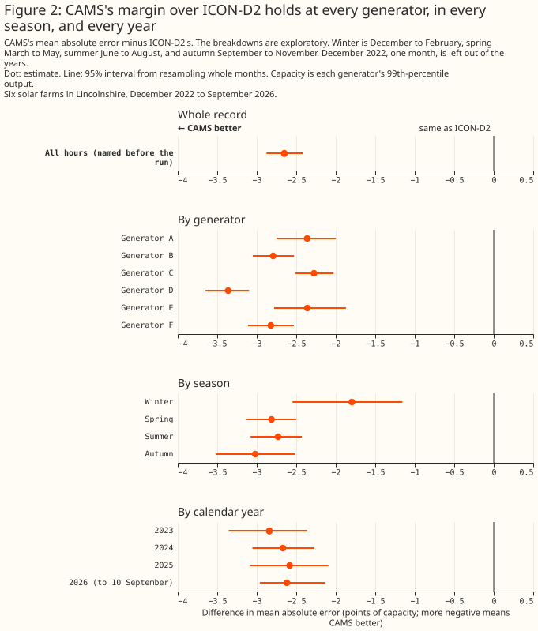
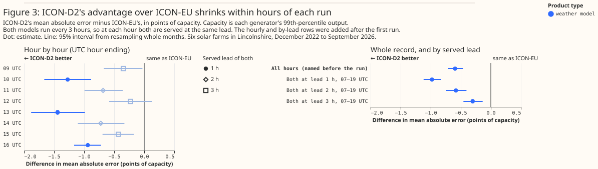
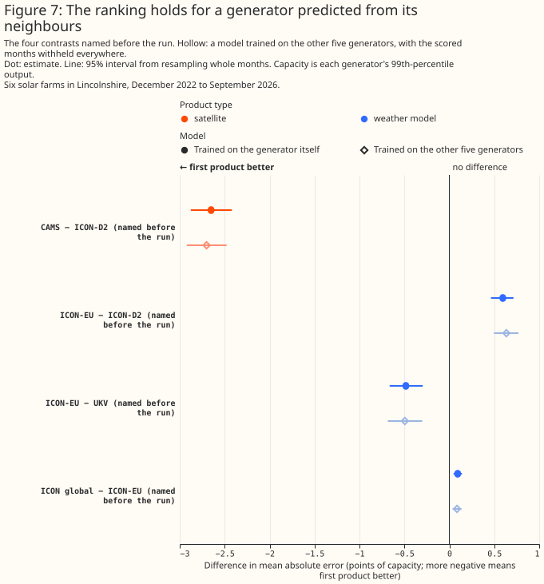

# Which weather product best describes past sunshine?

**At six metered solar farms in Lincolnshire, two satellite retrievals describe past sunshine far
better than any of the weather models or reanalyses tested.** For each of eight weather products, an
XGBoost model, a gradient-boosted tree, was fitted per generator to predict hourly output from that
product's sunshine, and scored by its mean absolute error as a percentage of the generator's
capacity (its 99th percentile of metered output). The error is 5.09% of capacity given the
Copernicus Atmosphere Monitoring Service's satellite retrieval (CAMS), and 5.49% given SARAH-3,
EUMETSAT's satellite retrieval. The error is 7.76% given ICON-D2, the best of the four weather models
tested. It is 8.77% given ICON-DREAM-EU, the German weather service's reanalysis, and 9.08% given
ERA5, the reanalysis from the European Centre for Medium-Range Weather Forecasts (ECMWF). ICON-D2 is
the German weather service's model for Germany and neighbouring countries. A satellite observes the
clouds of the hour itself, where every weather model and reanalysis simulates them, so a large gap is
expected.

**For capacity estimation, training history, and disaggregation the page recommends CAMS where its
one-day delay allows, and for historical features in the live service ICON-EU or rebuilt UKV.**
These four consumers of past weather are parts of this project, described in the
[introduction](#introduction). ICON-EU is the German weather service's European model. Rebuilt UKV
is the Met Office's UK variable-resolution model (UKV) with its hourly value rebuilt from its own
snapshots. The evidence is six metered solar farms inside one 25 km by 23 km box in Lincolnshire,
and 76,727 generator-hours from December 2022 to August 2026. Hours near sunrise where UKV's
archive holds a physically impossible value are left out for every product; see
[Limitations](#limitations). Four more weather models, available from Open-Meteo's archive, are not
yet scored on this page.


**Figure 1's intervals are wide mainly because every product's error rises and falls together from
month to month.** Some months are harder to describe than others for every product, and resampling
whole months carries that shared swing into each product's own interval. The six generators also
share their weather, so each interval rests on 45 months rather than on thousands of independent
hours. Figure 2 pairs two products on the same hours, which cancels the shared swing. Two products
whose intervals overlap in Figure 1, or in the top panel of Figure 2, can therefore still differ by
a margin that is statistically significant at the 5% level. Only a contrast pairing those two
products tests them directly, and the bottom panel of Figure 2 holds the six planned ones.

> **How this page was made.** The research question came from a human. Everything else — the code
> behind every result, the analysis, the figures, and the text — was written by Claude, Anthropic's
> AI model (for this page, Claude Opus 5.5 and Claude Sonnet 5, reusing the data-preparation and
> model-fitting code that Claude Opus 5 wrote for the [beam/diffuse study](beam-diffuse-split.md)).
> Several independent Claude reviewers have checked the method, the evidence, and the prose
> adversarially.

## Key findings

**A difference between two errors is in percentage points of capacity, written "points", and a
bracketed pair after a figure, such as [2.42, 2.90], is its 95% interval.** A weather model's value
"as served" is the value Open-Meteo's archive holds for an hour, which comes from a run of the
weather model that started a few hours earlier.

- **CAMS beats ICON-D2, the best of the weather models tested, by 2.68 points [2.42, 2.90], and the
  gap holds at every generator, in every season, and in each calendar year from 2023 to 2026.** See
  [CAMS describes past sunshine
  best](#cams-describes-past-sunshine-best-of-the-eight-products-tested-by-a-wide-margin).
- **CAMS beats SARAH-3, the second satellite retrieval, by 0.40 points [0.29, 0.50], and by about
  as much under each satellite SARAH-3 has used since 2021.** SARAH-3's error is the second lowest
  at each of the six generators, but CAMS's margin over SARAH-3 varies widely between them, from
  0.03 to 0.64 points. See [SARAH-3 is second to CAMS under every
  satellite](#sarah-3-is-second-to-cams-under-every-satellite).
- **ICON-DREAM-EU, the German weather service's reanalysis, beats ERA5 by 0.32 points [0.12, 0.52],
  but trails all three ICON weather models.** Each product's raw irradiance, compared directly
  against CAMS's with no power model involved, ranks the products almost exactly as the power-model
  contrasts do, so this is not an artefact of the power model. See [ICON-DREAM-EU beats ERA5 but not
  the ICON weather
  models](#icon-dream-eu-beats-era5-but-not-the-icon-weather-models).
- **On matched months, January to August, ERA5 trails CAMS by between 3.6 and 4.7 points in each
  calendar year from 2021 to 2026, and SARAH-3 by between 3.2 and 4.3 points.** See [ERA5's
  deficit, year by year](#era5s-deficit-year-by-year).
- **Among the four weather models tested, ICON-D2 (from the German weather service's Icosahedral
  Nonhydrostatic model family) is the best as served, beating ICON-EU by 0.62 points [0.48, 0.76]
  across the record.** In a breakdown added after the first run, ICON-D2's advantage over ICON-EU
  shrinks from 1.03 points 1 hour into each run to 0.32 points 3 hours in. See [ICON-D2 is the best
  weather model
  tested](#icon-d2-is-the-best-weather-model-tested-and-its-advantage-shrinks-within-hours-of-each-run).
- **ICON-EU is 0.10 points ahead of ICON global, the same service's global model, as served [0.05,
  0.15].** In a split added after the first run, most of that small gap sits in the hours ICON
  global is served further ahead than ICON-EU. See [ICON-EU against ICON global and
  UKV](#icon-eu-against-icon-global-and-ukv).
- **Once UKV's hourly value is rebuilt from its own snapshots, UKV is ahead of ICON-EU, by a margin
  close to the 5% threshold.** Against Open-Meteo's hourly value for UKV, ICON-EU is 0.48 points
  ahead [0.29, 0.65]. Rebuilt as the mean of UKV's snapshots at the start and the end of the hour,
  UKV is 0.21 points ahead of ICON-EU [0.03, 0.38]. An XGBoost model given both snapshots as
  separate inputs puts UKV 0.26 points ahead
  [0.09, 0.43]. Every rebuild of UKV was added after the first run. See [ICON-EU against ICON global
  and UKV](#icon-eu-against-icon-global-and-ukv).
- **Rebuilt UKV also beats ERA5, by 0.90 points [0.72, 1.09], but Open-Meteo's hourly value for UKV
  beats ERA5 only across the whole record, not since August 2024.** See [UKV rebuilt from its
  snapshots beats ERA5](#ukv-rebuilt-from-its-snapshots-beats-era5).
- **A product's own published direct beam improves the XGBoost model by 0.03 to 0.10 points for
  every product except ERA5 and SARAH-3.** SARAH-3's direct beam is not tested, because CM SAF
  models it from SARAH-3's own global irradiance. See [A product's own direct beam adds
  little](#a-products-own-direct-beam-adds-little).
- **An XGBoost model trained on five generators and applied to the sixth ranks the products the
  same way, with errors 0.10 to 0.20 points larger.** See [The ranking holds for a generator
  predicted from its neighbours](#the-ranking-holds-for-a-generator-predicted-from-its-neighbours).
- **Once the seasonal cycle is removed, the implied capacities of CAMS and SARAH-3 are the steadiest
  of the eight products from month to month, but both satellite retrievals swing the most with the
  seasons.** A product's implied capacity is the ratio of metered output to what a fixed
  south-facing panel predicts from the product. See [Implied capacity from month to
  month](#implied-capacity-from-month-to-month).

## Introduction

Several parts of this project read an estimate of weather that has already happened, not a forecast.
This page calls those parts the consumers of past weather, which are parts of the project, not
electricity customers. Capacity estimation infers a generator's size from how its output tracks
sunshine. Training history is the years of past weather that pre-training a forecasting model needs.
Historical features give a forecasting model the weather of hours already past. Disaggregation
separates hidden solar generation from demand at a substation. Each consumer reads one weather
product, and the project has to choose which. This page measures how well eight products describe
past sunshine at six metered solar farms, and says which product each consumer should read.

**The products differ in how far ahead each value was forecast and in what area they cover, as well
as in accuracy, and both properties matter to a consumer.** A weather model run is one of the
forecasts each weather model starts every few hours. How many hours before the hour it describes a
product's value as served was forecast is the served lead. A lead of zero, written T+0, is the run's
analysis: the weather model's best estimate of the weather at the moment the run starts. ICON-D2
does not cover South West England or South Wales, which are inside the licence area of National Grid
Electricity Distribution (NGED), the distribution network operator this project forecasts for.
ICON-D2's western edge runs from about 2°W on the south coast to about 2.5°W in the Midlands.


| Product | What it is | Served lead | Covers all of Great Britain? | Grid spacing, native and as served | Start of the archive read here | Available after |
|---|---|---|---|---|---|---|
| CAMS | Satellite retrieval from Meteosat images | no forecast step | yes | point values, from satellite pixels about 5 km across | 2004 | about 1 day |
| ERA5 | ECMWF reanalysis, a consistent record back to 1940 | 1 to 12 hours | yes | about 31 km | 1940 | about 5 days |
| UKV | Met Office model for the UK | T+0, the analysis | yes | 1.5 km over the UK, coarsening to 4 km at the domain's edges; served at 2 km | March 2022, which Open-Meteo backfilled from a source it does not name until August 2024 | about 4 hours |
| ICON-D2 | German weather service (DWD) model for Germany and neighbouring countries | 1 to 3 hours | no | 2.2 km; served at about 2 km | December 2022 | about 1.5 hours |
| ICON-EU | DWD model for Europe, nested inside ICON global | 1 to 3 hours | yes | 6.5 km; served at about 7 km | November 2022 | about 3.5 hours |
| ICON global | DWD global model | 1 to 6 hours | yes | 13 km; served at about 11 km | November 2022 | about 3.5 hours |
| SARAH-3 | Satellite retrieval from Meteosat images, from EUMETSAT's Satellite Application Facility on Climate Monitoring (CM SAF) | no forecast step | yes | 0.05° grid, about 3.3 km east to west by 5.6 km north to south here; read at the nearest cell | 1983; read here from January 2021 | 2 to 5 days |
| ICON-DREAM-EU | DWD reanalysis over Europe, built from ICON | 1 to 3 hours | yes | about 6.5 km; read at the nearest cell | 2010; read here from September 2019 | not established |

**Most of the latencies come from each service's own documentation:** CAMS's [radiation-service
notes](https://confluence.ecmwf.int/x/jOLjDw), the [ERA5 dataset
page](https://cds.climate.copernicus.eu/datasets/reanalysis-era5-single-levels?tab=overview),
Open-Meteo's [UKV documentation](https://open-meteo.com/en/docs/ukmo-api), and the publication times
of the German weather service's own open-data files for ICON-D2, ICON-EU and ICON global. SARAH-3 is
the Surface Solar Radiation Data Set of the European Organisation for the Exploitation of
Meteorological Satellites (EUMETSAT), available by manual order from CM SAF; its 2-to-5-day figure
is this project's own tracking, cross-referenced in the [disaggregation
roadmap](../roadmap/disaggregation.md#an-irradiance-nowcast-would-be-a-more-useful-product), not a
figure CM SAF itself publishes. ICON-DREAM-EU's publication cadence is not established here.

**Four more weather models are not yet on this page.** ECMWF's 9 km global model, Météo-France's
global model on its European grid, and the HARMONIE-AROME models the Danish and the Dutch weather
services run over Europe are all available from Open-Meteo's archive at each generator's
coordinates, but none is scored here. Two of the four start only in July 2024, so a comparison that
includes them would need its own row set, from September 2024, separate from the one on this page.

## Data and methods

### What each error measures

**Every error on this page is a mean absolute error as a percentage of each generator's own 99th
percentile of output, which the page calls its capacity.** That capacity is a statistic of the
metered output, not the generator's registered or export capacity. Each error is that of an XGBoost
model fitted per generator to predict hourly output from one product, so the figures rank how much
each product's sunshine says about the output once that XGBoost model has been fitted.

### Where each product comes from, and its served lead

**The four weather models come from Open-Meteo's historical-forecast archive, and ERA5 from
Open-Meteo's copy of the Copernicus archive.** `verify_era5_sources.py` checked that copy against
the Copernicus original. CAMS comes from the CAMS radiation service. The start dates for the weather
models are those of Open-Meteo's archive: DWD has run ICON global and ICON-EU since 2015, and
ICON-D2 since February 2021. SARAH-3 comes from CM SAF's own gridded files and ICON-DREAM-EU from
DWD's own gridded files, each read at the grid cell nearest each generator: 0.8 km to 2.8 km away
for SARAH-3, and 1.6 km to 5.0 km for ICON-DREAM-EU. CAMS is computed for each generator's own
coordinates. For the Open-Meteo products, Open-Meteo serves the grid cell nearest the coordinates
requested.

**Neither SARAH-3 nor ICON-DREAM-EU publishes an hourly mean, so each is converted to the mean over
the hour ending at the label, as every other product serves it.**

- **SARAH-3 publishes a snapshot every 30 minutes.** The hour labelled 12:00 is the mean of the
  snapshots stamped 11:00 and 11:30. The satellite scans Great Britain some minutes after each
  snapshot's stamp, so that pair straddles the hour's midpoint more closely than the snapshots
  stamped 11:30 and 12:00. Over the whole record, SARAH-3's hourly values track the sun's height best
  30 to 35 minutes before the label at every generator, as a mean over the hour ending at the label
  should and as CAMS's do; the later pair of snapshots would peak at the label itself.
- **ICON-DREAM-EU publishes the mean since its latest 3-hourly forecast start**, so the value
  labelled 11:00 averages 09:00 to 11:00. Each hour's own mean is recovered by subtracting the
  running mean an hour earlier, weighted by the number of hours each covers. Assuming the wrong
  start hours leaves 8% to 10% of the recovered hourly means below −1 W m⁻², against 0.06% with
  starts at 00, 03, 06 UTC and so on, the hours ICON-DREAM-EU uses. The recovered values track the
  sun best 30 minutes before the label at every generator.

Each served lead comes from how the product's archive is built:

- **ERA5's hourly radiation is not an analysis.** It comes from the reanalysis's own short
  forecasts, started at 06 and 18 UTC, at steps of 1 to 12 hours ([ERA5
  documentation](https://confluence.ecmwf.int/display/CKB/ERA5%3A+data+documentation)).
- **Open-Meteo's weather-model archive keeps, for each hour, the freshest run that covers it.** For
  UKV, which runs every hour, the freshest run is the T+0 analysis. `verify_ukv_lineage.py` matched
  Open-Meteo's served UKV value against the Met Office's own files to within 0.55 W m⁻² at five
  instants either side of the January 2026 upgrade, at one generator's location. The check does not
  reach the backfill before August 2024.
- **For ICON-EU, the freshest run is measured.** `verify_icon_lineage.py` reconstructed each hour
  from 08 to 16 UTC on one day, at one place, from every run the German weather service still
  published. At all nine hours the freshest run reproduced Open-Meteo's served value to within
  1 W m⁻².
- **For ICON-D2 the same check does not confirm the mapping on its own.** The freshest run was the
  closest match at 7 of 9 hours, but still differed by up to 44 W m⁻². That mismatch is between
  Open-Meteo's served value and DWD's own files, so it bears on the archive, not on ICON-D2's
  accuracy. The 3-hour pattern in ICON-D2's own errors, described below, is the stronger evidence.
  The lead analysis below assumes that ICON-D2's archive is built the same way as ICON-EU's, which
  runs on the same 3-hourly cycle.
- **ICON global's lead is inferred from its 6-hourly cycle.** DWD publishes ICON global's open data
  only on the weather model's native icosahedral grid, which `verify_icon_lineage.py` does not read.
- **ICON-DREAM-EU's lead is 1 to 3 hours by construction.** Each value comes from one of the
  reanalysis's own short forecasts, started every 3 hours from an analysis.

### How the comparison was made

**Every product is scored on the same hours, with the same XGBoost model and the same features, so a
difference between two products is a difference between their irradiance alone.**

- **One row set.** An hour is kept only if all eight products cover it, which ends the record at
  the end of August 2026, where ICON-DREAM-EU's download stops. An hour is dropped if either of its
  two half-hours of metered power reads zero, whatever any product says about that hour. Two
  products' own values also decide which hours are scored, and both reject only a missing or
  physically impossible reading rather than an inaccurate one. An hour is dropped where UKV's own
  snapshot at either end of the hour, or at a neighbouring hour, exceeds what the sun's geometry
  allows (see [Limitations](#limitations)). An hour is also dropped where SARAH-3 marks either of
  its two snapshots as unusable, which removes 426 of the 300,960 generator-hours SARAH-3's files
  cover (0.14%), all of them in daylight. CAMS is read in full, not only on the hours it
  rates as reliable.
- **One treatment of UKV's change of source.** Open-Meteo's UKV archive before 12 August 2024 is a
  backfill from a source Open-Meteo does not name. Every product's comparison with ERA5 is also
  reported on the hours since that date, and no XGBoost model is told which side of the date an
  hour falls.
- **One XGBoost model per generator.** A gradient-boosted tree (XGBoost) is fitted per generator on
  one product's global horizontal irradiance plus sun position, season, time of day, and ERA5's air
  temperature. Every XGBoost model is given the same temperature.
- **Folds that respect an upgrade.** Each XGBoost model is trained on some blocks of whole months
  and scored on the others, which it has never seen; each held-out block is called a fold. The Met
  Office's PS47 upgrade of UKV went live on 21 January 2026. The record is cut into five folds
  separately before and after that date, so every fold is scored by an XGBoost model trained on both
  versions. Every XGBoost model is also told which side of the date an hour falls. The 11 days from
  21 to 31 January are dropped, because the folds are cut by whole month and January counts as a
  pre-upgrade month.
- **One normalisation.** Each hour's error is divided by its own generator's capacity before any
  mean or difference.
- **Intervals from whole months.** The six generators share their weather, so each 95% interval
  comes from resampling whole calendar months 2,000 times, each time also drawing one of three
  XGBoost fits that differ only in their random seed. This page calls a difference statistically
  significant at the 5% level when its 95% interval from resampling whole months lies wholly on one
  side of zero, and not statistically significant at the 5% level when the interval includes zero.
  The test covers month-to-month variation in the weather and the fitting seed only, not variation
  between generators. The intervals are not corrected for the number of comparisons, so among the
  many exploratory rows some will reach significance by chance.
- **Six planned contrasts on this page, and a seventh not yet scored.** A contrast is the
  difference between two products' errors on the same hours. A comparison is planned when it was
  written into the study plan before any result existed; every other figure is exploratory, chosen
  or added after results were seen. The distinction matters because with many comparisons, about 1
  in 20 exploratory rows reaches significance at the 5% level by chance, so an exploratory result is
  a lead to follow up rather than a finding. A chart holding both kinds marks each planned row
  "(planned)". A chart whose rows are all one kind says so once, in its subtitle. The ranking rests
  on four planned contrasts: CAMS against ICON-D2, ICON-EU against ICON-D2, ICON-EU against UKV,
  and ICON global against ICON-EU. Two more were written before SARAH-3 and ICON-DREAM-EU were
  scored: SARAH-3 against CAMS, and ICON-DREAM-EU against ERA5. Each planned contrast is also
  refitted with a second set of XGBoost settings, and every one keeps its sign and its statistical
  significance at the 5% level. A seventh, ECMWF's 9 km global model against ICON-EU, was also
  written into the plan but is not yet scored: see [Limitations](#limitations). Every other figure
  on this page is exploratory. The UKV snapshot rebuilds, the hour-by-hour and by-lead breakdowns,
  and the split of ICON global by lead were added after the first run.
- **A longer record for two questions.** The year-by-year comparison with ERA5 and SARAH-3's
  comparison by satellite use a second row set, built the same way from the four products whose
  records reach back to January 2021: ERA5, CAMS, SARAH-3, and ICON-DREAM-EU. That row set holds
  115,594 generator-hours from January 2021 to August 2026. Every other figure on this page uses the
  eight-product row set.

**The folds are cut by `studies.cross_validation` and the intervals computed by `studies.bootstrap`,
both covered by tests.**

## Results

### The XGBoost models work

**Given CAMS, the XGBoost model tracks measured power closely at every generator, in a clear, a
variable, and a dull week.** Given ERA5, the XGBoost model still follows the shape of each day, but
runs further from the measured line, most visibly in the dullest week. Figure 4 plots both XGBoost
models' out-of-fold predictions against measured power, each prediction held to the export cap as
every score on this page is.

**The three weeks are chosen by a rule that reads measured power alone, so the choice cannot favour
CAMS or ERA5.** The rule pools the six generators and considers only April to September, so that a
short midwinter day cannot dominate the choice. The clearest week is the one in which the
generators produced the most output relative to their own capacity, and the dullest week the one in
which they produced the least. The most variable week is the one whose daily output swings the most
from day to day. The clearest week and the most variable week both fell in May 2026, and the
dullest week in July 2025.

**Figure 4 shows each week as days 1 to 7, with no calendar dates, because a dated hourly series
would identify the solar farm.** With only 6 solar farms in the study, a generator's hourly
output on known dates could be matched against publicly available generation data. That match
would undo the anonymisation that names the generators only as Generator A to F. The page
therefore gives each week's month and year in the text and no finer date.


**CAMS has the lowest error at each of the six generators, SARAH-3 the second lowest, and ICON-D2
the third.** Figure 5 plots every product's mean absolute error at each generator separately, one
dot per product per generator. The other five products reorder between generators: at two
generators, for instance, Open-Meteo's hourly UKV scores worse than ERA5. The lead of CAMS, then
SARAH-3, then ICON-D2, described in [CAMS describes past sunshine
best](#cams-describes-past-sunshine-best-of-the-eight-products-tested-by-a-wide-margin), therefore
holds generator by generator, rather than resting on a pooled average that one generator could
dominate.


### CAMS describes past sunshine best of the eight products tested, by a wide margin

**CAMS beats the best of the weather models tested by 2.68 points [2.42, 2.90], and the gap holds
at every generator, in every season, and in each calendar year from 2023 to 2026.**

| Product | Mean absolute error, % of capacity |
|---|---|
| CAMS | 5.09 |
| SARAH-3 | 5.49 |
| ICON-D2 | 7.76 |
| UKV given its two snapshots as separate inputs (added after the first run) | 8.13 |
| UKV rebuilt as the mean of its two snapshots (added after the first run) | 8.18 |
| ICON-EU | 8.39 |
| ICON global | 8.48 |
| ICON-DREAM-EU | 8.77 |
| UKV, Open-Meteo's hourly value | 8.86 |
| ERA5 | 9.08 |

Across the six generators, CAMS's margin over ICON-D2 ranges from 2.29 to 3.41 points. By season it
ranges from 1.81 points in winter to 3.07 in autumn, and in each calendar year from 2023 to 2026
(2026 to August) it lies between 2.62 and 2.87.



**ERA5 has the largest error of the eight products, and [Why ERA5 describes past sunshine and wind
worse than most current weather
products](../roadmap/data-sources.md#why-era5-describes-past-sunshine-and-wind-worse-than-most-current-weather-products)
sets out ERA5's documented weaknesses.**

**The gap is not an artefact of lead or of reading CAMS in full.** On the hours ICON-D2 is served 1
hour after its run started, CAMS still beats it by 2.24 points [1.99, 2.45]. Reading CAMS in full is
the conservative choice: on the 69,573 hours CAMS rates as reliable, CAMS's margin over ERA5 widens
from 4.00 to 4.40 points.

### SARAH-3 is second to CAMS under every satellite

**CAMS beats SARAH-3 by 0.40 points [0.29, 0.50], one of the six planned contrasts, and by about as
much under each satellite SARAH-3 has used since 2021.** With the second set of XGBoost settings,
CAMS is 0.42 points ahead [0.32, 0.52]. For a generator predicted from its neighbours, CAMS is 0.45
points ahead [0.34, 0.54]. For XGBoost models trained on the 7 months since UKV's upgrade alone,
CAMS is 0.29 points ahead [0.02, 0.53], an interval that rests on 7 months and is likely too narrow.

**SARAH-3 trails CAMS by about 0.4 points in every period since 2021.** SARAH-3's retrieval over
Europe moved from Meteosat-11 to Meteosat-10 on 21 March 2023, and Meteosat-9 stood in for a
fortnight, 17 to 31 January 2022. On the longer row set from January 2021, in comparisons chosen
after SARAH-3's first results, CAMS is ahead by:

| Satellite behind SARAH-3 | CAMS's margin over SARAH-3 (points) |
|---|---|
| Meteosat-11, 2021 | 0.40 [0.20, 0.60] |
| Meteosat-11, February 2022 to 20 March 2023 | 0.50 [0.32, 0.68] |
| Meteosat-10, from 21 March 2023 | 0.41 [0.32, 0.50] |

January 2022, the month holding the fortnight from Meteosat-9, is one month and too short for an
interval: CAMS is 0.42 points ahead in that month. No XGBoost model is told which satellite an hour
comes from. CAMS also works from Meteosat's images, so a change of satellite reaches both products,
and each span above is also a different stretch of years. The table therefore shows that SARAH-3's
deficit did not change across the switches, not how SARAH-3 alone responds to a satellite. A few
days in each span came from another satellite: SARAH-3's own `platform` attribute shows Meteosat-9
standing in for 19 to 20 December 2021, inside the "Meteosat-11, 2021" span, and Meteosat-11
standing in for a few days in 2024, 2025 and 2026, inside the "Meteosat-10" span.


**Why CAMS beats SARAH-3 is not identified, but the gap sits in cloudy hours and at four of the six
generators.** CAMS is computed for each generator's own coordinates. SARAH-3 is read from a 0.05°
grid cell 0.8 km to 2.8 km from each generator. Across the generators CAMS's margin ranges from 0.03
to 0.64 points, and at two of them it is not statistically significant at the 5% level. Relative to
CAMS's own error, SARAH-3's is about 10% larger in broken cloud and 4% to 8% larger in overcast and
clear hours, binned on a clearness index neither product decides, in comparisons chosen after the
results were seen. That pattern points at how each
product handles cloud within the hour: CAMS's hourly value is the service's own integration over the
hour, and SARAH-3's is the mean of two snapshots. The gap does not follow the distance to SARAH-3's
grid cell: the generator whose cell is nearest, 0.8 km away, has the largest gap. A steady bias could
not explain the gap either, because the XGBoost model fitted to each generator corrects one.

**SARAH-3's direct beam is modelled from its own global irradiance, so this page scores SARAH-3's
global irradiance alone.** CM SAF derives SARAH-3's direct irradiance from its global irradiance
with a model of the diffuse fraction. SARAH-3's published direct fraction varies about as little,
for a given sky clearness and sun angle, as the output of a separation model applied to the global
irradiance would: its median spread is 0.041, below the threshold of 0.05 that
`studies.served_column_checks` applies. An XGBoost model given that direct beam would measure the
diffuse-fraction model rather than the satellite.

### ICON-DREAM-EU beats ERA5 but not the ICON weather models

**ICON-DREAM-EU beats ERA5 by 0.32 points [0.12, 0.52], one of the six planned contrasts, but its
error of 8.77% is higher than that of each of the three ICON weather models.** The two reanalyses,
like SARAH-3, a satellite climate data record, are built to be consistent over time, each with one
fixed version of its weather model or retrieval, though the observations and satellites each uses
change over time. With the second set of XGBoost settings, ICON-DREAM-EU is 0.33
points ahead of ERA5 [0.14, 0.52], and for a generator predicted from its neighbours 0.37 points
ahead [0.17, 0.58]. Only 4 of the 5 folds agree in sign. On the longer row set from January 2021,
ICON-DREAM-EU is 0.39 points ahead [0.23, 0.54].

**Since August 2024, ICON-DREAM-EU's advantage over ERA5 is not statistically significant at the 5%
level, but every product's lead over ERA5 is smaller in 2025 and in 2026.** ICON-DREAM-EU is 0.16
points ahead on those hours [−0.09, +0.38], and 0.23 points ahead after UKV's upgrade [−0.22,
+0.57], on 7 months. In the same years CAMS's lead over ERA5 falls from 4.35 points in 2024 to 3.69
in 2026, and ICON-EU's from 0.88 to 0.47, while ICON-DREAM-EU's gap to ICON-EU shows no trend across
those years. The smaller advantage over ERA5 is therefore not evidence that ICON-DREAM-EU got worse;
every product's lead over ERA5 narrows together. All of these comparisons are exploratory.

**ICON-DREAM-EU and ERA5 are served at different leads, but ICON-DREAM-EU and ICON-EU can be
compared at equal leads, because both run on the same 3-hourly cycle.** ICON-DREAM-EU's radiation
comes from its own forecasts 1 to 3 hours after each 3-hourly analysis, and ERA5's from forecasts 1
to 12 hours after 06 and 18 UTC. Equal leads would favour ERA5 relative to what is measured here.
ICON-DREAM-EU trails ICON-D2 by 1.00 points in point estimate, a pairing this page does not test.
ICON-DREAM-EU trails ICON-EU by 0.38 points at equal leads, in an exploratory comparison. The gap is
0.34 points [0.20, 0.47] on hours 1 hour into a run, where no de-averaging is needed, so the
conversion to hourly means is not the main cause. The gap is 0.49 points [0.34, 0.63] at 2 hours and
0.39 points [0.25, 0.54] at 3 hours.

**Before any power model sees it, the raw irradiance already ranks the products almost exactly as
the power-model contrasts above do, which is why ICON-DREAM-EU's modest lead over ERA5 is not an
artefact of the power model.** Each product's own served global irradiance, compared row for row
against CAMS's on the 76,727 daylight generator-hours every product on this page shares — no
XGBoost model, no per-generator recalibration — orders the products almost exactly as the
mean-absolute-error table above does: SARAH-3 closest to CAMS, then ICON-D2, ICON-EU, ICON global,
ICON-DREAM-EU, ERA5, with UKV's raw hourly value the furthest from CAMS. Correlation with measured
output, which does not use CAMS as the reference, gives the same order. The one swap is UKV and
ERA5: UKV's raw hourly value is the furthest from CAMS by every raw measure here, but its
power-model error is lower than ERA5's. Open-Meteo builds UKV's hourly value from the snapshot at
the hour's end, a timing error that depends on the sun's position, and a per-generator XGBoost model
given the sun's position can partly undo that error, which a raw comparison cannot. Rebuilt as the
mean of its two snapshots, UKV's correlation with CAMS rises from 0.889 to 0.912. UKV also reads
about 40 W/m² below CAMS in either form, a steady bias that each per-generator XGBoost model
removes. This comparison is exploratory.

| Product | Bias vs CAMS (W/m²) | MAD vs CAMS (W/m²) | Correlation with CAMS | Correlation with output |
|---|---|---|---|---|
| CAMS | — | — | — | 0.933 |
| SARAH-3 | +9.67 | 32.53 | 0.977 | 0.928 |
| ICON-D2 | −5.32 | 52.46 | 0.935 | 0.889 |
| ICON-EU | −9.27 | 58.38 | 0.921 | 0.875 |
| ICON global | −6.68 | 59.01 | 0.919 | 0.873 |
| ICON-DREAM-EU | −8.47 | 60.57 | 0.915 | 0.868 |
| UKV | −44.46 | 77.21 | 0.889 | 0.846 |
| UKV rebuilt from its snapshots | −40.11 | 68.53 | 0.912 | 0.867 |
| ERA5 | −1.28 | 63.27 | 0.904 | 0.857 |

Correlation with output is the mean of each generator's own Pearson correlation between the
product's raw global irradiance and its measured output as a fraction of capacity. ICON-DREAM-EU's
mean absolute difference from CAMS is 2.70 W/m² smaller than ERA5's [−4.36, −0.87], ICON-EU's is
0.63 W/m² smaller than ICON global's [−0.93, −0.33], and ICON global's is 1.56 W/m² smaller than
ICON-DREAM-EU's [−2.56, −0.59], each resampling whole months.

### ERA5's deficit, year by year

**On matched months, January to August, ERA5 trails both satellite retrievals by more than 3 points
in every calendar year from 2021 to 2026, and ICON-DREAM-EU by up to about 0.7 points.** Every
figure in this section is exploratory, on the longer row set from January 2021, and each year's
interval comes from resampling that year's own January-to-August months alone; restricting every
year to the same months keeps a partial 2026 from being compared against the other years' full
twelve. Each year's interval rests on 8 months, so the intervals are likely too narrow. ERA5 trails
CAMS by between 3.62 points (2026) and 4.74 points (2021). ERA5 trails SARAH-3
by between 3.21 points (2026) and 4.31 points (2021). ERA5 trails ICON-DREAM-EU by about half a
point to 0.68 points in each year from 2021 to 2024, a gap that is statistically significant at the
5% level in each of those years, and by 0.21 points in 2025 and 0.18 points in 2026, where the gap
is not statistically significant at the 5% level.

**No year's gap between ERA5 and ICON-DREAM-EU differs from 2025's by a margin statistically
significant at the 5% level, and 2026's gaps are also smaller because 2026 is an easier year for
every product.** Resampling each year's months independently of 2025's, the change from each of
2021 to 2024 to 2025 is −0.26 to −0.36 points, and every interval includes zero, so a reader should
not conclude that ICON-DREAM-EU's gap to ERA5 has genuinely narrowed rather than moved within the
noise. In 2026 every product's error is lower than in 2025, so a gap measured in points is smaller
too, whether or not the products' relative ranking has moved.


### ICON-D2 is the best weather model tested, and its advantage shrinks within hours of each run

**ICON-D2 beats ICON-EU across the record by 0.62 points [0.48, 0.76], by 1.03 points [0.87, 1.18]
in the first hour after each run, and by only 0.32 points [0.16, 0.48] in the third hour.** ICON-D2
and ICON-EU run on the same 3-hourly cycle, so at any given hour both are served at the same lead.

| Hour (UTC) | 09 | 10 | 11 | 12 | 13 | 14 | 15 | 16 |
|---|---|---|---|---|---|---|---|---|
| Served lead of both | 3 h | 1 h | 2 h | 3 h | 1 h | 2 h | 3 h | 1 h |
| ICON-D2 − ICON-EU (points) | −0.40 | −1.38 | −0.60 | −0.20 | −1.48 | −0.76 | −0.47 | −0.97 |

The table shows hours 09 to 16 UTC. Each hour is labelled by its end, so 12 UTC is the mean from
11:00 to 12:00. The by-lead figures above average over 07 to 19 UTC. At those two edge hours, with
the sun low, the pattern weakens: 1 hour into a run, ICON-D2's advantage is only 0.35 points at
07 UTC and 0.06 points at 19 UTC.



**The time of day does not explain the pattern around noon.** The hours 12 and 13 UTC sit on either
side of solar noon, yet ICON-D2's advantage is 0.20 points at 12 UTC, 3 hours into a run, against
1.48 points at 13 UTC, 1 hour in. ICON-EU shows no such pattern with lead. Against UKV rebuilt from
its snapshots, which is always served at T+0, ICON-EU is 0.20 to 0.24 points behind at every lead
from 1 to 3 hours into its runs, in a comparison added after the first run.

**The mechanism is not identified, and the rate of decay may not hold elsewhere.** ICON-D2 takes the
weather at its boundaries from ICON-EU. The six generators sit about 160 to 200 km east of ICON-D2's
western boundary, so air arriving on a westerly wind may carry ICON-EU's weather to them within
hours. Another candidate is ICON-D2's own data assimilation: an advantage built into each run's
starting state would be expected to decay over the run's first hours. By a 3-hour lead only 0.32
points of the advantage remain, so the as-served advantage should not be assumed to hold a day
ahead. The comparison at longer leads belongs to
[#810](https://github.com/openclimatefix/nged-substation-forecast/issues/810), the study comparing
weather models for UK power forecasting.

### ICON-EU against ICON global and UKV

**Most of ICON global's 0.10-point deficit to ICON-EU sits in the hours ICON global is served
further ahead.** ICON global runs every 6 hours, so half its hours are served 4 to 6 hours after the
run started, where ICON-EU is at 1 to 3 hours. On those hours ICON global is 0.19 points behind
[0.09, 0.30]. On the hours where the two leads are equal ICON global is 0.02 points behind [−0.03,
+0.08]. So the effect of the coarser grid is not statistically significant at the 5% level, though
an effect as large as 0.08 points is not excluded. The split also divides the hours of the day: the
longer leads fall at 10 to 12 and 16 to 18 UTC, so a difference in either weather model's skill by
time of day would show up here as an effect of lead.

**ICON-EU beats Open-Meteo's hourly value for UKV by 0.48 points [0.29, 0.65], one of the six
planned contrasts, but UKV is ahead of ICON-EU, by a margin close to the 5% threshold, once UKV's
hour is rebuilt from its own snapshots.** Each ICON product's archived value for an hour is a mean
over that hour. UKV publishes a snapshot each hour, and Open-Meteo builds UKV's hourly value from
the snapshot at the hour's end, rescaled by the change in the sun's angle. In comparisons added
after the first run, averaging UKV's snapshots at both ends of the hour cuts UKV's error by 0.68
points, which puts UKV 0.21 points ahead of ICON-EU [0.03, 0.38]. The interval's lower end, 0.03
points, is about the size of the change that refitting on a slightly different set of hours makes
to every product's error, so this result should not be read as settled. An XGBoost model given the
two snapshots as separate inputs puts UKV 0.26 points ahead of ICON-EU [0.09, 0.43].

**Giving each XGBoost model the neighbouring hours improves both products by about 0.2 points, and
leaves rebuilt UKV about as far ahead of ICON-EU.** An XGBoost model given ICON-EU's hourly mean for
the hour before and after, as well as the hour itself, improves by 0.18 points. The same context
improves UKV's rebuilt hour by 0.19 points. With context on both, ICON-EU is 0.23 points behind
rebuilt UKV [0.05, 0.39], and since August 2024 0.26 points behind [0.02, 0.50]. With context,
ICON-EU is 0.09 points behind UKV's two snapshots given as separate inputs [−0.08, +0.25], a
difference that is not statistically significant at the 5% level.

**Every rebuilt UKV construction scores ahead of ICON-EU across the record, and UKV is also served
at the shorter lead.** UKV is served at T+0 and ICON-EU 1 to 3 hours ahead, so equal leads would if
anything favour ICON-EU. On the 7 months after UKV's upgrade alone, ICON-EU is 0.15 points behind
rebuilt UKV in point estimate [−0.23, +0.57], with only 2 of 5 folds agreeing in sign. That interval
rests on 7 months and is likely too narrow.


### UKV rebuilt from its snapshots beats ERA5

**UKV rebuilt from its snapshots beats ERA5 in every period tested, but Open-Meteo's hourly value
for UKV beats ERA5 only across the whole record.** In comparisons added after the first run, UKV
rebuilt as the mean of its two snapshots beats ERA5 by 0.90 points [0.72, 1.09] across the record,
by 0.79 points [0.57, 1.00] since Open-Meteo's own UKV downloader started in August 2024, and by
0.62 points [0.45, 0.75] after the January 2026 upgrade. The post-upgrade interval rests on 7
months and is likely too narrow, though all 5 folds agree in sign.

**Open-Meteo's hourly value for UKV is 0.22 points ahead of ERA5 across the record [0.06, 0.39], and
0.14 points ahead since August 2024 [−0.04, +0.35].** After the upgrade neither fit finds a
difference that is statistically significant at the 5% level. XGBoost models trained on the whole
record, both sides of the upgrade, score Open-Meteo's hourly UKV 0.06 points worse than ERA5 on the
post-upgrade months [−0.08, +0.24]. XGBoost models trained on the post-upgrade months alone score
the two within 0.01 points of each other [−0.16, +0.14]. Both post-upgrade intervals rest on 7
months and are likely too narrow. No XGBoost model for rebuilt UKV was trained on the post-upgrade
months alone.

**Every UKV contrast with ERA5 mixes the products with their leads.** UKV is served at T+0 and ERA5
at 1 to 12 hours, and equalising the leads could narrow the gap.


### A product's own direct beam adds little

**For every product tested except ERA5, an XGBoost model given the product's own published direct
beam, instead of a separation model's estimate from the product's own total, improves by 0.03 to
0.10 points.** The separation model is the [Erbs et al.
(1982)](https://doi.org/10.1016/0038-092X(82)90302-4) correlation, applied to each product's own
global irradiance. CAMS improves by 0.08 points and UKV by 0.10. The three ICON weather models and
ICON-DREAM-EU improve by 0.03 to 0.05 points each. ERA5's effect is not statistically significant at
the 5% level. Every effect is smaller than each planned contrast except ICON global against ICON-EU,
which is about as large as UKV's. For CAMS and ERA5 the own-beam effects agree with [the
beam/diffuse study](beam-diffuse-split.md), which tested whether the published beam carries
information or merely encodes the total differently. SARAH-3 is not tested, because its direct beam
is modelled from its own global irradiance, as described under [SARAH-3 is second to CAMS under
every satellite](#sarah-3-is-second-to-cams-under-every-satellite). ICON-DREAM-EU's own-beam gain of
0.034 points [0.010, 0.059] disappears on the record panel's longer row set, where it is −0.005
points [−0.027, +0.018], so this result should not be read as settled.


### The ranking holds for a generator predicted from its neighbours

**An XGBoost model trained on five generators and applied to the sixth ranks the products the same
way, with errors 0.10 to 0.20 points larger.** Each held-out generator is predicted by an XGBoost
model that never saw that generator and never saw the held-out months at any generator. The
neighbours share their weather. An XGBoost model trained on the held-out months at the other
generators would already have seen how each of those days turned out, and would overstate how well
an XGBoost model carries over to a generator it has never seen. The prediction is converted back to
megawatts with the generator's own capacity, so this neighbour test assumes the capacity is known
and says nothing about capacity estimation itself. The training generators all sit within 34 km of
the held-out generator. The increase in error is therefore likely smaller here than for a generator
further from its neighbours, which this page does not measure. For disaggregation, the result
supports the ranking but not the size of the error.



### Implied capacity from month to month

**Once the seasonal cycle is removed, the implied capacities of CAMS and SARAH-3 are the steadiest
of the eight products from month to month, but both satellite retrievals swing the most with the
seasons.** A month's implied capacity is the ratio of metered output to what a fixed south-facing
panel at 30° tilt predicts per megawatt from each product, over the hours with the sun above 10°
and no curtailment cap. With each calendar month's average removed, CAMS's month-to-month spread is
6.5% and SARAH-3's 6.6%, a difference that is not statistically significant at the 5% level. The
other six products spread by 8.0% to 9.8%, and for each of them the difference from CAMS's spread
is statistically significant at the 5% level. CAMS, however, implies a capacity 7%, 23%, and 10%
below its annual mean in November, December, and January, and SARAH-3 one 4%, 15%, and 7% below.
No other product strays more than 11.1% from its annual mean in any of those three months.
December's figure rests on four Decembers, 22 generator-months at generators that share their
weather, and Figure 14 draws no interval.

**This study cannot say which product is right about December.** December's sun stays low all day,
which is where a satellite retrieval and this page's assumed panel geometry are both at their least
reliable. The two satellite retrievals dip in the same months, by different amounts. The swing may
therefore come from the retrieval or from the assumption that every panel faces south at 30° tilt,
which this page does not verify. Removing the seasonal cycle also needs several years of each
calendar month, which a capacity estimator run on a short window does not have.


## What to use

**These recommendations rest on six generators in one part of Lincolnshire, and weigh accuracy
against availability and coverage.**

- **Capacity estimation: provisionally CAMS, fitted over at least a year of history or with November
  to January left out.** Every accuracy figure on this page comes from an XGBoost model fitted to
  each generator's own metered output, and that fit absorbs any steady bias in a product. Capacity
  estimation cannot make that correction, so the evidence for capacity estimation is the
  implied-capacity measure alone. That measure assumes every panel faces south at 30° tilt, and the
  November-to-January rule was chosen after seeing Figure 14. SARAH-3's implied capacity swings less
  with the seasons than CAMS's, but this page cannot say which of the two is right about December.
  The implied-capacity measure is not the project's capacity estimator. Running that estimator with
  each product over rolling windows, and scoring it against known capacity, would test this
  recommendation directly.
- **Training history: CAMS, with a caveat.** CAMS gives the most accurate description of past
  sunshine of the eight products, and SARAH-3, 0.40 points behind, the second most accurate. A
  forecasting model pre-trained on CAMS and then run on a weather forecast meets a different product
  at inference. This page does not measure how much that mismatch changes forecast accuracy.
  ICON-DREAM-EU beats ERA5 as a reanalysis, but by less than any of the three ICON weather models
  does.
- **Historical features in the live service: ICON-EU, or UKV with its two snapshots averaged; with
  either product, include the neighbouring hours.** CAMS arrives a day late and ERA5 about 5 days
  late, so neither can supply the last few hours at run time. ICON-D2 was more accurate at the six
  generators, all of which sit inside its domain. Reading ICON-D2 at generators east of ICON-D2's
  western edge, and ICON-EU elsewhere, is therefore an option, though a forecasting model trained on
  the result would mix two products across generators. Open-Meteo's UKV archive has three stretches:
  a backfill from a source Open-Meteo does not name until August 2024, Open-Meteo's own download of
  the Met Office's files until the January 2026 upgrade, and the upgraded weather model since. A
  forecasting model trained on the whole UKV archive therefore mixes all three. Every figure here
  scores the archive's freshest run for each hour. At run time the most recent hours are not yet in
  the archive in that form: UKV arrives about 4 hours and ICON-EU about 3.5 hours after each run
  starts, so the last few hours come from an older run, at a longer lead than any scored here.
- **Disaggregation: CAMS where its one-day delay allows, otherwise ICON-EU or rebuilt UKV.** The
  ranking holds for a generator predicted from its neighbours.

**Giving an XGBoost model CAMS, ERA5, UKV, ICON-D2, ICON-EU, and ICON global at once beats giving it
CAMS alone, with CAMS's
neighbouring hours and its split of sunlight into direct beam and diffuse light, by 0.13 points
[0.10, 0.17], a post hoc comparison written up in [Does blending weather products beat the best
single weather product?](blending-weather-products.md#solar-a-blend-beats-cams-given-its-neighbouring-hours)**

## Limitations

- **Hours where UKV's archive holds a physically impossible sunrise value are dropped for every
  product.** Open-Meteo stores UKV's hourly value rounded to 1 W m⁻² and serves each snapshot by
  undoing the rescaling for the sun's angle described under [ICON-EU against ICON global and
  UKV](#icon-eu-against-icon-global-and-ukv). In the first hours after sunrise that rescaling ratio
  can reach the hundreds, so undoing it turns the stored mean, and its rounding, into a value with
  no physical meaning — up to 16,537 W m⁻² against a real GHI ceiling of about 1,400 W m⁻². The
  study drops each snapshot that exceeds 1.1 times the top-of-atmosphere flux at its own instant,
  1,554 of 238,320 hourly snapshots from March 2022 to September 2026, together with every hour
  built from one. Every dropped hour falls between 05:00 and 10:00 UTC, and almost all of them
  predate UKV's January 2026 upgrade — 2.8% of pre-upgrade hours against 0.1% after it, and none
  from April 2026 onwards. Because every product is scored on one shared row set, dropping these
  snapshots removes 1,768 generator-hours (2.3%) from every product's figures on this page, not
  only UKV's, leaving 76,727 common rows. Two smaller defects in UKV's archive are not corrected
  here: at 318 raw hours (186 of the 76,727 scored rows) UKV's beam exceeds its global irradiance,
  which is physically impossible and bears on the own-beam figure above, and UKV's wind file has a
  94-hour gap, which does not bear on this page.
- **The evidence is regional.** All six generators sit in one 25 km by 23 km box, inside ICON-D2's
  domain, about 160 to 200 km east of its western edge, and in only two ERA5 grid cells. The ranking
  is untested elsewhere in Great Britain, and nothing here measures a site near ICON-D2's edge or
  outside its domain. Wind is measured separately on [Which weather product best describes past
  wind?](weather-products-for-past-wind.md).
- **The intervals describe these six generators only.** The intervals resample months, not
  generators, so they say nothing about how a generator elsewhere would rank the products.
- **Every product except CAMS is read at a grid cell, not at the generator.** ERA5 at its nearest
  0.25° cell, the Open-Meteo weather models at the cell Open-Meteo serves, SARAH-3 at a cell 0.8 km
  to 2.8 km away, and ICON-DREAM-EU at a cell 1.6 km to 5.0 km away. A cell that misses a
  generator's own clouds handicaps the product read from it.
- **Four weather models are not yet scored.** ECMWF's 9 km global model, Météo-France's ARPEGE on
  its European grid, and the Danish and Dutch HARMONIE-AROME models are not on this page, and the
  ranking says nothing about them.
- **The comparison is not lead-equal.** The served lead is part of what a consumer receives, so the
  as-served ranking answers the consumer's question. A comparison at a held-equal lead is a forecast
  comparison, and belongs to
  [#810](https://github.com/openclimatefix/nged-substation-forecast/issues/810), the study comparing
  weather models for UK power forecasting.
- **Every accuracy figure is recalibrated per generator.** A product with a large but stable bias
  scores well here. The implied-capacity measure is the only evidence on this page about each
  product's uncorrected bias.
- **The figures rest on the capacity table as rebuilt in September 2026.** Each generator's capacity
  is its 99th percentile of output from the `effective_capacity` table.
  [#825](https://github.com/openclimatefix/nged-substation-forecast/issues/825), which refreshes the
  beam/diffuse study's figures on the current power and capacity tables, may move the absolute
  figures and the size of every contrast, because each generator's errors are divided by its own
  capacity. A change to the capacities alone cannot flip the sign of a contrast that agrees at all
  six generators, such as CAMS against ICON-D2, but a change to the power table can move any figure.

## Reproducing the figures

Cut SARAH-3 and ICON-DREAM-EU at each generator, check every product's timestamps against the sun,
build every product's dataset, then run the study:

```bash
uv run --with netcdf4 python studies/beam_diffuse_split/extract_site_series.py --product sarah-3
uv run python studies/beam_diffuse_split/extract_site_series.py --product icon-dream-eu
uv run python studies/beam_diffuse_split/check_new_products.py --sources sarah-3 icon-dream-eu
for source in open-meteo ukv icon-d2 icon-eu icon-global cams sarah-3 icon-dream-eu; do
  uv run python studies/beam_diffuse_split/build_dataset.py --source $source
done
uv run python studies/beam_diffuse_split/build_dataset.py --source cams \
  --min-cams-reliability 0 --suffix _allhours
uv run python studies/beam_diffuse_split/weather_products.py --panel long record
```

The eight-product report lands in
`data/studies/beam_diffuse_split/past_weather_v2/solar_long/report.md`, and the longer record's in
`solar_record/report.md` beside it, with each panel's year-by-year table in `era5_by_year.parquet`.
`weather_products.py --report-only` rebuilds a report from the saved losses without refitting, and
neither mode overwrites an existing file. `--concurrent-fits` lowers how many XGBoost models are
fitted at once. The report
also prints the distances between the generators and to ICON-D2's edge, the ERA5 cells they fall in,
and every number the charts share with it. The charts come from `uv run python
studies/beam_diffuse_split/weather_product_charts.py`, which computes the numbers the report does
not print, the leaderboard's intervals and Figures 4 and 5, from the saved losses without refitting
any XGBoost model. `check_new_products.py` writes the timing and direct-beam checks on SARAH-3 and
ICON-DREAM-EU to `past_weather_v2/product_checks.md`. The served-lead check runs with `uv run
--with cfgrib python studies/beam_diffuse_split/verify_icon_lineage.py --model icon-eu`, against the
runs the German weather service still publishes, which cover about one day.
