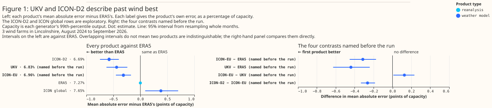

# Which weather product best describes past wind?

This page is the wind counterpart of [Which weather product best describes past
sunshine?](weather-products-for-past-solar.md). Several parts of this project read an estimate of
weather that has already happened: capacity estimation, training history, historical features in the
live service, and disaggregation. The solar page describes each of these consumers of past weather,
which are parts of the project, not electricity customers. Two of the four can use a result about
wind: training history, the years of past weather that pre-training a forecasting model needs, and
historical features, which give the live forecasting model the weather of hours already past. This
page measures how well five weather products describe past hub-height wind at the three metered wind
farms in the trial area, and says which product those two consumers should read.

**Every error on this page is a mean absolute error as a percentage of each generator's own 99th
percentile of output, which the page calls its capacity.** That capacity is a statistic of the
metered output, not the farm's registered or export capacity. No wind measurement is used. Each
error is that of a model fitted per generator to predict hourly output from one product's wind, so
the figures rank how much each product's wind says about the output, not how close its speeds are
to the true wind. A difference between two errors is in percentage points of capacity, written
"points", and a bracketed pair after a figure is its 95% interval. All five products are read from
Open-Meteo's archives, and a weather model's value for an hour, as served, comes from the freshest
run the archive holds for that hour.

**At three wind farms in Lincolnshire, the German weather service's ICON-D2 and the Met Office's UK
variable-resolution model (UKV) describe past wind best of the five products tested.** ICON-D2
belongs to the German weather service's (DWD's) Icosahedral Nonhydrostatic (ICON) model family.
Across the window of this study, August 2024 to September 2026, UKV beats ERA5, the reanalysis of
the European Centre for Medium-Range Weather Forecasts (ECMWF), by 0.44 points [0.24, 0.63], and
ICON-D2 beats ERA5 by 0.58 points [0.40, 0.75]: 6% and 8% of ERA5's error. From October to March
only ICON-D2's advantage over ERA5 is statistically significant at the 5% level.

**ICON-D2 leads UKV across the window, but not since the Met Office upgraded UKV in January 2026.**
Across the window ICON-D2 leads by 0.14 points [0.03, 0.25]. Since the upgrade UKV is 0.06 points
ahead [−0.03, +0.19].

**ICON-EU, the European ICON model, beats ERA5 both when shown its 80 m wind and when shown the 100
m wind Open-Meteo serves, but from October to March the difference is not statistically significant
at the 5% level.**

**ICON global, DWD's global model, had the largest error of the five as served here, and about half
of its gap to ICON-EU is a pair of steps in the wind Open-Meteo's archive serves for ICON global at
one generator.** Told when the steps fall, ICON global's difference from ERA5 told the same is not
statistically significant at the 5% level. The evidence is three wind farms in flat Lincolnshire,
and 50,734 generator-hours from August 2024 to September 2026.



In Figure 1 the top panel's intervals are against ERA5, so two products whose intervals overlap
there may still differ; the bottom panel compares the named pairs directly.

## The five products

**Each product publishes wind at different heights, and each archive serves a different lead, so the
comparison has to state the height and the lead each product is scored at.** The served lead is how
many hours after a run started its archived value was forecast. A lead of zero, written T+0, is the
run's analysis: the model's best estimate of the weather at the moment the run starts. CAMS, the
Copernicus Atmosphere Monitoring Service's satellite retrieval, describes past sunshine best of the
six products on the solar page but publishes no wind, so it is not compared here.

| Product | What it is | Grid spacing, native and as served | Wind heights served | Served lead | Covers all of Great Britain? |
|---|---|---|---|---|---|
| ERA5 | ECMWF reanalysis, a consistent record back to 1940 | about 31 km | 10 m and 100 m | an hourly analysis | yes |
| UKV | Met Office model for the UK | 1.5 km over the UK, coarsening to 4 km at the domain's edges; served at 2 km | 100 m (Open-Meteo also serves 50 m and 80 m) | T+0, the analysis | yes |
| ICON-D2 | DWD model for Germany and neighbouring countries | 2.2 km; served at about 2 km | 80 m and 120 m | 0 to 2 hours | no: its western edge runs from about 2°W on the south coast to about 2.5°W in the Midlands |
| ICON-EU | DWD model for Europe, nested inside ICON global | 6.5 km; served at about 7 km | 80 m and 120 m | 0 to 2 hours | yes |
| ICON global | DWD global model | 13 km; served at about 11 km | 80 m and 120 m | 0 to 5 hours | yes |

**ERA5 comes from Open-Meteo's copy of the Copernicus archive, and the other four from Open-Meteo's
historical-forecast archive.** `verify_era5_sources.py` checked Open-Meteo's ERA5 radiation and
temperature against the Copernicus original, but not its wind. ERA5 is built as a consistent
multi-decade record from one fixed model, not for local wind at a single farm, and two of the three
farms here share one ERA5 grid cell.

- **Hub heights.** The three wind farms' hub heights are not known. For each ICON product,
  Open-Meteo serves a 100 m wind that is the product's 120 m speed multiplied by about 0.98, so a
  model cannot tell the served 100 m wind apart from the 120 m speed. The model is therefore given
  each ICON product's 80 m wind, which is not a fixed multiple of another height, and ERA5's and
  UKV's 100 m wind. A check gives the model UKV's 80 m wind instead, and scores 0.02 points worse
  (6.85% against 6.83%).
- **Leads.** ERA5's hourly wind is an analysis at every hour, not a forecast. ERA5's largest
  hour-to-hour jumps fall between 09 and 10 UTC and between 21 and 22 UTC, the boundaries of the
  12-hour windows in which ERA5 absorbs observations, not at the start of its forecasts. The served
  leads for ICON-D2 and ICON global come from where their hour-to-hour jumps fall, because a jump
  marks the hour at which the archive switches from one run to the next. ICON-EU's jumps show its
  3-hourly pattern only weakly, so ICON-EU's lead rests on its 3-hourly run cycle and on the lineage
  check described on the solar page.
- **History.** Open-Meteo's archive of UKV hub-height wind starts in August 2024. This study starts
  on 12 August 2024, when Open-Meteo's own UKV downloader started, so the comparison covers only 2
  years. ERA5 starts in 1940, and Open-Meteo's archive of the ICON products' 80 m wind is complete
  from December 2022. DWD has run ICON global and ICON-EU since 2015, and ICON-D2 since February
  2021.

## How the comparison was made

**The method is the solar study's, with three differences: each hour of power is centred on its
timestamp, hours holding an exactly-zero half-hour are dropped, and every product is read from its
nearest grid cell over land.**

- **Same hours, same model, same number of inputs.** An hour is kept only if all five products
  cover it. A gradient-boosted tree (XGBoost) is fitted per generator on one product's hub-height
  speed, that height's direction, and its 10 m speed. The tree is also given the time of day, the
  season, and which side of the Met Office's PS47 upgrade of UKV, on 21 January 2026, the hour falls
  on. No hour is removed for curtailment, because National Grid Electricity Distribution (NGED), the
  distribution network operator this project forecasts for, has confirmed that no wind farm in the
  trial area is under active network management.
- **The power hour is centred on its timestamp.** Open-Meteo's wind is an instantaneous value at the
  timestamp, where its radiation is a mean over the hour before. So the hour of power labelled T is
  the hour from 30 minutes before T to 30 minutes after. Every product scores best with the hour
  centred this way. The solar study's hour, ending at T, would raise UKV's error by 0.27 points.
- **Every hour holding an exactly-zero half-hour is dropped.** From April 2026 NGED's telemetry feed
  publishes no exact zeros at two of the generators. Their calm half-hours are missing instead, and
  the build already drops an hour with a missing half-hour. Dropping every hour holding an exact
  zero, before April 2026 as well, makes the two periods match. Most dropped hours are calm, so
  behaviour near the turbines' cut-in speed is under-sampled. Dropping no hours at all moves every
  contrast by 0.03 points or less.
- **Every product is read from its nearest grid cell over land.** At one generator ICON global's
  nearest cell is influenced by the sea, and outside June 2025 to June 2026 its 10 m speed runs
  about 30% above that of the nearest land cell. At the other two generators ICON global's nearest
  cell is the land cell.
- **Folds, normalisation, and intervals as in the solar study.** Each model is trained on some
  blocks of whole months and scored on the others; each held-out block is called a fold. The folds
  are cut separately before and after the UKV upgrade, and the rest of January 2026 after the
  upgrade is dropped. Each error is divided by its own generator's capacity. Each 95% interval comes
  from resampling whole calendar months. A 95% interval from resampling whole months that excludes
  zero is a test at the 5% level, so this page calls such a difference statistically significant at
  the 5% level, and a difference whose interval includes zero not statistically significant at the
  5% level. The test covers month-to-month variation in the weather only, not variation between
  generators. The intervals are not corrected for the number of comparisons, so among the many
  exploratory rows some will reach significance by chance.
- **Four contrasts named before the first run:** ICON-EU against ERA5, UKV against ERA5, ICON-EU
  against UKV, and ICON-D2 against ICON-EU. A contrast is the difference between two products'
  errors on the same hours. Every other figure is exploratory. Every contrast is also rerun with a
  second hyperparameter setting for the tree. The plan written before the first run gave the model
  each product's served 100 m wind. After the first run, each ICON product was switched to its 80 m
  wind. The planned version's results are reported alongside and change no ranking.

## UKV and ICON-D2 describe past wind best of the five products tested

**UKV beats ERA5 by 0.44 points [0.24, 0.63] across the window, and ICON-D2 beats ERA5 by 0.58
points [0.40, 0.75].** ICON-D2 also beats ICON-EU at every generator, by 0.26 points [0.19, 0.33]
across the three.

| Product | Mean absolute error, % of capacity |
|---|---|
| ICON-D2 | 6.69 |
| UKV | 6.83 |
| ICON-EU | 6.96 |
| ERA5 | 7.27 |
| ICON global | 7.65 |

**Both leaders' advantage over ERA5 is larger from April to September, and only ICON-D2's is
statistically significant at the 5% level from October to March.** UKV beats ERA5 by 0.71 points
[0.58, 0.85] from April to September and by 0.13 points [−0.17, +0.41] from October to March.
ICON-D2 beats ERA5 by 0.77 points [0.63, 0.90] from April to September and by 0.36 points [0.08,
0.64] from October to March. The seasonal split rests on two summers and two winters, and its cause
was not examined.


**UKV's advantage over ERA5 is larger since its upgrade, and ICON-D2's is not.** Since the upgrade
UKV beats ERA5 by 0.79 points [0.63, 0.97], against 0.53 points [0.29, 0.72] over the same months of
the year before the upgrade. Over the same two periods ICON-D2's advantage over ERA5 is 0.73 and
0.79 points, so the change sits with UKV rather than with ERA5. The post-upgrade figures rest on 8
months, so their intervals are likely too narrow.

**UKV's advantage over ERA5 is statistically significant at the 5% level at two of the three
generators.** At the third generator the advantage is not statistically significant at the 5% level.
That generator's output swings for months at a time against every product's wind, which this page
attributes to turbine availability the feed does not record.


**ICON-D2 leads UKV across the window, but not since UKV's upgrade.** Across the window ICON-D2
leads by 0.14 points [0.03, 0.25], a comparison not named before the run. Before the upgrade ICON-D2
led by 0.22 points [0.08, 0.36]. Since the upgrade UKV is 0.06 points ahead [−0.03, +0.19], an
interval resting on 8 months. ICON-D2's lead is also statistically significant at the 5% level from
October to March, under the second hyperparameter setting, and with UKV given its 80 m wind.
ICON-D2's lead is not statistically significant at the 5% level from April to September, and with
the served 100 m wind the plan specified, where ICON-D2 leads by 0.07 points [−0.03, +0.17].

**ICON-D2's lead over UKV is largest at the start of each ICON-D2 run.** ICON-D2 runs every 3 hours,
so at each run hour it is served at T+0, like UKV. On those hours ICON-D2 is 0.30 points ahead
[0.19, 0.41]. An hour into the run ICON-D2 is 0.15 points ahead [0.02, 0.27], and 2 hours in the
difference between ICON-D2 and UKV is not statistically significant at the 5% level (ICON-D2 0.04
points behind [−0.13, +0.20]). ICON-D2 at T+0 is ahead both before the upgrade, by 0.34 points
[0.20, 0.48], and after it, by 0.21 points [0.07, 0.33]. Since the upgrade, 2 hours into each
ICON-D2 run, UKV is 0.37 points ahead [0.25, 0.51]. The post-upgrade intervals rest on 8 months, and
every comparison in this paragraph was chosen after the first run.

**The rate at which ICON-D2's lead shrinks may differ nearer ICON-D2's edge.** ICON-D2 takes the
weather at its boundaries from ICON-EU, and the three farms sit about 150 to 200 km east of
ICON-D2's western boundary.


## ICON-EU beats ERA5 at 80 m and at 100 m, mostly from April to September

**ICON-EU beats ERA5 by 0.31 points [0.17, 0.45] when shown its 80 m wind, and by 0.22 points [0.08,
0.35] when shown the served 100 m wind the plan specified before the first run.** Both versions
carry the 10 m speed. The 80 m wind improves ICON-EU by 0.10 points and ICON-D2 by 0.07 points over
the served 100 m wind. ICON-EU's advantage over ERA5 depends on the season, as UKV's does. From
April to September ICON-EU is 0.48 points ahead [0.35, 0.59], and from October to March the
difference between ICON-EU and ERA5 is not statistically significant at the 5% level (ICON-EU 0.13
points ahead [−0.08, +0.35]).

**ICON-EU is 0.13 points behind UKV across the window [0.01, 0.23], a gap that depends on the
model's settings and has widened since UKV's upgrade.** The gap is not statistically significant at
the 5% level when the tree is refitted with the second hyperparameter setting, and when UKV is given
its 80 m wind. The difference between ICON-EU and UKV is not statistically significant at the 5%
level before the upgrade or from October to March. Since the upgrade UKV is 0.41 points ahead of
ICON-EU [0.33, 0.49], with all 5 folds agreeing, though that interval rests on 8 months and is
likely too narrow.

## About half of ICON global's gap to ICON-EU is a pair of steps in its served wind

**ICON global is 0.70 points behind ICON-EU [0.48, 0.93], and about half of that gap is a pair of
steps in ICON global's served wind at one generator.** At that generator, ICON global's wind
relative to ICON-EU's falls by about 15% at 10 m and 8% at 80 m in early June 2025, and rises by
about as much in early June 2026. No other product shows the steps. Telling the model which of the
three periods each hour falls in cuts ICON global's deficit to ICON-EU at that generator from 1.39
to 0.44 points, and the deficit across the three generators to 0.38 points [0.27, 0.50]. The same
flag lowers ICON-EU's error by 0.06 points and ERA5's by 0.07, so every comparison with the flag
gives the flag to both products.


**The steps may belong to the archive rather than to ICON global, and their cause is not
identified.** The steps do not come from this study's choice of land cell, because at the generator
with the steps ICON global's nearest cell is the land cell. At the generator where ICON global's
nearest cell is influenced by the sea, the same two dates change how that cell's 10 m speed compares
with the nearest land cell's: about 30% faster before June 2025 and after June 2026, and about 3%
faster between. A change that appears in two neighbouring cells on the same dates and reverses a
year later could come from how the archive serves ICON global's grid cells as well as from the
model.

**Against ERA5, ICON global is behind only from October to March and at the generator with the
steps.** Across the window ICON global is 0.38 points behind ERA5 [0.09, 0.70], with only 3 of 5
folds agreeing. From October to March ICON global is 0.85 points behind [0.38, 1.31], and from April
to September the difference is not statistically significant at the 5% level (ICON global 0.03
points ahead [−0.18, +0.21]). At the two generators without the steps, ICON global's difference from
ERA5 is not statistically significant at the 5% level either. With both models told when the steps
fall, ICON global is 0.07 points behind ERA5 [−0.09, +0.23].

**ICON global's longer served lead may explain a smaller part of its gap to ICON-EU.** ICON global
runs every 6 hours, so half its hours are served 3 to 5 hours after the run, where ICON-EU's are 0
to 2 hours. On the hours where the two leads are equal ICON global is 0.63 points behind ICON-EU
[0.41, 0.86], against 0.76 points [0.55, 1.00] on the others. This study did not test that
difference, and the split also divides the hours of the day.

**At the two generators without the steps ICON global is still 0.33 and 0.40 points behind
ICON-EU.** ICON-EU is a 6.5 km model nested inside ICON global's own 13 km run, so grid spacing is
the most obvious difference between the two, though this study does not isolate it. At one of those
two generators ICON global is read from a land cell further away than its nearest cell, which may
handicap ICON global there.

## Which product each consumer should read

**These recommendations rest on three wind farms in one flat part of Lincolnshire, over 2 years.**

- **Historical features in the live service: UKV, with ICON-D2 an alternative where ICON-D2
  reaches.** UKV covers all of Great Britain and has been 0.41 points ahead of ICON-EU [0.33, 0.49]
  since its upgrade. ICON-D2's average advantage over UKV has not been statistically significant at
  the 5% level since that upgrade, so reading ICON-D2 inside its domain adds a seam near ICON-D2's
  western edge for no measured gain. ERA5 arrives about 5 days late and cannot supply the last few
  hours at run time. Every figure here scores the archive's freshest run for each hour. At run time
  the last few hours come from an older run, at a longer lead than any scored here.
- **Training history: ICON-D2 where ICON-D2 covers, from December 2022, with ICON-EU or ERA5
  elsewhere. This study scores none of them before August 2024.** ICON-D2 is the only product of the
  five that beats ERA5 in both halves of the year. ICON-EU's advantage over ERA5 is statistically
  significant at the 5% level only from April to September, so west of ICON-D2's edge this study
  cannot choose between ICON-EU and ERA5 for October to March. ERA5 is the one product here with
  neither a model upgrade nor a step in its archive during the window, and its record goes back to
  1940. UKV is not recommended, because Open-Meteo's archive of its hub-height wind starts only in
  August 2024. A training history that switches from ERA5 to an ICON product part-way through has to
  tell the model which product each hour comes from, as this study tells the model which side of the
  UKV upgrade each hour falls on. Open-Meteo's ICON archives before August 2024 have not been
  screened for steps like the pair in ICON global's served wind.
- **Capacity estimation and disaggregation: no recommendation.** Capacity estimation infers a farm's
  size from how its output tracks the wind, and disaggregation separates hidden generation from
  demand at a substation. Both have to read a product's wind without a model fitted to the farm's
  own metered output, and every figure here comes after such a fit.

## What this does not show

- **Terrain.** [Issue #826](https://github.com/openclimatefix/nged-substation-forecast/issues/826)
  expected a finer grid to matter most for wind, because terrain shapes hub-height wind. The three
  generators are onshore in flat country, and two of them share one ERA5 grid cell, so this study
  cannot speak to terrain, offshore wind, or any other region.
- **The intervals describe these three farms only.** The intervals resample months, not farms, so
  they say nothing about how a fourth farm would rank the products.
- **Raw accuracy.** The products' mean speeds at the served 100 m differ by up to 0.7 m/s, and the
  ICON products' served 100 m value is Open-Meteo's rescaling of their 120 m wind. The per-generator
  model absorbs such differences.
- **Any period before August 2024,** and behaviour near the turbines' cut-in speed, which the zero
  rule under-samples.
- **Turbine availability.** One generator's output swings for months at a time with availability no
  product can see, which weakens every contrast there.
- **The figures rest on the capacity table as rebuilt in September 2026.** Each generator's capacity
  is its 99th percentile of output from the `effective_capacity` table, so a rebuilt table would
  move every figure.

## Reproducing the figures

```bash
uv run python studies/beam_diffuse_split/fetch_wind_point.py
uv run python studies/beam_diffuse_split/wind_products.py
uv run python studies/beam_diffuse_split/wind_product_charts.py
```

The report lands in `data/studies/beam_diffuse_split/beam_diffuse_wind_products/report.md`.
`wind_products.py --fit-missing` keeps the losses already saved and fits only the arms they lack.
The hour-offset scan, the run that drops no rows, the grid-cell check, and the step, jump, and
archive-start diagnostics were one-off checks during review, and are not in the report.
