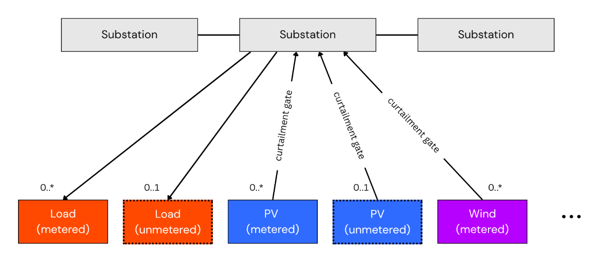

# Differentiable Physics (DP) for NGED

> **Status: 🚧 Planned / 🔬 Research.** None of this is implemented yet. This page explains the
> *method*; the plan for applying it lives in the roadmap. Phase 1 (capacity estimation for
> *metered* generators) is targeted at
> [roadmap v0.7](../roadmap/index.md#v07-dynamic-generator-capacity)
> and planned in [Capacity estimation](../roadmap/capacity-estimation.md); Phase 2
> (graph-structured disaggregation of net substation power into latent demand and DER generation)
> is [v2 research](../roadmap/index.md#v20-scale-up-future-research). Abnormal running
> arrangements and latent-demand recovery under switching are covered in their own canonical doc,
> [Switching events & latent demand](../roadmap/switching-events.md). The Python in this document
> is illustrative sketch code, not the implementation. See the
> [roadmap index](../roadmap/index.md) for status conventions.

This framework bridges pure machine learning with mechanistic domain knowledge to solve the
net-demand disaggregation problem across the National Grid Electricity Distribution (NGED) network.
It is the deep-dive behind two of the "innovative and unique" capabilities highlighted in the
Milestone 1 report: estimating the **dynamically changing effective capacity** of generators, and
natively handling **apparent-power (MVA) metering** and **unmetered generation**.

## How to read this document

The sections build up from the problem statement to the full system:

1. [The problem: unobserved demand & abnormal running arrangements](#1-the-problem-unobserved-demand-abnormal-running-arrangements) — what we are actually trying to recover, and why DP.
   - [DER tractability ranking](#der-tractability-ranking) — which DER types the method works for, and what to do with the hard ones.
2. [The core idea: inversion through a differentiable forward model](#2-the-core-idea-inversion-through-a-differentiable-forward-model) — the conceptual umbrella over everything below.
3. [The core building block: `DifferentiableSolarPlant`](#3-the-core-building-block-differentiablesolarplant) — modelling a single metered site.
4. [Scaling to aggregate fleets: `UniversalSolarFleetNode`](#4-scaling-to-aggregate-fleets-universalsolarfleetnode) — one node for many unmetered rooftops.
5. [Combining DP with the weather encoder](#5-combining-differentiable-physics-with-the-weather-encoder) — the fuller forecasting architecture.
6. [Scaling to the full grid: a graph-structured DP engine](#6-scaling-to-the-full-grid-a-graph-structured-dp-engine) — the full-grid v2 disaggregation engine.
7. [Handling abnormal running arrangements](#7-handling-abnormal-running-arrangements) — pointer to the canonical [switching events](../roadmap/switching-events.md) doc.
8. [Apparent-power (MVA) metering](#8-apparent-power-mva-metering) — reconstructing signed flow from magnitude-only meters.
9. [What already exists (prior art)](#9-what-already-exists-prior-art) — calibrating the novelty claim.
10. [Where this work is novel](#10-where-this-work-is-novel) — the publishable contribution.
11. [Technical architecture summary](#11-technical-architecture-summary) — the whole system on one page.
12. [Long-term vision: GB-wide inverse irradiance mapping](#12-long-term-vision-gb-wide-inverse-irradiance-mapping) — a research aspiration beyond v2.
13. [Evaluating disaggregation: a multi-pronged protocol](disaggregation-evaluation.md) — how to measure progress when there is no single clean ground truth.

How and when this method is *applied* — the two-pass capacity-estimation scheme, the capacity
regularisers, curtailment handling, and the phased rollout — is planned in
[Capacity estimation](../roadmap/capacity-estimation.md).

---

## 1. The problem: unobserved demand & abnormal running arrangements

What a substation meter records is not demand. It is **net power** — the sum of true underlying
demand minus behind-the-meter generation (rooftop PV, small wind, battery discharge) plus any
unregistered or poorly-metered embedded generation. The "latent, unobserved demand" is the load
that would be seen at the meter if all distributed energy resources (DERs) were removed. Recovering
that latent signal is the disaggregation problem.

Compounding this, each primary substation spends roughly **10% of its operating time in an abnormal
running arrangement** (ARA) — a state in which switching events reroute a block of load from its
normal parent substation to a neighbour, so the metered signal is structurally different from what
it would be under normal topology. NGED requires forecasts expressed **as if the network is always
in its normal running arrangement** — the latent demand under nominal topology, which is precisely
the quantity network planners need. The full problem statement lives in the background docs
([switching events](../background/switching-events.md),
[NGED's network](../background/network.md)); [forecast building
blocks](../roadmap/forecast-building-blocks.md) covers how the "normal running arrangement" target
is delivered.

The differentiable physics framework described below is a principled, end-to-end approach to
estimating this latent quantity and forecasting it.

### Why differentiable physics?

Pure black-box models (like standard neural networks or XGBoost) require vast amounts of data to
learn basic physical invariants and are prone to overfitting or hallucinating non-physical
behaviour. We inject a **Differentiable Physics (DP)** layer directly into our computational graph
for three core reasons:

- **Data and sample efficiency:** The model does not have to spend capacity re-learning solar
  geometry (where the sun is) or the shape of a turbine power curve (roughly cubic in wind speed
  between cut-in and rated, then flat to rated power, then zero beyond cut-out). The physics engine
  supplies these constraints for free, letting the ML components focus entirely on atmospheric and
  behavioural nuances.
- **True invertibility (inputs as parameters):** Because every operation in our physics engine
  preserves gradients, we can backpropagate errors all the way to the *inputs*. This lets us treat
  unobserved variables (like local irradiance) or system configurations as parameters that can be
  solved via gradient descent.
- **Interpretability:** Instead of inspecting uninterpretable latent layers, our system updates
  explicit physical parameters like tilt, azimuth, or capacity. This lets engineers immediately
  audit the model's assumptions.

### DER tractability ranking

Disaggregation works best where there is a **common observable exogenous driver** and
**homogeneous behaviour** across sites — conditions that let errors average out rather than
compound. The tractability ranking across DER types is:

| DER type | Tractability | Key reason |
|---|---|---|
| PV | Excellent | Irradiance-driven; panel behaviour is near-identical across sites; errors average out at fleet level |
| Wind | Good | Wind-speed-driven via a learnable power curve; more spatial heterogeneity than PV but still exogenous |
| Heat pumps | Intermediate | Temperature-driven with COP rolloff; heterogeneity partly averages out at substation aggregate level |
| EVs | Poor | No clean exogenous driver; behaviour is synchronised (school-run, cheap-rate charging), so errors compound rather than cancel; synchronised peaks are exactly what matters to the grid |
| Batteries | Very poor | Pure latent control — tariff/market-driven with no physical exogenous signal; two identical batteries sitting next to each other can dispatch in opposite directions simultaneously |

**Practical conclusion for v2 scope**: disaggregation targets PV (primary), wind (secondary), and
heat pumps (worth attempting at substation-aggregate level). For batteries, the right approach is
price-driven behavioural-clustering methods — the kind targeted by OCF's NESO "EDGE" project
proposal (currently blocked waiting for data, as of June 2026) — rather than physics-based disaggregation. For EVs,
honest publication requires wide uncertainty intervals and a clear caveat that the
synchronised-peak regime (precisely the regime NGED cares about most) is the hardest case.

---

## 2. The core idea: inversion through a differentiable forward model

The fundamental insight is to treat the meter reading as the output of a **forward model** that
takes latent demand and DER generation as inputs:

```text
observed_power(t) = latent_demand(t) − pv_generation(t) − wind_generation(t) − battery_net(t) + losses(t)
```

Each right-hand-side term is modelled explicitly:

- **`latent_demand(t)`** — what we want: a smooth, weather-driven, time-of-week-structured signal
  representing the true underlying load.
- **`pv_generation(t)`** — estimated from irradiance (from NWP and/or satellite) via a
  differentiable physics model of panel conversion efficiency (temperature and spectral correction,
  clipping at inverter limits). Panel capacity is a latent parameter estimated jointly.
- **`wind_generation(t)`** — estimated from wind speed via a differentiable power curve.
- **`battery_net(t)`** — handled via a state-space component with charge/discharge dynamics.
  *(A later / stretch component — battery disaggregation is a v2 stretch goal in the
  [roadmap](../roadmap/index.md#v20-scale-up-future-research).)*
- **`losses(t)`** — approximated as a smooth function of load level. *(Also a later refinement.)*

### Metered vs. unmetered DERs

A crucial distinction runs through the whole project: each generation term above is really the sum
of a **metered** and an **unmetered** part. NGED meters some large DERs directly — utility-scale
solar PV farms, large wind farms, grid-scale batteries — while a long tail of small DERs is
**unmetered** behind the substation: domestic rooftop PV, small distributed wind, home batteries
(and, strictly, EV chargers and heat pumps on the demand side). Written out in full, the forward
model is closer to:

```text
observed = latent_demand
           − (pv_metered + pv_unmetered)
           − (wind_metered + wind_unmetered)
           − (battery_metered + battery_unmetered)
           + losses
```

We keep the compact equation above for readability, but the model treats the two classes
differently:

- **Metered DERs** are modelled **per asset**. Because we know the site exists and have its own
  generation meter, we can fit explicit, physically-interpretable parameters for it — for a metered
  PV farm, that single site's panel **tilt**, **azimuth** and **effective capacity** (see the
  [single-site model](#3-the-core-building-block-differentiablesolarplant)). This is the
  **v0.7** deliverable — see [Capacity estimation](../roadmap/capacity-estimation.md).
- **Unmetered DER fleets** cannot be modelled as a single asset — a primary substation may sit above
  hundreds or thousands of rooftops with a mishmash of orientations. These are modelled as an
  **aggregate fleet node** via the physics-informed basis expansion in
  [`UniversalSolarFleetNode`](#4-scaling-to-aggregate-fleets-universalsolarfleetnode). Estimating and disaggregating
  the *unmetered* DERs is the harder, **v2** goal.

The forward model is **differentiable end-to-end**: every component is implemented in a
differentiable framework (JAX or PyTorch), so that gradients of the reconstruction error with
respect to all latent parameters and states can be computed and used for learning. Training
minimises the discrepancy between the forward model's output and the observed meter readings,
jointly optimising the latent demand representation and all DER parameters simultaneously. This is
the "inversion" step — running the forward model backwards, constrained by physics.

The key product is not just the DER estimates, but the latent demand signal itself — which can then
be used directly as the target for a standard probabilistic forecasting model, free from the
confounding effect of DERs.

---

## 3. The core building block: `DifferentiableSolarPlant`

We model each physical parameter as a learnable Normal distribution $\mathcal{N}(\mu, \sigma^2)$ — a mean-field variational posterior — and train with the reparameterisation trick (`rsample()`) so gradients flow through the sampling step.

Crucially, the training objective is an **ELBO**, not a bare reconstruction loss: a power-reconstruction term *plus* a KL term that pulls each posterior toward a fixed physical prior. The KL term is not optional. Minimising power error alone always rewards shrinking $\sigma \to 0$, so the parameter "uncertainty" we are trying to capture would simply collapse. The prior does double duty: it keeps the posterior spreads honest, and it injects weak domain knowledge (e.g. "panels point roughly south at a typical UK roof pitch") that regularises sites with little data.

Two practical details the ELBO must get right — both classic failure modes of hand-rolled variational inference:

- **The reconstruction term must be a proper likelihood, not a bare MSE.** Bare MSE silently assumes an observation-noise scale of 1 in whatever units the power happens to be in, which makes the balance between reconstruction and KL arbitrary — the posterior then either collapses onto the prior or ignores it, depending on nothing but the units. Use a Gaussian likelihood with a **learnable observation-noise scale** $\sigma_{\text{obs}}$ (see `negative_elbo` in the sketch).
- **Scale the KL for minibatches.** The KL term regularises the *whole-dataset* objective once, so on a minibatch it must be weighted by `batch_size / dataset_size` — otherwise the effective prior strength depends on the batching.

Three physics details the sketch gets right:

- **Irradiance transposition.** Plane-of-array (POA) irradiance is *not* GHI scaled by the angle of incidence — GHI already bakes in a cosine-of-zenith projection. We decompose the resource into beam, sky-diffuse and ground-reflected components (an isotropic sky model) and transpose each correctly. The beam term uses DNI (not GHI) projected by the angle of incidence.
- **DC and AC capacity.** The learnable `dc_capacity` is the DC nameplate in power units; POA is normalised by the reference irradiance (1000 W/m²) so that capacity falls out in MW at standard test conditions. `ac_capacity` is a separate learnable parameter that clips the inverter output via `torch.minimum` — a single plant clips hard, unlike [the fleet soft clip](#4-scaling-to-aggregate-fleets-universalsolarfleetnode).
- **Panel temperature derate.** Cell temperature sits above ambient in proportion to absorbed POA irradiance; efficiency then falls roughly linearly with temperature above 25 °C. The sketch adds a steady-state derate using two module-level constants; in the full variational model these become learnable posteriors — and the [subsection below](#panel-temperature) extends this to the broken-cloud effect.

Angle convention: azimuth is measured from due south, with east negative and west positive (east = −90°, south = 0°, west = +90°). Beware that this differs from [pvlib](https://pvlib-python.readthedocs.io/)'s convention (north = 0°, clockwise, in degrees); `pvlib-pytorch` should adopt pvlib's own convention and convert at the boundary — mismatched angle conventions are the classic silent bug in PV modelling.

One detail the sketch deliberately ignores — **interval averaging**. NWP and satellite irradiance are half-hourly *period means* (period-ending in our NWP schema), but the sketch evaluates the solar geometry at an instant. Over 30 minutes the sun's hour angle moves ~7.5°, and near sunrise/sunset the transposition is strongly non-linear, so evaluating at a single timestamp biases the fit. Worse, a timestamp-convention error (period-start vs period-end vs mid-point) masquerades as an azimuth shift that the optimiser will happily absorb into the fitted parameters. The fix is cheap: evaluate the geometry at ~5-minute sub-steps across each half-hour and average the modelled power to the metered interval — and unit-test the timestamp convention end-to-end before trusting any fitted azimuth.

Here's a quick Python code sketch of the rough idea for applying differentiable physics to solar:

```python
import torch
import torch.nn as nn
import torch.distributions as dist

STC_IRRADIANCE = 1000.0    # reference plane-of-array irradiance at standard test conditions (W/m^2)
GROUND_ALBEDO = 0.2        # typical broadband ground reflectance
STC_CELL_TEMP = 25.0       # cell temperature at standard test conditions (°C)
TEMP_COEFF_POWER = -0.004  # relative power loss per °C above STC for crystalline silicon (1/°C)
NOCT_TEMP_RISE = 0.03      # steady-state cell-temp rise per W/m² of POA (°C·m²/W)


class DifferentiableSolarPlant(nn.Module):
    """Differentiable physical model of a single metered solar site.

    Each physical parameter is a mean-field variational posterior N(mu, sigma^2).
    Training minimises `negative_elbo`: a Gaussian reconstruction likelihood (learnable
    observation noise) plus a KL term against a fixed prior (see `kl_divergence`). The KL
    term is what stops the posterior spreads from collapsing to zero under a pure
    reconstruction loss.

    Azimuth convention: measured from due south, east negative, west positive.
    """

    def __init__(self, prior_tilt: float, prior_azimuth: float, prior_dc_capacity: float, prior_ac_capacity: float) -> None:
        super().__init__()
        # Variational posteriors, each parameterised in an unconstrained space so no
        # gradient-breaking clamp is needed and the Normal posterior/prior stay
        # self-consistent: tilt in logit-space (squashed to (0, pi/2) in `forward`),
        # azimuth in radians, capacities in log-space (strictly positive).
        self.raw_tilt_mu = nn.Parameter(torch.special.logit(torch.tensor(prior_tilt) / (torch.pi / 2)))
        self.raw_tilt_log_std = nn.Parameter(torch.tensor(-2.0))

        self.azimuth_mu = nn.Parameter(torch.tensor(prior_azimuth))
        self.azimuth_log_std = nn.Parameter(torch.tensor(-2.0))

        self.log_dc_capacity_mu = nn.Parameter(torch.log(torch.tensor(prior_dc_capacity)))
        self.log_dc_capacity_log_std = nn.Parameter(torch.tensor(-2.0))

        self.log_ac_capacity_mu = nn.Parameter(torch.log(torch.tensor(prior_ac_capacity)))
        self.log_ac_capacity_log_std = nn.Parameter(torch.tensor(-2.0))

        # Observation-noise scale for the Gaussian reconstruction likelihood in
        # `negative_elbo`: learnable, in log-space to stay strictly positive.
        self.log_obs_noise = nn.Parameter(torch.tensor(0.0))

        # Fixed priors. Weakly-informative: "panels point roughly south at a UK roof pitch,
        # with a capacity near nameplate". These also keep the posterior spreads from collapsing.
        self.priors = {
            "raw_tilt": dist.Normal(torch.special.logit(torch.tensor(prior_tilt) / (torch.pi / 2)), torch.tensor(0.3)),
            "azimuth": dist.Normal(torch.tensor(prior_azimuth), torch.tensor(0.5)),
            "log_dc_capacity": dist.Normal(torch.log(torch.tensor(prior_dc_capacity)), torch.tensor(0.5)),
            "log_ac_capacity": dist.Normal(torch.log(torch.tensor(prior_ac_capacity)), torch.tensor(0.3)),
        }

    def posteriors(self) -> dict[str, dist.Normal]:
        """The current variational posterior for each physical parameter."""
        return {
            "raw_tilt": dist.Normal(self.raw_tilt_mu, self.raw_tilt_log_std.exp()),
            "azimuth": dist.Normal(self.azimuth_mu, self.azimuth_log_std.exp()),
            "log_dc_capacity": dist.Normal(self.log_dc_capacity_mu, self.log_dc_capacity_log_std.exp()),
            "log_ac_capacity": dist.Normal(self.log_ac_capacity_mu, self.log_ac_capacity_log_std.exp()),
        }

    def kl_divergence(self) -> torch.Tensor:
        """Sum of KL(posterior || prior) over all parameters — the regulariser in the ELBO."""
        q, p = self.posteriors(), self.priors
        return sum(dist.kl_divergence(q[key], p[key]) for key in q)

    def negative_elbo(
        self, predicted_power: torch.Tensor, observed_power: torch.Tensor, dataset_size: int
    ) -> torch.Tensor:
        """Minibatch training loss: Gaussian reconstruction likelihood + scaled KL.

        The KL term regularises the whole-dataset objective once, so on a minibatch it is
        weighted by batch_size / dataset_size — otherwise the effective prior strength
        would depend on how the data happens to be batched.
        """
        obs_noise = self.log_obs_noise.exp()
        log_lik = dist.Normal(predicted_power, obs_noise).log_prob(observed_power).sum()
        kl_weight = observed_power.numel() / dataset_size
        return kl_weight * self.kl_divergence() - log_lik

    def forward(
        self,
        dni: torch.Tensor,             # direct normal irradiance (W/m^2)
        dhi: torch.Tensor,             # diffuse horizontal irradiance (W/m^2)
        ghi: torch.Tensor,             # global horizontal irradiance (W/m^2)
        sun_zenith_rad: torch.Tensor,
        sun_azimuth_rad: torch.Tensor,
        air_temp: torch.Tensor,        # ambient air temperature (°C)
    ) -> torch.Tensor:
        """Predict DC power with steady-state temperature derate. All inputs and operations preserve gradients."""
        q = self.posteriors()

        # Reparameterised samples (one per forward pass). tilt is sampled in logit-space
        # and squashed to (0, pi/2) — a sigmoid, not a clamp, so gradients flow everywhere
        # and the sample stays consistent with the Normal posterior used in the KL.
        tilt = torch.sigmoid(q["raw_tilt"].rsample()) * (torch.pi / 2)
        azimuth = q["azimuth"].rsample()
        dc_capacity = q["log_dc_capacity"].rsample().exp()  # strictly positive by construction

        # Angle of incidence on the tilted plane.
        cos_aoi = (
            torch.cos(sun_zenith_rad) * torch.cos(tilt)
            + torch.sin(sun_zenith_rad) * torch.sin(tilt) * torch.cos(sun_azimuth_rad - azimuth)
        ).clamp(min=0.0)  # no beam contribution when the sun is behind the panel

        # Isotropic-sky transposition to plane-of-array (POA) irradiance.
        poa_beam = dni * cos_aoi
        poa_sky_diffuse = dhi * (1.0 + torch.cos(tilt)) / 2.0
        poa_ground = ghi * GROUND_ALBEDO * (1.0 - torch.cos(tilt)) / 2.0
        poa = poa_beam + poa_sky_diffuse + poa_ground

        # DC power: capacity is the nameplate at the reference irradiance, derated for cell temperature.
        cell_temp = air_temp + NOCT_TEMP_RISE * poa
        temp_derate = 1.0 + TEMP_COEFF_POWER * (cell_temp - STC_CELL_TEMP)
        dc_power = dc_capacity * poa / STC_IRRADIANCE * temp_derate
        ac_capacity = q["log_ac_capacity"].rsample().exp()
        return torch.minimum(dc_power, ac_capacity)

```

### Panel temperature

**Steady-state derate.** Cell temperature is not directly measured, and it is not a simple function of air temperature. On a hot, still, clear-sky summer day a panel can reach 60–70 °C — hot enough for efficiency to fall noticeably below its standard-test-condition (STC) value. What drives the cell above ambient is absorbed irradiance, moderated by convective cooling from wind. The standard Faiman relation captures this:

$$T_{\text{cell}} \approx T_{\text{air}} + \frac{\text{POA}}{U_0 + U_1\,v_{\text{wind}}}$$

Efficiency then falls roughly linearly with temperature above the 25 °C STC reference. The correction factor applied to DC output is:

$$\eta_T = 1 + \gamma\,(T_{\text{cell}} - 25\,^\circ\text{C})$$

with $\gamma \approx -0.004\,/\,^\circ\text{C}$ ($-0.4\,\%/^\circ\text{C}$) for crystalline silicon. The constant `NOCT_TEMP_RISE` in the sketch is $1/U_0$ with wind neglected — a useful simplification that removes the need for a wind-speed input in the code example. In the full variational model, $U_0$, $U_1$, and $\gamma$ become learnable posteriors with tight physical priors, exactly like `tilt`, `azimuth`, and `dc_capacity`; the two new inputs (air temperature and POA) are already available: NWP temperature from [the weather encoder](#5-combining-differentiable-physics-with-the-weather-encoder), and POA computed midway through the forward pass.

**Thermal-mass upgrade and the broken-cloud effect.** The steady-state model assumes the panel equilibrates to the current irradiance instantaneously. Real panels have thermal mass and lag by several minutes — and this is exactly what produces the *broken-cloud effect*: a panel emerging cool from beneath cloud cover is briefly more efficient than one that has been baking under a clear sky, so the power peak immediately after cloud clearance can transiently *exceed* the steady-state clear-sky peak. This is also why peak daily yield on a partly-cloudy summer day can occasionally beat that on a fully clear day.

Capture this by promoting cell temperature from an instantaneous quantity to a dynamic latent state — first-order relaxation toward the equilibrium temperature with a learnable thermal time constant $\tau$:

$$\frac{dT_{\text{cell}}}{dt} = \frac{T_{\text{eq}} - T_{\text{cell}}}{\tau}, \qquad T_{\text{eq}} = T_{\text{air}} + \frac{\text{POA}}{U_0 + U_1\,v_{\text{wind}}}$$

This is a state-space recurrence — the same pattern as the battery component in [§2](#2-the-core-idea-inversion-through-a-differentiable-forward-model).

**Resolution caveat.** The thermal time constant $\tau$ is on the order of minutes, and the cloud transients that drive the broken-cloud effect occur on the same sub-half-hourly timescale. Half-hourly-mean POA discards exactly the sub-grid variability the dynamic model needs. This upgrade therefore only earns its keep with higher-frequency irradiance inputs — satellite-derived irradiance at ~5-minute intervals, or sub-hourly metering — and the steady-state derate remains the right choice until that data is available.

---

## 4. Scaling to aggregate fleets: `UniversalSolarFleetNode`

A single tilt/azimuth pair cannot represent a "mishmash" of hundreds or thousands of rooftops. A fleet facing east, south and west produces a broad, flat "mound" of power, whereas a single south-facing parameter produces a sharp "hill". Used on a primary substation, the single-array model will fail to fit the wide shoulders of morning and evening generation.

We fix this with a **physics-informed basis expansion** rather than simulating every individual system. (Aggregate, unmetered fleets behind a primary are a Phase 2 / v2 concern — this node becomes one of the node types in [the graph-structured DP engine](#6-scaling-to-the-full-grid-a-graph-structured-dp-engine).)

### 1. The basis-function insight

Think of the fleet not as a physical simulation of thousands of houses but as a signal-reconstruction problem. The aggregate curve of many fixed-tilt systems is a linear combination of a few fundamental shapes. East, south and west span the space of fixed-tilt orientations: by mixing them (e.g. 30% east, 70% south) you can approximate almost any aggregate fixed-tilt curve, including SE/SW.

### 2. When to add a tracking basis

Single-axis trackers produce a flat-topped "top hat" shape that no mixture of fixed-tilt "bell curves" can reproduce. So *where trackers are present*, we add tracking as a fourth basis function. This matters mainly for **commercial / utility ground-mount** sitting behind a primary; domestic rooftop fleets are almost entirely fixed-tilt, so for a purely-domestic fleet the tracking weight should learn to ≈zero (or be dropped to save parameters).

### 3. Soft clipping for diverse inverters

A fleet contains many inverters of different sizes. An individual inverter hard-clips (a brick wall), but the *aggregate* clips softly: as irradiance rises the most undersized inverters saturate first, then the average ones, then the oversized ones — a smooth, curved shoulder rather than a sharp corner.

A `tanh` clip is tempting but wrong: `P_max · tanh(P / P_max)` already attenuates *mid-range* power (at `P = P_max` it returns only ≈0.76 `P_max`), so it biases the whole curve down, not just the shoulder. Instead use a **smooth-min** that stays roughly linear until the limit and only then rolls off:

$$\text{smin}(P, P_{\max}) = P_{\max} - \frac{1}{\beta}\,\operatorname{softplus}\!\bigl(\beta\,(P_{\max} - P)\bigr)$$

The learnable $P_{\max}$ is the effective aggregate inverter (AC) capacity; the learnable sharpness $\beta$ sets the curvature of the shoulder.

### 4. Implementation: `UniversalSolarFleetNode`

This upgrades the node to handle installed-capacity growth, orientation mix, tracking, and soft clipping in a single differentiable module. Note the division of labour: the softmax mix weights sum to 1, so the mixture alone is magnitude-free ("which way does the fleet face"); the magnitude ("how much is installed") is carried by a separate per-week capacity series, built as a cumulative sum of non-negative weekly increments so it is non-decreasing by construction — exactly the monotone representation from
[capacity estimation](../roadmap/capacity-estimation.md#unmetered-installed-capacity-grows-monotonically).

```python
import torch
import torch.nn as nn
import torch.nn.functional as F


class UniversalSolarFleetNode(nn.Module):
    """Aggregate solar fleet behind one substation: capacity growth + orientation mix + soft clip."""

    def __init__(self, n_weeks: int) -> None:
        super().__init__()
        # Installed DC capacity, tracked per week as a cumulative sum of non-negative
        # increments (installs only ever add capacity — see the capacity-estimation
        # roadmap page). An L1 penalty on the increments (not shown) pushes most weeks
        # to exactly zero growth, because installs arrive in occasional bursts.
        self.raw_capacity_increments = nn.Parameter(torch.full((n_weeks,), -2.0))

        # Orientation mix over [east, south, west, tracking], tracked per week because the
        # fleet composition drifts over time as new systems are installed.
        self.mix_logits = nn.Parameter(torch.zeros(n_weeks, 4))

        # Effective aggregate inverter (AC) capacity and the curvature of the clip shoulder.
        # Both pushed through softplus so they stay strictly positive.
        self.raw_inverter_capacity = nn.Parameter(torch.tensor(2.3))  # softplus(2.3) ~ 10
        self.raw_clip_sharpness = nn.Parameter(torch.tensor(0.0))

    def forward(
        self, sun_vec: torch.Tensor, weather: torch.Tensor, week_idx: torch.Tensor
    ) -> torch.Tensor:
        # 1. The four physical basis curves (ideal shapes from geometry + weather), each
        #    normalised to unit DC capacity.
        #    calc_fixed / calc_tracker would come from pvlib-pytorch (see section 5).
        #    Azimuth convention matches section 3: south = 0, east = -90, west = +90.
        p_east = self.calc_fixed(sun_vec, weather, azimuth_deg=-90.0)
        p_south = self.calc_fixed(sun_vec, weather, azimuth_deg=0.0)
        p_west = self.calc_fixed(sun_vec, weather, azimuth_deg=90.0)
        p_track = self.calc_tracker(sun_vec, weather)  # single-axis backtracking logic

        # 2. Mix the unit bases with this week's weights (the "asset identification"),
        #    then scale by this week's installed capacity — non-decreasing by construction.
        basis = torch.stack([p_east, p_south, p_west, p_track], dim=-1)
        weights = torch.softmax(self.mix_logits[week_idx], dim=-1)
        capacity = F.softplus(self.raw_capacity_increments).cumsum(dim=0)
        p_raw = capacity[week_idx] * (basis * weights).sum(dim=-1)

        # 3. Aggregate soft clip. Smooth-min stays ~linear until p_raw nears the limit,
        #    then rolls off — unlike tanh it does not suppress mid-range power.
        limit = F.softplus(self.raw_inverter_capacity)
        beta = F.softplus(self.raw_clip_sharpness) + 1e-3
        return limit - F.softplus(beta * (limit - p_raw)) / beta
```

---

## 5. Combining differentiable physics with the weather encoder

```text
+-------------------+
| Learnt parameters |
|     per site:     |
|                   |
|  • PV tilt        |                   +---------------+
|  • PV azimuth     |     <=======>     | pvlib-pytorch |----------+
|  • AC capacity    |                   +-------+-------+          |
|  • DC capacity    |                           ^                  |
|  • etc.           |                           |                  v
+-------------------+                           |           +-------------+
                                         +------+------+    |  multi-seq  |
                                         | Irradiance  |    |  alignment  |
                                         | Temperature |    |  with axial |---> [ p̂ ]
                                         +------+------+    |  attention  |
                                                ^           +-------------+
+--------------+     +-------------------+      |                  ^
| Weather data |---->|  weather encoder  |------+                  |
+--------------+     +-------------------+                  +------+------+
                                                            |   History   |
                                                            +-------------+
```

- **NWP bias** is handled by the **weather encoder**: "the weather model says it's cloudy, but historically this specific pressure pattern at this location means it's actually clear" (feature-level correction).
- **Physical constraints** are handled by the **differentiable physics**: "based on the corrected weather, the geometry of the sun and panel dictates $X$ power" (first-principles baseline).
- **Systematic / local anomalies** (the "unknown unknowns") are handled by the **retrieval / alignment** module: "on days that looked exactly like this in the past, the physics model consistently over-predicted the evening ramp-down by 5% because of that one tree on the horizon" (residual correction).

`pvlib-pytorch` is a planned Open Climate Fix open-source library — a differentiable, PyTorch-native port of [pvlib](https://pvlib-python.readthedocs.io/) — that we intend to spin out of this project. It would generalise the hand-rolled transposition and panel geometry in the [single-site](#3-the-core-building-block-differentiablesolarplant) and [fleet](#4-scaling-to-aggregate-fleets-universalsolarfleetnode) sketches into a reusable, tested component; treat those sketches as the prototype it grows from.

See also [Learned encoders](encoders.md) for the encoder modules themselves.

---

## 6. Scaling to the full grid: a graph-structured DP engine

The distribution network is fundamentally a topological graph, and we model it as one — but the graph is a **data structure**, not a trained graph neural network. Each substation is reconstructed as the sum of its own differentiable-physics modules (gross demand, metered/unmetered PV, metered/unmetered wind), whose latent parameters — most importantly each module's capacity — are inferred directly from that substation's metered power and the local weather. The components are separable because each has a distinct exogenous driver and temporal signature (PV tracks irradiance, wind tracks wind speed, demand tracks time-of-week and temperature), so **no message passing is required** to pull them apart. The graph carries the structural prior — which substations can exchange load, which sit near which weather — and a hard Kirchhoff balance closes the books. This mirrors the schematic in the [Milestone 1 report (Fig. 10)](https://docs.google.com/document/d/1UF-mjfSdQfQxefAunDqEOr_GyYTjSlGk4EeuiNoXAxk/edit?tab=t.0#heading=h.ot06ofd0lqes):



### Node definitions

Following the report's schematic, the graph uses the following node types:

1. **Substation nodes** — the measured, net blended power flow at a primary substation (the main target constraint).
2. **Metered load nodes** — demand that NGED meters directly, where such metering exists.
3. **Gross demand nodes** — the underlying, unmetered consumer load, inferred by the model. Implemented as a `BasisLoadNode`: a shared MLP learns a small set of universal demand-profile shapes (e.g. residential, commercial, light-industrial) as functions of time-of-day, day-of-week, and temperature; each substation carries a local "style vector" of mixing weights that describes its particular customer mix. The universal basis curves are shared across all substations; only the style vector is site-specific, so the model can distinguish a residential suburb from an industrial estate without re-learning basic human demand patterns from scratch at each site.
4. **Metered PV / Wind nodes** — generators with dedicated, live generation metering.
5. **Unmetered PV / Wind fleet nodes** — aggregated behind-the-meter (BTM) solar and distributed wind, grouped by location, with no direct metering. PV fleets are each implemented as a [`UniversalSolarFleetNode`](#4-scaling-to-aggregate-fleets-universalsolarfleetnode); wind fleets get their own analogous node type, with a shared learnable aggregate power curve in place of the orientation-mix bases (a turbine fleet has no tilt/azimuth to mix).
6. **Heat pump nodes** (v2 stretch) — heat pump demand exhibits a distinctive J-curve: as temperatures fall, heating demand rises, but aggregate COP also falls, so electricity draw grows super-linearly with cold. This non-linearity cannot be captured by treating temperature as a plain regression feature — it requires an explicit COP-rolloff function. A `HeatPumpNode` models this: it takes ambient temperature, applies a learned COP curve, and outputs the net electricity demand attributable to heat pumps. Contributes to gross demand at substations with significant residential or commercial heat pump penetration.

Each generation node feeds the substation through a **curtailment gate**: a separate multiplicative factor, driven by NGED's ANM/curtailment data feed, that represents network-enforced reductions. Keeping curtailment in its own gate (rather than inside the capacity parameter) is what lets the effective-capacity estimate stay a clean measure of physical availability — see
[Capacity estimation](../roadmap/capacity-estimation.md) and Fig. 10.

### The fusion mechanism

Spatial weather correlations (e.g. if it is raining at Substation A, the adjacent Unmetered PV Fleet B is probably cloudy too) are already supplied by the **gridded NWP** each node consumes — they do not need to be re-learned by message passing. Where cross-site information genuinely helps the under-determined per-site fit, it enters as **hierarchical parameter sharing**, not message passing: the unmetered-fleet and demand nodes share a small set of universal basis shapes ([`UniversalSolarFleetNode`](#4-scaling-to-aggregate-fleets-universalsolarfleetnode); `BasisLoadNode` above), with only a per-site *style vector* learned locally. Each node's DP modules compute explicit physical generation, and a hard Kirchhoff balance node then aggregates the elements:

$$\text{Net substation flow} = \text{Gross demand} - \gamma_{\text{PV}}\,(\text{PV}_{\text{metered}} + \text{PV}_{\text{unmetered}}) - \gamma_{\text{wind}}\,(\text{Wind}_{\text{metered}} + \text{Wind}_{\text{unmetered}})$$

where the $\gamma$ terms are the per-asset curtailment gates. The error between predicted and measured substation flow produces a gradient that flows back through the shared and per-site parameters, optimising them and the physical parameter posteriors simultaneously.

A trained, message-passing GNN remains an **optional escalation**, not the baseline: if measured residuals ever show that explicit message passing would recover structure that gridded NWP and hierarchical priors miss, it can be added deliberately at that point. The same graph also underpins switching-event handling, where it is likewise used only as a data structure — see [Switching events & latent demand](../roadmap/switching-events.md), Part 2.

---

## 7. Handling abnormal running arrangements

> **Status: 🔬 v2 research.** Moved to its own canonical doc.

Abnormal running arrangements (ARAs) — where switching events reroute load between substations, so
the metered signal no longer reflects the normal running arrangement — are covered in their own
canonical doc: **[Switching events & latent demand](../roadmap/switching-events.md)**.

In brief: the v0.6 stage detects switching events with unsupervised statistics on the power series;
the v2 stages reconstruct the latent demand each substation would have metered under the normal
running arrangement, using a time-varying **mixture over the neighbourhood graph** (optionally
type-resolved into demand / PV / wind, each a differentiable-physics module as in [the graph-structured DP engine](#6-scaling-to-the-full-grid-a-graph-structured-dp-engine)). Two points
matter for consistency with the rest of this document:

- The graph is a **data structure** — who can exchange load with whom — *not* a trained GNN.
- Conservation is a **node-level flow balance** across a 2–3-way fan-out (a source's loss absorbed
  by a subset of neighbours whose pickups sum to it), *not* a pairwise equal-and-opposite transfer.

An earlier sketch here proposed a discrete "switching state-space model" over per-feeder *load
blocks*. That formulation is **retired**: NGED's network is meshed and run radially with movable cut
points, so there is no stable, re-identifiable feeder unit to discover and route (see
[switching-events.md, Part 4](../roadmap/switching-events.md)). The output — topology-normalised
latent demand — remains the
[NGED-required target variable](#1-the-problem-unobserved-demand-abnormal-running-arrangements).

---

## 8. Apparent-power (MVA) metering

Some substations are metered only in apparent power (MVA), which reports the *absolute value* of flow and so cannot distinguish import from export — when embedded generation pushes power back into the grid, an MVA trace "bounces" off zero instead of going negative. Because the DP framework reconstructs signed demand and generation explicitly, it handles this natively: we compare the measured MVA reading against the *magnitude* of the reconstructed net flow,

$$\text{MVA}_{\text{measured}} \approx \bigl|\,\text{Net substation flow}\,\bigr|$$

(assuming near-unity power factor). The physics grounds the model so that a sunny-day "bounce" is correctly attributed to reverse power flow from generation, not to a spike in demand. This is one of the two capabilities the Milestone 1 report highlights for DP — the other being unmetered disaggregation.

Two implementation cautions:

- **The magnitude loss needs smoothing.** $|x|$ is non-differentiable at zero and its gradient flips sign there — exactly where the bounce lives. Compare against a smoothed magnitude, e.g. $\sqrt{x^2 + \epsilon}$, and add a temporal-continuity prior on the *sign* of the reconstructed flow: flow direction persists for hours, it does not flicker half-hour to half-hour.
- **The near-unity power-factor assumption is weakest precisely at the bounce.** As real power passes through zero, reactive power dominates the measured magnitude, so the MVA trace has a soft *floor* above zero rather than a clean reflection. Expect the reconstruction to under-fit the bottom of the bounce, and do not let the optimiser explain the floor with phantom demand.

---

## 9. What already exists (prior art)

The component ideas each have precedent, which is important for calibrating the novelty claim.

**Behind-the-meter PV and load disaggregation** is a mature subfield. There is substantial published
work on separating net load into behind-the-meter PV and native demand, including spatiotemporal GNN
approaches where nodes are net-load measurements at neighbouring units and message passing encodes
spatial correlation. Unsupervised methods that leverage the irradiance–PV correlation without any
physical model also exist. "GNN over neighbouring nodes for net-load → PV + load disaggregation" is,
by itself, a known approach.

**Physics-informed neural networks for PV generation** are established. There is prior work on
differentiable physics mapping weather to PV power, and at least one patent on unsupervised solar
disaggregation using a physics-based irradiance-to-power model as the inversion constraint.

**Switching state-space machinery** exists off the shelf. Recurrent switching linear dynamical
systems (rSLDS; Linderman, Johnson et al., AISTATS 2017) and explicit-duration variants (RED-SDS) are
standard tools for unsupervised segmentation of multivariate time series into discrete latent modes.
We considered this machinery for ARA handling but did **not** adopt it: it presumes a discrete,
re-identifiable switching unit (a per-feeder "block") that NGED's meshed, radially-run network with
movable cut points does not possess (see
[switching-events.md, Part 4](../roadmap/switching-events.md)). Our chosen formulation is the
continuous neighbourhood mixture described there.

**Topology and switch-state identification** has been studied, but overwhelmingly using voltage
measurements. NGED does not currently provide us with voltage at primary substation level. And, we
have discussed the idea of using voltage with NGED, and there are two deal-breakers for using
voltage for topology identification: 1. Voltage often changes as a result of tap-changes on
transformers and, more importantly, 2. Those voltage changes as a result of tap-changes _could_ be
used to infer topology but ONLY IF we had high-temporal resolution data (on the order of 1 Hz). But
we only have half-hourly data, which blurs that info.

---

## 10. Where this work is novel

The novelty lies in the **combination and problem framing**, not in any single component:

**1. Switching events as the primary disaggregation target, not an afterthought.** Existing
disaggregation literature treats the network topology as fixed and known. The ARA problem — where the
topology itself is a latent variable that flips over timescales of minutes to months — has not been
addressed in the disaggregation literature. This is not a minor extension; it changes the structure
of the inference problem fundamentally.

**2. Power conservation as the cross-node inference signal.** Prior spatial-disaggregation work uses
spatial correlation as a soft prior. Here the graph edges carry a hard physical constraint: rerouted
power is conserved across the affected neighbourhood as a **node-level flow balance** (a source's
loss is absorbed by a subset of neighbours whose pickups sum to it). This is a stronger and more
principled basis for cross-node inference than learned message passing.

**3. Joint estimation of latent demand, DER parameters, and routing state.** Existing approaches
treat the topology as known, or the DER parameters as known, or the load as known, and estimate one
unknown from the others. The joint inference problem — all three unknowns simultaneously, end-to-end
differentiable — has not been cleanly tackled at this level of the distribution network.

**4. The target variable is operationally defined by the DNO's requirement.** Framing the output as
"demand under normal running arrangement" is not just a modelling convenience — it is the variable
that network operators actually need for planning and forecasting. This operational grounding,
combined with the open evaluation protocol (rigorous, reproducible, multi-DNO leaderboards), is the
publishable contribution that distinguishes OCF's approach from prior academic work.

**5. Application at primary substation resolution with half-hourly data.** The bulk of prior work
operates at GSP/DNO-region scale (e.g. Sheffield Solar's PV Live) or at individual household level
(NILM). The primary substation level — aggregating hundreds of customers, but below the GSP — is the
level at which DER invisibility is operationally critical, and it is the level at which NGED's data
exists. Systematic, open benchmarking at this resolution does not yet exist.

**6. Real-power-only inference — the "no-voltage" constraint as a novelty claim, not just a
limitation.** As [the prior art review](#9-what-already-exists-prior-art) notes, existing topology and switch-state identification work relies
overwhelmingly on voltage measurements, which NGED does not provide at primary substation level
(many primaries lack voltage metering; tap-changers shift voltage independently of load; and
half-hourly data smooths over voltage transients). This work therefore demonstrates that the
switching inference problem is solvable from real-power balance alone. Framing this as a
contrarian design choice — not a regrettable data gap — inverts the standard assumption and is
itself a publishable contribution.

---

## 11. Technical architecture summary

| Layer | Component | Role |
|---|---|---|
| **Graph** | Primary substations as nodes; reconfigurable boundaries as edges (a data structure, not a GNN) | Structural prior on which substations can exchange load |
| **Forward model** | Differentiable physics (irradiance → PV, wind speed → wind power, state-space battery) | Converts latent demand + DER params → predicted meter reading |
| **Reconstruction loss** | Squared residual, summed over nodes and time | Drives joint inversion of latent demand and DER parameters |
| **Cross-site coupling** | Hierarchical parameter sharing (shared basis + per-site style vector) + hard Kirchhoff balance | Borrows statistical strength across sites without message passing |
| **ARA handling** | Time-varying neighbourhood mixture with node-level flow balance — see [switching-events.md](../roadmap/switching-events.md) | Reconstructs latent demand under the normal running arrangement |
| **Output** | Latent demand under nominal topology, per substation, per half-hour | Target variable for downstream probabilistic forecasting |
| **Forecast layer** | XGBoost or neural sequence model on cleaned latent demand | Produces 14-day probabilistic forecasts in NGED-required format |

---

## 12. Long-term vision: GB-wide inverse irradiance mapping

Once the v1 architecture has calibrated, parameter-verified "virtual sensors" across the metered fleet, we can run the inversion trick at scale. Freezing the calibrated asset parameters and running gradient descent *backward* through the DP modules — from measured generation to the weather inputs — recovers a surface-irradiance estimate (and, for wind, a wind-speed estimate) **at each metered site**. These point estimates are sparse virtual observations; a spatial interpolation step (e.g. graph-based or geostatistical) then fills in a denser field across Great Britain. The result would be a half-hourly, physics-validated weather product, independent of the NWP, useful as a cross-check for real-time grid balancing. This is a research aspiration well beyond v2, and the density of the recovered field is fundamentally limited by the spatial coverage of the metered fleet.

See [Evaluating disaggregation: a multi-pronged protocol](disaggregation-evaluation.md).
