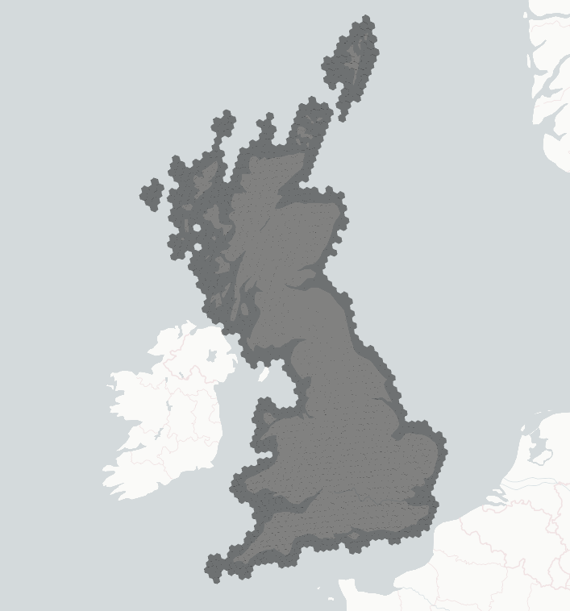

# Dynamical Data Package

Download & process numerical weather predictions from Dynamical.org.

We convert the ECMWF ENS 0.25 degree data to these H3 resolution 5 hexagons:



> **Note:** The generic geospatial logic for mapping latitude/longitude grids to H3 hexagons lives
> in the `packages/geo` package. This package (`dynamical_data`) focuses specifically on the
> ingestion, processing, and storage of time-varying NWP datasets like ECMWF. The H3 grid weights
> arrive as a Dagster asset from the `geo` package, so no precomputed static file is needed.

## Data storage experiments

The storage format itself lives in `delta_store.nwp` (writer properties, sort order, precision);
this section records the measurements behind it. Full before/after detail is in
[PR #271](https://github.com/openclimatefix/nged-substation-forecast/pull/271); earlier
experiments (UInt8/Int16 affine quantisation, codec and sort-order sweeps) are in this file's
git history. The same measure-before-you-optimise approach, and the NWP and `power_forecasts`
storage numbers side by side, are summarised in [Performance and
Scale](https://openclimatefix.github.io/nged-substation-forecast/architecture/performance/#storage-formats-measured-not-assumed),
which frames both tables' storage choices as an instance of [design principle 12, measure; do not
assume](https://openclimatefix.github.io/nged-substation-forecast/design-philosophy/design-principles/#12-measure-do-not-assume).

**Current scheme:** physical-unit `Float32`, every continuous variable rounded to a 13-bit
significand (max relative error 2⁻¹³ ≈ 1.2×10⁻⁴ — measured ≤ 0.004 °C for temperature, ≤ 8 Pa
for MSL pressure), rows sorted `init_time → ensemble_member → valid_time → h3_index`, plain
ZSTD level 3.

**How much space does GB-wide ECMWF ENS take?** One daily run (1,671 H3 cells × 51 members ×
85 lead times, up to ~7.24M rows) averages ~158 MB, so a year is **~58 GB**. The full local
development table — 899 daily runs (Apr 2024 → Sep 2026, ~6.5 billion rows) — is **142 GB**.

**Storage** (nine real partitions spread across every season). **The table compares writer
configurations, not row-group layouts** — every row was measured at parquet's default row-group
size, and `delta_store.nwp` now sizes each row group to one ensemble member, which is what the
~158 MB average above reflects:

| Config | avg MB/partition | extrapolated GB/yr |
|---|---:|---:|
| Previous: Int16 12-bit quantisation, ZSTD-14 | 115.3 | 42.1 |
| Float32 + 13-bit significand, ZSTD-3 | 110.6 | 40.4 |
| **Adopted: same + member-early sort** | **112.9** | **41.2** |
| Same + `BYTE_STREAM_SPLIT` | 133.8 | 48.8 |

`BYTE_STREAM_SPLIT` makes this table *worse* (unlike `power_forecasts`, where it wins):
significand rounding collapses NWP values into repeats that parquet's default dictionary+RLE
encoding captures directly, and `BYTE_STREAM_SPLIT` scatters that repetition across four byte
planes. Writer properties are data-dependent — measure per table.

**Read path** — the member-early sort puts each ensemble member's rows in one contiguous block,
and `delta_store.nwp` sizes each parquet row group to hold exactly one member, so a single-member
read (every training run reads just the control member) matches one row group's min/max range and
skips the other 50. Measured against a `valid_time`-first sort on a real 29-day, 9-cell,
control-member collect, both arms freshly written through `write_nwp` and timed warm-cache as the
median of five runs: **5.7× faster and 5.5× less peak memory** (170 ms / 2,200 MB → 30 ms /
400 MB), for a **3.7% storage cost** (4.35 GB → 4.51 GB across the 29 partitions).

**The read decodes 1.96% of each partition — one row group in 51 — and that holds for every
member.** A census of partitions from 2024, 2025, and 2026 found 51 row groups in each, every one
spanning a single member and the 51 together covering members 0 to 50, so no member pays for being
in the middle of the range. Under the `valid_time`-first sort the same read decodes 100%.

Both figures are local-disk measurements. On S3 a skipped row group also skips a network range
request, so they are a floor rather than a transfer.

```python
# Two arms, one partition window, differing only in NWP_SORT_COLS; the second monkeypatches
# delta_store.nwp.NWP_SORT_COLS to ("init_time", "valid_time", "ensemble_member", "h3_index").
# Time each arm in its own process: ru_maxrss is a high-water mark that never falls, so two arms
# in one process report the larger figure twice.
frame = (
    Nwp.scan_delta(table)
    .filter(
        pl.col("init_time").is_between(window_start, window_end),
        pl.col("valid_time").is_between(window_start, window_end + timedelta(days=10)),
        pl.col("h3_index").is_in(cells),          # the 9 cells the V1 series sit in
        pl.col("ensemble_member").is_in([0]),     # is_in, not ==, as load_engineering_inputs does
    )
    .collect(engine="streaming")
)
```

**Per-variable keep_bits: considered and rejected (2026-07).** Since Dynamical's upstream
precision caps the real information at 7–12 significand bits per variable, budgets matched to
upstream would compress better than the uniform 13. Measured on four seasonal partitions through
the exact production write path (error columns = error *added* on top of today's stored
values; wind speed's power impact is ~3× its relative error because the speed-to-power curve
is roughly cubic):

| Config | Size vs today | GB/yr | wind speed rel err | → power (×3) | temp | MSL |
|---|---:|---:|---:|---:|---:|---:|
| Uniform 13 (today) | — | 41.1 | 0 | 0 | 0 | 0 |
| Upstream-matched (temp 8, wind 7, pressure 12, flux 8) | −19.4% | 33.1 | 0.76% | 2.3% | 0.06 °C | 16 Pa |
| Uniform 10 | −15.6% | 34.7 | 0.10% | 0.29% | 0.016 °C | 64 Pa |
| Wind-protected (wind speed stays 13, rest squeezed) | −13.0% | 35.7 | 0 | 0 | 0.06 °C | 16 Pa |

The full squeeze adds ~2.3% power-equivalent wind error — not tolerable. The wind-safe ceiling
is −13% ≈ 5.4 GB/yr, and the NWP table is GB-wide so it does **not** grow with the V2
scale-up to ~2,500 time series: a fixed ~5 GB/yr saving doesn't justify maintaining a dict of
per-variable precision budgets. If disk ever becomes a real constraint, the wind-protected
config is the one to reach for.

**Why round at all, when Dynamical.org already rounds?** Dynamical stores ECMWF ENS with
6–11 mantissa bits per variable (their
[`binary_rounding.py`](https://github.com/dynamical-org/reformatters/blob/main/src/reformatters/common/binary_rounding.py)).
But trailing zeros do not survive arithmetic: our H3 aggregation is a weighted mean over grid
points, and wind speed/direction are derived from their u/v via `sqrt`/`arctan2`, so by the
time values reach our writer their mantissas are full entropy again (measured: 100% of
Dynamical-style rounded values have zeroed low bits; after a weighted mean, 0.07% do). Our
13-significand-bit rounding restores compressibility while being 1–6 bits *finer* than the
upstream precision, so it discards almost nothing beyond what Dynamical already dropped.
