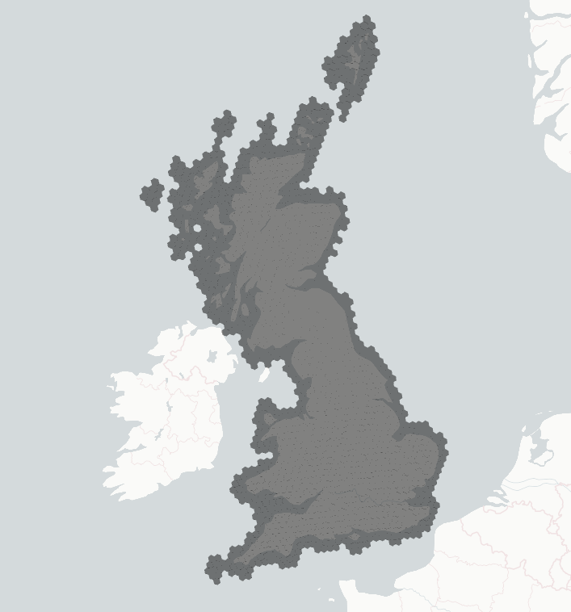

# Geo Package

This package contains generic geospatial logic and data for the NGED substation forecast project.

## Contents

- `geo.h3`: H3-related utilities, including grid weight computation.
- `geo.assets`: Dagster assets for the UK boundary and H3 grid weights.
- `assets/`: Generic geospatial assets like GeoJSON files.

## Purpose

The `geo` package is designed to decouple generic geospatial operations from dataset-specific ingestion logic (e.g., ECMWF data processing in `dynamical_data`). This ensures that any package in the workspace can perform spatial transformations, such as mapping latitude/longitude grids to H3 hexagons, without depending on heavy or unrelated packages.

## Key Features

- **H3 Grid Mapping**: Utilities to map regular latitude/longitude grids to H3 hexagons.
- **Dagster Assets**: Provides `uk_boundary` and `gb_h3_grid_weights` assets for use in the main forecasting pipeline.
- **Parameterization**: Functions are parameterized to support different grid sizes (e.g., 0.25-degree vs. 1km) and H3 resolutions.
- **Data Contracts**: Uses Patito contracts (defined in `packages/contracts`) like `H3GridWeights` to ensure strict validation of spatial mapping data.
